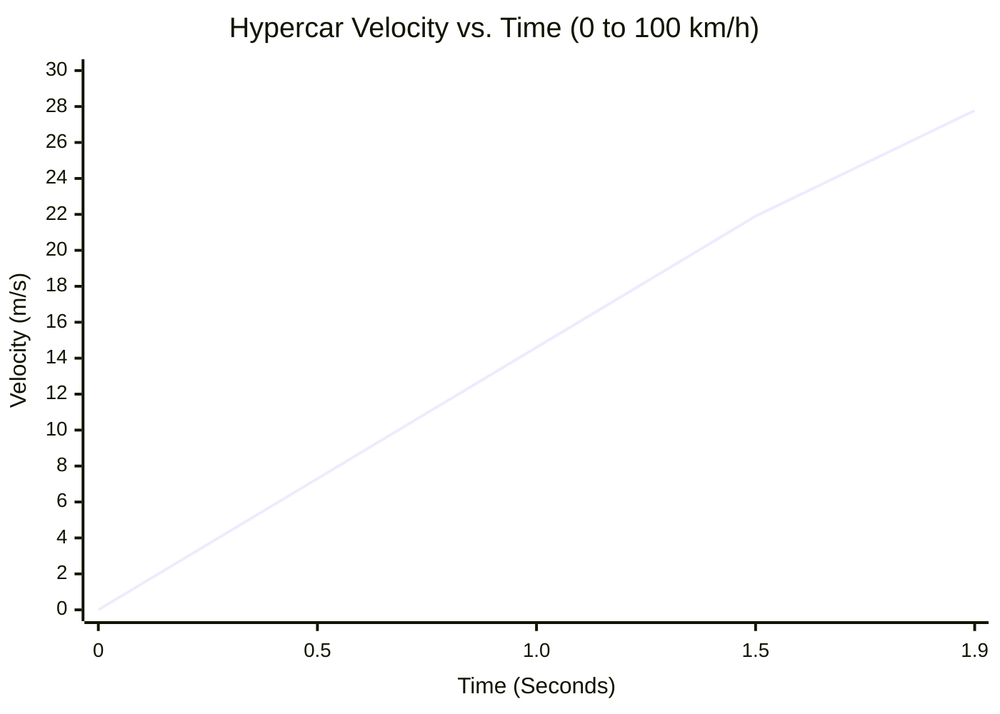
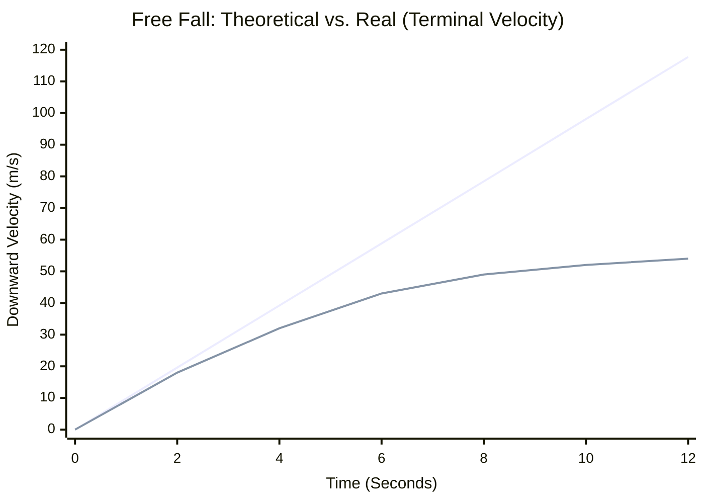
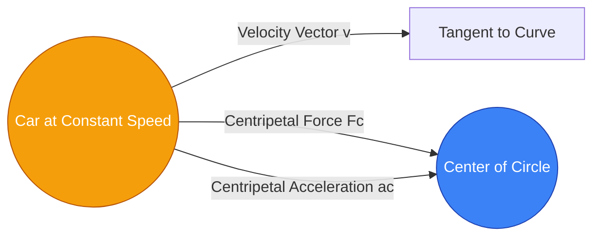

# Der Ultimative Beschleunigungsrechner: G-Kraft, Geschwindigkeitsänderung und Kinematik meistern

Willkommen beim ultimativen **Beschleunigungsrechner** und umfassenden Physik-Leitfaden. Ob Sie ein Automobilingenieur sind, der den 0-100-km/h-Sprint eines Hypercars berechnen möchte, ein Student, der sich auf eine Kinematik-Prüfung vorbereitet, oder ein Luftfahrtenthusiast, der neugierig auf die erdrückenden G-Kräfte von Kampfpiloten ist – dieses Tool ist für Sie konzipiert.

Beschleunigung ist der Motor der Veränderung in der physikalischen Welt. Es ist der aufregende Druck, den Sie während eines Achterbahnstarts in der Brust spüren, und die gewaltige Bremskraft, die Ihnen bei einem Autounfall das Leben rettet. In diesem massiven Leitfaden mit über 4.000 Wörtern werden wir die Beschleunigung vollständig entmystifizieren. Wir werden die mathematischen Grundlagen der Kinematik erforschen, den Unterschied zwischen gleichmäßiger und veränderlicher Beschleunigung aufschlüsseln, Sie durch die Nutzung unseres interaktiven Rechners führen und fünf realitätsnahe konzeptionelle Beispiele durchgehen, die mit detaillierten Mermaid.js-Diagrammen visualisiert werden.

---

## 1. Die menschliche Erfahrung von Beschleunigung

Bevor wir in die Mathematik eintauchen, ist es wichtig zu verstehen, wie Menschen Beschleunigung erleben. Als biologische Organismen sind wir für konstante Geschwindigkeiten völlig blind. Wenn Sie in einem Hochgeschwindigkeitszug sitzen, der bei geschlossenen Fenstern vollkommen ruhig mit 300 km/h fährt, könnten Sie problemlos eine Tasse Kaffee einschenken. Ihr Körper fühlt sich an, als stünde er völlig still.

Was Menschen *spüren* können, ist die **Beschleunigung** – die Änderungsrate dieser Geschwindigkeit. Wenn der Hochgeschwindigkeitszug den Bahnhof verlässt, spüren Sie, wie Sie in Ihren Sitz gedrückt werden. Wenn er bremst, werden Sie nach vorne geworfen. Unser Innenohr (das Vestibularsystem) ist im Grunde ein hochempfindlicher, dreidimensionaler biologischer Beschleunigungsmesser.

### Warum Beschleunigung im Ingenieurwesen wichtig ist
In der Welt des Ingenieurwesens ist die Bewältigung der Beschleunigung oft wichtiger als das Management der Höchstgeschwindigkeit.
- **Automobilindustrie:** Die Entwicklung von Antiblockiersystemen (ABS) ist eine Übung zur Maximierung der negativen Beschleunigung (Verzögerung), ohne die Haftreibung zu durchbrechen.
- **Luft- und Raumfahrt:** Ein Space Shuttle muss 28.000 km/h erreichen, um die Erde zu umkreisen. Wenn es jedoch zu schnell beschleunigt (über 3g), werden die Astronauten ohnmächtig und der immense aerodynamische Druck (Max Q) reißt das Fahrzeug auseinander.
- **Architektur:** Wolkenkratzer und Hängebrücken sind nicht nur dafür ausgelegt, Gewicht zu tragen, sondern auch lateraler Beschleunigung standzuhalten, die durch Sturmwinde und Erdbeben verursacht wird.

---

## 2. Die Kernmathematik: Skalare, Vektoren und Gleichungen

In der Physik ist die Beschleunigung ($a$) definiert als die Rate, mit der ein Objekt seine Geschwindigkeit über die Zeit ändert. Da die Geschwindigkeit ein **Vektor** ist (was bedeutet, dass sie sowohl einen Betrag als auch eine Richtung hat), ist die Beschleunigung ebenfalls ein Vektor.

Dies führt zu einer entscheidenden Erkenntnis: **Sie können beschleunigen, ohne jemals Ihr Tempo (Speed) zu ändern.**
Wenn Sie mit Ihrem Auto mit einer konstanten Geschwindigkeit von 50 km/h in einem perfekten Kreis fahren, ändert sich Ihre vektorielle Geschwindigkeit (Velocity) ständig, da sich Ihre *Richtung* ständig ändert. Daher befinden Sie sich in einem Zustand kontinuierlicher Beschleunigung (speziell Zentripetalbeschleunigung, die Sie in Richtung Kreismitte drückt).

### Die grundlegende Gleichung der durchschnittlichen Beschleunigung
Die grundlegendste algebraische Definition der durchschnittlichen Beschleunigung ist die Änderung der Geschwindigkeit ($\Delta v$) geteilt durch die Änderung der Zeit ($\Delta t$):

$$ a = \frac{v_f - v_i}{t} $$

Wobei:
- **$a$** = Beschleunigung
- **$v_f$** = Endgeschwindigkeit
- **$v_i$** = Anfangsgeschwindigkeit
- **$t$** = Zeitdauer

### Die vier kinematischen Gleichungen (für gleichmäßige Beschleunigung)
Wenn die Beschleunigung konstant (gleichmäßig) ist, wie beispielsweise bei einem Objekt im freien Fall nahe der Erdoberfläche (Luftwiderstand vernachlässigt), können wir die vier klassischen kinematischen Gleichungen verwenden, um nach jeder fehlenden Variable aufzulösen:

1. **Lösen nach der Endgeschwindigkeit:**
   $$ v_f = v_i + a \cdot t $$
2. **Lösen nach der Verschiebung (Strecke) ohne Endgeschwindigkeit:**
   $$ d = v_i \cdot t + \frac{1}{2} a \cdot t^2 $$
3. **Die zeitlose Gleichung (Lösen nach Endgeschwindigkeit ohne Zeit):**
   $$ v_f^2 = v_i^2 + 2 \cdot a \cdot d $$
4. **Lösen nach Verschiebung ohne Beschleunigung:**
   $$ d = \left(\frac{v_i + v_f}{2}\right) \cdot t $$

Unser fortschrittlicher Rechner nutzt alle diese Gleichungen dynamisch. Sie geben einfach die bekannten Variablen ein, und die Backend-Engine des Rechners entscheidet, welche Gleichung zur Ermittlung der fehlenden Daten angewendet werden muss.

---

## 3. Umfassende Bedienungsanleitung: Das Potenzial des Rechners maximieren

Unser interaktiver Beschleunigungsrechner ist mit einer Dual-Mode-Benutzeroberfläche ausgestattet, um sowohl schnelle alltägliche Berechnungen als auch komplexe Physik-Hausaufgaben zu bewältigen. Hier erfahren Sie, wie Sie ihn effektiv nutzen.

### Schritt 1: Wählen Sie Ihr Berechnungsziel
Wählen Sie oben im Dashboard aus, wonach Sie auflösen möchten:
- **Beschleunigung (a):** Wählen Sie dies, wenn Sie wissen, wie schnell ein Objekt gestartet ist, wie schnell es am Ende war und wie lange es gedauert hat.
- **Endgeschwindigkeit (vf):** Wählen Sie dies, wenn Sie die Startgeschwindigkeit eines Fahrzeugs, seine Beschleunigungsrate und die verstrichene Zeit kennen.
- **Anfangsgeschwindigkeit (vi):** Wählen Sie dies, wenn Sie die Endgeschwindigkeit kennen und rückwärts arbeiten möchten, um herauszufinden, wie schnell es ursprünglich war.
- **Zeit (t):** Wählen Sie dies, wenn Sie wissen müssen, wie lange ein Fahrzeug braucht, um bei einer bestimmten Beschleunigungsrate eine Zielgeschwindigkeit zu erreichen.

### Schritt 2: Werte eingeben und Einheiten verwalten
Im Gegensatz zu herkömmlichen Rechnern müssen Sie Ihre Einheiten nicht im Voraus umrechnen.
- Sie können die Anfangsgeschwindigkeit in **mph**, die Endgeschwindigkeit in **km/h** und die Zeit in **Minuten** eingeben.
- Die Umrechnungs-Engine des Rechners normiert alle Eingaben sofort auf SI-Einheiten (Meter und Sekunden), führt die physikalische Berechnung durch und gibt das Ergebnis aus.
- Zu den Ausgabeeinheiten für die Beschleunigung gehören $m/s^2$, $ft/s^2$, $km/h/s$ und **G-Kraft ($g$)**.

### Schritt 3: Interpretation der G-Kraft-Bogenanzeige
Sobald eine Berechnung abgeschlossen ist, wird die **G-Kraft-Bogenanzeige** sofort aktualisiert.
- Eine Standard-Erdschwerkraft (1g) beträgt etwa $9,81\text{ m/s}^2$.
- Die visuelle Bogenanzeige bietet eine intuitive Farbcodierung: Grün für sichere menschliche Grenzen (0 bis 2g), Gelb für intensive Grenzen (3g bis 5g, wie in einem Kampfjet) und Rot für gefährliche Grenzen (6g+).
- Bei negativer Beschleunigung (Verzögerung) schwenkt die Anzeige nach links und zeigt damit die Bremskraft an.

### Schritt 4: Nutzen Sie den Bewegungssimulator und die Diagramme
Durch Umschalten in den **Erweiterten Modus** erhalten Sie Zugriff auf die interaktiven Recharts-Diagramme.
- Das **Diagramm Geschwindigkeit vs. Zeit** zeigt den Geschwindigkeitsverlauf. Bei konstanter Beschleunigung ist dies eine gerade ansteigende Linie.
- Das **Diagramm Position vs. Zeit** zeigt eine gekrümmte Parabel, die veranschaulicht, wie die Verschiebung unter Beschleunigung exponentiell zunimmt.

---

## 4. Fünf konzeptionelle Beispiele mit 2D-Visualisierungen

Um die Lücke zwischen mathematischer Theorie und realer Anwendung zu schließen, untersuchen wir fünf detaillierte Beispiele für Beschleunigung, wobei Mermaid.js zur Visualisierung der Physik verwendet wird.

### Beispiel 1: Der Hypercar-0-100-km/h-Sprint (Berechnung der grundlegenden Beschleunigung)

**Das Szenario:**
Ein leistungsstarkes elektrisches Hypercar rühmt sich, dass es in nur 1,9 Sekunden aus dem Stand (0 km/h) auf 100 km/h beschleunigen kann. Wie hoch ist die durchschnittliche Beschleunigung in $m/s^2$ und wie vielen G-Kräften ist der Fahrer ausgesetzt?

**Die Mathematik:**
- Anfangsgeschwindigkeit ($v_i$) = 0 km/h = 0 m/s
- Endgeschwindigkeit ($v_f$) = 100 km/h. Zur Umrechnung in m/s durch 3,6 dividieren: $100 / 3,6 = 27,78\text{ m/s}$.
- Zeit ($t$) = 1,9 s

Unter Verwendung der grundlegenden Gleichung:
$$ a = \frac{v_f - v_i}{t} = \frac{27,78 - 0}{1,9} = 14,62\text{ m/s}^2 $$

Um die G-Kraft zu ermitteln, dividieren Sie die Beschleunigung durch die Erdbeschleunigung ($9,81\text{ m/s}^2$):
$$ \text{G-Kraft} = \frac{14,62}{9,81} = 1,49g $$

Der Fahrer erfährt fast das 1,5-Fache seines eigenen Körpergewichts, das ihn in den Sitz drückt!

**2D-Visualisierung:**
Das untenstehende Geschwindigkeit-Zeit-Diagramm zeigt diese rasante, lineare Geschwindigkeitszunahme.



---

### Beispiel 2: Die Notbremsung (Verzögerung und Verschiebung)

**Das Szenario:**
Ein Fahrer ist auf der Autobahn mit 120 km/h (33,3 m/s) unterwegs. Plötzlich springt ein Reh auf die Straße. Der Fahrer tritt voll auf die Bremse, und das Antiblockiersystem des Autos wendet eine konstante Verzögerung von $-8,5\text{ m/s}^2$ an. Wie lange dauert es, bis das Auto vollständig zum Stillstand kommt, und wie lang ist der Bremsweg?

**Die Mathematik:**
- $v_i$ = 33,3 m/s
- $v_f$ = 0 m/s (vollständiger Stillstand)
- $a$ = -8,5 $m/s^2$

Berechnen Sie zunächst die Zeit, die zum Anhalten benötigt wird:
$$ t = \frac{v_f - v_i}{a} = \frac{0 - 33,3}{-8,5} = 3,92\text{ Sekunden} $$

Berechnen Sie anschließend den Bremsweg ($d$) mit der Verschiebungsgleichung:
$$ d = v_i \cdot t + \frac{1}{2} a \cdot t^2 $$
$$ d = (33,3 \times 3,92) + 0,5 \times (-8,5) \times (3,92)^2 $$
$$ d = 130,54 - 65,31 = 65,23\text{ Meter} $$

Das Auto wird über 65 Meter (mehr als ein halbes Fußballfeld) zurücklegen, bevor es vollständig zum Stehen kommt.

**2D-Visualisierung:**
Dieses Flussdiagramm visualisiert die Abfolge von Kinematik-Schritten, die von der Backend-Engine unseres Rechners verwendet werden, um fehlende Variablen aufzulösen, wenn eine Verzögerung im Spiel ist.

```mermaid
flowchart TD
    A[Input Variables:<br/>vi = 33.3 m/s<br/>vf = 0 m/s<br/>a = -8.5 m/s²] --> B{Calculate Time}
    B -->|t = (vf - vi) / a| C[Time = 3.92 s]
    C --> D{Calculate Distance}
    A --> D
    D -->|d = vi*t + 0.5*a*t²| E[Distance = 65.23 m]
    style A fill:#3b82f6,stroke:#1e40af,color:#fff
    style C fill:#10b981,stroke:#047857,color:#fff
    style E fill:#ef4444,stroke:#b91c1c,color:#fff
```

---

### Beispiel 3: Das fallende Objekt und die Endfallgeschwindigkeit

**Das Szenario:**
Ein Fallschirmspringer springt aus einem Flugzeug. Wenn wir den Luftwiderstand vernachlässigen, bestimmt die Schwerkraft, dass er mit $9,81\text{ m/s}^2$ nach unten beschleunigt wird. Welche Geschwindigkeit hat er nach 5 Sekunden freiem Fall?

**Die Mathematik (Ohne Luftwiderstand):**
- $v_i$ = 0 m/s
- $a$ = 9,81 $m/s^2$
- $t$ = 5 s
$$ v_f = 0 + (9,81 \times 5) = 49,05\text{ m/s} \text{ (ca. 176 km/h)} $$

**Die Realität (Mit Luftwiderstand):**
In der realen Welt steigt mit der Geschwindigkeit des Fallschirmspringers auch der aerodynamische Luftwiderstand, der nach oben drückt. Irgendwann entspricht die nach oben gerichtete Widerstandskraft exakt der nach unten gerichteten Gravitationskraft. Die Nettokraft wird null ($F = 0$), was bedeutet, dass die Beschleunigung null wird ($a = 0$). Der Fallschirmspringer hört auf zu beschleunigen und fällt mit einer konstanten Höchstgeschwindigkeit, bekannt als **Endfallgeschwindigkeit (Terminal Velocity)** (ca. 54 m/s für einen Menschen), weiter.

**2D-Visualisierung:**
Dieses Diagramm zeigt die theoretische Geschwindigkeit (eine gerade Linie) im Vergleich zur tatsächlichen Geschwindigkeit (eine Kurve, die sich abflacht, wenn sie sich der Endfallgeschwindigkeit nähert).


*(Linie 1: Theoretisches Vakuum. Linie 2: Reale Atmosphäre, die bei Endfallgeschwindigkeit abflacht).*

---

### Beispiel 4: Der Zeitplan für die Raketenstufung (Staging)

**Das Szenario:**
Eine mehrstufige Trägerrakete erfährt keine konstante Beschleunigung. Da Treibstoff schnell verbrannt wird, nimmt die Masse der Rakete drastisch ab. Gemäß $a = F/m$ muss die Beschleunigung ($a$) bei gleichbleibender Schubkraft ($F$) und abnehmender Masse ($m$) kontinuierlich zunehmen.

Wenn die Rakete eine leere Treibstoffstufe abwirft (Staging), ändert sich die Masse sofort, was zu einem massiven Ruck in der Beschleunigung führt.

**2D-Visualisierung:**
Das untenstehende Gantt-Diagramm veranschaulicht ein vereinfachtes Raketenstart-Zeitprofil, das die Missionsereignisse den sich schnell ändernden Beschleunigungsumgebungen zuordnet, denen die Besatzung ausgesetzt ist.

```mermaid
gantt
    title Orbital Rocket Launch Acceleration Profile
    dateFormat  m
    axisFormat %M
    section Stage 1 (Boost)
    Ignition (1.5g) :active, 0, 1m
    Max Q Throttling (2.0g) : 1m, 2m
    Pre-MECO Peak (3.5g) :crit, 2m, 3m
    section Stage 2 (Orbital)
    Stage Separation (0g Jolt) :milestone, 3, 0m
    Second Stage Burn (1.2g to 3g) :active, 3m, 7m
    section Coast
    Engine Cut-Off (Zero G) :milestone, 7, 0m
    Orbital Coast (0g) : 7m, 10m
```

---

### Beispiel 5: Zentripetalbeschleunigung (Die Kurvenkraft)

**Das Szenario:**
Ein Formel-1-Auto durchfährt eine lange, geschwungene kreisförmige Kurve mit einem Radius von 50 Metern. Der Fahrer behält während der gesamten Kurve eine perfekt konstante Geschwindigkeit von 100 km/h (27,7 m/s) bei. Beschleunigt das Auto, da die Geschwindigkeit konstant ist?

**Die Mathematik:**
Ja! Geschwindigkeit ist ein Vektor. Durch Drehen des Lenkrads ändert der Fahrer ständig die *Richtung* des Geschwindigkeitsvektors. Die Änderung eines Geschwindigkeitsvektors erfordert Kraft und führt zu Beschleunigung. Diese spezielle Art wird als **Zentripetalbeschleunigung** ($a_c$) bezeichnet und zeigt direkt in die Mitte des Kreises.

Die Formel für die Zentripetalbeschleunigung lautet:
$$ a_c = \frac{v^2}{r} $$
Wobei $v$ die Geschwindigkeit und $r$ der Radius der Kurve ist.

- $v$ = 27,7 m/s
- $r$ = 50 m
$$ a_c = \frac{27,7^2}{50} = \frac{767,29}{50} = 15,34\text{ m/s}^2 $$

In G-Kraft ausgedrückt:
$$ \text{G-Kraft} = \frac{15,34}{9,81} = 1,56g $$
Der Nacken des Fahrers muss das 1,56-Fache des Gewichts seines eigenen Kopfes tragen, der nach außen (aufgrund von Trägheit, oft fälschlicherweise als Zentrifugalkraft bezeichnet) gegen die Kurve drückt.

**2D-Visualisierung:**
Das untenstehende Diagramm zeigt die Vektorbeziehung bei einer Kreisbewegung.



---

## 5. Häufig gestellte Fragen (FAQ) - Deep Dive

**F: Kann man eine negative Beschleunigung haben, aber trotzdem schneller werden?**
**A:** Ja, absolut! Dies ist einer der häufigsten Stolpersteine in der Kinematik. Ein negatives Vorzeichen in der Physik zeigt lediglich die Richtung relativ zu einer gewählten Achse an. Wenn Sie „Rechts“ als positiv und „Links“ als negativ definieren, wird ein Auto, das nach „Links“ zurücksetzt und Gas gibt, schneller, aber seine Geschwindigkeit wird *negativer* (z. B. von -10 m/s auf -20 m/s). Da die Änderung der Geschwindigkeit negativ ist, ist die Beschleunigung negativ, obwohl das Auto in Rückwärtsrichtung schneller wird!

**F: Was ist ein „Ruck“ (Jerk) in der Physik?**
**A:** Wenn Geschwindigkeit die Änderungsrate der Position ist und Beschleunigung die Änderungsrate der Geschwindigkeit, dann ist **Ruck** die Änderungsrate der Beschleunigung! Mathematisch gesehen ist es die dritte Ableitung der Position. Wenn Sie mit einem schlecht konstruierten Aufzug fahren und beim Anfahren einen plötzlichen, unangenehmen Ruck im Magen spüren, spüren Sie einen hohen *Ruck*. Aufzugsingenieure kontrollieren den Ruck sorgfältig, um sicherzustellen, dass die Beschleunigung sanft ansteigt, und stellen den menschlichen Komfort in den Vordergrund.

**F: Wie beeinflusst die Masse die Beschleunigung?**
**A:** Gemäß Newtons zweitem Gesetz ($a = F / m$) ist die Beschleunigung umgekehrt proportional zur Masse. Wenn Sie ein 1.000 kg schweres Auto mit 5.000 Newton Kraft schieben, beschleunigt es mit $5\text{ m/s}^2$. Wenn Sie exakt dieselben 5.000 Newton Kraft auf einen massiven 10.000 kg schweren Sattelschlepper ausüben, beschleunigt dieser nur mit $0,5\text{ m/s}^2$. Dies ist der Grund, warum schwere Fahrzeuge enorm starke Motoren benötigen, um mit dem Autobahnverkehr mitzuhalten, und warum sie drastisch längere Bremswege zum Anhalten benötigen.

**F: Ist es möglich, mit hoher Geschwindigkeit bei null Beschleunigung zu reisen?**
**A:** Ja. Tatsächlich rasen Sie, wenn Sie dies auf der Erde lesen, derzeit mit etwa 107.000 km/h um die Sonne. Da diese Geschwindigkeit jedoch relativ konstant ist und der Radius unserer Umlaufbahn so massiv ist, ist die Zentripetalbeschleunigung, die wir spüren, nahezu null, sodass wir sie nicht bemerken. Nullbeschleunigung bedeutet einfach, dass Ihre aktuelle Geschwindigkeit und Richtung perfekt stabil sind.

**F: Was ist die höchste Beschleunigung, die ein Mensch überleben kann?**
**A:** Die menschliche Toleranz gegenüber G-Kräften hängt vollständig von der Richtung der Kraft und der Dauer ab.
- **Vertikale G-Kräfte (Kopf bis Fuß):** Blut fließt aus dem Gehirn ab und verursacht eine Ohnmacht (G-LOC). Kampfpiloten, die spezielle G-Anzüge tragen und Anspannungsmanöver üben, können einige Sekunden lang 9g aushalten.
- **Horizontale G-Kräfte (Brust zum Rücken):** Menschen sind gegenüber „Augen-rein“-Beschleunigung viel widerstandsfähiger. Astronauten des Space Shuttles erlebten beim Start minutenlang 3g. 1954 fuhr Dr. John Stapp auf einem Raketenschlitten und verzögerte für den Bruchteil einer Sekunde mit 46,2g. Damit bewies er, dass Menschen massive, sofortige Aufpralle überleben können, obwohl er schwere Blutergüsse und vorübergehende Blindheit erlitt.

---

## 6. Fazit und Übungen für den Unterricht

Die Konzepte der Kinematik und Beschleunigung bilden den mathematischen Rahmen, der für die Konstruktion von allem, von Achterbahnen bis hin zu interplanetaren Raketen, erforderlich ist.

Um Ihr Verständnis mit unserem interaktiven Rechner zu testen, versuchen Sie die folgenden praktischen Übungen:
1. **Der Viertelmeilen-Fall:** Berechnen Sie, wie lange es dauert, bis ein Objekt im freien Fall ($a = 9,81\text{ m/s}^2$) aus dem Ruhezustand ($v_i = 0$) eine Viertelmeile (402 Meter) fällt.
2. **Der F1-Bremstest:** Ein Formel-1-Auto verzögert bei der Einfahrt in eine enge Schikane in nur 1,5 Sekunden von 300 km/h auf 80 km/h. Verwenden Sie den Rechner, um die Verzögerung in $m/s^2$ zu ermitteln und sie in G-Kraft umzurechnen.
3. **Die Mondlandefähre:** Die Apollo-Mondlandefähre nutzte ein Abstiegsmodul, um auf dem Mond zu landen, wo die Schwerkraft nur $1,62\text{ m/s}^2$ beträgt. Berechnen Sie die Bremskraft, die erforderlich ist, um der Schwerkraft des Mondes entgegenzuwirken.

Erkunden Sie weiterhin die Visualisierungen, testen Sie die extremen Randfälle und verlassen Sie sich auf diesen Rechner, um Ihre komplexesten 1D-Kinematikprobleme mit absoluter Präzision zu lösen.
