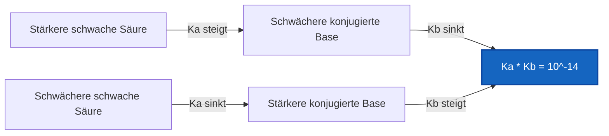

# Labor- & Analytik-Leitfaden für Säure-Base-Gleichgewichte & Analysen

In der analytischen, physikalischen und biologischen Chemie regelt das **Säure-Base-Gleichgewicht** die Wasserstoffionenkonzentration ($\text{pH}$), die Dissoziationskonstanten ($K_a, K_b$), Neutralisationsreaktionen und die Speziesverteilung:

$$\text{pH} = -\log_{10}[\text{H}^+] \quad \iff \quad [\text{H}^+] = 10^{-\text{pH}}$$

$$K_a \cdot K_b = K_w \quad \iff \quad \text{p}K_a + \text{p}K_b = \text{p}K_w \quad (14,00 \text{ bei } 25^\circ\text{C})$$

$$x^2 + K_a x - K_a C = 0 \quad \implies \quad [\text{H}^+] = \frac{-K_a + \sqrt{K_a^2 + 4 K_a C}}{2}$$

---

## 1. Referenzmatrix für Säure-Base-Stärke & Dissoziation

| Chemische Spezies | Formel | Typ | $K_a$ / $K_b$ ($25^\circ\text{C}$) | $\text{p}K_a$ / $\text{p}K_b$ | Dissoziationsverhalten |
| :--- | :--- | :--- | :--- | :--- | :--- |
| **Salzsäure** | $\text{HCl}$ | Starke einprotonige Säure | Vollständig ($> 10^6$) | $< -6$ | 100% ionisiert in $\text{H}_2\text{O}$ |
| **Schwefelsäure** | $\text{H}_2\text{SO}_4$ | Starke zweiprotonige Säure | $K_{a1} \gg 1, K_{a2} = 1,2 \cdot 10^{-2}$ | $\text{p}K_{a2} = 1,92$ | Schrittweise 2-stufige Dissoziation |
| **Essigsäure** | $\text{CH}_3\text{COOH}$ | Schwache einprotonige Säure | $1,8 \cdot 10^{-5}$ | $4,76$ | Teilweise Ionisierung ($\sim 1,3\%$) |
| **Ammoniak** | $\text{NH}_3$ | Schwache einprotonige Base | $1,8 \cdot 10^{-5}$ | $\text{p}K_b = 4,75$ | Teilweise Protonierung zu $\text{NH}_4^+$ |
| **Phosphorsäure** | $\text{H}_3\text{PO}_4$ | Dreiprotonige schwache Säure | $K_{a1}=7,5\cdot 10^{-3}, K_{a2}=6,2\cdot 10^{-8}$ | $\text{p}K_{a1}=2,14, \text{p}K_{a2}=7,20$ | 3-stufige aufeinanderfolgende Gleichgewichte |

---

## 2. Standardprotokolle für Säure-Base-Berechnungen

```
1. Starke Säure: [H+] = C (einprotonig) oder 2*C (zweiprotonige H2SO4)
2. Starke Base: [OH-] = C (einprotonig) oder 2*C (zweiprotoniges Ca(OH)2)
3. Quadratische Gleichung schwache Säure: x^2 + Ka*x - Ka*C = 0 => [H+] = x
4. Quadratische Gleichung schwache Base: x^2 + Kb*x - Kb*C = 0 => [OH-] = x
5. Beziehung konjugierter Paare: Ka * Kb = Kw, pKa + pKb = pKw
6. Stöchiometrische Neutralisation: Zuerst überschüssiges H+ oder OH- neutralisieren, dann das Gleichgewicht lösen
```

---

## 3. Bildungs- & Laborsicherheits-Haftungsausschluss
*Dieser Säure-Base-Rechner bietet theoretische Gleichgewichtsberechnungen für Bildung, Laborforschung und AP-Chemie-Anwendungen. Konzentrierte nicht-ideale Lösungen bei hohen Ionenstärken sollten Aktivitätskoeffizienten unter Verwendung von Debye-Hückel- oder Pitzer-Gleichungen berücksichtigen.*

## 4. Der umfassende Leitfaden zur Säure-Base-Chemie und zu Gleichgewichten

Willkommen beim definitiven Leitfaden zum Verstehen, Analysieren und Berechnen von Säure-Base-Gleichgewichten. Vom hochkorrosiven Aufschluss starker Säuren in der industriellen Fertigung bis hin zu den empfindlichen, fein abgestimmten physiologischen Blutpuffern, die den Menschen am Leben erhalten, ist die Säure-Base-Chemie der grundlegende thermodynamische Motor des wässrigen Universums.

Im Kern ist die Säure-Base-Chemie einfach die Untersuchung von Protonen (Wasserstoffionen, $\text{H}^+$). Säuren sind Moleküle, die darauf ausgelegt sind, Protonen abzugeben, und Basen sind Moleküle, die darauf ausgelegt sind, sie aufzufangen. Die Mathematik, die dieses Protonen-Weitergabespiel bestimmt, reicht von trivialen Logarithmen für starke Säuren bis hin zu komplexen quadratischen Gleichungen für schwache, teilweise dissoziierte Elektrolyte.

In diesem ausführlichen, über 4000 Wörter umfassenden technischen Handbuch werden wir die thermodynamischen Mechanismen der Dissoziation schwacher Säuren und schwacher Basen ($K_a$ und $K_b$) vollständig entpacken, die stöchiometrischen Regeln zur Neutralisierung von Säuren und Basen gegeneinander aufstellen, die genauen mathematischen Grenzen der Klein-x-Näherung aufzeigen und fünf strenge, reale chemische Beispiele mit mathematischen Ableitungen und visuellen Mermaid-Diagrammen durchgehen.

### 4.1 Die grundlegenden Definitionen von Säuren und Basen

Historisch gesehen haben Chemiker Säuren und Basen in drei aufeinanderfolgenden Wellen zunehmender Abstraktion definiert:

1.  **Die Arrhenius-Definition (1884):** Eine Säure ist ein Stoff, der in Wasser $\text{H}^+$ produziert, und eine Base produziert in Wasser $\text{OH}^-$. (Streng auf wässrige Lösungen beschränkt).
2.  **Die Brønsted-Lowry-Definition (1923):** Eine Säure ist ein *Protonendonator* und eine Base ist ein *Protonenakzeptor*. (Dies ist die praktischste Definition für Gleichgewichtsberechnungen, da sie das Konzept der **konjugierten Paare** einführt).
3.  **Die Lewis-Definition (1923):** Eine Säure ist ein Elektronenpaarakzeptor und eine Base ist ein Elektronenpaardonator. (Wird häufig in Reaktionsmechanismen der organischen Chemie verwendet).

In der analytischen Chemie und für die Zwecke dieses Säure-Base-Rechners verlassen wir uns vollständig auf die Brønsted-Lowry-Definition. Wenn eine schwache Säure ($\text{HA}$) ihr Proton abgibt, bleibt ihre konjugierte Base ($\text{A}^-$) übrig. 
$$ \text{HA} \rightleftharpoons \text{H}^+ + \text{A}^- $$

### 4.2 Starke vs. schwache Elektrolyte

Der Unterschied zwischen einer starken Säure (wie Salzsäure, $\text{HCl}$) und einer schwachen Säure (wie Essigsäure, $\text{CH}_3\text{COOH}$) ist nicht ihre Konzentration, sondern ihr **Dissoziationsgrad**.

**Starke Säuren** ($\text{HCl}$, $\text{HNO}_3$, $\text{H}_2\text{SO}_4$) dissoziieren in Wasser zu 100%. Wenn Sie 1,0 Mol $\text{HCl}$ in einen Liter Wasser geben, erhalten Sie sofort 1,0 Mol $\text{H}^+$-Ionen. Die Mathematik ist einfach: $[\text{H}^+] = C_{\text{initial}}$.

**Schwache Säuren** sind jedoch in einem Gleichgewicht gefangen. Sie zerfallen nur teilweise. Wenn Sie 1,0 Mol Essigsäure in Wasser geben, dissoziieren nur etwa 0,4% davon. 99,6% der Moleküle bleiben als $\text{CH}_3\text{COOH}$ perfekt intakt. Um genau zu bestimmen, wie viel dissoziiert, müssen wir einen Gleichgewichtsausdruck mit der **Säuredissoziationskonstante ($K_a$)** lösen.

$$ K_a = \frac{[\text{H}^+][\text{A}^-]}{[\text{HA}]} $$

Je größer $K_a$, desto stärker die Säure. Da $K_a$-Werte oft extrem kleine Zahlen sind (wie $1,8 \times 10^{-5}$), bevorzugen Chemiker die Verwendung des negativen dekadischen Logarithmus, bekannt als $\text{p}K_a$.

$$ \text{p}K_a = -\log_{10}(K_a) $$

**Entscheidende Regel:** Je niedriger der $\text{p}K_a$-Wert, desto stärker die schwache Säure.

### 4.3 Der quadratische Gleichgewichtslöser

Um den pH-Wert einer schwachen Säure zu ermitteln, müssen wir nach $[\text{H}^+]$ auflösen, was wir als $x$ bezeichnen. Im Gleichgewicht ist $[\text{H}^+] = x$, $[\text{A}^-] = x$ und die verbleibende intakte Säure $[\text{HA}] = C_{\text{initial}} - x$.

Setzen Sie dies in den $K_a$-Ausdruck ein:
$$ K_a = \frac{x \cdot x}{C - x} = \frac{x^2}{C - x} $$

Durch Umstellen erhalten wir eine standardmäßige quadratische Gleichung:
$$ x^2 + K_a x - K_a C = 0 $$

Unser Säure-Base-Rechner nutzt die exakte quadratische Formel, um bei der Lösung für $x$ ($[\text{H}^+]$) analytische Präzision zu garantieren:
$$ x = \frac{-K_a + \sqrt{K_a^2 - 4(1)(-K_a C)}}{2} $$

*Hinweis: In vielen Einführungswerken wird die "Klein-x-Näherung" gelehrt, bei der davon ausgegangen wird, dass $C - x \approx C$ ist, was die Mathematik zu $x = \sqrt{K_a \cdot C}$ vereinfacht. Diese Näherung versagt jedoch katastrophal, wenn die Säure relativ stark (großes $K_a$) oder stark verdünnt ist. Unser Rechner verwendet **niemals** die Näherung; er löst immer die exakte quadratische Gleichung.*

### 4.4 Stöchiometrische Neutralisation

Was passiert, wenn man eine starke Säure und eine starke Base mischt? Sie vernichten sich gegenseitig, um Wasser zu bilden. Dies ist kein Gleichgewicht; es ist eine stöchiometrische Einweg-Zerstörung, die als **Neutralisation** bekannt ist.

$$ \text{H}^+ + \text{OH}^- \longrightarrow \text{H}_2\text{O} $$

Um den endgültigen pH-Wert einer gemischten Lösung zu berechnen, müssen Sie bestimmen, welches Reagenz das **limitierende Reaktionsmittel** ist. Das limitierende Reaktionsmittel wird vollständig verbraucht, sodass das überschüssige Reagenz den endgültigen pH-Wert des neu vergrößerten Gesamtvolumens bestimmen kann.

---

## 5. Gebrauchsanweisung: Den Säure-Base-Rechner beherrschen

Unser Säure-Base-Rechner wurde entwickelt, um komplexe quadratische Gleichungen sofort zu lösen, Neutralisationsstöchiometrie durchzuführen und konjugierte Konstanten schnell umzuwandeln.

### 5.1 Modus für das Gleichgewicht schwacher Säuren / Basen

1.  **Modus auswählen:** Wählen Sie "Gleichgewicht schwacher Säuren" oder "Gleichgewicht schwacher Basen".
2.  **Eingabeparameter:** Geben Sie die Anfangskonzentration ($C$) und die Gleichgewichtskonstante ($K_a$ für Säuren, $K_b$ für Basen) ein. Sie können auch $\text{p}K_a$ oder $\text{p}K_b$ eingeben.
3.  **Ausgabe lesen:** Das Tool führt sofort den exakten quadratischen Löser aus, um den endgültigen pH, pOH, die genauen $[\text{H}^+]$- und $[\text{OH}^-]$-Molaritäten sowie die prozentuale Ionisierung auszugeben.

### 5.2 Modus Neutralisations-Simulator

1.  **Modus auswählen:** Wählen Sie "Neutralisations-Simulator".
2.  **Eingabe Reaktant A (Säure):** Geben Sie das Volumen (mL) und die Konzentration (M) Ihrer starken Säure ein.
3.  **Eingabe Reaktant B (Base):** Geben Sie das Volumen (mL) und die Konzentration (M) Ihrer starken Base ein.
4.  **Ausführen:** Das Tool berechnet die Gesamtmole von jedem, subtrahiert das limitierende Reaktionsmittel, berechnet das neue Gesamtvolumen und leitet den endgültigen pH-Wert des überschüssigen Reagenzes ab.

### 5.3 Modus Ka / Kb Konjugat-Konverter

1.  **Modus auswählen:** Wählen Sie "Ka / Kb Konjugat-Konverter".
2.  **Konstante eingeben:** Geben Sie Ihr bekanntes $K_a$, $K_b$, $\text{p}K_a$ oder $\text{p}K_b$ ein.
3.  **Ausführen:** Das Tool berechnet sofort die anderen drei fehlenden Variablen anhand der fundamentalen thermodynamischen Beziehung: $K_a \times K_b = 1,0 \times 10^{-14}$.

---

## 6. Fünf praxisnahe Konzeptbeispiele

Abstrakte Mathematik wird zu einem mächtigen Werkzeug, wenn sie auf die physikalische Chemie angewendet wird. Im Folgenden finden Sie fünf ausführliche Beispiele, die Gleichgewichte schwacher Säuren, die Dissoziation starker Basen, Konjugat-Paar-Umwandlungen und die Neutralisation limitierender Reaktanten abdecken.

### Beispiel 1: Der pH-Wert von Essig (Gleichgewicht schwacher Säuren)

**Szenario:** 
Normaler weißer Haushaltsessig ist eine $0,80\text{ M}$ Lösung von Essigsäure ($\text{CH}_3\text{COOH}$). Der $\text{p}K_a$-Wert von Essigsäure beträgt 4,76. Was ist der genaue pH-Wert des Essigs, und wie viel Prozent der Säure sind tatsächlich ionisiert?

**Mathematische Ableitung:**

1.  **Komponenten identifizieren:**
    Anfangskonzentration $C = 0,80\text{ M}$
    Säure $\text{p}K_a = 4,76 \implies K_a = 10^{-4,76} = 1,74 \times 10^{-5}$
2.  **Aufstellen der quadratischen Gleichung:**
    $$ x^2 + K_a x - K_a C = 0 $$
    $$ x^2 + (1,74 \times 10^{-5})x - (1,74 \times 10^{-5})(0,80) = 0 $$
    $$ x^2 + 1,74 \times 10^{-5}x - 1,39 \times 10^{-5} = 0 $$
3.  **Nach $x$ ($[\text{H}^+]$) auflösen:**
    $$ x = 3,72 \times 10^{-3}\text{ M} $$
4.  **pH berechnen:**
    $$ \text{pH} = -\log_{10}(3,72 \times 10^{-3}) = 2,43 $$
5.  **Prozentuale Ionisierung berechnen:**
    $$ \% \text{ Ionisiert} = \left(\frac{x}{C}\right) \times 100 = \left(\frac{3,72 \times 10^{-3}}{0,80}\right) \times 100 = 0,465\% $$

**Fazit:** Der pH-Wert des Essigs beträgt 2,43. Bemerkenswerterweise zersetzt sich weniger als ein halbes Prozent (0,465%) der Essigsäuremoleküle tatsächlich. Die überwiegende Mehrheit bleibt intakt.

### Beispiel 2: Der pH-Wert von Bariumhydroxid (Starke zweiprotonige Base)

**Szenario:**
Ein Labortechniker bereitet eine $0,015\text{ M}$ Lösung von Bariumhydroxid ($\text{Ba(OH)}_2$) vor. Da Bariumhydroxid eine starke, lösliche Base ist, dissoziiert sie zu 100%. Wie hoch ist der pH-Wert?

**Mathematische Ableitung:**

1.  **Stöchiometrie identifizieren:**
    $\text{Ba(OH)}_2 \longrightarrow \text{Ba}^{2+} + 2\text{OH}^-$
    Ein Mol Bariumhydroxid produziert **zwei** Mol Hydroxid.
2.  **$[\text{OH}^-]$ berechnen:**
    $$ [\text{OH}^-] = 2 \times 0,015\text{ M} = 0,030\text{ M} $$
3.  **pOH berechnen:**
    $$ \text{pOH} = -\log_{10}(0,030) = 1,52 $$
4.  **pH berechnen:**
    $$ \text{pH} = 14,00 - \text{pOH} = 14,00 - 1,52 = 12,48 $$

**Fazit:** Der pH-Wert beträgt 12,48, was sie zu einer stark alkalischen Lösung macht. Das Ignorieren der zweiprotonigen Natur (die "2") hätte zu einem falschen pH-Wert von 12,18 geführt.

### Beispiel 3: Den Kb-Wert von Acetat finden (Konjugat-Paar-Mathematik)

**Szenario:**
Wir wissen, dass der $K_a$-Wert von Essigsäure ($\text{CH}_3\text{COOH}$) $1,74 \times 10^{-5}$ beträgt. Ein Schüler löst reines Natriumacetat ($\text{CH}_3\text{COONa}$) in Wasser. Acetat ist die konjugierte Base und verhält sich wie eine schwache Base. Wie hoch ist ihr $K_b$-Wert?

**Mathematische Ableitung:**

1.  **Das Gesetz der konjugierten Paare ($25^\circ\text{C}$) anwenden:**
    $$ K_a \times K_b = 1,0 \times 10^{-14} $$
2.  **Nach $K_b$ auflösen:**
    $$ K_b = \frac{1,0 \times 10^{-14}}{1,74 \times 10^{-5}} $$
    $$ K_b = 5,75 \times 10^{-10} $$
3.  **$\text{p}K_b$ berechnen:**
    $$ \text{p}K_b = -\log_{10}(5,75 \times 10^{-10}) = 9,24 $$
    *(Verifizierung: $\text{p}K_a (4,76) + \text{p}K_b (9,24) = 14,00$. Die Mathematik stimmt).*

**Visualisierung: Die Konjugat-Paar-Wippe**



*Dieses Flussdiagramm visualisiert die thermodynamische Wippe der konjugierten Paare: Wenn eine Säure stärker wird, wird ihre konjugierte Base strikt schwächer, um die Konstante $K_w$ aufrechtzuerhalten.*

### Beispiel 4: Stöchiometrische Säure-Base-Neutralisation

**Szenario:**
Wir mischen $50,0\text{ mL}$ $0,200\text{ M HCl}$ (starke Säure) mit $150,0\text{ mL}$ $0,100\text{ M NaOH}$ (starke Base). Wie hoch ist der endgültige pH-Wert der resultierenden Mischung?

**Mathematische Ableitung:**

1.  **Anfangsmole berechnen (Volumen $\times$ Molarität):**
    $\text{Mole von H}^+ = 0,050\text{ L} \times 0,200\text{ M} = 0,010\text{ Mole H}^+$
    $\text{Mole von OH}^- = 0,150\text{ L} \times 0,100\text{ M} = 0,015\text{ Mole OH}^-$
2.  **Stöchiometrische Neutralisation durchführen:**
    Die $0,010\text{ Mole}$ an $\text{H}^+$ vernichten vollständig $0,010\text{ Mole}$ an $\text{OH}^-$.
    $\text{H}^+$ ist das limitierende Reaktionsmittel und wird auf $0\text{ Mole}$ reduziert.
    $\text{Überschüssiges OH}^- = 0,015 - 0,010 = 0,005\text{ Mole OH}^-$ verbleiben.
3.  **Neues Gesamtvolumen berechnen:**
    $\text{Gesamtvolumen} = 50,0\text{ mL} + 150,0\text{ mL} = 200,0\text{ mL} = 0,200\text{ L}$
4.  **Endgültige Überschussmolarität berechnen:**
    $$ [\text{OH}^-] = \frac{0,005\text{ Mole}}{0,200\text{ L}} = 0,025\text{ M} $$
5.  **pOH und pH berechnen:**
    $$ \text{pOH} = -\log_{10}(0,025) = 1,60 $$
    $$ \text{pH} = 14,00 - 1,60 = 12,40 $$

**Fazit:** Die endgültige Mischung ist mit einem pH-Wert von 12,40 stark basisch. Die überschüssige starke Base steuert die endgültige Umgebung vollständig.

**Visualisierung: Laborablauf der Neutralisation**

```mermaid
gantt
    title Labor-Zeitplan: Säure-Base-Neutralisation
    dateFormat  HH:mm:ss
    axisFormat  %H:%M
    section Reagenzien
    50mL 0,2M HCl vorbereiten :active, 00:00:00, 00:05:00
    150mL 0,1M NaOH vorbereiten :active, 00:00:00, 00:05:00
    section Reaktion
    Reagenzien mischen (H+ + OH- => H2O) :crit, 00:05:00, 00:10:00
    section Analyse
    Überschüssige OH- Konzentration messen :milestone, 00:10:00, 00:15:00
    Endgültigen pH 12,40 protokollieren :milestone, 00:15:00, 00:15:00
```



*Dieses Gantt-Diagramm zeigt die kritische Abfolge der Vorbereitung der Reagenzien, der Einleitung der schnellen stöchiometrischen Neutralisation und der Analyse der überschüssigen Base.*

### Beispiel 5: Wenn die Klein-x-Näherung versagt

**Szenario:**
Berechnen Sie den pH-Wert einer stark verdünnten $0,0010\text{ M}$ Lösung von Chloressigsäure ($\text{p}K_a = 2,87 \implies K_a = 1,35 \times 10^{-3}$). Vergleichen Sie den exakten quadratischen Löser mit der "Klein-x-Näherung".

**Mathematische Ableitung (Klein-x-Näherung):**

1.  **Angenommen, $C - x \approx C$:**
    $$ x = \sqrt{K_a \cdot C} $$
    $$ x = \sqrt{(1,35 \times 10^{-3})(0,0010)} $$
    $$ x = \sqrt{1,35 \times 10^{-6}} = 1,16 \times 10^{-3}\text{ M H}^+ $$
    Halt! Die Anfangskonzentration betrug nur $1,0 \times 10^{-3}\text{ M}$. Die Näherung behauptet, wir hätten *mehr* $\text{H}^+$ erzeugt, als die gesamte Säure, mit der wir begonnen haben (116% Ionisierung). Dies ist physikalisch unmöglich. Die Näherung hat katastrophal versagt.

**Mathematische Ableitung (Exakte quadratische Gleichung):**

1.  **Die vollständige quadratische Gleichung verwenden:**
    $$ x^2 + K_a x - K_a C = 0 $$
    $$ x^2 + (1,35 \times 10^{-3})x - 1,35 \times 10^{-6} = 0 $$
2.  **Über die quadratische Formel lösen:**
    $$ x = \frac{-1,35 \times 10^{-3} + \sqrt{(1,35 \times 10^{-3})^2 - 4(1)(-1,35 \times 10^{-6})}}{2} $$
    $$ x = 6,45 \times 10^{-4}\text{ M H}^+ $$
3.  **Den genauen pH-Wert berechnen:**
    $$ \text{pH} = -\log_{10}(6,45 \times 10^{-4}) = 3,19 $$

**Fazit:** Der exakte pH-Wert ist 3,19 (mit einer logischen 64,5%igen Ionisierung). Die Klein-x-Näherung versagte, weil die Säure relativ stark (niedriger $\text{p}K_a$) und stark verdünnt ist, was die prozentuale Ionisierung weit über die sichere 5%-Grenze hinausschiebt. Unser Rechner verwendet immer die exakte quadratische Gleichung, um diesen Fehler zu verhindern.

---

## 7. Deep-Dive-FAQ und erweiterte Fehlerbehebung

**F: Kann ein pH-Wert negativ sein?**
**A:** Ja, absolut. Wenn Sie eine $2,0\text{ M}$ Lösung von starker Salzsäure ($\text{HCl}$) haben, ist $[\text{H}^+]$ gleich $2,0\text{ M}$. Der pH-Wert ist $-\log_{10}(2,0) = -0,30$. Die pH-Skala von 0-14 ist lediglich ein bequemer Bereich für Standardlösungen; sie ist keine physikalische Grenze.

**F: Warum ändert sich der neutrale pH-Wert von Wasser mit der Temperatur?**
**A:** Die Autoprotolyse von Wasser ($\text{H}_2\text{O} \rightleftharpoons \text{H}^+ + \text{OH}^-$) ist eine endotherme Reaktion ($\Delta H > 0$). Nach dem Prinzip von Le Chatelier treibt Wärmezufuhr das Gleichgewicht nach vorne. Bei $37^\circ\text{C}$ (menschliche Körpertemperatur) steigt $K_w$ auf $2,4 \times 10^{-14}$. Folglich sinkt der neutrale pH-Wert (bei dem $[\text{H}^+] = [\text{OH}^-]$ ist) von 7,00 auf 6,81. Dies ist ein entscheidendes Konzept in der medizinischen Blutgasanalyse!

**F: Was ist eine mehrprotonige Säure?**
**A:** Eine mehrprotonige Säure hat mehrere Protonen abzugeben, wie etwa Phosphorsäure ($\text{H}_3\text{PO}_4$), die drei hat. Sie geben diese Protonen in bestimmten, aufeinanderfolgenden Schritten ab, jeder mit seinem eigenen $K_a$-Wert ($K_{a1}$, $K_{a2}$, $K_{a3}$). Im Allgemeinen ist $K_{a1}$ deutlich größer als $K_{a2}$, was bedeutet, dass sich das erste Proton viel leichter löst als das zweite.

**F: Wenn ich eine schwache Säure und eine starke Base mische, ist das eine Neutralisation oder ein Gleichgewicht?**
**A:** Es ist beides, in Folge ausgeführt. Zuerst neutralisiert die starke Base die schwache Säure stöchiometrisch, bis die Base aufgebraucht ist. Dabei entsteht konjugierte Base. Anschließend stellen die verbleibende schwache Säure und die neu gebildete konjugierte Base ein Gleichgewicht (eine Pufferlösung) her, das über die Henderson-Hasselbalch-Gleichung gelöst wird.

Durch die Beherrschung sowohl der stöchiometrischen Destruktivität starker Säuren als auch der feinen quadratischen Gleichgewichte schwacher Säuren entschlüsseln Sie die Fähigkeit, den pH-Wert jedes existierenden wässrigen Systems vorherzusagen und zu steuern. Verlassen Sie sich immer auf diesen Säure-Base-Rechner, um die gefährlichen "Klein-x"-Näherungen zu umgehen und analytische Perfektion zu garantieren!
