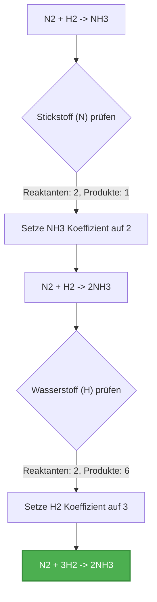

# Leitfaden zur Labor- und analytischen Chemie für das Ausgleichen chemischer Gleichungen

In der quantitativen Stöchiometrie und Verfahrenstechnik erzwingt das **Ausgleichen chemischer Gleichungen** das **Gesetz der Erhaltung der Masse**:

$$\sum \text{Reaktantenatome} = \sum \text{Produktatome} \quad \text{für jedes Element } E$$

$$\mathbf{A} \cdot \mathbf{x} = \mathbf{0} \implies \text{Nullraumlösung auf kleinste ganze Zahlen reduziert}$$

---

## 1. Standard-Reaktionstypen & Beispiele

| Reaktionstyp | Unausgeglichene Gleichung | Ausgeglichene Gleichung | Stöchiometrisches Verhältnis |
| :--- | :--- | :--- | :--- |
| **Wassersynthese** | $\text{H}_2 + \text{O}_2 \to \text{H}_2\text{O}$ | $2\text{H}_2 + \text{O}_2 \to 2\text{H}_2\text{O}$ | $2 : 1 : 2$ |
| **Methanverbrennung** | $\text{CH}_4 + \text{O}_2 \to \text{CO}_2 + \text{H}_2\text{O}$ | $\text{CH}_4 + 2\text{O}_2 \to \text{CO}_2 + 2\text{H}_2\text{O}$ | $1 : 2 : 1 : 2$ |
| **Propanverbrennung** | $\text{C}_3\text{H}_8 + \text{O}_2 \to \text{CO}_2 + \text{H}_2\text{O}$ | $\text{C}_3\text{H}_8 + 5\text{O}_2 \to 3\text{CO}_2 + 4\text{H}_2\text{O}$ | $1 : 5 : 3 : 4$ |
| **Eisenrosten** | $\text{Fe} + \text{O}_2 \to \text{Fe}_2\text{O}_3$ | $4\text{Fe} + 3\text{O}_2 \to 2\text{Fe}_2\text{O}_3$ | $4 : 3 : 2$ |
| **Einfache Verdrängung** | $\text{Al} + \text{HCl} \to \text{AlCl}_3 + \text{H}_2$ | $2\text{Al} + 6\text{HCl} \to 2\text{AlCl}_3 + 3\text{H}_2$ | $2 : 6 : 2 : 3$ |

---

## 2. Standardprotokoll zum Ausgleichen von Gleichungen

```
   Schritt 1: Schreiben Sie die korrekten chemischen Formeln für alle Reaktanten und Produkte.
   Schritt 2: Zählen Sie die Anzahl der Atome jedes Elements auf beiden Seiten der Gleichung.
   Schritt 3: Fügen Sie ganzzahlige Koeffizienten vor den Formeln ein, um die Elemente nacheinander auszugleichen.
   Schritt 4: Ändern Sie NIEMALS die tiefgestellten Indizes der Formel (z. B. ist die Änderung von H2O zu H2O2 verboten).
   Schritt 5: Reduzieren Sie die Koeffizienten, indem Sie durch ihren größten gemeinsamen Teiler (ggT) dividieren.
   Schritt 6: Überprüfen Sie, ob die Gesamtanzahl der Reaktantenatome = Gesamtanzahl der Produktatome für alle Elemente gilt.
```

---

## 3. Bildungs- & Laborsicherheits-Haftungsausschluss
*Dieser Gleichungsausgleicher bietet automatisierte stöchiometrische Berechnungen für Bildung, Laborforschung und AP-Chemie-Anwendungen. Komplexe industrielle Reaktionsmechanismen sollten mit wissenschaftlichen Standardreferenzen überprüft werden.*

## 4. Der umfassende Leitfaden zum Ausgleichen chemischer Gleichungen

Willkommen bei der ultimativen Ressource zum Verstehen, Beherrschen und automatischen Lösen chemischer Gleichungen. Egal, ob Sie ein Schüler sind, der das grundlegende Gesetz der Erhaltung der Masse lernt, ein AP-Chemie-Schüler, der komplexe Redox-Halbreaktionen bewältigt, oder ein professioneller Chemieingenieur, der eine industrielle Synthese skaliert, das Ausgleichen von Gleichungen ist das Fundament der chemischen Mathematik.

Im Kern geht es in der Chemie um Transformation. Reaktanten kollidieren, Bindungen brechen, Atome ordnen sich neu an und neue Produkte entstehen. Da jedoch Materie nicht erschaffen oder zerstört werden kann, muss jedes einzelne Atom, das in eine Reaktion eintritt, auch aus ihr hervorgehen. Dieses unveränderliche Prinzip schreibt vor, dass chemische Gleichungen perfekt ausgeglichen sein müssen.

In diesem ausführlichen Leitfaden werden wir tief in die Mechanik der Stöchiometrie eintauchen, die leistungsstarken Algorithmen der linearen Algebra erforschen, die von unserem Rechner zur Lösung jeder Reaktion verwendet werden, und fünf sehr detaillierte, reale Beispiele mit mathematischen Ableitungen und visuellen 2D-Flussdiagrammen durchgehen.

### 4.1 Das Gesetz der Erhaltung der Masse

Im Jahr 1789 stellte Antoine Lavoisier das Gesetz der Erhaltung der Masse auf, das besagt, dass in einem geschlossenen System Masse weder durch chemische Reaktionen noch durch physikalische Transformationen erzeugt oder zerstört wird.

Auf chemische Gleichungen angewendet bedeutet dies, dass die Masse der Reaktanten gleich der Masse der Produkte sein muss. Genauer gesagt muss die genaue Anzahl der Atome für jedes einzelne Element auf der linken Seite des Reaktionspfeils (Reaktanten) perfekt mit der Anzahl der Atome auf der rechten Seite (Produkte) übereinstimmen.

Wenn Sie eine Skelettgleichung wie $\text{H}_2 + \text{O}_2 \to \text{H}_2\text{O}$ schreiben, können Sie sehen, dass es links zwei Sauerstoffatome gibt, aber nur eines auf der rechten Seite. Dies stellt ein unmögliches Szenario dar, in dem ein Sauerstoffatom einfach aus der Existenz verschwunden ist. Um dies zu beheben, müssen wir die Gleichung ausgleichen.

### 4.2 Koeffizienten vs. Tiefgestellte Indizes

Die goldene Regel beim Ausgleichen von Gleichungen ist, **niemals die tiefgestellten Indizes** einer chemischen Formel zu ändern.
*   **Tiefgestellte Indizes** (die kleinen Zahlen unten rechts von einem Elementsymbol) bestimmen die tatsächliche chemische Identität eines Stoffes. Wenn man beispielsweise den Index in $\text{H}_2\text{O}$ in $\text{H}_2\text{O}_2$ ändert, ändert sich der Stoff von lebenspendendem Wasser zu giftigem Wasserstoffperoxid.
*   **Koeffizienten** (die großen Zahlen, die direkt vor die chemischen Formeln gestellt werden) bestimmen die Menge oder das Molverhältnis dieses spezifischen Moleküls in der Reaktion.

Um $\text{H}_2 + \text{O}_2 \to \text{H}_2\text{O}$ auszugleichen, setzen wir einen Koeffizienten von 2 vor das Wasser, um den Sauerstoff auszugleichen, und eine 2 vor das Wasserstoffgas, um den Wasserstoff wieder auszugleichen, was ergibt: $2\text{H}_2 + \text{O}_2 \to 2\text{H}_2\text{O}$.

### 4.3 Die lineare Algebra-Matrix-Methode

Während einfache Gleichungen durch Ausprobieren ausgeglichen werden können, können hochkomplexe Redoxreaktionen oder Verbrennungsgleichungen mit massiven Kohlenwasserstoffen frustrierend schwer manuell zu lösen sein.

Unser Rechner zum Ausgleichen chemischer Gleichungen verwendet fortschrittliche **lineare Algebra und Matrixmathematik**. Er behandelt jedes Element als Zeile und jedes Molekül als Spalte in einer Matrix. Der Algorithmus richtet dann ein System linearer Gleichungen ein, das die Erhaltung jedes Elements darstellt, und löst nach dem Nullraum der Matrix auf.

Da gebrochene Moleküle in der Standardstöchiometrie nicht existieren, der Algorithmus berechnet dann das kleinste gemeinsame Vielfache, um die Matrixlösung auf die kleinstmöglichen positiven ganzen Zahlen zu skalieren (der Schritt der Reduzierung durch den größten gemeinsamen Teiler). Dies gewährleistet eine 100%ige mathematische Genauigkeit für jede gültige chemische Gleichung, die Sie eingeben.

---

## 5. Benutzerhandbuch: Den Gleichungsausgleicher beherrschen

Unser Rechner zum Ausgleichen chemischer Gleichungen ist mit einem intuitiven "Interaktiven Cockpit" ausgestattet, das sowohl sofortige Antworten als auch tiefe pädagogische Einblicke bietet.

### 5.1 Grundlegende Bedienung

1.  **Geben Sie Ihre Skelettgleichung ein:** Verwenden Sie die chemische Standardnotation. Geben Sie beispielsweise `C6H12O6 + O2 -> CO2 + H2O` ein. Sie müssen sich nicht um die Formatierung tiefgestellter Indizes kümmern; der Parser erledigt das automatisch.
2.  **Verwenden Sie die richtige Syntax:** Schreiben Sie den ersten Buchstaben eines Elements immer groß (z. B. `Na` für Natrium, nicht `na` oder `NA`). Verwenden Sie `->`, `=` oder `=>`, um Reaktanten von Produkten zu trennen.
3.  **Klicken Sie auf "Gleichung ausgleichen":** Die Engine berechnet sofort die Koeffizienten.

### 5.2 Erweiterte Funktionen und Modi

*   **Atom-Erhaltungsmatrix:** Unter der ausgeglichenen Ausgabe finden Sie eine Matrix, die die genaue Anzahl der Atome jedes Elements auf beiden Seiten der Gleichung aufzählt. Dies dient als mathematischer Beweis dafür, dass die Gleichung ausgeglichen ist.
*   **Redox- und Ladungsausgleich:** Wenn Sie Ionengleichungen eingeben (z. B. `Cu + Ag+ -> Cu2+ + Ag`), gleicht der Rechner nicht nur die Atome aus, sondern stellt auch sicher, dass die elektrische Nettoladung auf beiden Seiten erhalten bleibt.
*   **Werkzeug für Netto-Ionengleichungen:** In diesem Modus können Sie vollständige Ionengleichungen eingeben. Der Rechner identifiziert "Zuschauerionen" (Ionen, die auf beiden Seiten identisch vorkommen) und streicht sie automatisch durch, um die vereinfachte Netto-Ionengleichung bereitzustellen.

---

## 6. Fünf reale Konzeptbeispiele

Um die chemische Stöchiometrie wirklich zu beherrschen, müssen Sie sehen, wie diese Prinzipien auf verschiedene Arten von chemischen Reaktionen angewendet werden. Im Folgenden finden Sie fünf detaillierte Beispiele, die verschiedene Reaktionsklassifizierungen darstellen, komplett mit visuellen Ableitungen.

### Beispiel 1: Die Verbrennung von Propan

**Szenario:**
Propan ($\text{C}_3\text{H}_8$) wird häufig in Außengrills und Hausheizungen verwendet. Wenn es in Gegenwart von Sauerstoff ($\text{O}_2$) brennt, entstehen Kohlendioxid ($\text{CO}_2$) und Wasserdampf ($\text{H}_2\text{O}$). Wir müssen diese Verbrennungsreaktion ausgleichen.

**Unausgeglichene Gleichung:**
$\text{C}_3\text{H}_8 + \text{O}_2 \to \text{CO}_2 + \text{H}_2\text{O}$

**Schritt-für-Schritt-Ableitung:**

1.  **Kohlenstoff (C) ausgleichen:** Auf der linken Seite befinden sich 3 Kohlenstoffe, also setzen wir eine 3 vor $\text{CO}_2$.
    *   $\text{C}_3\text{H}_8 + \text{O}_2 \to 3\text{CO}_2 + \text{H}_2\text{O}$
2.  **Wasserstoff (H) ausgleichen:** Auf der linken Seite befinden sich 8 Wasserstoffe, also setzen wir eine 4 vor $\text{H}_2\text{O}$.
    *   $\text{C}_3\text{H}_8 + \text{O}_2 \to 3\text{CO}_2 + 4\text{H}_2\text{O}$
3.  **Sauerstoff (O) ausgleichen:** Auf der rechten Seite haben wir $(3 \times 2) = 6$ Sauerstoffatome aus $\text{CO}_2$ und $(4 \times 1) = 4$ Sauerstoffatome aus Wasser. Gesamt = 10. Um 10 Sauerstoffe auf der linken Seite zu erhalten, setzen wir eine 5 vor $\text{O}_2$.
    *   $\text{C}_3\text{H}_8 + 5\text{O}_2 \to 3\text{CO}_2 + 4\text{H}_2\text{O}$

**Visualisierung: Atom-Zählmatrix**

| Element | Reaktanten | Produkte | Status |
| :--- | :--- | :--- | :--- |
| **Kohlenstoff (C)** | $1 \times 3 = 3$ | $3 \times 1 = 3$ | Ausgeglichen |
| **Wasserstoff (H)** | $1 \times 8 = 8$ | $4 \times 2 = 8$ | Ausgeglichen |
| **Sauerstoff (O)** | $5 \times 2 = 10$ | $6 + 4 = 10$ | Ausgeglichen |

*Diese Tabelle bestätigt, dass das Gesetz der Erhaltung der Masse strikt eingehalten wird.*

### Beispiel 2: Das Haber-Bosch-Verfahren (Synthese)

**Szenario:**
Das Haber-Bosch-Verfahren ist eine der wichtigsten industriellen Reaktionen der Geschichte, bei der Ammoniak ($\text{NH}_3$) aus Stickstoff- ($\text{N}_2$) und Wasserstoffgasen ($\text{H}_2$) zur Herstellung von landwirtschaftlichen Düngemitteln synthetisiert wird.

**Unausgeglichene Gleichung:**
$\text{N}_2 + \text{H}_2 \to \text{NH}_3$

**Schritt-für-Schritt-Ableitung:**

1.  **Stickstoff (N) ausgleichen:** Es gibt 2 Stickstoffe auf der linken Seite. Setzen Sie eine 2 vor $\text{NH}_3$.
    *   $\text{N}_2 + \text{H}_2 \to 2\text{NH}_3$
2.  **Wasserstoff (H) ausgleichen:** Jetzt gibt es $(2 \times 3) = 6$ Wasserstoffe auf der rechten Seite. Setzen Sie eine 3 vor $\text{H}_2$, um ihn auszugleichen.
    *   $\text{N}_2 + 3\text{H}_2 \to 2\text{NH}_3$

**Visualisierung: Algorithmischer Logikfluss**



*Dieses Flussdiagramm ahmt die algorithmische "Inspektions"-Logik nach, die für einfachere Synthesegleichungen verwendet wird.*

### Beispiel 3: Photosynthese (Komplexe biologische Reaktion)

**Szenario:**
Pflanzen fangen Sonnenenergie ein, um Kohlendioxid und Wasser in Glukose und Sauerstoffgas umzuwandeln. Dies ist ein massiver, mehrstufiger biochemischer Prozess, aber die chemische Netto-Gesamtgleichung muss dennoch ausgeglichen sein.

**Unausgeglichene Gleichung:**
$\text{CO}_2 + \text{H}_2\text{O} \to \text{C}_6\text{H}_{12}\text{O}_6 + \text{O}_2$

**Schritt-für-Schritt-Ableitung:**

1.  **Kohlenstoff ausgleichen:** Setzen Sie eine 6 vor $\text{CO}_2$.
    *   $6\text{CO}_2 + \text{H}_2\text{O} \to \text{C}_6\text{H}_{12}\text{O}_6 + \text{O}_2$
2.  **Wasserstoff ausgleichen:** Setzen Sie eine 6 vor $\text{H}_2\text{O}$.
    *   $6\text{CO}_2 + 6\text{H}_2\text{O} \to \text{C}_6\text{H}_{12}\text{O}_6 + \text{O}_2$
3.  **Sauerstoff ausgleichen:** Die linke Seite hat nun $(6 \times 2) = 12$ aus $\text{CO}_2$ und $(6 \times 1) = 6$ aus Wasser, also insgesamt 18 Sauerstoffatome. Die rechte Seite hat 6 in der Glukose. Wir brauchen 12 weitere aus dem $\text{O}_2$-Gas, also setzen wir eine 6 davor.
    *   $6\text{CO}_2 + 6\text{H}_2\text{O} \to \text{C}_6\text{H}_{12}\text{O}_6 + 6\text{O}_2$

### Beispiel 4: Einfache Verdrängung und Ladungserhaltung

**Szenario:**
Ein festes Stück Aluminiummetall wird in eine Lösung von Kupfer(II)-sulfat gegeben. Das reaktivere Aluminium verdrängt das Kupfer und fällt als festes Kupfer aus der Lösung aus.

**Unausgeglichene Gleichung:**
$\text{Al} + \text{CuSO}_4 \to \text{Al}_2(\text{SO}_4)_3 + \text{Cu}$

**Schritt-für-Schritt-Ableitung:**

1.  Anstatt einzelne S- und O-Atome auszugleichen, behandeln Sie das mehratomige Sulfation ($\text{SO}_4$) als eine einzige Einheit, da es nicht auseinanderbricht.
2.  **Sulfat ($\text{SO}_4$) ausgleichen:** Es gibt 3 Sulfate auf der rechten Seite. Setzen Sie eine 3 vor $\text{CuSO}_4$.
    *   $\text{Al} + 3\text{CuSO}_4 \to \text{Al}_2(\text{SO}_4)_3 + \text{Cu}$
3.  **Kupfer (Cu) ausgleichen:** Setzen Sie eine 3 vor das Cu auf der rechten Seite.
    *   $\text{Al} + 3\text{CuSO}_4 \to \text{Al}_2(\text{SO}_4)_3 + 3\text{Cu}$
4.  **Aluminium (Al) ausgleichen:** Setzen Sie eine 2 vor das Al auf der linken Seite.
    *   $2\text{Al} + 3\text{CuSO}_4 \to \text{Al}_2(\text{SO}_4)_3 + 3\text{Cu}$

### Beispiel 5: Zersetzung von Natriumazid (Airbags)

**Szenario:**
In Auto-Airbags muss eine schnelle chemische Zersetzung den Airbag in Millisekunden aufblasen. Natriumazid ($\text{NaN}_3$) wird elektrisch gezündet, um sich schnell in festes Natrium und Stickstoffgas zu zersetzen.

**Unausgeglichene Gleichung:**
$\text{NaN}_3 \to \text{Na} + \text{N}_2$

**Schritt-für-Schritt-Ableitung:**

1.  **Stickstoff ausgleichen:** Wir haben 3 Stickstoffe auf der linken und 2 auf der rechten Seite. Das kleinste gemeinsame Vielfache ist 6. Wir brauchen also 6 Stickstoffe auf beiden Seiten.
2.  Setzen Sie eine 2 vor $\text{NaN}_3$ und eine 3 vor $\text{N}_2$.
    *   $2\text{NaN}_3 \to \text{Na} + 3\text{N}_2$
3.  **Natrium ausgleichen:** Setzen Sie eine 2 vor das Na auf der rechten Seite.
    *   $2\text{NaN}_3 \to 2\text{Na} + 3\text{N}_2$

**Visualisierung: Zeitplan für die Airbag-Auslösung**

```mermaid
gantt
    title Reaktionszeitplan: Airbag-Auslösung
    dateFormat  HH:mm:ss
    axisFormat  %S.%L
    section Einleitung
    Aufprallsensor ausgelöst :active, 00:00:00, 00:00:01
    Elektrische Zündung :crit, 00:00:01, 00:00:02
    section Zersetzung
    2NaN3 Zersetzung :active, 00:00:02, 00:00:04
    Stickstoffgas (3N2) Expansion :done, 00:00:03, 00:00:05
    section Aufblasen
    Vollständige Airbag-Entfaltung :milestone, 00:00:05, 00:00:05
```



*Dieses Gantt-Diagramm zeigt die physikalische Echtzeitanwendung der ausgeglichenen Reaktion. Der große Koeffizient von 3 für Stickstoffgas sorgt für eine massive, schnelle Volumenausdehnung zum Schutz des Fahrgastes.*

---

## 7. Deep Dive FAQ und erweiterte Fehlerbehebung

**F: Der Rechner sagt "Unmögliche Gleichung". Was bedeutet das?**
**A:** Dies tritt auf, wenn Ihre Gleichung das Gesetz der Erhaltung der Masse auf grundlegender Ebene verletzt. Wenn Sie beispielsweise $\text{Na} \to \text{Cl}_2$ eingeben, wird der Rechner dies als unmöglich kennzeichnen, da Materie nicht von Natrium zu Chlor umgewandelt werden kann. Es fehlt Ihnen eine Chlorquelle in Ihren Reaktanten oder ein Natriumprodukt.

**F: Muss ich die Zustandssymbole (s, l, g, aq) schreiben?**
**A:** Unser Rechner ignoriert Zustandssymbole zum Zwecke des stöchiometrischen Ausgleichens. Sie können diese angeben, aber der Matrixalgorithmus analysiert nur die elementare Zusammensetzung, um die Koeffizienten zu generieren.

**F: Kann ich gebrochene Koeffizienten verwenden?**
**A:** Mathematisch gesehen ja (z. B. ist $\text{H}_2 + 0.5\text{O}_2 \to \text{H}_2\text{O}$ perfekt ausgeglichen). Dies ist in der Thermodynamik üblich, um die Bildung von 1 Mol einer Substanz zu zeigen. Unser Rechner verwendet jedoch standardmäßig die Standard-IUPAC-Konventionen, die die kleinsten ganzen Zahlen erfordern. Wenn die lineare Algebra-Matrix einen Bruch ergibt, multipliziert der Rechner automatisch die gesamte Gleichung, um ihn zu beseitigen.

**F: Wie geht dieser Rechner mit Zuschauerionen um?**
**A:** Bei Verwendung des Netto-Ionen-Werkzeugs zerlegt der Algorithmus alle wässrigen (löslichen) Verbindungen in ihre Bestandteile. Er vergleicht dann die linke und rechte Seite. Jedes Ion, das in exakt demselben Zustand und derselben Ladung auf beiden Seiten existiert, wird mathematisch gestrichen, so dass nur die aktiven Teilnehmer der Reaktion übrig bleiben.

**F: Hat das Ausgleichen von Gleichungen mit Molen zu tun?**
**A:** Absolut. Die Koeffizienten in einer ausgeglichenen Gleichung stellen die Molverhältnisse der beteiligten Stoffe dar. In der Gleichung $2\text{H}_2 + \text{O}_2 \to 2\text{H}_2\text{O}$ sagt es Ihnen, dass 2 Mol Wasserstoffgas mit 1 Mol Sauerstoffgas reagieren, um 2 Mol Wasser zu produzieren. Dies ist die Grundlage aller stöchiometrischen Berechnungen. (Weitere Details finden Sie in unserem [Mol-Rechner](/mole-calculator) oder [Stöchiometrie-Rechner](/stoichiometry-calculator)).

Wenn Sie die mathematische Strenge hinter dem Ausgleichen chemischer Gleichungen verstehen, rüsten Sie sich mit dem wichtigsten analytischen Werkzeug der Chemie aus. Stellen Sie sicher, dass Sie diesen Rechner verwenden, um Ihre Hausaufgaben, Labor-Vorbereitungen und komplexe Redox-Ableitungen zu überprüfen!
