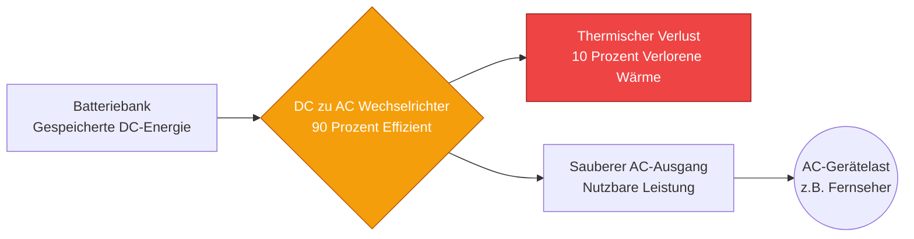
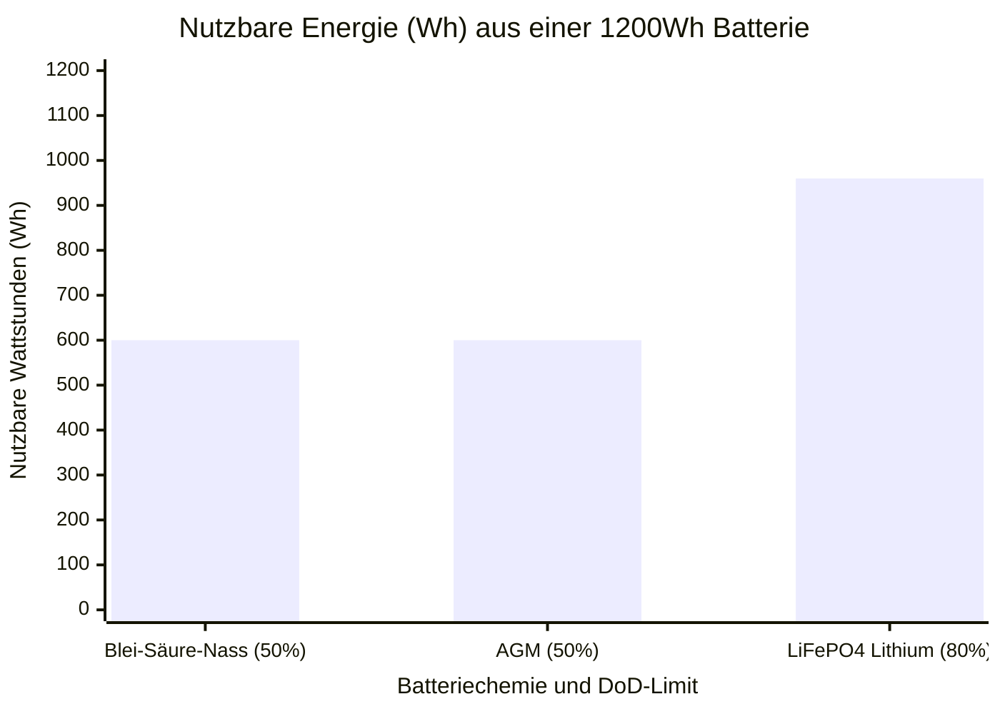
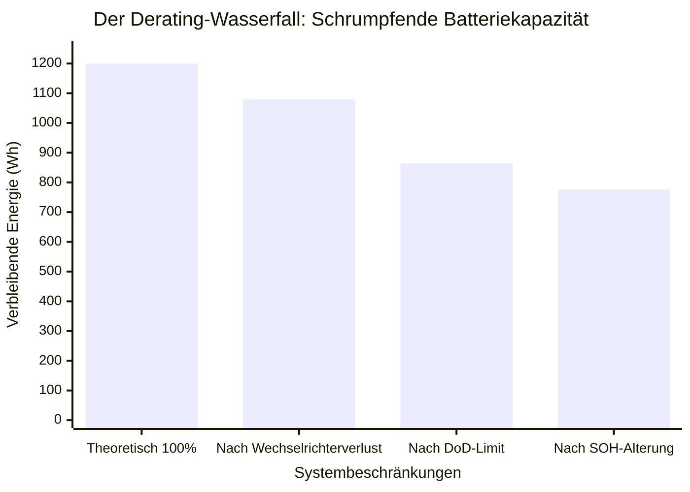
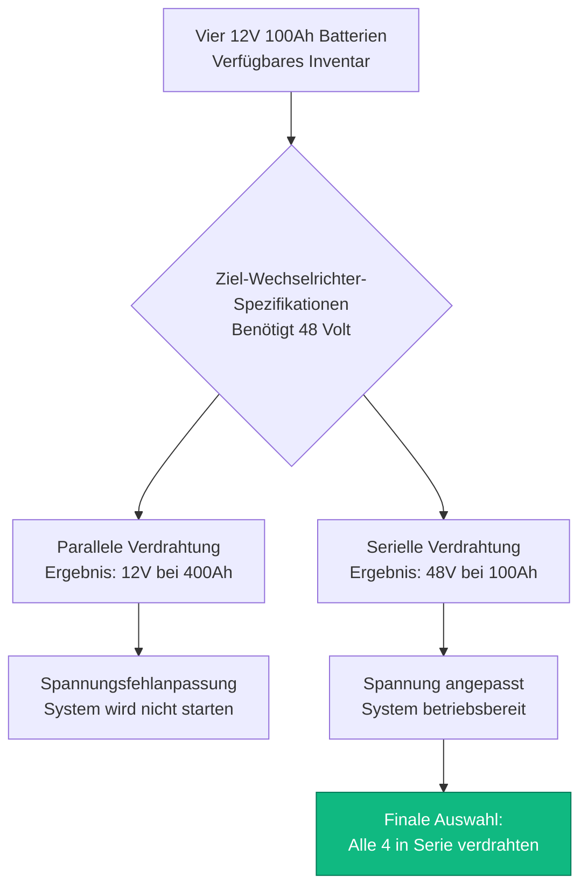
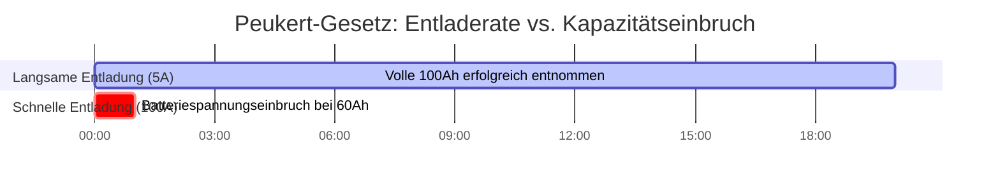

# Der ultimative Batterielaufzeit-Rechner: Kapazitätsdimensionierung, Wechselrichterverluste und Peukert-Gesetz

Willkommen beim ultimativen **Batterielaufzeit-Rechner** und umfassenden Leitfaden für die Energiespeicher-Technik. Egal, ob Sie als Off-Grid-Solararchitekt eine massive $48\text{V}$ LiFePO4-Batteriebank für eine abgelegene Hütte dimensionieren, als IT-Administrator das genaue USV-Backup-Fenster berechnen, das für das sichere Herunterfahren eines Server-Racks erforderlich ist, oder als Elektronik-Hobbyist einen Raspberry Pi mit einer $18650$ Lithium-Ionen-Zelle betreiben – das Verständnis der Batterie-Entladephysik ist absolut unerlässlich.

Batterien können unglaublich täuschen. Ein Etikett, auf dem deutlich "$12\text{V}$ $100\text{Ah}$" steht, garantiert nicht, dass Sie auch tatsächlich $1200\text{ Wattstunden}$ Energie entnehmen können. Wenn Sie blind die Kapazität durch die Lastleistung dividieren, wird Ihr System vorzeitig abstürzen, Ihre Wechselrichter in die Unterspannungsabschaltung (LVD) fallen und Sie die Chemie Ihrer Batteriebank dauerhaft zerstören.

In dieser ausführlichen, über 4.000 Wörter umfassenden SEO-Meisterklasse werden wir die grundlegende $Ah \to Wh$-Umrechnungsmathematik zerlegen, die brutale Realität des Derating-Wasserfalls (Wechselrichter-Effizienz, Entladetiefe und Gesundheitszustand) aufdecken, die erschreckende nichtlineare Physik des Peukert-Gesetzes bei Blei-Säure-Batterien entschlüsseln und mathematisch beweisen, wie Serien- und Parallelstränge richtig verdrahtet werden. Um sicherzustellen, dass Sie diese technischen Konzepte vollständig begreifen, haben wir fünf minutiös detaillierte, parser-sichere interaktive Mermaid.js-Diagramme beigefügt.

---

## 1. Die Physik der gespeicherten Energie (Amperestunden vs. Wattstunden)

Der häufigste Fehler, den Anfänger bei der Berechnung der Batterielaufzeit machen, ist, sich auf Amperestunden (Ah) zu verlassen, ohne die Systemspannung zu berücksichtigen. Eine Amperestunde ist einfach ein Maß für die elektrische Ladung. Um die tatsächliche Arbeit (Energie) zu berechnen, müssen Sie Amperestunden in **Wattstunden (Wh)** umrechnen.

**Die grundlegende Energiegleichung:**
$$\text{Energie (Wh)} = \text{Spannung (V)} \times \text{Kapazität (Ah)}$$

Warum ist das so wichtig?
- Eine $12\text{V}$ $100\text{Ah}$ Batterie speichert $1200\text{ Wh}$ Energie.
- Eine $24\text{V}$ $50\text{Ah}$ Batterie speichert $1200\text{ Wh}$ Energie.
- Auch wenn die $12\text{V}$ Batterie doppelt so viele "Amperestunden" hat, enthalten beide Batterien genau die gleiche Menge an elektrischer Gesamtenergie und werden eine $100\text{W}$ Last genau gleich lang betreiben.

Normalisieren Sie Ihre Berechnungen immer auf Wattstunden. Es ist die einzig wahre Metrik für die Speicherkapazität von Batterien.

---

## 2. Der Derating-Wasserfall: Warum die theoretische Laufzeit eine Lüge ist

Wenn Sie eine $1200\text{Wh}$ Batterie und einen $100\text{W}$ Fernseher haben, deutet grundlegende Mathematik darauf hin, dass Sie $12\text{ Stunden}$ Laufzeit haben. **Das ist völlig falsch.**

In der realen Welt muss sich Energie durch einen Spießrutenlauf physischer Engpässe kämpfen, bevor sie Ihr Gerät erreicht. Wir nennen dies den **Derating-Wasserfall**.

1. **Wechselrichter-Effizienzverlust ($\eta$):** Batterien geben Gleichstrom (DC) aus. Fernseher benötigen Wechselstrom (AC). Sie müssen einen Wechselrichter verwenden, um den Strom umzuwandeln. Wechselrichter sind typischerweise zu $85\%$ bis $90\%$ effizient. Die fehlenden $10\%$ verpuffen gewaltsam als thermische Wärme. Um einen $100\text{W}$ AC-Fernseher zu betreiben, zieht der Wechselrichter tatsächlich $111\text{W}$ aus der Batterie.
2. **Entladetiefe (DoD):** Sie können eine Batterie nicht auf $0\%$ entladen. Dies führt zu irreversiblen chemischen Schäden. Blei-Säure-Nassbatterien können nur auf $50\%$ DoD entladen werden. Moderne LiFePO4 (Lithiumeisenphosphat) Batterien können auf $80\%$ oder $90\%$ DoD entladen werden. Wenn Sie eine $1200\text{Wh}$ Blei-Säure-Batterie haben, verfügen Sie nur über $600\text{Wh}$ nutzbare Energie.
3. **Gesundheitszustand (SOH - State of Health):** Wenn eine Batterie altert, schrumpft ihre innere Kapazität. Eine Batterie mit einer SOH-Bewertung von $80\%$ hat dauerhaft $20\%$ ihrer Werkskapazität verloren.

**Die reale Laufzeit-Gleichung:**
$$\text{Nutzbare Energie (Wh)} = \text{Gesamte Wh} \times \text{DoD \%} \times \text{SOH \%}$$
$$\text{Reale Laufzeit (Stunden)} = \frac{\text{Nutzbare Energie (Wh)}}{\text{Lastleistung (W)} / \text{Wechselrichter-Effizienz}}$$

---

## 3. Der Albtraum des Peukert-Gesetzes (Nur Blei-Säure)

Wenn Sie Blei-Säure-, AGM- oder Gel-Batterien verwenden, müssen Sie sich mit einer der frustrierendsten Regeln der Elektrotechnik auseinandersetzen: **dem Peukert-Gesetz**.

Im Jahr 1897 entdeckte der Wissenschaftler Wilhelm Peukert, dass die Kapazität einer Blei-Säure-Batterie mathematisch schrumpft, wenn sie schnell entladen wird. 
Eine $100\text{Ah}$ Blei-Säure-Batterie wird mit einer sehr langsamen $20\text{-Stunden}$-Entladerate ($5\text{ Ampere}$) getestet.
- Wenn Sie $5\text{ Ampere}$ ziehen, liefert die Batterie die vollen $100\text{Ah}$.
- Wenn Sie $50\text{ Ampere}$ ziehen (eine Hochgeschwindigkeitsentladung), können die internen chemischen Reaktionen nicht Schritt halten. Die Spannung bricht ein, und die Batterie liefert möglicherweise nur $60\text{Ah}$, bevor sie stirbt.

**Die Peukert-Gleichung:**
$$T = H \times \left( \frac{C}{I \times H} \right)^n$$
Wobei $n$ der Peukert-Exponent ist (typischerweise $1,15$ bis $1,30$ für Blei-Säure).

*Technischer Hinweis:* Dies ist der Grund, warum die Solarindustrie überwiegend auf **Lithium (LiFePO4)** umgestiegen ist. Lithium-Batterien haben einen Peukert-Exponenten von etwa $1,00$ bis $1,05$. Egal, ob Sie eine Lithium-Batterie über $20\text{ Stunden}$ oder $1\text{ Stunde}$ entladen, Sie können nahezu $100\%$ ihrer Nennkapazität entnehmen.

---

## 4. Entwurf von Serien- und Parallel-Batteriebänken

Wenn eine einzelne Batterie nicht genug Spannung oder nicht genug Amperestunden liefern kann, müssen Sie mehrere Batterien miteinander verdrahten, um eine **Batteriebank** zu erstellen. 

**Regel 1: Verdrahtung in Serie (Erhöht die Spannung)**
Wenn Sie den positiven Pol von Batterie A mit dem negativen Pol von Batterie B verbinden, verdrahten Sie in Serie.
- **Spannung:** Addiert sich ($12\text{V} + 12\text{V} = 24\text{V}$).
- **Kapazität:** Bleibt exakt gleich ($100\text{Ah} + 100\text{Ah} = 100\text{Ah}$).
- *Warum?* Eine höhere Spannung ermöglicht die Verwendung von dünneren Kupferkabeln und kleineren Solar-Ladereglern.

**Regel 2: Verdrahtung parallel (Erhöht die Kapazität)**
Wenn Sie Positiv mit Positiv und Negativ mit Negativ verbinden, verdrahten Sie parallel.
- **Spannung:** Bleibt exakt gleich ($12\text{V} + 12\text{V} = 12\text{V}$).
- **Kapazität:** Addiert sich ($100\text{Ah} + 100\text{Ah} = 200\text{Ah}$).

**Regel 3: Die goldene Regel für Batteriebänke**
**Mischen Sie niemals Batteriechemien, Altersstufen oder Kapazitäten.** Wenn Sie eine brandneue $100\text{Ah}$ LiFePO4-Batterie parallel mit einer 5 Jahre alten $80\text{Ah}$ AGM-Batterie verdrahten, werden sie sich gegenseitig heftig bekämpfen. Die Lithiumbatterie wird versuchen, die AGM-Batterie aggressiv aufzuladen, bis eine von ihnen kritisch überhitzt und ausgast.

---

## 5. Fünf konzeptionelle Technik-Szenarien mit 2D-Visualisierungen

Um die physikalischen Zusammenhänge, die die Batterielaufzeit bestimmen, vollständig zu meistern, werden wir fünf verschiedene technische Szenarien anhand von benutzerdefinierten Mermaid.js-Diagrammen visuell untersuchen.

### Beispiel 1: Die Energieumwandlungs-Pipeline

**Das Szenario:**
Ein Off-Grid-Hüttenbesitzer muss genau verstehen, wie der DC-Batteriestrom umgewandelt wird, wie er durch die Ineffizienz des Wechselrichters verringert wird und wie er an einen normalen AC-Fernseher geliefert wird.

**2D-Visualisierung:**
Dieses logische Flussdiagramm kartiert den physischen Energiefluss und demonstriert deutlich den unvermeidlichen thermischen Wärmeverlust, der während des DC-zu-AC-Umwandlungsprozesses auftritt.

---

### Beispiel 2: Die Lücke in der Batteriechemie-Entladetiefe (DoD)

**Das Szenario:**
Ein Solarinstallateur muss seinem Kunden ein Geschäftsmodell präsentieren, das beweist, warum Lithium- (LiFePO4) Batterien über eine Lebensdauer von 10 Jahren trotz höherer Anschaffungskosten deutlich günstiger sind als Standard-Blei-Säure-Batterien.

**Die Mathematik:**
Eine $100\text{Ah}$ Blei-Säure-Batterie liefert $50\text{Ah}$ an nutzbarer Kapazität. Eine $100\text{Ah}$ LiFePO4-Batterie liefert $80\text{Ah}$ bis $90\text{Ah}$ an nutzbarer Kapazität. 

**2D-Visualisierung:**
Dieses Balkendiagramm zeigt auf drastische Weise den massiven Vorteil der nutzbaren Energie von Lithiumchemie gegenüber der herkömmlichen Blei-Säure-Chemie.

---

### Beispiel 3: Der Derating-Wasserfall (Echte vs. falsche Laufzeit)

**Das Szenario:**
Ein verärgerter Wohnmobilbesitzer beschwert sich, dass seine $1200\text{Wh}$ Batterie seine $100\text{W}$ Last nur für $8\text{ Stunden}$ betreibt, anstatt der $12\text{ Stunden}$, die er mathematisch berechnet hat. 

**Die Mathematik:**
$1200\text{Wh} \times 0,90\text{ (Wechselrichter)} \times 0,80\text{ (DoD)} = 864\text{Wh}$ tatsächlich nutzbar. $864 / 100\text{W} = 8,6\text{ Stunden}$.

**2D-Visualisierung:**
Dieses Diagramm zeigt die brutale Realität des Derating-Wasserfalls und beweist genau, wo die fehlenden $4\text{ Stunden}$ Laufzeit verdampft sind.

---

### Beispiel 4: Logik der Serien- vs. Parallelarchitektur

**Das Szenario:**
Ein Technik-Student hat vier $12\text{V}$ $100\text{Ah}$ Batterien und muss sie konfigurieren, um einen massiven $48\text{V}$ Solar-Wechselrichter zu betreiben.

**2D-Visualisierung:**
Dieses Top-Down-Flussdiagramm bildet die strikte Logik ab, die erforderlich ist, um Serienstränge (für die Spannungsmultiplikation) gegenüber Parallelsträngen (für die Kapazitätsmultiplikation) zu bewerten, um die erforderliche Systemarchitektur zu erreichen.

---

### Beispiel 5: Die Zeitleiste des Peukert-Effekts

**Das Szenario:**
Ein Gabelstaplerfahrer stellt fest, dass die Batterie den ganzen Tag hält, wenn er langsam fährt, aber wenn er das Gaspedal durchdrückt und massive Stromspitzen zieht, ist die Batterie bereits nach wenigen Stunden leer.

**2D-Visualisierung:**
Dieses Gantt-Diagramm skizziert auf drastische Weise die mikroskopische Zeitlinie des Peukert-Gesetzes und demonstriert, wie eine $100\text{A}$ Hochgeschwindigkeitsentladung die interne Chemie einer Blei-Säure-Batterie mathematisch schrumpfen lässt, was zu einem vorzeitigen Spannungseinbruch führt.

---

## 7. Fazit und technische Herausforderung

Das Beherrschen der Batterielaufzeit-Berechnung ist das fundamentale Fundament aller Off-Grid-, Marine- und USV-Backup-Systeme. Das Verständnis der $Ah \to Wh$-Umrechnungsregel, das Respektieren der brutalen Realität des Derating-Wasserfalls (Wechselrichter-Effizienz und Entladetiefe) und der Respekt vor der erschreckenden Physik des Peukert-Gesetzes werden garantieren, dass Ihre Backup-Systeme die Nacht überstehen.

Wenn Sie diese mathematischen Prinzipien ignorieren, werden Ihre Wechselrichter um 2:00 Uhr morgens aufheulen und abschalten, Ihre teuren Blei-Säure-Batterien werden durch extreme Tiefentladung dauerhaft sulfatieren, und Ihre falsch angepassten parallelen Bänke werden sich leise gegenseitig zerstören.

Um sicherzustellen, dass Sie diese kritischen Konzepte gemeistert haben, starten Sie unseren interaktiven Simulator und versuchen Sie, diese letzten Herausforderungen zu lösen:
1. **Die Wechselrichter-Steuer:** Sie haben eine $24\text{V}$ $200\text{Ah}$ LiFePO4-Batterie ($80\%$ DoD-Limit). Sie betreiben eine $500\text{W}$ AC-Last über einen zu $85\%$ effizienten Wechselrichter. Berechnen Sie die exakte reale Laufzeit in Stunden und Minuten.
2. **Der Bank-Bauer:** Sie müssen eine $48\text{V}$ $400\text{Ah}$ Batteriebank mit standardmäßigen $12\text{V}$ $100\text{Ah}$ Batterien bauen. Wie viele Batterien benötigen Sie insgesamt, und wie sieht die genaue Serien-/Parallel-Verdrahtungsgeometrie aus?
3. **Der Hitzetod:** Eine $1000\text{W}$ Last wird von einem zu $90\%$ effizienten Wechselrichter gespeist. Genau wie viele Watt werden aus der Batterie gezogen, und genau wie viele Watt werden in nutzlose thermische Wärme umgewandelt?

Verlassen Sie sich auf diesen Rechner, um Ihre Solaranlagen zu überprüfen, Lithium-Batterie-Upgrades mathematisch zu rechtfertigen und Off-Grid-Stromängste dauerhaft zu beseitigen.
