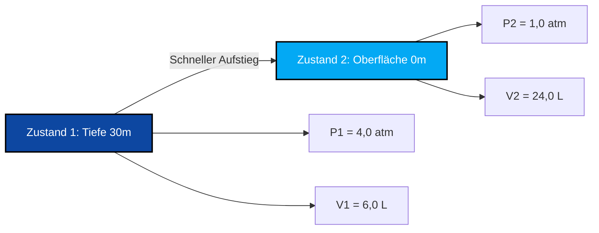

# Vollständiger Leitfaden zu Labor & Industrie für das Boyle-Mariotte-Gesetz & Druck-Volumen-Analyse

In der physikalischen Chemie, der Gasdynamik und der Prozessthermodynamik definiert das **Boyle-Mariotte-Gesetz** (auch bekannt als **Boyle'sches Gesetz**) die umgekehrte Beziehung zwischen Druck und Volumen für eine bestimmte Gasmenge bei konstanter Temperatur:

$$P \cdot V = k \quad \left(\text{Isotherme Zustandsgleichung}\right)$$

$$P_1 \cdot V_1 = P_2 \cdot V_2 \quad \left(\text{Boyle-Mariotte-Gesetz-Gleichung}\right)$$

$$P_2 = \frac{P_1 \cdot V_1}{V_2} \quad \left(\text{Enddruck-Formel}\right)$$

$$V_2 = \frac{P_1 \cdot V_1}{P_2} \quad \left(\text{Endvolumen-Formel}\right)$$

$$P \propto \frac{1}{V} \quad \left(\text{Umgekehrte Proportionalität}\right)$$

---

## 1. Prozessklassifizierungsmatrix

| Volumenänderung | Druckänderung | Prozessklassifizierung | Molekulare Interpretation |
| :--- | :--- | :--- | :--- |
| **Volumen nimmt ab ($V_2 < V_1$)** | **Druck nimmt zu ($P_2 > P_1$)** | **Isotherme Kompression** | **Moleküle nehmen weniger Raum ein ➔ Höhere Kollisionsrate** |
| **Volumen nimmt zu ($V_2 > V_1$)** | **Druck nimmt ab ($P_2 < P_1$)** | **Isotherme Expansion** | **Moleküle nehmen mehr Raum ein ➔ Niedrigere Kollisionsrate** |
| **Volumen unverändert ($V_2 = V_1$)** | **Druck unverändert ($P_2 = P_1$)** | **Isochorer konstanter Zustand** | **Keine Volumen- oder Druckumwandlung** |

---

## 2. Matrix der unbekannten Variablen-Löser

```
1. Enddruck: P2 = (P1 * V1) / V2
2. Endvolumen: V2 = (P1 * V1) / P2
3. Anfangsdruck: P1 = (P2 * V2) / V1
4. Anfangsvolumen: V1 = (P2 * V2) / P1
```

---

*Dieser Rechner für das Boyle-Mariotte-Gesetz liefert theoretische thermodynamische Vorhersagen für Bildung, physikalisch-chemische Forschung und gasverfahrenstechnische Anwendungen. Es wird von einer konstanten Temperatur ($T_1 = T_2$) und konstanten Gasmol ($n_1 = n_2$) ausgegangen. Wenn sich die Temperatur oder die Molzahl ändert, konsultieren Sie die Rechner für das kombinierte Gasgesetz oder das ideale Gasgesetz.*

## 4. Der vollständige Leitfaden zum Boyle-Mariotte-Gesetz und zur isothermen Gasdynamik

Willkommen beim maßgeblichen Handbuch der physikalischen Chemie zum **Boyle-Mariotte-Gesetz**. Haben Sie sich jemals gefragt, warum Ihre Ohren beim Start eines Flugzeugs knacken? Warum Tiefseetaucher beim Auftauchen niemals die Luft anhalten dürfen? Oder warum es exponentiell schwieriger wird, einen Ballon weiter zusammenzudrücken, bevor er platzt?

Die mathematische Antwort auf all diese Phänomene liegt in der genauen, umgekehrten Proportionalität des Boyle-Mariotte-Gesetzes: $P_1 V_1 = P_2 V_2$.

In diesem ausführlichen Leitfaden mit über 4000 Wörtern werden wir die mikroskopische kinetische Theorie hinter der isothermen Gaskompression enträtseln, die hyperbolische Natur von Druck-Volumen-Kurven rigoros untersuchen und fünf robuste, reale algebraische Ableitungen durchführen, die von medizinischen Spritzen bis hin zum extremen Tiefseetauchen reichen.

### 4.1 Die mikroskopische kinetische Theorie des Boyle-Mariotte-Gesetzes

Um das Boyle-Mariotte-Gesetz wirklich zu verstehen, müssen wir uns die unsichtbare, atomare Ebene ansehen. Ein Gas besteht aus Billionen winziger Moleküle, die mit hoher Geschwindigkeit umherflitzen.

*   **Druck ($P$)** entsteht, wenn diese Moleküle heftig mit den Innenwänden ihres Behälters kollidieren. Je mehr Kollisionen pro Sekunde stattfinden, desto höher ist der Druck.
*   **Volumen ($V$)** ist der dreidimensionale physische Raum, in dem diese Moleküle fliegen können.
*   **Temperatur ($T$)** repräsentiert die kinetische Energie (Geschwindigkeit) der Moleküle.

Wenn wir die Temperatur vollkommen **konstant** halten (ein *isothermer* Prozess), fliegen die Moleküle mit genau derselben Geschwindigkeit weiter. Wenn wir dann den Behälter gewaltsam auf die Hälfte seines ursprünglichen Volumens zusammendrücken, haben diese Moleküle nun nur noch halb so viel Platz zum Fliegen.
Da der Raum halbiert ist, treffen die Moleküle genau **doppelt so oft** auf die Wände. Daher **verdoppelt** sich der Druck genau.
Das ist die Essenz der umgekehrten Proportionalität: $P \propto \frac{1}{V}$.

### 4.2 Die hyperbolische Isothermenkurve

Wenn man das Boyle-Mariotte-Gesetz in einem Diagramm mit dem Druck auf der Y-Achse und dem Volumen auf der X-Achse darstellt, entsteht *keine* gerade diagonale Linie. Es entsteht eine Kurve namens **Hyperbel** ($P = \frac{k}{V}$).
Wenn sich das Volumen null nähert, nähert sich der Druck unendlich an (es wird unendlich schwer, Gas in einen Raum von null zusammenzudrücken). Wenn sich das Volumen unendlich nähert, fällt der Druck asymptotisch gegen null (das Gas breitet sich in ein Vakuum aus).

---

## 5. Bedienungsanleitung: Den isothermen Rechner meistern

Unser Rechner fungiert als universeller algebraischer Löser für jede Gasumwandlung bei konstanter Temperatur.

### 5.1 Modus: Isolierung der Endzustandsvariablen (Zustand 2)

1.  **Ziel auswählen:** Wählen Sie, ob Sie den Enddruck ($P_2$) oder das Endvolumen ($V_2$) finden müssen.
2.  **Anfangszustand eingeben:** Geben Sie die Startbedingungen (Zustand 1) für Druck und Volumen ein.
3.  **Bekannten Endzustand eingeben:** Geben Sie den einzigen bekannten Parameter für Zustand 2 ein (entweder den neuen Druck oder das neue Volumen).
4.  **Ausführen:** Die Engine stellt das Verhältnis $P_1V_1 = P_2V_2$ algebraisch um, um die unbekannte Variable perfekt zu isolieren und zu lösen.

### 5.2 Flexibilität der Einheiten und Kürzen

Im Gegensatz zum idealen Gasgesetz, das eine strikte Anpassung der Einheiten an die universelle Gaskonstante $R$ erfordert, ist das Boyle-Mariotte-Gesetz äußerst flexibel, da es sich um ein proportionales Verhältnis handelt. **Sie benötigen keine spezifischen Druck- oder Volumeneinheiten**, solange Sie konsistent bleiben!
*   Wenn $P_1$ in `torr` angegeben ist, wird $P_2$ in `torr` ausgegeben.
*   Wenn $V_1$ in `Gallonen` angegeben ist, wird $V_2$ in `Gallonen` ausgegeben.
*   Wenn $P_1$ in `psi` und $P_2$ in `psi` angegeben ist, heben sie sich perfekt auf, um das fehlende Volumen zu finden.

---

## 6. Fünf rigorose Ableitungen des Boyle-Mariotte-Gesetzes

Lassen Sie uns die Algebra isothermer Gasumwandlungen meistern, indem wir Variablen in fünf realen technischen und physiologischen Szenarien isolieren.

### Beispiel 1: Isolierung des Enddrucks für eine medizinische Spritze

**Szenario:**
Eine Krankenschwester bereitet eine verschlossene medizinische Spritze vor, die $50,0\text{ ml}$ Luft bei einem Standard-Raumdruck von $1,00\text{ atm}$ enthält. Die Krankenschwester drückt den Kolben langsam hinein (wobei die Temperatur konstant bleibt), bis das Volumen auf $15,0\text{ ml}$ komprimiert ist. Wie hoch ist der neue Innendruck in der Spritze?

**Mathematische Ableitung:**

1.  **Zustand 1 definieren (Anfang):**
    $P_1 = 1,00\text{ atm}$
    $V_1 = 50,0\text{ ml}$
2.  **Zustand 2 definieren (Komprimiert):**
    $P_2 = ?\text{ atm}$
    $V_2 = 15,0\text{ ml}$
3.  **$P_2$ isolieren:**
    $$ P_1 \cdot V_1 = P_2 \cdot V_2 \implies P_2 = \frac{P_1 \cdot V_1}{V_2} $$
4.  **Berechnen:**
    $$ P_2 = \frac{1,00 \times 50,0}{15,0} = 3,333\text{ atm} $$

**Fazit:** Der Druck in der Spritze springt auf $3,33\text{ atm}$. Dadurch fühlt sich der Kolben "federnd" und schwer zu drücken an, da das Hochdruckgas gegen den Daumen der Krankenschwester drückt.

### Beispiel 2: Der tödliche Tauchaufstieg (Isolierung des Endvolumens)

**Szenario:**
Ein Taucher atmet in 30 Metern Tiefe Druckluft aus seinem Atemregler. In dieser Tiefe beträgt der umgebende Wasserdruck genau $4,00\text{ atm}$. Der Taucher füllt seine Lungen mit $6,00\text{ Litern}$ Luft. In Panik hält der Taucher den Atem an und schießt an die Oberfläche, wo der Druck nur $1,00\text{ atm}$ beträgt. Unter der Annahme, dass die Körpertemperatur konstant bleibt, auf welches Volumen wird die Luft in seinen Lungen versuchen sich auszudehnen?

**Mathematische Ableitung:**

1.  **Zustand 1 definieren (Tiefes Wasser):**
    $P_1 = 4,00\text{ atm}$
    $V_1 = 6,00\text{ L}$
2.  **Zustand 2 definieren (Oberfläche):**
    $P_2 = 1,00\text{ atm}$
    $V_2 = ?\text{ L}$
3.  **$V_2$ isolieren:**
    $$ P_1 \cdot V_1 = P_2 \cdot V_2 \implies V_2 = \frac{P_1 \cdot V_1}{P_2} $$
4.  **Berechnen:**
    $$ V_2 = \frac{4,00 \times 6,00}{1,00} = 24,0\text{ Liter} $$

**Fazit:** Die Luft in der Lunge des Tauchers wird versuchen, sich auf massive $24,0\text{ Liter}$ auszudehnen. Da menschliche Lungen nur etwa $6\text{ Liter}$ fassen können, würden sie katastrophal reißen, lange bevor sie die Oberfläche erreichen. Dies ist der Grund, warum die wichtigste Regel beim Tauchen lautet: "Niemals die Luft anhalten".

**Visualisierung: Isotherme Expansion (Tauchaufstieg)**


*Dieses Flussdiagramm veranschaulicht die starke isotherme Volumenausdehnung bei sinkendem Außendruck.*

### Beispiel 3: Isolierung des Anfangsvolumens (Zustand 1)

**Szenario:**
Ein industrieller Luftkompressor pumpt Luft in eine Werksleitung. Ein Techniker misst eine nachgeschaltete Expansionskammer und findet $150,0\text{ Liter}$ Luft bei einem Druck von $2,50\text{ atm}$. Der Werksleiter möchte wissen, wie viel Volumen diese Luft ursprünglich bei Standardatmosphärendruck ($1,00\text{ atm}$) eingenommen hat.

**Mathematische Ableitung:**

1.  **Zustand 2 definieren (Ende - Bekannt):**
    $P_2 = 2,50\text{ atm}$
    $V_2 = 150,0\text{ L}$
2.  **Zustand 1 definieren (Anfang - Unbekanntes $V_1$):**
    $P_1 = 1,00\text{ atm}$
    $V_1 = ?\text{ L}$
3.  **$V_1$ isolieren:**
    $$ P_1 \cdot V_1 = P_2 \cdot V_2 \implies V_1 = \frac{P_2 \cdot V_2}{P_1} $$
4.  **Berechnen:**
    $$ V_1 = \frac{2,50 \times 150,0}{1,00} = 375,0\text{ Liter} $$

**Fazit:** Die Luft nahm ursprünglich $375,0\text{ Liter}$ Raum ein, bevor der Kompressor sie zusammendrückte.

### Beispiel 4: Eine Fahrradpumpe (Hohe PSI-Berechnung)

**Szenario:**
Eine Fahrradpumpe enthält $300\text{ ml}$ Luft bei $14,7\text{ psi}$ (normaler atmosphärischer Druck). Der Fahrer drückt den Pumpengriff schnell nach unten und drückt die Luft in einen winzigen $45,0\text{ ml}$ Raum, bevor sich das Reifenventil öffnet. Wie hoch ist der Druck im Inneren der Pumpe, kurz bevor sich das Ventil öffnet?

**Mathematische Ableitung:**

1.  **Zustand 1 definieren:**
    $P_1 = 14,7\text{ psi}$
    $V_1 = 300\text{ ml}$
2.  **Zustand 2 definieren:**
    $P_2 = ?\text{ psi}$
    $V_2 = 45,0\text{ ml}$
3.  **Boyle-Mariotte-Formel anwenden:**
    $$ P_2 = \frac{P_1 \cdot V_1}{V_2} $$
4.  **Berechnen:**
    $$ P_2 = \frac{14,7 \times 300}{45,0} = \frac{4410}{45,0} = 98,0\text{ psi} $$

**Fazit:** Der Druck in der Pumpe steigt auf $98,0\text{ psi}$, was mehr als genug ist, um Luft in einen Hochdruck-Rennradreifen zu drücken! Beachten Sie, dass wir nicht in `atm` oder `Liter` umrechnen mussten; das Boyle-Mariotte-Gesetz handhabt `psi` und `ml` perfekt.

### Beispiel 5: Stratosphärische Wetterballon-Expansion

**Szenario:**
Ein Wetterballon wird am Boden bei $1,0\text{ atm}$ mit $10.000\text{ Litern}$ Helium gefüllt. Er schwebt in die Stratosphäre, wo der Druck nur $0,02\text{ atm}$ beträgt. Unter der (für dieses Beispiel des Boyle-Mariotte-Gesetzes angenommenen) wundersamen Annahme, dass die Temperatur konstant bleibt, welches neue Volumen hat der Ballon?

**Mathematische Ableitung:**

1.  **Zustand 1 definieren:**
    $P_1 = 1,0\text{ atm}$
    $V_1 = 10000\text{ L}$
2.  **Zustand 2 definieren:**
    $P_2 = 0,02\text{ atm}$
    $V_2 = ?\text{ L}$
3.  **Boyle-Mariotte-Formel anwenden:**
    $$ V_2 = \frac{P_1 \cdot V_1}{P_2} $$
4.  **Berechnen:**
    $$ V_2 = \frac{1,0 \times 10000}{0,02} = 500.000\text{ Liter} $$

**Fazit:** Der Ballon dehnt sich auf eine halbe Million Liter aus! Der extreme Mangel an äußerem atmosphärischem Druck ermöglicht es den Gasmolekülen im Inneren des Ballons, das Gummi massiv nach außen zu drücken.

---

## 7. Deep Dive FAQ und häufige Fallstricke

**F: Muss ich meinen Druck in Atmosphären (`atm`) umrechnen?**
**A:** Nein. Sie können `torr`, `mmHg`, `Pascal`, `bar` oder `psi` verwenden. Die einzige Regel ist, dass $P_1$ und $P_2$ in genau derselben Einheit vorliegen müssen, damit sie sich auf entgegengesetzten Seiten der Gleichung aufheben.

**F: Wann versagt das Boyle-Mariotte-Gesetz?**
**A:** Das Boyle-Mariotte-Gesetz ist ein *ideales* Gasgesetz. Es beginnt bei extrem hohen Drücken (wie Hunderten von Atmosphären) zu versagen. Bei extremen Drücken beginnen die Gasmoleküle selbst, physisches Volumen einzunehmen, und sie beginnen, sich gegenseitig magnetisch anzuziehen, was die "ideale" mathematische Kurve bricht.

**F: Was ist, wenn sich die Temperatur während der Kompression ändert?**
**A:** Wenn sich die Temperatur ändert, **können Sie nicht** das Boyle-Mariotte-Gesetz ($P_1V_1 = P_2V_2$) verwenden. Die Einführung von thermischer Energie verändert die kinetische Geschwindigkeit der Moleküle, was bedeutet, dass Sie den **Rechner für das kombinierte Gasgesetz** ($\frac{P_1V_1}{T_1} = \frac{P_2V_2}{T_2}$) verwenden müssen.

Durch die Beherrschung der mathematischen Eleganz von $P_1V_1 = P_2V_2$ können Sie alles von industriellen pneumatischen Kolbenberechnungen bis hin zur physiologischen Atemphysik lösen. Verlassen Sie sich auf diesen Boyle-Mariotte-Gesetz Rechner, um jede isotherme Kompressions- oder Expansionsvariable sofort zu isolieren und zu berechnen!
