# Labor- & Analytische Chemie Leitfaden für Pufferlösungen & Pufferanalyse

In der analytischen, physikalischen und biologischen Chemie halten **Pufferlösungen** stabile Wasserstoffionenkonzentrationen ($\text{pH}$) aufrecht, wenn sie Säure- oder Basezugaben, Verdünnungen oder Umweltveränderungen ausgesetzt sind:

$$\text{pH} = \text{p}K_a + \log_{10}\left(\frac{[\text{A}^-]}{[\text{HA}]}\right) \quad \iff \quad \frac{[\text{A}^-]}{[\text{HA}]} = 10^{\text{pH} - \text{p}K_a}$$

$$\beta = 2.303 \cdot C_{\text{total}} \cdot \frac{K_a [\text{H}^+]}{(K_a + [\text{H}^+])^2} \quad \text{wobei } C_{\text{total}} = [\text{HA}] + [\text{A}^-]$$

---

## 1. Gängige Labor-Puffersysteme & Referenzmatrix

| Puffersystem | Schwache Säure / Base | Konjugierte Form | $\text{p}K_a$ ($25^\circ\text{C}$) | Nützlicher pH-Bereich | Hauptanwendungen |
| :--- | :--- | :--- | :--- | :--- | :--- |
| **Citrat** | Citronensäure ($\text{H}_3\text{Cit}$) | Dihydrogencitrat ($\text{H}_2\text{Cit}^-$) | **$3.13$** | $2.13 - 4.13$ | Lebensmittel, Pharmazeutische Assays |
| **Acetat** | Essigsäure ($\text{CH}_3\text{COOH}$) | Acetat ($\text{CH}_3\text{COO}^-$) | **$4.76$** | $3.76 - 5.76$ | Enzymatische Assays, Biochemie |
| **Phosphat ($\text{p}K_{a2}$)** | Dihydrogenphosphat ($\text{H}_2\text{PO}_4^-$) | Hydrogenphosphat ($\text{HPO}_4^{2-}$) | **$7.20$** | $6.20 - 8.20$ | Biologische Puffer (PBS), Zellkultur |
| **Tris** | Tris(hydroxymethyl)aminomethan | Tris-$\text{H}^+$ | **$8.07$** | $7.07 - 9.07$ | Molekularbiologie, Elektrophorese |
| **Carbonat** | Bicarbonat ($\text{HCO}_3^-$) | Carbonat ($\text{CO}_3^{2-}$) | **$10.33$** | $9.33 - 11.33$ | Klinische Diagnostik |

---

## 2. Standardprotokolle zur Pufferberechnung

```
1. Puffer-pH: pH = pKa + log10([A-] / [HA])
2. Basischer Puffer pOH: pOH = pKb + log10([BH+] / [B]), pH = pKw - pOH
3. Pufferkapazität Beta: Beta = 2.303 * Ctotal * (Ka*[H+]) / (Ka + [H+])^2
4. Zugabe starker Säure: Verbleibende Mole A- = Anfängliche Mole A- - Hinzugefügte Mole H+
5. Zugabe starker Base: Verbleibende Mole HA = Anfängliche Mole HA - Hinzugefügte Mole OH-
```

---

## 3. Haftungsausschluss für Bildung & Laborsicherheit
*Dieser Pufferlösungs-Rechner liefert theoretische Pufferberechnungen für Bildungszwecke, Laborforschung und AP-Chemie-Anwendungen. Bei konzentrierten, nicht-idealen Lösungen mit hohen Ionenstärken sollten Aktivitätskoeffizienten mithilfe von Debye-Hückel- oder Pitzer-Gleichungen berücksichtigt werden.*

## 4. Der umfassende Leitfaden zu Pufferlösungen und pH-Widerstand

Willkommen zum ultimativen Leitfaden für das Verständnis, die Entwicklung und die Analyse von chemischen Puffersystemen. Während reines Wasser massiven, heftigen pH-Schwankungen unterliegt, wenn auch nur ein Tropfen Säure hinzugefügt wird, ist eine **Pufferlösung** chemisch so konzipiert, dass sie diese Schocks abfängt. Ob Sie als Biologe Zellkulturen pflegen, als Chemieingenieur enzymatische Synthesen hochskalieren oder als Mediziner die Blutplasma-Azidose untersuchen, die Beherrschung der Pufferchemie ist unerlässlich.

Ein Puffer erreicht diese "pH-Stoßdämpfung", indem er gleichzeitig zwei entgegengesetzte chemische Komponenten enthält: eine **schwache Säure** (bereit, jede eingehende Base zu neutralisieren) und ihre **konjugierte Base** (bereit, jede eingehende Säure zu neutralisieren). Die Gleichgewichtsmathematik, die dieses Tauziehen diktiert, wird durch die Henderson-Hasselbalch-Gleichung und das Konzept der Pufferkapazität ($\beta$) beschrieben.

In diesem ausführlichen, über 4000 Wörter umfassenden technischen Leitfaden werden wir die Thermodynamik der Pufferherstellung entschlüsseln, aufschlüsseln, wie Puffer für spezifische Ziel-pH-Werte entworfen werden, die Regeln für den Abbau der Pufferkapazität bei Verdünnung aufstellen und fünf strenge, reale Beispiele komplett mit mathematischen Ableitungen und exakten visuellen Mermaid-Diagrammen durchgehen.

### 4.1 Was genau ist eine Pufferlösung?

Ein Puffer ist keine magische Neutralisationsflüssigkeit; er ist ein sorgfältig kalibriertes chemisches Gleichgewicht. Um einen Puffer herzustellen, müssen Sie kombinieren:
1.  **Eine schwache Säure ($\text{HA}$):** Diese dient als interne Protonenreserve ($\text{H}^+$). Wird dem System eine starke Base ($\text{OH}^-$) hinzugefügt, gibt die schwache Säure ihr Proton ab, um sie zu neutralisieren, wird zu Wasser und hinterlässt mehr konjugierte Base.
2.  **Ihre konjugierte Base ($\text{A}^-$):** Diese dient als interner Protonenschwamm. Wird dem System eine starke Säure ($\text{H}^+$) hinzugefügt, absorbiert die konjugierte Base das Proton und wird zu mehr schwacher Säure.

Die zentrale Gleichung für dieses Gleichgewicht ist die **Henderson-Hasselbalch-Gleichung**:
$$ \text{pH} = \text{p}K_a + \log_{10}\left(\frac{[\text{A}^-]}{[\text{HA}]}\right) $$

Diese Gleichung besagt, dass der endgültige pH-Wert Ihres Puffers vollständig von zwei Dingen abhängt: der intrinsischen Stärke der Säure ($\text{p}K_a$) und dem physikalischen Verhältnis von konjugierter Base zu schwachen Säuremolekülen, die Sie in das Becherglas gegeben haben.

### 4.2 Einen Puffer entwerfen: Die Wahl des richtigen pKa

Wenn Sie einen Puffer entwerfen müssen, der einen bestimmten pH-Wert halten soll, können Sie nicht einfach eine beliebige Säure aus dem Regal nehmen. **Sie müssen eine Säure wählen, deren $\text{p}K_a$ so nah wie möglich an Ihrem Ziel-pH-Wert liegt.**

Warum? Weil die Pufferkapazität (die Fähigkeit, pH-Änderungen zu widerstehen) maximiert wird, wenn die Konzentration der Säure und der konjugierten Base genau gleich ist ($[\text{A}^-] = [\text{HA}]$). An diesem spezifischen Gleichgewichtspunkt beträgt das Verhältnis $[\text{A}^-]/[\text{HA}]$ genau 1,0. Da der Logarithmus von 1 gleich 0 ist, reduziert sich die Gleichung zu:
$$ \text{pH} = \text{p}K_a $$

Wenn Sie also einen Puffer benötigen, der bei pH 4,76 hält, sollten Sie Essigsäure wählen ($\text{p}K_a = 4.76$). Wenn Sie einen Puffer benötigen, der bei pH 7,20 hält, sollten Sie das Phosphatsystem wählen ($\text{p}K_a = 7.20$).

### 4.3 Pufferkapazität ($\beta$) und die Regel der Eins

Die **Pufferkapazität ($\beta$)** misst die Menge an starker Säure oder Base, die erforderlich ist, um den pH-Wert von 1 Liter Pufferlösung um genau 1 Einheit zu ändern.

$$ \beta = \frac{dC_b}{d(\text{pH})} = -\frac{dC_a}{d(\text{pH})} = 2.303 \times C_{\text{total}} \times \frac{K_a [\text{H}^+]}{(K_a + [\text{H}^+])^2} $$

Diese aus der Infinitesimalrechnung abgeleitete Formel verrät uns zwei kritische Fakten über das Pufferdesign:
1.  **Konzentration ist das Wichtigste:** Ein $1.0\text{ M}$ Puffer hat die zehnfache Pufferkapazität eines $0.1\text{ M}$ Puffers, selbst wenn ihr pH-Wert identisch ist. Mehr Gesamtmoleküle ($C_{\text{total}}$) bedeuten mehr physikalische Fähigkeit, eingehende Bedrohungen zu neutralisieren.
2.  **Die Regel der Eins:** Ein Puffer gilt als "gebrochen" oder nutzlos, wenn sein pH-Wert mehr als **1,0 Einheit** von seinem $\text{p}K_a$ abweicht. Bei $\text{pH} = \text{p}K_a \pm 1$ ist das Verhältnis von Säure zu Base entweder $10:1$ oder $1:10$. Der Puffer ist völlig einseitig und wird schnell versagen, wenn er von der schwächeren Seite angegriffen wird.

### 4.4 Verdünnung und Puffererschöpfung

Was passiert, wenn Sie einen perfekten $0.5\text{ M}$ Puffer mit dem gleichen Volumen an reinem Wasser verdünnen?
Die Konzentrationen sowohl der Säure $[\text{HA}]$ als auch der Base $[\text{A}^-]$ sinken auf $0.25\text{ M}$. Da sie jedoch beide genau um die Hälfte gesunken sind, bleibt ihr **Verhältnis identisch**. Daher **ändert die Verdünnung eines Puffers nicht seinen pH-Wert**.

Die Verdünnung eines Puffers halbiert jedoch seine Gesamtkonzentration ($C_{\text{total}}$), was seine **Pufferkapazität ($\beta$) halbiert**. Er ist nun doppelt so anfällig dafür, überwältigt zu werden. Wenn ein Puffer überwältigt ist, erreicht er eine **Puffererschöpfung**, was bedeutet, dass entweder das gesamte $[\text{HA}]$ oder das gesamte $[\text{A}^-]$ vollständig verbraucht wurde.

---

## 5. Bedienungsanleitung: Den Puffer-Rechner beherrschen

Unser Puffer-Rechner ist so konzipiert, dass er sowohl die Vorwärtsanalyse (Wie hoch ist der pH-Wert?) als auch das Rückwärtsdesign (Wie stelle ich einen pH-7,4-Puffer her?) bewältigt.

### 5.1 Einfache Puffer-pH-Berechnung

1.  **Modus auswählen:** Wählen Sie "Puffer-pH".
2.  **Parameter eingeben:** Geben Sie den $\text{p}K_a$ Ihrer Säure, die Konzentration der konjugierten Base $[\text{A}^-]$ und die Konzentration der schwachen Säure $[\text{HA}]$ ein.
3.  **Ergebnis ablesen:** Der Rechner liefert den finalen pH-Wert der Mischung, das Verhältnis und zeichnet die genaue Position auf der Kapazitätskurve.

### 5.2 Labor-Pufferdesign

1.  **Modus auswählen:** Wählen Sie "Puffer entwerfen".
2.  **Parameter eingeben:** Geben Sie Ihren Ziel-pH-Wert, den $\text{p}K_a$ Ihrer Säure und Ihre gewünschte Gesamtkonzentration ($C_{\text{total}}$) ein.
3.  **Ausführen:** Das Tool verwendet inverse Logarithmen, um die genaue erforderliche Molarität von $[\text{HA}]$ und $[\text{A}^-]$ zu berechnen. Es schreibt im Grunde genommen Ihr Laborrezept für Sie.

### 5.3 Simulation der Säure-/Basenzugabe

1.  **Modus auswählen:** Wählen Sie "Starke Säure / Base hinzufügen".
2.  **Anfangszustand eingeben:** Geben Sie die Anfangskonzentrationen Ihres Puffers ein.
3.  **Angriff eingeben:** Geben Sie die Mole der hinzugefügten starken Säure ($\text{HCl}$) oder starken Base ($\text{NaOH}$) ein.
4.  **Ausführen:** Der Rechner führt eine stöchiometrische Subtraktion durch, um die neuen Konzentrationen zu finden, und berechnet dann den neuen pH-Wert, um genau zu zeigen, wie stark sich der Puffer verschoben hat.

---

## 6. Fünf reale Konzeptbeispiele

Abstrakte Mathematik wird zu einem mächtigen Werkzeug, wenn sie in der physikalischen Chemie angewendet wird. Im Folgenden finden Sie fünf strenge Beispiele, die die Pufferherstellung, die physiologische Blutpufferung und die Berechnung der Neutralisationskapazität abdecken.

### Beispiel 1: Der klassische Acetatpuffer

**Szenario:** 
Ein Biochemiker bereitet eine Pufferlösung zu, die $0.35\text{ M}$ Essigsäure ($\text{CH}_3\text{COOH}$, $\text{p}K_a = 4.76$) und $0.15\text{ M}$ Natriumacetat ($\text{CH}_3\text{COONa}$) enthält. Wie hoch ist der pH-Wert dieser Lösung?

**Mathematische Ableitung:**

1.  **Komponenten identifizieren:**
    Schwache Säure $[\text{HA}] = 0.35\text{ M}$
    Konjugierte Base $[\text{A}^-] = 0.15\text{ M}$
    Säure $\text{p}K_a = 4.76$
2.  **Henderson-Hasselbalch anwenden:**
    $$ \text{pH} = \text{p}K_a + \log_{10}\left(\frac{[\text{A}^-]}{[\text{HA}]}\right) $$
    $$ \text{pH} = 4.76 + \log_{10}\left(\frac{0.15}{0.35}\right) $$
    $$ \text{pH} = 4.76 + \log_{10}(0.428) $$
    $$ \text{pH} = 4.76 - 0.368 $$
    $$ \text{pH} = 4.392 \approx 4.39 $$

**Fazit:** Der pH-Wert beträgt 4,39. Da deutlich mehr schwache Säure ($0.35\text{ M}$) als konjugierte Base ($0.15\text{ M}$) vorhanden ist, wird der pH-Wert weit unter den intrinsischen $\text{p}K_a$ (4,76) gezogen.

### Beispiel 2: Entwurf eines Tris-Puffers für die DNA-Elektrophorese

**Szenario:**
Ein Molekularbiologe muss einen Tris-Puffer mit genau pH 8,30 für die Gelelektrophorese entwerfen. Der $\text{p}K_a$ von Tris-$\text{H}^+$ beträgt 8,07. Wenn er eine Gesamtpufferkonzentration ($C_{\text{total}}$) von $0.100\text{ M}$ wünscht, welche Konzentrationen an Tris-Base ($\text{A}^-$) und Tris-$\text{H}^+$-Säure ($\text{HA}$) werden benötigt?

**Mathematische Ableitung:**

1.  **Berechne das benötigte Verhältnis:**
    $$ \text{pH} - \text{p}K_a = \log_{10}\left(\frac{[\text{A}^-]}{[\text{HA}]}\right) $$
    $$ 8.30 - 8.07 = 0.23 $$
    $$ \text{Verhältnis} = 10^{0.23} = 1.698 $$
    Das bedeutet $[\text{A}^-] = 1.698 \times [\text{HA}]$
2.  **Bedingung der Gesamtkonzentration anwenden:**
    $$ [\text{A}^-] + [\text{HA}] = 0.100\text{ M} $$
    $$ (1.698 \times [\text{HA}]) + [\text{HA}] = 0.100\text{ M} $$
    $$ 2.698 \times [\text{HA}] = 0.100\text{ M} $$
    $$ [\text{HA}] = 0.0371\text{ M} $$
3.  **Die konjugierte Base finden:**
    $$ [\text{A}^-] = 0.100 - 0.0371 = 0.0629\text{ M} $$

**Fazit:** Das Rezept erfordert $0.037\text{ M}$ Tris-Säure und $0.063\text{ M}$ Tris-Base.

### Beispiel 3: Der basische Ammoniakpuffer

**Szenario:**
Ein Student stellt einen basischen Puffer her, indem er $0.20\text{ M}$ Ammoniak ($\text{NH}_3$, schwache Base) und $0.30\text{ M}$ Ammoniumchlorid ($\text{NH}_4\text{Cl}$, konjugierte Säure) mischt. Der $\text{p}K_b$ von Ammoniak beträgt 4,75. Wie hoch ist der pH-Wert bei $25^\circ\text{C}$?

**Mathematische Ableitung:**

1.  **Berechne den pOH-Wert mit der Basenform von Henderson-Hasselbalch:**
    $$ \text{pOH} = \text{p}K_b + \log_{10}\left(\frac{[\text{Konjugierte Säure}]}{[\text{Schwache Base}]}\right) $$
    $$ \text{pOH} = 4.75 + \log_{10}\left(\frac{0.30}{0.20}\right) $$
    $$ \text{pOH} = 4.75 + \log_{10}(1.50) $$
    $$ \text{pOH} = 4.75 + 0.176 = 4.926 $$
2.  **pOH in pH umwandeln:**
    $$ \text{pH} = 14.00 - \text{pOH} $$
    $$ \text{pH} = 14.00 - 4.926 = 9.074 \approx 9.07 $$

**Visualisierung: Ableitung eines basischen Puffers**


*Dieses Flussdiagramm visualisiert den zusätzlichen Schritt, der beim Entwurf von alkalischen Puffern mit $\text{p}K_b$ erforderlich ist.*

### Beispiel 4: Der Säureangriff (Simulation der Pufferresistenz)

**Szenario:**
Nehmen wir $1.0\text{ Liter}$ eines generischen Puffers, der $0.50\text{ M HA}$ ($\text{p}K_a = 6.00$) und $0.50\text{ M A}^-$ enthält. Der anfängliche pH-Wert beträgt genau 6,00. Dann injizieren wir $0.15\text{ Mole}$ reiner Salzsäure ($\text{HCl}$). Wie lautet der neue pH-Wert, und um wie viel hat er sich geändert?

**Mathematische Ableitung:**

1.  **Anfangszustand:**
    $[\text{HA}] = 0.50\text{ mol}$
    $[\text{A}^-] = 0.50\text{ mol}$
2.  **Stöchiometrische Neutralisation:**
    Die $0.15\text{ mol}$ starkes $\text{H}^+$ zerstören vollständig $0.15\text{ mol}$ der konjugierten Base ($\text{A}^-$) und verwandeln sie in eine schwache Säure ($\text{HA}$).
    **Neues $[\text{A}^-]$:** $0.50 - 0.15 = 0.35\text{ mol}$
    **Neues $[\text{HA}]$:** $0.50 + 0.15 = 0.65\text{ mol}$
3.  **Neuen pH-Wert berechnen:**
    $$ \text{pH} = 6.00 + \log_{10}\left(\frac{0.35}{0.65}\right) $$
    $$ \text{pH} = 6.00 + \log_{10}(0.538) $$
    $$ \text{pH} = 6.00 - 0.269 = 5.73 $$

**Fazit:** Obwohl $0.15\text{ Mole}$ einer reinen starken Säure absorbiert wurden, sank der pH-Wert nur um **0,27 Einheiten** (von 6,00 auf 5,73). Wäre dieselbe Säure zu ungepuffertem Wasser hinzugegeben worden, wäre der pH-Wert auf 0,82 abgestürzt.

**Visualisierung: Laboraufbau zur Neutralisation**

```mermaid
gantt
    title Labor-Zeitplan: Pufferneutralisationstest
    dateFormat  HH:mm:ss
    axisFormat  %H:%M
    section Vorbereitung
    Mische 0.5M HA und 0.5M A- :active, 00:00:00, 00:10:00
    Notiere anfänglichen pH 6.00 :milestone, 00:10:00, 00:10:00
    section Angriffsphase
    Injiziere 0.15M HCl :crit, 00:10:00, 00:15:00
    Rühren und Äquilibrieren :active, 00:15:00, 00:20:00
    section Analyse
    Notiere finalen pH 5.73 :milestone, 00:20:00, 00:20:00
```



*Diese Gantt-Zeitleiste bildet die kritische Sequenz der Pufferherstellung, der Aufzeichnung von Basisdaten und der Durchführung des stöchiometrischen Säureangriffs ab.*

### Beispiel 5: Puffererschöpfung (Den Puffer brechen)

**Szenario:**
Wir nehmen exakt denselben 1,0 L Puffer aus Beispiel 4 ($0.50\text{ M HA}$, $0.50\text{ M A}^-$, $\text{p}K_a = 6.00$). Diesmal injizieren wir aggressiv $0.60\text{ Mole}$ reine $\text{HCl}$. Was passiert?

**Mathematische Ableitung:**

1.  **Anfangszustand:**
    $[\text{A}^-] = 0.50\text{ mol}$
2.  **Stöchiometrische Neutralisation:**
    Wir fügen $0.60\text{ mol}$ $\text{H}^+$ hinzu.
    Das $\text{H}^+$ beginnt, das $[\text{A}^-]$ anzugreifen.
    Es stehen jedoch nur $0.50\text{ mol}$ an $[\text{A}^-]$ zur Verfügung. 
    Der Puffer wird vollständig zerstört. Das gesamte $[\text{A}^-]$ wird zu $0\text{ M}$.
3.  **Überschüssige starke Säure:**
    $0.60\text{ mol hinzugefügt} - 0.50\text{ mol neutralisiert} = 0.10\text{ mol}$ an nicht neutralisiertem, reinem $\text{H}^+$, das in der 1,0 L Lösung verbleibt.
4.  **Finalen pH-Wert berechnen:**
    Der Puffer ist zerstört. Der pH-Wert wird nun vollständig durch die überschüssige starke Säure bestimmt.
    $$ \text{pH} = -\log_{10}(0.10) = 1.00 $$

**Fazit:** Der Puffer erlitt eine katastrophale Erschöpfung. Durch Überschreiten seiner Kapazität stürzte der pH-Wert heftig von 6,00 auf 1,00 ab.

---

## 7. Deep Dive FAQ und erweiterte Fehlerbehebung

**F: Kann ich einen Puffer aus Salzsäure (HCl) herstellen?**
**A:** Nein. Salzsäure ist eine starke Säure; sie dissoziiert zu 100 % in Wasser. Ein Puffer erfordert eine schwache Säure, die in einem Gleichgewichtszustand existiert und in der Lage ist, hin- und herzuschwanken, um Stöße abzufangen.

**F: Warum ändert sich mein Puffer-pH-Wert, wenn ich die Temperatur ändere?**
**A:** Der $\text{p}K_a$-Wert selbst ist stark temperaturabhängig, da die Säuredissoziation durch die Thermodynamik gesteuert wird ($\Delta G^\circ = -RT \ln K_a$). Beispielsweise hat der Tris-Puffer einen bekanntermaßen großen Temperaturkoeffizienten. Wenn Sie einen Tris-Puffer bei Raumtemperatur einstellen und ihn dann in einen $4^\circ\text{C}$ warmen Kühlschrank stellen, wird sein pH-Wert deutlich ansteigen.

**F: Was passiert, wenn ich einen Puffer herstelle, bei dem [A-] 1000-mal größer als [HA] ist?**
**A:** Sie haben eine Lösung geschaffen, die völlig einseitig ist. Während sich ihr pH-Wert rechnerisch auf $\text{p}K_a + 3$ belaufen mag, hat sie absolut keine Fähigkeit, starke Basen zu neutralisieren, da effektiv kein $[\text{HA}]$ mehr übrig ist, um sich zu wehren. Sie liegt außerhalb des effektiven $\text{p}K_a \pm 1$ Bereichs und ist kein echter Puffer.

**F: Hat die Pufferkapazität ($\beta$) Einheiten?**
**A:** Ja, sie wird typischerweise in den Einheiten Molarität pro pH-Einheit ($\text{M}/\text{pH}$) ausgedrückt. Sie repräsentiert die Mole an starker Säure oder Base, die erforderlich sind, um den pH-Wert eines Liters Puffer um genau eine pH-Einheit zu ändern.

Durch das tiefe Verständnis der thermodynamischen Mechanismen hinter Pufferlösungen besitzen Sie die theoretische Macht, undurchdringliche chemische Puffer zu entwerfen, industrielle Synthesen ohne katastrophale Säureschwankungen zu skalieren und den genauen Moment der Puffererschöpfung zu berechnen. Verlassen Sie sich immer auf diesen Puffer-Rechner, um Ihre stöchiometrischen Entwürfe zu überprüfen und analytische Perfektion zu garantieren!
