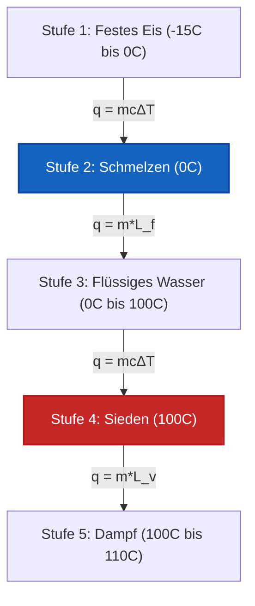

# Umfassender Leitfaden zur Kalorimetrie & Wärmeübertragung für Labor & Industrie

In der physikalischen Chemie, Thermodynamik und chemischen Verfahrenstechnik misst die **Kalorimetrie** den Austausch thermischer Energie in geschlossenen und isolierten Systemen:

$$q = m \cdot c \cdot \Delta T \quad \left(\text{Fühlbare Wärmeübertragung}\right)$$

$$q_{\text{phase}} = m \cdot L \quad \left(\text{Latente Wärme der Phasenänderung}\right)$$

$$m_1 c_1 (T_{\text{eq}} - T_1) + m_2 c_2 (T_{\text{eq}} - T_2) + C_{\text{cal}} (T_{\text{eq}} - T_{\text{cal,init}}) = 0$$

$$T_{\text{eq}} = \frac{m_1 c_1 T_1 + m_2 c_2 T_2}{m_1 c_1 + m_2 c_2} \quad \left(\text{Thermische Gleichgewichtstemperatur}\right)$$

$$q_{\text{rxn}} = -\left(q_{\text{solution}} + q_{\text{calorimeter}}\right)$$

---

## 1. Vergleich von Kalorimetrieausrüstung & Experimentiermodi

| Modus | Betriebsbedingung | Hauptgleichung | Gemessener Wert |
| :--- | :--- | :--- | :--- |
| **Kaffeetassen-Kalorimeter** | **Konstanter Druck ($P = \text{const}$)** | $q_{\text{rxn}} = -(m c \Delta T + C_{\text{cal}} \Delta T)$ | **Enthalpieänderung ($\Delta H$)** |
| **Bombenkalorimeter** | **Konstantes Volumen ($V = \text{const}$)** | $q_v = -C_{\text{cal}} \Delta T$ | **Innere Energie ($\Delta U$)** |
| **Thermisches Gleichgewicht** | **Isoliertes System ($q_{\text{total}} = 0$)** | $T_{\text{eq}} = \frac{\sum m_i c_i T_i}{\sum m_i c_i}$ | **Gleichgewichtstemp. ($T_{\text{eq}}$)** |
| **Phasenänderung** | **Konstante Temperatur ($T = \text{const}$)** | $q = m \cdot L_f$ oder $q = m \cdot L_v$ | **Latente Wärme ($L$)** |

---

## 2. Matrix der Thermochemie-Berechnungsmethoden

```
1. Übertragene fühlbare Wärme: q = m * c * (T_final - T_initial)
2. Thermisches Gleichgewicht: T_eq = (m1*c1*T1 + m2*c2*T2) / (m1*c1 + m2*c2)
3. Kaffeetassen-Reaktionswärme: q_rxn = -(q_sol + q_cal)
4. Bombenkalorimetrie-Wärme: q_v = ΔU = -C_cal * ΔT
5. Latente Schmelzwärme: q_melt = m * L_f
6. Latente Verdampfungswärme: q_boil = m * L_v
7. Mehrstufige Heizkurve: q_total = q_solid + q_melt + q_liquid + q_boil + q_gas
```

---

*Dieser Kalorimetrie-Rechner bietet theoretische Wärmeübertragungsvorhersagen für Anwendungen in der Bildung, physikalischen Chemieforschung und Verfahrenstechnik. Echte kalorimetrische Messungen sollten die Wärmekapazität des Kalorimeters ($C_{\text{cal}}$), Wärmeverluste an die Umgebung und nicht-ideales Mischen von Lösungen berücksichtigen.*

## 4. Der umfassende Leitfaden zur Kalorimetrie und zum thermischen Gleichgewicht

Willkommen zum ultimativen Handbuch der physikalischen Chemie über **Kalorimetrie und Wärmeübertragung**. In der Thermodynamik kann Energie weder erzeugt noch vernichtet, sondern nur übertragen werden. Die Kalorimetrie ist die exakte mathematische Wissenschaft, um genau zu verfolgen, wohin diese Wärmeenergie fließt.

In diesem ausführlichen Leitfaden werden wir die Physik der spezifischen Wärmekapazität, das thermodynamische Gleichgewicht isolierter Systeme ($q_{\text{lost}} + q_{\text{gained}} = 0$) und die verborgene thermische Last von Phasenänderungen (Latente Wärme) meistern. Wir behandeln Kaffeetassensysteme mit konstantem Druck und Stahlbomben mit konstantem Volumen. Schließlich werden wir fünf anspruchsvolle, praxisnahe Wärmeübertragungsszenarien lösen und die thermische Dynamik mithilfe hochpräziser Mermaid-Diagramme visualisieren.

### 4.1 Spezifische Wärme vs. Wärmekapazität

*   **Spezifische Wärmekapazität ($c$):** Die Energie, die erforderlich ist, um $1\text{ Gramm}$ einer Substanz um $1^\circ\text{C}$ zu erwärmen. Dies ist eine intensive Eigenschaft (sie hängt nur vom Material ab). Für flüssiges Wasser gilt $c = 4,184\text{ J/g}^\circ\text{C}$.
*   **Wärmekapazität ($C$):** Die Energie, die erforderlich ist, um die Temperatur eines *gesamten Objekts* (wie eines Bombenkalorimetergefäßes) um $1^\circ\text{C}$ zu erhöhen. Dies ist eine extensive Eigenschaft. $C = m \cdot c$.

### 4.2 Das Gesetz des thermischen Gleichgewichts

Wenn Sie einen glühenden Kupferblock in ein Becherglas mit kaltem Wasser fallen lassen, fließt Wärme vom Kupfer zum Wasser, bis beide exakt dieselbe Endtemperatur erreichen. Dies ist das **Thermische Gleichgewicht ($T_{\text{eq}}$)**.

Unter der Annahme, dass das Becherglas perfekt isoliert ist (keine Wärme in den Raum entweicht):
$$q_{\text{lost by copper}} + q_{\text{gained by water}} = 0$$
$$m_{\text{cu}}c_{\text{cu}}(T_{\text{eq}} - T_{\text{cu,init}}) + m_{\text{w}}c_{\text{w}}(T_{\text{eq}} - T_{\text{w,init}}) = 0$$

*Hinweis: Der Term $q_{\text{lost}}$ wird naturgemäß zu einer negativen Zahl, da $T_{\text{eq}} < T_{\text{init}}$ ist, was das algebraische Gleichgewicht erfüllt.*

### 4.3 Fühlbare Wärme vs. Latente Wärme

*   **Fühlbare Wärme ($q = mc\Delta T$):** Wärmeübertragung, die eine messbare Temperaturänderung verursacht. Man kann sie mit einem Thermometer "fühlen".
*   **Latente Wärme ($q = mL$):** Wärmeübertragung, die eine Phasenänderung (wie schmelzendes Eis oder kochendes Wasser) bei *konstanter Temperatur* verursacht. Das Thermometer bewegt sich nicht! Die Energie wird vollständig verbraucht, um intermolekulare Bindungen aufzubrechen. 

---

## 5. Bedienungsanleitung: Den Kalorimetrie-Rechner meistern

Unser Rechner fungiert als universeller Wärmeübertragungslöser für Physik, Chemie und Maschinenbau.

### 5.1 Modus: Thermisches Gleichgewicht (Mischen von Heiß und Kalt)

1.  **Modus wählen:** Wählen Sie "Thermisches Gleichgewicht (Mischen)".
2.  **Heißes Objekt eingeben:** Geben Sie Masse, spezifische Wärme und Anfangstemperatur der heißen Substanz ein.
3.  **Kaltes Objekt eingeben:** Geben Sie Masse, spezifische Wärme und Anfangstemperatur der kalten Substanz ein.
4.  **Ausführen:** Das Tool wendet die Energieerhaltungsgleichung an, um nach der endgültigen, einheitlichen $T_{\text{eq}}$ aufzulösen.

### 5.2 Modus: Mehrstufige Heizkurve

1.  **Modus wählen:** Wählen Sie "Mehrstufige Heizkurve".
2.  **Anfangszustand eingeben:** Geben Sie die Masse der Substanz ein (z. B. Eis bei $-20^\circ\text{C}$).
3.  **Zielzustand eingeben:** Geben Sie den Zielzustand ein (z. B. Dampf bei $150^\circ\text{C}$).
4.  **Ausführen:** Die Engine berechnet alle 5 Stufen der Wärmeübertragung: Erwärmen des Feststoffs, Schmelzen des Feststoffs (latente Schmelzwärme), Erwärmen der Flüssigkeit, Sieden der Flüssigkeit (latente Verdampfungswärme) und Erwärmen des Gases. 

---

## 6. Fünf rigorose Wärmeübertragungsableitungen

Lassen Sie uns diese Physik untermauern, indem wir fünf komplexe thermische Szenarien lösen.

### Beispiel 1: Einfache fühlbare Wärme ($q = mc\Delta T$)

**Szenario:** 
Sie möchten $250\text{ g}$ flüssiges Wasser von $20,0^\circ\text{C}$ auf $85,0^\circ\text{C}$ erhitzen, um eine Tasse Tee zuzubereiten. Wie viel Energie wird benötigt? ($c_{\text{water}} = 4,184\text{ J/g}^\circ\text{C}$)

**Mathematische Ableitung:**

1.  **Temperaturänderung bestimmen ($\Delta T$):**
    $\Delta T = 85,0 - 20,0 = +65,0^\circ\text{C}$
2.  **Wärmegleichung anwenden:**
    $$ q = m \cdot c \cdot \Delta T $$
    $$ q = 250\text{ g} \times 4,184\text{ J/g}^\circ\text{C} \times 65,0^\circ\text{C} $$
3.  **Berechnen:**
    $$ q = 67990\text{ Joule} = +67,99\text{ kJ} $$

**Fazit:** Es werden exakt $67,99\text{ kJ}$ Energie benötigt, um das Wasser für Ihren Tee zu erhitzen.

### Beispiel 2: Thermisches Gleichgewicht (Heißes Metall in Wasser)

**Szenario:**
Sie lassen einen $50,0\text{ g}$ schweren Block aus heißem Eisen ($c = 0,449\text{ J/g}^\circ\text{C}$) mit einer Anfangstemperatur von $120,0^\circ\text{C}$ in $100,0\text{ g}$ Wasser ($c = 4,184\text{ J/g}^\circ\text{C}$) mit einer Anfangstemperatur von $20,0^\circ\text{C}$ fallen. Angenommen, es handelt sich um ein isoliertes System, ermitteln Sie die thermische Gleichgewichtstemperatur ($T_{\text{eq}}$).

**Mathematische Ableitung:**

1.  **Energieerhaltung aufstellen:**
    $$ q_{\text{iron}} + q_{\text{water}} = 0 $$
    $$ [m_{\text{Fe}} \cdot c_{\text{Fe}} \cdot (T_{\text{eq}} - T_{\text{Fe,init}})] + [m_{\text{W}} \cdot c_{\text{W}} \cdot (T_{\text{eq}} - T_{\text{W,init}})] = 0 $$
2.  **Werte einsetzen:**
    $$ [50,0 \times 0,449 \times (T_{\text{eq}} - 120,0)] + [100,0 \times 4,184 \times (T_{\text{eq}} - 20,0)] = 0 $$
    $$ 22,45(T_{\text{eq}} - 120,0) + 418,4(T_{\text{eq}} - 20,0) = 0 $$
3.  **Ausmultiplizieren und nach $T_{\text{eq}}$ auflösen:**
    $$ 22,45T_{\text{eq}} - 2694 + 418,4T_{\text{eq}} - 8368 = 0 $$
    $$ 440,85T_{\text{eq}} = 11062 $$
    $$ T_{\text{eq}} = \frac{11062}{440,85} = 25,09^\circ\text{C} $$

**Fazit:** Das Eisen kühlt drastisch ab, aber das Wasser erwärmt sich aufgrund der enormen spezifischen Wärmekapazität von Wasser nur um $5^\circ\text{C}$. Beide pendeln sich bei $25,09^\circ\text{C}$ ein.

### Beispiel 3: Phasenänderung (Latente Verdampfungswärme)

**Szenario:**
Wie viel Energie ist erforderlich, um $50,0\text{ g}$ Wasser, das bereits $100^\circ\text{C}$ hat, vollständig zum Kochen zu bringen? Die latente Verdampfungswärme für Wasser beträgt $L_v = 2260\text{ J/g}$.

**Mathematische Ableitung:**

1.  **Phasenänderung identifizieren:**
    Da sich das Wasser bereits am Siedepunkt befindet, ist $\Delta T = 0$. Wir müssen die Gleichung für die latente Wärme verwenden.
2.  **Gleichung für latente Wärme anwenden:**
    $$ q = m \cdot L_v $$
    $$ q = 50,0\text{ g} \times 2260\text{ J/g} $$
3.  **Berechnen:**
    $$ q = 113000\text{ Joule} = +113,0\text{ kJ} $$

**Fazit:** Es sind enorme $113,0\text{ kJ}$ nötig, nur um die Wasserstoffbrückenbindungen aufzubrechen und $50\text{g}$ kochendes Wasser in Dampf zu verwandeln.

### Beispiel 4: Die 5-stufige Heizkurve (Eis zu Dampf)

**Szenario:**
Berechnen Sie die Gesamtwärme, die erforderlich ist, um $10,0\text{ g}$ Eis bei $-15,0^\circ\text{C}$ in Dampf bei $110,0^\circ\text{C}$ umzuwandeln. 
Konstanten: $c_{\text{ice}} = 2,09\text{ J/g}^\circ\text{C}$, $L_f = 334\text{ J/g}$, $c_{\text{water}} = 4,184\text{ J/g}^\circ\text{C}$, $L_v = 2260\text{ J/g}$, $c_{\text{steam}} = 2,01\text{ J/g}^\circ\text{C}$.

**Mathematische Ableitung:**

1.  **Stufe 1 (Eis von -15 auf 0 erhitzen):**
    $q_1 = mc\Delta T = 10,0 \times 2,09 \times (0 - (-15)) = +313,5\text{ J}$
2.  **Stufe 2 (Eis bei 0 schmelzen):**
    $q_2 = mL_f = 10,0 \times 334 = +3340\text{ J}$
3.  **Stufe 3 (Flüssiges Wasser von 0 auf 100 erhitzen):**
    $q_3 = mc\Delta T = 10,0 \times 4,184 \times 100 = +4184\text{ J}$
4.  **Stufe 4 (Wasser bei 100 sieden):**
    $q_4 = mL_v = 10,0 \times 2260 = +22600\text{ J}$
5.  **Stufe 5 (Dampf von 100 auf 110 erhitzen):**
    $q_5 = mc\Delta T = 10,0 \times 2,01 \times 10 = +201\text{ J}$
6.  **Gesamtwärme:**
    $q_{\text{total}} = 313,5 + 3340 + 4184 + 22600 + 201 = 30638,5\text{ J} = 30,6\text{ kJ}$

**Fazit:** Die thermische Gesamtlast beträgt $30,6\text{ kJ}$, wobei das Sieden (Stufe 4) den weitaus größten Teil der Energie beansprucht.

**Visualisierung: Die 5-stufige Heizkurve**


*Dieses Flussdiagramm verdeutlicht die abwechselnde Natur von fühlbarer Wärme (Temperaturänderung) und latenter Wärme (Phasenänderung). Beachten Sie, dass sich die Temperatur in Stufe 2 und Stufe 4 NIEMALS ändert.*

### Beispiel 5: Kaffeetassen-Reaktionskalorimetrie

**Szenario:**
Sie lösen $5,00\text{ g}$ $\text{NH}_4\text{NO}_3$ (eine Chemikalie für Kältekompressen) in $50,0\text{ g}$ Wasser auf. Die Temperatur sinkt von $25,0^\circ\text{C}$ auf $18,5^\circ\text{C}$. Unter der Annahme von $c_{\text{solution}} = 4,18\text{ J/g}^\circ\text{C}$ berechnen Sie die Reaktionswärme ($q_{\text{rxn}}$).

**Mathematische Ableitung:**

1.  **Gesamtmasse:**
    $m = 5,00 + 50,0 = 55,0\text{ g Lösung}$
2.  **Von der Lösung absorbierte/abgegebene Wärme berechnen ($q_{\text{sol}}$):**
    $$ q_{\text{sol}} = m \cdot c \cdot \Delta T $$
    $$ q_{\text{sol}} = 55,0 \times 4,18 \times (18,5 - 25,0) $$
    $$ q_{\text{sol}} = 55,0 \times 4,18 \times (-6,5) = -1494\text{ J} $$
3.  **Reaktionswärme bestimmen ($q_{\text{rxn}}$):**
    Das Wasser hat Wärme verloren ($q_{\text{sol}}$ ist negativ), weil die chemische Reaktion sie absorbiert hat, um ionische Bindungen aufzubrechen.
    $$ q_{\text{rxn}} = -q_{\text{sol}} = +1494\text{ J} $$

**Fazit:** Die Auflösung ist stark endotherm und entzieht dem Wasser $1,49\text{ kJ}$ an thermischer Energie.

---

## 7. Deep Dive FAQ und erweiterte Fehlerbehebung

**F: Warum ist die spezifische Wärme von Wasser so hoch?**
**A:** Die außergewöhnlich hohe spezifische Wärme von Wasser ($4,184\text{ J/g}^\circ\text{C}$) ist auf die ausgedehnten intermolekularen Wasserstoffbrückenbindungen zurückzuführen. Man muss eine massive Menge an thermischer kinetischer Energie aufwenden, um die Wassermoleküle schnell genug schwingen zu lassen, damit diese Bindungen überwunden werden. Deshalb regulieren die Ozeane das globale Klima der Erde!

**F: Erwärmt sich ein Objekt mit einer niedrigen spezifischen Wärme schneller?**
**A:** Ja! Metalle wie Kupfer ($c = 0,385$) und Eisen ($c = 0,449$) benötigen sehr wenig Wärme, um ihre Temperatur zu ändern. Genau deshalb verwenden wir Metalle für Bratpfannen und Wasser als Motorkühlmittel.

**F: Kann ich diesen Rechner verwenden, wenn das Kalorimeter selbst Wärme absorbiert?**
**A:** Ja! Geben Sie im erweiterten Modus die Kalorimeterkonstante ($C_{\text{cal}}$) ein. Die Energieerhaltungsgleichung erweitert sich auf: $q_{\text{lost}} + q_{\text{gained(water)}} + q_{\text{gained(calorimeter)}} = 0$.

Die Beherrschung der Kalorimetrie ermöglicht es Ihnen, jedes einzelne Joule thermischer Energie zu verfolgen, das sich durch ein System bewegt. Ob Sie industrielle Wärmetauscher ausgleichen, die Kraftstoffeffizienz in einem Bombenkalorimeter bestimmen oder sofort einsatzbereite chemische Eisbeutel entwerfen, verlassen Sie sich auf diesen Kalorimetrie-Rechner für fehlerfreie thermische Gleichgewichtsmechanik!
