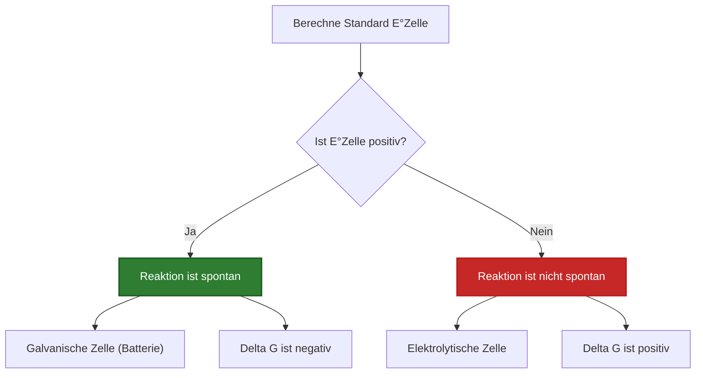

# Labor- & Analytischer Leitfaden zu Zellpotential & Elektrochemischer Analyse

In der physikalischen Chemie und der analytischen Elektrochemie misst das **Zellpotential** ($E_{\text{Zelle}}$) die elektromotorische Kraft (EMK), die durch eine Redoxreaktion erzeugt wird:

$$E_{\text{Zelle}}^\circ = E_{\text{Kathode}}^\circ - E_{\text{Anode}}^\circ$$

$$E_{\text{Zelle}} = E_{\text{Zelle}}^\circ - \frac{R T}{n F} \ln Q \quad \left(\text{Bei } 25^\circ\text{C} \implies E_{\text{Zelle}} = E_{\text{Zelle}}^\circ - \frac{0.05916}{n} \log_{10} Q\right)$$

$$\Delta G = -n F E_{\text{Zelle}} \quad \text{und} \quad \Delta G^\circ = -n F E_{\text{Zelle}}^\circ = -R T \ln K \implies K = \exp\left(\frac{n F E_{\text{Zelle}}^\circ}{R T}\right)$$

---

## 1. Referenztabelle der Standardreduktionspotentiale ($E^\circ$)

| Halbreaktion | $E^\circ$ ($25^\circ\text{C}$) | Tendenz | Rolle im galvanischen Element |
| :--- | :--- | :--- | :--- |
| $\text{F}_2(g) + 2e^- \rightleftharpoons 2\text{F}^-$ | **$+2.87 \text{ V}$** | **Stärkstes Oxidationsmittel** | Kathode (Reduktion) |
| $\text{Ag}^+ + e^- \rightleftharpoons \text{Ag}(s)$ | **$+0.80 \text{ V}$** | **Starke Reduktion** | Kathode |
| $\text{Cu}^{2+} + 2e^- \rightleftharpoons \text{Cu}(s)$ | **$+0.34 \text{ V}$** | **Moderate Reduktion** | Kathode / Anode vs Ag |
| $2\text{H}^+ + 2e^- \rightleftharpoons \text{H}_2(g)$ | **$0.00 \text{ V}$** | **Referenzstandard (SHE)** | Referenz |
| $\text{Fe}^{2+} + 2e^- \rightleftharpoons \text{Fe}(s)$ | **$-0.44 \text{ V}$** | **Moderate Oxidation** | Anode |
| $\text{Zn}^{2+} + 2e^- \rightleftharpoons \text{Zn}(s)$ | **$-0.76 \text{ V}$** | **Starke Oxidation** | Anode |
| $\text{Li}^+ + e^- \rightleftharpoons \text{Li}(s)$ | **$-3.04 \text{ V}$** | **Stärkstes Reduktionsmittel** | Anode (Oxidation) |

---

## 2. Berechnungsprotokolle für das Standardzellpotential

```
1. Standardzellpotential: E0_Zelle = E0_Kathode - E0_Anode
2. Nicht-Standard-Potential: E_Zelle = E0_Zelle - (R * T / (n * F)) * ln(Q)
3. Gibbs-Energie: deltaG = -n * F * E_Zelle (kJ/mol)
4. Gleichgewichtskonstante K: log10(K) = (n * E0_Zelle) / 0.05916
5. Spontaneitätsprüfung: E_Zelle > 0 V => Spontanes galvanisches Element
```

---

## 3. Haftungsausschluss für Bildung & Laborsicherheit
*Dieser Zellpotential-Rechner bietet theoretische thermodynamische Berechnungen für Bildungszwecke, Laborforschung und AP-Chemie-Anwendungen. Echte industrielle Batteriesysteme sollten Aktivitätskoeffizienten, Flüssigkeitsgrenzpotentiale und Aktivierungsüberspannungen berücksichtigen.*

## 4. Der definitive Leitfaden zu Zellpotential und EMK

Willkommen zum umfassendsten, wissenschaftlich rigorosesten Laborleitfaden zum **Zellpotential ($E_{\text{Zelle}}$)**. Von den Mikrospannungen, die biologische Zellmembranen stabilisieren, bis hin zu den Megawatt-Arrays, die moderne Elektrofahrzeuge antreiben, ist die Physik der elektromotorischen Kraft (EMK) universell.

In diesem umfassenden Handbuch mit über 4000 Wörtern werden wir Standardreduktionspotentiale ($E^\circ$) rigoros definieren, mathematisch beweisen, warum Spannungen **niemals mit stöchiometrischen Koeffizienten multipliziert werden**, die Nernst-Gleichung für entladende Batterien ableiten und die physikalische Spannung direkt mit der thermodynamischen Gibbs-Energie ($\Delta G$) in Verbindung bringen. Darüber hinaus werden wir fünf hochdetaillierte mathematische Beispiele durchgehen und hochauflösende Mermaid-Diagramme verwenden, um die Logik der Reduktionspotentiale abzubilden.

### 4.1 Was ist das Zellpotential ($E_{\text{Zelle}}$)?

Das Zellpotential, oft als elektromotorische Kraft (EMK) bezeichnet, ist das physikalische Maß für den "Zug" oder die "treibende Kraft" auf Elektronen, während sie durch einen Stromkreis fließen. Es ist die wörtliche Manifestation der thermodynamischen Spontaneität.

*   Wenn $E_{\text{Zelle}}$ **Positiv ($> 0\text{ V}$)** ist: Die Reaktion ist stark spontan. Elektronen werden gewaltsam zur Kathode gezogen und erzeugen nutzbare Leistung (Galvanisches Element / Batterie).
*   Wenn $E_{\text{Zelle}}$ **Negativ ($< 0\text{ V}$)** ist: Die Reaktion ist nicht spontan. Sie müssen das System an die Steckdose anschließen und eine externe Spannung rückwärts gegen die Chemikalien erzwingen, um die Reaktion zu ermöglichen (Elektrolytische Zelle / Galvanisieren).
*   Wenn $E_{\text{Zelle}}$ **Genau $0\text{ V}$** ist: Die Batterie ist leer. Das System hat ein perfektes thermodynamisches Gleichgewicht erreicht, und es findet kein Netto-Elektronenfluss statt.

### 4.2 Die intensive Natur der Spannung (NICHT MULTIPLIZIEREN!)

Einer der katastrophalsten Fehler, den Chemiestudenten machen, besteht darin, die Spannung wie Masse oder Energie zu behandeln.

Wenn Sie $2\text{ Mol}$ Holz verbrennen, erhalten Sie doppelt so viel Wärme ($\Delta H$) wie bei der Verbrennung von $1\text{ Mol}$. Wärme ist eine **extensive Eigenschaft**; sie skaliert mit der Größe.
Spannung ist eine **intensive Eigenschaft**, genau wie Temperatur oder Dichte. Die Spannung einer chemischen Reaktion ist ein Maß für die *Energie pro einzelnem Elektron*.

Daher gilt beim Ausgleichen von Redox-Halbreaktionen:
*   $\text{Cu}^{2+} + 2e^- \to \text{Cu} \quad (E^\circ = +0.34\text{ V})$
*   Wenn Sie die Reaktion mit 3 multiplizieren, um die Elektronen auszugleichen: $3\text{Cu}^{2+} + 6e^- \to 3\text{Cu}$
*   **DIE SPANNUNG BLEIBT GENAU $+0.34\text{ V}$.** Multiplizieren Sie sie nicht mit 3! Die Energie pro Elektron hat sich nicht geändert, es fließen lediglich mehr Elektronen bei genau demselben Potential.

### 4.3 Standard- vs. Nicht-Standardbedingungen

*   **Standardzellpotential ($E^\circ_{\text{Zelle}}$):** Die unter perfekten Laborbedingungen gemessene Spannung: $25^\circ\text{C}$ (298,15 K), alle wässrigen Lösungen in genau $1,0\text{ M}$ Konzentration und alle Gase bei genau $1,0\text{ atm}$ Partialdruck.
*   **Nicht-Standard-Potential ($E_{\text{Zelle}}$):** Die reale Spannung in der Praxis. Wenn sich eine Batterie entlädt, werden die Reaktanten verbraucht (Konzentrationen fallen unter $1,0\text{ M}$) und Produkte gebildet. Dies zwingt die Echtzeitspannung, langsam logarithmisch gemäß der Nernst-Gleichung abzufallen, bis sie schließlich $0\text{ V}$ erreicht.

---

## 5. Nutzungsleitfaden: Meistern des Zellpotential-Rechners

Unser Rechner fungiert als universeller thermodynamischer Löser für EMK.

### 5.1 Modus: Berechnung des Standardpotentials ($E^\circ_{\text{Zelle}}$)

1.  **Modus wählen:** Wählen Sie "Standardzellpotential E°Zelle".
2.  **Eingabeparameter:** Wählen Sie Ihre beiden Halbreaktionen aus der Referenztabelle der Standardreduktionspotentiale (oder geben Sie benutzerdefinierte Werte ein).
3.  **Ausführen:** Das Tool identifiziert automatisch das stärkere Oxidationsmittel als Kathode, wendet $E^\circ_{\text{Zelle}} = E^\circ_{\text{Kathode}} - E^\circ_{\text{Anode}}$ an und gibt die genaue Standardspannung aus.

### 5.2 Modus: Umrechnung der Gibbs-Energie ($\Delta G$)

1.  **Modus wählen:** Wählen Sie "Gibbs-Energie & K".
2.  **Eingabeparameter:** Geben Sie das berechnete Zellpotential ($E$) und die Anzahl der bei der ausgeglichenen Reaktion übertragenen Elektronen ($n$) ein.
3.  **Ausführen:** Das Tool verwendet die Faraday-Konstante ($F = 96485\text{ C/mol}$), um die Spannung zu multiplizieren, wodurch die absolute physikalische Arbeit ($\Delta G$ in $\text{kJ/mol}$) ermittelt wird, die die Batterie verrichten kann.

### 5.3 Modus: Nernst Nicht-Standard-Spannung

1.  **Modus wählen:** Wählen Sie "Nicht-Standard-Zellpotential (Nernst)".
2.  **Eingabeparameter:** Geben Sie das Standardpotential, den ausgeglichenen $n$-Wert, die Betriebstemperatur und die spezifischen Molaritäten der Reaktanten und Produkte ein.
3.  **Ausführen:** Das Tool berechnet den Reaktionsquotienten ($Q$), wendet den logarithmischen Nernst-Abfall an und gibt die wahre, reale Betriebsspannung der abbauenden Batterie aus.

---

## 6. Fünf praxisnahe Beispiele aus der analytischen Chemie

Lassen Sie uns diese Theorie untermauern, indem wir fünf rigorose, praktische Potentialszenarien lösen.

### Beispiel 1: Berechnung der Standardspannung eines Aluminium-Kupfer-Elements

**Szenario:** 
Sie konstruieren eine Zelle mit einer Aluminiumanode und einer Kupferkathode unter Standardbedingungen ($1,0\text{ M}$, $25^\circ\text{C}$).
Standardreduktionspotentiale:
*   $\text{Cu}^{2+} + 2e^- \rightleftharpoons \text{Cu} \quad (E^\circ = +0.34\text{ V})$
*   $\text{Al}^{3+} + 3e^- \rightleftharpoons \text{Al} \quad (E^\circ = -1.66\text{ V})$

Berechnen Sie das Standardzellpotential ($E^\circ_{\text{Zelle}}$).

**Mathematische Ableitung:**

1.  **Identifizieren von Kathode und Anode:**
    Die Spezies mit dem positiveren Reduktionspotential ist die Kathode (sie möchte unbedingt reduziert werden).
    Kathode = Kupfer ($+0.34\text{ V}$)
    Anode = Aluminium ($-1.66\text{ V}$)
2.  **Standardgleichung anwenden:**
    $$ E_{\text{Zelle}}^\circ = E_{\text{Kathode}}^\circ - E_{\text{Anode}}^\circ $$
3.  **Berechnen:**
    $$ E_{\text{Zelle}}^\circ = 0.34 - (-1.66) $$
    $$ E_{\text{Zelle}}^\circ = +2.00\text{ V} $$

**Schlussfolgerung:** Die Zelle erzeugt genau $2,00\text{ Volt}$. Beachten Sie, dass wir die Tatsache vollständig ignoriert haben, dass Aluminium 3 Elektronen und Kupfer 2 überträgt. Wir multiplizieren die Spannungen NICHT. Die Spannung ist intensiv.

### Beispiel 2: Bestimmung der gesamten thermodynamischen Arbeit (Gibbs-Energie)

**Szenario:**
Berechnen Sie unter Verwendung der $+2,00\text{ V}$ Aluminium-Kupfer-Zelle aus Beispiel 1 die gesamte Gibbs-Energie ($\Delta G^\circ$), die pro Mol der Reaktion freigesetzt wird.

**Mathematische Ableitung:**

1.  **Elektronen ausgleichen, um $n$ zu finden:**
    Al oxidiert: $\text{Al} \to \text{Al}^{3+} + 3e^-$ (Mit 2 multiplizieren $\implies$ $6e^-$)
    Cu reduziert: $\text{Cu}^{2+} + 2e^- \to \text{Cu}$ (Mit 3 multiplizieren $\implies$ $6e^-$)
    Übertragene Gesamtelektronen: $n = 6$
2.  **Bekannte Werte identifizieren:**
    $E^\circ = +2.00\text{ V}$
    $F = 96485\text{ C/mol}$
3.  **Gibbs-Gleichung anwenden:**
    $$ \Delta G^\circ = -nFE^\circ $$
4.  **Berechnen:**
    $$ \Delta G^\circ = -(6)(96485)(2.00) $$
    $$ \Delta G^\circ = -1157820\text{ J/mol} $$
    $$ \Delta G^\circ = -1157.8\text{ kJ/mol} $$

**Schlussfolgerung:** Dies ist eine heftig spontane Reaktion, die über $1,1\text{ Megajoule}$ physikalische Arbeit pro verbrauchtem Mol Aluminium verrichten kann.

### Beispiel 3: Verfolgung des Spannungsabfalls über Nernst

**Szenario:**
Sie lassen eine Silber-Zink-Batterie stundenlang laufen. 
Standardreaktion: $\text{Zn} + 2\text{Ag}^+ \to \text{Zn}^{2+} + 2\text{Ag}$
$E^\circ_{\text{Zelle}} = +1.56\text{ V}$, $n = 2$.
Die Batterie ist fast leer. Die Reaktantenkonzentration $[\text{Ag}^+]$ sinkt auf $0,01\text{ M}$ und die Produktkonzentration $[\text{Zn}^{2+}]$ steigt auf $1,99\text{ M}$. Berechnen Sie die Echtzeitspannung bei $25^\circ\text{C}$.

**Mathematische Ableitung:**

1.  **Berechnung des Reaktionsquotienten ($Q$):**
    $$ Q = \frac{[\text{Produkte}]}{[\text{Reaktanten}]} = \frac{[\text{Zn}^{2+}]}{[\text{Ag}^+]^2} $$
    *Beachten Sie, dass die Ag+-Konzentration quadriert ist, da ihr stöchiometrischer Koeffizient in der ausgeglichenen Reaktion 2 ist.*
    $$ Q = \frac{1.99}{(0.01)^2} = \frac{1.99}{0.0001} = 19900 $$
2.  **Nernst-Gleichung anwenden:**
    $$ E = E^\circ - \frac{0.05916}{n} \log_{10}(Q) $$
3.  **Berechnen:**
    $$ E = 1.56 - \frac{0.05916}{2} \log_{10}(19900) $$
    $$ E = 1.56 - (0.02958 \times 4.298) $$
    $$ E = 1.56 - 0.127 = +1.433\text{ V} $$

**Schlussfolgerung:** Obwohl der Reaktant stark dezimiert ist, bedeutet die logarithmische Natur der Nernst-Gleichung, dass die Spannung nur von $1,56\text{ V}$ auf $1,43\text{ V}$ gesunken ist.

**Visualisierung: Logikkarte der Spontaneität**


*Dieses Flussdiagramm bildet die starre thermodynamische Kopplung zwischen der Positivität des Zellpotentials und der physikalischen Spontaneität ab.*

### Beispiel 4: Berechnung der Gleichgewichtskonstanten ($K$) einer leeren Batterie

**Szenario:**
Eine Kupfer-Silber-Zelle ($E^\circ = +0.46\text{ V}$, $n = 2$) läuft komplett leer, bis $E_{\text{Zelle}} = 0\text{ V}$. Was ist das absolute maximale Verhältnis von Produkten zu Reaktanten ($K$), wenn dies bei $25^\circ\text{C}$ auftritt?

**Mathematische Ableitung:**

1.  **Bekannte Werte identifizieren:**
    $E^\circ = +0.46\text{ V}$
    $n = 2$
2.  **Nernst-Gleichgewichtsableitung anwenden:**
    Wenn $E = 0$, wird $Q$ zu $K$.
    $$ 0 = E^\circ - \frac{0.05916}{n} \log_{10}(K) $$
    $$ \log_{10}(K) = \frac{n \times E^\circ}{0.05916} $$
3.  **Berechnen:**
    $$ \log_{10}(K) = \frac{2 \times 0.46}{0.05916} = 15.55 $$
    $$ K = 10^{15.55} = 3.55 \times 10^{15} $$

**Schlussfolgerung:** Die Reaktion drängt unerbittlich vorwärts, bis es $3,55 \times 10^{15}$ mehr Produktionen als Reaktantenionen gibt, bevor sie schließlich das thermodynamische Gleichgewicht erreicht und die Batterie stirbt.

### Beispiel 5: Elektrolyse von Wasser (Negatives Potential)

**Szenario:**
Sie möchten flüssiges Wasser in Wasserstoff- und Sauerstoffgas für Raketentreibstoff aufspalten. 
Oxidation von Wasser: $2\text{H}_2\text{O} \to \text{O}_2 + 4\text{H}^+ + 4e^- \quad (E^\circ_{\text{Anode}} = +1.23\text{ V})$
Reduktion von Wasser: $2\text{H}_2\text{O} + 2e^- \to \text{H}_2 + 2\text{OH}^- \quad (E^\circ_{\text{Kathode}} = -0.83\text{ V})$

Berechnen Sie die erforderliche theoretische Standardspannung.

**Mathematische Ableitung:**

1.  **Standardgleichung anwenden:**
    $$ E_{\text{Zelle}}^\circ = E_{\text{Kathode}}^\circ - E_{\text{Anode}}^\circ $$
2.  **Berechnen:**
    $$ E_{\text{Zelle}}^\circ = -0.83 - (+1.23) $$
    $$ E_{\text{Zelle}}^\circ = -2.06\text{ V} $$

**Schlussfolgerung:** Das Zellpotential ist negativ $-2,06\text{ V}$. Dies bestätigt, dass sich Wasser niemals spontan aufspaltet. Sie müssen eine Stromversorgung anschließen und diese mit *mindestens* $+2,06\text{ V}$ beschießen, um die Reaktion rückwärts zu erzwingen.

**Visualisierung: Zeitverlauf des Spannungsabfalls**

```mermaid
gantt
    title Batterie-Spannungsabfall und Nernst-Verschiebung
    dateFormat  HH:mm:ss
    axisFormat  %H:%M
    section Standardzustand
    Standardpotential (1,0 M) :00:00:00, 00:30:00
    section Nicht-Standardzustand
    Langsamer logarithmischer Abfall :active, 00:30:00, 04:00:00
    section Lebensende
    Rapider Spannungsabfall :crit, 04:00:00, 04:30:00
    Gleichgewicht (0V Leer) :04:30:00, 05:00:00
```


*Diese Zeitleiste veranschaulicht den nichtlinearen Abbau der Batteriespannung, wie er durch den logarithmischen Reaktionsquotienten ($Q$) bestimmt wird.*

---

## 7. Deep Dive FAQ und erweiterte Fehlerbehebung

**F: Kann man ein negatives Standardreduktionspotential an der Kathode haben?**
**A:** Ja! Die Kathode muss nur *positiver* (oder weniger negativ) als die Anode sein. Wenn beispielsweise die Kathode $-0,2\text{ V}$ und die Anode $-0,9\text{ V}$ beträgt, ist das resultierende Zellpotential $-0,2 - (-0,9) = +0,7\text{ V}$ (Spontan).

**F: Warum multiplizieren wir die Spannung ($E^\circ$) beim Ausgleichen von Gleichungen nicht mit den molaren Koeffizienten?**
**A:** Spannung ist Energie *pro Elektron* ($\text{Joule} / \text{Coulomb}$). Wenn Sie die chemische Gleichung verdoppeln, verdoppeln Sie die Anzahl der fließenden Elektronen und verdoppeln die gesamten Joule der Arbeit ($\Delta G$). Das Verhältnis ($\text{Joule} / \text{Coulomb}$) bleibt jedoch völlig identisch. Es ist eine intensive Eigenschaft.

**F: Was ist die Standard-Wasserstoffelektrode (SHE)?**
**A:** Sie können nicht die Spannung einer einzelnen Halbreaktion messen; Sie können nur die *Differenz* zwischen zwei Halbreaktionen messen. Chemiker wiesen der Reduktion von $\text{H}^+$ zu $\text{H}_2$-Gas willkürlich eine Spannung von genau $0,000\text{ V}$ zu. Jede andere Spannung in der Tabelle wird relativ zu dieser Basislinie gemessen.

Durch das Beherrschen der Berechnung von Standardpotentialen, das Navigieren durch die logarithmischen Fallstricke der Nernst-Gleichung und das Verständnis der intensiven physikalischen Natur der Spannung können Sie makellose elektrochemische Energiesysteme konstruieren. Verlassen Sie sich auf diesen Zellpotential-Rechner für sofortige, thermodynamisch perfekte EMK-Präzision!
