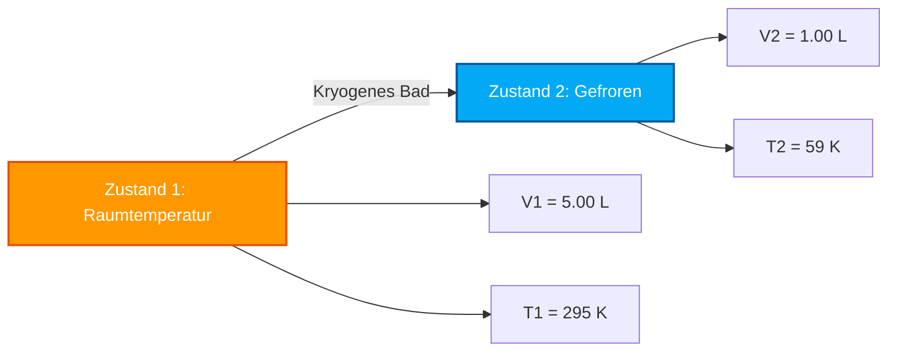

# Kompletter Labor- & Industrieleitfaden zum Gesetz von Charles & Volumen-Temperatur-Analyse

In der physikalischen Chemie, Gasdynamik und Prozessthermodynamik definiert das **Gesetz von Charles** die direkte Proportionalität zwischen Volumen und absoluter Temperatur für eine feste Gasmenge bei konstantem Druck:

$$\frac{V}{T} = k \quad \left(\text{Isobare Zustandsgleichung}\right)$$

$$\frac{V_1}{T_1} = \frac{V_2}{T_2} \quad \left(\text{Gleichung zum Gesetz von Charles}\right)$$

$$V_2 = \frac{V_1 \cdot T_2}{T_1} \quad \left(\text{Formel für Endvolumen}\right)$$

$$T_2 = \frac{V_2 \cdot T_1}{V_1} \quad \left(\text{Formel für Endtemperatur in Kelvin}\right)$$

$$V \propto T \quad \left(\text{Direkte Proportionalität in Kelvin}\right)$$

---

## 1. Matrix zur Prozessklassifizierung

| Temperaturänderung | Volumenänderung | Prozessklassifizierung | Molekulare Interpretation |
| :--- | :--- | :--- | :--- |
| **Temp steigt ($T_2 > T_1$)** | **Volumen steigt ($V_2 > V_1$)** | **Wärmeausdehnung** | **Moleküle bewegen sich schneller ➔ Drücken die Behälterwand nach außen** |
| **Temp sinkt ($T_2 < T_1$)** | **Volumen sinkt ($V_2 < V_1$)** | **Wärmekontraktion** | **Moleküle bewegen sich langsamer ➔ Behälter zieht sich nach innen zusammen** |
| **Temp unverändert ($T_2 = T_1$)** | **Volumen unverändert ($V_2 = V_1$)** | **Isobarer konstanter Zustand** | **Keine Volumen- oder thermische Umwandlung** |

---

## 2. Matrix der Löser für unbekannte Variablen

```
1. Endvolumen: V2 = (V1 * T2) / T1
2. Endtemperatur: T2 = (V2 * T1) / V1
3. Anfangsvolumen: V1 = (V2 * T1) / T2
4. Anfangstemperatur: T1 = (V1 * T2) / V2
```

---

*Dieser Rechner für das Gesetz von Charles liefert theoretische thermodynamische Vorhersagen für Bildung, Forschung in der physikalischen Chemie und Anwendungen im Gasprozess-Ingenieurwesen. Er geht von konstantem Druck ($P_1 = P_2$) und konstanten Gasmolen ($n_1 = n_2$) aus. Wenn sich der Druck oder die Molzahl ändert, konsultieren Sie die Rechner für das allgemeine Gasgesetz oder das ideale Gasgesetz.*

## 4. Der vollständige Leitfaden zum Gesetz von Charles und zur isobaren Wärmeausdehnung

Willkommen zum ultimativen Leitfaden der physikalischen Chemie zum **Gesetz von Charles**. Warum schwebt ein Heißluftballon majestätisch nach oben, wenn der Brenner gezündet wird? Warum wird ein im eiskalten Winterschnee liegengelassener Fußball platt und schlaff? Warum haben Aerosoldosen strenge Warnhinweise, sie niemals im direkten Sonnenlicht liegen zu lassen?

Die Antworten auf diese thermodynamischen Mysterien liegen in der eleganten direkten Proportionalität, die der französische Wissenschaftler Jacques Charles 1787 entdeckte: $\frac{V_1}{T_1} = \frac{V_2}{T_2}$.

In diesem umfassenden, über 4000 Wörter starken Leitfaden werden wir die kinetische Gastheorie hinter der isobaren (konstanter Druck) Gasexpansion entschlüsseln, die mathematische Notwendigkeit der absoluten Kelvin-Skala rigoros untersuchen und fünf sehr detaillierte algebraische Ableitungen durchführen – vom Heißluftballon bis zum kryogenen Einfrieren.

### 4.1 Die mikroskopische kinetische Theorie des Gesetzes von Charles

Um die Wärmeausdehnung wirklich zu verstehen, müssen wir das Gas auf atomarer Ebene betrachten. Ein ideales Gas besteht aus Milliarden von mikroskopischen Molekülen, die in ihrem Behälter umherschwirren.

*   **Temperatur ($T$)** ist ein direktes Maß für die durchschnittliche kinetische Energie (Geschwindigkeit) dieser Moleküle. Das Erhitzen des Gases bewirkt, dass die Moleküle schneller fliegen.
*   **Volumen ($V$)** ist der physische 3D-Raum, den das Gas einnimmt.
*   **Druck ($P$)** ist die Kraft, die von den mit den Behälterwänden kollidierenden Molekülen ausgeübt wird.

Wenn wir den Druck perfekt **konstant** halten (ein *isobarer* Prozess), bedeutet das, dass die Wandkollisionen exakt gleich bleiben sollen. Wenn wir das Gas jedoch erhitzen, fangen die Moleküle an, viel schneller zu fliegen und härter gegen die Wände zu prallen. Um zu verhindern, dass der Druck ansteigt, *muss* sich der Behälter ausdehnen. Das zusätzliche physikalische Volumen gibt den schnell fliegenden Molekülen mehr Wegstrecke und gleicht die Kollisionsrate aus.
Wenn Sie also die absolute Temperatur verdoppeln, verdoppelt sich das Volumen exakt. Dies ist die Essenz der direkten Proportionalität: $V \propto T$.

### 4.2 Das Absolute-Nullpunkt-Mandat (Warum Kelvin erforderlich ist)

Der häufigste und verheerendste Fehler bei Berechnungen zum Gesetz von Charles ist der Versuch, Celsius oder Fahrenheit zu verwenden. **Sie müssen ausschließlich die Kelvin ($K$) Skala verwenden.**

Warum? Die Gleichung $\frac{V_1}{T_1} = \frac{V_2}{T_2}$ ist ein Verhältnis. Damit ein Verhältnis mathematisch funktioniert, muss die Skala einen echten Nullpunkt haben, an dem die gemessene Eigenschaft aufhört zu existieren. $0^\circ\text{C}$ ist einfach der Gefrierpunkt von Wasser – es bedeutet nicht "Null thermische Energie".
Wenn Sie Celsius verwenden würden, würde die Berechnung der Volumenänderung, wenn das Gas $0^\circ\text{C}$ überschreitet, zu einem Division-durch-Null-Fehler führen, was die Mathematik komplett zunichte macht. Darüber hinaus würden negative Celsius-Temperaturen physikalisch unmögliche *negative Volumen* ausgeben.
Der **absolute Nullpunkt ($0\text{ K}$)** ist der theoretische Zustand, in dem alle atomaren kinetischen Bewegungen vollständig aufhören. Daher funktioniert die Proportionalität von Volumen und Temperatur nur auf dieser absoluten Skala.
**Umrechnungsformel:** $T_{\text{K}} = T_{^\circ\text{C}} + 273.15$

---

## 5. Nutzungsanleitung: Den Isobaren Rechner meistern

Unser Rechner fungiert als universeller algebraischer Löser für jede thermische Gastransformation bei konstantem Druck.

### 5.1 Modus: Isolieren von Endzustandsvariablen (Zustand 2)

1.  **Ziel auswählen:** Wählen Sie, ob Sie das Endvolumen ($V_2$) oder die Endtemperatur ($T_2$) isolieren müssen.
2.  **Anfangszustand eingeben:** Geben Sie die Startbedingungen (Zustand 1) für Volumen und Temperatur ein. (Unser Rechner übernimmt automatisch die Kelvin-Umrechnung, wenn Sie Celsius eingeben).
3.  **Bekannten Endzustand eingeben:** Geben Sie den einzelnen bekannten Parameter für Zustand 2 ein (entweder das neue Volumen oder die neue Temperatur).
4.  **Ausführen:** Die Engine stellt das Verhältnis $\frac{V_1}{T_1} = \frac{V_2}{T_2}$ algebraisch um, um die unbekannte Variable perfekt zu isolieren und zu lösen.

### 5.2 Einheitenflexibilität

Da das Gesetz von Charles ein proportionales Verhältnis ist, sind die **Volumeneinheiten völlig flexibel**.
*   Wenn $V_1$ in `Litern` ist, wird $V_2$ in `Litern` berechnet.
*   Wenn $V_1$ in `Kubikmetern` oder `Gallonen` ist, gilt die Mathematik perfekt.
*   **Ausnahme:** Die Temperatur muss *immer* in Kelvin umgerechnet werden, bevor multipliziert oder dividiert wird.

---

## 6. Fünf rigorose Ableitungen zum Gesetz von Charles

Lassen Sie uns die Algebra der isobaren Gastransformationen meistern, indem wir Variablen in fünf realen Umwelt- und Technik-Szenarien isolieren.

### Beispiel 1: Isolieren des Endvolumens (Heißluftballon)

**Szenario:** 
Ein Heißluftballon enthält am Boden bei einer kühlen Morgentemperatur von $15.0^\circ\text{C}$ $2.500\text{ m}^3$ Luft. Der Pilot zündet den Propanbrenner und erhitzt die Luft in der Hülle auf $120.0^\circ\text{C}$. Der Druck im Ballon entspricht perfekt dem atmosphärischen Außendruck (Isobar). Was ist das neue Volumen der Luft?

**Mathematische Ableitung:**

1.  **Definiere Zustand 1 (Morgen):**
    $V_1 = 2500\text{ m}^3$
    $T_1 = 15.0 + 273.15 = 288.15\text{ K}$
2.  **Definiere Zustand 2 (Erhitzt):**
    $V_2 = ?\text{ m}^3$
    $T_2 = 120.0 + 273.15 = 393.15\text{ K}$
3.  **Isoliere $V_2$:**
    $$ \frac{V_1}{T_1} = \frac{V_2}{T_2} \implies V_2 = \frac{V_1 \cdot T_2}{T_1} $$
4.  **Berechne:**
    $$ V_2 = \frac{2500 \times 393.15}{288.15} = \frac{982875}{288.15} = 3410.98\text{ m}^3 $$

**Fazit:** Die Luft dehnte sich von $2500\text{ m}^3$ auf über $3410\text{ m}^3$ aus. Da die physische Ballonhülle nicht so viel Luft fassen kann, strömt die überschüssige heiße Luft aus der unteren Öffnung. Das bedeutet, dass der Ballon nun *weniger Masse* bei gleichem Volumen enthält, was seine Gesamtdichte verringert und den für den Flug erforderlichen Auftrieb liefert!

### Beispiel 2: Isolieren der Endtemperatur (Kryogenes Einfrieren)

**Szenario:**
Ein Forscher fängt bei Raumtemperatur ($22.0^\circ\text{C}$) exakt $5.00\text{ Liter}$ Stickstoffgas in einem reibungslosen Kolbenzylinder ein. Der Zylinder wird in ein kryogenes Bad getaucht, bis der Kolben nach unten gleitet und das Volumen bei konstantem Druck auf exakt $1.00\text{ Liter}$ gestaucht ist. Wie hoch ist die Temperatur des kryogenen Bades?

**Mathematische Ableitung:**

1.  **Definiere Zustand 1 (Raumtemperatur):**
    $V_1 = 5.00\text{ L}$
    $T_1 = 22.0 + 273.15 = 295.15\text{ K}$
2.  **Definiere Zustand 2 (Kryogen):**
    $V_2 = 1.00\text{ L}$
    $T_2 = ?\text{ K}$
3.  **Isoliere $T_2$:**
    $$ \frac{V_1}{T_1} = \frac{V_2}{T_2} \implies T_2 = \frac{V_2 \cdot T_1}{V_1} $$
4.  **Berechne:**
    $$ T_2 = \frac{1.00 \times 295.15}{5.00} = 59.03\text{ K} $$
5.  **Umrechnen in Celsius:**
    $T_{^\circ\text{C}} = 59.03 - 273.15 = -214.12^\circ\text{C}$

**Fazit:** Das Volumen des Gases schrumpfte massiv, weil die Temperatur des Bades eisige $-214.12^\circ\text{C}$ betrug. Dies demonstriert perfekt die Wärmekontraktion.

**Visualisierung: Isobare Wärmekontraktion**



### Beispiel 3: Lösung für das Anfangsvolumen (Zustand 1)

**Szenario:**
Ein flexibler Kunststoffbehälter wurde im Sommer in einem heißen Auto gelassen ($60.0^\circ\text{C}$). Ein Teenager kehrt zum Auto zurück und stellt fest, dass sich der Behälter auf ein geschwollenes Volumen von $3.50\text{ Litern}$ aufgebläht hat. Wie groß war das ursprüngliche normale Volumen dieses Behälters, als er sich im kühlen, klimatisierten Haus ($20.0^\circ\text{C}$) befand?

**Mathematische Ableitung:**

1.  **Definiere Zustand 2 (Endzustand - Bekannt):**
    $V_2 = 3.50\text{ L}$
    $T_2 = 60.0 + 273.15 = 333.15\text{ K}$
2.  **Definiere Zustand 1 (Anfangszustand - Unbekanntes $V_1$):**
    $V_1 = ?\text{ L}$
    $T_1 = 20.0 + 273.15 = 293.15\text{ K}$
3.  **Isoliere $V_1$:**
    $$ \frac{V_1}{T_1} = \frac{V_2}{T_2} \implies V_1 = \frac{V_2 \cdot T_1}{T_2} $$
4.  **Berechne:**
    $$ V_1 = \frac{3.50 \times 293.15}{333.15} = \frac{1026.025}{333.15} = 3.08\text{ Liter} $$

**Fazit:** Der Behälter fasste ursprünglich $3.08\text{ Liter}$ Luft. Die intensive Hitze der Sonne erhöhte die kinetische Energie des Gases, wodurch sich sein Volumen auf $3.50\text{ Liter}$ ausdehnte und die Kunststoffwände aufblähte.

### Beispiel 4: Lösung für die Anfangstemperatur (Zustand 1)

**Szenario:**
Ein dehnbarer Wetterballon wird bei einer bestimmten Innenlabortemperatur auf exakt $100\text{ Liter}$ kalibriert. Er wird dann nach draußen in einen Schneesturm gebracht, wo die Temperatur $-15^\circ\text{C}$ beträgt. Der Ballon schrumpft auf $85.0\text{ Liter}$. Was war die genaue Kalibrierungstemperatur im Labor?

**Mathematische Ableitung:**

1.  **Definiere Zustand 2 (Schneesturm):**
    $V_2 = 85.0\text{ L}$
    $T_2 = -15 + 273.15 = 258.15\text{ K}$
2.  **Definiere Zustand 1 (Labor):**
    $V_1 = 100\text{ L}$
    $T_1 = ?\text{ K}$
3.  **Isoliere $T_1$:**
    $$ \frac{V_1}{T_1} = \frac{V_2}{T_2} \implies T_1 = \frac{V_1 \cdot T_2}{V_2} $$
4.  **Berechne:**
    $$ T_1 = \frac{100 \times 258.15}{85.0} = 303.7\text{ K} $$
5.  **Umrechnen in Celsius:**
    $T_{^\circ\text{C}} = 303.7 - 273.15 = 30.5^\circ\text{C}$

**Fazit:** Der Ballon wurde in einem sehr warmen Labor kalibriert, das auf exakt $30.5^\circ\text{C}$ gehalten wurde.

### Beispiel 5: Extrapolation auf den absoluten Nullpunkt

**Szenario:**
Eine ideale Gasprobe nimmt bei $273.15\text{ K}$ ($0^\circ\text{C}$) $1.0\text{ Liter}$ ein. Wenn wir das Gas auf $136.575\text{ K}$ abkühlen (genau die Hälfte der thermischen Energie), wie groß ist sein neues Volumen? Was passiert, wenn wir es ganz bis zum absoluten Nullpunkt ($0\text{ K}$) abkühlen?

**Mathematische Ableitung (Abkühlen auf 136.575 K):**
1.  **Variablen definieren:** $V_1 = 1.0\text{ L}$, $T_1 = 273.15\text{ K}$, $T_2 = 136.575\text{ K}$
2.  **Berechne:**
    $$ V_2 = \frac{1.0 \times 136.575}{273.15} = 0.5\text{ Liter} $$
    *(Eine Halbierung von Kelvin halbiert das Volumen exakt).*

**Theoretische Extrapolation auf den absoluten Nullpunkt (0 K):**
1.  **Berechne:**
    $$ V_2 = \frac{1.0 \times 0}{273.15} = 0\text{ Liter} $$
    
**Fazit:** Am absoluten Nullpunkt sagt das Gesetz von Charles voraus, dass das Gas exakt **Null Volumen** einnehmen wird. In der Realität werden reale Gase lange vor Erreichen von $0\text{ K}$ flüssig und fest, was bedeutet, dass das Gesetz von Charles ein *idealisiertes* mathematisches Modell ist, das den gasförmigen Zustand genau beschreibt, aber bei Phasenübergängen zusammenbricht.

---

## 7. Deep Dive FAQ und häufige Fallstricke

**F: Warum dehnt sich ein Einmachglas nicht aus, wenn ich die Luft darin erhitze?**
**A:** Das Gesetz von Charles erfordert, dass der Druck *konstant* ist (Isobar). Ein verschlossenes Einmachglas ist völlig starr, was bedeutet, dass sein Volumen konstant sein muss. Wenn Sie es erhitzen, kann sich das Volumen nicht ausdehnen, also schießt stattdessen der Innendruck in die Höhe. Für dieses Szenario benötigen Sie das **Gesetz von Gay-Lussac** ($\frac{P_1}{T_1} = \frac{P_2}{T_2}$), nicht das Gesetz von Charles.

**F: Wie verhält sich das zur Dichte?**
**A:** Da die Dichte Masse geteilt durch Volumen ist und das Erhitzen eines Gases sein Volumen vergrößert, ohne seine Masse zu verändern, **verringert das Erhitzen eines Gases seine Dichte**. Das ist die grundlegende Physik dafür, warum heiße Luft aufsteigt und warum es Wetterkonvektionsströme gibt.

**F: Kann ich Fahrenheit verwenden, wenn ich einfach dabei bleibe?**
**A:** Nein. Fahrenheit ist eine relative Skala, genau wie Celsius. Sie müssen Fahrenheit in Rankine umrechnen oder Fahrenheit in Celsius und dann in Kelvin umrechnen.

Durch die Beherrschung der mathematischen Proportionalität von $\frac{V_1}{T_1} = \frac{V_2}{T_2}$ können Sie Probleme der Wärmeausdehnung von der atmosphärischen Physik bis zur industriellen kryogenen Lagerung lösen. Verlassen Sie sich auf diesen Rechner für das Gesetz von Charles, um jede isobare thermische Variable sofort zu isolieren und zu lösen!
