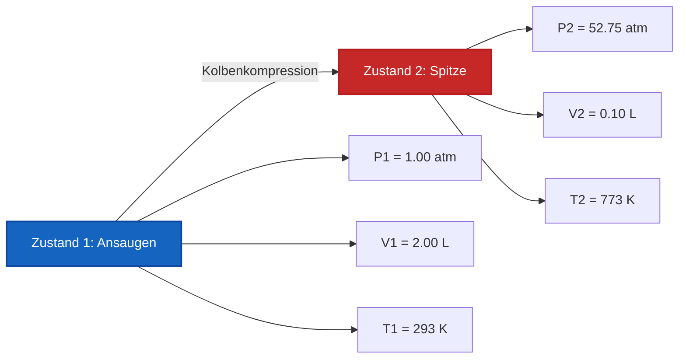

# Vollständiger Leitfaden für Labor & Industrie zum allgemeinen Gasgesetz & Zwei-Zustands-Analyse

In der physikalischen Chemie, Gasdynamik und chemischen Verfahrenstechnik beschreibt das **allgemeine Gasgesetz** die Wechselbeziehung zwischen Druck, Volumen und absoluter Temperatur über zwei Gleichgewichtszustände einer festen Gasmenge ($n_1 = n_2$):

$$\frac{P_1 \cdot V_1}{T_1} = \frac{P_2 \cdot V_2}{T_2} \quad \left(\text{Gleichung des allgemeinen Gasgesetzes}\right)$$

$$P_2 = \frac{P_1 \cdot V_1 \cdot T_2}{T_1 \cdot V_2} \quad \left(\text{Formel für den Enddruck}\right)$$

$$V_2 = \frac{P_1 \cdot V_1 \cdot T_2}{T_1 \cdot P_2} \quad \left(\text{Formel für das Endvolumen}\right)$$

$$T_2 = \frac{P_2 \cdot V_2 \cdot T_1}{P_1 \cdot V_1} \quad \left(\text{Formel für die Endtemperatur in Kelvin}\right)$$

$$\Delta P\% = \frac{P_2 - P_1}{P_1} \times 100\%, \quad \Delta V\% = \frac{V_2 - V_1}{V_1} \times 100\% \quad \left(\text{Prozentuale Änderungen}\right)$$

---

## 1. Reduktion auf empirische Gasgesetze

| Fester Parameter | Mathematische Reduktion | Name des Gasgesetzes | Prozessklassifizierung |
| :--- | :--- | :--- | :--- |
| **Konstante Temp. ($T_1 = T_2$)** | **$P_1 \cdot V_1 = P_2 \cdot V_2$** | **Gesetz von Boyle-Mariotte** | **Isothermer Prozess** |
| **Konstanter Druck ($P_1 = P_2$)** | **$\frac{V_1}{T_1} = \frac{V_2}{T_2}$** | **Gesetz von Charles** | **Isobarer Prozess** |
| **Konstantes Volumen ($V_1 = V_2$)** | **$\frac{P_1}{T_1} = \frac{P_2}{T_2}$** | **Gesetz von Gay-Lussac** | **Isochorer Prozess** |

---

## 2. Zwei-Zustands-Variablen-Löser-Matrix

```
1. Enddruck: P2 = (P1 * V1 * T2) / (T1 * V2)
2. Endvolumen: V2 = (P1 * V1 * T2) / (T1 * P2)
3. Endtemperatur: T2 = (P2 * V2 * T1) / (P1 * V1)
4. Anfangsdruck: P1 = (P2 * V2 * T1) / (T2 * V1)
5. Anfangsvolumen: V1 = (P2 * V2 * T1) / (T2 * P1)
6. Anfangstemperatur: T1 = (P1 * V1 * T2) / (P2 * V2)
```

---

*Dieser Rechner für das allgemeine Gasgesetz liefert theoretische thermodynamische Vorhersagen für Bildung, physikalisch-chemische Forschung und gasverfahrenstechnische Anwendungen. Er geht von einer festen Gasmenge aus ($n_1 = n_2$). Für Systeme, bei denen Gasmoleküle hinzugefügt oder entfernt werden, verwenden Sie den Rechner für das ideale Gasgesetz ($P V = n R T$).*

## 4. Der umfassende Leitfaden zum allgemeinen Gasgesetz und Zwei-Zustands-Gasumwandlungen

Willkommen zum ultimativen Handbuch der physikalischen Chemie über das **allgemeine Gasgesetz**. Wie sagen Wissenschaftler das genaue Volumen eines Wetterballons voraus, während er durch die eiskalte Stratosphäre mit niedrigem Druck aufsteigt? Wie berechnen Maschinenbauingenieure die intensive Hitze, die im Zylinder eines Dieselmotors während des Verdichtungstakts entsteht? 

Die Antworten auf diese komplexen, multivariablen Veränderungen liegen im makellosen Verhältnis des allgemeinen Gasgesetzes: $\frac{P_1 V_1}{T_1} = \frac{P_2 V_2}{T_2}$. 

In diesem ausführlichen Leitfaden werden wir die thermodynamischen Symmetrien der Gesetze von Boyle, Charles und Gay-Lussac entschlüsseln, die absolute Notwendigkeit der Kelvin-Temperaturskala rigoros definieren und fünf robuste, reale algebraische Herleitungen durchführen.

### 4.1 Die Vereinheitlichung der empirischen Gasgesetze

Bevor die ideale Gasgleichung ($PV=nRT$) formalisiert wurde, entdeckten frühe experimentelle Chemiker drei separate Proportionalitäten, die das Gasverhalten bestimmten. Das allgemeine Gasgesetz vereint alle drei mathematisch:

1.  **Gesetz von Boyle-Mariotte (Isotherm):** Entdeckt von Robert Boyle im Jahr 1662. Wenn die Temperatur perfekt konstant gehalten wird ($T_1 = T_2$), sind Druck und Volumen **umgekehrt proportional** ($P_1 V_1 = P_2 V_2$). Wenn Sie ein Gas auf das halbe Volumen zusammenpressen, verdoppelt sich der Druck.
2.  **Gesetz von Charles (Isobar):** Entdeckt von Jacques Charles im Jahr 1787. Wenn der Druck konstant gehalten wird ($P_1 = P_2$), sind Volumen und absolute Temperatur **direkt proportional** ($\frac{V_1}{T_1} = \frac{V_2}{T_2}$). Wenn Sie einen Ballon erhitzen, dehnt er sich aus.
3.  **Gesetz von Gay-Lussac (Isochor):** Entdeckt von Joseph Louis Gay-Lussac im Jahr 1808. Wenn das Volumen strikt konstant gehalten wird ($V_1 = V_2$), sind Druck und absolute Temperatur **direkt proportional** ($\frac{P_1}{T_1} = \frac{P_2}{T_2}$). Wenn Sie einen starren Stahltank erhitzen, steigt der Druck sprunghaft an.

### 4.2 Das zwingende Gebot von Absolut-Kelvin ($K$)

Der katastrophalste Fehler bei Gasgesetzberechnungen ist die Verwendung von Celsius ($^\circ\text{C}$) oder Fahrenheit ($^\circ\text{F}$). **Sie müssen strengstens Kelvin ($K$) verwenden.**

Warum? Weil das allgemeine Gasgesetz auf geometrischen Verhältnissen beruht. Wenn Sie versuchen, Celsius zu verwenden, würde das Überschreiten des Gefrierpunkts von $0^\circ\text{C}$ zu einer Division durch Null führen – was die Gleichung mathematisch zerstört. Schlimmer noch, negative Celsius-Temperaturen würden physikalisch unmögliche *negative* Volumina und Drücke berechnen. 
Die Kelvin-Skala behebt dies, indem sie $0\text{ K}$ auf den **absoluten Nullpunkt** legt – den wahren theoretischen Zustand, bei dem jegliche atomare kinetische Bewegung vollständig aufhört.
**Umrechnungsformel:** $T_{\text{K}} = T_{^\circ\text{C}} + 273.15$

---

## 5. Bedienungsanleitung: Den Zwei-Zustands-Rechner meistern

Unser Rechner fungiert als universeller algebraischer Löser für jede Gasumwandlung in einem geschlossenen System. 

### 5.1 Modus: Isolierung der Endzustandsvariablen (Zustand 2)

1.  **Ziel auswählen:** Wählen Sie, ob Sie den Enddruck ($P_2$), das Endvolumen ($V_2$) oder die Endtemperatur ($T_2$) berechnen müssen.
2.  **Anfangszustand eingeben:** Geben Sie die Startbedingungen (Zustand 1) für Druck, Volumen und Temperatur ein.
3.  **Bekannten Endzustand eingeben:** Geben Sie die beiden bekannten Parameter für Zustand 2 ein. 
4.  **Ausführen:** Die Engine stellt das Verhältnis algebraisch um, um die unbekannte Variable perfekt zu isolieren und zu lösen.

### 5.2 Flexibilität der Einheiten und Aufhebung

Im Gegensatz zur idealen Gasgleichung, die eine strikte Übereinstimmung der Einheiten mit der Gaskonstante $R$ erfordert, ist das allgemeine Gasgesetz äußerst flexibel. Da es sich um ein Verhältnis handelt, **benötigen Sie keine bestimmten Druck- oder Volumeneinheiten**, solange Sie konsistent bleiben!
*   Wenn $P_1$ in `torr` angegeben ist, wird $P_2$ in `torr` ausgegeben.
*   Wenn $V_1$ in `Gallonen` angegeben ist, wird $V_2$ in `Gallonen` ausgegeben.
*   **Ausnahme:** Die Temperatur muss *immer* in Kelvin angegeben werden.

---

## 6. Fünf rigorose Herleitungen zum allgemeinen Gasgesetz

Lassen Sie uns die Algebra von Zwei-Zustands-Gasumwandlungen meistern, indem wir Variablen in fünf realen Ingenieur- und Umweltszenarien isolieren.

### Beispiel 1: Isolieren des Endvolumens für einen Wetterballon

**Szenario:** 
Ein in großer Höhe fliegender Wetterballon wird auf Bodenhöhe, wo der Druck $1.00\text{ atm}$ und die Temperatur $25.0^\circ\text{C}$ beträgt, mit $250.0\text{ Litern}$ Helium gefüllt. Der Ballon wird freigelassen und steigt in die Stratosphäre auf, wo der Umgebungsdruck auf $0.150\text{ atm}$ sinkt und die Temperatur auf $-50.0^\circ\text{C}$ stürzt. Wie groß ist das neue Volumen des Ballons?

**Mathematische Herleitung:**

1.  **Definiere Zustand 1 (Bodenhöhe):**
    $P_1 = 1.00\text{ atm}$
    $V_1 = 250.0\text{ L}$
    $T_1 = 25.0 + 273.15 = 298.15\text{ K}$
2.  **Definiere Zustand 2 (Stratosphäre):**
    $P_2 = 0.150\text{ atm}$
    $V_2 = ?\text{ L}$
    $T_2 = -50.0 + 273.15 = 223.15\text{ K}$
3.  **Isoliere $V_2$:**
    $$ \frac{P_1 \cdot V_1}{T_1} = \frac{P_2 \cdot V_2}{T_2} \implies V_2 = \frac{P_1 \cdot V_1 \cdot T_2}{T_1 \cdot P_2} $$
4.  **Berechne:**
    $$ V_2 = \frac{1.00 \times 250.0 \times 223.15}{298.15 \times 0.150} $$
    $$ V_2 = \frac{55787.5}{44.7225} = 1247.4\text{ Liter} $$

**Schlussfolgerung:** Trotz des massiven Temperaturabfalls (der den Ballon normalerweise schrumpfen lassen würde), dominiert der extreme Druckabfall die Gleichung. Der Ballon dehnt sich auf fast $1250\text{ Liter}$ aus.

### Beispiel 2: Dieselmotor-Kompression (Isolieren des Enddrucks)

**Szenario:**
In einem Hochleistungs-Dieselmotor saugt ein Zylinder $2.00\text{ Liter}$ Luft bei $1.00\text{ atm}$ und $20.0^\circ\text{C}$ an. Der Kolben komprimiert die Luft gewaltsam auf ein winziges Schadraumvolumen von $0.100\text{ Litern}$. Die Reibung und schnelle Kompression lassen die Temperatur auf $500.0^\circ\text{C}$ ansteigen. Wie hoch ist der Spitzendruck direkt vor der Kraftstoffeinspritzung?

**Mathematische Herleitung:**

1.  **Definiere Zustand 1 (Ansaugen):**
    $P_1 = 1.00\text{ atm}$
    $V_1 = 2.00\text{ L}$
    $T_1 = 20.0 + 273.15 = 293.15\text{ K}$
2.  **Definiere Zustand 2 (Kompression):**
    $P_2 = ?\text{ atm}$
    $V_2 = 0.100\text{ L}$
    $T_2 = 500.0 + 273.15 = 773.15\text{ K}$
3.  **Isoliere $P_2$:**
    $$ P_2 = \frac{P_1 \cdot V_1 \cdot T_2}{T_1 \cdot V_2} $$
4.  **Berechne:**
    $$ P_2 = \frac{1.00 \times 2.00 \times 773.15}{293.15 \times 0.100} $$
    $$ P_2 = \frac{1546.3}{29.315} = 52.75\text{ atm} $$

**Schlussfolgerung:** Der Verdichtungstakt multipliziert den Druck auf über $52\text{ atm}$. Dieser extreme Druck und die Hitze entzünden den eingespritzten Dieselkraftstoff sofort selbst!

**Visualisierung: Zwei-Zustands-Zylinderkompression**



### Beispiel 3: Tiefsee-Tauchflasche (Isolieren der Endtemperatur)

**Szenario:**
Eine Tauchflasche enthält genau $15.0\text{ Liter}$ Druckluft bei $200.0\text{ atm}$ in einem Tauchshop bei $30.0^\circ\text{C}$. Der Taucher nimmt die Flasche tief unter Wasser mit. Die Flasche ist völlig starr, das heißt, das Volumen kann sich nicht ändern ($V_1 = V_2$). Das Manometer fällt aufgrund der eisigen Meerestemperaturen auf $185.0\text{ atm}$. Wie hoch ist die Temperatur des tiefen Ozeans?

**Mathematische Herleitung:**

1.  **Definiere Zustand 1 (Tauchshop):**
    $P_1 = 200.0\text{ atm}$
    $T_1 = 30.0 + 273.15 = 303.15\text{ K}$
2.  **Definiere Zustand 2 (Tiefer Ozean):**
    $P_2 = 185.0\text{ atm}$
    $T_2 = ?\text{ K}$
3.  **Wende Gay-Lussacs Reduktion an:**
    Da das Volumen starr ist, heben sich $V_1$ und $V_2$ auf.
    $$ \frac{P_1}{T_1} = \frac{P_2}{T_2} \implies T_2 = \frac{P_2 \cdot T_1}{P_1} $$
4.  **Berechne:**
    $$ T_2 = \frac{185.0 \times 303.15}{200.0} = 280.41\text{ K} $$
5.  **Rechne zurück in Celsius um:**
    $T_{^\circ\text{C}} = 280.41 - 273.15 = 7.26^\circ\text{C}$

**Schlussfolgerung:** Die Wassertemperatur beträgt kühle $7.26^\circ\text{C}$. Das Manometer ist nicht gefallen, weil Luft verloren ging, sondern weil das kalte Wasser die kinetische Energie der Gasmoleküle verlangsamte.

### Beispiel 4: Eine erhitzte Aerosoldose (Explosionsgefahr)

**Szenario:**
Eine leere Haarspraydose hat bei $22^\circ\text{C}$ einen Innendruck von $1.1\text{ atm}$. Sie wird versehentlich in ein Lagerfeuer geworfen, wo die Temperatur $600^\circ\text{C}$ erreicht. Die Dose reißt auf, wenn der Innendruck $3.0\text{ atm}$ übersteigt. Wird die Dose explodieren?

**Mathematische Herleitung:**

1.  **Definiere Zustand 1:**
    $P_1 = 1.1\text{ atm}$
    $T_1 = 22 + 273.15 = 295.15\text{ K}$
2.  **Definiere Zustand 2:**
    $P_2 = ?\text{ atm}$
    $T_2 = 600 + 273.15 = 873.15\text{ K}$
3.  **Wende isochore Formel an:**
    $$ P_2 = \frac{P_1 \cdot T_2}{T_1} $$
4.  **Berechne:**
    $$ P_2 = \frac{1.1 \times 873.15}{295.15} = 3.25\text{ atm} $$

**Schlussfolgerung:** Ja, der Druck erreicht $3.25\text{ atm}$ und überschreitet damit die Grenze von $3.0\text{ atm}$. Die Dose wird katastrophal aufreißen. Dies demonstriert perfekt das Gesetz von Gay-Lussac und zeigt, warum Aerosoldosen strenge Hitzewarnungen tragen!

### Beispiel 5: Lösen nach dem Anfangsvolumen (Zustand 1)

**Szenario:**
Ein Wissenschaftler schließt eine Probe Neongas ein. Nach Abkühlen des Gases auf $-10.0^\circ\text{C}$ und Ausdehnung des Behälters auf genau $5.00\text{ Liter}$ zeigt der Enddruck $450\text{ mmHg}$ an. Wenn die ursprünglichen Laborbedingungen $25.0^\circ\text{C}$ und $760\text{ mmHg}$ betrugen, wie groß war das ursprüngliche Volumen der Gasprobe?

**Mathematische Herleitung:**

1.  **Definiere Zustand 2 (Endzustand - Bekannt):**
    $P_2 = 450\text{ mmHg}$
    $V_2 = 5.00\text{ L}$
    $T_2 = -10.0 + 273.15 = 263.15\text{ K}$
2.  **Definiere Zustand 1 (Anfangszustand - Unbekanntes $V_1$):**
    $P_1 = 760\text{ mmHg}$
    $V_1 = ?\text{ L}$
    $T_1 = 25.0 + 273.15 = 298.15\text{ K}$
3.  **Isoliere $V_1$:**
    $$ \frac{P_1 \cdot V_1}{T_1} = \frac{P_2 \cdot V_2}{T_2} \implies V_1 = \frac{P_2 \cdot V_2 \cdot T_1}{T_2 \cdot P_1} $$
4.  **Berechne:**
    $$ V_1 = \frac{450 \times 5.00 \times 298.15}{263.15 \times 760} $$
    $$ V_1 = \frac{670837.5}{199994} = 3.35\text{ Liter} $$

**Schlussfolgerung:** Das ursprünglich eingeschlossene Volumen an Neongas betrug $3.35\text{ Liter}$.

---

## 7. Deep Dive FAQ und häufige Fallstricke

**F: Kann ich Celsius verwenden, wenn sowohl $T_1$ als auch $T_2$ in Celsius angegeben sind?**
**A:** NEIN! Absolut nicht. Das Verhältnis schlägt mathematisch fehl, da die Skala nicht absolut ist. Zum Beispiel: Wenn ein Gas von $10^\circ\text{C}$ auf $20^\circ\text{C}$ erhitzt wird, hat sich die absolute kinetische Energie *nicht* verdoppelt. Sie stieg von $283\text{ K}$ auf $293\text{ K}$ (nur ein Anstieg von ~3,5 %). Die Verwendung von Celsius-Verhältnissen führt zu völlig falschen Antworten.

**F: Wann sollte ich das allgemeine Gasgesetz im Vergleich zur idealen Gasgleichung verwenden?**
**A:** Verwenden Sie das **allgemeine Gasgesetz**, wenn eine feste, eingeschlossene Gasmenge eine *Änderung* von Zustand 1 zu Zustand 2 durchläuft (z. B. Kompression, Erwärmung, Expansion). Verwenden Sie die **ideale Gasgleichung** ($PV=nRT$), wenn Sie nur einen einzigen statischen Zustand haben und die genaue Stoffmenge in Mol oder die Gasdichte berechnen müssen.

**F: Muss ich `torr` oder `psi` in `atm` umrechnen?**
**A:** Nein, solange sowohl $P_1$ als auch $P_2$ in exakt derselben Einheit vorliegen, heben sich die Einheiten mathematisch auf. Die gleiche Regel gilt für das Volumen ($V_1$ und $V_2$).

Die Beherrschung der mathematischen Symmetrien des allgemeinen Gasgesetzes ermöglicht es Ihnen, das Ergebnis jeder thermodynamischen Gasexpansion oder -kompression vorherzusagen. Verlassen Sie sich auf diesen Zwei-Zustands-Gasgesetz-Rechner, um jede fehlende thermodynamische Variable sofort zu isolieren und zu lösen!
