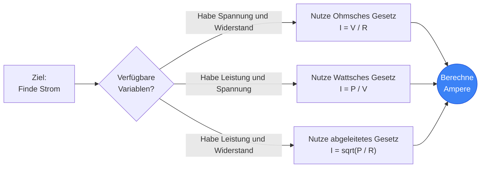
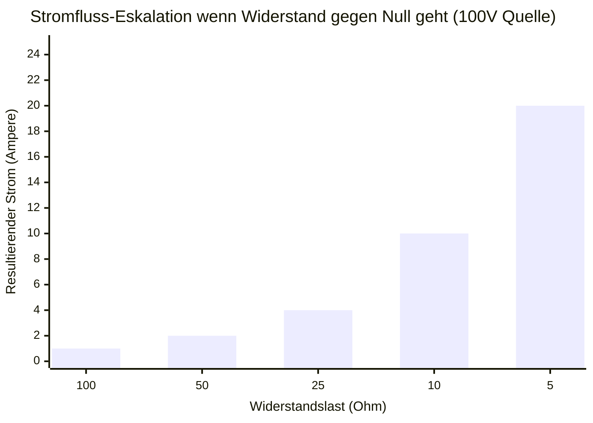
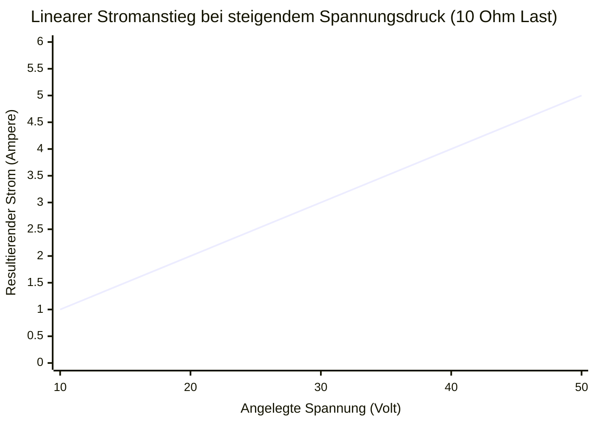
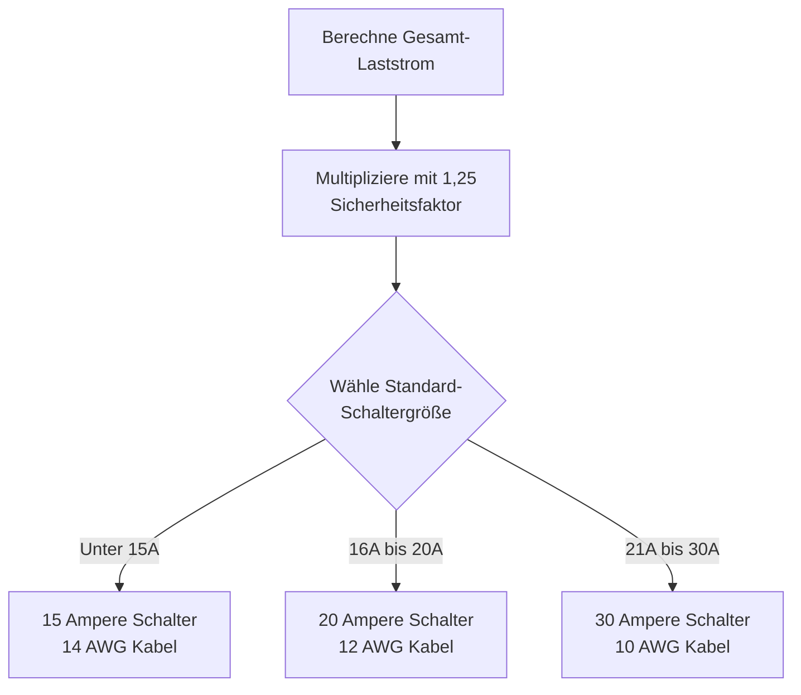

# Der definitive Stromrechner: Elektrische Stromstärke und Stromfluss meistern

Willkommen beim ultimativen **Stromrechner** und umfassenden Physik-Guide. Egal, ob Sie Kupferkabelquerschnitte für einen $100\text{A}$ Industriemotor dimensionieren, die genaue Sicherungsgröße für einen empfindlichen USB-Schaltkreis berechnen oder genau herausfinden möchten, wie viele Ampere Ihr Haushaltskühlschrank während eines Kompressor-Anlaufs zieht – diese interaktive Suite bietet die exakten mathematischen Ableitungen, die Sie benötigen.

Elektrischer Strom ist das Lebensblut der gesamten Elektronik. Während Spannung den "Druck" liefert und Widerstand die "Reibung" darstellt, repräsentiert der Strom den tatsächlichen, physikalischen Fluss geladener Elektronen, die thermodynamische Arbeit verrichten.

In diesem umfassenden 4.000+ Wörter umfassenden SEO-Guide werden wir die Physik des elektrischen Stroms tiefgreifend dekonstruieren, die mathematischen Grenzen des Ohmschen Gesetzes ($I = V/R$) und des Wattschen Gesetzes ($I = P/V$) ausloten, die strengen Standards des National Electrical Code (NEC) zur Kabeldimensionierung entschlüsseln und fünf detaillierte elektrische Szenarien analysieren, die durch interaktive, parser-sichere Mermaid.js-Diagramme visuell dargestellt werden.

---

## 1. Was genau ist elektrischer Strom? (Die physikalische Definition)

**Elektrischer Strom**, wissenschaftlich gemessen in **Ampere** (oder "Amp"), ist die grundlegende Rate, mit der elektrische Ladung an einem bestimmten Punkt in einem geschlossenen Stromkreis vorbeifließt.

Um Strom intuitiv zu verstehen, greifen Elektroingenieure universell auf die **Wasserrohr-Analogie** zurück:
- Stellen Sie sich einen Fluss vor, der durch einen Canyon fließt. Das schiere Volumen an Wasser, das jede Sekunde aggressiv an einem Kontrollpunkt vorbeiströmt, ist der Strom.
- **Strom ist die Flussrate.**
- Wenn Sie einen massiven $100\text{A}$ Stromkreis haben, haben Sie eine immense, gewaltige Flut von Elektronen, die durch das Kupferkabel strömt und enorme Mengen an Magnetfeldern und thermischer Hitze erzeugt.
- Wenn Sie einen winzigen $20\text{mA}$ LED-Stromkreis haben, haben Sie ein sanftes, mikroskopisches Tröpfeln von Elektronen.

Die offizielle SI-Einheit für Strom ist das **Ampere ($\text{A}$)**, benannt nach dem französischen Mathematiker André-Marie Ampère. In streng thermodynamischen Begriffen ist $1\text{ Ampere}$ genau als $1\text{ Coulomb}$ elektrische Ladung definiert, die in exakt $1\text{ Sekunde}$ an einem bestimmten Punkt vorbeifließt. ($1\text{A} = 1\text{C} / 1\text{s}$).

Da ein einzelnes Elektron eine schmerzhaft kleine Ladung trägt, sind etwa **6,242 Trillionen Elektronen** ($6,242 \times 10^{18}$) erforderlich, die jede einzelne Sekunde an einem Kontrollpunkt vorbeiströmen, nur um $1\text{ Ampere}$ zu entsprechen!

---

## 2. Ableitung des Stroms aus dem Ohmschen Gesetz ($I = V / R$)

Georg Simon Ohm bewies, dass der Strom in einer Dreiecksbeziehung mit Spannung ($V$) und Widerstand ($R$) mathematisch festgeschrieben ist.

$$I = \frac{V}{R}$$

Das bedeutet, dass Sie die durch ein Bauteil fließende Stromstärke leicht berechnen können, wenn Sie den Spannungsdruck, der es antreibt, und den Widerstand, der dagegen ankämpft, kennen.
- **Wenn die Spannung steigt**, der Widerstand aber gleich bleibt, wird der Stromfluss aggressiv zunehmen.
- **Wenn der Widerstand steigt**, die Spannung aber gleich bleibt, wird der Stromfluss abgewürgt und sinkt.

Diese exakte mathematische Beziehung erklärt die Funktionsweise von "Vorwiderständen". Wenn Sie eine winzige LED direkt an eine $9\text{V}$-Batterie anschließen, ist der Widerstand fast null, wodurch der Strom unendlich ansteigt und die LED sofort zerstört. Durch das Vorschalten eines $470\ \Omega$-Widerstands in Reihe drosseln Sie den Strom perfekt auf ein sicheres $20\text{mA}$-Tröpfeln.

---

## 3. Ableitung des Stroms aus dem Wattschen Gesetz ($I = P / V$)

Während das Ohmsche Gesetz den Elektronenfluss gegen die Reibung bestimmt, diktiert das Wattsche Gesetz die thermodynamische Leistungsabgabe.

$$P = V \cdot I$$

Indem wir den Strom ($I$) algebraisch isolieren, erhalten wir zwei unglaublich leistungsstarke technische Formeln:
1. **Strom abgeleitet aus Leistung und Spannung:** $I = \frac{P}{V}$
2. **Strom abgeleitet aus Leistung und Widerstand:** $I = \sqrt{\frac{P}{R}}$

Diese Formeln sind für Elektriker absolut obligatorisch. Wenn ein Hausbesitzer einen massiven elektrischen $1.500\text{W}$-Heizlüfter kauft und ihn an eine Standard-$120\text{V}$-Steckdose anschließt, muss der Elektriker sofort wissen, wie viele Ampere diese Heizung zieht, um sicherzustellen, dass der Leitungsschutzschalter des Hauses nicht auslöst.
Verwendung der Formel: $I = 1500 / 120 = 12,5\text{A}$. Da $12,5\text{A}$ sicher unter der Standardgrenze von $15\text{A}$ für Sicherungen liegt, funktioniert die Heizung einwandfrei.

---

## 4. Elektronenfluss vs. Technische Stromrichtung

Einer der verwirrendsten Aspekte der elektrischen Physik ist die Richtung, in die der Strom tatsächlich fließt. Es gibt zwei konkurrierende Modelle:

### Technische Stromrichtung (+ nach -)
Als Benjamin Franklin in den 1700er Jahren Pionierarbeit in der Elektrizität leistete, vermutete er, dass "positive" Ladungsteilchen aus dem Pluspol, durch den Stromkreis und in den Minuspol flossen. Über ein Jahrhundert lang bauten alle mathematischen Berechnungen, Schaltplansymbole und Konstruktionsregeln (wie die Rechte-Hand-Regel für Magnetfelder) auf dieser Annahme auf.

### Elektronenfluss (- nach +)
1897 entdeckte J.J. Thomson das Elektron und bewies, dass Franklin falsch lag. Die tatsächlichen Teilchen, die sich physisch durch ein Kupferkabel bewegen, sind negativ geladene Elektronen. Daher stoßen sie sich in Wirklichkeit vom Minuspol ab und fließen in Richtung des Pluspols!

Trotz dieses massiven historischen Fehlers verwenden moderne Elektroingenieure für alle mathematischen Berechnungen und Schaltpläne weiterhin die **technische Stromrichtung**, da die Mathematik auf beide Arten perfekt identisch funktioniert.

---

## 5. Schaltungsschutz: Sicherungen und Kabelquerschnitte

Strom ist das, was elektrische Brände verursacht. Wenn Strom durch ein Kupferkabel fließt, erzeugt der Innenwiderstand des Kupfers Wärme ($P = I^2 R$). Wenn der Strom die physikalischen thermischen Grenzen des Kupfers überschreitet, schmilzt die Isolierung des Kabels, entzündet die Trockenbauwand und brennt das Gebäude nieder.

Um dies zu verhindern, schreibt der National Electrical Code (NEC) strikte Kabelquerschnitte (AWG) und Überstromschutzeinrichtungen (Leitungsschutzschalter/Sicherungen) vor:

1. **Die 125%-Regel:** Ein Leitungsschutzschalter muss so dimensioniert sein, dass er 125% des Dauerlaststroms bewältigen kann. Wenn eine Maschine kontinuierlich $16\text{A}$ zieht, dürfen Sie keinen $16\text{A}$-Schalter verwenden; Sie müssen auf einen $20\text{A}$-Schalter aufrüsten ($16 \cdot 1,25 = 20$).
2. **Kabelquerschnitts-Dimensionierung (AWG):** Die Dicke des Kupferkabels muss der Bemessung des Leistungsschalters entsprechen.
   - Ein $15\text{A}$-Schutzschalter erfordert ein 14-AWG-Kabel.
   - Ein $20\text{A}$-Schutzschalter erfordert ein 12-AWG-Kabel.
   - Ein $30\text{A}$-Schutzschalter erfordert ein 10-AWG-Kabel.
3. **Kurzschlüsse:** Wenn ein spannungsführendes Kabel ein Erdungskabel berührt, fällt der Widerstand auf null. Nach dem Ohmschen Gesetz ($I = V/0$) wird der Strom versuchen, auf unendlich zu springen. Diese massive Spitze löst sofort die Magnetspule im Inneren des Leitungsschutzschalters aus und unterbricht die Stromzufuhr in Millisekunden.

---

## 6. Umfassender Nutzungsleitfaden: Maximale Ausnutzung des Rechners

Unser interaktiver Stromrechner fungiert als fortschrittliches digitales Amperemeter, mit dem Sie nahtlos zwischen den Ableitungen des Ohmschen und Wattschen Gesetzes wechseln können.

### Schritt 1: Wählen Sie Ihre bekannten Variablen
Verwenden Sie die oberen Navigations-Tabs, um auszuwählen, welche Variablen Ihnen aktuell vorliegen:
- **Gegeben Spannung & Widerstand ($I = V / R$):** Perfekt für das Standard-Leiterplattendesign.
- **Gegeben Leistung & Spannung ($I = P / V$):** Perfekt für die Dimensionierung von Haushalts-Leitungsschutzschaltern.
- **Gegeben Leistung & Widerstand ($I = \sqrt{P / R}$):** Ideal für die Analyse von Heizelementen.

### Schritt 2: Nutzen Sie die Voreinstellungen des Geräte-Explorers
Wenn Sie einen Stromkreis für ein echtes Standardgerät entwerfen, klicken Sie einfach auf eine unserer 10 Voreinstellungen. Die Auswahl des **$120\text{V}$-Kühlschranks** oder des **$5\text{V}$-Arduino** lädt sofort die exakten Stromstärkeparameter vor und ordnet die dynamischen Ausgangskurven automatisch zu Ihrer Referenz zu.

### Schritt 3: Überwachen Sie das intelligente Sicherungsbewertungssystem
Beobachten Sie, wie die digitale LCD-Amperemeter-Anzeige dynamisch auf Ihre Eingaben reagiert. Achten Sie genau auf die **Intelligente Sicherungs-Engine**. Der Rechner verarbeitet automatisch die 125%-Dauerlastregel und empfiehlt die genaue Standard-Sicherungsgröße und die AWG-Kupferkabelgröße, die für den sicheren Betrieb Ihres Stromkreises erforderlich sind.

---

## 7. Fünf konzeptionelle technische Szenarien mit 2D-Visualisierungen

Um die mathematischen Beziehungen des Stroms vollständig zu meistern, werden wir fünf verschiedene physikalische Szenarien untersuchen, die mit benutzerdefinierten Mermaid.js-Diagrammen visuell aufgeschlüsselt werden.

### Beispiel 1: Die algebraischen Stromableitungen

**Das Szenario:**
Ein Ingenieurstudent benötigt eine schnelle Visualisierung, wie der Strom bei verschiedenen Problemstellungen mathematisch aus Spannung ($V$), Widerstand ($R$) und Leistung ($P$) extrahiert werden kann.

**2D-Visualisierung:**
Dieses Logik-Flussdiagramm bildet die drei verschiedenen mathematischen Pfade zur Berechnung der Stromstärke ab, abhängig von den bekannten Variablen, die in einer Prüfung angegeben sind.

---

### Beispiel 2: Strom vs. Widerstand (Konstante Spannung)

**Das Szenario:**
Sie haben eine konstante $100\text{V}$-Stromversorgung. Sie testen verschiedene Widerstandslasten. Wie verschiebt sich der Strom dramatisch, wenn der Widerstand immer näher an Null sinkt?

**Die Mathematik:**
Da $V = 100$, ist $I = 100 / R$.
- Bei $100\ \Omega$: $I = 100 / 100 = 1\text{A}$
- Bei $10\ \Omega$: $I = 100 / 10 = 10\text{A}$
- Bei $5\ \Omega$: $I = 100 / 5 = 20\text{A}$

**2D-Visualisierung:**
Dieses Diagramm zeigt die furchterregende exponentielle Kurve des Stroms. Wenn sich der Widerstand null nähert, nähert sich der Strom unendlich an und demonstriert genau, warum Kurzschlüsse so zerstörerisch sind.

---

### Beispiel 3: Linearer Strom vs. Spannung (Konstanter Widerstand)

**Das Szenario:**
Sie haben eine perfekt statische $10\ \Omega$-Heizspirale. Sie erhöhen langsam die Spannung an einem variablen Labornetzteil. Wie reagiert der Strom auf den zunehmenden Spannungsdruck?

**Die Mathematik:**
Da $R = 10$, ist $I = V / 10$.
- Bei $10\text{V}$: $I = 10 / 10 = 1\text{A}$
- Bei $50\text{V}$: $I = 50 / 10 = 5\text{A}$

**2D-Visualisierung:**
Im Gegensatz zur obigen Exponentialkurve zeigt dieses Liniendiagramm die perfekt lineare, vorhersagbare Beziehung des Ohmschen Gesetzes, wenn der Widerstand festgeschrieben ist.

---

### Beispiel 4: Logik zur Dimensionierung von Leitungsschutzschaltern

**Das Szenario:**
Ein Elektriker installiert einen dedizierten Stromkreis für ein Server-Rack in industriellem Dauerbetrieb. Er muss die genaue Schaltergröße mithilfe der 125%-Regel des NEC berechnen.

**2D-Visualisierung:**
Dieses Top-Down-Flussdiagramm kategorisiert strikt die Mathematik, die zur ordnungsgemäßen Dimensionierung eines Leitungsschutzschalters und des anschließenden Kabelquerschnitts erforderlich ist.

---

### Beispiel 5: Hochstrom-Batterie-Entladungstest

**Das Szenario:**
Ein Ingenieur testet die maximale Entladefähigkeit einer Lithium-Polymer-Drohnenbatterie. Er muss den Spitzenstrom über ein strenges 3-Minuten-Intervall messen, bevor es zur thermischen Abschaltung kommt.

**2D-Visualisierung:**
Dieses Gantt-Diagramm skizziert den strengen Feldtest-Zeitplan zur Überwachung extremer Stromflüsse und Batterietemperaturen.

```mermaid
gantt
    title Hochstrom-Drohnenbatterie-Entladungstest
    dateFormat  HH:mm:ss
    axisFormat  %H:%M:%S
    
    section Setup
    100A Shunt-Widerstand anschließen :done, 00:00:00, 30s
    Telemetrie kalibrieren :active, 00:00:30, 30s
    
    section Entladung
    50A konstante Stromentnahme initiieren :crit, 00:01:00, 60s
    Batterietemperatur-Spitze protokollieren :active, 00:01:30, 30s
    
    section Abschaltung
    Thermische Abschaltung auslösen :milestone, 00:02:00, 10s
    Abkühlphase :active, 00:02:10, 50s
```

---

## 8. Fazit und technische Herausforderung

Die Beherrschung des Stroms ist der ultimative Schlüssel zur elektrischen Sicherheit und zum Schaltungsdesign. Jedes Kabel, das Sie verlegen, jede Sicherung, die Sie installieren, und jede LED, die Sie anlöten, beruht auf Ihrer Fähigkeit, den Stromfluss mit $I = V/R$ und $I = P/V$ genau zu berechnen.

Wenn Sie den Strom respektieren und Ihre Kabel genau dimensionieren, werden Ihre Schaltkreise perfekt kalt und effizient laufen. Wenn Sie den Strom unterschätzen, werden sich Ihre Kabel extrem überhitzen und schmelzen.

Um zu garantieren, dass Sie diese Konzepte gemeistert haben, starten Sie unseren interaktiven Simulator und versuchen Sie, diese letzten Herausforderungen zu lösen:
1. **Die Mikrowelle:** Eine Küchenmikrowelle zieht $1.200\text{W}$ Leistung aus einer Standard-$120\text{V}$-Steckdose. Berechnen Sie den genauen Strom ($I$), den sie zieht. Löst sie einen $15\text{A}$-Schutzschalter aus, wenn gleichzeitig ein $5\text{A}$-Toaster im selben Stromkreis läuft?
2. **Der Kurzschluss:** Eine $12\text{V}$-Autobatterie wird versehentlich mit einem Schraubenschlüssel kurzgeschlossen. Der einzige verbleibende Widerstand ist der $0,02\ \Omega$ Innenwiderstand der Batterie. Berechnen Sie den massiven Kurzschlussstrom ($I = V/R$), der den Schraubenschlüssel sofort verdampfen lässt.
3. **Das LED-Array:** Sie möchten ein massives Array von $50$ Anzeige-LEDs parallel betreiben. Jede LED benötigt genau $20\text{mA}$ ($0,02\text{A}$) um zu funktionieren. Berechnen Sie die Gesamtstromaufnahme des Arrays.

Verlassen Sie sich auf diesen Rechner, um Ihre Berechnungen zu überprüfen, respektieren Sie die NEC-Kabelgrenzen und denken Sie immer daran: Strom ist der aggressive Fluss, der Ihre Schaltkreise zum Leben erweckt.
