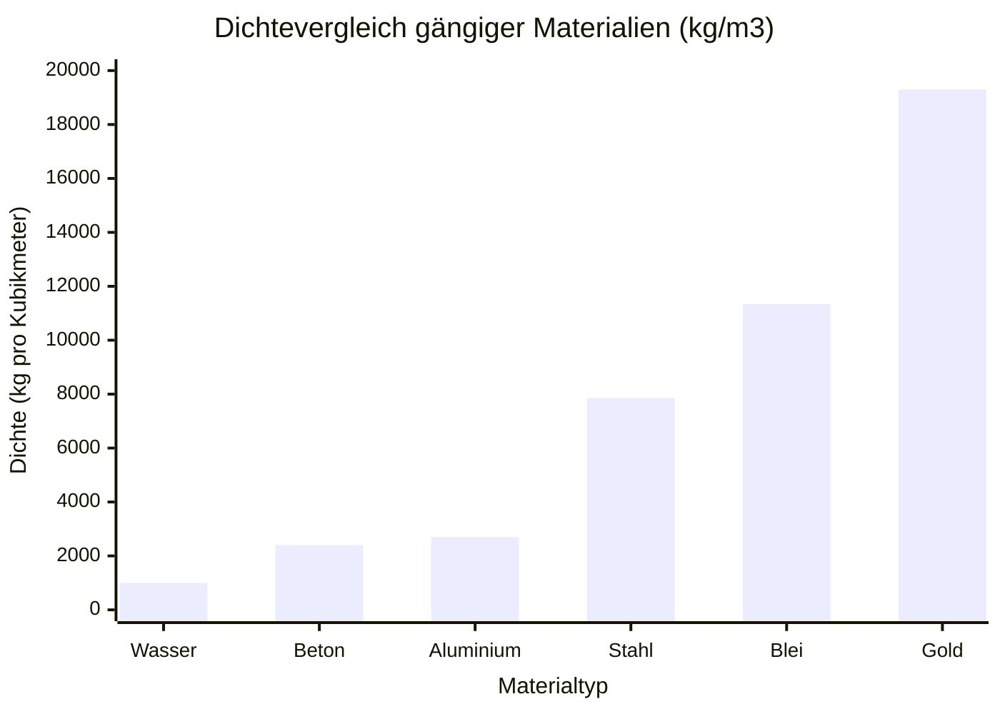
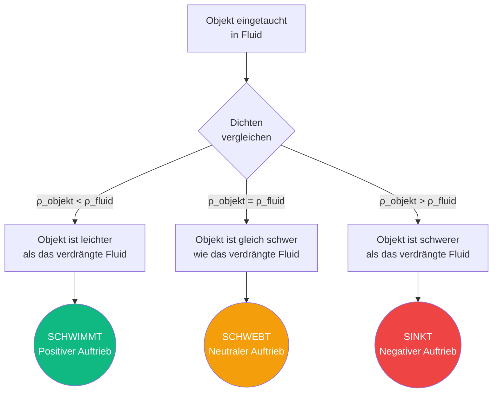
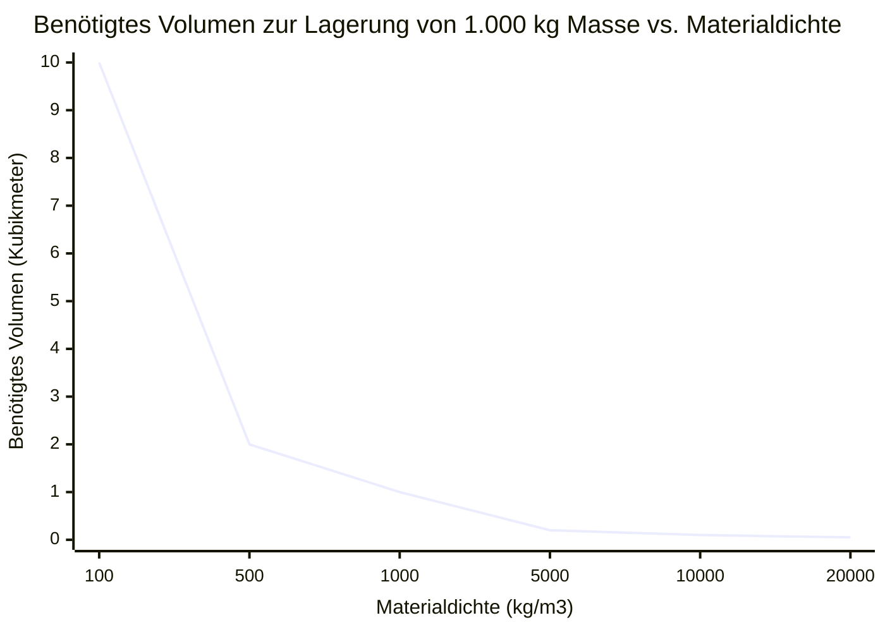

# Der definitive Dichterechner: Masse, Volumen und das archimedische Prinzip meistern

Willkommen beim ultimativen **Dichterechner** und umfassenden Leitfaden der technischen Physik. Egal, ob Sie ein Student der Materialwissenschaften sind, der die Reinheit eines Goldrings überprüfen möchte, ein Statiker, der die Eigenlast eines Stahlbetonpfeilers berechnet, oder ein Schiffsarchitekt, der die Rumpfverdrängung eines 100.000-Tonnen-Kreuzfahrtschiffs entwirft, dieses Tool bietet Ihnen die absolut exakten physikalischen Umrechnungen und konzeptionellen Rahmenbedingungen, die Sie benötigen.

Dichte ($\rho$) ist eine der grundlegendsten intensiven Eigenschaften im Universum. Sie beschreibt die genaue Beziehung darüber, wie viel Materie (Masse) in eine bestimmte Menge an dreidimensionalem Raum (Volumen) gepackt ist. Indem Sie die Dichte meistern, erhalten Sie den Schlüssel zum Verständnis von Auftrieb, Aerodynamik, hydrostatischem Druck und der grundlegenden strukturellen Integrität der physischen Welt.

In diesem ausführlichen, SEO-optimierten Leitfaden mit über 4.000 Wörtern werden wir die Dichteformel ($\rho = m/V$) tiefgreiefend aufschlüsseln. Wir werden die Nuancen des spezifischen Gewichts (SG) untersuchen, das 2.000 Jahre alte Geheimnis des Archimedischen Prinzips enträtseln und fünf detaillierte konzeptionelle technische Szenarien analysieren, die visuell durch interaktive Mermaid.js-Diagramme dargestellt werden.

---

## 1. Dichte definieren: Die Anatomie der Materie

In der klassischen Physik ist die **Dichte** (dargestellt durch den griechischen Buchstaben $\rho$, *rho*) als die Masse einer Substanz pro Volumeneinheit definiert. Sie ist eine *intensive* Eigenschaft, was bedeutet, dass sie sich nicht ändert, unabhängig davon, wie viel von der Substanz Sie haben. Ein einzelner Tropfen reinen Wassers hat genau dieselbe Dichte wie ein komplettes olympisches Schwimmbecken mit reinem Wasser.

$$ \rho = \frac{m}{V} $$

### Die Analogie vom Kissen vs. Bleiblock
Um die Dichte intuitiv zu begreifen, stellen Sie sich vor, Sie halten ein gewöhnliches Kopfkissen in Ihrer linken Hand und einen massiven Bleiblock mit exakt denselben physischen Abmessungen (Volumen) in Ihrer rechten Hand.
- Das Kissen ist hauptsächlich mit leerem Raum und eingeschlossener Luft gefüllt. Es besitzt sehr wenig Masse innerhalb dieses Volumens. Es hat eine extrem **niedrige Dichte**.
- Der massive Bleiblock hat seine schweren Atomkerne dicht in einem engen Kristallgitter verpackt. Er enthält eine immense Menge an Masse innerhalb genau desselben Volumens. Er hat eine unglaublich **hohe Dichte** (und wird Ihnen wahrscheinlich das Handgelenk brechen).

### Standard-SI-Einheiten der Dichte
Da die Masse in Kilogramm ($\text{kg}$) und das Volumen in Kubikmetern ($\text{m}^3$) gemessen wird, ist die Standard-SI-Einheit für die Dichte **Kilogramm pro Kubikmeter** ($\text{kg/m}^3$).
In der Laborchemie werden jedoch häufig kleinere Einheiten verwendet:
- **Gramm pro Kubikzentimeter** ($\text{g/cm}^3$)
- **Gramm pro Milliliter** ($\text{g/mL}$)

*Wichtiger Hinweis: $1\text{ cm}^3$ ist physikalisch identisch mit $1\text{ mL}$. Daher ist $1\text{ g/cm}^3 = 1\text{ g/mL}$.*

Um zwischen Laboreinheiten und technischen SI-Einheiten umzurechnen, multiplizieren Sie einfach mit $1.000$:
$$ 1\text{ g/cm}^3 = 1.000\text{ kg/m}^3 $$

---

## 2. Spezifisches Gewicht: Das universelle Verhältnis

Das **spezifische Gewicht (SG)** (auch bekannt als *relative Dichte*) ist eine brillante mathematische Abkürzung, die von Ingenieuren verwendet wird, um den Umgang mit komplizierten Einheiten zu vermeiden. Es ist lediglich ein dimensionsloses Verhältnis, das die Dichte Ihres gewählten Materials mit der Basisdichte von reinem flüssigen Wasser bei $4^\circ\text{C}$ ($1.000\text{ kg/m}^3$) vergleicht.

$$ \text{SG} = \frac{\rho_{\text{substanz}}}{\rho_{\text{wasser}}} $$

Da es sich um ein Verhältnis von Dichten handelt, kürzen sich die Einheiten heraus, und es bleibt eine reine Zahl übrig.
- Wenn ein massiver Aluminiumblock eine Dichte von $2.700\text{ kg/m}^3$ hat, ist sein spezifisches Gewicht genau **$2,70$**.
- Wenn ein Block abgelagertes Eichenholz eine Dichte von $700\text{ kg/m}^3$ hat, ist sein spezifisches Gewicht genau **$0,70$**.

Dies sagt uns sofort, wie sich ein Material im Wasser verhalten wird, ohne komplexe Berechnungen anzustellen. Wenn $\text{SG} < 1$, schwimmt es. Wenn $\text{SG} > 1$, sinkt es.

---

## 3. Das Archimedische Prinzip: Die Physik des Auftriebs

Die Legende besagt, dass der griechische Mathematiker Archimedes im Jahr 250 v. Chr. vom König Hiero II. von Syrakus beauftragt wurde, herauszufinden, ob ein Goldschmied beim Schmieden einer königlichen Krone reines Gold gestohlen und durch billigeres Silber ersetzt hatte. Archimedes konnte die Krone nicht einschmelzen. Als er in eine Badewanne stieg, bemerkte er, dass der Wasserspiegel genau im Verhältnis zum Volumen seines eingetauchten Körpers anstieg. Er erkannte, dass er das Volumen der Krone messen konnte, indem er sie in Wasser tauchte, ihre Masse durch dieses Volumen teilte und so ihre Dichte ermittelte, um ihre Reinheit zu beweisen. Er soll nackt durch die Straßen gerannt sein und "Heureka!" (Ich habe es gefunden!) gerufen haben.

Dies führte zur Formulierung des **Archimedischen Prinzips**:
*"Jeder Körper, der ganz oder teilweise in ein Fluid eingetaucht ist, erfährt eine Auftriebskraft, die gleich dem Gewicht des vom Körper verdrängten Fluids ist."*

$$ F_{\text{Auftrieb}} = \rho_{\text{fluid}} \cdot V_{\text{verdrängt}} \cdot g $$

### Wie Schiffe schwimmen
Ein massiver Stahlblock ($\text{SG} = 7,85$) wird schnell auf den Grund des Ozeans sinken. Wie also schwimmt ein massiver Flugzeugträger aus Stahl?
Indem man den Stahl zu einer breiten, hohlen Schüsselform (einem Rumpf) hämmert, umschließt das Schiff ein riesiges Luftvolumen ($\text{SG} = 0,001$). Die *durchschnittliche* Dichte der gesamten Schiffsstruktur (schwerer Stahl + massives Volumen leichter Luft) sinkt deutlich unter die Dichte von Meerwasser ($1.025\text{ kg/m}^3$).
Das Schiff verdrängt eine Menge Meerwasser, die seinem eigenen immensen Gewicht entspricht, lange bevor das Wasser das Oberdeck durchbricht, wodurch es ein Auftriebsgleichgewicht erreicht.

---

## 4. Umfassende Bedienungsanleitung: Den Rechner optimal nutzen

Unser interaktiver Dichterechner fungiert als robuste Werkbank für Thermodynamik und Materialwissenschaften.

### Schritt 1: Wählen Sie Ihr Berechnungsziel
Verwenden Sie die obere Navigation, um Ihre unbekannte Variable auszuwählen:
- **Dichte ($\rho$):** Sie kennen Masse und Volumen. (Ideal zur Identifizierung unbekannter Materialien).
- **Masse ($m$):** Sie kennen Dichte und Volumen. (Ideal zur Berechnung von strukturellen Gewichtsbelastungen).
- **Volumen ($V$):** Sie kennen Dichte und Masse. (Ideal zur Dimensionierung von Lagertanks).

### Schritt 2: Nutzen Sie die Materialdatenbank
Überspringen Sie die manuelle Dateneingabe, indem Sie aus unseren über 17 integrierten Materialvorgaben auswählen. Müssen Sie die genaue Masse von $5\text{ m}^3$ flüssigem Quecksilber wissen? Wählen Sie "Quecksilber" aus der Dropdown-Liste und der Rechner fügt sofort $\rho = 13.540\text{ kg/m}^3$ ein.

### Schritt 3: Entdecken Sie den Simulator für Schwimm- und Sinkverhalten
Sobald Ihre Dichte berechnet ist, überprüfen Sie das Auftriebssimulator-Panel. Es gleicht Ihre berechnete Dichte mit fünf gängigen Flüssigkeiten (Süßwasser, Salzwasser, Speiseöl, Ethanol und Quecksilber) ab, um Ihnen sofort mitzuteilen, ob Ihr Objekt an der Oberfläche schwimmt, eine neutrale Schwebe erreicht oder auf den Grund sinkt.

---

## 5. Fünf konzeptionelle technische Szenarien mit 2D-Visualisierungen

Um die Beziehungen zwischen Masse, Volumen, Dichte und Auftrieb vollständig zu meistern, werden wir fünf verschiedene physikalische Szenarien untersuchen, die visuell mit benutzerdefinierten Mermaid.js-Diagrammen aufgeschlüsselt werden.

### Beispiel 1: Die Logik der Dichteformel (Auflösen nach Variablen)

**Das Szenario:**
Ein Chemie-Schüler der Oberstufe muss sich die algebraischen Umstellungen der Dichteformel ($\rho = m/V$) schnell visualisieren, um drei verschiedene Prüfungsfragen zu lösen.

**2D-Visualisierung:**
Dieses Logik-Flussdiagramm veranschaulicht das klassische "Dichtedreieck", das zum Isolieren von Variablen verwendet wird.


---

### Beispiel 2: Das Dichtespektrum der Elemente

**Das Szenario:**
Ein Ingenieur entwirft ein kleines Gegengewicht für eine Luft- und Raumfahrtdrohne. Ihm stehen genau $1.000\text{ cm}^3$ ($1\text{ Liter}$) Platz zur Verfügung. Er muss visualisieren, wie verschiedene Materialien die Masse des Gegengewichts radikal verändern werden.

**2D-Visualisierung:**
Dieses Balkendiagramm stellt die enormen Dichteunterschiede zwischen gängigen Materialien dar. Beachten Sie, dass Gold fast 20-mal dichter ist als Wasser und über 7-mal dichter als Aluminium!



---

### Beispiel 3: Der Archimedische Auftriebs-Entscheidungsbaum

**Das Szenario:**
Ein Meeresbiologe entwirft ein Tiefsee-Tauchboot. Er muss genau berechnen, wie sich das Tauchboot verhalten wird, wenn es in Meerwasser ($1.025\text{ kg/m}^3$) abgesetzt wird, basierend auf seiner durchschnittlichen strukturellen Dichte.

**2D-Visualisierung:**
Dieses Flussdiagramm visualisiert die strikten logischen Konsequenzen des Archimedischen Prinzips basierend auf dem spezifischen Gewicht (relative Dichte).



---

### Beispiel 4: Die inverse Volumenkurve bei fester Masse

**Das Szenario:**
Sie haben genau $1.000\text{ kg}$ ($1\text{ metrische Tonne}$) Material. Wie viel physischen Raum (Volumen) wird es einnehmen? Da Volumen = Masse / Dichte ist, fällt das benötigte Volumen exponentiell gegen Null, wenn die Dichte des Materials zunimmt.

**Die Mathematik:**
- $1.000\text{ kg}$ Luft ($\rho = 1,225$) benötigen $816\text{ m}^3$ Platz.
- $1.000\text{ kg}$ Wasser ($\rho = 1.000$) benötigen $1,0\text{ m}^3$ Platz.
- $1.000\text{ kg}$ Gold ($\rho = 19.300$) benötigen nur $0,051\text{ m}^3$ Platz!

**2D-Visualisierung:**
Dieses Diagramm zeigt den hyperbolischen Abfall des erforderlichen Volumens mit zunehmender Materialdichte bei einer festen Masse von $1.000\text{ kg}$.



---

### Beispiel 5: Der metallurgische Goldtestprozess (Gantt)

**Das Szenario:**
Ein Juwelier erhält einen Ziegelstein, der angeblich aus "reinem 24-karätigem Gold" besteht. Er muss die Archimedische Wasserverdrängungsmethode anwenden, um die genaue Dichte zu berechnen und die Reinheit zu überprüfen, ohne hineinzuschneiden.

**2D-Visualisierung:**
Dieses Gantt-Diagramm skizziert den chronologischen Laborprozess zur Berechnung der Dichte eines unregelmäßigen Festkörpers.

```mermaid
gantt
    title Laborprotokoll für die Dichteprüfung (Wasserverdrängung)
    dateFormat m
    axisFormat %M
    section Trockenmessungen
    Waage auf Null kalibrieren :crit, active, 0, 2m
    Objekt an der Luft wiegen (Masse notieren) :active, 2m, 5m
    section Nassmessungen
    Messzylinder mit Wasser füllen :5m, 8m
    Anfängliches Wasservolumen notieren (V1) :8m, 10m
    Objekt eintauchen & Endvolumen notieren (V2) :crit, 10m, 13m
    section Berechnungen
    Verdrängtes Volumen berechnen (V2 - V1) :13m, 15m
    Dichte berechnen (Masse / Volumen) :milestone, 15m, 16m
```

---

## 6. Häufig gestellte Fragen (FAQ) im Detail

**F: Warum schwimmt Eis auf Wasser, wenn beide nur H₂O sind?**
**A:** Dies ist eine seltene und wunderschöne Anomalie der Physik. Wenn Wasser zu Eis gefriert, zwingen die Wasserstoffbrückenbindungen die Moleküle in ein starres, offenes hexagonales Kristallgitter. Dieses Gitter nimmt etwa $9\%$ mehr physischen Raum (Volumen) ein als das chaotische Taumeln der flüssigen Wassermoleküle. Da die Masse gleich bleibt, das Volumen jedoch zunimmt, sinkt die Dichte. Eis ($\rho = 917\text{ kg/m}^3$) ist weniger dicht als flüssiges Wasser ($\rho = 1.000\text{ kg/m}^3$), also schwimmt es! Würde dies nicht geschehen, würden die Ozeane von unten nach oben zufrieren und alles Meeresleben töten.

**F: Was ist der Unterschied zwischen Masse und Gewicht?**
**A:** Die Masse ist die absolute Menge an Materie in einem Objekt (gemessen in $\text{kg}$), und sie ändert sich nie, es sei denn, Sie halbieren das Objekt physisch. Das Gewicht ist die lokale Schwerkraft, die an dieser Masse zieht (gemessen in Newton, $W = m \cdot g$). Ein Astronaut hat auf der Erde genau dieselbe Masse und Dichte wie auf dem Mond, aber sein *Gewicht* ist auf dem Mond sechsmal geringer.

**F: Wie beeinflusst die Temperatur die Dichte?**
**A:** Mit sehr wenigen Ausnahmen (wie flüssiges Wasser unter $4^\circ\text{C}$) fügt das Erhitzen einer Substanz thermische kinetische Energie hinzu. Die Atome vibrieren stark und stoßen sich gegenseitig ab, wodurch das Material eine *thermische Ausdehnung* erfährt. Da das Volumen ($V$) zunimmt, während die Masse ($m$) konstant bleibt, nimmt die Dichte ($\rho$) ab. Genau aus diesem Grund steigen Heißluftballons auf – durch das Erhitzen der Luft sinkt deren Dichte unter die der umgebenden Außenluft, wodurch ein Auftrieb nach oben entsteht!

**F: Was ist die dichteste Substanz im Universum?**
**A:** Auf der Erde ist das dichteste natürlich vorkommende Element Osmium ($\rho = 22.590\text{ kg/m}^3$). Ein handelsüblicher 1-Gallonen-Milchkrug (ca. 3,8 Liter), der mit Osmium gefüllt ist, würde fast $86\text{ Kilogramm}$ (190 Pfund) wiegen! In der Astrophysik besitzt ein Neutronenstern jedoch Dichten von annähernd $10^{17}\text{ kg/m}^3$. Ein einziger Teelöffel Neutronensternmaterial würde über $5,5\text{ Milliarden metrische Tonnen}$ wiegen.

**F: Wie tauchen U-Boote und wie tauchen sie auf?**
**A:** U-Boote nutzen riesige Hohlkammern, sogenannte Ballasttanks. Wenn sie an der Oberfläche kreuzen, sind die Tanks mit Luft gefüllt ($\text{SG} < 1$). Um zu tauchen, öffnen sie Ventile und fluten die Tanks mit schwerem Meerwasser. Dies erhöht die durchschnittliche Gesamtdichte des U-Bootes, bis sie die des Meerwassers übersteigt, wodurch es sinkt. Um aufzutauchen, blasen sie stark komprimierte Luft in die Tanks, wodurch das Wasser herausgedrückt und ein positiver Auftrieb wiederhergestellt wird.

---

## 7. Fazit und technische Herausforderung

Dichte ist die Hauptvariable, die das Makro-Engineering von Schiffen und Wolkenkratzern mit dem Mikro-Engineering von atomaren Gitterstrukturen verbindet. Durch das Verständnis, wie man Masse und Volumen manipuliert, können Ingenieure Beton herstellen, der schwimmt, oder Metalle, die wie Steine sinken.

Um diese Konzepte der Strömungsmechanik und Thermodynamik wirklich zu meistern, nutzen Sie unseren Dichterechner, um die folgenden konzeptionellen physikalischen Herausforderungen zu lösen:
1. **Der Bleiballon:** Sie haben eine hohle Kugel aus massivem Blei ($\rho = 11.340\text{ kg/m}^3$). Sie hat einen Außenradius von $1\text{ Meter}$, aber die Bleihülle ist unglaublich dünn und umschließt ein massives Vakuum im Inneren. Wenn die Gesamtmasse der Bleihülle nur $500\text{ kg}$ beträgt, wird dieser Bleiballon im Ozean schwimmen oder sinken? (Tipp: Berechnen Sie das Gesamtvolumen der 1-Meter-Kugel und ermitteln Sie die *durchschnittliche* Dichte).
2. **Der Platinbetrug:** Ein Schürfer verkauft Ihnen einen kleinen metallischen Würfel, der an allen Seiten exakt $5\text{ cm}$ misst ($V = 125\text{ cm}^3$). Er behauptet, es sei reines massives Platin ($\rho = 21,45\text{ g/cm}^3$). Sie wiegen den Würfel und die Waage zeigt $1.100\text{ Gramm}$ an. Wurden Sie gerade betrogen?
3. **Die Ölkatastrophe:** Ein Frachtschiff verliert $10.000\text{ kg}$ Rohöl ($\rho = 850\text{ kg/m}^3$) in einen Süßwassersee ($\rho = 1.000\text{ kg/m}^3$). Wie viele Kubikmeter Ölteppich werden sich auf der Oberfläche bilden, und warum sinkt er nicht?

Experimentieren Sie mit dem Simulator, analysieren Sie den komplexen Auftrieb verschiedener Materialkombinationen und verlassen Sie sich auf diesen Rechner, um die verborgenen Massenverteilungen aufzudecken, die unsere physikalische Realität bestimmen.
