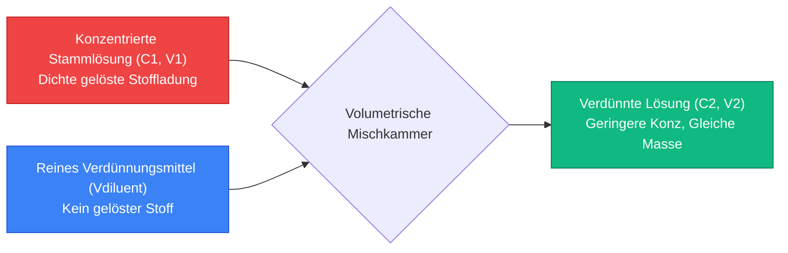
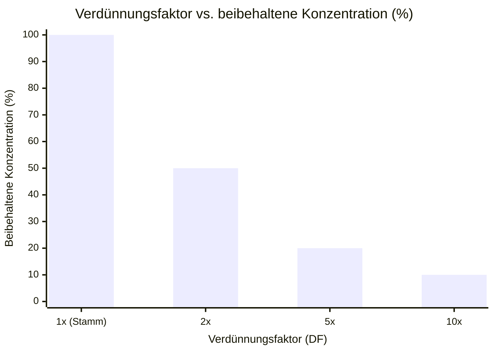
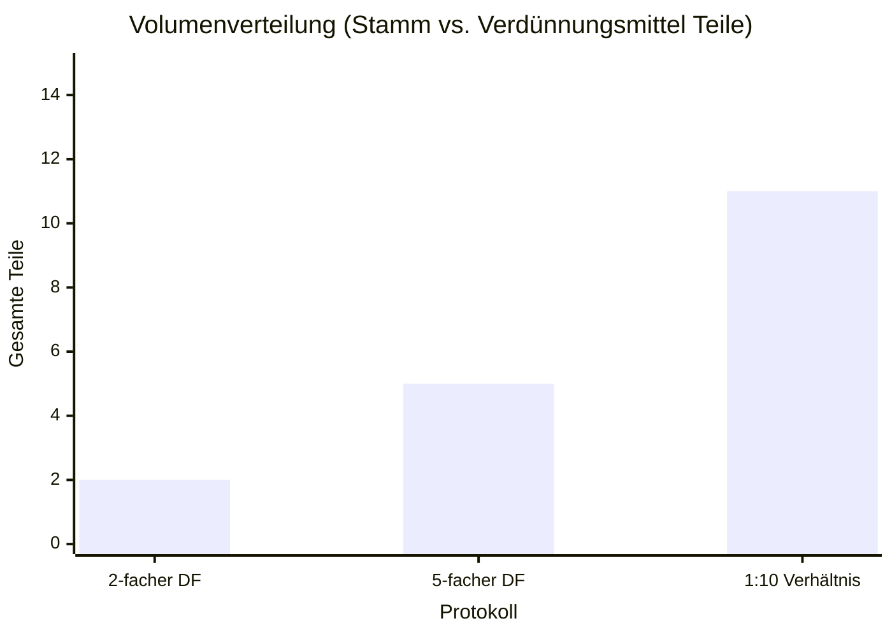
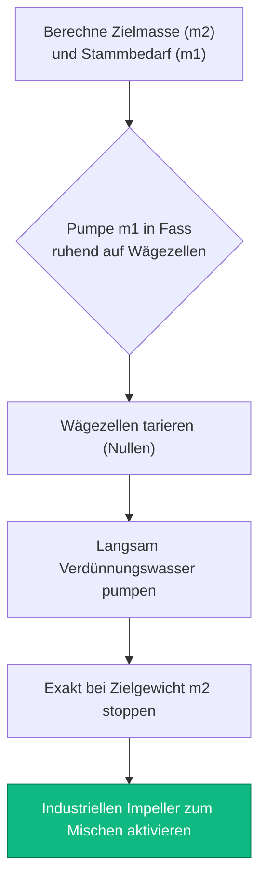
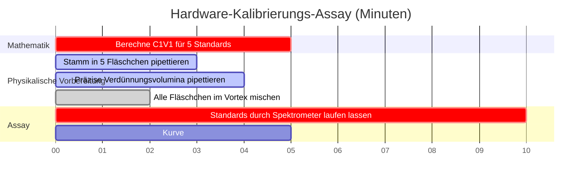

# Der universelle Verdünnungsrechner: Verhältnisse, Faktoren und $C_1 V_1 = C_2 V_2$

Willkommen beim ultimativen **Universellen Verdünnungsrechner** und umfassenden Labor-Lösungshandbuch. Egal, ob Sie ein klinischer Mikrobiologe sind, der einen 1:10.000 seriellen Assay für Zellkulturen vorbereitet, ein Industriechemiker, der einen $500\text{ kg}$-Tank mit $5\% \text{ w/w}$ Natriumhypochlorit hochskaliert, oder ein Umweltwissenschaftler, der Schwermetallstandards für die Atomabsorptionsspektroskopie verdünnt, die Beherrschung der universellen Verdünnungsmathematik ist eine absolute Notwendigkeit.

Während "Verdünnung" nach einem einfachen Prozess klingt – das Hinzufügen von Wasser zu einer starken Chemikalie, um sie schwächer zu machen –, ist die mathematische Strenge, die erforderlich ist, um exakte Verhältnisse der gelösten Stoffe über verschiedene Einheiten (Molarität, Massenprozente, volumetrische Verhältnisse) hinweg aufrechtzuerhalten, bekanntermaßen fehleranfällig. Ein einziger falsch platzierter Dezimalpunkt in einer Verdünnungsfaktorberechnung kann eine industrielle Charge in Millionenhöhe ruinieren oder eine pharmazeutische Dosierung fatal verändern.

In dieser erschöpfenden, mehr als 4.000 Wörter umfassenden SEO-Meisterklasse werden wir die universelle Verdünnungsphysik vollständig dekonstruieren, die Unterschiede zwischen Verdünnungsverhältnissen und Verdünnungsfaktoren mathematisch abbilden, die Thermodynamik von Massenprozent-Verdünnungen ($\% \text{ w/w}$) entschlüsseln und die tödlichsten Fehler bei der Laborvorbereitung aufdecken. Um ein absolutes Verständnis zu gewährleisten, haben wir fünf akribisch detaillierte, parser-sichere interaktive Mermaid.js-Diagramme eingefügt.

---

## 1. Die universelle Verdünnungsgleichung: $C_1 V_1 = C_2 V_2$

Die Grundlage aller volumetrischen Verdünnungsmathematik beruht auf dem unumstößlichen Gesetz der **Erhaltung der gelösten Stoffe**. Wenn Sie eine konzentrierte Stammlösung verdünnen, fügen Sie *nur* reines Lösungsmittel (das Verdünnungsmittel) hinzu. Sie fügen exakt null gelöste Teilchen hinzu. Daher bleibt die absolute physikalische Menge der gelösten Chemikalie mathematisch gebunden.

**Die goldene Regel:**
$$(\text{Gesamtmenge des gelösten Stoffes vorher}) = (\text{Gesamtmenge des gelösten Stoffes nachher})$$

Da die Konzentration ($C$) als Menge pro Volumen ($\text{Menge}/V$) definiert ist, können wir die Definition umstellen, um zu beweisen, dass $\text{Menge} = C \times V$. 
Wenn sich die Gesamtmenge während der Verdünnung nie ändert, dann:
$$C_{\text{Anfang}} \times V_{\text{Anfang}} = C_{\text{Ende}} \times V_{\text{Ende}}$$

Daraus ergibt sich die universelle Verdünnungsgleichung:
$$C_1 V_1 = C_2 V_2$$

Im Gegensatz zur Molaritäts-spezifischen Gleichung ($M_1 V_1 = M_2 V_2$) ist diese universelle Gleichung einheitenunabhängig. Solange Ihre Konzentrationseinheiten auf beiden Seiten übereinstimmen (z. B. beide in $\text{mg/L}$, beide in $\% \text{ v/v}$) und Ihre Volumeneinheiten übereinstimmen (z. B. beide in $\text{mL}$), funktioniert die Gleichung einwandfrei.

---

## 2. Verdünnungsfaktor (DF) vs. Verdünnungsverhältnis (1:X)

Die katastrophalsten Fehler in klinischen Labors resultieren aus der Verwechslung von **Verdünnungsfaktoren** mit **Verdünnungsverhältnissen**. Sie sehen mathematisch ähnlich aus, schreiben aber völlig unterschiedliche volumetrische Vorbereitungen vor.

### Was ist ein Verdünnungsfaktor (DF)?
Ein Verdünnungsfaktor stellt die x-fache Abnahme der Konzentration dar. Es ist das Verhältnis des Endvolumens ($V_2$) geteilt durch das anfängliche Stammvolumen ($V_1$).

$$\text{DF} = \frac{V_2}{V_1} = \frac{C_1}{C_2}$$

* **Beispiel:** Eine $5\text{-fache}$ Verdünnung ($\text{DF} = 5$). Sie nehmen $1\text{ mL}$ Stammlösung und fügen $4\text{ mL}$ Verdünnungsmittel hinzu. Das Endvolumen beträgt $5\text{ mL}$. Die Konzentration wird auf exakt $1/5$ ($20\%$ beibehalten) reduziert.

### Was ist ein Verdünnungsverhältnis ($1:X$)?
Ein Verdünnungsverhältnis definiert ausdrücklich das Verhältnis von Stammvolumen zu Verdünnungsmittelvolumen. 

* **Beispiel:** Ein $1:4\text{ Verdünnungsverhältnis}$. Sie mischen $1\text{ Teil Stammlösung}$ mit $4\text{ Teilen Verdünnungsmittel}$. 
* Warten Sie, wie groß ist das Endvolumen? $1 + 4 = 5\text{ Teile insgesamt}$. 
* Daher ist ein $1:4\text{ Verdünnungsverhältnis}$ mathematisch identisch mit einem $5\text{-fachen Verdünnungsfaktor}$. 

**Die tödliche Falle:** Wenn ein Arzt eine "$1:10\text{ Verdünnung}$" anordnet, meint er dann einen Verdünnungsfaktor von $10$ (1 Teil Stamm + 9 Teile Verdünnungsmittel) oder ein Verdünnungsverhältnis von $1:10$ (1 Teil Stamm + 10 Teile Verdünnungsmittel = 11 Teile insgesamt)? Klären Sie immer die Standardarbeitsanweisung (SOP) Ihres spezifischen Labors, da die Konventionen zwischen Chemie und Biologie stark variieren.

---

## 3. Die Komplexität von Massenprozent-Verdünnungen ($\% \text{ w/w}$)

Während $C_1 V_1 = C_2 V_2$ universell perfekt für volumetrische Konzentrationen (wie Molarität oder $\text{g/L}$) ist, versagt es katastrophal beim Umgang mit Massenprozenten ($\% \text{ w/w}$).

**Warum versagt es?**
Weil $C_1 V_1 = C_2 V_2$ davon ausgeht, dass das Volumen perfekt additiv ist. In der Realität ergibt das Mischen von $50\text{ mL}$ Wasser und $50\text{ mL}$ Ethanol aufgrund der Molekülpackung (das volumetrische Kontraktionsparadoxon) etwa $96\text{ mL}$ Lösung.

Wenn Industriechemiker $30\% \text{ w/w}$ Wasserstoffperoxid auf $3\% \text{ w/w}$ verdünnen, können sie das Volumen nicht verwenden. Sie müssen eine strenge physikalische Masse ($m$) auf einer kalibrierten Industriewaage verwenden.

**Die Massen-Verdünnungsgleichung:**
$$C_1 m_1 = C_2 m_2$$

Wenn Sie $100\text{ kg}$ von $30\% \text{ w/w}$ Peroxid haben ($C_1 = 30$, $m_1 = 100$) und $3\% \text{ w/w}$ ($C_2 = 3$) wünschen:
$$30 \times 100 = 3 \times m_2 \implies m_2 = 1000\text{ kg}$$
Sie müssen $900\text{ kg}$ Wasser hinzufügen, um die endgültige Masse von $1000\text{ kg}$ zu erreichen. Das Volumen wird völlig ignoriert.

---

## 4. Mehrstufige serielle Verdünnungen

Wenn ein Wissenschaftler eine Konzentration benötigt, die exponentiell kleiner als die Stammlösung ist (z. B. Verdünnung einer $1.000.000\text{ KBE/mL}$ Bakterienkultur auf $10\text{ KBE/mL}$), ist ein einzelner Verdünnungsschritt unmöglich. Das erforderliche Stammvolumen wäre kleiner als ein mikroskopisches Tröpfchen.

Die Lösung ist eine **Serienverdünnung**: eine Folge identischer schrittweiser Verdünnungen, die einen schnellen exponentiellen Konzentrationsabfall auslösen.

**Berechnung des kumulativen Verdünnungsfaktors:**
$$\text{DF}_{\text{kumulativ}} = \text{DF}_1 \times \text{DF}_2 \times \text{DF}_3 \dots$$

Wenn Sie drei aufeinanderfolgende $10\text{-fache}$ Verdünnungen durchführen ($\text{DF} = 10$):
$$\text{DF}_{\text{kumulativ}} = 10 \times 10 \times 10 = 1.000$$
Das letzte Röhrchen ist exakt $1.000\text{-mal}$ stärker verdünnt als die ursprüngliche Stammlösung.

---

## 5. Fünf konzeptionelle Engineering-Szenarien mit 2D-Visualisierungen

Um die mechanischen Algorithmen, die die universelle Konzentrationsreduzierung, die Verhältnisanalyse und massenbasierte industrielle Präparationen bestimmen, vollständig zu beherrschen, werden wir fünf verschiedene Szenarien der analytischen Chemie untersuchen, die mithilfe von benutzerdefinierten Mermaid.js-Diagrammen visuell aufgeschlüsselt sind.

### Beispiel 1: Der universelle $C_1V_1 = C_2V_2$ Mechanismus

**Das Szenario:**
Ein Chemiestudent im ersten Semester kartiert den physikalischen Fluss einer Standard-Volumenverdünnung und verfolgt, wie konzentrierter Stamm und Verdünnungsmittel verschmelzen.

**2D-Visualisierung:**
Dieses Flussdiagramm bildet visuell die Kollision von dichtem Stamm und verdünnungsmittelfreiem gelöstem Stoff in einem Messkolben ab, um eine stabile, homogene Arbeitslösung zu erzeugen.

---

### Beispiel 2: Verdünnungsfaktor vs. beibehaltene Konzentration

**Das Szenario:**
Ein Labortechniker visualisiert, wie schnell die beibehaltene chemische Konzentration zusammenbricht, wenn der Verdünnungsfaktor steigt.

**2D-Visualisierung:**
Dieses Diagramm belegt grafisch die umgekehrte Beziehung zwischen Verdünnungsfaktor und dem Prozentsatz der beibehaltenen Konzentration. Beachten Sie, wie bei einem $10\text{x DF}$ nur $10\%$ der ursprünglichen chemischen Stärke übrig bleiben.

---

### Beispiel 3: Das Verhältnis-vs-Faktor-Paradoxon

**Das Szenario:**
Ein klinischer Biologe vergleicht die physikalischen Volumenverteilungen von drei gängigen Vorbereitungsprotokollen, um die tödliche Verhältnis-vs-Faktor-Falle zu vermeiden.

**2D-Visualisierung:**
Dieses vergleichende Diagramm bildet visuell ab, wie viele Teile Stamm vs. Verdünnungsmittel für spezifische geometrische Verdünnungen benötigt werden.

---

### Beispiel 4: Industrielles Massen-$\% \text{w/w}$-Verdünnungsprotokoll

**Das Szenario:**
Ein Ingenieur einer chemischen Anlage kartiert die strenge Standardarbeitsanweisung (SOP), die erforderlich ist, um legal ein $500\text{ kg}$-Fass mit konzentriertem industriellem Bleichmittel zu verdünnen, ohne sich auf instabile volumetrische Messungen zu verlassen.

**2D-Visualisierung:**
Dieses Top-Down-Flussdiagramm fungiert als strenges industrielles Rezept und erzwingt die absolute Abfolge von Aktionen, die zur Durchführung einer massenbasierten ($m_1 w_1 = m_2 w_2$) Verdünnung auf kalibrierten Bodenwaagen erforderlich sind.

---

### Beispiel 5: Zeitleiste für Umweltprüfungs-Assays

**Das Szenario:**
Ein Umweltwissenschaftler muss einen perfekt abgestuften Gradienten aus verdünnten Schwermetallstandards vorbereiten, um ein Atomabsorptionsspektrometer für Flusswassertests zu kalibrieren.

**2D-Visualisierung:**
Dieses Gantt-Diagramm visualisiert die chronologische Abfolge eines mehrstufigen Kalibrierungsassays, von Mathematik und physikalischer Verdünnung bis zur endgültigen Hardware-Kalibrierung.

---

## 6. Schlussfolgerung und Stöchiometrie-Herausforderung

Die Beherrschung universeller Verdünnungsalgorithmen ist die nicht verhandelbare Zugangsvoraussetzung für den Eintritt in jedes industrielle, biologische oder chemische Labor. Das Verständnis der mathematischen Starrheit der Erhaltung gelöster Stoffe, des tödlichen semantischen Unterschieds zwischen Verdünnungsfaktoren und Verdünnungsverhältnissen und der Notwendigkeit massenbasierter Protokolle für $\% \text{ w/w}$-Lösungen garantiert, dass Ihre Vorbereitungen genau wie beabsichtigt durchgeführt werden.

Wenn Sie diese Algorithmen nicht beherrschen, werden Ihre mikrobiologischen Assays grundlegend fehlerhaft sein, Ihre industriellen Chargen werden bei der Qualitätskontrolle durchfallen und Ihre experimentellen Daten werden durch menschliches Versagen völlig zerstört.

Um sicherzustellen, dass Sie diese kritischen Konzepte beherrschen, starten Sie unseren interaktiven Simulator und versuchen Sie, diese abschließenden analytischen Herausforderungen zu lösen:
1. **Die Verhältnis-Herausforderung:** Ein Protokoll verlangt ein $1:15\text{ Verdünnungsverhältnis}$. Sie benötigen ein Endvolumen von genau $160\text{ mL}$. Wie viele mL Stamm und wie viele mL Verdünnungsmittel müssen Sie mischen?
2. **Die industrielle Massen-Herausforderung:** Sie haben $50\text{ kg}$ einer $20\% \text{ w/w}$ Salzlösung. Sie möchten sie auf $2\% \text{ w/w}$ verdünnen. Wie viele Kilogramm reines Wasser müssen Sie genau in den Tank geben?
3. **Die Serien-Herausforderung:** Sie führen eine 10-fache Verdünnung durch. Dann nehmen Sie dieses Röhrchen und führen eine 5-fache Verdünnung durch. Wie groß ist der gesamte kumulative Verdünnungsfaktor und welcher Prozentsatz der ursprünglichen Stammkonzentration bleibt erhalten?

Verlassen Sie sich auf diesen universellen Rechner, um Ihre Laborprotokolle zu überprüfen, komplexe Verdünnungsverhältnisse sofort umzuwandeln und die Thermodynamik der Lösungszubereitung dauerhaft zu beherrschen.
