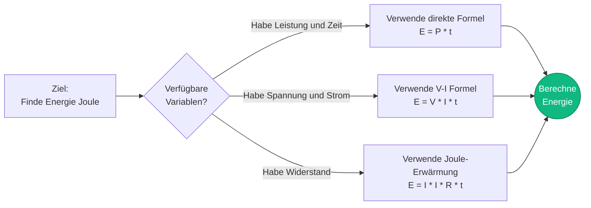
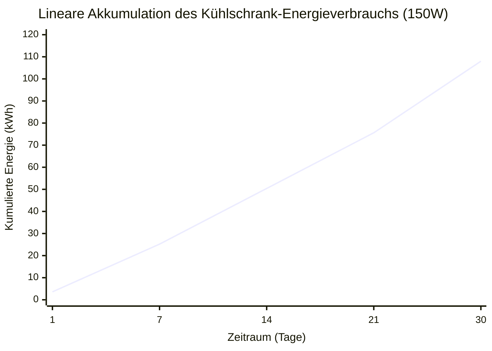
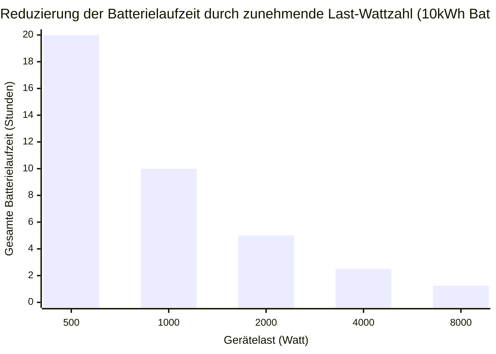
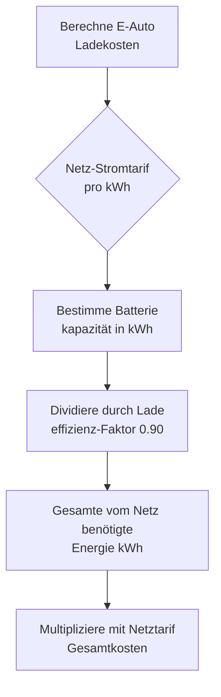
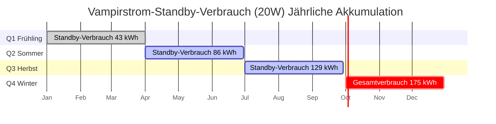

# Der definitive Rechner für elektrische Energie: kWh, Batterielaufzeiten und E-Auto-Laden entmystifiziert

Willkommen beim ultimativen **Rechner für elektrische Energie** und umfassenden Physik-Leitfaden. Egal, ob Sie ein strenges Energie-Audit für Haushaltsgeräte durchführen, um Ihre monatlichen Stromrechnungen zu senken, eine netzunabhängige Solarbatteriebank dimensionieren, um einen massiven Wintersturm zu überstehen, oder mathematisch die genauen Kosten pro Meile für das Aufladen Ihres neuen Elektrofahrzeugs berechnen möchten – diese interaktive Suite bietet genau die thermodynamischen Ableitungen, die Sie benötigen.

Elektrische Energie ist das ultimative Gut der modernen Welt. Während die Leistung (Watt) die momentane Rate der elektrischen Muskelkraft ist, ist die Energie (Joule oder Kilowattstunden) das akkumulierte Volumen dieser Muskelkraft, die im Laufe der Zeit Arbeit verrichtet. Es ist die Metrik, die Ihnen die Versorgungsunternehmen in Rechnung stellen, die Metrik, die vorschreibt, wie weit Ihr Tesla fahren kann, und die Metrik, die bestimmt, ob Ihr Handy-Akku mittags leer ist.

In diesem erschöpfenden SEO-Leitfaden mit über 4.000 Wörtern werden wir die Physik der elektrischen Energie aggressiv dekonstruieren, die mathematischen Grenzen von $E = P \cdot t$ erforschen, den Albtraum der gestaffelten Stromtarife entschlüsseln, die Entladetiefe (DoD) von Deep-Cycle-Batterien analysieren und fünf detaillierte elektrische Szenarien aufschlüsseln, die visuell durch interaktive, parser-sichere Mermaid.js-Diagramme dargestellt werden.

---

## 1. Was genau ist elektrische Energie? (Die physikalische Definition)

**Elektrische Energie**, wissenschaftlich in **Joule ($J$)** gemessen, stellt die gesamte kumulative Arbeit dar, die durch einen Stromkreis über einen bestimmten Zeitraum verrichtet oder als Energie übertragen wird.

Wenn Leistung die Geschwindigkeit Ihres Autos ist, ist Energie die Gesamtdistanz, die Sie zurückgelegt haben.
- **Leistung** = Momentane Rate (Watt)
- **Energie** = Kumuliertes Volumen (Joule oder kWh)

In streng thermodynamischen Begriffen wird $1\text{ Joule}$ definiert als die Arbeit, die durch die Übertragung von $1\text{ Watt}$ Leistung für exakt $1\text{ Sekunde}$ geleistet wird. 
Da ein Joule eine so mikroskopisch kleine Energiemenge ist, stützt sich die Elektroindustrie durchgängig auf die **Kilowattstunde (kWh)**.

$$1\text{ Kilowattstunde (kWh)} = 3.600.000\text{ Joule}$$

Eine Kilowattstunde ist genau das, wonach sie klingt: Der Betrieb von $1.000\text{ Watt}$ an Geräten für exakt $1\text{ Stunde}$.

---

## 2. Ableitung der Energie aus Leistung und Zeit ($E = P \cdot t$)

Die grundlegende Gleichung aller elektrischen Energieberechnungen ist verblüffend einfach:

$$E = P \cdot t$$

Wobei:
- $E$ die Energie in Wattstunden (Wh) ist
- $P$ die Leistung in Watt (W) ist
- $t$ die Zeit in Stunden (h) ist

Um in den Versorgungsstandard kWh umzurechnen, dividieren Sie einfach durch 1.000:
$$\text{kWh} = \frac{\text{Watt} \cdot \text{Stunden}}{1000}$$

Indem wir das Ohmsche Gesetz ($P = V \cdot I$) mathematisch in die Energiegleichung einsetzen, erschließen wir leistungsstarke technische Ableitungen:
1. **Energie abgeleitet aus Spannung und Strom:** $E = V \cdot I \cdot t$
2. **Energie abgeleitet aus Widerstand (Joulesche Wärme):** $E = I^2 \cdot R \cdot t$

---

## 3. Die finanzielle Bedrohung durch Vampir-Standby-Strom

Bei der Überprüfung der Haushaltsenergie ist der gefährlichste Übeltäter selten die Mikrowelle. Es ist der **Standby-Strom** (auch bekannt als Vampirverbrauch).

Moderne Elektronik (Fernseher, Soundbars, Mikrowellenuhren, Laptop-Ladegeräte) schaltet sich nicht wirklich aus. Sie wechseln in einen Standby-Modus und verbrauchen kontinuierlich $2\text{W}$ bis $15\text{W}$ Strom, $24\text{ Stunden}$ am Tag, $365\text{ Tage}$ im Jahr.

**Die Mathematik des Vampirstroms:**
Nehmen wir an, Ihr Entertainment-Center (Fernseher, Kabelbox, Soundsystem) verbraucht im Standby-Modus $20\text{W}$.
- **Tägliche Energie:** $20\text{W} \cdot 24\text{ Stunden} = 480\text{ Wh/Tag} = 0,48\text{ kWh/Tag}$
- **Jährliche Energie:** $0,48\text{ kWh/Tag} \cdot 365 = 175,2\text{ kWh/Jahr}$
- **Jährliche Kosten (bei $0,20/\text{kWh}$):** $175,2 \cdot 0,20 = 35,04\text{ €}$

Sie zahlen jährlich $35,00\text{ €}$, nur um ein rotes LED-Licht an Ihrem Fernseher leuchten zu lassen. In einem gesamten Haushalt kostet Vampirstrom Familien regelmäßig über $150,00\text{ €}$ pro Jahr.

---

## 4. Berechnung der nutzbaren Batterieenergie und Laufzeit

Bei der Dimensionierung einer Backup-Batteriebank können Sie nicht einfach auf das Etikett schauen. Eine „12V 100Ah“-Batterie liefert Ihnen in Wirklichkeit nicht $100\text{Ah}$ an nutzbarer Energie.

### Entladetiefe (Depth of Discharge, DoD)
Verschiedene Batteriechemien zerstören sich physikalisch selbst, wenn Sie sie auf $0\%$ entladen.
- **Blei-Säure (AGM/Gel):** Kann nur sicher bis auf $50\%$ DoD entladen werden.
- **Lithium-Eisenphosphat (LiFePO4):** Kann sicher bis auf $95\%$ DoD entladen werden.

### Die Formel für nutzbare Energie
$$E_{\text{nutzbar}} = V \cdot \text{Kapazität}_{\text{Ah}} \cdot \text{DoD} \cdot \eta_{\text{Wechselrichter}}$$

**Beispiel:**
Sie kaufen eine $12\text{V}$, $100\text{Ah}$ Blei-Säure-Batterie und schließen sie an einen zu $90\%$ effizienten AC-Wechselrichter an.
- $E_{\text{nutzbar}} = 12 \cdot 100 \cdot 0,50 \cdot 0,90 = 540\text{ Wattstunden (Wh)}$

Wenn Sie versuchen, ein $100\text{W}$ Laptop-Ladegerät mit dieser riesigen Batterie zu betreiben, beträgt die Laufzeit ganz einfach:
$$\text{Laufzeit} = \frac{540\text{Wh}}{100\text{W}} = 5,4\text{ Stunden}$$

---

## 5. Ladeenergie und Kosten für Elektrofahrzeuge (E-Autos)

Elektrofahrzeuge werden in kWh Batteriekapazität gemessen, was die Mathematik unglaublich einfach macht.

**Das Szenario:**
Sie fahren ein Tesla Model Y mit einer $75\text{kWh}$ Batterie. Sie fahren mit völlig leerer Batterie ($0\%$) in Ihre Garage. Sie stecken es an Ihr Heimladegerät an. Ihr Stromtarif beträgt $0,15\text{ €}/\text{kWh}$.

Da das AC-zu-DC-Laden nie zu $100\%$ effizient ist (Wärme geht in den Ladekabeln und im internen Gleichrichter des Autos verloren), müssen wir von einer typischen Ladeeffizienz von $90\%$ ausgehen.

- **Vom Netz benötigte Energie:** $75\text{kWh} / 0,90 = 83,3\text{ kWh}$
- **Kosten für eine volle Ladung:** $83,3\text{ kWh} \cdot 0,15\text{ €} = 12,49\text{ €}$

Wenn der Tesla mit einer vollen Ladung $300\text{ Meilen}$ (ca. 482 km) weit kommt, betragen Ihre **Kosten pro Meile**:
$12,49\text{ €} / 300 = 0,041\text{ € pro Meile (4,1 Cent)}.$

---

## 6. Gestaffelte Tarife und Time-of-Use (TOU) Abrechnung

Versorgungsunternehmen berechnen nicht immer einen Pauschalpreis. Sie manipulieren Ihre Rechnung mit zwei aggressiven Strategien, um Energieeinsparungen zu erzwingen:

1. **Gestaffelte Tarife:** Ihnen werden $0,12\text{ €}/\text{kWh}$ für Ihre ersten $500\text{ kWh}$ berechnet. Sobald Sie $501\text{ kWh}$ überschreiten, kostet jede weitere kWh strafende $0,25\text{ €}/\text{kWh}$. Dies bestraft energieintensive Haushalte aggressiv.
2. **Time-of-Use (TOU):** Ihnen werden nachts $0,10\text{ €}/\text{kWh}$ berechnet, aber während der „Spitzenlastzeiten“ von 16:00 bis 21:00 Uhr schießt der Preis auf $0,40\text{ €}/\text{kWh}$ in die Höhe.

---

## 7. Fünf konzeptionelle Ingenieur-Szenarien mit 2D-Visualisierungen

Um die mathematischen Zusammenhänge der elektrischen Energie vollständig zu beherrschen, werden wir fünf verschiedene physikalische Szenarien untersuchen, die anhand von benutzerdefinierten Mermaid.js-Diagrammen visuell aufgeschlüsselt werden.

### Beispiel 1: Ableitungen der Energiegleichung

**Das Szenario:**
Ein Elektrotechnikstudent benötigt eine schnelle Visualisierung, wie sich Energie mathematisch aus Leistung, Spannung, Strom und Widerstand ableiten lässt.

**2D-Visualisierung:**
Dieses Logikflussdiagramm bildet die drei verschiedenen mathematischen Wege zur Berechnung von Wattstunden ab, abhängig von den bekannten Variablen, die in einer Prüfung angegeben sind.

---

### Beispiel 2: Energieakkumulation des Kühlschranks (Linear)

**Das Szenario:**
Ein Hausbesitzer überprüft seinen $150\text{W}$ Kühlschrank. Er möchte sehen, wie sich die Energie von täglichen über wöchentliche bis hin zu monatlichen Gesamtwerten akkumuliert.

**Die Mathematik:**
Bei $150\text{W}$ und 24 Stunden Betrieb pro Tag verbraucht der Kühlschrank genau $3,6\text{ kWh}$ jeden Tag.

**2D-Visualisierung:**
Dieses Diagramm zeigt die perfekt gerade Linie des im Laufe der Zeit kumulierten Energieverbrauchs.

---

### Beispiel 3: Batterielaufzeit vs. Lastanforderung (Inverse Kurve)

**Das Szenario:**
Eine netzunabhängige Hütte verwendet eine massive $10\text{kWh}$ Lithiumbatteriebank. Der Eigentümer möchte wissen, wie lange die Batterie hält, je nachdem, wie viele Geräte er einschaltet.

**Die Mathematik:**
Da $\text{Zeit} = \text{Energie} / \text{Leistung}$ ist, ist die Laufzeit umgekehrt proportional zur Last in Watt.

**2D-Visualisierung:**
Dieses Balkendiagramm veranschaulicht die aggressive inverse Kurve. Eine Verdoppelung der Stromaufnahme halbiert die Laufzeit drastisch.

---

### Beispiel 4: E-Auto-Ladekosten-Logik

**Das Szenario:**
Ein neuer E-Auto-Besitzer muss genau verstehen, wie seine Ladekosten mathematisch aus den Netztarifen und der Batteriekapazität abgeleitet werden.

**2D-Visualisierung:**
Dieses Top-Down-Flussdiagramm kategorisiert streng die Mathematik, die zur Berechnung der genauen Kosten einer vollen E-Auto-Ladung unter Berücksichtigung von Ladeeffizienzverlusten erforderlich ist.

---

### Beispiel 5: Jährliche Kostenakkumulation durch Vampirstrom

**Das Szenario:**
Ein Energieberater verfolgt die erschreckende finanzielle Belastung durch ein $20\text{W}$ Entertainment-Center, das über ein ganzes Jahr im Standby-Modus belassen wird.

**2D-Visualisierung:**
Dieses Gantt-Diagramm skizziert die bittere Realität des Vampirstroms und protokolliert den stetigen, endlosen Stromverbrauch in jeder einzelnen Jahreszeit.

---

## 8. Fazit und Ingenieur-Herausforderung

Die Beherrschung der elektrischen Energie ($E = P \cdot t$) ist der absolute Schlüssel zu Energieunabhängigkeit und finanzieller Effizienz. Das Verständnis des strikten Unterschieds zwischen Watt (momentane Leistung) und Wattstunden (akkumulierte Energie) ermöglicht es Ihnen, netzunabhängige Solaranlagen richtig zu dimensionieren, die Stromrechnungen von Haushalten genau zu überprüfen und den ROI (Return on Investment) eines Upgrades auf LED-Beleuchtung mathematisch nachzuweisen.

Wenn Sie die Physik der Energie respektieren, können Sie Ihre Stromrechnungen drastisch senken und sicherstellen, dass Ihre Batteriebänke die Nacht überstehen. Wenn Sie sie ignorieren, werden Vampirstrom und schwere Geräte still und heimlich Ihren Geldbeutel leeren.

Um sicherzustellen, dass Sie diese Konzepte beherrschen, starten Sie unseren interaktiven Simulator und versuchen Sie, diese abschließenden Herausforderungen zu lösen:
1. **Das Beleuchtungs-Upgrade:** Sie ersetzen fünf $60\text{W}$ Glühbirnen durch fünf $10\text{W}$ LEDs. Sie laufen $8\text{ Stunden}$ am Tag. Berechnen Sie die exakte Energieeinsparung in kWh pro Monat.
2. **Die netzunabhängige Hütte:** Sie müssen einen $200\text{W}$ Kühlschrank $24\text{ Stunden}$ am Stück betreiben. Wenn Sie ein $12\text{V}$ Blei-Säure-Batteriesystem ($50\%$ DoD) haben, berechnen Sie die absolute minimale Amperestunden-(Ah)-Kapazität, die erforderlich ist, um die Nacht zu überstehen.
3. **Der Supercharger:** Ein Tesla-Supercharger pumpt exakt $15\text{ Minuten}$ lang $250\text{kW}$ Leistung in ein Auto. Berechnen Sie die insgesamt gelieferte Energie in kWh.

Verlassen Sie sich auf diesen Rechner, um Ihre Berechnungen doppelt zu überprüfen, Ihre Haushaltsgeräte zu kontrollieren und denken Sie immer daran: Energie ist die akkumulierte Wahrheit der elektrischen Leistung im Laufe der Zeit.
