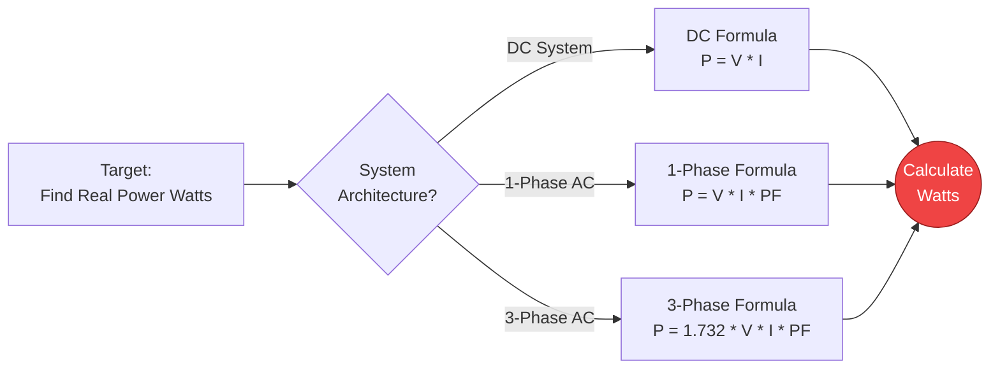
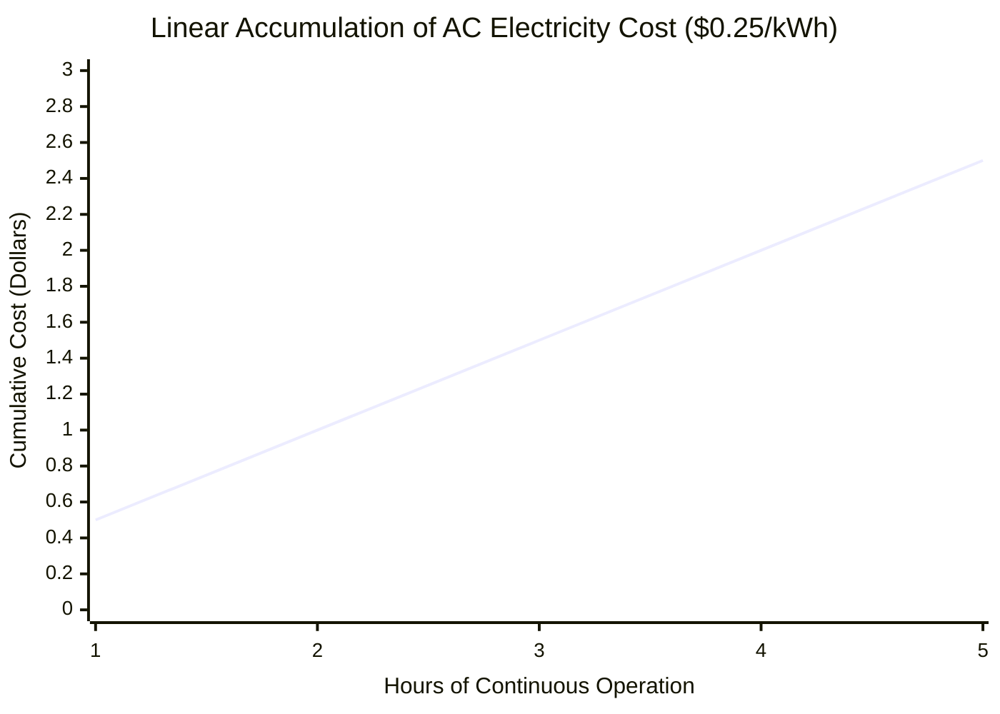
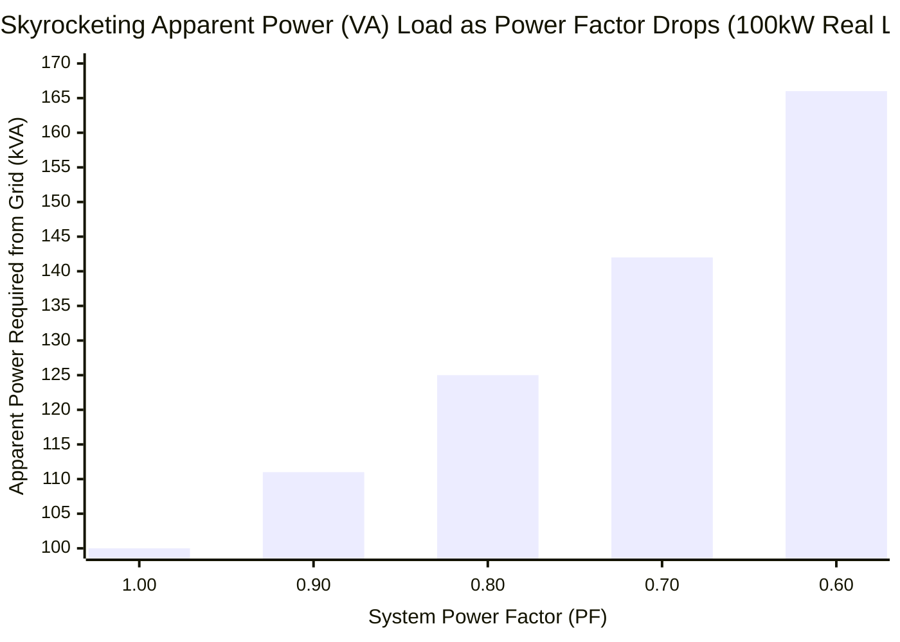
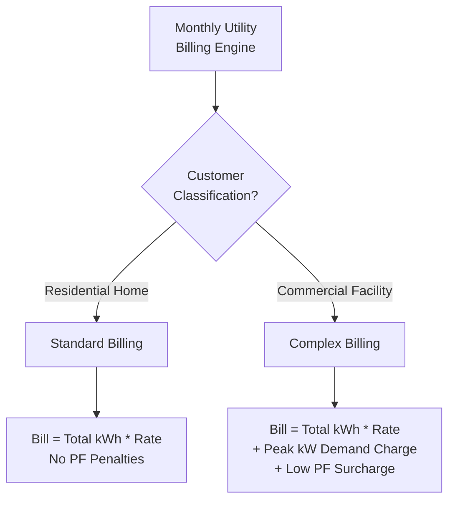

# Der ultimative Rechner für elektrische Leistung: Wirk-, Schein- und Blindleistung entmystifiziert

Willkommen beim ultimativen **Rechner für elektrische Leistung** und umfassenden Physik-Leitfaden. Egal, ob Sie einen riesigen industriellen 3-Phasen-Generator dimensionieren, die erschreckende monatliche Stromrechnung einer alten Klimaanlage berechnen oder verstehen wollen, warum Ihre gewerbliche Anlage wegen eines schlechten Leistungsfaktors bestraft wird, diese interaktive Suite bietet Ihnen die exakte mathematische Klarheit, die Sie benötigen.

Die elektrische Leistung ist die absolute Rate, mit der elektrische Energie Arbeit verrichtet. Während Spannung ($V$) der Druck und Strom ($I$) der Fluss ist, ist Leistung ($P$, gemessen in Watt) die tatsächlich resultierende Muskelkraft. Sie ist die Wärme, die Ihr Heizlüfter abstrahlt, das Drehmoment, das den Motor Ihres Teslas antreibt, und das blendende Licht, das von einer LED ausgeht.

In diesem umfassenden SEO-Leitfaden mit über 4.000 Wörtern werden wir die Physik der Gleichstromleistung (DC Wattzahl), die komplexe Trigonometrie der AC-Leistungsdreiecke, die harte Realität der Blindleistung (VARs) und die Finanzmathematik der Kilowattstunden (kWh)-Abrechnung intensiv aufschlüsseln, komplett mit fünf sorgfältig entworfenen, parser-sicheren Mermaid.js-Diagrammen.

---

## 1. Was genau ist elektrische Leistung? (Die physikalische Definition)

**Elektrische Leistung**, wissenschaftlich gemessen in **Watt ($W$)**, ist die grundlegende Rate, mit der elektrische Energie pro Sekunde übertragen, verbraucht oder von einem Stromkreis abgebaut wird. 

In streng thermodynamischen Begriffen ist $1\text{ Watt}$ definiert als die Übertragung von exakt $1\text{ Joule}$ Energie pro Sekunde. 
- Wenn Sie eine $100\text{W}$-Glühbirne genau 1 Sekunde lang eingeschaltet lassen, verbraucht sie $100\text{ Joule}$ Energie.
- Wenn Sie sie eine Stunde lang eingeschaltet lassen ($3.600\text{ Sekunden}$), verbraucht sie $360.000\text{ Joule}$. (Das ist der Grund, warum wir in kWh abrechnen, da Joule sehr schnell astronomisch groß werden!)

Um die bloße Leistung eines einfachen elektrischen Bauteils zu ermitteln, multiplizieren Sie einfach den elektrischen Druck (Spannung), der an ihm anliegt, mit dem Volumen der Elektronen (Strom), die durch es hindurchfließen:
$$P = V \cdot I$$

---

## 2. Ableitung der Leistung mit dem Ohmschen Gesetz

Das Ohmsche Gesetz ($V = I \cdot R$) ermöglicht es uns, mathematisch Variablen in der Leistungsgleichung zu ersetzen, was uns zwei unglaublich nützliche Abkürzungen für Ingenieure gibt:

1. **Leistung abgeleitet aus Strom und Widerstand:** $P = I^2 \cdot R$
   - Diese Formel repräsentiert die **Joulesche Erwärmung** (oder $I^2R$ Kupferverluste). Dies ist die Formel, die Versorgungsunternehmen verwenden, um zu berechnen, wie viel Leistung als reine Wärme entlang von Hunderten von Kilometern von Übertragungsleitungen verschwendet wird.
2. **Leistung abgeleitet aus Spannung und Widerstand:** $P = \frac{V^2}{R}$
   - Diese Formel wird von Geräteentwicklern verwendet. Da die Netzspannung immer fest bei $120\text{V}$ (oder $230\text{V}$) liegt, kann ein Ingenieur genau berechnen, wie viele Ohm Heizspirale zugeschnitten werden müssen, um einen Toaster mit $1.500\text{W}$ herzustellen.

---

## 3. Der Albtraum der Wechselstromleistung: Das Leistungsdreieck

In DC-Stromkreisen (Gleichstrom) ist Leistung einfache Mathematik. $P = V \cdot I$. Ende der Geschichte.

In AC-Stromkreisen (Wechselstrom) oszillieren Spannung und Strom ständig in einer Sinuswelle. Wenn der Stromkreis Induktivitäten (Motoren, Transformatoren) oder Kapazitäten enthält, wird die Strom-Sinuswelle physikalisch verzögert oder nach vorne geschoben und gerät aus dem Takt mit der Spannungs-Sinuswelle. Dies erzeugt ein gefürchtetes technisches Phänomen namens **Phasenverschiebung**, aus dem das AC-Leistungsdreieck hervorgeht.

### Wirkleistung ($P$, gemessen in Watt)
Dies ist die tatsächliche, physische Leistung, die nützliche Arbeit verrichtet. Es ist die Wärme im Toaster und das Drehmoment im Motor. Sie wird berechnet, indem man die bloße Leistung nimmt und mit dem Leistungsfaktor (dem Kosinus des Phasenverschiebungswinkels) multipliziert.
- **Formel:** $P = V \cdot I \cdot \cos\phi$

### Scheinleistung ($S$, gemessen in Voltampere oder VA)
Dies ist die gesamte, rohe Leistung, die das Versorgungsunternehmen erzeugen und durch die Leitungen drücken muss, um Ihre Anlage zu versorgen. Sie ignoriert die Phasenverschiebung völlig.
- **Formel:** $S = V \cdot I$

### Blindleistung ($Q$, gemessen in VARs)
Dies ist die "Phantomleistung". Es ist Leistung, die zwischen den Magnetfeldern Ihrer Motoren und dem Stromnetz hin- und heroszilliert. Sie verrichtet absolut KEINE nützliche Arbeit, verstopft aber die Stromleitungen völlig und verursacht extreme Wärme und Ineffizienz.
- **Formel:** $Q = V \cdot I \cdot \sin\phi$

---

## 4. Leistungsfaktor ($\text{PF}$) und Strafen der Versorgungsunternehmen

**Der Leistungsfaktor ($\text{PF}$)** ist das strikte Verhältnis von Wirkleistung (nützliche Arbeit) zu Scheinleistung (gesamte Netzlast).

$$\text{PF} = \frac{\text{Wirkleistung (W)}}{\text{Scheinleistung (VA)}}$$

- **$\text{PF} = 1,0$ (Perfekt):** Eine rein ohmsche Last wie ein Heizlüfter. $100\%$ der aus dem Netz bezogenen Leistung wird in Wärme umgewandelt.
- **$\text{PF} = 0,70$ (Schrecklich):** Eine riesige industrielle Motoranlage. Nur $70\%$ der Leistung verrichtet physische Arbeit. Die restlichen $30\%$ sind nutzlose Blindleistung, die heftig über die Versorgungsleitungen hin- und herschwappt.

Da Blindleistung das Netz verstopft und Transformatoren durchbrennen lässt, überwachen Versorgungsunternehmen aktiv die Leistungsfaktoren von Unternehmen. Wenn Ihre Fabrik unter $\text{PF} 0,85$ fällt, wird Sie der Versorger mit verheerenden **Strafzuschlägen für den Leistungsfaktor** auf Ihrer monatlichen Rechnung belasten.

Um dies zu beheben, installieren Fabriken riesige Gestelle von **Kondensatoren zur Blindleistungskompensation** (PFC), um Blindleistung lokal einzuspeisen und sie so vom Versorgungsnetz fernzuhalten.

---

## 5. 3-Phasen-Wechselstrom (Drehstrom) ($1,732$)

Für riesige industrielle Lasten ist Einphasenstrom unzureichend. Die Welt läuft mit 3-Phasen-Wechselstrom (Drehstrom), bei dem drei separate Sinuswellen gleichzeitig übertragen werden, versetzt um jeweils $120^\circ$. 

Da sich die drei Phasen überlappen, liefern sie eine mathematisch konstante, glatte Leistung ohne jegliche Lücken. Um die Wirkleistung eines symmetrischen 3-Phasensystems zu berechnen, müssen wir mit der Quadratwurzel aus 3 multiplizieren ($\sqrt{3} \approx 1,732$).

**Formel für 3-Phasen-Wirkleistung:**
$$P = \sqrt{3} \cdot V_{\text{line}} \cdot I_{\text{line}} \cdot \text{PF}$$

Wenn Sie einen $480\text{V}$-Drehstrommotor haben, der $50\text{A}$ bei einem $\text{PF}$ von 0,85 zieht:
$P = 1,732 \cdot 480 \cdot 50 \cdot 0,85 = 35.332\text{ W}$ ($35,3\text{ kW}$).

---

## 6. Verständnis von Kilowattstunden (kWh) und der Stromabrechnung

Ihr Versorgungsunternehmen berechnet Ihnen keine Watt (Leistung). Sie stellen Ihnen **Kilowattstunden (Energie)** in Rechnung.

Eine Kilowattstunde (kWh) bedeutet einfach den Betrieb von Geräten mit $1.000\text{ Watt}$ für genau $1\text{ Stunde}$.

### Die kWh-Formel:
$$\text{kWh} = \frac{\text{Watt} \cdot \text{Stunden}}{1000}$$

**Beispiel:**
Wenn Sie einen Heizlüfter mit $1.500\text{W}$ täglich für $12\text{ Stunden}$ laufen lassen, wie viel kostet dies in einem 30-Tage-Monat, wenn Ihr Stromtarif $0,15 €$ pro kWh beträgt?

1. **Berechnung der täglichen kWh:** $\frac{1500 \cdot 12}{1000} = 18\text{ kWh/Tag}$
2. **Berechnung der monatlichen kWh:** $18 \cdot 30 = 540\text{ kWh/Monat}$
3. **Kosten berechnen:** $540 \cdot 0,15 € = 81,00 €$

Dieser einzige Heizlüfter kostet Sie **$81,00 €$ in jedem einzelnen Monat!**

---

## 7. Fünf konzeptionelle technische Szenarien mit 2D-Visualisierungen

Um die mathematischen Beziehungen der elektrischen Leistung vollständig zu beherrschen, werden wir fünf verschiedene physikalische Szenarien untersuchen, die mithilfe von benutzerdefinierten Mermaid.js-Diagrammen visuell aufgeschlüsselt werden.

### Beispiel 1: Die Topologie der Leistungsgleichung

**Das Szenario:**
Ein Elektrotechnikstudent benötigt eine schnelle Visualisierung, wie die Wattzahl über DC-, Einphasen- und Dreiphasensysteme hinweg berechnet wird.

**2D-Visualisierung:**
Dieses logische Flussdiagramm kartiert die drei unterschiedlichen mathematischen Pfade zur Berechnung von Watt in Abhängigkeit von der elektrischen Architektur.

---

### Beispiel 2: Kumulierung der Energiekosten für Haushaltsgeräte

**Das Szenario:**
Ein Hausbesitzer möchte genau sehen, wie schnell eine $2000\text{W}$-Klimaanlage über einen Zeitraum von 5 Stunden bei einem exorbitanten Tarif von $0,25 €$ pro kWh seinen Geldbeutel leert.

**Die Mathematik:**
Bei $2000\text{W}$ verbraucht die Klimaanlage jede Stunde exakt $2\text{ kWh}$. Bei $0,25 €/\text{kWh}$ sind das $0,50 €$ pro Stunde, was perfekt linear skaliert.

**2D-Visualisierung:**
Dieses Diagramm zeigt die perfekt gerade Linie der finanziellen Kosten, die sich Stunde für Stunde ansammeln.

---

### Beispiel 3: Die Bedrohung durch einen schlechten Leistungsfaktor

**Das Szenario:**
Ein Fabrikleiter bezieht $100\text{kW}$ an Wirkleistung. Er möchte sehen, wie die Scheinleistung (VA)-Netzlast in die Höhe schießt, wenn der Leistungsfaktor (Effizienz) schlechter wird.

**Die Mathematik:**
Da $\text{PF} = P / S$ ist, steigt die Scheinleistung ($S$), die benötigt wird, um die exakt gleiche Menge an Arbeit zu verrichten, drastisch an, je weiter $\text{PF}$ abfällt.

**2D-Visualisierung:**
Dieses Balkendiagramm demonstriert die aggressive umgekehrte Beziehung. Obwohl die Fabrik nur $100\text{kW}$ an tatsächlicher Arbeit leistet, muss das Netz bei einem $\text{PF}$ von 0,60 gefährlicherweise $166\text{kVA}$ Strom liefern, um die Magnetfelder zu unterstützen!

---

### Beispiel 4: Abrechnungslogik von Versorgern für Wohn- vs. Gewerbegebäude

**Das Szenario:**
Ein Geschäftsinhaber versteht nicht, warum die Stromrechnung seines Lagers mathematisch anders ist als die seines Hauses, obwohl beide die gleiche Gesamtzahl an kWh verbraucht haben.

**2D-Visualisierung:**
Dieses Top-Down-Flussdiagramm kategorisiert die harte Realität der gewerblichen Abrechnung, die Leistungspreise (Spitzen-kW) und PF-Zuschläge einführt, gegen die Wohnhäuser völlig immun sind.

---

### Beispiel 5: Anlauf des Solarwechselrichters und Netzsynchronisierung

**Das Szenario:**
Eine 10kW-Solaranlage auf einem Wohnhaus "wacht" am Morgen auf. Der Gleichstrom muss sicher in Wechselstrom umgewandelt, mit dem chaotischen 60Hz-Versorgungsnetz synchronisiert und perfekt eingespeist werden, ohne einen Kurzschluss zu verursachen.

**2D-Visualisierung:**
Dieses Gantt-Diagramm skizziert die strenge, hochautomatisierte Synchronisierungssequenz, die ein moderner netzgekoppelter Wechselrichter ausführen muss, bevor Solar-Watt in das Haus fließen dürfen.

```mermaid
gantt
    title Solar Inverter Wake-Up and Grid Sync Sequence
    dateFormat  HH:mm:ss
    axisFormat  %H:%M:%S
    
    section DC Boot
    Detect Sufficient Solar MPPT Voltage :done, 00:00:00, 15s
    Boot Internal CPU and Diagnostics :active, 00:00:15, 15s
    
    section AC Sync
    Sample Grid Voltage and Frequency :active, 00:00:30, 10s
    Phase Lock Loop Sync to 60Hz :crit, 00:00:40, 10s
    
    section Export
    Close AC Relays :active, 00:00:50, 05s
    Ramp Up AC Watt Export :milestone, 00:00:55, 0s
```

---

## 8. Fazit und technische Herausforderung

Die Beherrschung der elektrischen Leistung unterscheidet Bastler von wahren Elektroingenieuren. Zu verstehen, dass Watt die Arbeit leisten, VARs die Magnetfelder aufbauen und VA das ist, was die Drähte zum Schmelzen bringt, ist der absolute Schlüssel zur Gestaltung einer sicheren, hocheffizienten elektrischen Infrastruktur.

Wenn Sie das Leistungsdreieck respektieren und Ihren Leistungsfaktor aktiv korrigieren, werden Ihre Industrieanlagen perfekt kühl laufen und Ihre Stromrechnungen drastisch sinken. Wenn Sie die Blindleistung unterschätzen, werden Ihre Transformatoren heftig überhitzen, Ihre Schutzschalter werden auslösen und Sie werden vom Stromnetz finanziell bestraft.

Um zu garantieren, dass Sie diese Konzepte beherrschen, starten Sie unseren interaktiven Simulator und versuchen Sie, diese letzten Herausforderungen zu lösen:
1. **Das Server-Rack:** Eine riesige Krypto-Mining-Anlage zieht kontinuierlich $30\text{A}$ bei $240\text{V}$ DC. Berechnen Sie die exakte Gleichstromleistung ($P = V \cdot I$) in kW.
2. **Die Strafzone:** Ein kommerzieller Motor bezieht $50\text{kW}$ Wirkleistung, aber der Leistungsfaktor beträgt miserable 0,65. Berechnen Sie die erschreckende Scheinleistung ($S = P / \text{PF}$) in kVA, die das Netz bereitstellen muss.
3. **Der Vampir-Verbrauch:** Ihr massiver 85-Zoll-Fernseher verbraucht im Standby-Modus *im ausgeschalteten Zustand* $15\text{W}$ Leistung. Wenn Strom $0,20 €/\text{kWh}$ kostet, berechnen Sie genau, wie viel Geld Sie pro Jahr (8.760 Stunden) verbrennen, nur weil er eingesteckt bleibt.

Verlassen Sie sich auf diesen Rechner, um Ihre Berechnungen zu überprüfen, Ihre Leistungsdreiecke sofort darzustellen und denken Sie immer daran: Leistung ist das ultimative Maß für thermodynamische Wahrheit in der elektrischen Welt.
