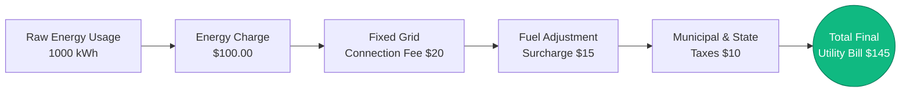
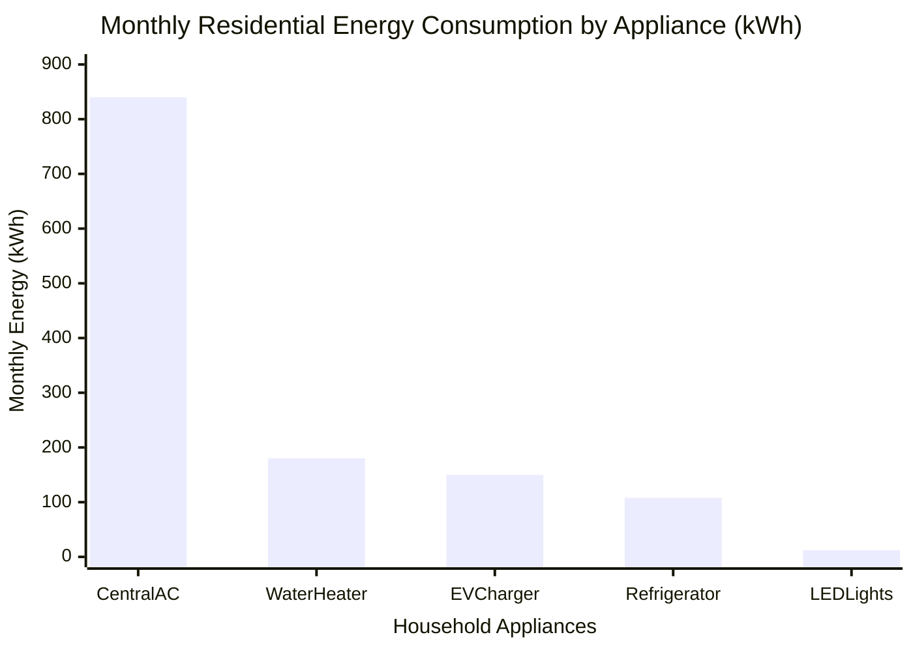
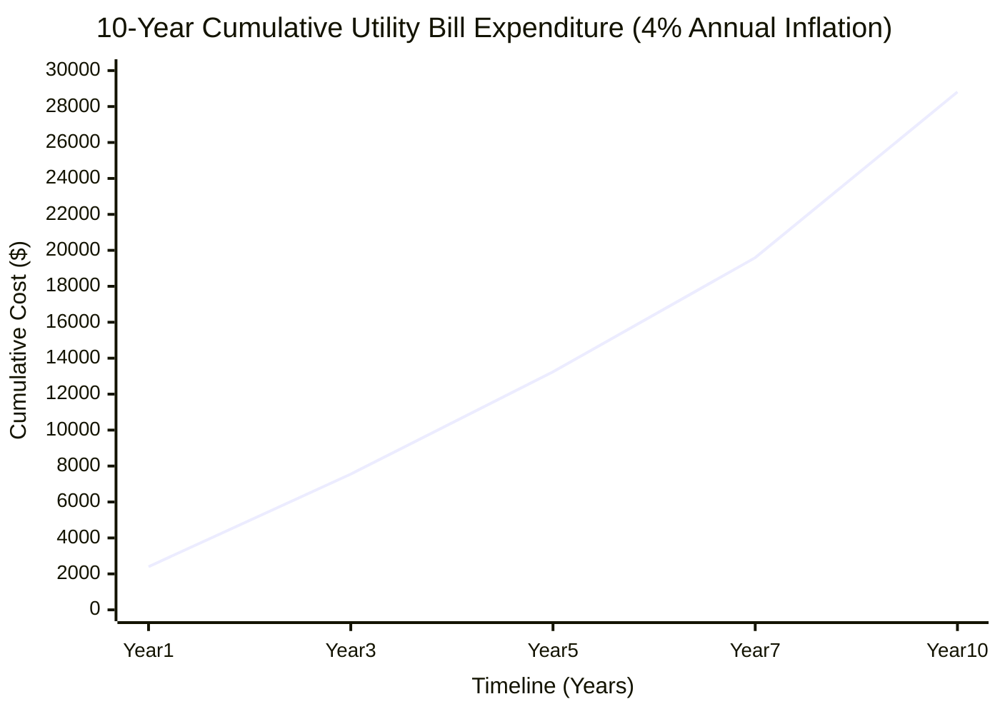
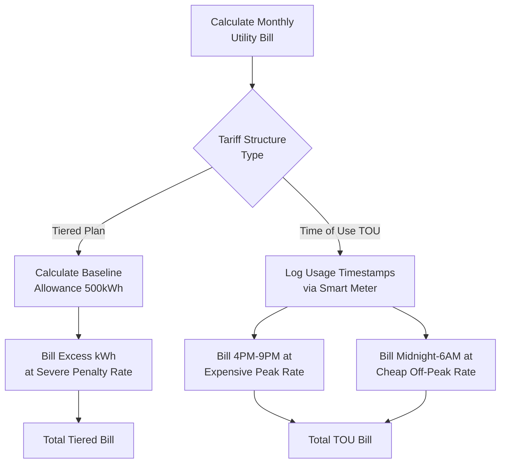
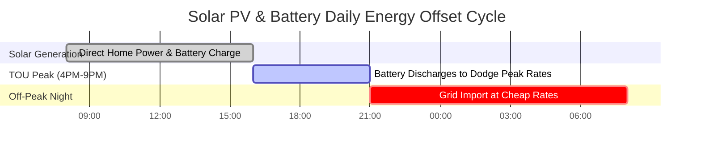

# Der ultimative Stromkostenrechner: Stromrechnungen, Tarife und Geräte-Energieaudits

Willkommen beim ultimativen **Stromkostenrechner** und umfassenden Leitfaden zur Verwaltung von Stromrechnungen. Egal, ob Sie ein Hauseigentümer sind, der verzweifelt herausfinden möchte, warum seine sommerliche Klimaanlagenrechnung auf $\$400$ in die Höhe geschossen ist, ein gewerblicher Facility Manager, der versucht, strafenden Leistungsgebühren ($/kW) mathematisch auszuweichen, oder ein zukünftiger Besitzer eines Elektroautos (EV), der genau berechnet, wie sehr das Laden zu Hause sein Benzinbudget entlasten wird – die Beherrschung der Thermodynamik und der finanziellen Algorithmen der Stromkosten ist obligatorisch.

Ihre monatliche Stromrechnung ist nicht nur eine einzelne, einfache Zahl. Es handelt sich um einen komplexen, aggressiv strukturierten Algorithmus, der von Versorgungsunternehmen entwickelt wurde, um den Umsatz zu maximieren und gleichzeitig die Verbraucher zu zwingen, während der Spitzenlastzeiten Energie zu sparen. Er mischt reinen Stromverbrauch (Kilowattstunden), harte Multiplikatoren für die Nutzungszeit (TOU), unausweichliche feste Servicegebühren und brutale Brennstoffanpassungszuschläge.

In dieser ausführlichen, über 4.000 Wörter umfassenden SEO-Meisterklasse werden wir die grundlegende $kWh \times \text{Tarif}$-Gleichung dekonstruieren, die erschreckende Realität gestaffelter Abrechnungsstrukturen mathematisch entschlüsseln, den finanziellen Aderlass durch Vampir-Standby-Leistung aufdecken und 10-Jahres-Kosten für Versorgungsunternehmen unter Verwendung realistischer Inflationsraten prognostizieren. Um sicherzustellen, dass Sie diese finanziellen Konzepte vollständig begreifen, haben wir fünf akribisch detaillierte, Parser-sichere interaktive Mermaid.js-Diagramme entwickelt.

---

## 1. Die Dekonstruktion der Stromrechnungsformel

Die absolute Grundlage der Stromkosten ist die **Kilowattstunde (kWh)**. Versorgungsunternehmen berechnen Ihnen nicht die momentane Leistung (Watt); sie berechnen Ihnen die *Ansammlung* dieser Leistung über die Zeit (Energie).

**Die grundlegende Formel:**
$$\text{Kosten} = \text{Gesamtenergie (kWh)} \times \text{Tarif (\$/kWh)}$$

Um die Kosten für ein einzelnes Gerät zu berechnen, müssen Sie zunächst dessen Energieverbrauch ermitteln:
$$\text{Energie (kWh)} = \frac{\text{Leistung (Watt)} \times \text{Zeit (Stunden)}}{1000}$$

Die endgültige Rechnung, die Sie per Post erhalten, ist jedoch wesentlich komplexer.

**Die wahre Gesamtrechnungs-Gleichung:**
$$\text{Gesamtrechnung} = (\text{Energie kWh} \times \text{Tarif}) + \text{Feste Servicegebühr} + \text{Leistungsgebühr} + \text{Steuern}$$

Wenn Sie $1000\text{ kWh}$ zu $\$0,15/\text{kWh}$ verbrauchen, beträgt Ihre Energiegebühr $\$150,00$. Sobald das Versorgungsunternehmen jedoch eine Netzanschlussgebühr von $\$20,00$, einen Brennstoffzuschlag von $\$15,00$ und $8\%$ Gemeindesteuern hinzufügt, steigt Ihre Gesamtrechnung auf $\$199,80$. Dies führt zu einem **Effektiven Tarif** von $\$0,20/\text{kWh}$ – dies ist die wahre Zahl, die Sie bei der Berechnung der Gerätekosten verwenden müssen.

---

## 2. Die großen Drei: Das Verständnis der Tarifstrukturen von Versorgungsunternehmen

Versorgungsmonopole nutzen drei primäre Abrechnungsstrukturen, um Privat- und Geschäftskunden Gebühren in Rechnung zu stellen.

### A. Pauschalabrechnung
Die einfachste, aber zunehmend seltener werdende Tarifstruktur. Jede einzelne verbrauchte Kilowattstunde, egal ob Tag oder Nacht, kostet exakt den gleichen Betrag. 
*Beispiel: $\$0,16$ pro kWh, rund um die Uhr (24/7).*

### B. Gestaffelte (Block-) Tarife
Eine bestrafende Struktur, die darauf ausgelegt ist, Haushalte mit hohem Energieverbrauch brutal zu sanktionieren. Das Versorgungsunternehmen gewährt Ihnen einen "Grundfreibetrag" zu einem günstigen Tarif. Sobald Sie diese Grenze überschreiten, schießt der Preis in die Höhe.
*Beispiel:* 
- Stufe 1: $0 \to 500\text{ kWh}$ kostet $\$0,12/\text{kWh}$.
- Stufe 2: $501 \to 1000\text{ kWh}$ kostet $\$0,22/\text{kWh}$.
- Stufe 3: $1001+\text{ kWh}$ kostet $\$0,35/\text{kWh}$.

Wenn Sie eine starke Klimaanlage betreiben und Ihr Haus in Stufe 3 bringen, kostet jede zusätzliche Stunde Klimaanlage fast das Dreifache des Grundtarifs.

### C. Nutzungszeitabhängige (TOU) Preisgestaltung
Der moderne Standard für Smart-Meter-Netze. Das Versorgungsunternehmen berechnet Ihnen Gebühren basierend darauf, *wann* Sie den Strom verbrauchen, nicht nur wie viel.
- **Nebenzeit (Mitternacht bis 6 Uhr morgens):** $\$0,08/\text{kWh}$ (Perfekt zum Laden von Elektroautos).
- **Mittelzeit (Morgens):** $\$0,15/\text{kWh}$.
- **Spitzenzeit (16:00 bis 21:00 Uhr):** $\$0,45/\text{kWh}$ (Das Stromnetz wird durch heimkehrende Pendler belastet).

Unter einem TOU-Tarif ist der Betrieb Ihres elektrischen Wäschetrockners um 18:00 Uhr finanzieller Selbstmord.

---

## 3. Das Geräte-Energieaudit: Die Stromfresser finden

Um Ihre Stromrechnung zu senken, müssen Sie Ihre Haushaltsgeräte schonungslos überprüfen. Nicht alle Geräte sind gleich. 

### Die schweren Stromfresser (Heizen und Kühlen)
Jedes Gerät, das die Temperatur verändert (Klimaanlagen, Raumheizgeräte, Elektroöfen, Warmwasserbereiter, Wäschetrockner), verbraucht massive Mengen an Strom. 
- Eine zentrale Klimaanlage zieht etwa $3500\text{ Watt}$. Ein Betrieb von $8\text{ Stunden}$ verbraucht $28\text{ kWh}$ pro Tag. Bei $\$0,15/\text{kWh}$ sind das $\$4,20$ jeden einzelnen Tag oder $\$126,00$ im Monat.

### Der lautlose Aderlass (Vampir-Strom/Standby)
Moderne Elektronik (Fernseher, Soundbars, Spielekonsolen) schaltet sich nie wirklich aus. Sie wechseln in den "Standby-Modus" und ziehen ständig $10\text{W}$ bis $20\text{W}$.
- Ein $20\text{W}$ Entertainment-Center, das rund um die Uhr im Standby-Modus bleibt, verbraucht $14,4\text{ kWh}$ pro Monat. Über ein Jahr hinweg kostet Sie das $\$26,00$, nur um eine rote LED-Leuchte leuchten zu lassen.

### Die Effizienzhelden (LED-Beleuchtung)
Eine herkömmliche Glühbirne verbraucht $60\text{ Watt}$. Eine gleichwertige LED-Lampe verbraucht $9\text{ Watt}$. Wenn Sie 10 Glühbirnen austauschen, die 6 Stunden am Tag brennen, sparen Sie rund $90\text{ kWh}$ im Monat und senken Ihre Rechnung sofort um $\$13,50$.

---

## 4. Ladekosten für Elektroautos (EV) zu Hause

Benzin ist teuer; Elektronen sind billig. Aber wie billig?

Um die Kosten für eine vollständige EV-Ladung zu berechnen, benötigen Sie die Batteriekapazität und den Wirkungsgrad des Netzes (da bei der AC/DC-Wandlung etwa 10 % als Wärme verloren gehen).
$$\text{Ladekosten} = \frac{\text{Batterie-kWh}}{\text{Effizienz 0,90}} \times \text{Tarif}$$

Für ein Tesla Model Y ($75\text{kWh}$ Batterie), das zu einem Pauschaltarif von $\$0,15/\text{kWh}$ lädt:
- Benötigte Netzenergie: $75 / 0,90 = 83,3\text{ kWh}$
- Gesamtkosten: $83,3 \times 0,15 = \$12,49$ für einen vollen "Tank".

Wenn dieser Tesla mit einer vollen Ladung $300\text{ Meilen}$ weit fährt, betragen Ihre **Kosten pro Meile** mikroskopisch kleine $\$0,04$ (4 Cent). Vergleichen Sie das mit einem $25\text{ MPG}$-Benzinauto bei $\$3,50/\text{Gallone}$, das $\$0,14$ pro Meile kostet.

---

## 5. Zehnjahresprognosen und Versorgungs-Inflation

Strompreise sinken nie. Historisch gesehen steigen sie aufgrund von Netzwerkwartung, Brennstoffkosten und Inflation um durchschnittlich $3\%$ bis $4\%$ pro Jahr.

Wenn Ihre aktuelle monatliche Stromrechnung $\$200$ ( $\$2.400$/Jahr ) beträgt und Ihr Versorgungsunternehmen die Tarife jährlich um $4\%$ anhebt:
- Jahr 1: $\$2.400$
- Jahr 5: $\$2.807$
- Jahr 10: $\$3.415$

Über einen Zeitraum von 10 Jahren zahlen Sie dem Versorgungsunternehmen atemberaubende **$\$28.814$**. Diese erschreckende Mathematik ist genau der Grund, warum Hauseigentümer $\$15.000$ in Solar-PV-Anlagen investieren, um ihre Energiekosten festzuschreiben und die Inflationskurve zu eliminieren.

---

## 6. Fünf konzeptionelle Engineering-Szenarien mit 2D-Visualisierungen

Um die finanziellen Algorithmen der Stromabrechnung vollständig zu beherrschen, werden wir fünf verschiedene Szenarien untersuchen, die mithilfe benutzerdefinierter Mermaid.js-Diagramme visuell aufgeschlüsselt werden.

### Beispiel 1: Die Anatomie einer Stromrechnung

**Das Szenario:**
Ein Hausbesitzer ist verwirrt, warum seine Energieberechnung ($1000\text{ kWh} \times \$0,10$) gleich $\$100$ ist, seine tatsächliche Rechnung aber $\$145$ beträgt. 

**2D-Visualisierung:**
Dieses Logik-Flussdiagramm dekonstruiert die versteckten Gebühren und Steuern, die Versorgungsunternehmen auf den reinen Energieverbrauch aufschlagen, um die Endabrechnung zu erstellen.

---

### Beispiel 2: Die Stromfresser unter den Haushaltsgeräten

**Das Szenario:**
Ein Energieberater schlüsselt die massive monatliche Rechnung eines Hauses in Höhe von $\$300$ auf, um den Besitzern genau zu zeigen, welche Geräte ihren Geldbeutel leeren.

**Die Mathematik:**
HLK-Systeme und Warmwasserbereiter dominieren universell den Stromverbrauch in Privathaushalten, während moderne Elektronik kaum ins Gewicht fällt.

**2D-Visualisierung:**
Dieses Balkendiagramm ordnet die Top 5 der Haushaltsgeräte aggressiv nach ihrem monatlichen kWh-Verbrauch und deckt die wahren Übeltäter für hohe Rechnungen auf.

---

### Beispiel 3: 10-Jahres-Kumulativkosten (Mit 4% Inflation)

**Das Szenario:**
Ein Solarverkäufer demonstriert die brutale Realität einer Stromrechnung von $\$200$/Monat, die sich über ein Jahrzehnt mit einer jährlichen Versorgungs-Inflation von $4\%$ summiert.

**Die Mathematik:**
Zinseszins arbeitet gegen den Verbraucher. $2400 \times (1,04)^n$ führt zu einer exponentiellen, unvermeidbaren Ausgabenkurve.

**2D-Visualisierung:**
Dieses Diagramm stellt die erschreckenden kumulativen Dollarbeträge dar, die über einen Zeitraum von 10 Jahren an das Versorgungsunternehmen übergeben werden.

---

### Beispiel 4: Gestaffelte Abrechnung vs. Time-of-Use (TOU) Logik

**Das Szenario:**
Ein Kunde entscheidet, ob er in seinem Standard-Staffeltarif bleiben oder zu einem modernen nutzungszeitabhängigen (TOU) Tarif wechseln soll, um sein Elektroauto nachts zu laden.

**2D-Visualisierung:**
Dieses Top-Down-Flussdiagramm bildet die strenge algorithmische Logik ab, die das Versorgungsunternehmen verwendet, um dem Kunden unter beiden konkurrierenden Tarifstrukturen Rechnungen zu stellen.

---

### Beispiel 5: Solar-PV- und Batterie-Netzausgleichszyklus

**Das Szenario:**
Ein Hauseigentümer installiert eine $10\text{kW}$-Solaranlage und eine Tesla Powerwall. Sie müssen visualisieren, wie das System den TOU-Spitzenpreisen ausweicht und Netzimporte ausgleicht.

**2D-Visualisierung:**
Dieses Gantt-Diagramm skizziert den täglichen 24-Stunden-Zyklus der Energieerzeugung, der Batterieentladung während der Spitzenzeiten und der Netzabhängigkeit nur während der günstigen Nebenzeiten (Nacht).

---

## 7. Fazit und finanzielle Herausforderung

Die Berechnung der Stromkosten zu beherrschen, ist der absolute Schlüssel zur finanziellen Effizienz und zur Haushaltsplanung. Den Unterschied zwischen reinen kWh-Tarifen und dem effektiven Tarif zu verstehen, den Strafgebühren für Spitzenzeiten (TOU) auszuweichen, Vampir-Standby-Strom aufzuspüren und die sich aufbauende Bedrohung durch die Inflation der Versorgungsunternehmen zu erkennen, wird Ihnen im Laufe eines Jahrzehnts Zehntausende von Dollar sparen.

Wenn Sie Ihre Rechnung jeden Monat blindlings bezahlen, ohne die Mathematik dahinter zu verstehen, wird das Versorgungsunternehmen seinen Umsatz aggressiv auf Ihre Kosten maximieren.

Um zu garantieren, dass Sie diese finanziellen Konzepte beherrschen, starten Sie unseren interaktiven Simulator und versuchen Sie, diese letzten Herausforderungen zu lösen:
1. **Die Stufenstrafe:** Sie verbrauchen diesen Monat $1200\text{ kWh}$. Stufe 1 ($0-500\text{ kWh}$) kostet $\$0,10$. Stufe 2 ($501-1000\text{ kWh}$) kostet $\$0,20$. Stufe 3 ($1001+\text{ kWh}$) kostet $\$0,35$. Berechnen Sie die exakte gesamte Energiegebühr.
2. **Der effektive Tarif:** Ihre Energiegebühr beträgt $\$120,00$ für $800\text{ kWh}$. Das Versorgungsunternehmen fügt eine Anschlussgebühr von $\$25,00$ und Steuern in Höhe von $\$15,00$ hinzu. Berechnen Sie Ihren wahren effektiven Tarif pro kWh.
3. **Der ROI von LEDs:** Sie ersetzen zwanzig $60\text{W}$-Glühlampen durch zwanzig $10\text{W}$-LEDs. Sie brennen $5\text{ Stunden}$ am Tag. Bei $\$0,15/\text{kWh}$, wie viele Dollar genau sparen Sie in einem 30-Tage-Monat?

Verlassen Sie sich auf diesen Rechner, um Ihre Geräte zu überprüfen, Ihre Ladekosten für Elektroautos zu modellieren und die Abrechnungsalgorithmen Ihres Versorgungsunternehmens stets mathematisch zu überlisten.

