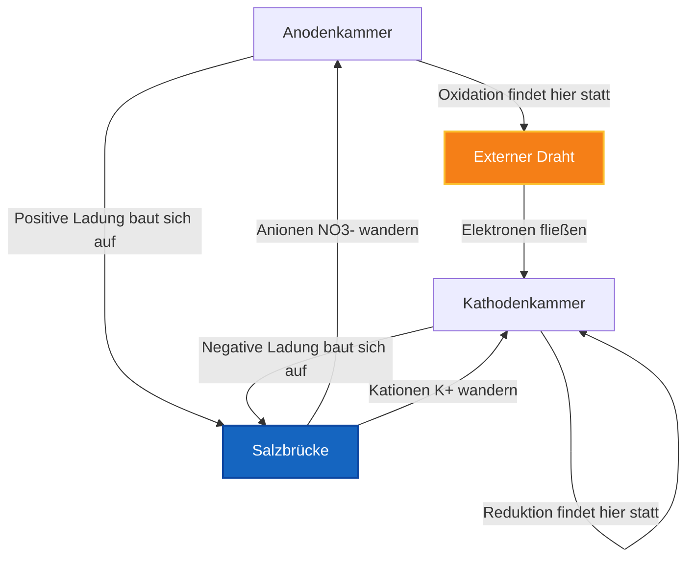

# Labor- & Analytische Elektrochemie Leitfaden für Elektrochemische Zellen

In der physikalischen Chemie und der elektrochemischen Verfahrenstechnik koppelt eine **elektrochemische Zelle** eine Oxidations-Halbreaktion an der **Anode** mit einer Reduktions-Halbreaktion an der **Kathode**:

$$E_{\text{Zelle}}^\circ = E_{\text{Kathode}}^\circ - E_{\text{Anode}}^\circ$$

$$E_{\text{Zelle}} = E_{\text{Zelle}}^\circ - \frac{R T}{n F} \ln Q \quad \left(\text{Bei } 25^\circ\text{C} \implies E_{\text{Zelle}} = E_{\text{Zelle}}^\circ - \frac{0,05916}{n} \log_{10} Q\right)$$

$$\text{IUPAC-Zellnotation: } \text{Anode}(s) \mid \text{Anode}^{n+}(aq, c_1) \parallel \text{Kathode}^{m+}(aq, c_2) \mid \text{Kathode}(s)$$

$$\Delta G = -n F E_{\text{Zelle}} \quad \text{und} \quad \Delta G^\circ = -n F E_{\text{Zelle}}^\circ = -R T \ln K$$

---

## 1. Klassische elektrochemische Zellen - Vergleichsmatrix

| Eigenschaft | Galvanische / Voltaische Zelle | Elektrolytische Zelle | Konzentrationszelle |
| :--- | :--- | :--- | :--- |
| **Spontaneität** | **Spontan ($E > 0$, $\Delta G < 0$)** | **Nicht spontan ($E < 0$, $\Delta G > 0$)** | **Spontan ($E > 0$, angetrieben durch $\Delta C$)** |
| **Energieumwandlung** | **Chemisch $\to$ Elektrisch** | **Elektrisch $\to$ Chemisch** | **Konzentrationsgefälle $\to$ Elektrisch** |
| **Anodenladung** | **Negativ ($-$)** | **Positiv ($+$)** | **Negativ ($-$) (Verdünnt)** |
| **Kathodenladung** | **Positiv ($+$)** | **Negativ ($-$)** | **Positiv ($+$) (Konzentriert)** |
| **Anodenprozess** | **Oxidation (Verlust von $e^-$)** | **Oxidation (Verlust von $e^-$)** | **Oxidation ($\text{Ag} \to \text{Ag}^+ + e^-$)** |
| **Kathodenprozess**| **Reduktion (Gewinn von $e^-$)** | **Reduktion (Gewinn von $e^-$)** | **Reduktion ($\text{Ag}^+ + e^- \to \text{Ag}$)** |
| **Elektronenfluss** | **Anode $\to$ Kathode** | **Anode $\to$ Kathode (über Stromquelle)** | **Anode $\to$ Kathode** |

---

## 2. Standard-Berechnungsprotokolle für elektrochemische Zellen

```
1. Standardzellpotential: E0_Zelle = E0_Kathode - E0_Anode
2. Nicht-Standard Nernst-Potential: E_Zelle = E0_Zelle - (R*T / (n*F)) * ln(Q)
3. Gibbs-freie Energie: deltaG = -n * F * E_Zelle (kJ/mol)
4. Konzentrationszellspannung: E_Zelle = (R*T / (n*F)) * ln(C_hoch / C_niedrig)
5. Gleichgewichtskonstante K: log10(K) = (n * E0_Zelle) / 0,05916
```

---

## 3. Bildungs- & Labor-Sicherheitshinweis
*Dieser Rechner für elektrochemische Zellen liefert theoretische thermodynamische Berechnungen für Bildungszwecke, Laborforschung und AP-Chemie-Anwendungen. Echte industrielle Batteriesysteme oder Galvanisierungszellen sollten Überspannungen, den ohmschen Innenwiderstand und Stofftransportbeschränkungen berücksichtigen.*

## 4. Der vollständige Leitfaden zu elektrochemischen Zellen

Willkommen zum definitiven Laborhandbuch über **elektrochemische Zellen**. Von den mikroskopisch kleinen Mitochondrien, die Ihre Zellen antreiben, bis hin zu den riesigen Lithium-Ionen-Anlagen, die globale Stromnetze stabilisieren, diktiert die grundlegende Physik der räumlichen Elektrochemie die moderne Existenz.

In diesem ausführlichen Leitfaden werden wir die Architektur von sowohl galvanischen (spontanen) als auch elektrolytischen (erzwungenen) Zellen zerlegen. Wir werden genau definieren, wie man Standard-Reduktionspotentiale ($E^\circ_{\text{Zelle}}$) berechnet, mathematisch die Notwendigkeit der Salzbrücke beweisen und fünf strenge, schrittweise elektrochemische Ableitungen durchgehen. Dabei werden wir diese Prozesse mithilfe von hochauflösenden Mermaid-Diagrammen visualisieren.

### 4.1 Anatomie einer elektrochemischen Zelle

Eine elektrochemische Zelle trennt eine Redoxreaktion streng in zwei isolierte Kammern und zwingt die übertragenen Elektronen, durch einen externen Draht zu wandern. Dies ermöglicht es uns, ihre kinetische Energie als Elektrizität zu nutzen.

Jede Zelle enthält vier obligatorische Komponenten:
1.  **Die Anode (-/+):** Die Elektrode, an der die **Oxidation** stattfindet. Elektronen werden dem Reaktanten entzogen und in den Draht gedrückt. In einer Batterie (galvanische Zelle) wird die Anode mit einem negativen ($-$) Zeichen versehen, da sie die Elektronenquelle ist.
2.  **Die Kathode (+/-):** Die Elektrode, an der die **Reduktion** stattfindet. Elektronen treten aus dem Draht aus und werden gewaltsam in den Reaktanten geschoben. In einer Batterie wird die Kathode mit einem positiven ($+$) Zeichen versehen, da sie Elektronen anzieht.
3.  **Der leitfähige Draht:** Verbindet die beiden Elektroden und ermöglicht den Elektronenfluss.
4.  **Die Salzbrücke:** Eine absolute thermodynamische Notwendigkeit. Wenn Elektronen die Anode verlassen, baut sich in der Anodenkammer eine massive, tödliche positive Ladung auf. Ohne eine Salzbrücke würde die Reaktion aufgrund elektrostatischer Abstoßung nach einer Mikrosekunde sofort stoppen. Die Salzbrücke pumpt inerte Anionen (wie $\text{NO}_3^-$) in die Anode und inerte Kationen (wie $\text{K}^+$) in die Kathode, wodurch die Ladung neutralisiert und der Stromkreis geschlossen wird.

### 4.2 Galvanische vs. Elektrolytische Zellen

Es gibt zwei primäre thermodynamische Zustände für eine elektrochemische Zelle:

*   **Galvanische (Voltaische) Zellen:** Dies sind Ihre Standardbatterien. Die chemische Reaktion ist **spontan** ($\Delta G < 0$). Sie schließen den Draht an, und die Chemikalien drücken von Natur aus eine Spannung durch ihn ($E_{\text{Zelle}} > 0$).
*   **Elektrolytische Zellen:** Dies sind erzwungene Systeme, wie das Galvanisieren von Gold oder die Spaltung von Wasser in Wasserstoffbrennstoff. Die chemische Reaktion ist **nicht spontan** ($\Delta G > 0$). Sie müssen physisch eine externe Stromversorgung anschließen, um Elektronen gegen ihren natürlichen Willen gewaltsam rückwärts zu treiben, was eine Eingangsspannung erfordert ($E_{\text{Zelle}} < 0$).

### 4.3 IUPAC-Standard-Zellnotation

Chemiker haben eine Kurzschrift namens Zellnotation entwickelt, um einen gesamten physikalischen Apparat auf einer einzigen Textzeile zu beschreiben. Die Regeln sind streng:
*   Die **Anode** (Oxidation) wird IMMER ganz links geschrieben.
*   Die **Kathode** (Reduktion) wird IMMER ganz rechts geschrieben.
*   Ein einzelner vertikaler Strich (`|`) stellt eine physikalische Phasengrenze dar (z. B. festes Metall berührt flüssiges Wasser).
*   Ein doppelter vertikaler Strich (`||`) stellt die physikalische Salzbrücke dar, die die beiden Bechergläser trennt.

Beispiel: $\text{Zn}(s) \mid \text{Zn}^{2+}(aq) \parallel \text{Cu}^{2+}(aq) \mid \text{Cu}(s)$

---

## 5. Gebrauchsanweisung: Den Zell-Rechner meistern

Unser Rechner fungiert als universeller thermodynamischer Zell-Ersteller.

### 5.1 Modus: Galvanischer Zell-Ersteller

1.  **Modus auswählen:** Wählen Sie "Galvanische/Voltaische Zelle".
2.  **Parameter eingeben:** Wählen Sie Ihre zwei Halbreaktionen aus der Standard-Reduktionspotentialtabelle. Der Rechner weist automatisch der Kathode (Reduktion) das positivere Potential zu.
3.  **Ausgabe ablesen:** Das Tool gibt sofort $E^\circ_{\text{Zelle}}$ aus, bestätigt die Spontaneität und generiert die perfekte IUPAC-Zellnotation.

### 5.2 Modus: Elektrolytische erzwungene Reaktionen

1.  **Modus auswählen:** Wählen Sie "Elektrolytische Zelle".
2.  **Parameter eingeben:** Wählen Sie die Reaktion, die Sie rückwärts erzwingen *möchten* (z. B. die Spaltung von $\text{NaCl}$ in Natriummetall und Chlorgas).
3.  **Ausführen:** Das Tool berechnet die massive negative Spannung, die Sie mit einer externen Stromversorgung überwinden müssen, um die Reaktion auszulösen.

### 5.3 Modus: Konzentrationszelle

1.  **Modus auswählen:** Wählen Sie "Konzentrationszelle".
2.  **Parameter eingeben:** Wählen Sie ein einzelnes Metall (z. B. Silber) für beide Elektroden. Geben Sie eine verdünnte Konzentration für die Anode und eine hochkonzentrierte Molarität für die Kathode ein.
3.  **Ausführen:** Das Tool berechnet die von Nernst abgeleitete Spannung, die rein durch die Entropie der Diffusion erzeugt wird, obwohl das Standardpotential mathematisch null ist.

---

## 6. Fünf praxisnahe Beispiele aus der analytischen Chemie

Lassen Sie uns diese Theorie untermauern, indem wir fünf strenge, praktische elektrochemische Szenarien lösen.

### Beispiel 1: Bau eines Standard-Daniell-Elements

**Szenario:** 
Sie bauen eine Zelle mit einer festen Zinkanode in $1,0\text{ M } \text{ZnSO}_4$ und einer festen Kupferkathode in $1,0\text{ M } \text{CuSO}_4$. 
Standard-Reduktionspotentiale:
*   $\text{Cu}^{2+} + 2e^- \rightleftharpoons \text{Cu} \quad (E^\circ = +0,34\text{ V})$
*   $\text{Zn}^{2+} + 2e^- \rightleftharpoons \text{Zn} \quad (E^\circ = -0,76\text{ V})$

Berechnen Sie das Standard-Zellpotential ($E^\circ_{\text{Zelle}}$).

**Mathematische Ableitung:**

1.  **Kathode und Anode identifizieren:**
    Die Spezies mit dem positiveren Reduktionspotential fungiert als Kathode.
    Kathode = Kupfer ($+0,34\text{ V}$)
    Anode = Zink ($-0,76\text{ V}$)
2.  **Standardgleichung anwenden:**
    $$ E_{\text{Zelle}}^\circ = E_{\text{Kathode}}^\circ - E_{\text{Anode}}^\circ $$
3.  **Berechnen:**
    $$ E_{\text{Zelle}}^\circ = 0,34 - (-0,76) $$
    $$ E_{\text{Zelle}}^\circ = +1,10\text{ V} $$

**Schlussfolgerung:** Die Zelle produziert genau $1,10\text{ Volt}$. Da die Spannung positiv ist, ist die Reaktion spontan und dieses Gerät fungiert als galvanische Batterie.

### Beispiel 2: Nicht-Standardspannung über Nernst

**Szenario:**
Sie lassen das Daniell-Element stundenlang laufen. Die Zinkelektrode löst sich auf, wodurch die Anodenkonzentration auf $[\text{Zn}^{2+}] = 1,90\text{ M}$ steigt. Die Kupferelektrode wird abgeschieden, wodurch die Kathodenkonzentration auf $[\text{Cu}^{2+}] = 0,10\text{ M}$ sinkt. Berechnen Sie die neue Echtzeit-Spannung.

**Mathematische Ableitung:**

1.  **Bekannte Werte identifizieren:**
    $E^\circ = 1,10\text{ V}$
    $n = 2$ Elektronen
    $Q = \frac{[\text{Zn}^{2+}]}{[\text{Cu}^{2+}]} = \frac{1,90}{0,10} = 19$
2.  **Nernst-Gleichung anwenden (bei 25°C):**
    $$ E = E^\circ - \frac{0,05916}{n} \log_{10}(Q) $$
3.  **Berechnen:**
    $$ E = 1,10 - \frac{0,05916}{2} \log_{10}(19) $$
    $$ E = 1,10 - (0,02958 \times 1,279) $$
    $$ E = 1,10 - 0,038 = +1,062\text{ V} $$

**Schlussfolgerung:** Die Spannung ist von $1,10\text{ V}$ auf $1,062\text{ V}$ abgefallen. Die logarithmische Abhängigkeit sorgt dafür, dass die Spannung bis ganz zum Schluss nur langsam sinkt.

### Beispiel 3: Berechnung der freien Gibbs-Energie ($\Delta G$)

**Szenario:**
Eine Blei-Säure-Autobatterie arbeitet mit etwa $+2,05\text{ V}$ pro Zelle mit einem Elektronentransfer von $n = 2$. Berechnen Sie die thermodynamische Gesamtarbeit (in $\text{kJ}$), die diese Zelle pro Mol Reaktant verrichten kann.

**Mathematische Ableitung:**

1.  **Bekannte Werte identifizieren:**
    $E^\circ = 2,05\text{ V}$
    $n = 2\text{ Mol } e^-$
    $F = 96485\text{ C/mol}$
2.  **Gibbs-Gleichung anwenden:**
    $$ \Delta G^\circ = -nFE^\circ $$
3.  **Berechnen:**
    $$ \Delta G^\circ = -(2)(96485)(2,05) $$
    $$ \Delta G^\circ = -395588\text{ J/mol} $$
    $$ \Delta G^\circ = -395,6\text{ kJ/mol} $$

**Schlussfolgerung:** Die Reaktion ist massiv spontan und setzt gewaltsam $395,6\text{ kJ}$ Energie pro Mol frei, was genug Drehmoment liefert, um einen schweren Verbrennungsmotor anzukurbeln.

**Visualisierung: Logik des Elektronen- und Ionenflusses**


*Dieses Flussdiagramm beweist, dass eine elektrochemische Zelle zwei vollständige, gleichzeitige Stromkreise benötigt: den Draht für Elektronen und die Salzbrücke für Zuschauerionen.*

### Beispiel 4: Die entropiegetriebene Konzentrationszelle

**Szenario:**
Sie erstellen eine Zelle mit Silber-Elektroden ($\text{Ag}$) in beiden Bechergläsern. Da beide Metalle identisch sind, gilt $E^\circ_{\text{Kathode}} - E^\circ_{\text{Anode}} = 0,00\text{ V}$. Die Anode hat jedoch $[\text{Ag}^+] = 0,001\text{ M}$ und die Kathode $[\text{Ag}^+] = 2,0\text{ M}$. Berechnen Sie die Nicht-Standardspannung.

**Mathematische Ableitung:**

1.  **Bekannte Werte identifizieren:**
    $E^\circ = 0,00\text{ V}$
    $n = 1$
    $Q = \frac{[\text{Ag}^+]_{\text{Anode}}}{[\text{Ag}^+]_{\text{Kathode}}} = \frac{0,001}{2,0} = 0,0005$
2.  **Nernst-Konzentrationsgleichung anwenden:**
    $$ E = 0,00 - \frac{0,05916}{1} \log_{10}(0,0005) $$
3.  **Berechnen:**
    $$ E = -0,05916 \times (-3,301) $$
    $$ E = +0,195\text{ V} $$

**Schlussfolgerung:** Obwohl identische Metalle vorliegen, erzeugt die schiere thermodynamische Kraft der Diffusion (die konzentrierte Seite versucht, sich selbst zu verdünnen) fast $0,2\text{ Volt}$ Strom!

### Beispiel 5: Elektrolyse und Überspannung

**Szenario:**
Sie möchten eine Stahlstoßstange aus einem $\text{Cr}^{3+}$-Bad mit massivem Chrom galvanisieren. Dies ist höchst nicht spontan. Das Standard-Reduktionspotential von Chrom beträgt $-0,74\text{ V}$. Wie viel Spannung muss Ihre Stromversorgung liefern, um thermodynamische Barrieren (und kinetische Überspannungen) zu überwinden?

**Mathematische Ableitung:**

1.  **Das Ziel identifizieren:**
    $E^\circ_{\text{Reduktion}} = -0,74\text{ V}$
2.  **Thermodynamik analysieren:**
    Die natürliche Reaktion ist $\text{Cr} \to \text{Cr}^{3+} + 3e^-$. Wir wollen das Gegenteil erzwingen. Daher beträgt die Zellspannung $-0,74\text{ V}$.
3.  **Überspannungsregeln anwenden:**
    Um einfach zu verhindern, dass sich das Metall auflöst, müssen Sie genau $+0,74\text{ V}$ anlegen. Um das Galvanisieren tatsächlich mit einer brauchbaren Geschwindigkeit zu erzwingen, müssen Industrieingenieure eine "Überspannung" von weiteren $1$ bis $2\text{ Volt}$ anlegen, um die kinetische Aktivierungsenergie zu überwinden.

**Schlussfolgerung:** Das Netzteil muss auf mindestens $2,0\text{ V}$ eingestellt werden, um die nicht spontane Reduktion von $\text{Cr}^{3+}$-Ionen in ein schönes, solides Chrom-Finish aggressiv zu erzwingen.

**Visualisierung: Der Lebenszyklus einer Voltaischen Zelle**

```mermaid
gantt
    title Zeitleiste des galvanischen Batteriebetriebs
    dateFormat  HH:mm:ss
    axisFormat  %H:%M
    section Vorbereitung
    Aktivierung der Salzbrücke :00:00:00, 00:05:00
    section Kontinuierliche Entladung
    Massenabbau der Anode :active, 00:05:00, 03:00:00
    Galvanisierung der Kathode :active, 00:05:00, 03:00:00
    section Kritische Erschöpfung
    Logarithmischer Spannungsabfall :crit, 03:00:00, 03:30:00
    section Tod
    Thermodynamisches Gleichgewicht (E=0V) :03:30:00, 04:00:00
```


*Diese Zeitleiste veranschaulicht die physikalische Degradation einer Batterie: Die Anode löst sich langsam in wässrige Ionen auf, während die Kathode dicke Schichten aus plattiertem Metall ansammelt, bis das Gleichgewicht den Prozess stoppt.*

---

## 7. Deep Dive FAQ und erweiterte Fehlerbehebung

**F: Kann man eine Zelle mit zwei unterschiedlichen Konzentrationen der exakt gleichen Chemikalie bauen?**
**A:** Absolut! Dies wird als Konzentrationszelle bezeichnet. Während das Standardpotential ($E^\circ$) $0\text{ V}$ beträgt, möchte die Entropie des Universums verzweifelt, dass beide Bechergläser genau die gleiche Konzentration erreichen. Die Nernst-Gleichung beweist, dass dieser Diffusionsgradient nutzbaren Strom erzeugt.

**F: Warum verwenden einige Zellen Platin-Elektroden?**
**A:** Wenn Ihre Halbreaktion nur Gase und wässrige Ionen umfasst (wie $\text{Fe}^{3+}$, das zu $\text{Fe}^{2+}$ wird, oder Wasserstoffgas, das sprudelt), gibt es kein festes Metall, an das ein Draht angeschlossen werden könnte! Wir verwenden ein inertes Metall wie Platin ($\text{Pt}$) als physikalische Oberfläche, auf der die Elektronen landen können, ohne dass das Platin selbst chemisch reagiert.

**F: Was passiert, wenn die Salzbrücke austrocknet?**
**A:** Die elektrochemische Zelle wird in weniger als einer Millisekunde sterben. Ohne die Salzbrücke, die den massiven Aufbau einer positiven Ladung im Anodenbecher neutralisiert, wird die elektrostatische Abstoßung physisch verhindern, dass weitere Elektronen austreten.

Durch die Beherrschung der Berechnung von Standardpotentialen, der genauen Generierung der IUPAC-Zellnotation und dem Verständnis der verheerenden Notwendigkeit der Salzbrücke können Sie makellose elektrochemische Energiesysteme entwerfen. Egal, ob Sie galvanische Korrosion an einem Schlachtschiff bewerten oder die nächste Generation von Festkörperbatterien entwerfen, verlassen Sie sich auf diesen Rechner für elektrochemische Zellen für sofortige thermodynamische Präzision!
