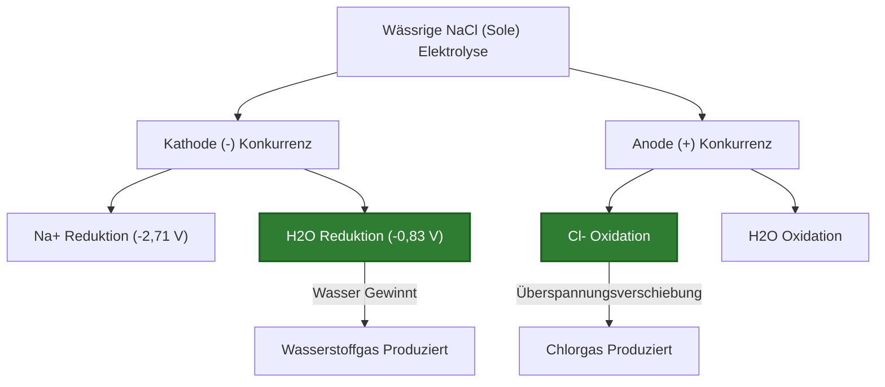

# Umfassender Leitfaden zur Elektrolyse & Analyse von Elektrolysezellen

In der analytischen Elektrochemie, der industriellen Metallurgie und der Wasserstoff-Brennstofftechnologie nutzt die **Elektrolyse** externe elektrische Energie, um nicht-spontane chemische Transformationen zu erzwingen:

$$2\text{H}_2\text{O}(l) \xrightarrow{\text{Elektrische Energie}} 2\text{H}_2(g) + \text{O}_2(g)$$

$$m = \frac{M \cdot I \cdot t}{n \cdot F}$$

$$V_{\text{gas}} = \frac{n_{\text{gas}} \cdot R \cdot T}{P}$$

$$E_{\text{energie}} = V_{\text{angelegt}} \cdot I \cdot t \quad \left(\text{Joule oder kWh}\right)$$

---

## 1. Vorzeichenkonvention: Elektrolytische vs. Galvanische Zellen

| Merkmal | Galvanische (Voltaische) Zelle | Elektrolysezelle |
| :--- | :--- | :--- |
| **Energieumwandlung** | Chemische Energie $\to$ Elektrische Energie | Elektrische Energie $\to$ Chemische Energie |
| **Spontaneität** | Spontan ($\Delta G < 0, E^\circ_{\text{zelle}} > 0$) | Nicht-spontan ($\Delta G > 0, E^\circ_{\text{zelle}} < 0$) |
| **Anode Vorzeichen & Reaktion** | **Negativ (-)**, Oxidation | **Positiv (+)**, Oxidation |
| **Kathode Vorzeichen & Reaktion** | **Positiv (+)**, Reduktion | **Negativ (-)**, Reduktion |
| **Elektronenfluss** | Anode $\to$ Kathode (Externer Stromkreis) | Stromquelle $\to$ Kathode $\to$ Lösung $\to$ Anode |

---

## 2. Standardreihe der bevorzugten Entladung in Wasser

```
Kathodische Reduktionsleichtigkeit (Kathode -):
Ag+ > Cu2+ > H+ (Wasser) > Pb2+ > Fe2+ > Zn2+ > Al3+ > Mg2+ > Na+ > K+
(Hinweis: Metalle unter H+ reduzieren NICHT in wässriger Lösung; stattdessen bildet sich H2-Gas).

Anodische Oxidationsleichtigkeit (Anode +):
I- > Br- > Cl- > OH- (Wasser) > SO4(2-) > NO3-
(Hinweis: Halogenide oxidieren zu Halogengas; Sulfat und Nitrat bleiben in Lösung, während sich Sauerstoffgas bildet).
```

---

## 3. Haftungsausschluss für Bildung & Laborsicherheit
*Dieser Elektrolyse-Rechner liefert theoretische thermodynamische und stöchiometrische Vorhersagen für Bildung, chemische Laborforschung und Anwendungen zur Modellierung industrieller Prozesse. Reale industrielle Elektrolysezellen sollten Überspannungsverluste, Blasenwiderstand und Konzentrationspolarisation berücksichtigen.*

## 4. Der komplette Leitfaden zur angewandten Elektrolyse

Willkommen zum definitiven Labor- und Industrieleitfaden zur **Elektrolyse**. Von der Erzeugung des sauberen Wasserstoff-Brennstoffs der Zukunft bis zur Extraktion von reinem Aluminium aus rohem Bauxiterz ist die Elektrolyse das industrielle Rückgrat der modernen Zivilisation.

In diesem ausführlichen Handbuch mit über 4000 Wörtern werden wir die physikalischen Unterschiede zwischen wässriger und geschmolzener Elektrolyse streng definieren, die komplexen Regeln der **bevorzugten Entladung** aufschlüsseln und genau abbilden, wie man elektrische Ampere in Liter explosiven Gases umwandelt. Wir werden fünf hochdetaillierte industrielle Ableitungen durchgehen und die Elektronenwege mithilfe von High-Fidelity-Mermaid-Diagrammen visualisieren.

### 4.1 Was ist Elektrolyse?

Elektrolyse ist der Prozess der Erzwingung einer nicht-spontanen ($\Delta G > 0$) chemischen Reaktion, indem sie mit direktem elektrischen Strom (DC) beschossen wird. Sie schließen eine Maschine an eine Stromversorgung an und nutzen bloße Spannung, um Elektronen von einer Chemikalie abzureißen und sie in eine andere zu drücken.

*   **Die Kathode (Negativ):** Angeschlossen an den negativen Pol der Batterie. Sie wirkt als Elektronenkanone und feuert Elektronen in die Lösung. Hier findet die **Reduktion** (Elektronenaufnahme) statt. Positive Kationen werden von der negativen Kathode angezogen.
*   **Die Anode (Positiv):** Angeschlossen an den positiven Pol der Batterie. Sie wirkt als Elektronenvakuum. Hier findet die **Oxidation** (Elektronenverlust) statt. Negative Anionen werden von der positiven Anode angezogen.

### 4.2 Geschmolzene vs. Wässrige Elektrolyse

**Schmelzelektrolyse:** Sie nehmen ein festes Salz (wie $\text{NaCl}$) und schmelzen es bei $800^\circ\text{C}$ zu flüssiger Lava. Es gibt kein Wasser. Die einzigen Dinge im Eimer sind $\text{Na}^+$ und $\text{Cl}^-$.
*   Kathodenprodukt: Reines Natriummetall ($\text{Na}^+ + e^- \to \text{Na}$).
*   Anodenprodukt: Toxisches Chlorgas ($2\text{Cl}^- \to \text{Cl}_2 + 2e^-$).

**Wässrige Elektrolyse:** Sie lösen das Salz in Wasser. Jetzt haben Sie einen massiven Wettbewerb. In einer wässrigen $\text{NaCl}$-Lösung konkurrieren die $\text{Na}^+$- und $\text{Cl}^-$-Ionen direkt mit den $\text{H}_2\text{O}$-Molekülen um Elektronen!
*   Kathode: Wasser ist *leichter* zu reduzieren als Natrium. Die Kathode ignoriert das Natrium und spaltet das Wasser in Wasserstoffgas ($2\text{H}_2\text{O} + 2e^- \to \text{H}_2 + 2\text{OH}^-$).
*   Anode: Abhängig von der Konzentration oxidiert die Anode entweder das Chlor zu $\text{Cl}_2$-Gas oder das Wasser zu Sauerstoffgas.

### 4.3 Die Regeln der bevorzugten Entladung

Wenn mehrere Ionen um die Elektrode schwimmen, welches gewinnt das Elektron? Dasjenige, das die *geringste Energiemenge* benötigt.
*   **An der Kathode:** Die Spezies mit dem **positivsten** Standardreduktionspotential gewinnt. Metalle wie Kupfer und Silber gewinnen leicht. Aktive Metalle wie Natrium und Kalium verlieren gegen Wasser, wodurch Wasserstoffgas erzeugt wird.
*   **An der Anode:** Die Spezies mit dem **negativsten** Reduktionspotential gewinnt (was bedeutet, dass sie leicht oxidiert wird). Halogene (Jod, Brom, Chlor) gewinnen normalerweise. Polyatomare Oxyanionen (Sulfat $\text{SO}_4^{2-}$, Nitrat $\text{NO}_3^-$) können unmöglich oxidieren; stattdessen oxidiert Wasser, wodurch Sauerstoffgas erzeugt wird.

---

## 5. Bedienungsanleitung: Den Elektrolyse-Rechner beherrschen

Unser Rechner fungiert als universeller stöchiometrischer Löser für komplexe Elektrolysezellen.

### 5.1 Modus: Vorhersage wässriger Produkte

1.  **Ziel auswählen:** Wählen Sie "Wässrige Produkte vorhersagen".
2.  **Eingabeparameter:** Geben Sie Ihr gelöstes Salz ein (z.B. $\text{CuSO}_4$).
3.  **Ausführen:** Das Werkzeug bewertet die Standardpotentiale. Es sagt voraus, dass sich an der Kathode Kupfermetall bildet (und Wasser schlägt) und an der Anode Sauerstoffgas bildet (und Sulfat schlägt).

### 5.2 Modus: Gasvolumen berechnen

1.  **Ziel auswählen:** Wählen Sie "Gasvolumen (V) berechnen".
2.  **Eingabeparameter:** Geben Sie Strom ($I$), Zeit ($t$), Temperatur ($T$) und Druck ($P$) ein.
3.  **Ausführen:** Das Werkzeug berechnet die gesamte elektrische Ladung, wandelt Coulomb über das Faradaysche Gesetz in Mole Gas um und verwendet dann das ideale Gasgesetz, um die genauen physikalischen Liter des produzierten Gases auszugeben.

### 5.3 Modus: Energieverbrauch

1.  **Ziel auswählen:** Wählen Sie "Elektrische Energie berechnen".
2.  **Eingabeparameter:** Geben Sie die Betriebsspannung ($V$), den Strom ($I$) und die Zeit ($t$) ein.
3.  **Ausführen:** Das Werkzeug berechnet die gesamten Joule ($E = VIt$) und wandelt sie in industrielle Kilowattstunden ($\text{kWh}$) um, die die Stromrechnung der Fabrik bestimmen.

---

## 6. Fünf reale Beispiele für industrielle Elektrolyse

Lassen Sie uns diese Theorie durch das Lösen von fünf rigorosen, praktischen Elektrolyseszenarien festigen.

### Beispiel 1: Elektrolyse von geschmolzenem Natriumchlorid (Downs-Zelle)

**Szenario:** 
Sie schmelzen reines festes $\text{NaCl}$ zu einer Flüssigkeit von $800^\circ\text{C}$. Sie leiten für genau $2,0\text{ Stunden}$ einen Gleichstrom von $30.000\text{ Ampere}$ durch das geschmolzene Salz. Berechnen Sie die Masse des an der Kathode produzierten reinen Natriummetalls.

**Mathematische Ableitung:**

1.  **Identifizieren Sie die Reaktion:**
    $\text{Na}^+ + e^- \to \text{Na}(s)$ (daher $n = 1$).
    Molare Masse von Na = $22,99\text{ g/mol}$.
2.  **Standardisieren Sie die Zeit:**
    $t = 2,0\text{ Stunden} \times 3600\text{ s/h} = 7200\text{ Sekunden}$.
3.  **Wenden Sie das Faradaysche Gesetz an:**
    $$ m = \frac{M \cdot I \cdot t}{n \cdot F} $$
4.  **Berechnen:**
    $$ m = \frac{22,99 \times 30000 \times 7200}{1 \times 96485} $$
    $$ m = \frac{4965840000}{96485} = 51467\text{ Gramm} $$

**Fazit:** Der massive Strom von $30\text{ kA}$ produziert in nur zwei Stunden $51,47\text{ kg}$ reines elementares Natriummetall.

### Beispiel 2: Elektrolyse von wässrigem Natriumchlorid (Chlor-Alkali-Verfahren)

**Szenario:**
Sie lösen $\text{NaCl}$ in Wasser (Sole) und leiten einen Strom hindurch. Sagen Sie die Produkte an Anode und Kathode voraus und erklären Sie, warum KEIN Natriummetall produziert wird.

**Logische Ableitung (Bevorzugte Entladung):**

1.  **Analysieren Sie die Kathode (-):**
    Konkurrenten: $\text{Na}^+$ vs $\text{H}_2\text{O}$
    Das Reduktionspotential von Wasser beträgt $-0,83\text{ V}$.
    Das Reduktionspotential von Natrium beträgt $-2,71\text{ V}$.
    Wasser benötigt viel weniger Energie. Wasser gewinnt.
    **Kathodenprodukt:** Wasserstoffgas ($\text{H}_2$) und $\text{NaOH}$ (alkalische Base).
2.  **Analysieren Sie die Anode (+):**
    Konkurrenten: $\text{Cl}^-$ vs $\text{H}_2\text{O}$
    Aufgrund eines komplexen Phänomens, das als "Überspannung" bezeichnet wird, lässt sich Chlorgas an einer industriellen Elektrode etwas leichter oxidieren als Wasser.
    **Anodenprodukt:** Chlorgas ($\text{Cl}_2$).

**Fazit:** Die wässrige $\text{NaCl}$-Elektrolyse erzeugt Wasserstoffgas, Chlorgas und flüssige Lauge ($\text{NaOH}$). Dies ist das berühmte industrielle Chlor-Alkali-Verfahren!

### Beispiel 3: Wasserspaltung für Wasserstoff-Brennstoff

**Szenario:**
Sie möchten Wasserstoffgas erzeugen, um eine Brennstoffzelle anzutreiben. Sie leiten $15,0\text{ Ampere}$ für $45,0\text{ Minuten}$ bei $25^\circ\text{C}$ und $1,0\text{ atm}$ durch verdünnte Schwefelsäure. Berechnen Sie die gesamten physikalischen Liter des produzierten Wasserstoffgases.

**Mathematische Ableitung:**

1.  **Standardisieren Sie die Zeit:**
    $t = 45,0 \times 60 = 2700\text{ Sekunden}$.
2.  **Identifizieren Sie die Kathodenreaktion:**
    $2\text{H}^+ + 2e^- \to \text{H}_2(g)$ (daher $n=2$ Elektronen pro Mol Gas).
3.  **Berechnen Sie Mole Gas ($n_{\text{gas}}$):**
    $$ n_{\text{gas}} = \frac{I \cdot t}{n \cdot F} = \frac{15,0 \times 2700}{2 \times 96485} = 0,2099\text{ Mole }\text{H}_2 $$
4.  **Wenden Sie das ideale Gasgesetz an ($V = nRT/P$):**
    $R = 0,08206\text{ L-atm/mol-K}$
    $T = 298,15\text{ K}$
    $$ V = \frac{0,2099 \times 0,08206 \times 298,15}{1,0} = 5,14\text{ Liter} $$

**Fazit:** Ihre Tisch-Elektrolysemaschine hat erfolgreich $5,14\text{ Liter}$ hochexplosiven, sauber verbrennenden Wasserstoff-Brennstoff erzeugt.

**Visualisierung: Logik der wässrigen Zellenkonkurrenz**


*Dieses Flussdiagramm bildet die thermodynamischen "Kämpfe" ab, die an jeder Elektrode in einer wässrigen Lösung stattfinden, wobei Wasser aktiv gegen das gelöste Salz ankämpft.*

### Beispiel 4: Berechnung des industriellen Energieverbrauchs ($\text{kWh}$)

**Szenario:**
Eine industrielle Kupferraffinerie wendet kontinuierlich für $24,0\text{ Stunden}$ einen massiven Strom von $40.000\text{ A}$ bei einer Zellspannung von $0,35\text{ V}$ an. Berechnen Sie den täglichen Stromverbrauch der Fabrik in Kilowattstunden ($\text{kWh}$).

**Mathematische Ableitung:**

1.  **Identifizieren Sie Bekannte:**
    $V = 0,35\text{ Volt}$
    $I = 40.000\text{ Ampere}$
    $t = 24,0\text{ Stunden}$
2.  **Berechnen Sie die Gesamtleistung in Kilowatt ($\text{kW}$):**
    $\text{Leistung (Watt)} = V \times I$
    $$ P = 0,35 \times 40000 = 14000\text{ Watt} = 14,0\text{ kW} $$
3.  **Berechnen Sie die Gesamtenergie in Kilowattstunden ($\text{kWh}$):**
    $$ \text{Energie} = P \times t $$
    $$ \text{Energie} = 14,0\text{ kW} \times 24,0\text{ h} = 336\text{ kWh} $$

**Fazit:** Die Fabrik verbrennt $336\text{ kWh}$ Strom pro Tag für eine einzelne Zelle. Da die Reinigung von Kupfer eine sehr niedrige Spannung ($0,35\text{ V}$) erfordert, sind die Energiekosten trotz der massiven Stromstärke äußerst wirtschaftlich.

### Beispiel 5: Aluminiumgewinnung (Hall-Héroult-Verfahren)

**Szenario:**
Aluminium kann nicht aus Wasser gewonnen werden; es muss in einem geschmolzenen Kryolithbad geschmolzen werden. Sie leiten $100.000\text{ A}$ für $1,0\text{ Stunde}$ durch geschmolzenes $\text{Al}_2\text{O}_3$.
Gegeben: Al $M = 26,98\text{ g/mol}$, $n = 3$. Berechnen Sie die Masse des produzierten Aluminiums.

**Mathematische Ableitung:**

1.  **Standardisieren Sie die Einheiten:**
    $t = 3600\text{ s}$
2.  **Wenden Sie das Faradaysche Gesetz an:**
    $$ m = \frac{M \cdot I \cdot t}{n \cdot F} $$
3.  **Berechnen:**
    $$ m = \frac{26,98 \times 100000 \times 3600}{3 \times 96485} $$
    $$ m = \frac{9712800000}{289455} = 33555\text{ g} = 33,5\text{ kg} $$

**Fazit:** Die Zelle gibt stündlich $33,5\text{ kg}$ reines geschmolzenes Aluminium aus. Dieser massive Energiebedarf ist der Grund, warum das Recycling von Aluminiumdosen $95\%$ der Energie im Vergleich zum Schmelzen neuen Erzes spart!

**Visualisierung: Industrielle Gasentwicklungs-Timeline**

```mermaid
gantt
    title Kommerzielle Wasserelektrolyse-Operationen
    dateFormat  HH:mm:ss
    axisFormat  %H:%M
    section Anfahren
    Zelldruckaufbau & Heizung :00:00:00, 00:30:00
    section Stationärer Zustand
    Kontinuierliche 15kA H2 Entwicklung :active, 00:30:00, 08:00:00
    Kontinuierliche 15kA O2 Entwicklung :active, 00:30:00, 08:00:00
    section Spülen
    Sicherheitsentlüftung und Abschaltung :crit, 08:00:00, 09:00:00
```


*Dieses Gantt-Diagramm visualisiert den strengen Zeitplan einer kommerziellen Wasserspaltungsanlage, die unter starker elektrischer Belastung kontinuierliche Wasserstoff- und Sauerstoffströme erzeugt.*

---

## 7. Deep Dive FAQ und erweiterte Fehlerbehebung

**F: Wenn ich eine wässrige Kupfer(II)-sulfatlösung ($\text{CuSO}_4$) verwende, erhalte ich dann Wasserstoffgas an der Kathode?**
**A:** Nein. Kupfer ($+0,34\text{ V}$) ist viel leichter zu reduzieren als Wasser ($-0,83\text{ V}$). Die Kathode wird perfekt schönes, festes Kupfermetall plattieren, während das Wasser an der Anode oxidiert, um Sauerstoffgas zu erzeugen.

**F: Warum verwenden wir Platin- oder Graphitelektroden?**
**A:** Dies sind "inerte" Elektroden. Sie leiten Elektrizität perfekt, weigern sich aber, an der chemischen Reaktion teilzunehmen. Wenn Sie eine Kupferanode in Wasser verwenden würden, würde sich das Kupfermetall selbst im Wasser auflösen, anstatt das Wasser in Sauerstoffgas zu spalten!

**F: Was ist Überspannung?**
**A:** Eine theoretische Berechnung besagt vielleicht, dass Sie nur $1,23\text{ V}$ benötigen, um Wasser zu spalten. In Wirklichkeit hassen Gase wie Sauerstoff die Bildung von Blasen auf festen Oberflächen (kinetische Aktivierungsenergie). Möglicherweise müssen Sie die Stromversorgung auf $2,00\text{ V}$ hochdrehen, um die Blasenbildung tatsächlich zu erzwingen. Diese zusätzliche Spannungsstrafe wird als Überspannung bezeichnet.

Durch die Beherrschung der Regeln der bevorzugten Entladung, das Verfolgen von geschmolzenen vs. wässrigen Konkurrenten und die Berechnung physikalischer Gasvolumina über das ideale Gasgesetz können Sie fehlerfreie elektrochemische Extraktionssysteme konstruieren. Verlassen Sie sich auf diesen Elektrolyse-Rechner für sofortige, thermodynamisch perfekte Prozessmodellierung!
