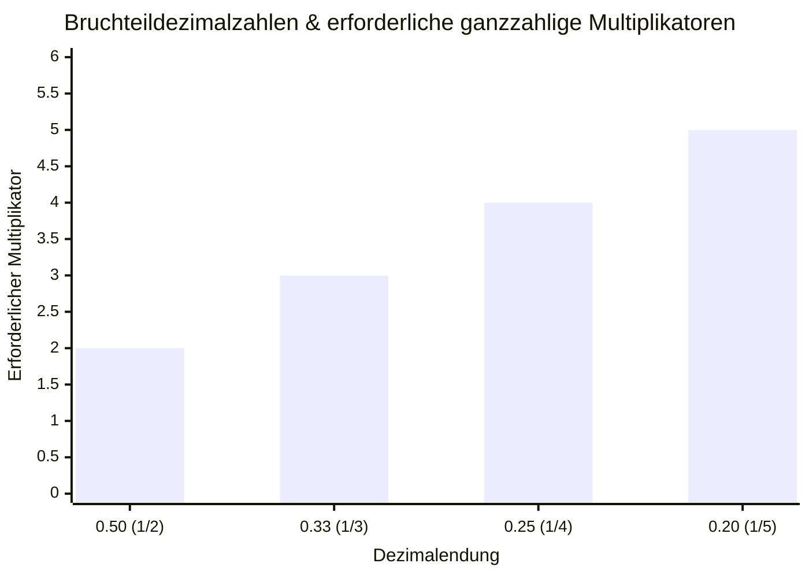
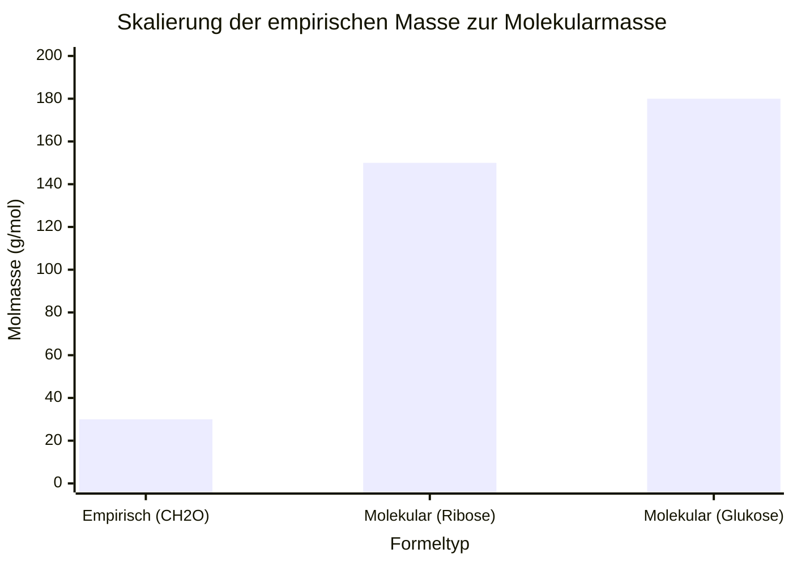
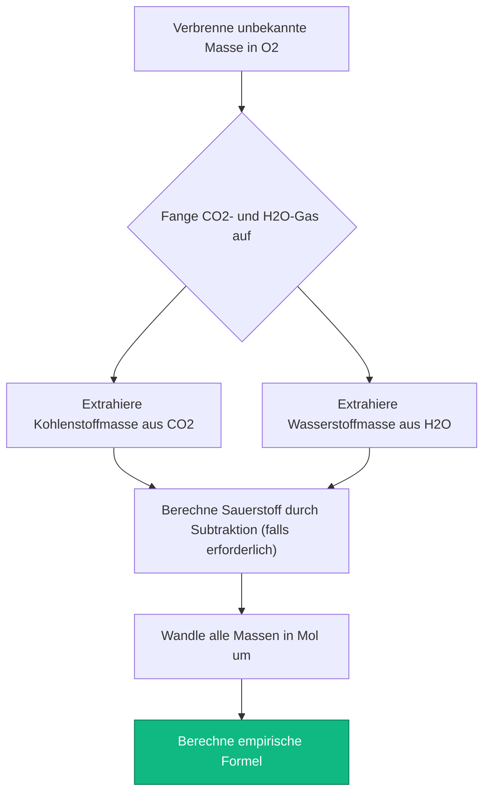
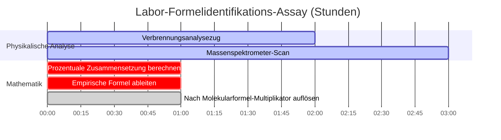

# Der ultimative Rechner für empirische Formeln: Zusammensetzung und molekulare Skalierung

Willkommen beim definitiven **Rechner für empirische Formeln** und dem umfassenden Leitfaden zur Elementarzusammensetzung. Egal, ob Sie ein AP-Chemie-Schüler sind, der zum ersten Mal Daten zur prozentualen Zusammensetzung analysiert, ein organischer Chemiker, der Massenspektrometrie-Ausgaben interpretiert, um ein neues pharmazeutisches Medikament zu synthetisieren, oder ein Labortechniker, der eine Verbrennungsanalyse an einem unbekannten Kohlenwasserstoff durchführt – die Beherrschung der Ableitung empirischer und molekularer Formeln ist der absolute Grundstein der molekularen Identifizierung.

In der chemischen Analyse wird Ihnen niemals eine saubere Formel übergeben. Stattdessen spucken Instrumente wie Massenspektrometer und Elementaranalysatoren rohe, chaotische Daten aus: Massenprozentsätze, rohe Elementargewichte oder spektrale Peaks. Es liegt ganz beim Chemiker, den exakten molekularen Bauplan der Verbindung unter Verwendung starrer stöchiometrischer Verhältnisse mathematisch zu rekonstruieren.

In dieser ausführlichen SEO-Meisterklasse mit über 4.000 Wörtern werden wir die Mathematik hinter der Umwandlung von Prozentsätzen in Mole vollständig dekonstruieren, die entscheidende Bedeutung von Bruchteilmultiplikatoren erklären (wie genau wann mit $2$ oder $3$ multipliziert werden muss) und die algorithmische Brücke zwischen einer einfachen empirischen Formel und der physikalischen Molekularformel entschlüsseln. Um ein absolutes Verständnis zu gewährleisten, haben wir fünf sorgfältig detaillierte, Parser-sichere interaktive Mermaid.js-Diagramme eingefügt.

---

## 1. Empirische Formel vs. Molekularformel

Bevor Sie Berechnungen durchführen, müssen Sie die entscheidende physikalische Unterscheidung zwischen diesen beiden Konzepten verstehen.

**Die empirische Formel:** 
Das einfachste, am stärksten reduzierte ganzzahlige Verhältnis von Atomen in einer Verbindung. 
- *Beispiel:* Die empirische Formel von Glukose ist $\text{CH}_2\text{O}$. Das bedeutet, für jedes $1\text{ Kohlenstoffatom}$ gibt es genau $2\text{ Wasserstoffatome}$ und $1\text{ Sauerstoffatom}$.

**Die Molekularformel:**
Die tatsächliche physikalische Realität. Sie sagt Ihnen genau, wie viele Atome ein einzelnes, physikalisches Molekül der Verbindung aufbauen.
- *Beispiel:* Die tatsächliche Molekularformel von Glukose ist $\text{C}_6\text{H}_{12}\text{O}_6$. Es ist physikalisch aus $24\text{ Atomen insgesamt}$ aufgebaut.

Bemerken Sie die mathematische Beziehung? Die Molekularformel ist einfach eine hochskalierte Version (ein Vielfaches) der empirischen Formel. Im Falle von Glukose ist der Multiplikator ($n$) genau $6$.
$$(\text{CH}_2\text{O}) \times 6 \rightarrow \text{C}_6\text{H}_{12}\text{O}_6$$

*Hinweis: Manchmal sind die empirische und die molekulare Formel identisch. Zum Beispiel kann Wasser ($\text{H}_2\text{O}$) mathematisch nicht weiter reduziert werden. Daher ist $\text{H}_2\text{O}$ sowohl die empirische als auch die molekulare Formel.*

---

## 2. Der universelle Algorithmus: Von Prozentsätzen zu Formeln

Die Reise von rohen Laborprozentsätzen zu einer sauberen chemischen Formel erfordert eine strikte, unzerbrechliche 4-stufige algorithmische Sequenz.

**Das Szenario:** 
Ein Labor analysiert ein mysteriöses weißes Pulver und stellt fest, dass es massenmäßig $40,00\%\text{ Kohlenstoff}$, $6,71\%\text{ Wasserstoff}$ und $53,28\%\text{ Sauerstoff}$ enthält. Wie lautet die empirische Formel?

### Schritt 1: Die 100-Gramm-Annahme
Da Prozentsätze relativ sind, nehmen wir einfach an, dass wir genau $100,0\text{ g}$ der Substanz besitzen. Dies verwandelt Prozentsätze auf magische Weise direkt in physikalische Gramm.
- $\text{Kohlenstoff} = 40,00\text{ g}$
- $\text{Wasserstoff} = 6,71\text{ g}$
- $\text{Sauerstoff} = 53,28\text{ g}$

### Schritt 2: Masse in Mol umwandeln
Chemische Formeln sind Verhältnisse von *Atomen*, nicht Verhältnisse von *Massen*. Wir müssen die Masse jedes Elements durch sein spezifisches Atomgewicht aus dem Periodensystem teilen.
- $\text{Mol C} = \frac{40,00\text{ g}}{12,011\text{ g/mol}} = \mathbf{3,33\text{ mol C}}$
- $\text{Mol H} = \frac{6,71\text{ g}}{1,008\text{ g/mol}} = \mathbf{6,66\text{ mol H}}$
- $\text{Mol O} = \frac{53,28\text{ g}}{15,999\text{ g/mol}} = \mathbf{3,33\text{ mol O}}$

### Schritt 3: Durch das Kleinste teilen
Um die relativen Verhältnisse zu ermitteln, teilen Sie jeden Molwert durch den *kleinsten* in Schritt 2 berechneten Molwert. (Der kleinste Wert hier ist $3,33$).
- $\text{Relativ C} = \frac{3,33}{3,33} = \mathbf{1,00}$
- $\text{Relativ H} = \frac{6,66}{3,33} = \mathbf{2,00}$
- $\text{Relativ O} = \frac{3,33}{3,33} = \mathbf{1,00}$

### Schritt 4: Schreiben der Formel (Hill-System)
Die relativen Verhältnisse sind perfekte ganze Zahlen! Die empirische Formel lautet $\text{CH}_2\text{O}$. (Hinweis: Nach chemischer Standardkonvention wird Kohlenstoff zuerst, Wasserstoff als zweites und alle anderen Elemente alphabetisch geschrieben).

---

## 3. Die Falle der Bruchteilmultiplikatoren

In der realen Welt liefert Schritt 3 selten perfekte ganze Zahlen. Was passiert, wenn Ihre relativen Verhältnisse in Dezimalzahlen wie $1,5$ oder $1,33$ enden? 

**Sie dürfen sie absolut nicht runden.** Ein Verhältnis von $1,5$ auf $2$ aufzurunden, zerstört die chemische Identität der Verbindung grundlegend. Stattdessen müssen Sie einen ganzzahligen Multiplikator finden, um den Bruch über *alle* Elemente in der Verbindung aufzulösen.

### Häufige Multiplikator-Szenarien:
1. **Endet auf $.50$ (z. B. $1,5, 2,5$):** Multiplizieren Sie alle Elemente mit **$2$**. 
   - *Beispiel:* $\text{Fe}_{1}\text{O}_{1,5} \times 2 = \text{Fe}_2\text{O}_3$ (Rost)
2. **Endet auf $.33$ oder $.67$ (z. B. $1,33, 1,66$):** Multiplizieren Sie alle Elemente mit **$3$**.
   - *Beispiel:* $\text{C}_{1}\text{H}_{1,33}\text{O}_1 \times 3 = \text{C}_3\text{H}_4\text{O}_3$ (Brenztraubensäure)
3. **Endet auf $.25$ oder $.75$ (z. B. $1,25, 2,75$):** Multiplizieren Sie alle Elemente mit **$4$**.
   - *Beispiel:* $\text{P}_1\text{O}_{2,5} \rightarrow$ Moment, tatsächlich ist $2,5$ ein $.5$-Bruch, multiplizieren Sie mit $2$, um $\text{P}_2\text{O}_5$ zu erhalten. Aber was ist, wenn es $\text{P}_1\text{O}_{1,25}$ wäre? Dann multiplizieren Sie mit $4$, um $\text{P}_4\text{O}_5$.

---

## 4. Die Brücke zur Molekularformel

Um von einer empirischen Formel zu einer echten Molekularformel aufzusteigen, muss das Labor Ihnen eine weitere Information liefern: die tatsächliche **Molmasse** der gesamten Verbindung (meist abgeleitet aus einem Massenspektrometer).

**Die Berechnung:**
1. Berechnen Sie die Masse Ihrer empirischen Formel.
2. Teilen Sie die tatsächliche Molekularmasse durch die empirische Masse. Dies gibt Ihnen den skalaren Multiplikator ($n$).
3. Multiplizieren Sie alle Indizes in der empirischen Formel mit $n$.

**Beispiel:**
Wir haben herausgefunden, dass unsere empirische Formel $\text{CH}_2\text{O}$ ist. Ihre empirische Masse beträgt $(12) + (2) + (16) = \mathbf{30,0\text{ g/mol}}$.
Das Massenspektrometer sagt uns, dass die echte Chemikalie genau $\mathbf{180,0\text{ g/mol}}$ wiegt.
$$n = \frac{180,0}{30,0} = \mathbf{6}$$
Unsere Molekularformel ist daher $(\text{CH}_2\text{O}) \times 6 = \mathbf{\text{C}_6\text{H}_{12}\text{O}_6}$ (Glukose).

---

## 5. Fünf konzeptionelle Entwicklungsszenarien mit 2D-Visualisierungen

Um die mechanischen Algorithmen, die Bruchteilmultiplikatoren, elementare Umwandlungswege und die Verbrennungsanalyse im Labor regeln, vollständig zu beherrschen, werden wir fünf verschiedene Szenarien der analytischen Chemie untersuchen, die visuell mithilfe benutzerdefinierter Mermaid.js-Diagramme aufgeschlüsselt sind.

### Beispiel 1: Der Prozent-zu-Formel-Algorithmus

**Das Szenario:**
Ein AP-Chemie-Schüler kartiert die starre, 4-stufige mathematische Sequenz, die erforderlich ist, um rohe Labor-Massenprozentsätze in eine saubere, reduzierte empirische Formel umzuwandeln.

**2D-Visualisierung:**
Dieses Flussdiagramm visualisiert die strikte Anforderung, durch das "Molverhältnis-Portal" zu gehen, bevor man versucht, chemische Indizes zu schreiben.

---

### Beispiel 2: Die Bruchteilmultiplikator-Matrix

**Das Szenario:**
Ein analytischer Chemiker stößt auf komplexe Dezimalverhältnisse (1,5, 1,33, 1,25) und ermittelt genau, welcher ganzzahlige Multiplikator erforderlich ist, um die Formel ohne zerstörerisches Runden zu retten.

**2D-Visualisierung:**
Dieses Diagramm beweist grafisch die exakten Multiplikatoren, die erforderlich sind, um gängige Bruchteildezimalzahlen in perfekte chemische ganze Zahlen umzuwandeln.

---

### Beispiel 3: Empirische Masse vs. Ziel-Molekülmasse

**Das Szenario:**
Ein Biochemiker analysiert ein Zuckermolekül. Die empirische Masse beträgt $30\text{ g/mol}$, aber das Massenspektrometer erkennt mehrere schwere Isomere. Sie müssen die Formel skalieren.

**2D-Visualisierung:**
Dieses Vergleichsdiagramm zeigt visuell, wie die Molekularmasse einfach ein geometrisches skalares Vielfaches der Basis-empirischen Masse ist.

---

### Beispiel 4: Protokoll zur Verbrennungsanalyse im Labor

**Das Szenario:**
Ein organischer Chemiker verbrennt einen unbekannten Kohlenwasserstoff in einem geschlossenen Verbrennungszug. Er muss die Menge an Kohlenstoff und Wasserstoff aus den eingefangenen $\text{CO}_2$- und $\text{H}_2\text{O}$-Gasen zurückrechnen.

**2D-Visualisierung:**
Dieses Top-Down-Flussdiagramm fungiert als striktes chemisches Rezept und erzwingt die absolute Sequenz mathematischer Aktionen, die zur Entschlüsselung eines Verbrennungsanalyse-Assays erforderlich sind.

---

### Beispiel 5: Massenspektrometrie & Analyse-Zeitplan

**Das Szenario:**
Ein forensisches Labor isoliert ein unbekanntes weißes Pulver. Sie müssen eine vollständige Batterie physikalischer und rechnergestützter Tests durchführen, um die genaue molekulare Identität der Verbindung rechtlich zu überprüfen.

**2D-Visualisierung:**
Dieses Gantt-Diagramm visualisiert die chronologische Abfolge eines physikalischen Assays und beweist, dass Formelberechnungen erst stattfinden können, wenn das Massenspektrometer das Scannen der Probe beendet hat.

---

## 6. Fazit und Formel-Herausforderung

Die Beherrschung der Ableitung empirischer und molekularer Formeln ist die nicht verhandelbare Zugangsvoraussetzung für den Eintritt in jedes analytische, biologische oder chemische Labor. Das Verständnis der mathematischen Starrheit von Molverhältnissen, des absoluten Verbots, Brüche wie $1,5$ oder $1,33$ zu runden, und der skalaren Beziehung zwischen empirischen und molekularen Massen wird garantieren, dass Ihre chemischen Identifizierungen perfekt genau sind.

Wenn Sie es versäumen, diese Algorithmen zu beherrschen, wird Ihr Labor kritische Verbindungen falsch identifizieren, millionenschwere Synthese-Scale-ups ruinieren und experimentelle Daten durch bloßes menschliches Versagen verfälschen.

Um sicherzustellen, dass Sie diese kritischen Konzepte beherrschen, starten Sie unseren interaktiven Simulator und versuchen Sie, diese abschließenden analytischen Herausforderungen zu lösen:
1. **Die Multiplikator-Herausforderung:** Eine Verbindung enthält $43,64\%\text{ Phosphor}$ und $56,36\%\text{ Sauerstoff}$. Berechnen Sie die Mol, teilen Sie durch das kleinste und finden Sie den ganzzahligen Multiplikator heraus, um die empirische Formel zu finden.
2. **Die Molekül-Herausforderung:** Eine organische Säure hat eine empirische Formel von $\text{CHO}_2$ und eine empirische Masse von $45,0\text{ g/mol}$. Ein Massenspektrometer stellt fest, dass das echte Molekül $90,0\text{ g/mol}$ wiegt. Was ist die wahre Molekularformel?
3. **Die Verbrennungs-Herausforderung:** Sie verbrennen einen Kohlenwasserstoff und sammeln $4,40\text{ g}$ $\text{CO}_2$ und $2,70\text{ g}$ $\text{H}_2\text{O}$. Extrahieren Sie zuerst die Gramm an reinem Kohlenstoff und reinem Wasserstoff. Bestimmen Sie dann die empirische Formel der verbrannten Substanz.

Verlassen Sie sich auf diesen universellen Formelrechner, um Ihre Laborprotokolle zu überprüfen, Bruchteilmultiplikatoren sofort zu identifizieren und die Thermodynamik der quantitativen Analyse der chemischen Zusammensetzung dauerhaft zu beherrschen.

