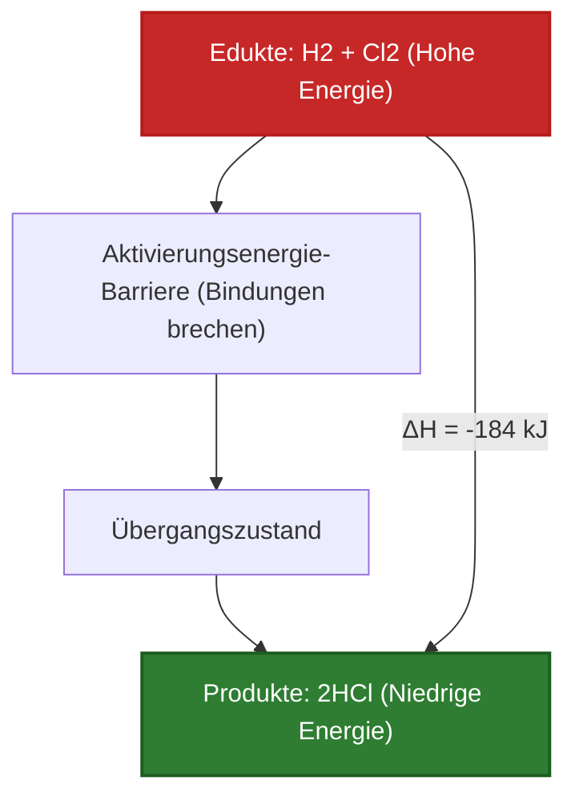

# Vollständiger Labor- & Industrie-Leitfaden für Enthalpie & Thermochemie

In der physikalischen Chemie, der Verfahrenstechnik und der Verbrennungstechnik quantifiziert die **Enthalpieänderung ($\Delta H$)** die Netto-Wärmeenergie, die bei chemischen Reaktionen bei konstantem Druck aufgenommen oder abgegeben wird:

$$\Delta H = H_{\text{Produkte}} - H_{\text{Edukte}}$$

$$\Delta H^\circ_{\text{Reaktion}} = \sum n \cdot \Delta H^\circ_f(\text{Produkte}) - \sum n \cdot \Delta H^\circ_f(\text{Edukte})$$

$$q = m \cdot c \cdot \Delta T \quad \left(\text{Kalorimetrie-Wärmegleichung}\right)$$

$$\Delta H \approx \sum \text{Bindungsenergien}_{\text{gebrochen}} - \sum \text{Bindungsenergien}_{\text{gebildet}}$$

$$\Delta H_{\text{gesamt}} = \sum \Delta H_i \quad \left(\text{Satz von Hess}\right)$$

---

## 1. Exotherme vs. Endotherme Reaktion im Vergleich

| Merkmal | Exotherme Reaktion ($\Delta H < 0$) | Endotherme Reaktion ($\Delta H > 0$) |
| :--- | :--- | :--- |
| **Wärmeflussrichtung** | **An Umgebung abgegeben** | **Aus Umgebung aufgenommen** |
| **Enthalpievergleich** | $H_{\text{Produkte}} < H_{\text{Edukte}}$ | $H_{\text{Produkte}} > H_{\text{Edukte}}$ |
| **Umgebungstemperatur** | **Steigt (Erwärmt sich)** | **Sinkt (Kühlt ab)** |
| **Bindungsenergie-Regel** | Freigesetzte Energie beim Bindungsaufbau > Benötigte Energie zum Bindungsbruch | Benötigte Energie zum Bindungsbruch > Freigesetzte Energie beim Bindungsaufbau |
| **Häufige Beispiele** | Methanverbrennung, Neutralisation (HCl + NaOH) | Wasserverdampfung, Auflösung von $\text{NH}_4\text{NO}_3$ |

---

## 2. Matrix der Thermochemie-Berechnungsmethoden

```
1. Direkte Enthalpiedifferenz: ΔH = H_Produkte - H_Edukte
2. Standardbildungsenthalpien: ΔH°_rxn = Σ n * ΔH°f(Produkte) - Σ n * ΔH°f(Edukte)
3. Additivität nach dem Satz von Hess: ΔH_gesamt = ΔH_1 + ΔH_2 + ΔH_3 + ...
4. Durchschnittliche Bindungsenergien: ΔH = Σ BE(gebrochen) - Σ BE(gebildet)
5. Lösungskalorimetrie: q = m * c * ΔT  (q_Reaktion = -q_Lösung)
```

---

## 3. Haftungsausschluss für Bildung & Labor
*Dieser Enthalpie-Rechner liefert theoretische thermochemische Vorhersagen für Bildungszwecke, Forschung in der physikalischen Chemie und verfahrenstechnische Anwendungen. Echte kalorimetrische Messungen sollten die Wärmekapazität des Kalorimeters ($C_{\text{cal}}$), Wärmeverluste an die Umgebung und nicht-ideale Lösungsmischungen berücksichtigen.*

## 4. Der vollständige Leitfaden zur Enthalpie und Thermochemie

Willkommen beim ultimativen Leitfaden der physikalischen Chemie zur **Enthalpie ($\Delta H$)**. Bevor Sie bestimmen können, ob eine Reaktion spontan abläuft (mit der freien Gibbs-Energie) oder das absolute Chaos messen (Entropie), müssen Sie zunächst das ultimative thermische Scheckbuch des Universums ausgleichen: Wärme.

In diesem ausführlichen Handbuch von über 4000 Wörtern werden wir die physikalischen Mechanismen hinter **exothermen und endothermen** Reaktionen rigoros definieren. Wir werden fünf verschiedene mathematische Wege zur Berechnung von $\Delta H$ beherrschen, einschließlich des Satzes von Hess, Standardbildungsenthalpien ($\Delta H_f^\circ$), Bindungsenergien und Kalorimetrie ($q = mc\Delta T$). Schließlich werden wir die Wärmeübertragung und die schrittweise Reaktionskoordination mithilfe von hochauflösenden Mermaid-Diagrammen visualisieren.

### 4.1 Was ist Enthalpie?

Enthalpie ($H$) ist eine thermodynamische Zustandsfunktion, die den gesamten Wärmeinhalt eines Systems bei konstantem Druck darstellt. Da es unmöglich ist, die absolute Gesamtenergie eines Atoms zu messen, interessiert uns nur die **Enthalpieänderung ($\Delta H$)**: die genaue Wärmemenge, die während einer chemischen Reaktion in ein System gelangt oder es verlässt.

### 4.2 Exotherm vs. Endotherm: Die Physik der Bindungen

Warum setzt die Verbrennung von Methan massive Mengen an Wärme frei? Alles läuft auf die Physik chemischer Bindungen hinaus.
1.  **Bindungen aufbrechen:** Das Auseinanderreißen zweier Atome erfordert, dass Sie dem System Energie zuführen (Endotherm).
2.  **Bindungen bilden:** Wenn zwei Atome zusammenstoßen und eine stabile Bindung bilden, geben sie Energie an das Universum ab (Exotherm).

Wenn die durch die Bildung der neuen Produktbindungen freigesetzte Energie *größer* ist als die Energie, die zum Aufbrechen der alten Eduktbindungen benötigt wurde, ist das Nettoergebnis eine massive Freisetzung von Feuer und Wärme. Dies ist eine **exotherme Reaktion ($\Delta H < 0$)**. Wenn das Gegenteil der Fall ist, saugt die Reaktion buchstäblich Wärme aus der Luft und gefriert das Becherglas. Dies ist eine **endotherme Reaktion ($\Delta H > 0$)**.

### 4.3 Die fünf Pfade der Thermochemie

Chemieingenieure verwenden fünf verschiedene mathematische Methoden zur Berechnung der Enthalpie, je nachdem, welche Daten ihnen vorliegen:
1.  **Standardbildungsenthalpien ($\Delta H_f^\circ$):** Verwendung einer Lehrbuchtabelle darüber, wie viel Energie benötigt wird, um ein Molekül aus seinen elementaren Atomen aufzubauen.
2.  **Satz von Hess:** Behandlung chemischer Gleichungen wie algebraische Rätsel, bei denen Schritte addiert und subtrahiert werden, bis sie Ihrer Zielreaktion entsprechen.
3.  **Bindungsenergien:** Abschätzung der Reaktionswärme durch Summierung der reinen Lehrbuchstärken jeder einzelnen gebrochenen und gebildeten $\text{C-H}$- oder $\text{O=O}$-Bindung.
4.  **Kalorimetrie ($q = mc\Delta T$):** Physische Messung der Temperaturänderung von Wasser in einem Laboreimer, wenn darin eine Reaktion stattfindet.
5.  **Phasenübergänge:** Verwendung von latenter Wärme ($\Delta H_{\text{vap}}$ oder $\Delta H_{\text{fus}}$) zur Berechnung der Energie, die erforderlich ist, um Substanzen ohne Temperaturänderung zu sieden oder zu schmelzen.

---

## 5. Nutzungsanleitung: Beherrschung des Enthalpie-Rechners

Unser Rechner fungiert als universeller thermochemischer Löser.

### 5.1 Modus: Kalorimetrie ($q = mc\Delta T$)

1.  **Ziel auswählen:** Wählen Sie "Kalorimetriewärme (q)".
2.  **Parameter eingeben:** Geben Sie die Masse des Wassers ($m$), die spezifische Wärmekapazität ($c$, meist $4.184\text{ J/g}^\circ\text{C}$) und die Temperaturänderung ($\Delta T$) ein.
3.  **Ausführen:** Das Tool berechnet die gesamten Joule an Wärme, die vom Wasser absorbiert wurden, was direkt der von Ihrer Reaktion freigesetzten Wärme entspricht.

### 5.2 Modus: Standardbildungsenthalpien

1.  **Ziel auswählen:** Wählen Sie "Berechne $\Delta H^\circ_{\text{rxn}}$ über Bildung".
2.  **Parameter eingeben:** Geben Sie die stöchiometrischen Koeffizienten und die $\Delta H_f^\circ$-Werte für alle Edukte und Produkte ein.
3.  **Ausführen:** Das Tool wendet die Regel "Produkte minus Edukte" an, um die genaue thermodynamische Wärme der Gesamtreaktion zu berechnen.

### 5.3 Modus: Additivität nach dem Satz von Hess

1.  **Ziel auswählen:** Wählen Sie "Satz von Hess Löser".
2.  **Parameter eingeben:** Geben Sie $\Delta H$-Werte für mehrere Zwischenreaktionsschritte ein.
3.  **Ausführen:** Das Tool summiert die Schritte (unter Berücksichtigung etwaiger umgekehrter Reaktionen), um das Netto-$\Delta H$ des globalen Weges zu ermitteln.

---

## 6. Fünf praxisnahe thermochemische Herleitungen

Lassen Sie uns diese Theorie durch das Lösen von fünf rigorosen, praktischen Thermochemie-Szenarien untermauern.

### Beispiel 1: Berechnung von $\Delta H^\circ$ der Methanverbrennung

**Szenario:** 
Sie verbrennen Methangas: $\text{CH}_4(g) + 2\text{O}_2(g) \to \text{CO}_2(g) + 2\text{H}_2\text{O}(l)$
Gegebene Standardbildungsenthalpien ($\Delta H_f^\circ$ in $\text{kJ/mol}$):
*   $\text{CH}_4(g)$: $-74.8$
*   $\text{O}_2(g)$: $0$ (Elemente im Standardzustand sind immer null)
*   $\text{CO}_2(g)$: $-393.5$
*   $\text{H}_2\text{O}(l)$: $-285.8$

**Mathematische Herleitung:**

1.  **Formel anwenden:**
    $$ \Delta H^\circ_{\text{rxn}} = \sum n\Delta H_f^\circ(\text{Produkte}) - \sum n\Delta H_f^\circ(\text{Edukte}) $$
2.  **Produkte berechnen:**
    $$ H_{\text{prod}} = [1 \times (-393.5)] + [2 \times (-285.8)] = -393.5 - 571.6 = -965.1\text{ kJ} $$
3.  **Edukte berechnen:**
    $$ H_{\text{edukt}} = [1 \times (-74.8)] + [2 \times 0] = -74.8\text{ kJ} $$
4.  **Abschließende Subtraktion:**
    $$ \Delta H^\circ_{\text{rxn}} = -965.1 - (-74.8) = -890.3\text{ kJ/mol} $$

**Fazit:** Die Reaktion ist stark exotherm ($\Delta H < 0$) und setzt massiv Wärme frei.

### Beispiel 2: Kaffeetassen-Kalorimetrie ($q = mc\Delta T$)

**Szenario:**
Sie lösen $5.00\text{ g}$ $\text{NaOH}$ in $100.0\text{ g}$ Wasser in einem Kaffeetassen-Kalorimeter auf. Die Wassertemperatur schießt heftig von $25.0^\circ\text{C}$ auf $37.5^\circ\text{C}$ in die Höhe. Die spezifische Wärmekapazität der Lösung beträgt $4.18\text{ J/g}^\circ\text{C}$. Berechnen Sie die freigesetzte Wärme ($q$) in Kilojoule.

**Mathematische Herleitung:**

1.  **Gesamtmasse bestimmen:**
    $m = 100.0\text{ g (Wasser)} + 5.00\text{ g (NaOH)} = 105.0\text{ g gesamt}$
2.  **Temperaturänderung ($\Delta T$) bestimmen:**
    $\Delta T = 37.5 - 25.0 = 12.5^\circ\text{C}$
3.  **Kalorimetrie-Gleichung anwenden:**
    $$ q_{\text{Lösung}} = m \cdot c \cdot \Delta T $$
    $$ q_{\text{Lösung}} = 105.0 \times 4.18 \times 12.5 = 5486.25\text{ Joule} $$
4.  **Reaktionswärme bestimmen:**
    Da das Wasser die Wärme *absorbiert* hat, hat die Reaktion sie *freigesetzt*.
    $$ q_{\text{Reaktion}} = -q_{\text{Lösung}} = -5486.25\text{ J} = -5.49\text{ kJ} $$

**Fazit:** Die Auflösung von $5\text{ Gramm}$ $\text{NaOH}$ setzte $5.49\text{ kJ}$ Wärmeenergie frei.

### Beispiel 3: Abschätzung von $\Delta H$ mittels Bindungsenergien

**Szenario:**
Berechnen Sie die Enthalpie der Reaktion: $\text{H}_2(g) + \text{Cl}_2(g) \to 2\text{HCl}(g)$
Gegebene durchschnittliche Bindungsenergien ($\text{kJ/mol}$):
*   $\text{H-H}$-Bindung: $436$
*   $\text{Cl-Cl}$-Bindung: $242$
*   $\text{H-Cl}$-Bindung: $431$

**Mathematische Herleitung:**

1.  **Bindungsenergie-Formel anwenden:**
    $$ \Delta H \approx \sum(\text{gebrochene Bindungen}) - \sum(\text{gebildete Bindungen}) $$
2.  **Gebrochene Bindungen berechnen (Energie REIN, positiv):**
    Breche $1\text{ H-H}$ ($436$) und $1\text{ Cl-Cl}$ ($242$)
    Gesamt Rein $= 436 + 242 = +678\text{ kJ}$
3.  **Gebildete Bindungen berechnen (Energie RAUS, negativ):**
    Bilde $2\text{ H-Cl}$-Bindungen ($2 \times 431$)
    Gesamt Raus $= -862\text{ kJ}$
4.  **Abschließende Summe:**
    $$ \Delta H = 678 - 862 = -184\text{ kJ/mol} $$

**Fazit:** Die Bildung der beiden starken $\text{H-Cl}$-Bindungen setzte mehr Energie frei, als zum Aufbrechen der Eduktbindungen erforderlich war, was zu einer exothermen Netto-Freisetzung von $-184\text{ kJ}$ führte.

**Visualisierung: Exothermes Energieprofil**


*Dieses Energieprofil demonstriert eine exotherme Reaktion, bei der die Produkte physisch auf einem niedrigeren, stabileren Energieniveau sitzen als die Edukte.*

### Beispiel 4: Algebraischer Löser für den Satz von Hess

**Szenario:**
Finden Sie das $\Delta H$ für die Zielreaktion: $C(s) + \frac{1}{2}\text{O}_2(g) \to \text{CO}(g)$
Gegeben sind diese zwei bekannten Schritte:
Schritt 1: $C(s) + \text{O}_2(g) \to \text{CO}_2(g) \quad (\Delta H_1 = -393.5\text{ kJ})$
Schritt 2: $\text{CO}(g) + \frac{1}{2}\text{O}_2(g) \to \text{CO}_2(g) \quad (\Delta H_2 = -283.0\text{ kJ})$

**Mathematische Herleitung:**

1.  **Schritt 2 manipulieren:**
    Unsere Zielreaktion hat $\text{CO}$ als *Produkt*. Schritt 2 hat $\text{CO}$ als *Edukt*. Wir müssen Schritt 2 umkehren.
    Umgekehrter Schritt 2: $\text{CO}_2(g) \to \text{CO}(g) + \frac{1}{2}\text{O}_2(g)$
    **Regel:** Wenn Sie eine Reaktion umkehren, drehen Sie das Vorzeichen von $\Delta H$ um.
    Neues $\Delta H_2 = +283.0\text{ kJ}$
2.  **Die Schritte addieren:**
    Schritt 1: $C(s) + \text{O}_2(g) \to \text{CO}_2(g)$
    Umg. Schritt 2: $\text{CO}_2(g) \to \text{CO}(g) + \frac{1}{2}\text{O}_2(g)$
    Das $\text{CO}_2$ kürzt sich auf beiden Seiten weg. $\frac{1}{2}\text{O}_2$ kürzt sich von der linken Seite.
    Ziel erreicht: $C(s) + \frac{1}{2}\text{O}_2(g) \to \text{CO}(g)$
3.  **Die Enthalpien summieren:**
    $$ \Delta H_{\text{Ziel}} = \Delta H_1 + \text{Neues }\Delta H_2 $$
    $$ \Delta H_{\text{Ziel}} = -393.5 + 283.0 = -110.5\text{ kJ} $$

**Fazit:** Mithilfe des Satzes von Hess haben wir die Enthalpie der Kohlenmonoxidbildung berechnet, ohne die hochgiftige Reaktion tatsächlich im Labor durchzuführen.

### Beispiel 5: Phasenübergangsenthalpie (Verdampfung)

**Szenario:**
Sie müssen $500\text{ g}$ flüssiges Wasser bei $100^\circ\text{C}$ vollständig zu Dampf verkochen. 
Gegeben: $\Delta H_{\text{vap}}$ für Wasser ist $40.7\text{ kJ/mol}$. Molmasse von Wasser = $18.02\text{ g/mol}$. Berechnen Sie die absolut benötigte Wärme ($q$).

**Mathematische Herleitung:**

1.  **Masse in Mol umwandeln:**
    $$ n = \frac{500\text{ g}}{18.02\text{ g/mol}} = 27.75\text{ Mol }\text{H}_2\text{O} $$
2.  **Phasenübergangs-Gleichung anwenden:**
    $$ q = n \cdot \Delta H_{\text{vap}} $$
3.  **Berechnen:**
    $$ q = 27.75\text{ mol} \times 40.7\text{ kJ/mol} = 1129\text{ kJ} $$

**Fazit:** Es erfordert $1129\text{ kJ}$ reine Wärmeenergie, um die Wasserstoffbrückenbindungen aufzubrechen und $500\text{ g}$ Wasser in die Gasphase zu zwingen.

**Visualisierung: Industrielles Kalorimetrie-Datenprotokoll**

```mermaid
gantt
    title Bombenkalorimeter-Temperaturprofil
    dateFormat  HH:mm:ss
    axisFormat  %H:%M
    section Basislinie
    Thermische Äquilibrierung :00:00:00, 00:05:00
    section Zündung
    Probenverbrennung (Exotherm) :active, 00:05:00, 00:07:00
    Rapider Temperaturanstieg :crit, 00:05:00, 00:07:00
    section Abkühlung
    Wärmeableitung an Wassermantel :00:07:00, 00:30:00
```


*Dieses Gantt-Diagramm visualisiert die strenge zeitliche Datenprotokollierung eines industriellen Bombenkalorimeters, das eine stark exotherme Verbrennungsreaktion verfolgt.*

---

## 7. Deep Dive FAQ und erweiterte Fehlerbehebung

**F: Wenn eine Reaktion endotherm ist ($\Delta H > 0$), bedeutet das, dass sie unmöglich ist?**
**A:** Nein! Endotherme Reaktionen passieren ständig (wie z. B. Instant-Kühlpacks). Sie erfordern nur, dass das Universum die Entropie ($\Delta S$) über die Enthalpie priorisiert, was bei hohen Temperaturen gemäß der Gleichung für die freie Gibbs-Energie leicht geschieht.

**F: Warum unterscheiden sich Bindungsenergie-Berechnungen von Berechnungen der Standardbildung ($\Delta H_f^\circ$)?**
**A:** Bindungsenergien sind *Durchschnittswerte*, die über Tausende verschiedener organischer Moleküle ermittelt wurden. Die $\text{C-H}$-Bindung in Methan unterscheidet sich geringfügig von der $\text{C-H}$-Bindung in Chloroform. $\Delta H_f^\circ$ verwendet exakte, experimentell gemessene thermodynamische Daten für dieses spezifische Molekül, was es viel genauer macht.

**F: Was ist ein "Standardzustand"?**
**A:** Das kleine Gradsymbol ($\circ$) in $\Delta H^\circ$ bedeutet Standardzustand. Es erfordert, dass Gase genau $1.0\text{ atm}$ haben, Lösungen genau $1.0\text{ M}$ betragen und Elemente bei $298.15\text{ K}$ in ihrer stabilsten physikalischen Form vorliegen (wie festes Kohlenstoffgraphit oder zweiatomiges Sauerstoffgas).

Indem Sie das algebraische Gesetz von Hess, die Kaffeetassen-Kalorimetrie und die Physik des Bindungsbruchs beherrschen, können Sie den unsichtbaren Wärmefluss durch jedes chemische System verfolgen. Verlassen Sie sich auf diesen Enthalpie-Rechner für eine sofortige, thermodynamisch perfekte Prozessmodellierung!
