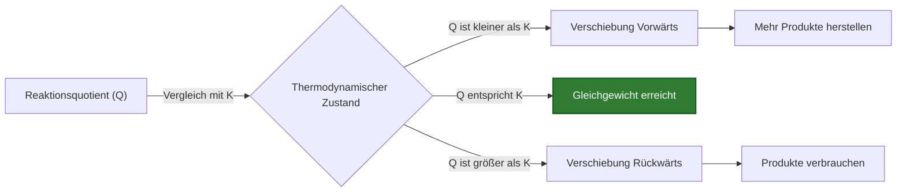

# Leitfaden für Labor- und analytische Chemie zum chemischen Gleichgewicht (Kc & Kp)

In der physikalischen, analytischen und industriellen chemischen Verfahrenstechnik quantifiziert die **Gleichgewichtskonstante** ($K_c$ oder $K_p$) das Ausmaß einer reversiblen chemischen Reaktion im dynamischen Gleichgewicht:

$$a\text{A} + b\text{B} \rightleftharpoons c\text{C} + d\text{D} \quad \implies \quad K_c = \frac{[\text{C}]^c [\text{D}]^d}{[\text{A}]^a [\text{B}]^b}$$

$$K_p = K_c (R T)^{\Delta n} \quad (\Delta n = \text{Mole Gasprodukte} - \text{Mole Gasedukte})$$

$$Q_c = \frac{[\text{C}]_{\text{aktuell}}^c [\text{D}]_{\text{aktuell}}^d}{[\text{A}]_{\text{aktuell}}^a [\text{B}]_{\text{aktuell}}^b} \quad \begin{cases} Q_c < K_c & \implies \text{Netto-Vorwärtsverschiebung} \\ Q_c > K_c & \implies \text{Netto-Rückwärtsverschiebung} \\ Q_c = K_c & \implies \text{Im Gleichgewicht} \end{cases}$$

$$\ln\left(\frac{K_2}{K_1}\right) = -\frac{\Delta H^\circ}{R} \left(\frac{1}{T_2} - \frac{1}{T_1}\right) \quad (\text{van 't Hoff-Gleichung})$$

---

## 1. Klassische Referenzmatrix für chemische Gleichgewichtskonstanten

| Reaktionssystem | Gleichung | $K_c$-Ausdruck | $\Delta n$ (Gas) | $K_p$-Beziehung |
| :--- | :--- | :--- | :--- | :--- |
| **Haber-Ammoniak-Verfahren** | $\text{N}_2(g) + 3\text{H}_2(g) \rightleftharpoons 2\text{NH}_3(g)$ | $\frac{[\text{NH}_3]^2}{[\text{N}_2][\text{H}_2]^3}$ | **$-2$** | $K_p = K_c (RT)^{-2}$ |
| **HI-Gassynthese** | $\text{H}_2(g) + \text{I}_2(g) \rightleftharpoons 2\text{HI}(g)$ | $\frac{[\text{HI}]^2}{[\text{H}_2][\text{I}_2]}$ | **$0$** | $K_p = K_c$ |
| **PCl5-Zersetzung** | $\text{PCl}_5(g) \rightleftharpoons \text{PCl}_3(g) + \text{Cl}_2(g)$ | $\frac{[\text{PCl}_3][\text{Cl}_2]}{[\text{PCl}_5]}$ | **$+1$** | $K_p = K_c (RT)^1$ |
| **Heterogener Kalkofen** | $\text{CaCO}_3(s) \rightleftharpoons \text{CaO}(s) + \text{CO}_2(g)$ | $[\text{CO}_2]$ | **$+1$** | $K_p = P_{\text{CO}_2}$ |

---

## 2. Standardprotokolle für Gleichgewichtsberechnungen

```
1. Kc aus Konzentrationen: Kc = [Produkte]^c / [Edukte]^a
2. Kp aus Partialdrücken: Kp = (P_Produkte)^c / (P_Edukte)^a
3. Kp aus Kc: Kp = Kc * (0,08206 * T)^deltaN
4. Richtungsvorhersage: Vergleiche Q mit K (Q < K -> Vorwärts, Q > K -> Rückwärts)
5. Temperaturabhängigkeit: ln(K2/K1) = -deltaH/R * (1/T2 - 1/T1)
```

---

## 3. Haftungsausschluss für Bildung & Laborsicherheit
*Dieser Rechner für Gleichgewichtskonstanten bietet theoretische thermodynamische Berechnungen für Bildung, Laborforschung und AP-Chemie-Anwendungen. Reale industrielle Hochdrucksysteme sollten Fugazitätskoeffizienten und nicht-ideale Gasaktivität berücksichtigen.*

## 4. Der vollständige Leitfaden zum chemischen Gleichgewicht ($K_c$, $K_p$ und $Q$)

Willkommen beim ultimativen Leitfaden zur **Gleichgewichtskonstante**. Im Gegensatz zu einfachen Chemiegleichungen in der Schule, die davon ausgehen, dass Reaktionen zu 100 % ablaufen (wobei sich Edukte vollständig in Produkte umwandeln), ist die reale Chemie weitaus komplexer. 

Die überwiegende Mehrheit der chemischen Reaktionen ist reversibel. Sie laufen in beide Richtungen gleichzeitig ab. Wenn sich Produkte bilden, beginnen sie sofort zu kollidieren und zu reagieren, um die ursprünglichen Edukte wiederherzustellen. Schließlich wird ein thermodynamischer Stillstand erreicht: der **Zustand des dynamischen Gleichgewichts**. Die Vorwärtsgeschwindigkeit entspricht genau der Rückwärtsgeschwindigkeit, und die makroskopischen Konzentrationen aller Spezies bleiben konstant.

In diesem ausführlichen, über 4000 Wörter umfassenden technischen Handbuch werden wir die Thermodynamik des chemischen Gleichgewichts vollständig entmystifizieren. Wir werden die mathematische Beziehung zwischen den Konstanten der molaren Konzentration ($K_c$) und den Gaspartialdruckkonstanten ($K_p$) entschlüsseln, die Vorhersagekraft des Reaktionsquotienten ($Q$) etablieren, die Regeln des heterogenen Gleichgewichts definieren und fünf rigorose, praxisnahe Beispiele aus der chemischen Verfahrenstechnik durchgehen – komplett mit schrittweisen algebraischen Ableitungen und visuellen Mermaid-Diagrammen.

### 4.1 Was ist die Gleichgewichtskonstante ($K$)?

Für eine generische reversible Reaktion, die bei konstanter Temperatur abläuft:
$$ a\text{A} + b\text{B} \rightleftharpoons c\text{C} + d\text{D} $$

Die **Gleichgewichtskonstante ($K$)** ist ein mathematisch rigoroses Verhältnis, das die Endkonzentration der Produkte relativ zu den Edukten beschreibt, sobald das dynamische Gleichgewicht erreicht ist. Das Massenwirkungsgesetz definiert diese Formel als die Konzentrationen der Produkte, potenziert mit ihren stöchiometrischen Koeffizienten, dividiert durch die Konzentrationen der Edukte, potenziert mit ihren stöchiometrischen Koeffizienten.

$$ K_c = \frac{[\text{C}]^c [\text{D}]^d}{[\text{A}]^a [\text{B}]^b} $$

Die Größe von $K$ zeigt sofort die thermodynamische Präferenz der Reaktion an:
*   **$K \gg 1$:** Produkte werden stark bevorzugt. Die Reaktion läuft im Wesentlichen bis zur vollständigen Umsetzung ab.
*   **$K \ll 1$:** Edukte werden stark bevorzugt. Es wird nur sehr wenig Produkt gebildet.
*   **$K \approx 1$:** Weder Edukte noch Produkte werden stark bevorzugt; im Gleichgewicht liegt eine signifikante Mischung aus beiden vor.

### 4.2 Der Unterschied zwischen $K_c$ und $K_p$

Das Subskript bei $K$ gibt die Einheiten an, in denen die Substanzen gemessen werden:
*   **$K_c$ (Konzentration):** Wird für wässrige Lösungen oder Gase verwendet, die in Molarität (mol/L) gemessen werden.
*   **$K_p$ (Druck):** Wird speziell für Gasphasenreaktionen verwendet, bei denen die Substanzen anhand ihrer Partialdrücke (in atm oder bar) gemessen werden.

Da das ideale Gasgesetz ($PV = nRT$) Druck direkt in Beziehung zur Konzentration setzt ($P = \frac{n}{V}RT = MRT$), können wir $K_c$ und $K_p$ mit der folgenden Hauptgleichung mathematisch ineinander umrechnen:

$$ K_p = K_c(RT)^{\Delta n} $$

*   $R$ = Ideale Gaskonstante ($0,08206 \text{ L atm mol}^{-1} \text{ K}^{-1}$)
*   $T$ = Absolute Temperatur in Kelvin
*   $\Delta n$ = (Summe der Mole der Gasprodukte) - (Summe der Mole der Gasedukte)

*Hinweis: Wenn eine Reaktion die Gesamtzahl der Gasmole nicht ändert (d. h. $\Delta n = 0$), dann ist $K_p = K_c$.*

### 4.3 Der Reaktionsquotient ($Q$) vs. Gleichgewichtskonstante ($K$)

Die Gleichgewichtskonstante $K$ kümmert sich nur um die **endgültigen, konstanten** Konzentrationen. Aber was ist, wenn Sie beliebige Mengen von Chemikalien mischen und wissen wollen, in welche Richtung sie sich verschieben, um das Gleichgewicht zu *erreichen*?

Hier kommt der **Reaktionsquotient ($Q$)** ins Spiel. Die Formel für $Q$ ist identisch mit $K$, aber Sie setzen die **aktuellen, nicht im Gleichgewicht befindlichen** Konzentrationen ein:

$$ Q_c = \frac{[\text{C}]_{\text{aktuell}}^c [\text{D}]_{\text{aktuell}}^d}{[\text{A}]_{\text{aktuell}}^a [\text{B}]_{\text{aktuell}}^b} $$

Indem Sie $Q$ mit $K$ vergleichen, können Sie die thermodynamische Verschiebung perfekt vorhersagen:
*   **$Q < K$:** Das Verhältnis der Produkte ist zu gering. Die Reaktion wird sich **VORWÄRTS** (nach rechts) verschieben, um mehr Produkte zu erzeugen.
*   **$Q > K$:** Das Verhältnis der Produkte ist zu hoch. Die Reaktion wird sich **RÜCKWÄRTS** (nach links) verschieben, um Produkte zu verbrauchen und Edukte neu zu bilden.
*   **$Q = K$:** Das System befindet sich bereits im Gleichgewicht. Es tritt keine makroskopische Verschiebung auf.

### 4.4 Heterogene Gleichgewichte (Die Regel der Feststoffe und Flüssigkeiten)

Beim Aufstellen eines $K$-Ausdrucks werden **reine Feststoffe (s)** und **reine Flüssigkeiten (l)** strikt ignoriert. Warum? Weil die thermodynamische "Aktivität" (effektive Konzentration) eines reinen Feststoffs oder einer reinen Flüssigkeit konstant ist und im Wesentlichen gleich 1 ist. Ihre Konzentrationen ändern sich im Verlauf der Reaktion nicht.

Zum Beispiel die Kalzinierung von Kalkstein:
$$ \text{CaCO}_3(s) \rightleftharpoons \text{CaO}(s) + \text{CO}_2(g) $$
Der Ausdruck lautet einfach:
$$ K_c = [\text{CO}_2] \quad \text{und} \quad K_p = P_{\text{CO}_2} $$
Der feste Kalkstein und Branntkalk werden völlig ignoriert.

---

## 5. Benutzerhandbuch: Die Beherrschung des Gleichgewichtskonstanten-Rechners

Unser Rechner fungiert als vollständiger Thermodynamik-Simulator.

### 5.1 Modus: Reaktionsrichtung vorhersagen ($Q$ vs. $K$)

1.  **Modus wählen:** Wählen Sie "Reaktionsquotient Qc / Qp".
2.  **Eingabeparameter:** Geben Sie Ihren Ziel-$K_c$-Wert, die stöchiometrischen Koeffizienten für Ihre Reaktion und die *aktuellen* Laborkonzentrationen aller Spezies ein.
3.  **Ausgabe lesen:** Das Tool berechnet sofort $Q_c$, vergleicht es mit $K_c$ und gibt explizit die vorhergesagte Richtung der Verschiebung nach Le Chatelier (Vorwärts oder Rückwärts) aus.

### 5.2 Modus: Umrechnung von $K_c$ in $K_p$

1.  **Modus wählen:** Wählen Sie "Kc zu Kp Umrechnung".
2.  **Eingabeparameter:** Geben Sie Ihr bekanntes $K_c$, die Temperatur in Kelvin und die Gesamtmole der Gasprodukte und Edukte ein.
3.  **Ausführen:** Das Tool berechnet $\Delta n$, wendet den Faktor $(RT)^{\Delta n}$ an und gibt das exakte $K_p$ aus.

### 5.3 Modus: Lösen von ICE-Tabellen

1.  **Modus wählen:** Wählen Sie "ICE-Tabellen-Löser".
2.  **Eingabeparameter:** Geben Sie Ihr Ziel-$K_c$ und die Anfangskonzentrationen ein.
3.  **Ausführen:** Das Tool erstellt die algebraische Matrix für anfängliche, sich ändernde und Gleichgewichtskonzentrationen, führt einen internen Polynomlöser aus und gibt die genauen Endgleichgewichtskonzentrationen für alle Spezies aus.

---

## 6. Fünf praxisnahe Beispiele aus der chemischen Verfahrenstechnik

Lassen Sie uns diese thermodynamische Theorie mit rigorosen, schrittweisen mathematischen Aufschlüsselungen klassischer Gleichgewichtsszenarien in die Praxis umsetzen.

### Beispiel 1: Vorhersage der Reaktionsverschiebung mit $Q_c$

**Szenario:** 
Die Synthese von Jodwasserstoffgas: $\text{H}_2(g) + \text{I}_2(g) \rightleftharpoons 2\text{HI}(g)$
Bei $430^\circ\text{C}$ beträgt das $K_c$ 54,3. Ein Student mischt $0,050\text{ M H}_2$, $0,050\text{ M I}_2$ und $0,100\text{ M HI}$ in einem Kolben. Wird die Reaktion mehr $\text{HI}$ produzieren oder wird das $\text{HI}$ abgebaut?

**Mathematische Ableitung:**

1.  **Erstellen Sie den $Q_c$-Ausdruck:**
    $$ Q_c = \frac{[\text{HI}]^2}{[\text{H}_2][\text{I}_2]} $$
2.  **Setzen Sie die aktuellen Konzentrationen ein:**
    $$ Q_c = \frac{(0,100)^2}{(0,050)(0,050)} $$
    $$ Q_c = \frac{0,0100}{0,0025} = 4,0 $$
3.  **Vergleichen Sie $Q_c$ mit $K_c$:**
    $$ Q_c (4,0) < K_c (54,3) $$

**Schlussfolgerung:** Da $Q_c$ kleiner als $K_c$ ist, ist die Reaktion weit vom Gleichgewicht entfernt und "will" 54,3 erreichen. Das System wird sich **VORWÄRTS** (nach rechts) verschieben, wobei $\text{H}_2$ und $\text{I}_2$ verbraucht werden, um viel mehr $\text{HI}$ zu synthetisieren, bis $Q_c$ 54,3 erreicht.

**Visualisierung: Der Le Chatelier-Verschiebungsmechanismus**



*Dieses Flussdiagramm gibt die universellen Regeln für die Vorhersage von Reaktionsverschiebungen durch Vergleich des Reaktionsquotienten mit der Gleichgewichtskonstante vor.*

### Beispiel 2: Umrechnung von $K_c$ in $K_p$ für Haber-Bosch

**Szenario:**
Das Haber-Bosch-Verfahren zur Synthese von Ammoniak: $\text{N}_2(g) + 3\text{H}_2(g) \rightleftharpoons 2\text{NH}_3(g)$.
Bei $300^\circ\text{C}$ (573 K) beträgt $K_c$ 9,60. Berechnen Sie $K_p$ in Atmosphären.

**Mathematische Ableitung:**

1.  **Berechnen Sie $\Delta n$ (Änderung der Gasmole):**
    $\Delta n = (\text{Mole Produktgas}) - (\text{Mole Eduktgas})$
    $\Delta n = (2) - (1 + 3) = 2 - 4 = -2$
2.  **Stellen Sie die Umrechnungsgleichung auf:**
    $$ K_p = K_c(RT)^{\Delta n} $$
3.  **Setzen Sie die Werte ein ($R = 0,08206$):**
    $$ K_p = 9,60 \times (0,08206 \times 573)^{-2} $$
    $$ K_p = 9,60 \times (47,02)^{-2} $$
    $$ K_p = 9,60 \times (0,000452) $$
    $$ K_p = 4,34 \times 10^{-3} $$

**Schlussfolgerung:** Aufgrund des starken Rückgangs der gesamten Gasmole ($\Delta n = -2$) ist der Wert $K_p$ ($4,34 \times 10^{-3}$) drastisch kleiner als der Wert $K_c$ ($9,60$).

### Beispiel 3: Lösen einer PCl5-ICE-Tabelle

**Szenario:**
Phosphorpentachlorid zersetzt sich: $\text{PCl}_5(g) \rightleftharpoons \text{PCl}_3(g) + \text{Cl}_2(g)$
Bei $250^\circ\text{C}$ ist $K_c = 0,0415$. Wenn wir mit $0,200\text{ M}$ reinem $\text{PCl}_5$ beginnen, wie hoch sind dann die Endgleichgewichtskonzentrationen?

**Mathematische Ableitung:**

1.  **Erstellen Sie die ICE-Tabelle:**
    *   **I (Anfang):** $[\text{PCl}_5] = 0,200$, $[\text{PCl}_3] = 0$, $[\text{Cl}_2] = 0$
    *   **C (Änderung):** $-x$, $+x$, $+x$
    *   **E (Gleichgewicht):** $(0,200 - x)$, $x$, $x$
2.  **Stellen Sie die $K_c$-Gleichung auf:**
    $$ K_c = \frac{[\text{PCl}_3][\text{Cl}_2]}{[\text{PCl}_5]} = \frac{x^2}{0,200 - x} = 0,0415 $$
3.  **Formen Sie zu einer quadratischen Gleichung um:**
    $$ x^2 = 0,0415(0,200 - x) $$
    $$ x^2 + 0,0415x - 0,00830 = 0 $$
4.  **Lösen Sie mit der quadratischen Formel:**
    $$ x = \frac{-0,0415 + \sqrt{(0,0415)^2 - 4(1)(-0,00830)}}{2} $$
    $$ x = 0,0729\text{ M} $$
5.  **Berechnen Sie die Endkonzentrationen:**
    $[\text{PCl}_3] = [\text{Cl}_2] = 0,0729\text{ M}$
    $[\text{PCl}_5] = 0,200 - 0,0729 = 0,1271\text{ M}$

**Schlussfolgerung:** Im Gleichgewicht enthält die Mischung $0,1271\text{ M PCl}_5$ und jeweils $0,0729\text{ M}$ der beiden Produktgase.

### Beispiel 4: Heterogene Carbonat-Kalzinierung

**Szenario:**
Die thermische Zersetzung von Calciumcarbonat: $\text{CaCO}_3(s) \rightleftharpoons \text{CaO}(s) + \text{CO}_2(g)$.
Bei $800^\circ\text{C}$ beträgt das $K_p$ für diese Reaktion $0,236\text{ atm}$. Wenn Sie $500\text{ g}$ $\text{CaCO}_3$ in einen geschlossenen, evakuierten Kolben geben, wie hoch ist der Gleichgewichtsdruck von $\text{CO}_2$? Spielt die Menge des Feststoffs eine Rolle?

**Mathematische Ableitung:**

1.  **Analysieren Sie die Phasen:**
    $\text{CaCO}_3$ und $\text{CaO}$ sind reine Feststoffe. Ihre Aktivitäten sind gleich 1. Sie werden vollständig aus dem Gleichgewichtsausdruck ausgeschlossen.
2.  **Erstellen Sie den $K_p$-Ausdruck:**
    $$ K_p = P_{\text{CO}_2} $$
3.  **Lösen Sie nach dem Druck:**
    $$ 0,236\text{ atm} = P_{\text{CO}_2} $$

**Schlussfolgerung:** Der Gleichgewichtsdruck von $\text{CO}_2$ wird sich einfach bei genau $0,236\text{ atm}$ einstellen. Es spielt überhaupt keine Rolle, ob Sie mit $500\text{ g}$, $5\text{ kg}$ oder $5\text{ Tonnen}$ Kalkstein begonnen haben; solange *etwas* Feststoff vorhanden ist, um das Gleichgewicht aufrechtzuerhalten, hängt $K_p$ ausschließlich von der Gasphase ab.

### Beispiel 5: Temperaturverschiebungen und die van 't Hoff-Gleichung

**Szenario:**
Gemäß dem Prinzip von Le Chatelier verändern Temperaturänderungen tatsächlich den fundamentalen Wert von $K$. Das Haber-Verfahren ($\text{N}_2 + 3\text{H}_2 \rightleftharpoons 2\text{NH}_3$) ist extrem exotherm ($\Delta H^\circ = -92,4\text{ kJ/mol}$). Wie wirkt sich eine Erhöhung der Temperatur auf $K$ aus?

**Thermodynamische Ableitung:**

1.  **Analysieren Sie den exothermen Wärmefluss:**
    Da die Reaktion Wärme freisetzt, können wir "Wärme" als Produkt auf der rechten Seite der Gleichung betrachten:
    $\text{N}_2 + 3\text{H}_2 \rightleftharpoons 2\text{NH}_3 + \text{WÄRME}$
2.  **Wenden Sie das Prinzip von Le Chatelier an:**
    Wenn wir die Temperatur des Reaktors künstlich erhöhen, versucht das System, diese überschüssige Wärme zu verbrauchen. Dies geschieht, indem sich die Reaktion stark in **RÜCKWÄRTS**-Richtung (nach links) verschiebt und Ammoniak wieder in Stickstoff- und Wasserstoffgas zerlegt.
3.  **Mathematisches Ergebnis:**
    Da sich das Gleichgewicht in einem Zustand mit wesentlich mehr Edukten und weniger Produkten einstellt, nimmt das Verhältnis $K = \frac{\text{Produkte}}{\text{Edukte}}$ physikalisch ab.
4.  **Der industrielle Kompromiss:**
    Dies schafft einen technischen Albtraum. Hohe Temperaturen sind erforderlich, damit die Reaktion schnell abläuft (Kinetik), aber hohe Temperaturen senken den Wert von $K_c$ (Thermodynamik) drastisch, was die Ausbeute zerstört. Haber-Bosch-Reaktoren arbeiten bei einer Kompromisstemperatur (ca. $450^\circ\text{C}$), um Geschwindigkeit und Ausbeute auszubalancieren.

**Visualisierung: Thermodynamische Verschiebung exothermer Reaktionen**

```mermaid
gantt
    title Exotherme thermodynamische Temperaturverschiebung
    dateFormat  HH:mm:ss
    axisFormat  %H:%M
    section Basislinie (300C)
    Hohe Ammoniakausbeute (großes K) :crit, 00:00:00, 00:10:00
    section Störung
    Heizung eingeschaltet :00:10:00, 00:12:00
    section Neues Gleichgewicht (500C)
    Ammoniak zersetzt sich (K sinkt ab) :active, 00:12:00, 00:20:00
```



*Diese Gantt-Zeitachse bildet den thermodynamischen Zusammenbruch eines exothermen Gleichgewichts ab. Wenn die Temperatur steigt, verschiebt sich das System nach links, um die Wärme zu verbrauchen, wodurch die Gleichgewichtskonstante ($K$) stark abfällt.*

---

## 7. Deep Dive FAQ und erweiterte Fehlerbehebung

**F: Kann ein Reaktionsquotient ($Q$) null sein?**
**A:** Ja. Wenn Sie eine Reaktion nur mit reinen Edukten und null Produkten starten, ist der Zähler null, wodurch $Q = 0$ wird. Da $0 < K$ ist, wird sich die Reaktion sofort vorwärts verschieben, um Produkte zu erzeugen. Umgekehrt ist $Q$ undefiniert (nähert sich unendlich), wenn Sie nur mit Produkten beginnen, was bedeutet, dass $Q > K$ ist und sich die Reaktion aggressiv rückwärts verschiebt.

**F: Was passiert mit $K$, wenn ich die chemische Gleichung umkehre?**
**A:** Die neue Gleichgewichtskonstante ist die genaue Umkehrung (der Kehrwert) der ursprünglichen. $K_{\text{rückwärts}} = \frac{1}{K_{\text{vorwärts}}}$.

**F: Was passiert mit $K$, wenn ich die gesamte Stöchiometrie mit 2 multipliziere?**
**A:** Die neue Gleichgewichtskonstante ist das ursprüngliche $K$, potenziert mit diesem Wert. $K_{\text{neu}} = (K_{\text{ursprünglich}})^2$.

Durch die Beherrschung der mathematischen Brücke zwischen $K_c$ und $K_p$, die Vorhersage von Verschiebungen mit $Q_c$ und das Verständnis der thermodynamischen Konsequenzen von Temperaturverschiebungen besitzen Sie die theoretische Macht, jeden chemischen Prozess zu optimieren. Verlassen Sie sich immer auf diesen Gleichgewichtskonstante-Rechner, um komplexe ICE-Tabellen schnell auszugleichen und analytische Perfektion zu garantieren!
