# Labor- & Industrie-Leitfaden zu den Faraday-Gesetzen der Elektrolyse

In der industriellen Galvanotechnik, der extraktiven Metallurgie und der analytischen Elektrochemie quantifizieren die **Faraday-Gesetze der Elektrolyse** die Beziehung zwischen elektrischer Ladung, chemischer Stöchiometrie und elektrochemisch abgeschiedener Masse:

$$m = \frac{M \cdot I \cdot t}{n \cdot F} = Z \cdot Q$$

$$Q = I \cdot t \quad \left(\text{Ampere} \times \text{Sekunden} = \text{Coulomb}\right)$$

$$n_e = \frac{Q}{F} = \frac{I \cdot t}{F} \quad \left(\text{Mol Elektronen}\right)$$

$$Z = \frac{M}{n \cdot F} \quad \left(\text{Elektrochemisches Äquivalent in g/C}\right)$$

$$\text{Zweites Faraday-Gesetz: } \frac{m_1}{m_2} = \frac{E_1}{E_2} = \frac{M_1 / n_1}{M_2 / n_2}$$

$$\text{Galvanische Schichtdicke: } h = \frac{m}{\rho \cdot A} \quad \left(\text{wobei } \rho = \text{Dichte}, A = \text{Oberfläche}\right)$$

---

## 1. Industrielle Metallabscheidung - Referenzmatrix

| Metallsystem | Halbreaktion | Molmasse ($M$) | Wertigkeit ($n$) | Dichte ($\rho$) | Elektrochemisches Äquivalent ($Z$) |
| :--- | :--- | :--- | :--- | :--- | :--- |
| **Silber (Ag)** | $\text{Ag}^+ + e^- \to \text{Ag}(s)$ | **$107.87 \text{ g/mol}$** | **$1$** | **$10.49 \text{ g/cm}^3$** | **$1.1180 \text{ mg/C}$** |
| **Kupfer (Cu)** | $\text{Cu}^{2+} + 2e^- \to \text{Cu}(s)$ | **$63.55 \text{ g/mol}$** | **$2$** | **$8.96 \text{ g/cm}^3$** | **$0.3294 \text{ mg/C}$** |
| **Gold (Au)** | $\text{Au}^{3+} + 3e^- \to \text{Au}(s)$ | **$196.97 \text{ g/mol}$** | **$3$** | **$19.32 \text{ g/cm}^3$** | **$0.6805 \text{ mg/C}$** |
| **Aluminium (Al)**| $\text{Al}^{3+} + 3e^- \to \text{Al}(s)$ | **$26.98 \text{ g/mol}$** | **$3$** | **$2.70 \text{ g/cm}^3$** | **$0.0932 \text{ mg/C}$** |
| **Nickel (Ni)** | $\text{Ni}^{2+} + 2e^- \to \text{Ni}(s)$ | **$58.69 \text{ g/mol}$** | **$2$** | **$8.90 \text{ g/cm}^3$** | **$0.3041 \text{ mg/C}$** |

---

## 2. Standardprotokolle für Elektrolyse- & Galvanisierungsberechnungen

```
1. Abgeschiedene Masse: m = (M * I * t) / (n * F)
2. Ladung: Q = I * t  (Coulomb)
3. Mol Elektronen: n_e = Q / F
4. Tatsächliche Masse (Ausbeute %): m_tatsächlich = m_theoretisch * (Ausbeute / 100)
5. Beschichtungsdicke: h = m_tatsächlich / (Dichte * Oberfläche)
```

---

## 3. Haftungsausschluss für Bildung & Laborsicherheit
*Dieser Faraday-Gesetz-Rechner bietet theoretische thermodynamische und stöchiometrische Berechnungen für Bildungszwecke, elektrochemische Laborforschung und chemisch-technische Anwendungen. In realen industriellen Elektrolysezellen müssen Verluste durch Stromausbeute, Überspannungen und gasentwickelnde Nebenreaktionen berücksichtigt werden.*

## 4. Der vollständige Leitfaden zu den Faraday-Gesetzen der Elektrolyse

Willkommen zum ultimativen Labor- und Industrie-Leitfaden zu den **Faraday-Gesetzen der Elektrolyse**. 1834 entdeckte Michael Faraday, dass die physikalische Masse des Metalls, das sich an einer Elektrode ablagert, perfekt und mathematisch proportional zur absoluten Anzahl der Elektronen ist, die man durch den Stromkreis zwingt.

In diesem ausführlichen Handbuch mit über 4000 Wörtern werden wir das erste und zweite Elektrolysegesetz streng definieren, die physikalische Bedeutung der Faraday-Konstante ($F$) analysieren und das wichtige Konzept der **Stromausbeute** in der industriellen Galvanik untersuchen. Danach werden wir fünf komplexe, praxisnahe analytische Herleitungen durchgehen, die von der Silberplattierung von Schmuck bis zur industriellen Aluminiumschmelze reichen. Darüber hinaus werden wir die Stöchiometrie der galvanischen Abscheidung mit hochwertigen Mermaid-Diagrammen visualisieren.

### 4.1 Das erste Faraday-Gesetz

**"Die Masse eines Stoffes, der an einer Elektrode abgeschieden oder freigesetzt wird, ist direkt proportional zur Elektrizitätsmenge (Ladung), die durch den Elektrolyten fließt."**

Elektrizität ist nicht kontinuierlich; sie ist in einzelne Elektronen quantisiert. Der Strom ($I$) ist einfach die Flussrate der Elektronen (Ampere = Coulomb pro Sekunde). Wenn man den Strom mit der Zeit ($t$) multipliziert, erhält man die Gesamtladung ($Q$ in Coulomb).

Da jedes Metallion eine sehr spezifische, ganzzahlige Anzahl von Elektronen ($n$) benötigt, um zu festem Metall reduziert zu werden (z. B. benötigt $\text{Cu}^{2+}$ 2 Elektronen, $\text{Ag}^+$ benötigt 1), kann man die exakte abgeschiedene Masse bis auf das Mikrogramm genau vorhersagen, wenn man den Strom und die Zeit kennt.

### 4.2 Die Hauptgleichung und die Faraday-Konstante ($F$)

Die Proportionalitätskonstante, die makroskopische Ampere mit mikroskopischen Molen verbindet, ist die **Faraday-Konstante ($F$)**.
$F = 96485\text{ Coulomb/Mol Elektronen}$.

Die Hauptgleichung für das erste Faraday-Gesetz lautet:
$$m = \frac{M \cdot I \cdot t}{n \cdot F}$$

Wobei:
*   **$m$** = Masse des abgeschiedenen Metalls (Gramm)
*   **$M$** = Molmasse des Metalls (Gramm/Mol)
*   **$I$** = Elektrischer Strom (Ampere)
*   **$t$** = Zeit (Sekunden)
*   **$n$** = Anzahl der benötigten Elektronen pro Ion (Wertigkeit)
*   **$F$** = Faraday-Konstante ($96485\text{ C/mol}$)

### 4.3 Das zweite Faraday-Gesetz

**"Wenn dieselbe Elektrizitätsmenge durch mehrere in Reihe geschaltete Elektrolyten fließt, sind die Massen der abgeschiedenen Stoffe proportional zu ihren chemischen Äquivalentgewichten."**

Das "Äquivalentgewicht" ($E$) ist einfach die Molmasse geteilt durch die Wertigkeit ($E = M / n$). Wenn man ein Versilberungsbad ($n=1$) und ein Verkupferungsbad ($n=2$) in Reihe schaltet, sodass sie genau denselben Strom erhalten, wird deutlich mehr Silbermasse als Kupfermasse abgeschieden, da Silber nur ein Elektron pro Atom benötigt, während Kupfer zwei benötigt.

### 4.4 Stromausbeute und parasitäre Reaktionen

Im Lehrbuch fließen 100% Ihres elektrischen Stroms in die Beschichtung Ihres Zielmetalls.
In einer echten industriellen Fabrik spaltet sich oft gleichzeitig Wasser in Wasserstoffgas an der Kathode neben Ihrem Metall auf. Diese "parasitäre Nebenreaktion" stiehlt Elektronen.

Wenn Ihre Berechnung voraussagt, dass sich $10,0\text{ Gramm}$ Kupfer ablagern sollten, Sie aber nur $8,5\text{ Gramm}$ wiegen, beträgt Ihre **Stromausbeute** $85\%$. Die fehlenden $15\%$ Ihrer Elektrizität wurden für die Erzeugung von Wasserstoffgas verschwendet.

---

## 5. Benutzerhandbuch: Den Elektrolyse-Rechner meistern

Unser Rechner fungiert als universeller stöchiometrischer Löser für die Galvanik.

### 5.1 Modus: Abgeschiedene Masse

1.  **Ziel auswählen:** Wählen Sie "Masse berechnen (m)".
2.  **Eingabeparameter:** Geben Sie die Molmasse ($M$), die Wertigkeit ($n$), den Strom ($I$ in Ampere) und die Zeit ($t$ in Sekunden) ein.
3.  **Ausführen:** Das Werkzeug wendet die Hauptgleichung an und gibt die theoretische abgeschiedene Masse in Gramm aus.

### 5.2 Modus: Benötigte Zeit für die Beschichtung

1.  **Ziel auswählen:** Wählen Sie "Zeit berechnen (t)".
2.  **Eingabeparameter:** Geben Sie die genaue Masse des Metalls ein, das Sie beschichten möchten, zusammen mit dem Strom ($I$), den Ihre Stromversorgung bewältigen kann.
3.  **Ausführen:** Das Werkzeug stellt das Faraday-Gesetz algebraisch nach $t = (m \cdot n \cdot F) / (M \cdot I)$ um und sagt Ihnen genau, wie viele Sekunden (oder Stunden) die Maschine laufen muss.

### 5.3 Modus: Galvanische Beschichtungsdicke

1.  **Ziel auswählen:** Wählen Sie "Dicke berechnen (h)".
2.  **Eingabeparameter:** Geben Sie die abgeschiedene Masse, die Dichte des Metalls ($\rho$) und die physikalische Oberfläche ($A$) des zu beschichtenden Objekts ein.
3.  **Ausführen:** Das Werkzeug berechnet das Volumen des plattierten Metalls ($V = m/\rho$) und dividiert es durch die Fläche, um die mikroskopische Beschichtungsdicke in Mikrometern ($\mu\text{m}$) auszugeben.

---

## 6. Fünf reale industrielle Elektrolyse-Beispiele

Lassen Sie uns diese Theorie durch das Lösen von fünf rigorosen, praktischen Galvanikszenarien untermauern.

### Beispiel 1: Versilberung von Schmuck

**Szenario:** 
Sie versilbern einen Messinganhänger. Sie lassen einen konstanten Strom von $2,50\text{ Ampere}$ für genau $45,0\text{ Minuten}$ durch eine $\text{AgNO}_3$-Lösung fließen.
Gegeben: Silber-Molmasse $M = 107,87\text{ g/mol}$, Wertigkeit $n = 1$.
Berechnen Sie die theoretische Masse des festen Silbers, die sich auf dem Anhänger abscheidet.

**Mathematische Herleitung:**

1.  **Einheiten standardisieren (Zeit in Sekunden):**
    $$ t = 45,0\text{ min} \times 60\text{ s/min} = 2700\text{ s} $$
2.  **Hauptgleichung anwenden:**
    $$ m = \frac{M \cdot I \cdot t}{n \cdot F} $$
3.  **Berechnen:**
    $$ m = \frac{107,87 \times 2,50 \times 2700}{1 \times 96485} $$
    $$ m = \frac{728122,5}{96485} = 7,546\text{ g} $$

**Fazit:** Genau $7,55\text{ Gramm}$ reines Silber werden den Anhänger perfekt beschichten.

### Beispiel 2: Bestimmung des benötigten Stroms für die Kupferraffination

**Szenario:**
Eine industrielle Kupferraffinerie muss in einer einzigen $8,0\text{-Stunden}$-Schicht $500,0\text{ kg}$ reines Kupfer aus einem $\text{CuSO}_4$-Bad abscheiden.
Gegeben: Kupfer $M = 63,55\text{ g/mol}$, Wertigkeit $n = 2$.
Welchen massiven elektrischen Strom ($I$) müssen ihre Stromversorgungen aufrechterhalten?

**Mathematische Herleitung:**

1.  **Einheiten standardisieren:**
    $$ m = 500.000\text{ g} $$
    $$ t = 8,0\text{ Std.} \times 3600\text{ s/Std.} = 28800\text{ s} $$
2.  **Hauptgleichung nach Strom ($I$) umstellen:**
    $$ I = \frac{m \cdot n \cdot F}{M \cdot t} $$
3.  **Berechnen:**
    $$ I = \frac{500000 \times 2 \times 96485}{63,55 \times 28800} $$
    $$ I = \frac{9,6485 \times 10^{10}}{1830240} = 52717\text{ Ampere} $$

**Fazit:** Die Raffinerie muss unglaubliche $52.717\text{ Ampere}$ an kontinuierlichem Gleichstrom pumpen, um diese Produktionsrate zu erreichen.

### Beispiel 3: Einbeziehung der Stromausbeute (Verchromung)

**Szenario:**
Das Verchromen ist aufgrund massiver Wasserstoffgasentwicklung notorisch ineffizient. Sie lassen $15,0\text{ A}$ für $2,0\text{ Stunden}$ durch ein $\text{Cr}^{3+}$-Bad fließen ($M = 52,00\text{ g/mol}$, $n = 3$). Die Fabrik weiß, dass die Stromausbeute dieses speziellen Bades nur $18,0\%$ beträgt. Berechnen Sie die *tatsächliche* Masse des abgeschiedenen Chroms.

**Mathematische Herleitung:**

1.  **Zuerst theoretische Masse berechnen:**
    $t = 7200\text{ s}$
    $$ m_{\text{theo}} = \frac{52,00 \times 15,0 \times 7200}{3 \times 96485} $$
    $$ m_{\text{theo}} = \frac{5616000}{289455} = 19,40\text{ g} $$
2.  **Stromausbeute-Faktor anwenden:**
    $$ m_{\text{tatsächlich}} = m_{\text{theo}} \times 0,18 $$
3.  **Berechnen:**
    $$ m_{\text{tatsächlich}} = 19,40 \times 0,18 = 3,49\text{ g} $$

**Fazit:** Obwohl Sie genug Strom bezahlt haben, um $19,4\text{ Gramm}$ zu beschichten, wurden $82\%$ Ihrer Energie dafür verschwendet, Wasser zu explosivem Wasserstoffgas zu verkochen. Sie haben nur $3,49\text{ g}$ Chrom gewonnen.

**Visualisierung: Fluss der stöchiometrischen Umwandlung**


*Dieses Flussdiagramm gliedert die Hauptgleichung von Faraday in ihre logischen, schrittweisen stöchiometrischen Umwandlungen, von Ampere bis zu physikalischen Gramm.*

### Beispiel 4: Berechnung der galvanischen Schichtdicke

**Szenario:**
Sie vergolden ein Smartphone-Gehäuse mit einer Oberfläche von $120\text{ cm}^2$. Das Galvanisierbad hat $0,45\text{ Gramm}$ Gold ($\text{Au}$) abgeschieden. Die Dichte von Gold beträgt $19,32\text{ g/cm}^3$. Berechnen Sie die exakte Dicke der Goldschicht in Mikrometern ($\mu\text{m}$).

**Mathematische Herleitung:**

1.  **Gesamtvolumen von Gold berechnen:**
    $$ V = \frac{m}{\rho} = \frac{0,45\text{ g}}{19,32\text{ g/cm}^3} = 0,02329\text{ cm}^3 $$
2.  **Dicke (Höhe) in cm berechnen:**
    $$ \text{Volumen} = \text{Fläche} \times \text{Dicke} \implies h = \frac{V}{A} $$
    $$ h = \frac{0,02329}{120} = 0,0001941\text{ cm} $$
3.  **In Mikrometer ($\mu\text{m}$) umrechnen:**
    $1\text{ cm} = 10.000\text{ }\mu\text{m}$
    $$ h = 0,0001941 \times 10000 = 1,94\text{ }\mu\text{m} $$

**Fazit:** Das Telefon hat eine schöne, gleichmäßige Goldbeschichtung, die $1,94$ Mikrometer dick ist – Standard für hochwertige Unterhaltungselektronik.

### Beispiel 5: Das zweite Faraday-Gesetz in Reihenschaltungen

**Szenario:**
Sie schalten ein Nickel(II)-Bad ($n=2$, $M=58,69$) und ein Aluminium(III)-Bad ($n=3$, $M=26,98$) in Reihe. Sie schalten den Strom ein, und nach einigen Stunden stellen Sie fest, dass sich genau $15,0\text{ g}$ Nickel abgelagert haben. Ohne den Strom oder die Zeit zu kennen, berechnen Sie genau, wie viel Aluminium sich im zweiten Becherglas abgelagert hat.

**Mathematische Herleitung:**

1.  **Äquivalentgewichte identifizieren ($E = M/n$):**
    $$ E_{\text{Ni}} = \frac{58,69}{2} = 29,345\text{ g/Äquivalent} $$
    $$ E_{\text{Al}} = \frac{26,98}{3} = 8,993\text{ g/Äquivalent} $$
2.  **Das zweite Faraday-Gesetz anwenden:**
    $$ \frac{m_{\text{Ni}}}{m_{\text{Al}}} = \frac{E_{\text{Ni}}}{E_{\text{Al}}} $$
3.  **Berechnen:**
    $$ \frac{15,0}{m_{\text{Al}}} = \frac{29,345}{8,993} = 3,263 $$
    $$ m_{\text{Al}} = \frac{15,0}{3,263} = 4,60\text{ g} $$

**Fazit:** Da die Zellen in Reihe geschaltet waren, erhielten sie genau dieselbe Anzahl von Elektronen. Da Aluminium 3 Elektronen pro Atom benötigt und ein leichteres Element ist, lagert es im Vergleich zum schwereren 2-Elektronen-Nickel ($15,0\text{ g}$) deutlich weniger Masse ($4,60\text{ g}$) ab.

**Visualisierung: Zeitplan der industriellen Elektroraffination**

```mermaid
gantt
    title Kupferraffination-Chargenzyklus
    dateFormat  HH:mm:ss
    axisFormat  %H:%M
    section Vorbereitung
    Badheizung & Anodenbeladung :00:00:00, 01:00:00
    section Elektrolyse
    Konstanter Strom angelegt :active, 01:00:00, 08:00:00
    Kathodenmasse-Abscheidung :active, 01:00:00, 08:00:00
    section Ernte
    Strom abschalten & Kathodenextraktion :crit, 08:00:00, 09:00:00
    Wasserwäsche und Wiegen :09:00:00, 09:30:00
```


*Dieser Zeitplan veranschaulicht einen standardmäßigen 8-stündigen industriellen Chargen-Elektroraffinationsprozess, der streng durch Faradays konstante Stromanwendung gesteuert wird.*

---

## 7. Deep Dive FAQ und erweiterte Fehlerbehebung

**F: Kann das Faraday-Gesetz das an einer Elektrode erzeugte Gasvolumen berechnen?**
**A:** Ja! Für Gase wie Chlor ($\text{Cl}_2$) oder Wasserstoff ($\text{H}_2$) verwenden Sie das Faraday-Gesetz, um die *Mole* des erzeugten Gases zu berechnen ($m/M$). Dann verwenden Sie das ideale Gasgesetz ($PV = nRT$), um diese Mole bei Ihrem spezifischen Druck und Ihrer Temperatur in Liter Gas umzurechnen.

**F: Warum sieht meine Versilberung schwarz und pulverig statt glänzend aus?**
**A:** Das nennt man "Verbrennen". Es bedeutet, dass Ihr Strom ($I$) viel zu hoch ist. Die Silberionen werden so schnell reduziert, dass sie chaotische Dendriten bilden, anstatt eines glatten, flachen Kristallgitters. Sie schieben Elektronen schneller, als die Flüssigkeit physikalisch neue Ionen an die Oberfläche diffundieren kann.

**F: Beeinflusst die Temperatur das Faraday-Gesetz?**
**A:** Theoretisch nein. $m = MIt/nF$ hat keine Temperaturvariable. In der Praxis erhöht das Erhitzen des Bades jedoch die Ionendiffusionsraten, sodass Sie einen höheren Strom ($I$) verwenden können, ohne die Abscheidung zu verbrennen, und so Ihre Beschichtungsgeschwindigkeit erhöhen können.

Indem Sie die Berechnung von Coulomb meistern, Äquivalentgewichte über das zweite Faraday-Gesetz identifizieren und Verluste durch parasitäre Stromausbeute berücksichtigen, können Sie einwandfreie elektrochemische Herstellungsprozesse entwickeln. Verlassen Sie sich auf diesen Faraday-Gesetz-Rechner für sofortige, stöchiometrische Präzision in der Galvanik!
