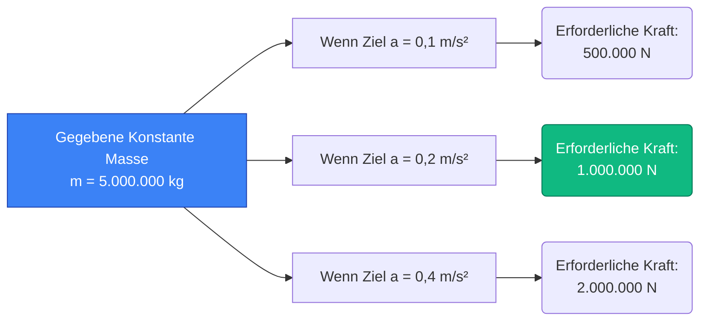
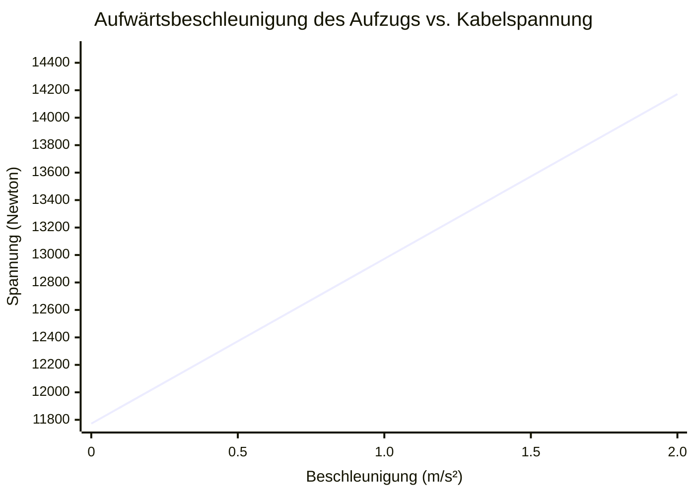
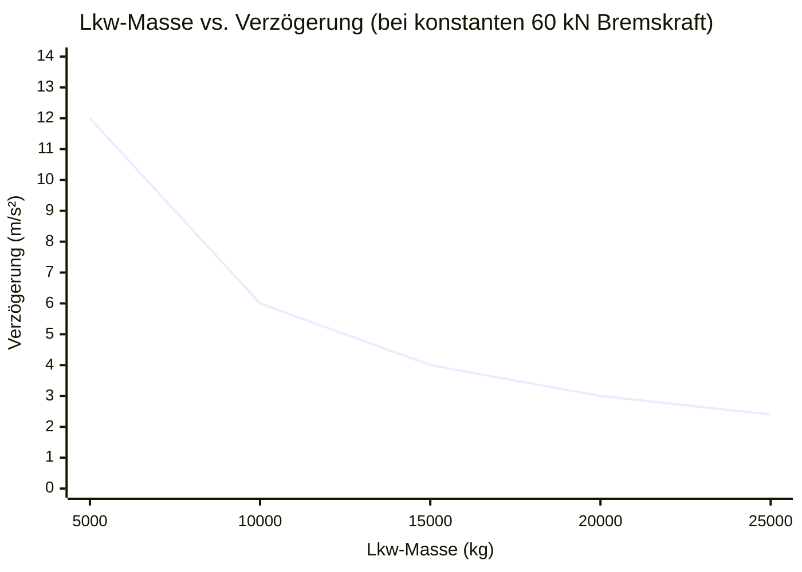

# Der ultimative Kraftrechner: Newtons zweites Gesetz und Vektormechanik meistern

Willkommen beim ultimativen **Kraftrechner** und umfassenden Physik-Leitfaden. Egal, ob Sie ein Luft- und Raumfahrtingenieur sind, der die genauen Meganewton Schub berechnet, die erforderlich sind, um einen Satelliten in die Umlaufbahn zu bringen, ein Automobildesigner, der Bremsreibung analysiert, oder ein Physikstudent, der sich auf eine anspruchsvolle Abschlussprüfung über Newtons Bewegungsgesetze vorbereitet – dieses Werkzeug ist für absolute Präzision konstruiert.

Kraft ist die grundlegende Wechselwirkung, die alle Veränderungen im physischen Universum antreibt. Ohne Kraft ist das Universum vollkommen statisch – Objekte in Ruhe bleiben genau dort, wo sie sind, und Objekte, die sich durch ein Vakuum bewegen, setzen sich ewig mit der gleichen Geschwindigkeit fort. Kraft bricht diese Trägheit.

In diesem massiven Deep-Dive mit über 4.000 Wörtern werden wir das Konzept der mechanischen Kraft vollständig dekonstruieren. Wir werden die mathematischen Grundlagen von Newtons zweitem Gesetz ($F = m \cdot a$) untersuchen, den Unterschied zwischen Nettokraft und ausgeglichener Kraft analysieren, Sie durch fortgeschrittene Berechnungsstrategien führen und fünf reale Ingenieurbeispiele durchgehen, die mit detaillierten Mermaid.js-Diagrammen visualisiert werden.

---

## 1. Die Physik der Kraft: Trägheit brechen

Um Kraft zu verstehen, müssen wir zunächst die Trägheit verstehen, wie sie durch **Sir Isaac Newtons erstes Bewegungsgesetz** definiert ist:
> *Ein Objekt in Ruhe bleibt in Ruhe, und ein Objekt in Bewegung bleibt in Bewegung mit der gleichen Geschwindigkeit und in der gleichen Richtung, sofern nicht eine unausgeglichene Kraft auf es einwirkt.*

Kraft ist der Mechanismus, mit dem wir die Trägheit überwinden. Sie ist eine **vektorielle Größe**, was bedeutet, dass sie sowohl einen Betrag (wie stark das Schieben oder Ziehen ist) als auch eine Richtung (wohin das Schieben oder Ziehen zielt) besitzt.

### Ausgeglichene vs. Unausgeglichene Kräfte
Stellen Sie sich einen schweren Tresor vor, der auf dem Boden ruht. Die Schwerkraft zieht den Tresor mit einer Kraft von $10.000\text{ N}$ nach unten in Richtung des Erdmittelpunkts. Der massive Betonboden drückt mit einer Normalkraft von genau $10.000\text{ N}$ nach oben gegen den Tresor.
Da die nach oben gerichtete Kraft die nach unten gerichtete Kraft perfekt aufhebt, ist die **Nettokraft** genau null ($0\text{ N}$). Dies sind **ausgeglichene Kräfte**. Daher beschleunigt der Tresor nicht; er bleibt genau dort, wo er ist.

Stellen Sie sich nun vor, Sie befestigen eine Winde am Tresor und ziehen ihn horizontal mit einer Kraft von $500\text{ N}$ nach rechts. Die Reibung des Bodens leistet mit einer Kraft von $200\text{ N}$ nach links Widerstand.
Die horizontalen Kräfte sind nicht mehr im Gleichgewicht. Sie haben eine **Nettokraft** von $300\text{ N}$, die nach rechts drückt. Da es eine unausgeglichene Nettokraft gibt, wird der Tresor sofort beginnen, nach rechts zu beschleunigen.

### Die vier Grundkräfte der Natur
Während sich unser Rechner mit makroskopischer klassischer Mechanik befasst (oft als Kontaktkräfte oder angewandte Kräfte bezeichnet), stammen alle Kräfte im Universum aus vier grundlegenden Wechselwirkungen:
1. **Die starke Kernkraft:** Die stärkste Kraft, die Protonen und Neutronen in Atomkernen zusammenhält.
2. **Elektromagnetismus:** Die Kraft, die zwischen elektrisch geladenen Teilchen wirkt (dies ist auf molekularer Ebene die Grundursache für Reibung, Zugspannung und Normalkraft).
3. **Die schwache Kernkraft:** Verantwortlich für radioaktiven Zerfall.
4. **Gravitation:** Die schwächste Kraft, aber die einzige mit unendlicher Reichweite, die bewirkt, dass Masse andere Masse anzieht.

---

## 2. Die mathematischen Grundlagen: Newtons zweites Gesetz

Wenn das erste Gesetz definiert, was passiert, wenn *keine* Nettokraft vorhanden ist, definiert **Newtons zweites Gesetz** genau, was passiert, wenn eine Nettokraft *vorhanden* ist.

Das zweite Gesetz besagt, dass die Beschleunigung eines Objekts direkt proportional zur Nettokraft ist, die auf es einwirkt, und umgekehrt proportional zu seiner Masse. Mathematisch wird dies wie folgt ausgedrückt:

$$ F = m \cdot a $$

Wobei:
- **$F$** = Nettokraft (gemessen in Newton, $N$)
- **$m$** = Masse (gemessen in Kilogramm, $kg$)
- **$a$** = Beschleunigung (gemessen in Metern pro Sekunde im Quadrat, $m/s^2$)

### Die proportionale Beziehung
Die Gleichung $F = m \cdot a$ ist elegant einfach, aber zutiefst wirkungsvoll. Sie sagt uns zwei entscheidende Dinge über das Universum:
1. **Direkte Proportionalität:** Wenn Sie die Beschleunigung eines bestimmten Objekts verdoppeln möchten, müssen Sie die angewandte Kraft verdoppeln.
2. **Umgekehrte Proportionalität:** Wenn Sie exakt dieselbe Kraft auf ein Objekt anwenden, das doppelt so massiv ist, beschleunigt es nur halb so schnell.

### Ableitung von Masse und Beschleunigung
Mit grundlegender Algebra können wir Newtons zweites Gesetz umstellen, um die anderen Variablen zu berechnen.

Um die Masse zu finden, wenn Kraft und Beschleunigung bekannt sind:
$$ m = \frac{F}{a} $$

Um die Beschleunigung zu finden, wenn Kraft und Masse bekannt sind:
$$ a = \frac{F}{m} $$

Unser dynamischer Rechner handhabt alle drei Permutationen sofort.

---

## 3. Umfassender Leitfaden zur Nutzung: Das Potenzial des Rechners maximieren

Unser interaktiver Kraftrechner ist darauf ausgelegt, einfache Hausaufgabenkontrollen und komplexe technische Belastungsanalysen zu bewältigen. Hier ist eine Schritt-für-Schritt-Anleitung zur Nutzung seiner erweiterten Funktionen.

### Schritt 1: Wählen Sie Ihre Zielvariable
Wählen Sie oben auf der Benutzeroberfläche aus, was Sie berechnen möchten:
- **Nach Kraft (F) auflösen:** Wählen Sie dies, wenn Sie die Masse des Fahrzeugs/Objekts und die Rate kennen, mit der es beschleunigt wird.
- **Nach Masse (m) auflösen:** Wählen Sie dies, wenn Sie wissen, wie viel Kraft ein Aktor ausübt und wie schnell das Objekt infolgedessen beschleunigt.
- **Nach Beschleunigung (a) auflösen:** Wählen Sie dies, wenn Sie das genaue Gewicht einer Nutzlast und die maximale Schubleistung Ihres Triebwerks kennen.

### Schritt 2: Werte eingeben und intelligente Einheitenumrechnungen
Sie müssen vor der Nutzung des Tools keine manuellen Einheitenumrechnungen durchführen.
- Sie können die Masse in **Gramm**, **Pfund (lbs)** oder **Kilogramm** eingeben.
- Sie können die Beschleunigung in **G-Kraft**, **$ft/s^2$** oder **$m/s^2$** eingeben.
- Die Backend-Engine des Rechners normalisiert alle Eingaben sofort in Standard-SI-Einheiten (Kilogramm und $m/s^2$), bevor der $F = m \cdot a$ Algorithmus ausgeführt wird.

### Schritt 3: Interpretieren Sie die logarithmische Kraftanzeige
Kraft skaliert in der realen Welt exponentiell. Ein Mensch, der einen Einkaufswagen schiebt, übt etwa $50\text{ N}$ aus. Der Start einer SpaceX-Rakete übt $22.000.000\text{ N}$ aus.
Um dies visuell darzustellen, arbeitet unsere **Kraftbogenanzeige (Force Arc Gauge)** auf einer logarithmischen Skala. Sie kategorisiert Ihr Ergebnis in reale Stufen:
- **Mikrokräfte (Grün):** Laufende Insekten, fallende Äpfel, menschliche Schritte.
- **Makrokräfte (Blau):** Beschleunigende Autos, Industriemaschinen, Aufzüge.
- **Megakräfte (Rot):** Düsentriebwerke, Verschiebungen tektonischer Platten, orbitale Raketenantriebe.

### Schritt 4: Aktivieren Sie den erweiterten Modus zur Datenvisualisierung
Der Wechsel in den **erweiterten Modus** schaltet das interaktive Plotten mit Recharts frei:
- **Diagramm Kraft vs. Beschleunigung:** Zeigt eine lineare Steigung, die veranschaulicht, wie die erforderliche Kraft perfekt mit der angestrebten Beschleunigung für Ihre spezifische Masse skaliert.
- **Der Vektorbewegungs-Animator:** Zeigt eine dynamische 2D-Fläche mit einem Block, der geschoben wird, wobei Vektorpfeile proportional auf der Grundlage Ihres berechneten Kraftbetrags skalieren.

---

## 4. Fünf konzeptionelle Ingenieurbeispiele mit 2D-Visualisierungen

Um die Brücke zwischen algebraischer Theorie und realer Anwendung zu schlagen, wollen wir fünf detaillierte Beispiele der Kraftmechanik untersuchen und Mermaid.js verwenden, um die Physik zu visualisieren.

### Beispiel 1: Der Güterzug (Kraft vs. Masse)

**Das Szenario:**
Eine massive Diesellokomotive hat die Aufgabe, einen mit Kohle beladenen Güterzug zu ziehen. Die Gesamtmasse des Zuges beträgt $5.000.000\text{ kg}$ (5.000 Tonnen). Der Zugführer muss den Zug mit einer sanften, gleichmäßigen Rate von $0,2\text{ m/s}^2$ aus dem Bahnhof beschleunigen, um ein Reißen der Kupplungen zu vermeiden. Wie viel Netto-Zugkraft müssen die Motoren der Lokomotive erzeugen?

**Die Mathematik:**
- Masse ($m$) = $5.000.000\text{ kg}$
- Beschleunigung ($a$) = $0,2\text{ m/s}^2$

Mit $F = m \cdot a$:
$$ F = 5.000.000 \times 0,2 = 1.000.000\text{ Newton (1 Meganewton)} $$

Die Lokomotive muss eine nach vorne gerichtete Nettokraft von 1 Mega-Newton erzeugen, nur um diese leichte Beschleunigung zu erreichen.

**2D-Visualisierung:**
Der Logikbaum unten veranschaulicht, wie das zweite Newtonsche Gesetz linear skaliert, wenn die Masse konstant ist.



---

### Beispiel 2: Das Freikörperbild (Nettokraftzerlegung)

**Das Szenario:**
Ein $1.500\text{ kg}$ schwerer Sportwagen beschleunigt auf einer Autobahn. Der Motor drückt das Auto mit einer Antriebskraft von $8.000\text{ N}$ vorwärts. Der aerodynamische Luftwiderstand drückt jedoch mit $2.000\text{ N}$ rückwärts, und die mechanische Rollreibung drückt mit $500\text{ N}$ rückwärts. Wie groß ist die tatsächliche Beschleunigung des Autos?

**Die Mathematik:**
Zuerst müssen wir die **Nettokraft** ($F_{net}$) auf der horizontalen Achse berechnen. Wir subtrahieren die Widerstandskräfte von der Antriebskraft:
$$ F_{net} = F_{Antrieb} - (F_{Widerstand} + F_{Reibung}) $$
$$ F_{net} = 8.000 - (2.000 + 500) = 5.500\text{ N} $$

Nachdem wir nun die wahre Nettokraft haben, verwenden wir die umgestellte Formel, um die Beschleunigung zu ermitteln:
$$ a = \frac{F_{net}}{m} = \frac{5.500}{1.500} = 3,66\text{ m/s}^2 $$

**2D-Visualisierung:**
Dieses klassische Freikörperbild (FBD) zeigt visuell die entgegenwirkenden Kräfte auf, die auf den Schwerpunkt des Fahrzeugs einwirken.

```mermaid
flowchart TD
    A[Normalkraft von der Straße<br/>14.715 N AUFWÄRTS] --> C((Fahrzeugschwerpunkt))
    B[Schwerkraft (Gewicht)<br/>14.715 N ABWÄRTS] --> C
    D[Motor-Antriebskraft<br/>8.000 N VORWÄRTS] --> C
    E[Luftwiderstand + Reibung<br/>2.500 N RÜCKWÄRTS] --> C
    
    C ===>|Unausgeglichenes Nettoergebnis| F[Vorwärtsbeschleunigung<br/>3,66 m/s²]
    
    style C fill:#f59e0b,stroke:#b45309,color:#fff
    style F fill:#ef4444,stroke:#b91c1c,color:#fff
```

---

### Beispiel 3: Aufzugkabelspannung (Auflösung nach vertikalen Kräften)

**Das Szenario:**
Eine Aufzugskabine mit einer Masse von $1.200\text{ kg}$ muss vom Erdgeschoss mit einer Rate von $1,5\text{ m/s}^2$ nach oben beschleunigen. Wie groß ist die absolute Zugspannung, die am schweren Stahltragseil zieht?

**Die Mathematik:**
Dies ist ein Problem mit vertikalen Kräften. Das Seil muss den Aufzug nicht nur beschleunigen; es muss den Aufzug *zuerst* gegen die Schwerkraft der Erde halten.
- Schwerkraft (Gewicht) = $m \cdot g = 1.200 \times 9,81 = 11.772\text{ N}$ abwärts.
- Erforderliche Nettokraft zur Aufwärtsbeschleunigung = $m \cdot a = 1.200 \times 1,5 = 1.800\text{ N}$ aufwärts.

Die gesamte Zugspannung ($T$) im Kabel muss der Schwerkraft PLUS der für die Beschleunigung benötigten Kraft entsprechen:
$$ T = F_{Schwerkraft} + F_{net} $$
$$ T = 11.772 + 1.800 = 13.572\text{ N} $$

Das Stahlseil erfährt fast $13,6\text{ kN}$ Zugkraft.

**2D-Visualisierung:**
Das Diagramm unten veranschaulicht die lineare Beziehung zwischen der erforderlichen Beschleunigung und der daraus resultierenden Kabelspannung.


*(Beachten Sie, dass bei einer Beschleunigung von $0\text{ m/s}^2$ die Spannung nicht null ist; sie entspricht dem Ruhegewicht von $11.772\text{ N}$).*

---

### Beispiel 4: Der Start der Apollo Saturn V (Mega-Newton in Aktion)

**Das Szenario:**
Die Saturn-V-Rakete, die Menschen zum Mond brachte, war die stärkste Maschine, die je gebaut wurde. Beim Abheben hatte sie eine absolut atemberaubende Masse von $2.970.000\text{ kg}$. Um der Schwerkraft der Erde zu entkommen und eine anfängliche Aufwärtsbeschleunigung von genau $1,5\text{ m/s}^2$ zu erreichen, wie viel Gesamtschubkraft mussten ihre fünf F-1-Triebwerke erzeugen?

**Die Mathematik:**
Wie beim Aufzug müssen die Triebwerke die Schwerkraft überwinden, bevor sie das Fahrzeug beschleunigen können.
$$ F_{Schwerkraft} = m \cdot g = 2.970.000 \times 9,81 = 29.135.700\text{ N (29,14 MN)} $$

Die zusätzliche Nettokraft, die erforderlich ist, um die Beschleunigung von $1,5\text{ m/s}^2$ zu erreichen, beträgt:
$$ F_{net} = m \cdot a = 2.970.000 \times 1,5 = 4.455.000\text{ N (4,45 MN)} $$

Erforderlicher Gesamtschub der Triebwerke:
$$ Schub = 29.135.700 + 4.455.000 = 33.590.700\text{ Newton (33,6 MN)} $$

**2D-Visualisierung:**
Da die Rakete pro Sekunde Tausende Gallonen Treibstoff verbrennt, nimmt ihre Masse rapide ab. Da der Schub konstant bleibt, die Masse jedoch sinkt, schießt die Beschleunigung in die Höhe. Dieses Gantt-Diagramm bildet die stark wechselnden Kräfte ab.

```mermaid
gantt
    title Aufstiegsprofil der ersten Stufe der Saturn V
    dateFormat  s
    axisFormat %S
    section Abheben
    Zündung (Hohe Masse, Geringe Beschleunigung 1,5g) :active, 0, 30s
    Max Q (Aerodynamischer Widerstand kulminiert) :crit, 30s, 60s
    section Später Aufstieg
    Rapider Masseverlust (Verbrannter Treibstoff) : 60s, 120s
    Spitzenkraft vor Stufentrennung (Hohe Beschleunigung 4g) :milestone, 120, 0s
```

---

### Beispiel 5: Bremsen und Reibung (Negative Kraft)

**Das Szenario:**
Ein $10.000\text{ kg}$ schwerer Sattelschlepper fährt mit $25\text{ m/s}$ (90 km/h). Der Fahrer erkennt eine Gefahr und blockiert die Bremsen. Die Gleitreibung zwischen den blockierenden Reifen und dem Asphalt liefert eine maximale Widerstandskraft von $-60.000\text{ N}$. Wie hoch ist die Verzögerung des Lkw, und wie lange dauert es, bis er anhält?

**Die Mathematik:**
Ermitteln Sie zunächst die Verzögerung (negative Beschleunigung) mit $a = F/m$:
$$ a = \frac{-60.000}{10.000} = -6,0\text{ m/s}^2 $$

Verwenden Sie als Nächstes die Kinematik ($t = \frac{v_f - v_i}{a}$), um die Anhaltezeit zu ermitteln.
- $v_i$ = $25\text{ m/s}$
- $v_f$ = $0\text{ m/s}$ (gestoppt)
$$ t = \frac{0 - 25}{-6,0} = 4,16\text{ Sekunden} $$

**2D-Visualisierung:**
Dieses Diagramm zeigt, dass bei einem schwereren Lkw (höhere Masse) genau dieselbe Bremskraft zu einer drastisch geringeren Verzögerung führen würde.


*(Je schwerer das Fahrzeug, desto schlechter die Bremsleistung, was die umgekehrte Beziehung $a \propto 1/m$ veranschaulicht).*

---

## 5. Häufig gestellte Fragen (FAQ) – Deep Dive

**F: Kann es eine Kraft ohne Bewegung geben?**
**A:** Absolut. Wenn Sie mit all Ihrer Kraft ($500\text{ N}$ Kraft) gegen eine massive Ziegelmauer drücken, drückt die Mauer mit genau $500\text{ N}$ Normalkraft zurück. Da die Kräfte ausgeglichen sind, ist die Nettokraft null, und es gibt keine Bewegung. Sie wenden Kraft an, erzeugen aber keine Arbeit und keine Beschleunigung.

**F: Was ist der Unterschied zwischen Gewicht und Masse?**
**A:** Dies ist die wichtigste Unterscheidung in der Einführung in die Physik. **Masse** ist ein Maß dafür, wie viel Materie sich in einem Objekt befindet (gemessen in Kilogramm). Sie ist im gesamten Universum gleich. **Gewicht** ist eine *Kraft* (gemessen in Newton). Es ist das Ergebnis der Schwerkraft, die auf die Masse einwirkt ($W = m \cdot g$). Ein Astronaut mit einer Masse von $80\text{ kg}$ wiegt auf der Erde $784\text{ N}$, auf dem Mond jedoch nur $130\text{ N}$. Seine Masse hat sich nie geändert, nur die Gravitationskraft.

**F: Warum fallen schwerere Objekte im Vakuum mit der gleichen Geschwindigkeit wie leichtere Objekte?**
**A:** Die Schwerkraft zieht stärker an schwereren Objekten (ein Felsbrocken hat mehr nach unten gerichtete Gewichtskraft als ein Kieselstein). Schwerere Objekte haben jedoch auch mehr *Masse* (Trägheit), was bedeutet, dass sie proportional mehr Kraft benötigen, um zu beschleunigen. Gemäß $a = F/m$ bleibt die resultierende Beschleunigung ($a$) vollkommen konstant ($9,81\text{ m/s}^2$), wenn die Gravitationskraft ($F$) exakt in demselben Maße zunimmt wie die Masse ($m$).

**F: Was ist die Zentrifugalkraft, und ist sie "unecht"?**
**A:** Die Zentrifugalkraft wird oft als "fiktive" Kraft oder "Trägheitskraft" bezeichnet. Wenn Sie in einem Auto sitzen, das eine scharfe Linkskurve fährt, fühlen Sie sich nach rechts gedrückt. Es gibt jedoch keine tatsächliche Kraft, die Sie nach rechts drückt; stattdessen möchte die Masse Ihres Körpers (aufgrund der Trägheit) in einer geraden Linie weiterfliegen, während das Auto in Sie hineinlenkt. Die einzige wahre Kraft ist die **Zentripetalkraft** (Reibung der Reifen), die das Auto nach links zieht.

**F: In welchem Zusammenhang stehen Airbags zu Kraft und Newtons zweitem Gesetz?**
**A:** Eine alternative Möglichkeit, das zweite Newtonsche Gesetz zu schreiben, ist $F = \frac{\Delta p}{\Delta t}$ (Kraft ist gleich der Impulsänderung geteilt durch die Zeitänderung). Bei einem Autounfall geht Ihr Impuls auf null, unabhängig davon, ob Sie auf das Lenkrad oder einen Airbag prallen. Der Airbag verlängert jedoch die *Zeit* ($\Delta t$), die Sie zum Anhalten benötigen, drastisch. Indem man die gleiche Impulsänderung durch eine viel größere Zeit dividiert, wird die resultierende Spitzenkraft ($F$), die auf Ihren Schädel ausgeübt wird, exponentiell reduziert, was Ihr Leben rettet.

---

## 6. Fazit und Ingenieurs-Herausforderung

Das zweite Newtonsche Gesetz ($F = m \cdot a$) ist der Schlussstein des Maschinenbaus, der Flugbahnplanung in der Luft- und Raumfahrt und der klassischen Physik. Es beweist, dass das Universum auf einem System von ausgeglichenem und unausgeglichenem Energieaustausch funktioniert.

Um diese Konzepte wirklich zu meistern, nutzen Sie unseren Kraftrechner, um die folgenden konzeptionellen technischen Herausforderungen zu lösen:
1. **Der Hochgeschwindigkeitszug:** Berechnen Sie die Schubkraft, die erforderlich ist, um einen $400.000\text{ kg}$ schweren Magnetschwebebahn-Zug aus dem Stand in $60\text{ Sekunden}$ auf $100\text{ m/s}$ zu beschleunigen.
2. **Die Asteroidenablenkung:** Ein $10.000.000\text{ kg}$ schwerer Asteroid steuert auf die Erde zu. Wenn das Triebwerk eines Satelliten genau ein Jahr lang mit einer konstanten Kraft von $500\text{ N}$ dagegen drückt, wie groß ist dann die endgültige seitliche Geschwindigkeitsänderung des Asteroiden?
3. **Der Abschleppwagen:** Wenn das Seil eines Abschleppwagens so ausgelegt ist, dass es bei einer Zugspannung von $30.000\text{ N}$ reißt, wie hoch ist dann die absolute maximale Beschleunigungsrate, die er sicher auf einen liegengebliebenen $3.000\text{ kg}$ schweren SUV anwenden kann?

Experimentieren Sie mit den Variablen, wechseln Sie nahtlos zwischen SI- und imperialen Einheiten und verlassen Sie sich auf diesen Rechner, um die verborgenen mathematischen Kräfte zu beleuchten, die die physische Welt um Sie herum bestimmen.
