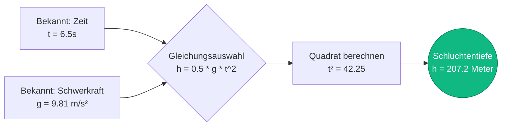
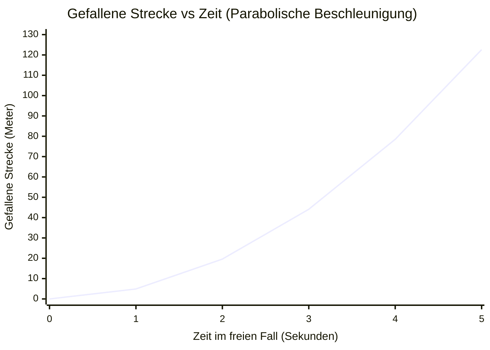
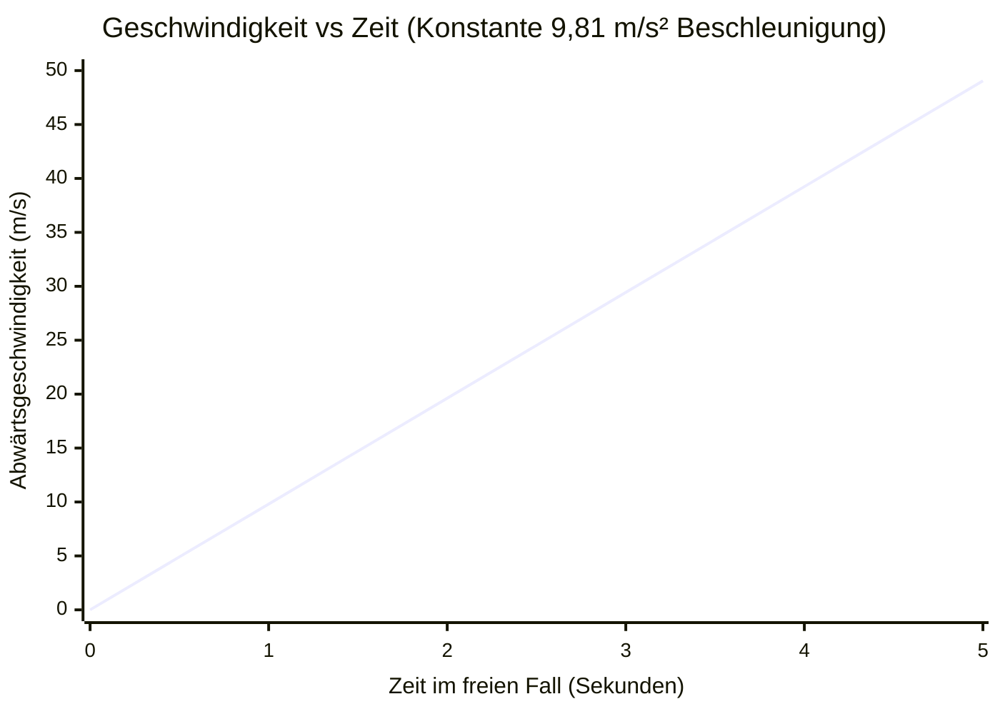
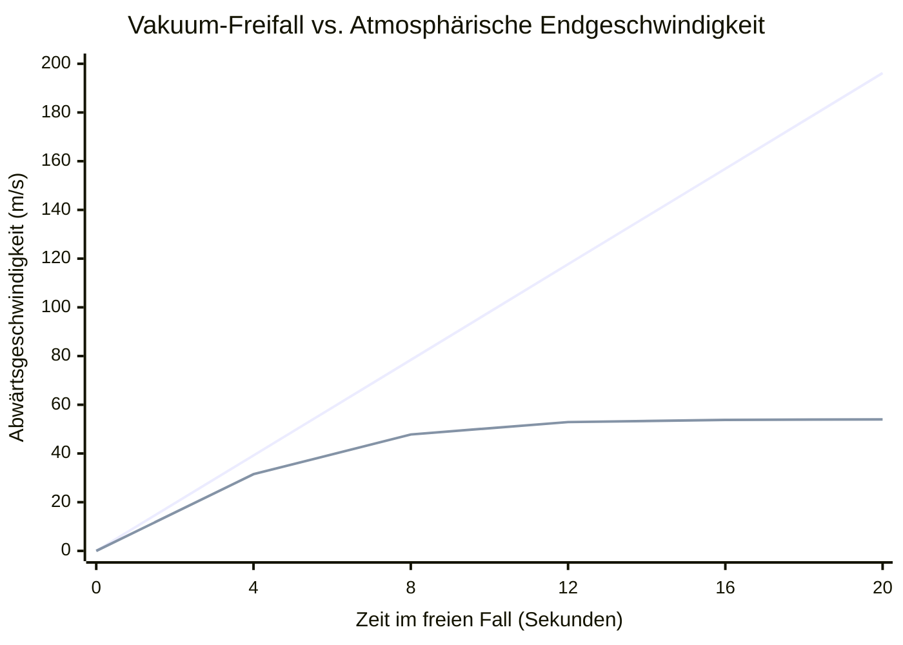

# Der ultimative Freifall-Rechner: Meisterung der Kinematik und der Gravitationsbeschleunigung

Willkommen zum ultimativen **Freifall-Rechner** und umfassenden Physik-Guide. Ob Sie ein Fallschirmsprunglehrer sind, der Öffnungshöhen berechnet, ein Luft- und Raumfahrtingenieur, der orbitale Wiedereintrittsdynamiken simuliert, oder ein Physikstudent, der versucht, Galileis Bewegungsgesetze zu meistern – dieses Tool bietet unübertroffene Präzision.

Der freie Fall ist die reinste Form der Bewegung im Universum. Es ist die Physik von Objekten, die unter der ausschließlichen, unnachgiebigen Kraft der Schwerkraft beschleunigen. Von einem Apfel, der von einem Ast fällt, bis hin zu Astronauten, die an Bord der Internationalen Raumstation schweben, diktiert die Mathematik des freien Falls alles.

In diesem massiven, über 4.000 Wörter umfassenden technischen Leitfaden werden wir die Kinematik des freien Falls ($h = \frac{1}{2}gt^2$) umfassend dekonstruieren. Wir werden die Geschichte der Gravitationswissenschaft erforschen, den kritischen Unterschied zwischen Vakuumbeschleunigung und atmosphärischer Endgeschwindigkeit untersuchen und Sie durch fünf reale Ingenieurs- und Sportszenarien führen, die mit detaillierten Mermaid.js-Diagrammen visualisiert werden.

---

## 1. Die Physik des freien Falls: Bewegung unter Schwerkraft

In der Newtonschen Physik ist der **freie Fall** als die Bewegung eines Körpers definiert, bei der die Schwerkraft die *einzige* darauf einwirkende Kraft ist. 

Das bedeutet, dass im eigentlichen physikalischen Sinne ein Fallschirmspringer, der durch die Luft fällt, sich *nicht* im perfekten freien Fall befindet, da der atmosphärische Luftwiderstand (Strömungswiderstand) ihn nach oben drückt. Echter freier Fall findet nur in einem perfekten Vakuum statt, wie z.B. auf der Oberfläche des Mondes oder im Inneren spezieller Vakuum-Fallkammern. 

Für dichte, schwere Objekte, die auf der Erde relativ kurze Strecken fallen (wie etwa das Fallenlassen einer Stahlkugel von einem Schreibtisch), ist der Luftwiderstand jedoch mathematisch so vernachlässigbar, dass wir dies als echten freien Fall behandeln.

### Galilei und die Gleichheit fallender Massen
Vor dem späten 16. Jahrhundert war der wissenschaftliche Konsens (verfochten von Aristoteles), dass schwerere Objekte schneller fallen als leichtere. Galileo Galilei zerstörte dieses Paradigma. 

Durch seine legendären Experimente (die oft apokryph mit dem Fallenlassen von Kugeln vom Schiefen Turm von Pisa in Verbindung gebracht werden) bewies Galilei, dass **in Abwesenheit von Luftwiderstand alle Objekte unabhängig von ihrer Masse mit exakt der gleichen Rate nach unten beschleunigen.** 

Wenn Sie in einer Vakuumkammer eine $5.000\text{ kg}$ schwere Abrissbirne und einen $0,05\text{ kg}$ leichten Golfball genau zur gleichen Zeit aus exakt derselben Höhe fallen lassen, werden sie genau in derselben Millisekunde auf dem Boden aufschlagen. 

### Standard-Erdbeschleunigung ($g$)
Auf der Erde wird die Standardrate der Gravitationsbeschleunigung mit dem Kleinbuchstaben $g$ bezeichnet. 

$$ g \approx 9,81\text{ m/s}^2 $$

Das bedeutet, dass für jede einzelne Sekunde, die sich ein Objekt im freien Fall befindet, seine Abwärtsgeschwindigkeit um $9,81\text{ Meter pro Sekunde}$ ($35,3\text{ km/h}$ oder $21,9\text{ mph}$) zunimmt. 

---

## 2. Die grundlegenden kinematischen Gleichungen

Die Mathematik des freien Falls wird durch die standardmäßigen 1D-kinematischen Bewegungsgleichungen bei konstanter Beschleunigung bestimmt. Wenn ein Objekt aus der Ruhe fallengelassen wird, ist seine Anfangsgeschwindigkeit ($v_i$) genau null, was die Gleichungen drastisch vereinfacht.

### Gleichung 1: Fallzeit ($t$)
Wenn Sie die Höhe ($h$) kennen, aus der ein Objekt fallengelassen wird, können Sie genau berechnen, wie viele Sekunden es dauern wird, bis es auf den Boden trifft.

$$ t = \sqrt{\frac{2 \cdot h}{g}} $$

### Gleichung 2: Aufprallgeschwindigkeit ($v_f$)
Wenn Sie die Fallhöhe kennen, können Sie genau berechnen, wie schnell das Objekt in der Millisekunde vor dem Aufprall auf den Boden reisen wird.

$$ v_f = \sqrt{2 \cdot g \cdot h} $$
*(Alternativ, wenn Sie die Zeit $t$ bereits berechnet haben, können Sie einfach $v_f = g \cdot t$ verwenden)*

### Gleichung 3: Gefallene Strecke ($h$)
Wenn Sie messen, wie lange ein Objekt braucht, um auf den Boden zu treffen, können Sie die genaue Höhe des Sturzes zurückrechnen. Dies ist eine gängige Methode zur Schätzung der Tiefe eines dunklen Brunnens oder einer Schlucht.

$$ h = \frac{1}{2} \cdot g \cdot t^2 $$

### Die parabolische Kurve der Strecke
Die wichtigste Eigenschaft der Streckengleichung ist, dass die Zeit **quadriert** wird ($t^2$). Ein Objekt fällt nicht mit konstanter Geschwindigkeit; es beschleunigt. 
- In der 1. Sekunde fällt ein Objekt etwa $4,9\text{ Meter}$.
- In der 2. Sekunde fällt es nicht weitere $4,9\text{ Meter}$—es fällt weitere $14,7\text{ Meter}$! 
- Nach 2 Sekunden Gesamtflugzeit ist es $19,6\text{ Meter}$ ($4,9 \times 4$) gefallen.

Die gefallene Strecke skaliert parabolisch, nicht linear. 

---

## 3. Endgeschwindigkeit (Die Atmosphäre schlägt zurück)

Während die obigen Gleichungen von einem perfekten Vakuum ausgehen, leben wir auf einem Planeten mit einer dichten Atmosphäre. Wenn ein Objekt nach unten beschleunigt, muss es Luftmoleküle aus seinem Weg schieben. Dies erzeugt einen aerodynamischen Widerstand.

Die Widerstandskraft steigt quadratisch mit der Geschwindigkeit ($F_D \propto v^2$). Daher wird, während das Objekt immer schneller fällt, die ihm entgegenwirkende aufwärts gerichtete Widerstandskraft exponentiell stärker. 

Irgendwann wird die aufwärts gerichtete Widerstandskraft genau gleich dem abwärts gerichteten Schwerkraftgewicht des Objekts. Wenn sich diese Kräfte ausgleichen, wird die Nettobeschleunigung null. Das Objekt hört auf, schneller zu werden, und fällt mit einer konstanten, maximalen Geschwindigkeit, bekannt als **Endgeschwindigkeit**.

$$ v_t = \sqrt{\frac{2 \cdot m \cdot g}{\rho \cdot A \cdot C_d}} $$

Wobei $\rho$ die Luftdichte, $A$ die stirnseitige Querschnittsfläche und $C_d$ der aerodynamische Widerstandsbeiwert ist. 

Da die Masse ($m$) im Zähler steht, haben schwerere Objekte (wie Bowlingkugeln) eine viel höhere Endgeschwindigkeit als leichtere Objekte mit ähnlichen Oberflächen (wie Luftballons). Deshalb fällt eine Feder in Ihrem Wohnzimmer langsamer als ein Hammer, aber in einer Vakuumkammer fallen sie mit exakt derselben Geschwindigkeit.

---

## 4. Umfassende Bedienungsanleitung: Den Rechner maximieren

Unser interaktiver Freifall-Rechner wurde entwickelt, um jede fehlende kinematische Variable für jeden Planeten sofort zu lösen.

### Schritt 1: Berechnungsziel auswählen
Nutzen Sie die Benutzeroberfläche, um zu definieren, was Sie berechnen möchten:
- **Zeit (t):** Geben Sie Höhe und Schwerkraft ein, um herauszufinden, wie lange ein Fall dauert.
- **Geschwindigkeit (vf):** Geben Sie Höhe und Schwerkraft ein, um die zerstörerische Aufprallgeschwindigkeit zu finden.
- **Höhe (h):** Geben Sie Fallzeit und Schwerkraft ein, um die Tiefe einer Klippe zu messen.
- **Schwerkraft (g):** Geben Sie Fallzeit und Höhe ein, um die Schwerkraft eines unbekannten Planeten zurückzurechnen!

### Schritt 2: Planeten-Schwerkraft-Voreinstellungen nutzen
Schwerkraft ist nicht universell. Unser Rechner ermöglicht es Ihnen, sofort zwischen 10 Himmelskörpern zu wechseln.
Möchten Sie wissen, wie lange es dauert, bis ein Schraubenschlüssel auf dem Mond $50\text{ Meter}$ fällt? Wählen Sie die **Mond-Voreinstellung** ($1,62\text{ m/s}^2$) und die Mathematik wird sofort neu berechnet.

### Schritt 3: Den logarithmischen Geschwindigkeitsbogen interpretieren
Die radiale **Aufprallgeschwindigkeitsanzeige** kategorisiert die berechnete Endgeschwindigkeit logarithmisch:
- **Grün (Niedrige Energie):** Sichere Aufpralle mit geringer Geschwindigkeit (Schlüssel fallen lassen, von einem Stuhl fallen).
- **Blau (Hohe Energie):** Gefährliche Aufpralle mit hoher Geschwindigkeit (vom Dach fallen, Hammer vom Gerüst fallen lassen).
- **Rot (Extreme Energie):** Tödliche Geschwindigkeiten nahe der Endgeschwindigkeit (Fallschirmspringen, Meteoriteneinschläge).

---

## 5. Fünf konzeptionelle Ingenieurs-Szenarien mit 2D-Visualisierungen

Um die Kinematik des freien Falls vollständig zu erfassen, werden wir fünf detaillierte physikalische Szenarien erkunden und Mermaid.js nutzen, um die Mathematik und Bewegungskurven visuell zu dekonstruieren.

### Beispiel 1: Der Schluchtentiefentest (Kinematischer Logikfluss)

**Das Szenario:**
Ein Wanderer steht am Rand einer riesigen, dunklen Schlucht. Er möchte wissen, wie tief sie genau ist. Er lässt einen schweren Stein über die Kante fallen und startet seine Stoppuhr. Genau $6,5\text{ Sekunden}$ später hört er, wie der Stein auf dem Grund der Schlucht zerschmettert. Unter der Annahme, dass der Luftwiderstand auf dem schweren Stein vernachlässigbar ist, wie tief ist die Schlucht?

**Die Mathematik:**
Wir verwenden die Streckenformel ($h = 0,5 \cdot g \cdot t^2$):
$$ h = 0,5 \cdot 9,81\text{ m/s}^2 \cdot (6,5\text{ s})^2 $$
$$ h = 4,905 \cdot 42,25 = 207,2\text{ Meter} $$

Die Schlucht ist erstaunliche $207\text{ Meter}$ tief (etwa 680 Fuß).

**2D-Visualisierung:**
Der Logikbaum unten veranschaulicht, wie wir die richtige kinematische Gleichung basierend auf unseren bekannten Variablen auswählen.

---

### Beispiel 2: Gefallene Strecke vs. Zeit (Die parabolische Kurve)

**Das Szenario:**
Lassen Sie uns die genaue Flugbahn einer Stahlkugel analysieren, die aus einem schwebenden Hubschrauber fallengelassen wird. Wir möchten ihre genau gefallene Strecke nach 1, 2, 3, 4 und 5 Sekunden grafisch darstellen, um die $t^2$-Beschleunigungskurve zu visualisieren.

**Die Mathematik:**
- Nach $1\text{ Sek}$: $h = 0,5 \cdot 9,81 \cdot (1)^2 = 4,9\text{ m}$
- Nach $2\text{ Sek}$: $h = 0,5 \cdot 9,81 \cdot (2)^2 = 19,6\text{ m}$
- Nach $3\text{ Sek}$: $h = 0,5 \cdot 9,81 \cdot (3)^2 = 44,1\text{ m}$
- Nach $4\text{ Sek}$: $h = 0,5 \cdot 9,81 \cdot (4)^2 = 78,5\text{ m}$
- Nach $5\text{ Sek}$: $h = 0,5 \cdot 9,81 \cdot (5)^2 = 122,6\text{ m}$

**2D-Visualisierung:**
Beachten Sie die extreme Kurve. Zwischen der 4. und 5. Sekunde fiel die Kugel massive $44\text{ Meter}$ in einer einzigen Sekunde. Je länger man fällt, desto schneller verschwindet die Strecke.

---

### Beispiel 3: Geschwindigkeit vs. Zeit (Lineare Beschleunigung)

**Das Szenario:**
Unter Verwendung derselben aus dem Hubschrauber fallengelassenen Stahlkugel betrachten wir nun ihre Geschwindigkeit anstelle ihrer Distanz. Da die Beschleunigung ($g$) konstant bei $9,81\text{ m/s}^2$ liegt, sollte die Geschwindigkeit jede einzelne Sekunde um genau $9,81\text{ m/s}$ zunehmen.

**Die Mathematik:**
Wir verwenden die Geschwindigkeitsformel ($v = g \cdot t$):
- Nach $1\text{ Sek}$: $v = 9,81 \cdot 1 = 9,81\text{ m/s}$ ($35\text{ km/h}$)
- Nach $2\text{ Sek}$: $v = 9,81 \cdot 2 = 19,62\text{ m/s}$ ($70\text{ km/h}$)
- Nach $3\text{ Sek}$: $v = 9,81 \cdot 3 = 29,43\text{ m/s}$ ($106\text{ km/h}$)
- Nach $4\text{ Sek}$: $v = 9,81 \cdot 4 = 39,24\text{ m/s}$ ($141\text{ km/h}$)

**2D-Visualisierung:**
Im Gegensatz zur Strecke, die sich aggressiv krümmt, bildet die Geschwindigkeit bei konstanter Beschleunigung eine perfekte, vorhersehbare gerade Linie.

---

### Beispiel 4: Vakuumphysik vs. Endgeschwindigkeit

**Das Szenario:**
Ein menschlicher Fallschirmspringer springt aus einem Flugzeug bei $4.000\text{ Metern}$. Wir möchten seine tatsächliche Geschwindigkeitskurve (die den atmosphärischen Luftwiderstand berücksichtigt) mit seiner theoretischen Geschwindigkeit vergleichen, wenn er in einem vollständigen Vakuum springen würde (wo $v = gt$ ewig andauert). 

**Die Mathematik:**
In der Realität erzeugt ein menschlicher Fallschirmspringer in einer Standard-Bauch-zur-Erde-Haltung einen massiven Luftwiderstand. Etwa ab der 12. bis 15. Sekunde seines Falls wird er bei einer Endgeschwindigkeit von rund $54\text{ m/s}$ ($195\text{ km/h}$ oder $120\text{ mph}$) sein Maximum erreichen. 

Gäbe es keine Luft, würde er einfach endlos weiter beschleunigen, bis er mit Überschallgeschwindigkeit auf dem Boden zerschmettert.

**2D-Visualisierung:**
Dieses Diagramm vergleicht auf dramatische Weise die beiden Realitäten. Die Vakuum-Linie schießt endlos nach oben. Die reale atmosphärische Linie krümmt sich und flacht bei $54\text{ m/s}$ perfekt ab, wenn der Luftwiderstand die Schwerkraft aufhebt.

*(Die steile obere Linie repräsentiert die theoretische Vakuumphysik. Die abgeflachte untere Kurve repräsentiert die reale Endgeschwindigkeit).*

---

### Beispiel 5: Der Hochhöhen-Fallschirmsprung (Gantt-Prozesszeitachse)

**Das Szenario:**
Lassen Sie uns die genaue Zeitachse eines normalen Freizeit-Fallschirmsprungs abbilden. Der Springer verlässt das Flugzeug auf $4.000\text{ Metern}$ ($13.000\text{ ft}$). Er fällt im freien Fall bis auf $1.500\text{ Meter}$ ($5.000\text{ ft}$), bevor er seinen Hauptfallschirm öffnet. Wie lange dauert die Freifallphase?

**Die Mathematik:**
Er muss eine Gesamtdistanz von $2.500\text{ Metern}$ im freien Fall zurücklegen ($4.000 - 1.500$). 
Da dies ein langer Sprung ist, können wir nicht die einfache Vakuumgleichung $t = \sqrt{2h/g}$ verwenden. Er wird nach etwa $12\text{ Sekunden}$ die Endgeschwindigkeit ($54\text{ m/s}$) erreichen und hat in dieser Beschleunigungsphase ungefähr $450\text{ Meter}$ zurückgelegt.
Für die verbleibenden $2.050\text{ Meter}$ ($2.500 - 450$) fällt er mit konstanten $54\text{ m/s}$.
$$ t_{konstant} = \frac{Strecke}{Geschwindigkeit} = \frac{2050}{54} = 37,9\text{ Sekunden} $$

Gesamte Freifallzeit = $12\text{ s}$ (Beschleunigung) + $37,9\text{ s}$ (konstante Endgeschwindigkeit) = **$49,9\text{ Sekunden}$**.

**2D-Visualisierung:**
Dieses Gantt-Diagramm visualisiert die adrenalingeladene Zeitachse des Sprungs und unterteilt die Beschleunigungsphase, die Endgeschwindigkeitsphase und die Fahrt am Fallschirm.

```mermaid
gantt
    title Standard-Fallschirmsprung-Zeitachse (4.000m Absprung bis Boden)
    dateFormat  HH:mm:ss
    axisFormat  %M:%S
    section Freier Fall
    Flugzeug verlassen & Beschleunigen :done, 00:00:00, 00:00:12
    Konstante Endgeschwindigkeit (54 m/s) :crit, active, 00:00:12, 00:00:50
    section Fallschirm
    Hauptfallschirm öffnen (Hohe Verzögerung) :milestone, 00:00:50, 0d
    Schirmfahrt (5 m/s Sinkflug) :active, 00:00:54, 00:05:54
    Sichere Bodenlandung :milestone, 00:05:54, 0d
```

---

## 6. Häufig gestellte Fragen (FAQ) Deep Dive

**F: Warum schweben Astronauten im Weltraum, wenn die Schwerkraft überall ist?**
**A:** Dies ist das häufigste Missverständnis in der Astrophysik! Astronauten an Bord der Internationalen Raumstation (ISS) befinden sich *nicht* in der Schwerelosigkeit. Auf $400\text{ km}$ Höhe über der Erde ist die Schwerkraft immer noch $90\%$ so stark wie an der Oberfläche. Astronauten schweben, weil sie sich in einem Zustand des **kontinuierlichen, ewigen freien Falls** befinden. Die ISS bewegt sich seitwärts so wahnsinnig schnell ($28.000\text{ km/h}$), dass sich die Erde, während die ISS nach unten in Richtung Erde fällt, unter ihr wegbiegt. Sie fallen buchstäblich für immer um den Planeten herum. 

**F: Fallen schwerere Objekte schneller?**
**A:** In einem Vakuum absolut nicht. Die Masse hat keinerlei Auswirkung auf die Rate der Gravitationsbeschleunigung. In unserer Atmosphäre können jedoch schwerere Objekte (die typischerweise ein höheres Verhältnis von Masse zu Oberfläche haben) den aerodynamischen Widerstand effektiver überwinden, was bedeutet, dass sie eine höhere Endgeschwindigkeit haben und letztendlich früher auf dem Boden aufschlagen, wenn sie aus sehr großer Höhe fallen gelassen werden.

**F: Was ist "Schwerelosigkeit" (Zero-G)?**
**A:** Gewicht ist einfach die Normalkraft des Bodens, die gegen Ihre Füße nach oben drückt. Wenn Sie sich im freien Fall befinden, gibt es keinen Boden, der Sie nach oben drückt. Daher sinkt Ihr scheinbares "Gewicht", obwohl Ihre Masse gleich bleibt, auf genau null. Sie fühlen sich schwerelos.

**F: Wie funktioniert ein Fallschirm eigentlich?**
**A:** Ein Fallschirm vergrößert die Oberfläche ($A$) des fallenden Objekts dramatisch. Wenn Sie auf unsere Gleichung für die Endgeschwindigkeit zurückblicken, verringern Sie $v_t$ massiv, wenn Sie $A$ massiv vergrößern. Ein Fallschirm senkt die Endgeschwindigkeit eines Menschen von tödlichen $54\text{ m/s}$ auf überlebbare $5\text{ m/s}$.

**F: Kann man einen freien Fall ins Wasser aus extremer Höhe überleben?**
**A:** Normalerweise nicht. Wasser ist inkompressibel. Wenn Sie mit Endgeschwindigkeit ($195\text{ km/h}$) auf Wasser treffen, kann das Wasser nicht schnell genug aus dem Weg geraten. Die Oberflächenspannung und Dichte bewirken, dass sich das Wasser fast genau wie massiver Beton verhält. Extremes Klippenspringen erfordert perfekt vertikale Eintaucheintritte, um die Oberflächenspannung zu brechen und die Abbremszeit zu verlängern.

---

## 7. Fazit und Ingenieurs-Herausforderung

Die Mathematik des freien Falls ist elegant einfach, definiert jedoch die Bewegung von allem im Kosmos. Indem Sie die parabolische $t^2$-Kurve der Strecke meistern und den kritischen Balanceakt der Endgeschwindigkeit verstehen, schalten Sie die Fähigkeit frei, die physische Welt genau zu modellieren.

Um diese Konzepte wirklich zu beherrschen, nutzen Sie unseren Freifall-Rechner, um die folgenden konzeptionellen Physik-Herausforderungen zu lösen:
1. **Der Mond-Fall:** Die Apollo 15 Astronauten ließen einen Hammer aus einer Höhe von $1,2\text{ Metern}$ auf dem Mond ($g = 1,62\text{ m/s}^2$) fallen. Wie viele Sekunden dauerte es genau, bis er auf den Mondstaub traf?
2. **Der Jupiter-Abgrund:** Wenn Sie eine schwere Titankugel aus einem Hochballon in die gasförmige Atmosphäre des Jupiters ($g = 24,79\text{ m/s}^2$) fallen lassen würden, welche Geschwindigkeit hätte sie nach genau $10\text{ Sekunden}$ reinem vakuumäquivalenten freiem Fall? 
3. **Der Stunt-Sprung:** Ein Hollywood-Stuntdouble muss sich von einem Gebäude fallen lassen und genau $3,5\text{ Sekunden}$ nach dem Verlassen des Sims auf ein spezielles Luftkissen treffen. Wie hoch muss der Sims gebaut sein, um dieses Timing perfekt einzuhalten?

Experimentieren Sie mit dem Simulator, analysieren Sie die aggressiven parabolischen Streckenkurven und verlassen Sie sich auf diesen Rechner, um die gewaltigen Gravitationskräfte zu beleuchten, die das Universum regieren.
