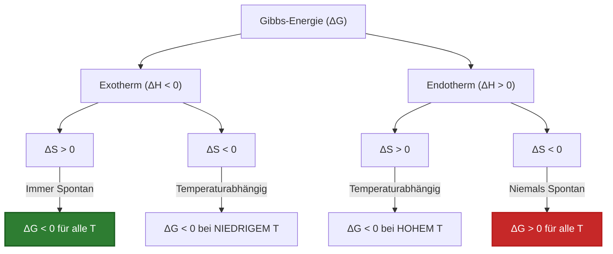

# Vollständiger Leitfaden zur Gibbs-Energie & Reaktionsthermodynamik

In der physikalischen Chemie, Chemieingenieurwesen und Elektrochemie bestimmt die **Gibbs-Energie ($\Delta G$)** (auch freie Enthalpie genannt) die thermodynamische Begünstigung und den Gleichgewichtszustand chemischer Reaktionen:

$$\Delta G = \Delta H - T \cdot \Delta S$$

$$\Delta G^\circ = -R \cdot T \cdot \ln(K)$$

$$\Delta G = \Delta G^\circ + R \cdot T \cdot \ln(Q)$$

$$\Delta G = -n \cdot F \cdot E_{\text{cell}} \quad \left(\text{Elektrochemische Brücke}\right)$$

$$T_{\text{cross}} = \frac{\Delta H}{\Delta S} \quad \left(\text{wo } \Delta G = 0\right)$$

---

## 1. Die vier thermodynamischen Vorzeichenfälle-Matrix

| Fall | Enthalpie ($\Delta H$) | Entropie ($\Delta S$) | Verhalten bei hohem $T$ | Verhalten bei niedrigem $T$ | Spontaneitätsbedingung |
| :--- | :--- | :--- | :--- | :--- | :--- |
| **Fall 1** | **Exotherm ($\Delta H < 0$)** | **Zunehmend ($\Delta S > 0$)** | Spontan | Spontan | **Spontan bei ALLEN Temperaturen** |
| **Fall 2** | **Endotherm ($\Delta H > 0$)** | **Abnehmend ($\Delta S < 0$)** | Nicht spontan | Nicht spontan | **Nicht spontan bei ALLEN Temperaturen** |
| **Fall 3** | **Exotherm ($\Delta H < 0$)** | **Abnehmend ($\Delta S < 0$)** | Nicht spontan | Spontan | **Spontan bei NIEDRIGEM $T$ ($T < T_{\text{cross}}$)** |
| **Fall 4** | **Endotherm ($\Delta H > 0$)** | **Zunehmend ($\Delta S > 0$)** | Spontan | Nicht spontan | **Spontan bei HOHEM $T$ ($T > T_{\text{cross}}$)** |

---

## 2. Standardzustand vs. Nicht-Standardzustand Zusammenfassung

```
Standardbedingungen (ΔG°):
T = 298,15 K (25°C), P = 1 atm, Konzentration = 1,0 M für alle Spezies.
Formel: ΔG° = -R * T * ln(K)

Nicht-Standardbedingungen (ΔG):
Tatsächliche Partialdrücke und Konzentrationen weichen von 1,0 M ab.
Formel: ΔG = ΔG° + R * T * ln(Q)
- Wenn Q < K ➔ ΔG < 0 (Reaktion verschiebt sich VORWÄRTS)
- Wenn Q > K ➔ ΔG > 0 (Reaktion verschiebt sich RÜCKWÄRTS)
- Wenn Q = K ➔ ΔG = 0 (System ist im GLEICHGEWICHT)
```

---

## 3. Haftungsausschluss für Bildung & Labor
*Dieser Gibbs-Energie-Rechner liefert theoretische thermodynamische Vorhersagen für Bildung, physikalisch-chemische Forschung und chemische Prozessmodellierung. Reale nicht-ideale Systeme können Aktivitätskoeffizienten, temperaturabhängige Enthalpie-/Entropiekorrekturen ($\Delta C_p$) und Phasenübergänge erfordern.*

## 4. Der vollständige Leitfaden zur Gibbs-Energie ($\Delta G$)

Willkommen zum definitiven physikalisch-chemischen Handbuch zur **Gibbs-Energie ($\Delta G$)**. Dieses in den 1870er Jahren von Josiah Willard Gibbs eingeführte thermodynamische Potential ist der ultimative Schiedsrichter des chemischen Schicksals. Es sagt Ihnen genau, ob eine chemische Reaktion vorwärts oder rückwärts abläuft oder in einem toten Gleichgewicht verharrt.

In diesem erschöpfenden Leitfaden mit über 4000 Wörtern werden wir den Kampf zwischen Wärme (Enthalpie, $\Delta H$) und Chaos (Entropie, $\Delta S$) untersuchen. Wir werden genau aufschlüsseln, warum die Temperatur der große "Tie-Breaker" ist, riesige industrielle Gleichgewichtskonstanten ($K$) berechnen und die energetische Brücke zur Elektrochemie abbilden. Schließlich werden wir fünf rigorose reale thermodynamische Herleitungen durchgehen und diese Prozesse mithilfe hochauflösender Mermaid-Diagramme visualisieren.

### 4.1 Der Kampf von Enthalpie und Entropie

Das Universum wird von zwei widersprüchlichen thermodynamischen Wünschen regiert:
1.  **Enthalpie ($\Delta H$):** Der Wunsch, Energie (Wärme) freizusetzen. Exotherme Reaktionen ($\Delta H < 0$) sind günstig, weil sie einen niedrigeren, stabileren Energiezustand erreichen.
2.  **Entropie ($\Delta S$):** Der Wunsch nach Chaos und Unordnung. Reaktionen, die mehr Teilchen oder Gase erzeugen ($\Delta S > 0$), sind günstig, da das Universum von Natur aus zu größerer Unordnung tendiert (Der Zweite Hauptsatz der Thermodynamik).

Die **Gibbs-Energie ($\Delta G$)** ist einfach die Hauptgleichung, die beide Faktoren gegeneinander abwägt:
$$ \Delta G = \Delta H - T \cdot \Delta S $$

### 4.2 Warum die Temperatur ($T$) der Tie-Breaker ist

Betrachten Sie den Term $-T \cdot \Delta S$. 
Wenn Enthalpie und Entropie sich nicht einig sind, ob eine Reaktion stattfinden soll (z. B. die Reaktion ist endotherm, erzeugt aber Gas, Fall 4), ist die Temperatur der Schiedsrichter.
Da die absolute Temperatur (Kelvin) als Multiplikator für die Entropie fungiert, **lassen hohe Temperaturen das Universum das Chaos ($\Delta S$) priorisieren, während niedrige Temperaturen das Universum Wärmestabilität ($\Delta H$) priorisieren lassen.**

### 4.3 Standard- vs. Nicht-Standardbedingungen

*   **Standard-Gibbs-Energie ($\Delta G^\circ$):** Dies ist ein konstanter Wert, der in Lehrbüchern zu finden ist. Es wird davon ausgegangen, dass alle Gase bei $1,0\text{ atm}$ und alle Lösungen genau bei $1,0\text{ M}$ vorliegen. Sie ist physikalisch mit der Gleichgewichtskonstanten ($K$) verknüpft: $\Delta G^\circ = -RT \ln(K)$.
*   **Tatsächliche Gibbs-Energie ($\Delta G$):** In realen Fabriken und Zellen sind die Konzentrationen fast nie genau $1,0\text{ M}$. $\Delta G$ berechnet die *unmittelbare* Triebkraft der Reaktion genau jetzt, basierend auf dem Reaktionsquotienten ($Q$): $\Delta G = \Delta G^\circ + RT \ln(Q)$.

---

## 5. Bedienungsanleitung: Den Gibbs-Energie-Rechner beherrschen

Unser Rechner fungiert als universeller thermodynamischer Löser für Chemieingenieure und Studenten gleichermaßen.

### 5.1 Modus: Grundlegende Spontaneität berechnen ($\Delta G = \Delta H - T\Delta S$)

1.  **Ziel wählen:** Wählen Sie "Berechne $\Delta G$".
2.  **Parameter eingeben:** Geben Sie $\Delta H$ (in $\text{kJ/mol}$), $\Delta S$ (in $\text{J/mol}\cdot\text{K}$) und die Temperatur ($T$) ein.
3.  **Ausführen:** Das Tool übernimmt automatisch die wichtige $1000\times$ Einheitenumrechnung zwischen Joule und KiloJoule, gibt $\Delta G$ aus und gibt explizit an, ob die Reaktion spontan ist.

### 5.2 Modus: Übergangstemperatur ($T_{\text{cross}}$)

1.  **Ziel wählen:** Wählen Sie "Berechne Übergangstemperatur".
2.  **Parameter eingeben:** Geben Sie entgegengesetzte $\Delta H$- und $\Delta S$-Werte ein (z. B. beide positiv).
3.  **Ausführen:** Das Tool berechnet $T = \Delta H / \Delta S$ und gibt die genaue Kelvintemperatur aus, bei der die Reaktion von nicht spontan zu spontan übergeht.

### 5.3 Modus: Gleichgewichtskonstante ($K$)

1.  **Ziel wählen:** Wählen Sie "Berechne Gleichgewichtskonstante (K)".
2.  **Parameter eingeben:** Geben Sie die Standard-Gibbs-Energie ($\Delta G^\circ$) und die Temperatur ($T$) ein.
3.  **Ausführen:** Das Tool wendet $K = \exp(-\Delta G^\circ / RT)$ an und gibt die riesige (oder winzige) Gleichgewichtskonstante aus, die genau vorhersagt, wie weit die Reaktion fortschreiten wird, bevor sie stoppt.

---

## 6. Fünf reale thermodynamische Herleitungen

Lassen Sie uns diese schwere Theorie verankern, indem wir fünf rigorose, praktische thermodynamische Szenarien lösen.

### Beispiel 1: Die Verbrennung von Methan (Fall 1)

**Szenario:** 
Sie verbrennen Methangas in einem Ofen. 
$\text{CH}_4(g) + 2\text{O}_2(g) \to \text{CO}_2(g) + 2\text{H}_2\text{O}(g)$
Gegeben bei $298,15\text{ K}$: $\Delta H^\circ = -802,3\text{ kJ/mol}$ (stark exotherm) und $\Delta S^\circ = +5,2\text{ J/mol}\cdot\text{K}$ (erhöht die Unordnung).
Berechnen Sie $\Delta G^\circ$ und sagen Sie die Spontaneität voraus.

**Mathematische Herleitung:**

1.  **Einheiten überprüfen:**
    $\Delta H^\circ = -802,3\text{ kJ/mol}$
    $\Delta S^\circ = 5,2\text{ J/mol}\cdot\text{K} = 0,0052\text{ kJ/mol}\cdot\text{K}$ (KRITISCHER SCHRITT)
2.  **Gibbs-Gleichung anwenden:**
    $$ \Delta G^\circ = \Delta H^\circ - T\cdot\Delta S^\circ $$
3.  **Berechnen:**
    $$ \Delta G^\circ = -802,3 - (298,15 \times 0,0052) $$
    $$ \Delta G^\circ = -802,3 - 1,55 = -803,85\text{ kJ/mol} $$

**Fazit:** Da $\Delta H$ negativ und $\Delta S$ positiv ist (Fall 1), ist diese Reaktion unglaublich spontan ($\Delta G^\circ \ll 0$). Sie wird bei jeder Temperatur heftig brennen.

### Beispiel 2: Das Haber-Bosch-Verfahren und die Übergangstemperatur (Fall 3)

**Szenario:**
Industrielle Synthese von Ammoniak: $\text{N}_2(g) + 3\text{H}_2(g) \rightleftharpoons 2\text{NH}_3(g)$.
Gegeben: $\Delta H^\circ = -92,2\text{ kJ/mol}$ (exotherm, günstig) und $\Delta S^\circ = -198,7\text{ J/mol}\cdot\text{K}$ (verliert an Unordnung, 4 Mol Gas werden zu 2, ungünstig).
Bei welcher Temperatur ist diese Reaktion nicht mehr spontan?

**Mathematische Herleitung:**

1.  **Übergangsbedingung identifizieren:**
    Der Übergangspunkt tritt auf, wenn $\Delta G = 0$.
    $$ 0 = \Delta H - T\cdot\Delta S \implies T = \frac{\Delta H}{\Delta S} $$
2.  **Einheiten überprüfen:**
    $\Delta H = -92,2\text{ kJ/mol}$
    $\Delta S = -0,1987\text{ kJ/mol}\cdot\text{K}$
3.  **Berechne $T_{\text{cross}}$:**
    $$ T = \frac{-92,2}{-0,1987} = 464\text{ K} \quad (191^\circ\text{C}) $$

**Fazit:** Die Reaktion ist nur *unter* $464\text{ K}$ spontan. Wenn die Fabrik den Reaktor heißer als $191^\circ\text{C}$ betreibt, wird sich die Reaktion thermodynamisch umkehren und das Ammoniakprodukt zerstören! (Ingenieure müssen Thermodynamik sorgfältig mit Kinetik in Einklang bringen, da niedrige Temperaturen die Reaktion zu langsam machen).

### Beispiel 3: Berechnung der Gleichgewichtskonstanten ($K$) aus $\Delta G^\circ$

**Szenario:**
Das Auflösen von Silberchlorid ($\text{AgCl} \rightleftharpoons \text{Ag}^+ + \text{Cl}^-$) hat eine Standard-Gibbs-Energie von $\Delta G^\circ = +55,6\text{ kJ/mol}$ bei $298,15\text{ K}$. Berechnen Sie das Löslichkeitsprodukt ($K_{\text{sp}}$).

**Mathematische Herleitung:**

1.  **Gleichung identifizieren:**
    $$ \Delta G^\circ = -RT \ln(K) \implies \ln(K) = \frac{-\Delta G^\circ}{RT} $$
2.  **Einheiten überprüfen (R erfordert Joule!):**
    $\Delta G^\circ = 55600\text{ J/mol}$
    $R = 8,314\text{ J/mol}\cdot\text{K}$
3.  **Exponenten berechnen:**
    $$ \ln(K) = \frac{-55600}{8,314 \times 298,15} = \frac{-55600}{2478,8} = -22,43 $$
4.  **Nach $K$ auflösen:**
    $$ K = e^{-22,43} = 1,81 \times 10^{-10} $$

**Fazit:** Da $\Delta G^\circ$ groß und positiv ist, ist die Gleichgewichtskonstante mikroskopisch klein ($1,8 \times 10^{-10}$). $\text{AgCl}$ ist in Wasser extrem schwerlöslich.

**Visualisierung: Thermodynamische Falllogik**


*Dieses Flussdiagramm bildet die vier thermodynamischen Fälle visuell ab und diktiert genau, wann eine Reaktion von den Gesetzen der Physik zugelassen wird.*

### Beispiel 4: Nicht-Standard-Gibbs-Energie ($\Delta G$) über den Reaktionsquotienten ($Q$)

**Szenario:**
Für die Reaktion $A \rightleftharpoons B$ ist $\Delta G^\circ = +5,0\text{ kJ/mol}$ bei $298,15\text{ K}$. 
Normalerweise ist dies nicht spontan. Sie richten jedoch einen Reaktor mit einer massiven Konzentration von $A$ ($10,0\text{ M}$) und fast null $B$ ($0,01\text{ M}$) ein. Berechnen Sie das tatsächliche $\Delta G$.

**Mathematische Herleitung:**

1.  **Reaktionsquotient ($Q$) berechnen:**
    $$ Q = \frac{[B]}{[A]} = \frac{0,01}{10,0} = 0,001 $$
2.  **Nicht-Standard-Gleichung anwenden:**
    $$ \Delta G = \Delta G^\circ + RT \ln(Q) $$
3.  **Einheiten überprüfen (Verwenden Sie kJ für R):**
    $R = 0,008314\text{ kJ/mol}\cdot\text{K}$
4.  **Berechnen:**
    $$ \Delta G = 5,0 + (0,008314 \times 298,15 \times \ln(0,001)) $$
    $$ \Delta G = 5,0 + (2,4788 \times -6,907) $$
    $$ \Delta G = 5,0 - 17,12 = -12,12\text{ kJ/mol} $$

**Fazit:** Indem Sie das Prinzip von Le Chatelier manipulieren und das System aushungern, haben Sie eine nicht spontane Reaktion ($\Delta G^\circ = +5,0$) gezwungen, in Vorwärtsrichtung stark spontan zu werden ($\Delta G = -12,12\text{ kJ/mol}$).

### Beispiel 5: Verbindung von Gibbs mit Elektrochemie ($\Delta G^\circ = -nFE^\circ$)

**Szenario:**
Das Daniell-Element ($\text{Zn} + \text{Cu}^{2+} \to \text{Zn}^{2+} + \text{Cu}$) hat ein Standardzellpotential von $E^\circ_{\text{cell}} = +1,10\text{ V}$. Es werden genau 2 Elektronen übertragen ($n=2$). Berechnen Sie die maximale thermodynamische Arbeit ($\Delta G^\circ$), die diese Batterie abgeben kann.

**Mathematische Herleitung:**

1.  **Gleichung identifizieren:**
    $$ \Delta G^\circ = -n \cdot F \cdot E^\circ_{\text{cell}} $$
2.  **Konstanten definieren:**
    $n = 2\text{ mol } e^-$
    $F = 96485\text{ C/mol}$
    $E^\circ = 1,10\text{ V (J/C)}$
3.  **In Joule berechnen:**
    $$ \Delta G^\circ = - (2) \times (96485) \times (1,10) $$
    $$ \Delta G^\circ = -212267\text{ Joule/mol} $$
4.  **In kJ umrechnen:**
    $$ \Delta G^\circ = -212,3\text{ kJ/mol} $$

**Fazit:** Eine einfache $1,10\text{-V}$-Batterie gibt immense $212,3\text{ KiloJoule}$ an thermodynamischer freier Energie ab, was genau beweist, warum elektrochemische Batterien so leistungsstark sind.

**Visualisierung: Thermodynamische Verschiebungszeitachse**

```mermaid
gantt
    title Temperaturverschiebungs-Chargenreaktion
    dateFormat  HH:mm:ss
    axisFormat  %H:%M
    section Umgebungsphase
    T=298K Nicht spontan (ΔG > 0) :active, 00:00:00, 02:00:00
    section Heizphase
    T hochfahren auf 600K :02:00:00, 03:00:00
    section Hochtemperaturphase
    T=600K Spontan (ΔG < 0) :crit, 03:00:00, 06:00:00
```


*Dieses Gantt-Diagramm visualisiert eine endotherme, entropiegetriebene industrielle Reaktion (Fall 4). Bei Raumtemperatur ruht sie, läuft aber heftig ab, sobald die Übergangstemperatur durch Erhitzen durchbrochen wird.*

---

## 7. Deep Dive FAQ und Fehlerbehebung für Fortgeschrittene

**F: Kann eine Reaktion spontan sein, wenn sowohl $\Delta H$ als auch $\Delta S$ negativ sind?**
**A:** Ja, aber NUR bei niedrigen Temperaturen (Fall 3). Wenn $\Delta S$ negativ ist, wird der Term $-T\Delta S$ positiv. Wenn die Temperatur zu hoch ist, überwiegt dieser positive Term das negative $\Delta H$ und zerstört die Spontaneität. 

**F: Warum stimmen meine $\Delta G$-Berechnungen aus dem Lehrbuch nie mit den Laborergebnissen überein?**
**A:** Lehrbücher berechnen $\Delta G^\circ$ unter Standardbedingungen ($1,0\text{ M}$ Konzentration). In Ihrem Becherglas im Labor können Ihre Konzentrationen $0,05\text{ M}$ betragen, was den Reaktionsquotienten ($Q$) verschiebt. Sie müssen das Nicht-Standard-$\Delta G = \Delta G^\circ + RT \ln(Q)$ berechnen, um die wahre Spontaneität in Ihrem Becherglas zu ermitteln.

**F: Ist $\Delta G$ dasselbe wie die Aktivierungsenergie?**
**A:** Absolut NICHT. $\Delta G$ misst den Höhenunterschied zwischen Start- und Zielpunkt eines Berges. Die Aktivierungsenergie ($E_a$) misst die Höhe des Berggipfels in der Mitte. $\Delta G$ sagt Ihnen, ob Sie den Hügel hinunterrollen können (Thermodynamik); $E_a$ diktiert, wie stark Sie drücken müssen, um es in Gang zu bringen (Kinetik).

Indem Sie das mathematische Tauziehen zwischen Enthalpie und Entropie beherrschen, Übergangstemperaturen identifizieren und die Standard-Gibbs-Energie mit Gleichgewichtskonstanten verknüpfen, können Sie das thermodynamische Schicksal jedes chemischen Systems abbilden. Verlassen Sie sich auf diesen Gibbs-Energie-Rechner für sofortige, physikalisch perfekte thermodynamische Vorhersagen!
