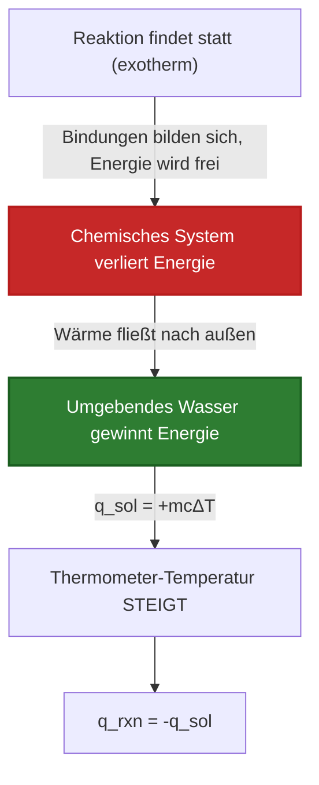

# Umfassender Leitfaden für Labor und Industrie zu Reaktionswärme & Thermochemie

In der physikalischen Chemie, der Thermochemie und der Verfahrenstechnik quantifiziert die **Reaktionswärme ($q_{\text{rxn}}$)** die während chemischer Prozesse übertragene thermische Energie:

$$q_p = \Delta H_{\text{rxn}} \quad \left(\text{Konstanter Druck}\right)$$

$$q_v = \Delta U_{\text{rxn}} \quad \left(\text{Bombenkalorimetrie bei konstantem Volumen}\right)$$

$$q_{\text{total}} = n_{\text{reactant}} \cdot \Delta H_{\text{rxn}}$$

$$q_{\text{solution}} = m \cdot c \cdot \Delta T \quad \left(\text{Lösungswärme}\right)$$

$$q_{\text{calorimeter}} = C_{\text{cal}} \cdot \Delta T \quad \left(\text{Gerätewärme}\right)$$

$$q_{\text{rxn}} = -\left(q_{\text{solution}} + q_{\text{calorimeter}}\right)$$

---

## 1. Vergleich: Kaffeebecher- vs. Bombenkalorimetrie

| Merkmal | Kaffeebecher-Kalorimetrie | Bombenkalorimetrie |
| :--- | :--- | :--- |
| **Betriebsbedingung** | **Konstanter Druck ($P = \text{const}$)** | **Konstantes Volumen ($V = \text{const}$)** |
| **Thermodynamischer Wert** | **Enthalpieänderung ($\Delta H$)** | **Änderung der inneren Energie ($\Delta U$)** |
| **Primäres System** | Wässrige Lösungen, Säure-Base-Neutralisation | Brennstoffverbrennung, Gasreaktionen |
| **Wärmegleichung** | $q_{\text{rxn}} = -m c \Delta T$ | $q_v = -C_{\text{cal}} \Delta T$ |
| **Druckentlastung** | Offen zur Atmosphäre | Versiegeltes Stahlgefäß (Hochdruck) |

---

## 2. Matrix der thermochemischen Berechnungsmethoden

```
1. Direkte Reaktionswärme: q_rxn = n * ΔH_rxn
2. Lösungskalorimetrie: q = m * c * ΔT
3. Kaffeebecher-Reaktionswärme: q_rxn = -(q_solution + q_calorimeter)
4. Bombenkalorimetrie bei konstantem Volumen: q_v = ΔU = -C_cal * ΔT
5. Standardbildungsenthalpien: ΔH°_rxn = Σ n * ΔH°f(products) - Σ n * ΔH°f(reactants)
6. Hess'scher Wärmesatz (Additivität): ΔH_total = ΔH_1 + ΔH_2 + ΔH_3 + ...
7. Durchschnittliche Bindungsenergien: ΔH = Σ BE(broken) - Σ BE(formed)
```

---

## 3. Haftungsausschluss für Bildung & Labor
*Dieser Reaktionswärme-Rechner liefert theoretische thermochemische Vorhersagen für Bildung, physikalisch-chemische Forschung und prozesstechnische Anwendungen. Echte kalorimetrische Messungen sollten die Wärmekapazität des Kalorimeters ($C_{\text{cal}}$), den Wärmeverlust an die Umgebung und die nicht-ideale Lösungsmischung berücksichtigen.*

## 4. Der ultimative Leitfaden zur Reaktionswärme ($q_{\text{rxn}}$) und Kalorimetrie

Willkommen zum definitiven physikalisch-chemischen Handbuch über die **Reaktionswärme ($q_{\text{rxn}}$)**. Während die Standardenthalpie ($\Delta H$) Ihnen die theoretische Energie angibt, die pro Mol aus einem Lehrbuch freigesetzt wird, verrät Ihnen die Reaktionswärme genau, wie viel thermische Energie jetzt gerade aus Ihrem physikalischen Becherglas strömt.

In diesem umfassenden, über 4000 Wörter langen Leitfaden werden wir den grundlegenden Unterschied zwischen abstrakten thermodynamischen Zuständen (Enthalpie, $\Delta H$) und physikalischer Wärmeübertragung (Wärme, $q$) analysieren. Wir werden die Ingenieurmathematik hinter sowohl der **Kaffeebecher-Kalorimetrie** (konstanter Druck) als auch der **Bombenkalorimetrie** (konstantes Volumen) meistern. Schließlich werden wir fünf rigorose, praxisnahe stöchiometrische Wärmeübertragungsszenarien lösen und die thermische Dynamik mithilfe von Mermaid-Diagrammen in hoher Auflösung visualisieren.

### 4.1 Enthalpie ($\Delta H$) vs. Wärme ($q$)

Studenten verwechseln häufig Enthalpie und Wärme, aber sie sind in der Thermodynamik grundlegend verschieden:
1.  **Enthalpieänderung ($\Delta H$):** Dies ist eine *thermodynamische Zustandsgröße*, die normalerweise in $\text{kJ/mol}$ angegeben wird. Sie ist eine theoretische Eigenschaft der chemischen Reaktion selbst, völlig unabhängig davon, wie viel Chemikalie sich tatsächlich in Ihrem Becherglas befindet.
2.  **Wärme ($q$):** Dies ist die physikalische Übertragung von thermischer Energie, normalerweise angegeben in physikalischen $\text{Joule}$ oder $\text{kJ}$. Sie hängt vollständig von der physikalischen Masse der reagierenden Chemikalien ab. Wenn Sie ein Streichholz verbrennen, ist die Wärme ($q$) gering. Wenn Sie einen Wald abbrennen, ist die Wärme ($q$) enorm. Aber die Enthalpie der Holzverbrennung ($\Delta H$) ist für beide identisch!

**Die Brücke:** Wärme ist einfach Enthalpie, skaliert durch physikalische Stöchiometrie:
$$ q_{\text{rxn}} = n \cdot \Delta H_{\text{rxn}} $$

### 4.2 Konstanter Druck (Kaffeebecher) vs. Konstantes Volumen (Bombe)

Chemieingenieure verwenden zwei verschiedene Arten von Kalorimetern, um die Reaktionswärme zu messen, und die Physik unterscheidet sich erheblich:

*   **Kaffeebecher-Kalorimetrie:** Durchgeführt in einem offenen Styroporbecher. Da er zur Atmosphäre offen ist, ist der Druck konstant. Unter konstantem Druck entspricht die gesamte übertragene Wärme direkt der Enthalpieänderung ($q_p = \Delta H$).
*   **Bombenkalorimetrie:** Durchgeführt in einem versiegelten, schweren Stahlzylinder (einer Bombe). Da sich das Gas nicht gegen die Atmosphäre ausdehnen kann, wird keine Volumenarbeit $P\Delta V$ verrichtet. Daher entspricht die gesamte übertragene Wärme der Änderung der inneren Energie ($q_v = \Delta U$), nicht der Enthalpie!

### 4.3 Die Physik von Exotherm vs. Endotherm

*   **Exotherme Reaktion:** Das Reaktionssystem verliert physikalisch Energie an das umgebende Wasser. Das Wasser absorbiert die Energie, was zu einem sprunghaften Anstieg der Temperatur führt ($q_{\text{rxn}} < 0$, $\Delta T > 0$).
*   **Endotherme Reaktion:** Das Reaktionssystem entzieht dem umgebenden Wasser thermische Energie, um seine chemischen Bindungen aufzubrechen. Das Wasser verliert Wärme, wodurch die Temperatur sinkt ($q_{\text{rxn}} > 0$, $\Delta T < 0$).

---

## 5. Benutzerhandbuch: Die Beherrschung des Reaktionswärme-Rechners

Unser Rechner fungiert als universeller thermochemischer Problemlöser für High-School-Labore und die industrielle Technik.

### 5.1 Modus: Stöchiometrische Wärmeskalierung ($q = n\Delta H$)

1.  **Ziel auswählen:** Wählen Sie "Stöchiometrische Reaktionswärme".
2.  **Eingabeparameter:** Geben Sie die molare Enthalpie ($\Delta H_{\text{rxn}}$ in $\text{kJ/mol}$) und die physikalischen Mole des verbrauchten Reaktanten ($n$) ein.
3.  **Ausführen:** Das Tool skaliert die thermodynamische Zustandsfunktion in einen physikalischen Energieübertragungswert ($q$ in Kilojoule).

### 5.2 Modus: Kaffeebecher-Lösungskalorimetrie

1.  **Ziel auswählen:** Wählen Sie "Kaffeebecher-Kalorimetrie".
2.  **Eingabeparameter:** Geben Sie die Masse des umgebenden Wassers ($m$), die spezifische Wärmekapazität ($c$) und die Temperaturänderung ($\Delta T$) ein.
3.  **Ausführen:** Das Tool berechnet die von der Lösung absorbierte Wärme ($q_{\text{sol}}$) und dreht dann das Vorzeichen um, um die genaue, von der Reaktion freigesetzte Wärme ($q_{\text{rxn}}$) zu berechnen.

### 5.3 Modus: Bombenkalorimetrie (Gerätewärme)

1.  **Ziel auswählen:** Wählen Sie "Bombenkalorimetrie".
2.  **Eingabeparameter:** Geben Sie die Hardware-Kalorimeterkonstante ($C_{\text{cal}}$ in $\text{kJ/}^\circ\text{C}$) und die Temperaturänderung ($\Delta T$) ein.
3.  **Ausführen:** Das Tool ignoriert die Wassermasse vollständig und stützt sich ausschließlich auf die vorkalibrierte Wärmekapazität der schweren Stahlbombe, um $q_v = \Delta U$ zu berechnen.

---

## 6. Fünf praxisnahe thermochemische Ableitungen

Lassen Sie uns diese Theorie untermauern, indem wir fünf rigorose, praktische Wärmeübertragungsszenarien lösen.

### Beispiel 1: Skalierung von Enthalpie zu physikalischer Wärme ($q = n\Delta H$)

**Szenario:** 
Die Verbrennung von Propan ($\text{C}_3\text{H}_8$) hat eine Standardenthalpie von $\Delta H^\circ_{\text{rxn}} = -2220\text{ kJ/mol}$. Sie verbrennen bei einem Barbecue physikalisch einen riesigen $500.0\text{ g}$-Tank Propan. Berechnen Sie die exakte physikalische Wärme ($q$), die dabei freigesetzt wird.

**Mathematische Ableitung:**

1.  **Masse in Mol umrechnen:**
    Molare Masse von $\text{C}_3\text{H}_8 = (3 \times 12.01) + (8 \times 1.01) = 44.11\text{ g/mol}$
    $$ n = \frac{500.0\text{ g}}{44.11\text{ g/mol}} = 11.335\text{ Mole Propan} $$
2.  **Stöchiometrische Skalierung anwenden:**
    $$ q_{\text{total}} = n \cdot \Delta H^\circ_{\text{rxn}} $$
3.  **Berechnen:**
    $$ q_{\text{total}} = 11.335\text{ mol} \times -2220\text{ kJ/mol} = -25164\text{ kJ} $$

**Fazit:** Die thermodynamische Enthalpie beträgt $-2220\text{ kJ/mol}$, aber das physikalische Verbrennen von $500\text{g}$ Brennstoff setzt gewaltige $25.164\text{ kJ}$ an thermischer Energie frei.

### Beispiel 2: Komplette Kaffeebecher-Kalorimetrie

**Szenario:**
Sie mischen $50.0\text{ mL}$ von $1.0\text{ M HCl}$ mit $50.0\text{ mL}$ von $1.0\text{ M NaOH}$ in einem Styropor-Kaffeebecher. Beide starten bei $22.0^\circ\text{C}$. Die Temperatur steigt auf $28.9^\circ\text{C}$. Unter der Annahme, dass die Lösungsdichte $1.0\text{ g/mL}$ und die spezifische Wärme $4.18\text{ J/g}^\circ\text{C}$ beträgt, berechnen Sie die Reaktionswärme ($q_{\text{rxn}}$).

**Mathematische Ableitung:**

1.  **Gesamtmasse bestimmen:**
    $m = 50.0\text{ g} + 50.0\text{ g} = 100.0\text{ g Lösung}$
2.  **Temperaturänderung ($\Delta T$) bestimmen:**
    $\Delta T = 28.9 - 22.0 = +6.9^\circ\text{C}$
3.  **Berechne die von der Lösung absorbierte Wärme ($q_{\text{sol}}$):**
    $$ q_{\text{sol}} = m \cdot c \cdot \Delta T $$
    $$ q_{\text{sol}} = 100.0 \times 4.18 \times 6.9 = +2884.2\text{ Joule} = +2.88\text{ kJ} $$
4.  **Reaktionswärme ($q_{\text{rxn}}$) bestimmen:**
    Die Lösung hat Wärme aufgenommen, weil die Reaktion sie freigesetzt hat (Erster Hauptsatz der Thermodynamik).
    $$ q_{\text{rxn}} = -q_{\text{sol}} = -2.88\text{ kJ} $$

**Fazit:** Die Säure-Base-Neutralisation hat physikalisch $2.88\text{ Kilojoule}$ Wärme an das Wasser abgegeben.

### Beispiel 3: Ermittlung der molaren Enthalpie durch Kalorimetrie

**Szenario:**
Berechnen Sie im Anschluss an Beispiel 2 die molare Neutralisationsenthalpie ($\Delta H_{\text{rxn}}$) in $\text{kJ/mol}$.

**Mathematische Ableitung:**

1.  **Erinnern Sie sich an die physikalische Wärme:**
    $$ q_{\text{rxn}} = -2.88\text{ kJ} $$
2.  **Berechnen Sie die umgesetzten Mole ($n$):**
    $50.0\text{ mL}$ von $1.0\text{ M}$ Säure wurden verwendet.
    $$ n = \text{Molarität} \times \text{Volumen (L)} = 1.0\text{ mol/L} \times 0.0500\text{ L} = 0.0500\text{ Mole} $$
3.  **Berechnen Sie die molare Enthalpie:**
    $$ \Delta H_{\text{rxn}} = \frac{q_{\text{rxn}}}{n} $$
    $$ \Delta H_{\text{rxn}} = \frac{-2.88\text{ kJ}}{0.0500\text{ mol}} = -57.6\text{ kJ/mol} $$

**Fazit:** Die experimentell ermittelte molare Enthalpie einer Neutralisation von starker Säure und starker Base beträgt $-57.6\text{ kJ/mol}$.

**Visualisierung: Logik des exothermen Wärmeflusses**


*Dieses Flussdiagramm bildet die genaue physikalische Übertragung thermischer Energie ab, die durch den Ersten Hauptsatz der Thermodynamik vorgeschrieben ist: Energie, die von den Chemikalien verloren geht, muss perfekt vom Wasser absorbiert werden.*

### Beispiel 4: Bombenkalorimetrie bei konstantem Volumen

**Szenario:**
Sie verbrennen $1.50\text{ g}$ Benzoesäure in einem versiegelten Bombenkalorimeter aus Stahl. Die Hardware-Kalorimeterkonstante ($C_{\text{cal}}$) ist vorkalibriert auf $10.5\text{ kJ/}^\circ\text{C}$. Die Temperatur der Bombe steigt von $20.00^\circ\text{C}$ auf $23.75^\circ\text{C}$. Berechnen Sie die Verbrennungswärme ($q_v$).

**Mathematische Ableitung:**

1.  **Temperaturänderung ($\Delta T$) bestimmen:**
    $\Delta T = 23.75 - 20.00 = 3.75^\circ\text{C}$
2.  **Bombengleichung anwenden:**
    Beachten Sie, dass Bombengleichungen $C_{\text{cal}}$ verwenden und die spezifische Masse oder spezifische Wärme von Wasser völlig ignorieren.
    $$ q_{\text{cal}} = C_{\text{cal}} \cdot \Delta T $$
    $$ q_{\text{cal}} = 10.5\text{ kJ/}^\circ\text{C} \times 3.75^\circ\text{C} = +39.375\text{ kJ} $$
3.  **Reaktionswärme ($q_{\text{rxn}}$) berechnen:**
    $$ q_{\text{rxn}} = -q_{\text{cal}} = -39.375\text{ kJ} $$

**Fazit:** Die Verbrennung der $1.50\text{ g}$ Probe hat physikalisch $39.37\text{ kJ}$ an innerer Energie freigesetzt.

### Beispiel 5: Kalibrierung der Wärmekapazität des Kalorimeters ($C_{\text{cal}}$)

**Szenario:**
Bevor Sie ein Bombenkalorimeter verwenden können, müssen Sie es kalibrieren. Sie verbrennen genau $1.00\text{ g}$ Benzoesäure (bekannte $\Delta H_{\text{combustion}} = -26.38\text{ kJ/g}$). Die Bombentemperatur steigt um $2.50^\circ\text{C}$. Berechnen Sie die Kalorimeterkonstante ($C_{\text{cal}}$).

**Mathematische Ableitung:**

1.  **Berechnen Sie die vom Standard freigesetzte Wärme:**
    $$ q_{\text{rxn}} = \text{Masse} \times \Delta H_{\text{combustion}} $$
    $$ q_{\text{rxn}} = 1.00\text{ g} \times -26.38\text{ kJ/g} = -26.38\text{ kJ} $$
2.  **Berechnen Sie die vom Kalorimeter absorbierte Wärme:**
    $$ q_{\text{cal}} = -q_{\text{rxn}} = +26.38\text{ kJ} $$
3.  **Lösen Sie nach $C_{\text{cal}}$ auf:**
    $$ q_{\text{cal}} = C_{\text{cal}} \cdot \Delta T \implies C_{\text{cal}} = \frac{q_{\text{cal}}}{\Delta T} $$
    $$ C_{\text{cal}} = \frac{26.38\text{ kJ}}{2.50^\circ\text{C}} = 10.55\text{ kJ/}^\circ\text{C} $$

**Fazit:** Die massive Stahlbombe benötigt $10.55\text{ kJ}$ Energie, um ihre Innentemperatur um ein einziges Grad Celsius zu erhöhen. Sie ist nun perfekt für unbekannte Brennstoffe kalibriert!

**Visualisierung: Zeitplan der Kalorimetrie-Vorgänge**

```mermaid
gantt
    title Kalibrierungs- & Testzyklus des Kalorimeters
    dateFormat  HH:mm:ss
    axisFormat  %H:%M
    section Vorbereitung
    Standardprobe wiegen :00:00:00, 00:05:00
    Sauerstoffspülung & Bombe versiegeln :00:05:00, 00:10:00
    section Zündung
    Standardzündung (q_rxn = -26.38 kJ) :active, 00:10:00, 00:12:00
    C_cal Kalibrierung aufzeichnen :crit, 00:12:00, 00:20:00
    section Testen
    Unbekannte Brennstoffprobe laden :00:20:00, 00:25:00
    Unbekannte Zündung (Berechne q_v) :00:25:00, 00:35:00
```


*Dieses Gantt-Diagramm skizziert die Standardarbeitsanweisung (SOP) für die schwere industrielle Bombenkalorimetrie, die eine strikte Kalibrierungsverbrennung erfordert, bevor unbekannte Brennstoffe legal quantifiziert werden können.*

---

## 7. Vertiefende FAQ und erweiterte Fehlerbehebung

**F: Kann ich Bombenkalorimetrie-Daten direkt für Enthalpie-Berechnungen ($\Delta H$) verwenden?**
**A:** Nicht perfekt. Bombenkalorimetrie hat ein konstantes Volumen, d. h. sie berechnet die innere Energie ($\Delta U$). Enthalpie ($\Delta H$) geht von konstantem Druck aus. Bei Reaktionen, die massive Änderungen der Gasmolzahlen beinhalten, müssen Sie die Korrekturgleichung verwenden: $\Delta H = \Delta U + \Delta n_{\text{gas}}RT$.

**F: Warum enthält die Kaffeebecher-Kalorimetrie nicht die Masse des Styropors?**
**A:** Styropor ist ein unglaublich leistungsstarker Wärmeisolator mit extrem geringer Wärmekapazität. Es nimmt im Vergleich zum massiven Wasserbad fast keine Wärme auf, weshalb Ingenieure es einfach ignorieren, um die Gleichung $q=mc\Delta T$ zu vereinfachen. (In sehr strengen Laborumgebungen berechnet man ein geringes $q_{\text{cal}}$ für den Becher!).

**F: Wenn mein $\Delta T$ negativ ist, ist meine Wärme dann negativ?**
**A:** Seien Sie vorsichtig mit Vorzeichen. Wenn das $\Delta T$ des Wassers negativ ist (es sich abgekühlt hat), dann ist die Wärme des *Wassers* ($q_{\text{sol}}$) negativ. Da Energie erhalten bleibt, muss die Wärme der *Reaktion* ($q_{\text{rxn}}$) POSITIV sein (Endotherm).

Indem Sie die physikalische Skalierung der Enthalpie, die Mechanik der spezifischen Wärme von Kaffeebechern und die Kalibrierung von Stahlbomben bei konstantem Volumen beherrschen, können Sie die thermische Leistung jeder chemischen Reaktion physikalisch einfangen und messen. Verlassen Sie sich auf diesen Reaktionswärme-Rechner für sofortige, thermochemisch perfekte Wärmeübertragungsanalysen!
