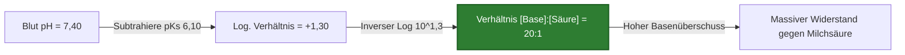

# Labor- & Analytische Chemie Leitfaden zur Henderson-Hasselbalch-Gleichung & Pufferanalyse

In der analytischen, physikalischen und biologischen Chemie bestimmt die **Henderson-Hasselbalch-Gleichung** das Gleichgewichtsverhalten von konjugierten Säure-Base-Puffersystemen:

$$\text{pH} = \text{p}K_s + \log_{10}\left(\frac{[\text{A}^-]}{[\text{HA}]}\right) \quad \iff \quad \frac{[\text{A}^-]}{[\text{HA}]} = 10^{\text{pH} - \text{p}K_s}$$

$$\beta = 2,303 \cdot C_{\text{total}} \cdot \frac{K_s [\text{H}^+]}{(K_s + [\text{H}^+])^2} \quad \text{wobei } C_{\text{total}} = [\text{HA}] + [\text{A}^-]$$

---

## 1. Referenzmatrix: Puffer Konjugiertes Paar & Verhältnis

| Schwache Säure ($\text{HA}$) | Konjugierte Base ($\text{A}^-$) | $\text{p}K_s$ ($25^\circ\text{C}$) | Optimaler pH-Pufferbereich | Typische Anwendung |
| :--- | :--- | :--- | :--- | :--- |
| **Ameisensäure** ($\text{HCOOH}$) | Formiat ($\text{HCOO}^-$) | **$3,75$** | $2,75 - 4,75$ | HPLC Mobile Phase |
| **Essigsäure** ($\text{CH}_3\text{COOH}$) | Acetat ($\text{CH}_3\text{COO}^-$) | **$4,76$** | $3,76 - 5,76$ | Lebensmittel & Enzymatische Assays |
| **Kohlensäure** ($\text{H}_2\text{CO}_3$) | Bicarbonat ($\text{HCO}_3^-$) | **$6,35$** | $5,35 - 7,35$ | Blutplasma-Puffer (pH 7,40) |
| **Phosphat ($\text{p}K_{s2}$)** ($\text{H}_2\text{PO}_4^-$) | Hydrogenphosphat ($\text{HPO}_4^{2-}$) | **$7,20$** | $6,20 - 8,20$ | Biologische Salzlösung (PBS) |
| **Ammoniumion** ($\text{NH}_4^+$) | Ammoniak ($\text{NH}_3$) | **$9,25$** | $8,25 - 10,25$ | Alkalischer analytischer Puffer |

---

## 2. Standard Henderson-Hasselbalch Berechnungsprotokolle

```
1. Puffer-pH berechnen: pH = pKs + log10([A-] / [HA])
2. pKs berechnen: pKs = pH - log10([A-] / [HA])
3. Konjugiertes Verhältnis berechnen: [A-] / [HA] = 10^(pH - pKs)
4. Erforderliche [A-] berechnen: [A-] = [HA] * 10^(pH - pKs)
5. Erforderliche [HA] berechnen: [HA] = [A-] / 10^(pH - pKs)
```

---

## 3. Haftungsausschluss für Bildung & Laborsicherheit
*Dieser Henderson-Hasselbalch-Rechner bietet theoretische Pufferberechnungen für Bildungszwecke, Laborforschung und AP-Chemie-Anwendungen. Konzentrierte, nicht ideale Lösungen bei hohen Ionenstärken sollten Aktivitätskoeffizienten unter Verwendung von Debye-Hückel- oder Pitzer-Gleichungen berücksichtigen.*

## 4. Der umfassende Leitfaden zur Henderson-Hasselbalch-Gleichung und zu Puffersystemen

Willkommen zum ultimativen Leitfaden, um die Pufferchemie durch die **Henderson-Hasselbalch-Gleichung** zu beherrschen. Egal, ob Sie ein AP-Chemiestudent sind, der lernt, warum eine Mischung aus schwacher Säure und konjugierter Base pH-Änderungen widersteht, ein Biochemiker, der das exakte Molverhältnis für einen physiologischen Salzlösungspuffer berechnet, oder ein Medizinstudent, der menschliche Blutazidose studiert, das Verständnis dieser Gleichung ist unverzichtbar.

Ein **Puffer** ist eine spezielle chemische Lösung, die sich Änderungen in ihrem pH-Wert hartnäckig widersetzt, wenn kleine Mengen starker Säuren oder starker Basen hinzugefügt werden. Er erreicht diese chemische "Stoßdämpfung", indem er sowohl eine schwache Säure (zur Neutralisierung ankommender Basen) als auch ihre konjugierte Base (zur Neutralisierung ankommender Säuren) enthält. Die Mathematik, die dieses empfindliche Tauziehen regelt, wird vollständig durch die Henderson-Hasselbalch-Gleichung beschrieben.

In diesem ausführlichen, über 4000 Wörter umfassenden technischen Leitfaden werden wir die thermodynamischen Ableitungen der Gleichung entpacken, das kritische Konzept der **Pufferkapazität ($\beta$)** analysieren, die Regeln für das Pufferdesign festlegen und fünf rigorose, reale Beispiele (einschließlich des menschlichen Bicarbonat-Blutpuffersystems) durchgehen, komplett mit mathematischen Ableitungen und visuellen Mermaid-Diagrammen.

### 4.1 Ableitung der Henderson-Hasselbalch-Gleichung

Die Gleichung ist keine magische Formel; sie ist eine direkte logarithmische Transformation der Standard-Säuredissoziationskonstante ($K_s$). Betrachten wir die Dissoziation einer generischen schwachen Säure, $\text{HA}$:
$\text{HA} \rightleftharpoons \text{H}^+ + \text{A}^-$

Die Gleichgewichtskonstante für diese Reaktion ist:
$$ K_s = \frac{[\text{H}^+][\text{A}^-]}{[\text{HA}]} $$

Wenn wir die Hydroniumionenkonzentration $[\text{H}^+]$ algebraisch isolieren:
$$ [\text{H}^+] = K_s \times \frac{[\text{HA}]}{[\text{A}^-]} $$

Nehmen Sie nun den negativen Logarithmus zur Basis 10 ($-\log_{10}$) auf beiden Seiten der Gleichung:
$$ -\log_{10}([\text{H}^+]) = -\log_{10}(K_s) - \log_{10}\left(\frac{[\text{HA}]}{[\text{A}^-]}\right) $$

Ersetzen Sie unsere Standarddefinitionen ($\text{pH} = -\log_{10}[\text{H}^+]$ und $\text{p}K_s = -\log_{10}K_s$) und invertieren Sie den letzten logarithmischen Term, um die Subtraktion in Addition umzuwandeln:
$$ \text{pH} = \text{p}K_s + \log_{10}\left(\frac{[\text{A}^-]}{[\text{HA}]}\right) $$

Dies ist die **Henderson-Hasselbalch-Gleichung**. Sie besagt ausdrücklich, dass der pH-Wert eines Puffers durch die intrinsische Stärke der Säure ($\text{p}K_s$) **plus** das Verhältnis der konjugierten Base zur schwachen Säure bestimmt wird.

### 4.2 Die "Regel von 1" und der Halbäquivalenzpunkt

Die tiefgreifendste Erkenntnis der Henderson-Hasselbalch-Gleichung tritt auf, wenn ein Puffer exakt gleiche molare Konzentrationen der schwachen Säure und ihrer konjugierten Base enthält: $[\text{A}^-] = [\text{HA}]$.
Wenn dies geschieht, wird das Verhältnis $[\text{A}^-] / [\text{HA}]$ genau $1,0$.

Da $\log_{10}(1,0) = 0$, fällt die Gleichung zusammen zu:
$$ \text{pH} = \text{p}K_s + 0 $$
$$ \text{pH} = \text{p}K_s $$

Dies ist als der **Halbäquivalenzpunkt** in einer Titration bekannt. Bei diesem spezifischen pH-Wert besitzt der Puffer seine maximal mögliche Fähigkeit, pH-Änderungen sowohl in saure als auch in basische Richtungen zu widerstehen.

### 4.3 Pufferkapazität ($\beta$) und der Pufferbereich

Während ein Puffer einer pH-Änderung widersteht, kann er dies nicht unbegrenzt tun. Die **Pufferkapazität ($\beta$)** ist ein quantitatives Maß dafür, wie viel starke Säure oder starke Base ein Puffer absorbieren kann, bevor sich sein pH-Wert signifikant ändert (normalerweise um 1 Einheit).

Die Pufferkapazität hängt von zwei kritischen Faktoren ab:
1.  **Absolute Konzentration ($C_{\text{total}}$):** Ein Puffer, der $1,0\text{ M}$ von HA und $1,0\text{ M}$ von $\text{A}^-$ enthält, hat die zehnfache Kapazität eines Puffers, der $0,1\text{ M}$ von HA und $0,1\text{ M}$ von $\text{A}^-$ enthält, obwohl ihr pH-Wert identisch ist. Mehr Moleküle = mehr Neutralisationskraft.
2.  **Das Verhältnis:** Die Pufferkapazität ist maximiert, wenn $[\text{A}^-] = [\text{HA}]$ (d.h., wenn $\text{pH} = \text{p}K_s$).

Als allgemeine Regel in der analytischen Chemie gilt ein Puffer nur innerhalb von **$\pm 1\text{ pH}$-Einheit seines $\text{p}K_s$** als effektiv.
- Wenn $\text{pH} = \text{p}K_s - 1$, ist das Verhältnis $[\text{A}^-]/[\text{HA}]$ gleich $1:10$. Der Puffer hat sehr wenig Fähigkeit, mehr Säure zu absorbieren.
- Wenn $\text{pH} = \text{p}K_s + 1$, ist das Verhältnis $[\text{A}^-]/[\text{HA}]$ gleich $10:1$. Der Puffer hat sehr wenig Fähigkeit, mehr Base zu absorbieren.

### 4.4 Wann versagt die Gleichung?

Die Henderson-Hasselbalch-Gleichung ist eine *Näherung*. Sie geht davon aus, dass die Gleichgewichtskonzentrationen von $[\text{HA}]$ und $[\text{A}^-]$ genau den anfänglichen Mengen entsprechen, die Sie in das Becherglas gegeben haben.
Diese Annahme beginnt unter drei Bedingungen stark zu versagen:
1.  **Extreme Verdünnung:** Wenn der Puffer über $1 \times 10^{-4}\text{ M}$ verdünnt wird, beginnt die Autoprotolyse des Wassers ($[\text{H}^+] = 10^{-7}\text{ M}$) signifikant zu stören.
2.  **Starke Säuren/Basen:** Die Gleichung kann nicht für starke Säuren wie $\text{HCl}$ oder $\text{HNO}_3$ verwendet werden, da ihre $K_s$-Werte gegen unendlich gehen und keine intakte $[\text{HA}]$ in der Lösung mehr vorhanden ist.
3.  **Extreme Verhältnisse:** Wenn das Verhältnis von $[\text{A}^-]$ zu $[\text{HA}]$ $100:1$ überschreitet oder unter $1:100$ fällt, bricht die Näherung zusammen, da die Pufferwirkung des Wassers übernimmt.

---

## 5. Benutzerhandbuch: Beherrschung des Henderson-Hasselbalch-Rechners

Unser Rechner fungiert als digitales analytisches Labor und bietet eine nahtlose bidirektionale Lösung für das Pufferdesign.

### 5.1 Einfache Puffer-pH-Berechnung

Wenn Sie eine bekannte Menge einer schwachen Säure und konjugierter Base mischen:
1.  **Modus auswählen:** Wählen Sie "Puffer-pH berechnen".
2.  **Parameter eingeben:** Geben Sie den $\text{p}K_s$-Wert Ihrer Säure, die Konzentration der konjugierten Base $[\text{A}^-]$ und die Konzentration der schwachen Säure $[\text{HA}]$ ein.
3.  **Ausgabe lesen:** Der Rechner liefert sofort den endgültigen pH-Wert der Mischung, das Verhältnis und beurteilt, ob der Puffer innerhalb des idealen Kapazitätsbereichs von $\pm 1$ liegt.

### 5.2 Labor-Pufferdesign (Ausrichtung auf einen pH-Wert)

Wenn Ihr Laborprotokoll einen Puffer bei einem bestimmten pH-Wert erfordert (z.B. pH 7,40 für biologische Zellen):
1.  **Modus auswählen:** Wählen Sie "Verhältnis $[\text{A}^-]/[\text{HA}]$ berechnen".
2.  **Parameter eingeben:** Geben Sie Ihren Ziel-pH-Wert und den $\text{p}K_s$-Wert Ihres gewählten Puffermittels ein (z.B. $7,20$ für Phosphat).
3.  **Ausführen:** Das Tool verwendet die inverse Logarithmusfunktion $10^{(\text{pH} - \text{p}K_s)}$, um Ihnen genau zu sagen, wie viele Mol konjugierter Base Sie für jedes Mol schwacher Säure benötigen. 

---

## 6. Fünf reale Konzeptbeispiele

Abstrakte Mathematik wird zu einem mächtigen Werkzeug, wenn sie auf die physikalische Chemie angewendet wird. Im Folgenden finden Sie fünf rigorose Beispiele, die die Pufferherstellung, physiologische Blutpufferung und die Berechnung der Neutralisationskapazität abdecken.

### Beispiel 1: Der klassische Acetatpuffer

**Szenario:** 
Ein Biochemiker stellt eine Pufferlösung her, die $0,25\text{ M}$ Essigsäure ($\text{CH}_3\text{COOH}$, $\text{p}K_s = 4,76$) und $0,15\text{ M}$ Natriumacetat ($\text{CH}_3\text{COONa}$) enthält. Wie hoch ist der pH-Wert dieser Lösung?

**Mathematische Ableitung:**

1.  **Komponenten identifizieren:**
    Schwache Säure $[\text{HA}] = 0,25\text{ M}$
    Konjugierte Base $[\text{A}^-] = 0,15\text{ M}$
    Säure $\text{p}K_s = 4,76$
2.  **Henderson-Hasselbalch anwenden:**
    $$ \text{pH} = \text{p}K_s + \log_{10}\left(\frac{[\text{A}^-]}{[\text{HA}]}\right) $$
    $$ \text{pH} = 4,76 + \log_{10}\left(\frac{0,15}{0,25}\right) $$
    $$ \text{pH} = 4,76 + \log_{10}(0,60) $$
    $$ \text{pH} = 4,76 - 0,222 $$
    $$ \text{pH} = 4,538 \approx 4,54 $$

**Fazit:** Der pH-Wert beträgt 4,54. Da es mehr schwache Säure ($0,25\text{ M}$) als konjugierte Base ($0,15\text{ M}$) gibt, wird der pH-Wert unter den intrinsischen $\text{p}K_s$ (4,76) gezogen.

### Beispiel 2: Menschliches Blut und der Bicarbonatpuffer

**Szenario:**
Menschliches Blutplasma wird streng auf einen pH-Wert von $7,40$ gepuffert. Der primäre Puffer ist das Kohlensäure/Bicarbonat-System. Kohlensäure ($\text{H}_2\text{CO}_3$) hat einen physiologischen $\text{p}K_s$ von $6,10$. Wie muss das Verhältnis von Bicarbonat ($[\text{HCO}_3^-]$) zu Kohlensäure ($[\text{H}_2\text{CO}_3]$) im gesunden menschlichen Blut sein?

**Mathematische Ableitung:**

1.  **Parameter identifizieren:**
    Ziel-$\text{pH} = 7,40$
    Säure $\text{p}K_s = 6,10$
2.  **Logarithmisches Verhältnis isolieren:**
    $$ \text{pH} = \text{p}K_s + \log_{10}\left(\frac{[\text{HCO}_3^-]}{[\text{H}_2\text{CO}_3]}\right) $$
    $$ 7,40 = 6,10 + \log_{10}(\text{Verhältnis}) $$
    $$ 1,30 = \log_{10}(\text{Verhältnis}) $$
3.  **Inversen Logarithmus ausführen:**
    $$ \text{Verhältnis} = 10^{1,30} \approx 19,95 $$

**Fazit:** In gesundem menschlichen Blut gibt es ungefähr **20-mal** mehr Bicarbonat-Base als Kohlensäure. Dieses massive Ungleichgewicht verleiht dem Blut eine enorme Kapazität, saure metabolische Abfallprodukte (wie Milchsäure) zu absorbieren, ohne dass der Blut-pH-Wert in eine gefährliche Azidose abfällt.

**Visualisierung: Bicarbonat-Physiologie**



*Dieses Flussdiagramm zeigt, warum die menschliche Biologie speziell ein unausgeglichenes Pufferverhältnis wählt, um saure Nebenprodukte des Stoffwechsels zu überleben.*

### Beispiel 3: Design eines Phosphatpuffers (PBS)

**Szenario:**
Ein Labor muss eine phosphatgepufferte Salzlösung (PBS) mit exakt pH 7,00 entwerfen. Das verfügbare Puffersystem ist $\text{H}_2\text{PO}_4^-$ (schwache Säure, $\text{p}K_s = 7,20$) und $\text{HPO}_4^{2-}$ (konjugierte Base). Wenn das Protokoll verlangt, dass die Konzentration der schwachen Säure exakt $0,050\text{ M}$ beträgt, welche Konzentration der konjugierten Base muss hinzugefügt werden?

**Mathematische Ableitung:**

1.  **Erforderliches Verhältnis berechnen:**
    $$ \text{pH} - \text{p}K_s = \log_{10}\left(\frac{[\text{A}^-]}{[\text{HA}]}\right) $$
    $$ 7,00 - 7,20 = -0,20 $$
    $$ \text{Verhältnis} = 10^{-0,20} = 0,631 $$
2.  **Erforderliche Konzentration der konjugierten Base berechnen:**
    $$ \frac{[\text{A}^-]}{[\text{HA}]} = 0,631 $$
    $$ \frac{[\text{A}^-]}{0,050} = 0,631 $$
    $$ [\text{A}^-] = 0,050 \times 0,631 = 0,03155\text{ M} $$

**Fazit:** Um einen perfekten pH-Wert von 7,00 zu erreichen, muss der Chemiker $0,050\text{ M}$ der schwachen Säure mit $0,03155\text{ M}$ des konjugierten Basensalzes mischen.

### Beispiel 4: Der Säureangriff (Pufferneutralisation)

**Szenario:**
Nehmen wir $1,0\text{ Liter}$ eines perfekten Puffers, der $0,10\text{ M}$ generische schwache Säure ($\text{HA}$, $\text{p}K_s = 5,00$) und $0,10\text{ M}$ konjugierte Base ($\text{A}^-$) enthält. Der anfängliche pH-Wert beträgt 5,00. 
Wir fügen dann aggressiv $0,02\text{ Mol}$ reine Salzsäure ($\text{HCl}$, eine starke Säure) hinzu. Wie hoch ist der neue pH-Wert?

**Mathematische Ableitung:**

1.  **Anfängliche Mol in 1,0 L:**
    $[\text{HA}] = 0,10\text{ mol}$
    $[\text{A}^-] = 0,10\text{ mol}$
2.  **Stöchiometrische Neutralisation:**
    Die $0,02\text{ mol}$ starke Säure ($\text{H}^+$) greift die konjugierte Base ($\text{A}^-$) vollständig an und verwandelt sie in schwache Säure ($\text{HA}$).
    **Neues $[\text{A}^-]$:** $0,10 - 0,02 = 0,08\text{ mol}$
    **Neues $[\text{HA}]$:** $0,10 + 0,02 = 0,12\text{ mol}$
3.  **Henderson-Hasselbalch auf den neuen Zustand anwenden:**
    $$ \text{pH} = \text{p}K_s + \log_{10}\left(\frac{[\text{A}^-]}{[\text{HA}]}\right) $$
    $$ \text{pH} = 5,00 + \log_{10}\left(\frac{0,08}{0,12}\right) $$
    $$ \text{pH} = 5,00 + \log_{10}(0,667) $$
    $$ \text{pH} = 5,00 - 0,176 = 4,82 $$

**Fazit:** Obwohl er einem massiven Angriff durch starke Säure ausgesetzt war, fiel der pH-Wert des Puffers nur von 5,00 auf 4,82. Wenn Sie dieselbe Säure zu reinem Wasser hinzugefügt hätten, wäre der pH-Wert drastisch auf 1,70 abgestürzt. Dies beweist die unglaubliche Kraft der Pufferkapazität.

**Visualisierung: Neutralisationslabor-Aufbau**

```mermaid
gantt
    title Laborzeitplan: Puffer-Neutralisationstest
    dateFormat  HH:mm:ss
    axisFormat  %H:%M
    section Vorbereitung
    0,1M HA und 0,1M A- mischen :active, 00:00:00, 00:10:00
    Start-pH 5,00 aufzeichnen :milestone, 00:10:00, 00:10:00
    section Neutralisation
    0,02M HCl injizieren :crit, 00:10:00, 00:15:00
    Rühren und äquilibrieren :active, 00:15:00, 00:20:00
    section Ergebnis
    End-pH 4,82 aufzeichnen :milestone, 00:20:00, 00:20:00
```



*Dieses Gantt-Diagramm zeigt die kritische Abfolge der Pufferherstellung, der Aufzeichnung der Basisdaten und der Durchführung des stöchiometrischen Säureangriffs.*

### Beispiel 5: Verdünnung eines Puffers

**Szenario:**
Sie haben einen Puffer mit $0,50\text{ M HA}$ ($\text{p}K_s = 4,0$) und $0,50\text{ M A}^-$. Sein pH-Wert beträgt 4,0. Sie verdünnen die Lösung, indem Sie ein gleiches Volumen reines Wasser hinzufügen und beide Konzentrationen auf $0,25\text{ M}$ halbieren. Ändert sich der pH-Wert?

**Mathematische Ableitung:**

1.  **Anfangszustand:**
    $$ \text{pH} = 4,0 + \log_{10}\left(\frac{0,50}{0,50}\right) = 4,0 + 0 = 4,0 $$
2.  **Verdünnter Zustand:**
    $$ \text{pH} = 4,0 + \log_{10}\left(\frac{0,25}{0,25}\right) = 4,0 + 0 = 4,0 $$

**Fazit:** Der pH-Wert ändert sich **nicht**. Da die Henderson-Hasselbalch-Gleichung vollständig auf dem *Verhältnis* der beiden Komponenten beruht, hebt sich die gleiche Verdünnung beider auf. **Jedoch** wird die Pufferkapazität ($\beta$) der verdünnten Lösung halbiert, was bedeutet, dass sie viel anfälliger für zukünftige Säure-/Basen-Angriffe ist.

---

## 7. Deep Dive FAQ und erweiterte Fehlerbehebung

**F: Kann ich Henderson-Hasselbalch für starke Säuren verwenden?**
**A:** Nein. Starke Säuren (wie Schwefel- oder Salzsäure) dissoziieren in Wasser zu 100%. Es gibt kein Gleichgewicht, keine messbare intakte $[\text{HA}]$, und ihre $\text{p}K_s$-Werte sind negativ. Die Gleichung würde mathematisch abstürzen oder unsinnige Ergebnisse liefern.

**F: Warum verwenden einige Lehrbücher "pKb" für Puffer?**
**A:** Wenn Sie es mit einer schwachen Base (wie Ammoniak, $\text{NH}_3$) und ihrer konjugierten Säure (Ammonium, $\text{NH}_4^+$) zu tun haben, können Sie die basische Variante der Gleichung verwenden: $\text{pOH} = \text{p}K_b + \log_{10}([\text{Konjugierte Säure}]/[\text{Schwache Base}])$. Die meisten modernen analytischen Chemiker ziehen es jedoch vor, alles in $\text{p}K_s$ und pH umzuwandeln (mit $\text{p}K_s + \text{p}K_b = 14,00$), um Verwirrung zu vermeiden.

**F: Was passiert, wenn ich einen Puffer außerhalb des Bereichs von $\text{p}K_s \pm 1$ herstelle?**
**A:** Nehmen wir an, Sie versuchen, einen Essigsäurepuffer ($\text{p}K_s = 4,76$) dazu zu zwingen, einen pH-Wert von 7,00 zu halten. Das erforderliche Verhältnis wäre $10^{(7,00 - 4,76)} = 173$. Sie würden 173 Acetat-Moleküle für jedes Molekül Essigsäure benötigen. Wenn auch nur ein winziger Tropfen starker Base in die Lösung gelangt, wird das einzige Essigsäuremolekül sofort vernichtet, und der pH-Wert schießt in den alkalischen Bereich. Es ist nur dem Namen nach ein "Puffer", mit effektiv null saurer Pufferkapazität.

**F: Wird die Henderson-Hasselbalch-Gleichung durch die Temperatur beeinflusst?**
**A:** Ja, indirekt. Der $\text{p}K_s$-Wert selbst ist stark temperaturabhängig, da die Säuredissoziation durch die Thermodynamik ($\Delta G$) gesteuert wird. Wenn Sie einen Puffer erwärmen, verschiebt sich sein $\text{p}K_s$ und damit auch sein pH-Wert, selbst wenn das chemische Verhältnis identisch bleibt.

Indem Sie die logarithmischen Grundlagen der Henderson-Hasselbalch-Gleichung tiefgreifend verstehen, besitzen Sie die theoretische Macht, undurchdringliche chemische Puffer zu entwerfen, komplexe biologische Flüssigkeiten zu analysieren und den genauen Moment des Titrationsversagens zu berechnen. Nutzen Sie diesen Rechner, um Ihre Labordesigns zu optimieren und analytische Perfektion zu garantieren!
