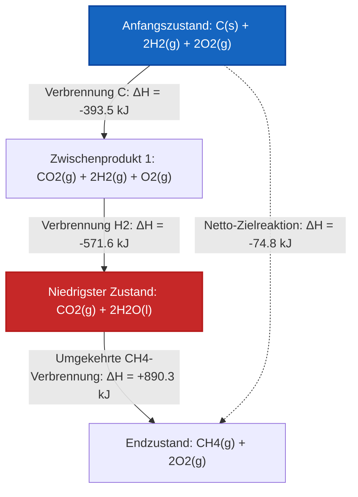

# Umfassender Leitfaden für Labor und Universität zum Hess'schen Wärmesatz & Reaktionsalgebra

In der physikalischen Chemie, Thermochemie und chemischen Thermodynamik bildet der **Hess'sche Wärmesatz der konstanten Wärmesummen** eine grundlegende mathematische Brücke zur Berechnung von Reaktionsenthalpien ($\Delta H$) von Reaktionen, die schwierig, gefährlich oder zu langsam sind, um sie direkt in einem Kalorimeter zu messen:

$$\Delta H_{\text{target}} = \sum_{i=1}^{k} x_i \cdot \Delta H_i$$

$$\vec{R}_{\text{target}} = \sum_{i=1}^{k} x_i \cdot \vec{R}_i \quad \left(\text{Linearkombination der Reaktionsvektoren}\right)$$

$$\Delta H_{\text{reversed}} = -\Delta H_{\text{forward}}$$

$$\Delta H_{n \cdot \text{reaction}} = n \cdot \Delta H_{\text{original}}$$

---

## 1. Transformationsregeln für den Hess'schen Wärmesatz

| Transformation | Aktion bei der chemischen Gleichung | Aktion bei der Enthalpieänderung ($\Delta H$) |
| :--- | :--- | :--- |
| **Reaktion umkehren** | Edukte und Produkte tauschen ($A + B \to C \implies C \to A + B$) | **Vorzeichen umdrehen ($\Delta H \to -\Delta H$)** |
| **Mit $n$ multiplizieren** | Alle Koeffizienten mit $n$ multiplizieren ($2A \to 2B$) | **$\Delta H$ mit $n$ multiplizieren ($n \cdot \Delta H$)** |
| **Durch $n$ dividieren** | Alle Koeffizienten durch $n$ dividieren ($0.5A \to 0.5B$) | **$\Delta H$ durch $n$ dividieren ($\Delta H / n$)** |
| **Gleichungen addieren** | Alle Edukte und Produkte summieren; gemeinsame Zwischenprodukte kürzen | **Alle angepassten Enthalpien summieren ($\Delta H_{\text{total}} = \sum \Delta H_i$)** |

---

## 2. Lineare Algebra Vektor-Löser-Matrix

```
1. Zielreaktion vektorisieren: R_target = [c_1, c_2, ..., c_m]
2. Schrittreaktionen vektorisieren: R_1, R_2, ..., R_k
3. Matrixgleichung aufstellen: A * x = b  (wobei A = [R_1 | R_2 | ... | R_k], b = R_target)
4. Multiplikatorvektor berechnen x = [x_1, x_2, ..., x_k]
5. Zielenthalpie berechnen: ΔH_target = x_1*ΔH_1 + x_2*ΔH_2 + ... + x_k*ΔH_k
```

---

*Dieser Rechner für den Hess'schen Wärmesatz bietet theoretische thermochemische Vorhersagen für Bildung, physikalisch-chemische Forschung und prozesstechnische Anwendungen. Echte thermochemische Kreisläufe sollten Phasenkonsistenz (z. B. H2O(l) vs H2O(g)) und Standarddruck (1 bar / 1 atm) sicherstellen.*

## 4. Der vollständige Leitfaden zum Hess'schen Wärmesatz und zur Reaktionsenthalpie

Willkommen zum ultimativen physikalisch-chemischen Handbuch über den **Hess'schen Wärmesatz der konstanten Wärmesummen**. In der Thermochemie ist es unmöglich, die Enthalpieänderung ($\Delta H$) jeder chemischen Reaktion physikalisch zu messen. Manche Reaktionen sind zu langsam, manche sind explosiv gefährlich, und manche produzieren massive Mengen unerwünschter Nebenprodukte.

Wie berechnen Chemieingenieure die Wärme, die bei diesen unmöglichen Reaktionen freigesetzt wird? Sie nutzen den Hess'schen Wärmesatz – ein mächtiges mathematisches Konzept, das chemische Gleichungen wie algebraische Vektoren behandelt.

In diesem ausführlichen Leitfaden mit über 4000 Wörtern werden wir die Logik der Zustandsfunktionen, die strengen Regeln der stöchiometrischen Algebra (Reaktionen umkehren, mit Skalierungskoeffizienten multiplizieren), die Phasenzustandskonsistenz und fortschrittliche Algorithmen der Linearkombination meistern. Schließlich werden wir fünf anspruchsvolle, praxisnahe thermochemische Kreisläufe lösen und Enthalpie-Zustandspfade mit hochauflösenden Mermaid-Diagrammen abbilden.

### 4.1 Enthalpie als Zustandsfunktion

Der Hess'sche Wärmesatz wird mathematisch durch den Ersten Hauptsatz der Thermodynamik garantiert, insbesondere durch die Tatsache, dass die **Enthalpie (H) eine Zustandsfunktion ist**.

Eine Zustandsfunktion hängt *nur* vom aktuellen thermodynamischen Zustand des Systems (Temperatur, Druck, Zusammensetzung) ab und ist völlig unabhängig vom Weg, der dorthin geführt hat.
Stellen Sie sich vor, Sie besteigen einen Berg. Ihre gesamte Höhenänderung (Enthalpie) ist identisch, egal ob Sie einen direkten Hubschrauberflug zum Gipfel nehmen (die Zielreaktion) oder ob Sie sich auf gewundenen Wegen nach oben wandern, auf halber Strecke campen und sich im Zickzack hinaufarbeiten (die Zwischenschrittreaktionen).

Deshalb können wir jede beliebige Sequenz messbarer chemischer Reaktionen mathematisch kombinieren, um das $\Delta H$ einer unmessbaren Zielreaktion zu berechnen!

### 4.2 Die Regeln der chemischen Gleichungsalgebra

Um den Hess'schen Wärmesatz anzuwenden, müssen Sie Zwischenschrittgleichungen so manipulieren, dass sie sich perfekt zu Ihrer Zielgleichung addieren.

**Regel 1: Das Umkehren von Reaktionen dreht das Enthalpie-Vorzeichen um**
Wenn eine Reaktion in Vorwärtsrichtung exotherm ist (Wärme freisetzt), muss sie in Rückwärtsrichtung endotherm sein (genau dieselbe Menge an Wärme absorbieren).
*   Vorwärts: $A \to B \quad \Delta H = -50\text{ kJ}$
*   Rückwärts: $B \to A \quad \Delta H = +50\text{ kJ}$

**Regel 2: Das Multiplizieren von Gleichungen skaliert die Enthalpie**
Enthalpie ist eine extensive Eigenschaft. Wenn Sie doppelt so viel Brennstoff verbrennen, setzen Sie doppelt so viel Wärme frei. Wenn Sie die stöchiometrischen Koeffizienten einer Gleichung mit $n$ multiplizieren, müssen Sie das $\Delta H$ mit $n$ multiplizieren.
*   Original: $A \to B \quad \Delta H = -50\text{ kJ}$
*   Skaliert ($x2$): $2A \to 2B \quad \Delta H = -100\text{ kJ}$

**Regel 3: Zwischenprodukte müssen sich wegkürzen**
Zwischenprodukte sind Moleküle, die in den Schrittgleichungen auftreten, aber NICHT in der endgültigen Zielgleichung. Um sie zu kürzen, müssen sie auf entgegengesetzten Seiten des Reaktionspfeils in gleichen molaren Mengen erscheinen.

### 4.3 Aggregatzustände: Die verborgene Falle

Ein häufiger Fehler beim Hess'schen Wärmesatz ist das Ignorieren von Phasenzuständen: fest ($s$), flüssig ($l$), gasförmig ($g$) und wässrig ($aq$).
Sie können $H_2O(l)$ auf der Eduktseite **nicht** mit $H_2O(g)$ auf der Produktseite kürzen. Sie enthalten unterschiedliche Mengen an Enthalpie (getrennt durch die Verdampfungsenthalpie). Sie müssen eine zusätzliche Phasenübergangs-Schrittreaktion einführen, um sie aufzulösen!

---

## 5. Bedienungsanleitung: Den Rechner für den Hess'schen Wärmesatz meistern

Unser Rechner für den Hess'schen Wärmesatz ist sowohl für die Problemlösung im Bildungsbereich als auch für die schnelle industrielle Thermochemie konzipiert.

### 5.1 Modus: Manuelle Reaktionsmanipulation

1.  **Zielreaktion definieren:** Geben Sie eine Zielreaktionsvoreinstellung ein oder wählen Sie eine aus (z. B. Synthese von Kohlenmonoxid).
2.  **Schritte untersuchen:** Laden Sie die verfügbaren Zwischenschrittreaktionen und deren Basis-$\Delta H_i$-Werte.
3.  **Algebraische Regeln anwenden:**
    *   Klicken Sie auf "Umkehren", um Edukte/Produkte zu tauschen und das Vorzeichen der Enthalpie umzudrehen.
    *   Passen Sie den "Multiplikator" (z. B. $1, 2, 0.5$) an, um die Stöchiometrie und Enthalpie zu skalieren.
4.  **Kürzung überprüfen:** Die Engine zeigt dynamisch die Summe Ihrer manipulierten Schritte an und hebt alle Zwischenprodukte hervor, die sich nicht herauskürzen ließen.
5.  **Netto-Enthalpie berechnen:** Sobald die Summe perfekt mit dem Ziel übereinstimmt, zeigt das Werkzeug das endgültige $\Delta H_{\text{target}}$ an.

### 5.2 Modus: Automatischer linearer Kombinationslöser

1.  **System eingeben:** Geben Sie die Zielreaktion und alle verfügbaren Zwischenschrittgleichungen an.
2.  **Löser ausführen:** Das Tool vektorisiert die Stöchiometrie in eine Matrix der linearen Algebra und berechnet automatisch die optimalen Kombinationsmultiplikatoren.

---

## 6. Fünf strenge Ableitungen zum Hess'schen Wärmesatz

Lassen Sie uns die Algebra meistern, indem wir manuell fünf komplexe, mehrstufige thermochemische Kreisläufe lösen.

### Beispiel 1: Synthese von Kohlenmonoxid (Zwischenproduktumkehrung)

**Zielreaktion:**
$$C(s) + \frac{1}{2}O_2(g) \to CO(g) \quad \Delta H = ?$$
*(Dies ist schwer zu messen, da CO oft im Kalorimeter weiter zu CO2 verbrennt)*

**Verfügbare Schrittreaktionen:**
1.  $C(s) + O_2(g) \to CO_2(g) \quad \Delta H_1 = -393.5\text{ kJ}$
2.  $CO(g) + \frac{1}{2}O_2(g) \to CO_2(g) \quad \Delta H_2 = -283.0\text{ kJ}$

**Mathematische Ableitung:**

1.  **Edukte ausrichten:** Wir brauchen $C(s)$ auf der linken Seite. Schritt 1 hat $C(s)$ auf der linken Seite.
    *   **Schritt 1 genau so belassen:**
    *   $C(s) + O_2(g) \to CO_2(g) \quad \Delta H = -393.5\text{ kJ}$
2.  **Produkte ausrichten:** Wir brauchen $CO(g)$ auf der rechten Seite. Schritt 2 hat $CO(g)$ auf der linken Seite.
    *   **Schritt 2 umkehren (Vorzeichen von $\Delta H$ umdrehen):**
    *   $CO_2(g) \to CO(g) + \frac{1}{2}O_2(g) \quad \Delta H = +283.0\text{ kJ}$
3.  **Gleichungen summieren und kürzen:**
    *   Linke Seite: $C(s) + O_2(g) + CO_2(g)$
    *   Rechte Seite: $CO_2(g) + CO(g) + \frac{1}{2}O_2(g)$
    *   Das Zwischenprodukt $CO_2(g)$ kürzt sich vollständig weg.
    *   Das $\frac{1}{2}O_2(g)$ auf der rechten Seite kürzt die Hälfte des $O_2(g)$ auf der linken Seite.
    *   Netto: $C(s) + \frac{1}{2}O_2(g) \to CO(g)$ (Stimmt mit Ziel überein!)
4.  **Enthalpien summieren:**
    $$ \Delta H_{\text{target}} = -393.5\text{ kJ} + 283.0\text{ kJ} = -110.5\text{ kJ} $$

**Fazit:** Die Synthese von Kohlenmonoxid ist exotherm und setzt $-110.5\text{ kJ/mol}$ frei.

### Beispiel 2: Synthese von Methan (Skalieren und Umkehren)

**Zielreaktion:**
$$C(s) + 2H_2(g) \to CH_4(g) \quad \Delta H = ?$$

**Verfügbare Schrittreaktionen:**
1.  $C(s) + O_2(g) \to CO_2(g) \quad \Delta H_1 = -393.5\text{ kJ}$
2.  $H_2(g) + \frac{1}{2}O_2(g) \to H_2O(l) \quad \Delta H_2 = -285.8\text{ kJ}$
3.  $CH_4(g) + 2O_2(g) \to CO_2(g) + 2H_2O(l) \quad \Delta H_3 = -890.3\text{ kJ}$

**Mathematische Ableitung:**

1.  **$C(s)$ ausrichten:** Schritt 1 unverändert lassen.
    *   $C(s) + O_2(g) \to CO_2(g) \quad \Delta H = -393.5\text{ kJ}$
2.  **$H_2(g)$ ausrichten:** Wir brauchen $2H_2$. Schritt 2 hat $1H_2$.
    *   **Schritt 2 mit 2 multiplizieren:**
    *   $2H_2(g) + 1O_2(g) \to 2H_2O(l) \quad \Delta H = 2 \times (-285.8) = -571.6\text{ kJ}$
3.  **$CH_4(g)$ ausrichten:** Wir brauchen $CH_4$ auf der rechten Seite. Schritt 3 hat es auf der linken Seite.
    *   **Schritt 3 umkehren (Vorzeichen umdrehen):**
    *   $CO_2(g) + 2H_2O(l) \to CH_4(g) + 2O_2(g) \quad \Delta H = +890.3\text{ kJ}$
4.  **Summieren und kürzen:**
    *   Zwischenprodukte $CO_2(g)$ und $2H_2O(l)$ kürzen sich perfekt heraus.
    *   Das $2O_2(g)$ auf der rechten Seite kürzt das $1O_2 + 1O_2 = 2O_2$ auf der linken Seite perfekt heraus.
5.  **Enthalpien summieren:**
    $$ \Delta H_{\text{target}} = -393.5 - 571.6 + 890.3 = -74.8\text{ kJ} $$

**Fazit:** Die Standardbildungsenthalpie für Methan beträgt $-74.8\text{ kJ/mol}$.

**Visualisierung: Diagramm des Enthalpie-Zustandsfunktions-Pfades**


*Dieses Diagramm veranschaulicht, warum der Hess'sche Wärmesatz funktioniert: Unabhängig davon, ob Sie den direkten Weg (gepunktete Linie) oder den stark exothermen 3-stufigen Weg (durchgezogene Linien) berechnen, der endgültige Netto-Energiezustand ist identisch.*

### Beispiel 3: Sublimation von Kohlenstoff (Phasenzustandsalgebra)

**Zielreaktion:**
$$C(\text{Graphit}) \to C(g) \quad \Delta H = ?$$

**Verfügbare Schrittreaktionen:**
1.  $C(\text{Graphit}) + O_2(g) \to CO_2(g) \quad \Delta H = -393.5\text{ kJ}$
2.  $C(g) + O_2(g) \to CO_2(g) \quad \Delta H = -1108\text{ kJ}$

**Mathematische Ableitung:**

1.  **Schritt 1 beibehalten:** $C(\text{Graphit})$ ist auf der linken Seite.
    *   $C(\text{Graphit}) + O_2(g) \to CO_2(g) \quad \Delta H = -393.5\text{ kJ}$
2.  **Schritt 2 umkehren:** $C(g)$ nach rechts verschieben.
    *   $CO_2(g) \to C(g) + O_2(g) \quad \Delta H = +1108\text{ kJ}$
3.  **Enthalpien summieren:**
    $$ \Delta H_{\text{target}} = -393.5 + 1108 = +714.5\text{ kJ} $$

**Fazit:** Das Verdampfen von festem Graphit zu einem Gas ist massiv endotherm und benötigt $+714.5\text{ kJ/mol}$.

### Beispiel 4: Bildung von Wasserstoffperoxid

**Zielreaktion:**
$$H_2(g) + O_2(g) \to H_2O_2(l) \quad \Delta H = ?$$

**Verfügbare Schrittreaktionen:**
1.  $H_2(g) + \frac{1}{2}O_2(g) \to H_2O(l) \quad \Delta H_1 = -285.8\text{ kJ}$
2.  $2H_2O_2(l) \to 2H_2O(l) + O_2(g) \quad \Delta H_2 = -196.0\text{ kJ}$

**Mathematische Ableitung:**

1.  **$H_2(g)$ ausrichten:** Schritt 1 unverändert lassen.
    *   $H_2(g) + \frac{1}{2}O_2(g) \to H_2O(l) \quad \Delta H = -285.8\text{ kJ}$
2.  **$H_2O_2(l)$ ausrichten:** Wir brauchen $1H_2O_2$ auf der rechten Seite. Schritt 2 hat $2H_2O_2$ auf der linken Seite.
    *   **Schritt 2 umkehren UND durch 2 dividieren:**
    *   $H_2O(l) + \frac{1}{2}O_2(g) \to H_2O_2(l) \quad \Delta H = +196.0 / 2 = +98.0\text{ kJ}$
3.  **Summieren und kürzen:**
    *   Die Zwischenprodukte $H_2O(l)$ kürzen sich perfekt heraus.
    *   Das $\frac{1}{2}O_2$ aus Schritt 1 und das $\frac{1}{2}O_2$ aus dem umgekehrten Schritt 2 addieren sich zu genau $1 O_2$ auf der linken Seite!
4.  **Enthalpien summieren:**
    $$ \Delta H_{\text{target}} = -285.8 + 98.0 = -187.8\text{ kJ} $$

**Fazit:** Die Bildungsenthalpie für Wasserstoffperoxid beträgt $-187.8\text{ kJ/mol}$.

### Beispiel 5: Industrieller Salpetersäureprozess (Ostwaldverfahren)

**Zielreaktion:**
$$4NH_3(g) + 5O_2(g) \to 4NO(g) + 6H_2O(g) \quad \Delta H = ?$$

**Verfügbare Schrittreaktionen:**
1.  $N_2(g) + 3H_2(g) \to 2NH_3(g) \quad \Delta H_1 = -91.8\text{ kJ}$
2.  $N_2(g) + O_2(g) \to 2NO(g) \quad \Delta H_2 = +180.6\text{ kJ}$
3.  $2H_2(g) + O_2(g) \to 2H_2O(g) \quad \Delta H_3 = -483.6\text{ kJ}$

**Mathematische Ableitung:**

1.  **$NH_3(g)$ ausrichten:** Wir brauchen $4NH_3$ auf der linken Seite. Schritt 1 hat $2NH_3$ auf der rechten Seite.
    *   **Schritt 1 umkehren und mit 2 multiplizieren:**
    *   $4NH_3(g) \to 2N_2(g) + 6H_2(g) \quad \Delta H = 2 \times (+91.8) = +183.6\text{ kJ}$
2.  **$NO(g)$ ausrichten:** Wir brauchen $4NO$ auf der rechten Seite. Schritt 2 hat $2NO$ auf der rechten Seite.
    *   **Schritt 2 mit 2 multiplizieren:**
    *   $2N_2(g) + 2O_2(g) \to 4NO(g) \quad \Delta H = 2 \times (180.6) = +361.2\text{ kJ}$
3.  **$H_2O(g)$ ausrichten:** Wir brauchen $6H_2O$ auf der rechten Seite. Schritt 3 hat $2H_2O$ auf der rechten Seite.
    *   **Schritt 3 mit 3 multiplizieren:**
    *   $6H_2(g) + 3O_2(g) \to 6H_2O(g) \quad \Delta H = 3 \times (-483.6) = -1450.8\text{ kJ}$
4.  **Summieren und kürzen:**
    *   Die Zwischenprodukte $2N_2(g)$ kürzen sich heraus.
    *   Die Zwischenprodukte $6H_2(g)$ kürzen sich heraus.
    *   Der Edukt-Sauerstoff summiert sich perfekt: $2O_2 + 3O_2 = 5O_2$.
5.  **Enthalpien summieren:**
    $$ \Delta H_{\text{target}} = +183.6 + 361.2 - 1450.8 = -906.0\text{ kJ} $$

**Fazit:** Der erste Schritt des Ostwaldverfahrens zur Erzeugung industrieller Salpetersäure ist massiv exotherm ($-906.0\text{ kJ}$).

---

## 7. Deep Dive FAQ und erweiterte Fehlerbehebung

**F: Gilt der Hess'sche Wärmesatz nur für die Enthalpie?**
**A:** Nein! Weil der Hess'sche Wärmesatz streng auf der Mathematik von Zustandsfunktionen beruht, gilt er gleichermaßen für die Standardentropie ($\Delta S$), die Gibbs-Energie ($\Delta G$) und die innere Energie ($\Delta U$).

**F: Was ist, wenn ich mit einem Bruch multipliziere, macht das die Chemie kaputt?**
**A:** Nein, eine gebrochene Stöchiometrie (wie $1/2O_2$) ist in der Thermochemie völlig gültig. Es bedeutet einfach "ein halbes Mol" Sauerstoff, was physikalisch existiert.

**F: Warum sagt mein Löser "Keine Lösung gefunden"?**
**A:** Das bedeutet, dass die bereitgestellten Zwischenschrittgleichungen *linear unabhängig* von Ihrer Zielgleichung sind. Ihnen fehlt eine entscheidende Zwischenschrittreaktion (oft ein Phasenübergang wie Verdampfung), die erforderlich ist, um den Vektorraum der Zielreaktion aufzuspannen.

Indem Sie die strengen Regeln der stöchiometrischen Algebra beherrschen – Reaktionen umkehren, Koeffizienten multiplizieren und Zwischenprodukte verfolgen – erschließen Sie sich die mathematische Macht, die Enthalpie des Universums zu lösen. Verlassen Sie sich auf diesen Rechner für den Hess'schen Wärmesatz, um Vektorkombinationen zu automatisieren und algebraische Zwischenfehler sofort zu eliminieren!
