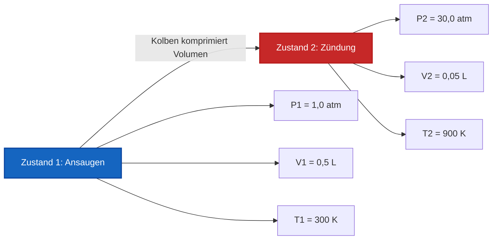

# Vollständiger Labor- & Industrie-Leitfaden zum idealen Gasgesetz & zur Gasthermodynamik

In der physikalischen Chemie, Gasdynamik und chemischen Verfahrenstechnik definiert das **ideale Gasgesetz** das Zustandsverhalten von gasförmiger Materie:

$$P \cdot V = n \cdot R \cdot T \quad \left(\text{Ideale Gasgleichung}\right)$$

$$\rho = \frac{P \cdot M}{R \cdot T} \quad \left(\text{Formel für Gasdichte}\right)$$

$$M = \frac{\rho \cdot R \cdot T}{P} \quad \left(\text{Molare Masse aus Gasdichte}\right)$$

$$V_m = \frac{V}{n} = \frac{R \cdot T}{P} \quad \left(\text{Molvolumen}\right)$$

$$\frac{P_1 \cdot V_1}{T_1} = \frac{P_2 \cdot V_2}{T_2} \quad \left(\text{Kombiniertes Gasgesetz für festes } n\right)$$

$$Z = \frac{P \cdot V}{n \cdot R \cdot T} \quad \left(\text{Kompressibilitätsfaktor}\right)$$

---

## 1. Werte der universellen Gaskonstante $R$ in verschiedenen Einheitensystemen

| Druckeinheit ($P$) | Volumeneinheit ($V$) | Stoffmenge ($n$) | Temp ($T$) | Wert der Gaskonstante ($R$) |
| :--- | :--- | :--- | :--- | :--- |
| **Atmosphären ($\text{atm}$)** | **Liter ($\text{L}$)** | **$\text{mol}$** | **$\text{K}$** | **$0,082057\text{ L}\cdot\text{atm/(mol}\cdot\text{K)}$** |
| **Pascal ($\text{Pa}$)** | **Kubikmeter ($\text{m}^3$)** | **$\text{mol}$** | **$\text{K}$** | **$8,314462\text{ J/(mol}\cdot\text{K)}$** |
| **Bar ($\text{bar}$)** | **Liter ($\text{L}$)** | **$\text{mol}$** | **$\text{K}$** | **$0,083145\text{ L}\cdot\text{bar/(mol}\cdot\text{K)}$** |
| **Torr / $\text{mmHg}$** | **Liter ($\text{L}$)** | **$\text{mol}$** | **$\text{K}$** | **$62,3637\text{ L}\cdot\text{mmHg/(mol}\cdot\text{K)}$** |

---

## 2. Gasgesetz-Löser & Matrix der thermodynamischen Beziehungen

```
1. Berechne Druck: P = (n * R * T) / V
2. Berechne Volumen: V = (n * R * T) / P
3. Berechne Stoffmenge: n = (P * V) / (R * T)
4. Berechne Absolute Temp: T_K = (P * V) / (n * R)
5. Berechne Gasdichte: ρ = (P * M) / (R * T)
6. Berechne Molare Masse: M = (ρ * R * T) / P
7. Zwei-Zustands-Kombiniertes Gasgesetz: P2 = (P1 * V1 * T2) / (V2 * T1)
8. Kompressibilitätsfaktor: Z = (P * V) / (n * R * T)
```

---

*Dieser Rechner für das ideale Gasgesetz liefert theoretische thermodynamische Vorhersagen für bildungsbezogene Zwecke, physikalisch-chemische Forschung und gasspezifische verfahrenstechnische Anwendungen. Für die reale Gasdynamik bei extremen Drücken ($P > 100\text{ atm}$) oder niedrigen Temperaturen ($T \approx T_{\text{boil}}$) sollten die Van-der-Waals- oder Redlich-Kwong-Gleichungen für reale Gase verwendet werden.*

## 4. Der umfassende Leitfaden zum idealen Gasgesetz und zur Gasthermodynamik

Willkommen zum ultimativen Handbuch der physikalischen Chemie über das **ideale Gasgesetz ($PV = nRT$)**. Warum steigt ein Heißluftballon in den kalten Morgenhimmel? Warum halten tiefsee-Taucherflaschen tödlichen Druck aus? Warum bläht sich eine versiegelte Tüte Kartoffelchips auf einem Flug in großer Höhe auf und platzt?

Die mathematische Antwort auf all diese Phänomene liegt in der makellosen algebraischen Balance der Gasthermodynamik. In diesem ausführlichen Leitfaden mit über 4000 Wörtern werden wir die kinetische Gastheorie, die $PV=nRT$ zugrunde liegt, sezieren, die absolute Kelvin-Temperaturskala rigoros definieren, Formeln für molare Masse und Gasdichte ableiten und fünf anspruchsvolle thermodynamische Ingenieurszenarien aus der realen Welt lösen.

### 4.1 Die kinetische Gastheorie idealer Gase

Das ideale Gasgesetz ist ein mathematisches Modell, das die makroskopischen Eigenschaften eines Gases (Druck, Volumen, Temperatur) perfekt beschreibt, indem es einige kritische Annahmen über sein mikroskopisches Verhalten trifft:
1.  **Punktmassen:** Gasmoleküle sind unendlich klein. Ihr physikalisches Volumen ist im Vergleich zum massiven leeren Raum des Behälters null.
2.  **Keine intermolekularen Kräfte:** Gasmoleküle ziehen sich weder an noch stoßen sie sich ab. Sie verhalten sich wie perfekte, unabhängige Billardkugeln.
3.  **Elastische Stöße:** Wenn Gasmoleküle mit den Wänden des Behälters kollidieren (was Druck erzeugt), prallen sie ohne Verlust an kinetischer Energie ab.
4.  **Temperatur entspricht kinetischer Energie:** Die absolute Kelvin-Temperatur ($T$) ist direkt und linear proportional zur durchschnittlichen kinetischen Energie der rasenden Moleküle.

### 4.2 Die entscheidende Bedeutung von absolutem Kelvin ($K$)

Der häufigste katastrophale Fehler bei Gasgesetzberechnungen ist die Verwendung von Celsius ($^\circ\text{C}$) oder Fahrenheit ($^\circ\text{F}$). **Sie müssen strikt Kelvin ($K$) verwenden.**

Warum? Weil das ideale Gasgesetz ein Verhältnis absoluter Größen ist. Wenn Sie Celsius verwenden, würde $0^\circ\text{C}$ mathematisch zu $0\text{ Volumen}$ und $0\text{ Druck}$ führen! Schlimmer noch, negative Celsius-Temperaturen würden zu *negativen* Volumina führen – eine physikalische Unmöglichkeit.
Kelvin behebt das. $0\text{ K}$ (Absoluter Nullpunkt) ist der wahre Zustand, in dem jegliche molekulare kinetische Bewegung stoppt.
**Umrechnung:** $T_{\text{K}} = T_{^\circ\text{C}} + 273,15$

### 4.3 Standardbedingungen (STP vs SATP)

Chemiker verwenden Basislinienzustände, um Gasmessungen zu standardisieren:
*   **STP (Standardtemperatur und -druck):** Historisch definiert als $0^\circ\text{C}$ ($273,15\text{ K}$) und exakt $1\text{ atm}$. Bei STP nimmt genau $1\text{ Mol}$ eines idealen Gases $22,414\text{ Liter}$ ein.
*   **SATP (Standardumgebungstemperatur und -druck):** Definiert als $25^\circ\text{C}$ ($298,15\text{ K}$) und exakt $1\text{ bar}$ ($0,9869\text{ atm}$). Bei SATP nimmt genau $1\text{ Mol}$ eines idealen Gases $24,789\text{ Liter}$ ein.

---

## 5. Bedienungsanleitung: Den idealen Gasrechner beherrschen

Unser Rechner fungiert als universeller algebraischer Löser für Hochdruck-Gasflaschen, Wetterballons und chemische Reaktoren.

### 5.1 Modus: Fehlende Zustandsgrößen isolieren

1.  **Ziel auswählen:** Müssen Sie den Druck in einem Tank herausfinden? Wählen Sie "Berechne Druck ($P$)". Müssen Sie herausfinden, wie viel Raum eine Reaktion erzeugt? Wählen Sie "Berechne Volumen ($V$)".
2.  **Zustandsdaten eingeben:** Geben Sie die bekannten Variablen ein. Stellen Sie sicher, dass Ihr Einheitensystem mit Ihrer gewählten $R$-Konstante übereinstimmt (z. B. wenn Sie $0,08206$ verwenden, verwenden Sie Liter und Atmosphären).
3.  **Ausführen:** Die Engine formt algebraisch $PV = nRT$ um, um die unbekannte Variable sofort zu isolieren und zu lösen.

### 5.2 Modus: Gasdichte und Identifikation der molaren Masse

1.  **Ziel auswählen:** Wählen Sie "Berechne Gasdichte ($\rho$)" oder "Berechne Molare Masse ($M$)".
2.  **Parameter eingeben:** Geben Sie Druck, Temperatur und molare Masse (wenn nach Dichte aufgelöst wird) oder Dichte (wenn nach molarer Masse aufgelöst wird) ein.
3.  **Ausführen:** Das Werkzeug wendet $\rho = \frac{PM}{RT}$ an. Dies ist extrem wirkungsvoll, um unbekannte Gase in einem forensischen Labor zu identifizieren. Wenn ein unbekanntes Gas eine Dichte von $1,78\text{ g/L}$ bei STP hat, wird die Engine eine molare Masse von $\approx 40\text{ g/mol}$ aufdecken und es damit perfekt als Argon identifizieren.

---

## 6. Fünf rigorose Ableitungen des idealen Gasgesetzes

Lassen Sie uns die Algebra von $PV=nRT$ meistern, indem wir alle Variablen über fünf reale Ingenieurszenarien hinweg isolieren.

### Beispiel 1: Druck für eine Taucherflasche isolieren

**Szenario:** 
Eine Aluminium-Taucherflasche mit einem Innenvolumen von exakt $11,0\text{ Litern}$ wird mit $100,0\text{ Mol}$ Atemluft vollgepumpt. Die Flasche wird in einem Schuppen bei $35,0^\circ\text{C}$ gelagert. Wie hoch ist der Innendruck der Flasche in Atmosphären?

**Mathematische Ableitung:**

1.  **Temperatur in Kelvin umrechnen:**
    $T = 35,0 + 273,15 = 308,15\text{ K}$
2.  **Gaskonstante ($R$) auswählen:**
    Da wir den Druck in `atm` und das Volumen in `Litern` haben wollen, verwenden wir $R = 0,082057\text{ L}\cdot\text{atm/(mol}\cdot\text{K)}$.
3.  **Druck ($P$) isolieren:**
    $$ P \cdot V = n \cdot R \cdot T \implies P = \frac{n \cdot R \cdot T}{V} $$
4.  **Berechnen:**
    $$ P = \frac{100,0 \times 0,082057 \times 308,15}{11,0} $$
    $$ P = \frac{2528,6}{11,0} = 229,87\text{ atm} $$

**Fazit:** Der Innendruck ist mit $229,87\text{ atm}$ (etwa $3.378\text{ PSI}$) erdrückend. Die Wände des Aluminiumtanks müssen unglaublich dick sein, um ein katastrophales Bersten zu verhindern!

### Beispiel 2: Bestimmung des Volumens eines Wetterballons

**Szenario:**
Ein meteorologisches Forschungsteam lässt einen hochfliegenden Wetterballon steigen, der mit $50,0\text{ Mol}$ Heliumgas gefüllt ist. Während er in die Stratosphäre aufsteigt, fällt der Umgebungsdruck auf mikroskopische $0,050\text{ atm}$ und die Temperatur stürzt auf $-60,0^\circ\text{C}$ ab. Welches Volumen hat der Ballon in dieser Höhe?

**Mathematische Ableitung:**

1.  **Temperatur in Kelvin umrechnen:**
    $T = -60,0 + 273,15 = 213,15\text{ K}$
2.  **Volumen ($V$) isolieren:**
    $$ P \cdot V = n \cdot R \cdot T \implies V = \frac{n \cdot R \cdot T}{P} $$
3.  **Berechnen:**
    $$ V = \frac{50,0 \times 0,082057 \times 213,15}{0,050} $$
    $$ V = \frac{874,5}{0,050} = 17490\text{ Liter} $$

**Fazit:** Der Ballon dehnt sich auf gewaltige $17.490\text{ Liter}$ aus! Genau aus diesem Grund werden Wetterballons gestartet, wenn sie am Boden schlaff und wenig aufgepumpt aussehen – würden sie prall gefüllt gestartet, würden sie in der Atmosphäre mit niedrigem Druck sofort platzen.

### Beispiel 3: Identifikation der molaren Masse in einem Labor

**Szenario:**
Ein unbekanntes farbloses Gas wird in einem $2,50\text{ Liter}$ Glaskolben gesammelt. Das Manometer zeigt $0,850\text{ atm}$ bei einer Labortemperatur von $22,0^\circ\text{C}$ an. Das Gas wird gewogen und hat eine physikalische Masse von $3,82\text{ Gramm}$. Bestimmen Sie die molare Masse des Gases, um seine chemische Identität herauszufinden.

**Mathematische Ableitung:**

1.  **Temperatur in Kelvin umrechnen:**
    $T = 22,0 + 273,15 = 295,15\text{ K}$
2.  **Stoffmenge ($n$) isolieren:**
    $$ n = \frac{P \cdot V}{R \cdot T} $$
3.  **Stoffmenge berechnen:**
    $$ n = \frac{0,850 \times 2,50}{0,082057 \times 295,15} $$
    $$ n = \frac{2,125}{24,219} = 0,08774\text{ Mol} $$
4.  **Molare Masse ($M$) bestimmen:**
    $M = \frac{\text{Masse}}{\text{Mol}} = \frac{3,82\text{ g}}{0,08774\text{ mol}} = 43,5\text{ g/mol}$

**Fazit:** Die molare Masse beträgt $43,5\text{ g/mol}$. Dies ist eine fast perfekte Übereinstimmung für **Kohlendioxid ($\text{CO}_2$)**, das eine theoretische molare Masse von $44,01\text{ g/mol}$ hat.

### Beispiel 4: Zwei-Zustands-Kombiniertes Gasgesetz Kompression

**Szenario:**
Ein Zylinder eines Verbrennungsmotors saugt $0,500\text{ Liter}$ Luft ($V_1$) bei $1,00\text{ atm}$ ($P_1$) und $300\text{ K}$ ($T_1$) an. Der Kolben schnellt nach oben und drückt das Volumen auf $0,050\text{ Liter}$ ($V_2$) zusammen. Die intensive Kompression lässt die Temperatur auf $900\text{ K}$ ($T_2$) ansteigen. Wie hoch ist der neue Spitzendruck ($P_2$) direkt bevor die Zündkerze zündet?

**Mathematische Ableitung:**

1.  **Zwei-Zustands-Logik verstehen:**
    Da das Ventil geschlossen ist, ist die Gasmenge ($n$) konstant. Daher können wir $R$ komplett umgehen und das kombinierte Gasgesetz verwenden:
    $$ \frac{P_1 \cdot V_1}{T_1} = \frac{P_2 \cdot V_2}{T_2} $$
2.  **$P_2$ isolieren:**
    $$ P_2 = \frac{P_1 \cdot V_1 \cdot T_2}{V_2 \cdot T_1} $$
3.  **Berechnen:**
    $$ P_2 = \frac{1,00 \times 0,500 \times 900}{0,050 \times 300} $$
    $$ P_2 = \frac{450}{15} = 30,0\text{ atm} $$

**Fazit:** Der Kompressionstakt vervielfacht den Druck gewaltsam auf $30,0\text{ atm}$, kurz vor der Zündung.

**Visualisierung: Zwei-Zustands-Zylinderkompression**


*Dieses Flussdiagramm veranschaulicht die umgekehrte Beziehung zwischen Volumen und Druck/Temperatur während der schnellen mechanischen Kompression.*

### Beispiel 5: Berechnung der Gasdichte ($\rho$)

**Szenario:**
Schwefelhexafluorid ($\text{SF}_6$) ist ein unglaublich schweres Gas (Molare Masse = $146,06\text{ g/mol}$). Wenn Sie es bei Standardumgebungstemperatur und -druck (SATP: $1,0\text{ bar}$ und $298,15\text{ K}$) freisetzen, wie hoch ist seine Dichte in $\text{g/L}$?

**Mathematische Ableitung:**

1.  **$R$ auswählen:**
    Da der Druck in `bar` angegeben ist, müssen wir $R = 0,083145\text{ L}\cdot\text{bar/(mol}\cdot\text{K)}$ verwenden.
2.  **Dichtegleichung anwenden:**
    $$ \rho = \frac{P \cdot M}{R \cdot T} $$
3.  **Berechnen:**
    $$ \rho = \frac{1,0 \times 146,06}{0,083145 \times 298,15} $$
    $$ \rho = \frac{146,06}{24,789} = 5,89\text{ g/L} $$

**Fazit:** Die Dichte beträgt erstaunliche $5,89\text{ g/L}$. Zum Vergleich: Normale Luft hat eine Dichte von etwa $1,18\text{ g/L}$. Das ist der Grund, warum $\text{SF}_6$ zu Boden sinkt und man buchstäblich ein leichtes Stanniolboot in einem Aquarium darauf schwimmen lassen kann!

---

## 7. Deep Dive FAQ und fortgeschrittene Thermodynamik

**F: Gilt $PV=nRT$ für alle Gase?**
**A:** Es funktioniert unglaublich gut für fast alle Gase bei Raumtemperatur und normalem atmosphärischem Druck (wie Sauerstoff, Stickstoff, Luft). Es beginnt unter zwei Bedingungen zu versagen:
1. **Ultrahoher Druck:** Wenn Gase in winzige Volumina komprimiert werden (wie in Beispiel 1), beginnt die physikalische Größe der Gasmoleküle selbst erheblichen Raum einzunehmen, was die Annahme der "Punktmasse" verletzt.
2. **Ultratiefe Temperatur:** Wenn Gase in Richtung Kondensation gefrieren, verlangsamen sich ihre Moleküle genug, um sich gravitätisch anzuziehen, was die Annahme der "keinen intermolekularen Kräfte" verletzt.

**F: Was ist der Kompressibilitätsfaktor ($Z$)?**
**A:** Der Kompressibilitätsfaktor misst mathematisch, wie stark ein Gas dem idealen Gasgesetz nicht gehorcht. $Z = \frac{PV}{nRT}$. Für ein perfekt ideales Gas ist $Z = 1,000$. Wenn eine Messung in der realen Welt $Z = 0,85$ ergibt, bedeutet dies, dass sich das Gas nicht-ideal verhält (wahrscheinlich aufgrund von intermolekularen Anziehungskräften, die das Volumen schrumpfen lassen).

**F: Warum führen meine Berechnungen zu negativen Volumina?**
**A:** Sie haben vergessen, Celsius in Kelvin umzurechnen! $PV=nRT$ ist streng genommen eine absolute Temperaturgleichung. Addieren Sie $273,15$ zu allen Celsius-Eingaben!

Durch die Beherrschung der mathematischen Symmetrien von $PV=nRT$ erlangen Sie die vollständige Kontrolle über pneumatische Technik, Wetterballonverfolgung und Stöchiometrie in Reaktionsgefäßen. Verlassen Sie sich auf diesen Rechner für das ideale Gasgesetz, um jede fehlende thermodynamische Variable sofort zu isolieren und zu lösen!
