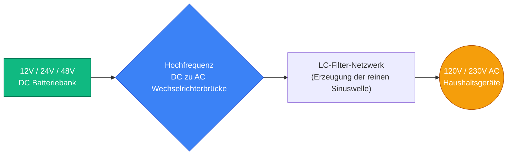
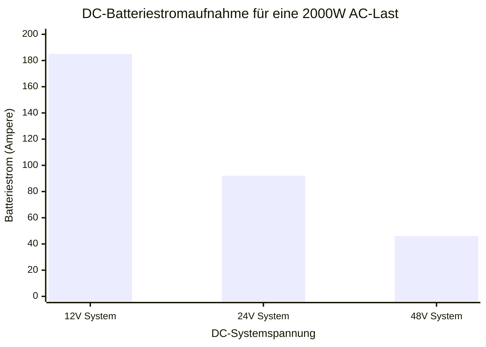
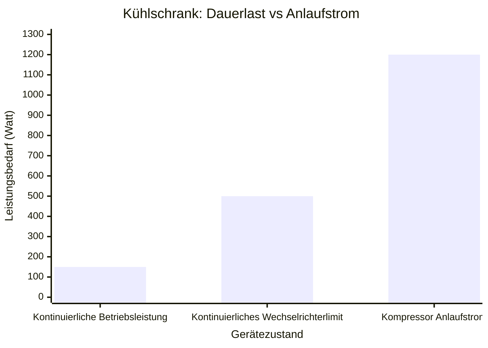
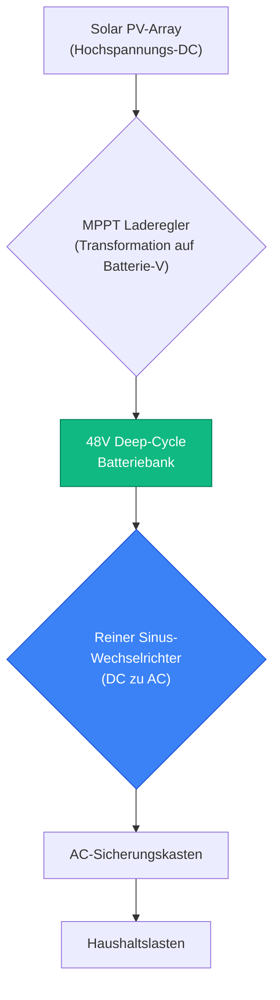

# Der ultimative Wechselrichter-Rechner: Dimensionierung, DC-Spannungswahl und Solar-Hybrid-Systeme

Willkommen beim ultimativen **Wechselrichter-Rechner** und umfassenden Leitfaden für die Leistungselektronik. Egal, ob Sie ein Off-Grid-Hausbesitzer sind, der ein Solar-Hybrid-Batteriesystem entwirft, ein Wohnmobil-Enthusiast, der $12\text{V}$ DC umwandelt, um eine Mikrowelle zu betreiben, oder ein Anlageningenieur, der versucht, ein massives $48\text{V}$-Notstrom-Array zu dimensionieren, das Verständnis der Wechselrichterphysik ist absolut entscheidend.

Ein Wechselrichter ist das technologische Herzstück jedes modernen Batterie- oder Solarkraftsystems. Er übernimmt die komplexe, hochfrequente Aufgabe der Umwandlung von rohem Gleichstrom (DC) aus einer Batteriebank in einen glatten, nutzbaren Wechselstrom (AC), der von Haushaltsgeräten benötigt wird. Wenn Sie Ihren Wechselrichter unterdimensionieren, blockiert und überhitzt Ihr Kühlschrankkompressor beim Anlauf. Wenn Sie die falsche DC-Systemspannung wählen ($12\text{V}$ anstelle von $48\text{V}$), schmelzen Ihre Kupferkabel unter der massiven Strombelastung.

In diesem ausführlichen 4.000+ Wörter SEO-Meisterkurs werden wir die fundamentalen Unterschiede zwischen reiner Sinuswelle und modifizierten Sinuswelle-Technologien dekonstruieren, die verborgenen Gefahren von Geräte-Anlaufströmen aufdecken, mathematisch beweisen, warum $48\text{V}$ DC-Systeme bei großen Lasten gegenüber $12\text{V}$ DC-Systemen weitaus überlegen sind, und die Ingenieurstechnik entschlüsseln, die erforderlich ist, um ein Solar-Hybrid-Array zu dimensionieren. Um absolutes Verständnis zu gewährleisten, haben wir fünf sorgfältig detaillierte, parser-sichere interaktive Mermaid.js-Diagramme beigefügt.

---

## 1. Die Physik der Wechselrichterdimensionierung (Watt vs. VA vs. Leistungsfaktor)

Das absolut kritischste Konzept in der Wechselrichtertechnik ist das Verständnis, warum elektrische Lasten zwei unterschiedliche Leistungsangaben haben: **Watt (W)** und **Volt-Ampere (VA)**, und wie dies mit dem **Leistungsfaktor (PF)** zusammenhängt.

1. **Wirkleistung (Watt):** Dies repräsentiert die tatsächliche Arbeit, die verrichtet wird. Ein $1000\text{W}$ Toaster leistet genau $1000\text{W}$ Heizungsarbeit.
2. **Scheinleistung (VA):** Dies repräsentiert die gesamte elektrische Anforderung, die an die Siliziumbrücke des Wechselrichters gestellt wird. Aufgrund der Physik des Wechselstroms zwingen induktive Lasten (wie AC-Motoren und Kühlschrankkompressoren) den Wechselrichter dazu, "Phantom"-Blindleistung zu schieben und zu ziehen. 

**Die Gleichung für den Leistungsfaktor:**
$$\text{Leistungsfaktor (PF)} = \frac{\text{Wirkleistung (Watt)}}{\text{Scheinleistung (VA)}}$$

Daher:
$$\text{Scheinleistung (VA)} = \frac{\text{Watt}}{\text{Leistungsfaktor}}$$

**Warum ist das wichtig?**
Wechselrichter werden nach ihrer Scheinleistungskapazität (VA oder kVA) bewertet.
- Wenn Sie eine $1500\text{W}$ ohmsche Heizung ($1,0\text{ PF}$) an einen $2000\text{VA}$ Wechselrichter anschließen, verbraucht sie $1500\text{VA}$. Der Wechselrichter bewältigt dies mühelos.
- Wenn Sie eine $1500\text{W}$ alte Wasserpumpe ($0,65\text{ PF}$) an genau denselben $2000\text{VA}$ Wechselrichter anschließen, verlangt sie $2307\text{VA}$ ($1500 / 0,65$). Der Wechselrichter wird überlasten und abschalten, obwohl die "Wattzahl" scheinbar unter dem Limit liegt.

---

## 2. Die Gefahr induktiver Anlaufströme

Wenn Sie Ihre gesamte Gerätelast berechnen, können Sie nicht einfach die Dauerlaufleistung Ihrer Geräte zusammenaddieren. Sie müssen für **Einschaltströme (Inrush Current Surges)** planen.

Elektromotoren, Wasserpumpen, Klimakompressoren und Kühlschrankkompressoren ziehen in der genauen Millisekunde, in der sie eingeschaltet werden, massive Stromspitzen, um die physikalische Trägheit zu überwinden.
- Ein **Kühlschrank**, der bei $150\text{W}$ läuft, kann für eine Sekunde beim Starten des Kompressors einen heftigen Stoß von $1200\text{W}$ ziehen.
- Eine **1,5 PS Klimaanlage**, die bei $1200\text{W}$ läuft, kann einen Anlaufstrom von $4000\text{W}$ ziehen.

Wenn die "Peak Surge Capacity" (Spitzen-Stoßstromkapazität) Ihres Wechselrichters diese kurzzeitige Spitze nicht bewältigen kann, wird der Wechselrichter sofort seine internen Schutzschaltungen auslösen und den Strom zu Ihrem gesamten Haus unterbrechen. Dimensionieren Sie die Stoßstromkapazität Ihres Wechselrichters immer so, dass sie komfortabel über dem Startbedarf des größten einzelnen Motors in Ihrem Haus liegt.

---

## 3. Entmystifizierung von DC-Systemspannungen: 12V vs 24V vs 48V

Der mit Abstand häufigste Fehler, der von DIY-Off-Grid-Enthusiasten gemacht wird, ist der Versuch, eine massive $3000\text{W}$ Last an einer $12\text{V}$ DC-Batteriebank zu betreiben. Dies ist ein katastrophaler Konstruktionsfehler.

Um $3000\text{W}$ AC-Leistung zu erzeugen, muss der Wechselrichter $3000\text{W}$ aus der DC-Batteriebank ziehen. 
Mit dem Ohmschen Gesetz für Leistung ($I = P / V$) berechnen wir die DC-Stromaufnahme bei verschiedenen Systemspannungen, unter Annahme einer Wechselrichtereffizienz von $90\%$:

- **Bei $12\text{V}$ DC:** $3000\text{W} / (12\text{V} \times 0,90) = \mathbf{277\text{ Ampere}}$.
- **Bei $24\text{V}$ DC:** $3000\text{W} / (24\text{V} \times 0,90) = \mathbf{138\text{ Ampere}}$.
- **Bei $48\text{V}$ DC:** $3000\text{W} / (48\text{V} \times 0,90) = \mathbf{69\text{ Ampere}}$.

**Warum sind 277 Ampere bei 12V gefährlich?**
Um $277\text{ Ampere}$ zu transportieren, benötigen Sie Kupferkabel, die dicker als Ihr Daumen sind ($4/0\text{ AWG}$). Wenn Sie Standardkabel verwenden, erzeugt der extreme Strom massive Mengen an $I^2R$-Wärme, schmilzt die Isolierung, verursacht eine Brandgefahr und verschwendet wertvolle Batterieenergie als Wärmeverlust. 
Durch den Wechsel zu einem $48\text{V}$-System sinkt der Strom um $75\%$, was dünnere, billigere und sicherere Verkabelung ermöglicht.

---

## 4. Reine Sinuswelle vs. Modifizierte Sinuswelle

Wechselrichter erzeugen AC-Strom, indem sie DC-Strom schnell hin und her schalten. Die Qualität dieses Schaltens erzeugt die "Wellenform".

1. **Modifizierte Sinuswelle:** Der Wechselrichter erzeugt eine blockartige, gestufte Rechteckwelle. Sie ist günstig in der Herstellung. Sie funktioniert gut für ohmsche Lasten wie Glühbirnen und einfache Heizungen. Wenn Sie jedoch einen Kühlschrank, Ventilator oder ein Computer-Netzteil mit aktiver PFC an einen modifizierten Sinus-Wechselrichter anschließen, summt das Gerät laut, überhitzt und erleidet schließlich dauerhafte Motorschäden.
2. **Reine Sinuswelle:** Der Wechselrichter verwendet fortschrittliche hochfrequente Pulsweitenmodulation (PWM) und LC-Filterung, um eine perfekt glatte, rollende Sinuswelle zu erzeugen, die das städtische Netz perfekt nachahmt. Dies ist für moderne empfindliche Elektronik, medizinische CPAP-Geräte und AC-Induktionsmotoren zwingend erforderlich.

---

## 5. Solar-Hybrid-Wechselrichter & Off-Grid-Arrays

Ein moderner **Hybrid-Solarwechselrichter** ist eigentlich drei unterschiedliche Geräte, die in einem Gehäuse verpackt sind:
1. **MPPT-Solarladeregler:** Optimiert die rohe Gleichspannung der Solarmodule und lädt die Batteriebank auf.
2. **DC zu AC Wechselrichter:** Wandelt Batterie-DC in Haushalts-AC um.
3. **AC zu DC Gleichrichter / Umschalter:** Kann AC-Strom vom Netz (oder einem Generator) aufnehmen, um die Batterien an bewölkten Tagen aufzuladen, und Lasten sofort zwischen Solar-, Batterie- und Netzstrom umschalten.

Bei der Dimensionierung eines Solar-Arrays für einen Hybridwechselrichter verwenden Ingenieure das **DC/AC-Verhältnis**:
$$\text{DC/AC-Verhältnis} = \frac{\text{Gesamte Solar-Panel DC-Watt}}{\text{Wechselrichter AC-Ausgangsnennleistung}}$$
Ein Verhältnis von $1,15$ bis $1,25$ ist optimal. Dieses "Over-Paneling" stellt sicher, dass der Wechselrichter morgens früher und nachmittags länger auf maximaler Kapazität arbeitet und so die tägliche kWh-Erzeugung maximiert.

---

## 6. Fünf konzeptionelle Ingenieursszenarien mit 2D-Visualisierungen

Um die physikalischen Beziehungen, die Wechselrichtersysteme bestimmen, vollständig zu beherrschen, werden wir fünf verschiedene Ingenieursszenarien visuell analysieren, aufgeschlüsselt mit benutzerdefinierten Mermaid.js-Diagrammen.

### Beispiel 1: Die Kern-Wechselrichter-Topographie

**Das Szenario:**
Ein Besitzer einer Off-Grid-Hütte muss den grundlegenden physikalischen Energiefluss von seiner Batteriebank durch die Wechselrichterelektronik bis zu seinen Geräten verstehen.

**2D-Visualisierung:**
Dieses Logikflussdiagramm bildet den High-Level-Umwandlungsprozess ab und zeigt, wie Niederspannungs-DC hochtransformiert und in Hochspannungs-AC umgewandelt wird.

---

### Beispiel 2: Die 12V vs 48V Stromaufnahme-Krise

**Das Szenario:**
Ein Heimwerker möchte $2000\text{W}$ aus einer Batteriebank ziehen und kann sich nicht entscheiden, ob er seine Batterien für $12\text{V}$ oder $48\text{V}$ verkabeln soll.

**Die Mathematik:**
Stromstärke ist umgekehrt proportional zur Spannung. Bei $12\text{V}$ führt die Entnahme von $2000\text{W}$ (bei $90\%$ Effizienz) zu erschreckenden $185\text{ Ampere}$. Bei $48\text{V}$ sind es sehr handhabbare $46\text{ Ampere}$.

**2D-Visualisierung:**
Dieses Diagramm zeigt die brutale Realität der DC-Stromaufnahme über verschiedene Systemspannungen hinweg und beweist, warum $48\text{V}$ für Off-Grid-Setups des ganzen Hauses zwingend erforderlich ist.

---

### Beispiel 3: Die Falle der Kühlschrank-Anlaufströme

**Das Szenario:**
Ein Hausbesitzer kauft einen günstigen $500\text{W}$ Wechselrichter, um seinen $150\text{W}$ Kühlschrank während eines Stromausfalls zu betreiben. Der Wechselrichter löst sofort aus und quietscht einen Überlastalarm.

**Die Mathematik:**
Während die kontinuierliche Betriebsleistung nur $150\text{W}$ beträgt, benötigt der Kompressormotor einen kurzzeitigen Stoß von $1200\text{W}$, um die physikalische Trägheit zu brechen. Der $500\text{W}$ Wechselrichter wurde massiv um $240\%$ überlastet.

**2D-Visualisierung:**
Dieses Diagramm beweist grafisch die Notwendigkeit, einen Wechselrichter anhand seiner Spitzen-Stoßstromkapazität statt anhand seiner Dauerleistungskapazität zu dimensionieren.

---

### Beispiel 4: Off-Grid Hybrid-Solar-Architektur

**Das Szenario:**
Ein Solar-Installateur entwirft ein komplett netzunabhängiges Stromsystem mit Solarmodulen, einem MPPT-Laderegler, einer Batteriebank und einem AC-Wechselrichter.

**2D-Visualisierung:**
Dieses Top-Down-Flussdiagramm bildet den multidirektionalen Energiefluss in einem Hybrid-Solarsystem ab und zeigt, wie die Batteriebank als zentrales Energiereservoir fungiert.

---

### Beispiel 5: Der tägliche Solar- / Batteriezyklus

**Das Szenario:**
Ein Off-Grid-Hausbesitzer muss verstehen, wie Energie im Verlauf eines 24-Stunden-Zyklus erzeugt und verbraucht wird.

**2D-Visualisierung:**
Dieses Gantt-Diagramm visualisiert den täglichen Energiezyklus und zeigt, wie die Solarstromerzeugung Tageslasten abdecken UND gleichzeitig die Batteriebank aufladen muss, um die lange, dunkle Nacht zu überstehen.

```mermaid
gantt
    title 24-Stunden Off-Grid-Energiezyklus
    dateFormat  HH:mm
    axisFormat  %H:%M
    
    section Solar-Erzeugung
    Morgendlicher PV-Anstieg :active, 07:00, 4h
    Spitzen-Solarproduktion (Laden) :crit, 11:00, 4h
    Nachmittäglicher PV-Abstieg :active, 15:00, 4h
    
    section Batterie-Status
    Entladen (Nächtliche Last) :done, 00:00, 8h
    Laden (Überschüssiger Solarstrom) :active, 08:00, 8h
    Entladen (Abendliche Last) :done, 16:00, 8h
```

---

## 7. Fazit und Ingenieurs-Herausforderung

Die Beherrschung der Wechselrichterdimensionierung ist das grundlegende Fundament aller Off-Grid-, Marine- und Notstrom-Ingenieurstechniken. Das Verständnis der umgekehrten Beziehung zwischen DC-Spannung und -Strom, die Beachtung der brutalen Realität induktiver Anlaufströme und die Wahl von reiner Sinuswellentechnologie anstelle von modifizierten Rechteckwellen werden garantieren, dass Ihr Stromsystem jahrzehntelang einwandfrei läuft.

Wenn Sie diese mathematischen Prinzipien ignorieren, werden Ihre DC-Kabel unter $12\text{V}$-Lasten schmelzen, Ihre Kühlschränke blockieren und durchbrennen bei modifizierten Sinuswellen, und Ihr Wechselrichter wird beim Starten der Klimaanlage kontinuierlich auslösen.

Um zu garantieren, dass Sie diese kritischen Konzepte beherrschen, starten Sie unseren interaktiven Simulator und versuchen Sie, diese letzten Herausforderungen zu lösen:
1. **Die Ampere-Falle:** Sie müssen einen $4000\text{W}$ Elektroherd betreiben. Wenn Sie eine $12\text{V}$ Batteriebank verwenden (unter der Annahme von $85\%$ Wechselrichtereffizienz), genau wie viele Ampere Gleichstrom werden durch Ihre Kabel fließen?
2. **Die Anlaufstrom-Berechnung:** Sie möchten eine $1,0\text{ PS}$ Wasserpumpe ($750\text{W}$ Dauerleistung) und einen $200\text{W}$ Fernseher gleichzeitig betreiben. Angenommen, die Pumpe hat einen $3,0\times$ Anlaufstrom, was ist der absolute Mindestwert für den Stoßstrom, den Ihr Wechselrichter haben muss?
3. **Die Solar-Berechnung:** Sie haben einen $5000\text{VA}$ Wechselrichter. Sie möchten ein DC/AC-Verhältnis von $1,20$. Wie viele Watt an Solarmodulen sollten Sie auf Ihrem Dach installieren?

Verlassen Sie sich auf diesen Rechner, um Ihre Off-Grid-Hüttendesigns zu überprüfen, das Upgrade auf eine $48\text{V}$-Architektur mathematisch zu rechtfertigen und Überlastungsausfälle von Wechselrichtern dauerhaft zu eliminieren.
