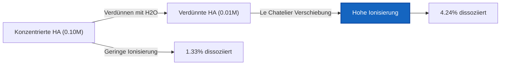

# Labor- & Analytik-Chemie-Leitfaden zu Ka & Gleichgewicht schwacher Säuren

In der analytischen, physikalischen und biologischen Chemie misst die **Säuredissoziationskonstante** ($K_a$) die quantitative Stärke einer schwachen Säure in wässriger Lösung:

$$K_a = \frac{[\text{H}^+][\text{A}^-]}{[\text{HA}]} \quad \iff \quad \text{p}K_a = -\log_{10}(K_a)$$

$$x^2 + K_a x - K_a C = 0 \quad \implies \quad [\text{H}^+] = \frac{-K_a + \sqrt{K_a^2 + 4 K_a C}}{2}$$

$$\text{Prozentuale Ionisierung} = \frac{[\text{H}^+]_{\text{eq}}}{C_{\text{initial}}} \times 100\% \le 5\% \quad (\text{5\% Näherungsregel})$$

---

## 1. Referenzmatrix gängiger Dissoziationskonstanten schwacher Säuren

| Schwache Säure | Formel | $K_a$ ($25^\circ\text{C}$) | $\text{p}K_a$ | Prozentuale Ionisierung ($0.10\,\text{M}$) |
| :--- | :--- | :--- | :--- | :--- |
| **Trichloressigsäure** | $\text{CCl}_3\text{COOH}$ | **$3.0 \cdot 10^{-1}$** | **$0.52$** | $\sim 80\%$ |
| **Ameisensäure** | $\text{HCOOH}$ | **$1.8 \cdot 10^{-4}$** | **$3.75$** | $\sim 4.2\%$ |
| **Benzoesäure** | $\text{C}_6\text{H}_5\text{COOH}$ | **$6.3 \cdot 10^{-5}$** | **$4.20$** | $\sim 2.5\%$ |
| **Essigsäure** | $\text{CH}_3\text{COOH}$ | **$1.8 \cdot 10^{-5}$** | **$4.76$** | $\sim 1.3\%$ |
| **Blausäure** | $\text{HCN}$ | **$6.2 \cdot 10^{-10}$** | **$9.21$** | $\sim 0.008\%$ |

---

## 2. Standard-Protokolle zur $K_a$-Berechnung

```
1. Ka aus pH: x = 10^(-pH), Ka = x^2 / (C - x)
2. Ka aus [H+]: x = [H+], Ka = x^2 / (C - x)
3. Ka aus % Ionisierung: x = (% / 100) * C, Ka = x^2 / (C - x)
4. Ka aus pKa: Ka = 10^(-pKa)
5. Gleichgewichtskonzentrationen aus Ka: Quadratische Gleichung x^2 + Ka*x - Ka*C = 0 lösen
```

---

## 3. Bildungs- & Laborsicherheits-Haftungsausschluss
*Dieser Ka-Rechner bietet theoretische Gleichgewichtsberechnungen für Bildung, Laborforschung und AP-Chemie-Anwendungen. Konzentrierte, nicht ideale Lösungen bei hohen Ionenstärken sollten Aktivitätskoeffizienten unter Verwendung von Debye-Hückel- oder Pitzer-Gleichungen berücksichtigen.*

## 4. Der umfassende Leitfaden zur Säuredissoziation ($K_a$) und ICE-Tabellen

Willkommen zum ultimativen Leitfaden über die Säuredissoziationskonstante ($K_a$). Im Bereich der wässrigen Chemie sind nicht alle Säuren gleich. Während starke Säuren ihre Protonen rücksichtslos aufgeben, sobald sie Wasser berühren, sind schwache Säuren vorsichtig. Sie stellen ein empfindliches thermodynamisches Gleichgewicht her, bei dem nur ein Bruchteil ihrer Moleküle dissoziiert.

Das Verständnis, die Berechnung und die Vorhersage dieses exakten Bruchteils ist der Kern der analytischen Chemie, Pharmakologie und Umweltwissenschaften. Der mathematische Schlüssel zu dieser Vorhersage ist der $K_a$-Wert, der das Gleichgewichtsverhältnis von zerbrochenen Säuremolekülen zu intakten Säuremolekülen strikt vorschreibt.

In diesem ausführlichen, technischen Handbuch mit über 4000 Wörtern werden wir die Thermodynamik der Dissoziation schwacher Säuren vollständig entmystifizieren, den Aufbau von ICE-Tabellen (Initial, Change, Equilibrium) aufschlüsseln, die genauen mathematischen Grenzen der "5%-Regel" festlegen und fünf rigorose, reale chemische Beispiele mit schrittweisen algebraischen Ableitungen und visuellen Mermaid-Diagrammen durchgehen.

### 4.1 Was ist $K_a$ (Die Säuredissoziationskonstante)?

Wenn eine schwache allgemeine Säure ($\text{HA}$) in Wasser gelöst wird, durchläuft sie eine reversible Reaktion:
$$ \text{HA (aq)} \rightleftharpoons \text{H}^+\text{(aq)} + \text{A}^-\text{(aq)} $$

Da diese Reaktion reversibel ist, erreicht sie schließlich einen Zustand des dynamischen Gleichgewichts, bei dem die Vorwärtsrate der Dissoziation genau der Rückwärtsrate der Rekombination entspricht. Die **Säuredissoziationskonstante ($K_a$)** ist das strikte mathematische Verhältnis der Produkte zu den Reaktanten in genau diesem Gleichgewichtszustand:

$$ K_a = \frac{[\text{H}^+][\text{A}^-]}{[\text{HA}]} $$

Dieser einfache Bruch sagt uns alles über die Stärke der Säure:
*   **Großes $K_a$:** Der Zähler (Produkte) ist groß. Die Säure ist relativ stark und dissoziiert stark.
*   **Kleines $K_a$:** Der Nenner (intakte Säure) ist groß. Die Säure ist sehr schwach und zieht es vor, ganz zu bleiben.

### 4.2 Umrechnung zwischen $K_a$ und $\text{p}K_a$

Da $K_a$-Werte typischerweise sehr klein sind, umständliche Zahlen in wissenschaftlicher Schreibweise (z.B. $1.8 \times 10^{-5}$), wandeln Chemiker sie universell in eine logarithmische Skala um, die als $\text{p}K_a$ bekannt ist.

$$ \text{p}K_a = -\log_{10}(K_a) \quad \text{und} \quad K_a = 10^{-\text{p}K_a} $$

**Die goldene Regel der Säurestärke:** Wegen des negativen Logarithmus ist die Beziehung umgekehrt. Ein **niedrigerer** $\text{p}K_a$-Wert bedeutet eine **stärkere** schwache Säure. Zum Beispiel ist Ameisensäure ($\text{p}K_a = 3.75$) stärker als Essigsäure ($\text{p}K_a = 4.76$).

### 4.3 Die Anatomie einer ICE-Tabelle

Eine **ICE-Tabelle** (Initial, Change, Equilibrium) ist das grundlegende Buchhaltungswerkzeug zur Lösung von Problemen der Dissoziation schwacher Säuren.

Nehmen wir an, wir beginnen mit einer Anfangskonzentration ($C$) der schwachen Säure $\text{HA}$ und null Produkten.
Sei $x$ die unbekannte Molarität von $\text{HA}$, die erfolgreich dissoziiert.

| Spezies | $\text{HA}$ | $\text{H}^+$ | $\text{A}^-$ |
| :--- | :--- | :--- | :--- |
| **I**nitial | $C$ | $0$ | $0$ |
| **C**hange | $-x$ | $+x$ | $+x$ |
| **E**quilibrium | $C - x$ | $x$ | $x$ |

Indem wir die untere "Equilibrium"-Zeile in unseren $K_a$-Ausdruck einsetzen, erzeugen wir die Hauptgleichung:
$$ K_a = \frac{x \cdot x}{C - x} = \frac{x^2}{C - x} $$

### 4.4 Die 5%-Regel und die quadratische Gleichung

Um den endgültigen pH-Wert zu finden, müssen wir nach $x$ auflösen (was $[\text{H}^+]$ ist). Das Umstellen der Hauptgleichung liefert eine quadratische Gleichung:
$$ x^2 + K_a x - K_a C = 0 $$

Historisch, vor Computern und Online-Rechnern, wurde Schülern beigebracht, die **Klein-x-Näherung** zu verwenden, um die quadratische Formel zu vermeiden. Wenn die Säure sehr schwach ist (kleines $K_a$), dann ist die Menge, die dissoziiert ($x$), so winzig im Vergleich zu $C$, dass wir so tun können, als ob $(C - x) \approx C$.
Dies vereinfacht die Mathematik wunderbar auf:
$$ x = \sqrt{K_a \cdot C} $$

**Die 5%-Regel:** Diese Näherung ist nur dann mathematisch gültig, wenn das endgültig berechnete $x$ weniger als 5% der Anfangskonzentration $C$ ausmacht. Wenn die Ionisierung 5% überschreitet, verursacht die Näherung inakzeptable analytische Fehler, und die exakte quadratische Formel muss verwendet werden:
$$ x = \frac{-K_a + \sqrt{K_a^2 - 4(1)(-K_a C)}}{2} $$

Unser $K_a$-Rechner verwendet immer den exakten quadratischen Löser, um Präzision zu garantieren, unabhängig davon, ob die 5%-Regel bestanden wird oder nicht.

---

## 5. Bedienungsanleitung: Den Ka-Rechner beherrschen

Unser Tool arbeitet bidirektional: Sie können entweder ein $K_a$ eingeben, um den resultierenden pH-Wert zu ermitteln, oder experimentelle pH-Daten eingeben, um das $K_a$ einer unbekannten Säure zu bestimmen.

### 5.1 Modus: pH-Wert aus einem bekannten $K_a$ berechnen

1.  **Modus auswählen:** Wählen Sie "Gleichgewichtskonzentrationen aus Ka".
2.  **Parameter eingeben:** Geben Sie die Anfangskonzentration ($C$) und das bekannte $K_a$ (oder $\text{p}K_a$) Ihrer Säure ein.
3.  **Ausgabe lesen:** Der Rechner generiert die komplette ICE-Tabelle, führt den exakten quadratischen Löser aus und gibt den endgültigen pH-Wert, das exakte $[\text{H}^+]$ und die prozentuale Ionisierung aus.

### 5.2 Modus: Ein unbekanntes $K_a$ aus pH-Daten entdecken

1.  **Modus auswählen:** Wählen Sie "Ka aus pH".
2.  **Parameter eingeben:** Geben Sie die Anfangskonzentration ($C$) der Säure, die Sie im Labor vorbereitet haben, und den endgültigen pH-Wert ein, den Sie mit Ihrem pH-Meter gemessen haben.
3.  **Ausführen:** Das Tool berechnet $x$ invers ($[\text{H}^+] = 10^{-\text{pH}}$) und setzt es direkt in die Formel $K_a = x^2 / (C - x)$ ein, um die Identität der Säure zu enthüllen.

### 5.3 Modus: Prozentuale Ionisierung

1.  **Modus auswählen:** Wählen Sie "Ka aus prozentualer Ionisierung".
2.  **Parameter eingeben:** Geben Sie die Anfangskonzentration ($C$) und den Prozentsatz der Säure ein, der ionisiert ist.
3.  **Ausführen:** Das Tool berechnet $x$, indem es diesen Prozentsatz von $C$ nimmt, und löst dann nach $K_a$ auf.

---

## 6. Fünf reale Konzeptbeispiele

Wenden wir diese mathematischen Rahmenwerke auf reale analytische Chemieszenarien an, komplett mit schrittweisen algebraischen Aufschlüsselungen.

### Beispiel 1: Ka aus Labor-pH-Daten finden

**Szenario:** 
Eine Forscherin synthetisiert eine neue schwache einprotonige Säure. Sie stellt im Labor eine Lösung mit $0.250\text{ M}$ her und misst den pH-Wert mit einer kalibrierten Sonde. Der pH-Wert beträgt 3.45. Wie groß sind $K_a$ und $\text{p}K_a$ dieser neuen Säure?

**Mathematische Ableitung:**

1.  **Berechne $x$ ($[\text{H}^+]$) aus pH:**
    $$ [\text{H}^+] = 10^{-\text{pH}} $$
    $$ x = 10^{-3.45} = 3.55 \times 10^{-4}\text{ M} $$
2.  **ICE-Variablen festlegen:**
    $[\text{H}^+] = x = 3.55 \times 10^{-4}\text{ M}$
    $[\text{A}^-] = x = 3.55 \times 10^{-4}\text{ M}$
    $[\text{HA}] = C - x = 0.250 - (3.55 \times 10^{-4}) = 0.2496\text{ M}$
3.  **Berechne $K_a$:**
    $$ K_a = \frac{x^2}{C - x} $$
    $$ K_a = \frac{(3.55 \times 10^{-4})^2}{0.2496} $$
    $$ K_a = \frac{1.26 \times 10^{-7}}{0.2496} = 5.05 \times 10^{-7} $$
4.  **Berechne $\text{p}K_a$:**
    $$ \text{p}K_a = -\log_{10}(5.05 \times 10^{-7}) = 6.30 $$

**Fazit:** Die neu synthetisierte Säure hat ein $K_a$ von $5.05 \times 10^{-7}$ und einen $\text{p}K_a$ von 6.30.

### Beispiel 2: Der exakte quadratische pH-Wert von Essigsäure

**Szenario:**
Berechnen Sie den exakten pH-Wert einer $0.100\text{ M}$ Lösung von Essigsäure ($\text{CH}_3\text{COOH}$). Das $K_a$ beträgt $1.80 \times 10^{-5}$.

**Mathematische Ableitung:**

1.  **Quadratische Gleichung aufstellen:**
    $$ x^2 + K_a x - K_a C = 0 $$
    $$ x^2 + (1.80 \times 10^{-5})x - (1.80 \times 10^{-5})(0.100) = 0 $$
    $$ x^2 + 1.80 \times 10^{-5}x - 1.80 \times 10^{-6} = 0 $$
2.  **Lösen über quadratische Formel:**
    $$ x = \frac{-1.80 \times 10^{-5} + \sqrt{(1.80 \times 10^{-5})^2 - 4(1)(-1.80 \times 10^{-6})}}{2} $$
    $$ x = \frac{-1.80 \times 10^{-5} + \sqrt{3.24 \times 10^{-10} + 7.20 \times 10^{-6}}}{2} $$
    $$ x = 1.33 \times 10^{-3}\text{ M } [\text{H}^+] $$
3.  **pH berechnen:**
    $$ \text{pH} = -\log_{10}(1.33 \times 10^{-3}) = 2.88 $$

**Fazit:** Der pH-Wert der $0.100\text{ M}$ Essigsäurelösung beträgt 2.88.

### Beispiel 3: Prozentuale Ionisierung und Verdünnung

**Szenario:**
Nehmen wir die $0.100\text{ M}$ Essigsäure aus Beispiel 2 ($[\text{H}^+] = 1.33 \times 10^{-3}\text{ M}$). Berechnen wir ihre prozentuale Ionisierung. Dann, nach dem Ostwaldschen Verdünnungsgesetz, sollte die prozentuale Ionisierung *steigen*, wenn wir die Säure verdünnen. Lassen Sie uns das beweisen.

**Mathematische Ableitung:**

1.  **Berechne anfängliche % Ionisierung (bei $0.100\text{ M}$):**
    $$ \% \text{ Ionisiert} = \left(\frac{1.33 \times 10^{-3}}{0.100}\right) \times 100 = 1.33\% $$
2.  **Verdünnung um 10x (Neues $C = 0.010\text{ M}$):**
    Unter Verwendung der Klein-x-Näherung für die Geschwindigkeit: $x \approx \sqrt{K_a \cdot C} = \sqrt{(1.8 \times 10^{-5})(0.010)} = 4.24 \times 10^{-4}\text{ M}$
3.  **Berechne neue % Ionisierung (bei $0.010\text{ M}$):**
    $$ \% \text{ Ionisiert} = \left(\frac{4.24 \times 10^{-4}}{0.010}\right) \times 100 = 4.24\% $$

**Fazit:** Durch die 10-fache Verdünnung der Säure hat sich die prozentuale Ionisierung mehr als verdreifacht (von 1.33% auf 4.24%). Dies beweist physikalisch das Prinzip von Le Chatelier: Die Verdünnung der Lösung fügt Wasser hinzu, wodurch sich das Gleichgewicht zur Seite mit mehr wässrigen Teilchen (die dissoziierten Produkte) verschiebt, um den Konzentrationsverlust auszugleichen.

**Visualisierung: Ostwaldsches Verdünnungsgesetz**



*Dieses Flussdiagramm veranschaulicht das Ostwaldsche Verdünnungsgesetz: Wenn die Konzentration sinkt, wird das thermodynamische Gleichgewicht gezwungen, sich nach rechts zu verschieben, wodurch der Prozentsatz der Moleküle, die dissoziieren, aggressiv erhöht wird.*

### Beispiel 4: Wenn die 5%-Regel katastrophal versagt

**Szenario:**
Berechnen Sie das $[\text{H}^+]$ einer stark verdünnten $0.0050\text{ M}$ Lösung von Chloressigsäure, einer relativ starken schwachen Säure mit einem $K_a$ von $1.4 \times 10^{-3}$. Vergleichen Sie die Klein-x-Näherung mit der exakten quadratischen Gleichung.

**Mathematische Ableitung (Klein-x-Näherung):**

1.  **Nimm an $C - x \approx C$:**
    $$ x = \sqrt{K_a \cdot C} $$
    $$ x = \sqrt{(1.4 \times 10^{-3})(0.0050)} $$
    $$ x = \sqrt{7.0 \times 10^{-6}} = 2.65 \times 10^{-3}\text{ M H}^+ $$
2.  **Überprüfe die 5%-Regel:**
    $$ \% \text{ Ionisiert} = \left(\frac{2.65 \times 10^{-3}}{0.0050}\right) \times 100 = 53\% $$
    Die Regel wird massiv gebrochen (53% $\gg$ 5%). Die Näherung ist völlig ungültig.

**Mathematische Ableitung (Exakte quadratische Gleichung):**

1.  **Verwende die vollständige quadratische Gleichung:**
    $$ x^2 + (1.4 \times 10^{-3})x - 7.0 \times 10^{-6} = 0 $$
2.  **Lösen über quadratische Formel:**
    $$ x = 2.05 \times 10^{-3}\text{ M H}^+ $$

**Fazit:** Die Näherung schätzte $2.65 \times 10^{-3}\text{ M}$, während die wahre exakte Antwort $2.05 \times 10^{-3}\text{ M}$ lautet. Die Näherung verursachte einen massiven **Fehler von 29%** in der Wasserstoffionenkonzentration.

### Beispiel 5: Näherungen mehrprotoniger Säuren ($K_{a1}$ vs $K_{a2}$)

**Szenario:**
Phosphorsäure ($\text{H}_3\text{PO}_4$) ist eine dreiprotonige Säure, was bedeutet, dass sie 3 Protonen in Stufen abgibt.
$K_{a1} = 7.5 \times 10^{-3}$
$K_{a2} = 6.2 \times 10^{-8}$
Müssen wir bei der Berechnung des pH-Werts einer $0.10\text{ M}$ Phosphorsäurelösung alle drei Schritte berechnen?

**Mathematische Ableitung:**

1.  **Vergleiche $K_{a1}$ und $K_{a2}$:**
    Die erste Dissoziationskonstante ($7.5 \times 10^{-3}$) ist ungefähr **100.000 Mal größer** als die zweite ($6.2 \times 10^{-8}$).
2.  **Die Polyprotische Regel:**
    Da sich das erste Proton so viel leichter löst als das zweite, stammen praktisch 100% der $\text{H}^+$-Ionen im Becherglas aus dem ersten Dissoziationsschritt. Der Beitrag aus dem zweiten Schritt ist mathematisch unsichtbar.
3.  **Berechnung:**
    Man behandelt Phosphorsäure einfach als eine einprotonige Säure unter Verwendung von nur $K_{a1}$.
    $$ x^2 + (7.5 \times 10^{-3})x - 7.5 \times 10^{-4} = 0 $$
    $$ x = 0.0239\text{ M H}^+ \implies \text{pH} = 1.62 $$

**Visualisierung: Polyprotische Dissoziationsschritte**

```mermaid
gantt
    title Thermodynamische Dominanz von Ka1 bei mehrprotonigen Säuren
    dateFormat  HH:mm:ss
    axisFormat  %H:%M
    section Schritt 1 (Ka1)
    H3PO4 => H+ + H2PO4- :crit, 00:00:00, 00:15:00
    section Schritt 2 (Ka2)
    H2PO4- => H+ + HPO4(2-) :active, 00:15:00, 00:16:00
    section Schritt 3 (Ka3)
    HPO4(2-) => H+ + PO4(3-) :00:16:00, 00:16:10
```



*Dieses Gantt-Diagramm veranschaulicht, wie $K_{a1}$ den Dissoziationsprozess vollständig dominiert, die überwiegende Mehrheit der Protonen erzeugt und nachfolgende Schritte vernachlässigbar macht.*

---

## 7. Deep Dive FAQ und Erweiterte Fehlerbehebung

**F: Kann eine schwache Säure ein $K_a$ größer als 1 haben?**
**A:** Technisch gesehen ja, obwohl wir sie an diesem Punkt selten als "schwach" bezeichnen. Säuren mit einem $K_a > 1$ (was bedeutet, dass Produkte gegenüber Reaktanten bevorzugt werden) werden im Allgemeinen als starke Säuren eingestuft. Zum Beispiel wird das $K_a$ von Salzsäure ($\text{HCl}$) auf etwa $1.3 \times 10^6$ geschätzt. Das Gleichgewicht liegt so weit rechts, dass das intakte $[\text{HA}]$ praktisch null ist.

**F: Warum existiert die 5%-Regel überhaupt, wenn sie Fehler verursachen kann?**
**A:** Vor Computern war das Lösen quadratischer Gleichungen mit dezimaler wissenschaftlicher Notation von Hand unglaublich mühsam und fehleranfällig. Die 5%-Regel war ein pragmatischer Kompromiss, um Schülern und Labortechnikern Zeit zu sparen. Heute lösen unsere Rechner sofort die exakte quadratische Gleichung, was die Näherung überflüssig macht.

**F: Ändert sich $K_a$, wenn ich mehr Säure hinzufüge?**
**A:** Nein. $K_a$ ist eine strikte thermodynamische Konstante. Sie ändert sich nicht mit der Konzentration oder dem Volumen. Das Einzige, was den physikalischen Wert von $K_a$ ändern kann, ist eine Änderung der **Temperatur** der Lösung.

Indem Sie die thermodynamischen Mechanismen hinter ICE-Tabellen, $K_a$-Werten und exakten quadratischen Ableitungen tief verstehen, besitzen Sie die theoretische Macht, den pH-Wert und die Speziation jedes existierenden schwachen Elektrolyten vorherzusagen. Verlassen Sie sich immer auf diesen $K_a$-Rechner, um die gefährlichen "Klein-x"-Näherungen zu umgehen und analytische Perfektion zu garantieren!
