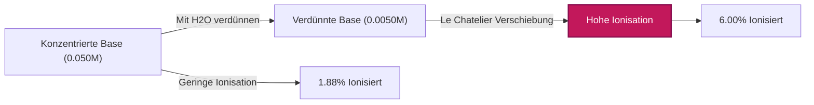

# Labor- & analytischer Chemieleitfaden für Kb & das Gleichgewicht schwacher Basen

In der analytischen, physikalischen und pharmazeutischen Chemie misst die **Basenkonstante** ($K_b$) die quantitative Stärke einer schwachen Base in wässriger Lösung:

$$K_b = \frac{[\text{BH}^+][\text{OH}^-]}{[\text{B}]} \quad \iff \quad \text{p}K_b = -\log_{10}(K_b)$$

$$K_a \times K_b = K_w \quad \iff \quad \text{p}K_a + \text{p}K_b = \text{p}K_w \quad (14.00 \text{ bei } 25^\circ\text{C})$$

$$x^2 + K_b x - K_b C = 0 \quad \implies \quad [\text{OH}^-] = \frac{-K_b + \sqrt{K_b^2 + 4 K_b C}}{2}$$

$$\text{Prozentuale Ionisation} = \frac{[\text{OH}^-]_{\text{eq}}}{C_{\text{initial}}} \times 100\% \le 5\% \quad (\text{5\%-Näherungsregel})$$

---

## 1. Referenzmatrix der häufigsten schwachen Basenkonstanten

| Schwache Base | Formel | $K_b$ ($25^\circ\text{C}$) | $\text{p}K_b$ | Konjugierte Säure $\text{p}K_a$ | Prozentuale Ionisation ($0.10\,\text{M}$) |
| :--- | :--- | :--- | :--- | :--- | :--- |
| **Ethylamin** | $\text{C}_2\text{H}_5\text{NH}_2$ | **$5.6 \cdot 10^{-4}$** | **$3.25$** | **$10.75$** | $\sim 7.2\%$ |
| **Methylamin** | $\text{CH}_3\text{NH}_2$ | **$4.4 \cdot 10^{-4}$** | **$3.36$** | **$10.64$** | $\sim 6.4\%$ |
| **Ammoniak** | $\text{NH}_3$ | **$1.8 \cdot 10^{-5}$** | **$4.75$** | **$9.25$** | $\sim 1.3\%$ |
| **Pyridin** | $\text{C}_5\text{H}_5\text{N}$ | **$1.7 \cdot 10^{-9}$** | **$8.77$** | **$5.23$** | $\sim 0.013\%$ |
| **Anilin** | $\text{C}_6\text{H}_5\text{NH}_2$ | **$4.3 \cdot 10^{-10}$** | **$9.37$** | **$4.63$** | $\sim 0.0065\%$ |

---

## 2. Standardprotokolle zur $K_b$-Berechnung

```
1. Kb aus pOH: x = 10^(-pOH), Kb = x^2 / (C - x)
2. Kb aus pH: pOH = pKw - pH, x = 10^(-pOH), Kb = x^2 / (C - x)
3. Kb aus [OH-]: x = [OH-], Kb = x^2 / (C - x)
4. Kb aus konjugierter Ka: Kb = Kw / Ka & pKb = pKw - pKa
5. Gleichgewichtskonzentrationen aus Kb: Quadratische Gleichung x^2 + Kb*x - Kb*C = 0 lösen
```

---

## 3. Haftungsausschluss für Bildung & Laborsicherheit
*Dieser Kb Rechner bietet theoretische Gleichgewichtsberechnungen für Bildungs-, Laborforschungs- und AP-Chemie-Anwendungen. Konzentrierte nicht-ideale Lösungen bei hohen Ionenstärken sollten Aktivitätskoeffizienten unter Verwendung von Debye-Hückel- oder Pitzer-Gleichungen berücksichtigen.*

## 4. Der umfassende Leitfaden zur Basendissoziation ($K_b$) und zu ICE-Tabellen

Willkommen zum ultimativen Leitfaden über die Basenkonstante ($K_b$). Wenn man etwas über Säure-Base-Gleichgewichte lernt, liegt der Fokus oft zu Unrecht auf Säuren. Das Verständnis schwacher Basen – wie Ammoniak, pharmazeutischer Amine und biologischer Alkaloide – ist jedoch für die Medizin, das Arzneimitteldesign und physiologische Puffersysteme wohl noch entscheidender.

Wenn eine schwache Base zu Wasser hinzugefügt wird, zerfällt sie nicht einfach. Stattdessen greift sie aktiv Wassermoleküle an, stiehlt ein Proton, um eine konjugierte Säure zu bilden, und hinterlässt ein Hydroxidion ($\text{OH}^-$). Da die Base "schwach" ist, fehlt ihr die thermodynamische Stärke, um *jedem* Wassermolekül Protonen zu stehlen, was zu einem empfindlichen Zustand des chemischen Gleichgewichts führt.

In diesem massiven technischen Handbuch mit über 4000 Wörtern werden wir die Thermodynamik des Gleichgewichts schwacher Basen vollständig entschlüsseln, die exakte inverse mathematische Beziehung zwischen konjugierten $K_a$- und $K_b$-Paaren untersuchen, die strengen Grenzen der "5%-Regel" festlegen und fünf rigorose, reale Beispiele aus der analytischen Chemie mit schrittweisen algebraischen Ableitungen und visuellen Mermaid-Diagrammen durchgehen.

### 4.1 Was ist $K_b$ (Die Basenkonstante)?

Wenn eine schwache generische Base ($\text{B}$) in Wasser gelöst wird, reagiert sie gemäß der folgenden reversiblen Gleichung:
$$ \text{B (aq)} + \text{H}_2\text{O (l)} \rightleftharpoons \text{BH}^+\text{(aq)} + \text{OH}^-\text{(aq)} $$

Sobald diese Reaktion das dynamische Gleichgewicht erreicht (wo die Rate der Vorwärts-Protonenentnahme der Rate der Rückwärts-Protonenrückgabe entspricht), definieren wir ihre thermodynamische Position über die **Basenkonstante ($K_b$)**:

$$ K_b = \frac{[\text{BH}^+][\text{OH}^-]}{[\text{B}]} $$

*(Hinweis: Wasser ist ein reines flüssiges Lösungsmittel und seine Konzentration ist praktisch konstant, daher wird es streng aus dem Gleichgewichtsausdruck ausgeschlossen.)*

Der $K_b$-Wert sagt uns sofort, wie stark die Base ist:
*   **Großes $K_b$:** Der Zähler ist groß. Die Base ist relativ stark und produziert erfolgreich viel $\text{OH}^-$.
*   **Kleines $K_b$:** Der Nenner ist groß. Die Base ist sehr schwach und der größte Teil davon bleibt in ihrer neutralen Form $\text{B}$.

### 4.2 Umrechnung zwischen $K_b$ und $\text{p}K_b$

Genau wie bei $K_a$ sind Basenkonstanten oft extrem kleine Zahlen (z. B. $1.8 \times 10^{-5}$ für Ammoniak). Um die Mathematik handhabbar zu machen, verwenden Chemiker die logarithmische $\text{p}K_b$-Skala.

$$ \text{p}K_b = -\log_{10}(K_b) \quad \text{und} \quad K_b = 10^{-\text{p}K_b} $$

**Die goldene Regel der Basenstärke:** Aufgrund des negativen Logarithmus entspricht ein **niedrigerer** $\text{p}K_b$ einer **stärkeren** schwachen Base. Zum Beispiel ist Methylamin ($\text{p}K_b = 3.36$) stärker als Ammoniak ($\text{p}K_b = 4.75$).

### 4.3 Die $K_a \times K_b = K_w$ Beziehung (Konjugierte Paare)

Dies ist wohl die wichtigste thermodynamische Regel in der gesamten Säure-Base-Chemie: **Die Stärke einer schwachen Base ist umgekehrt proportional zur Stärke ihrer konjugierten Säure.** 

Wenn Sie das $K_a$ einer Säure kennen, kennen Sie sofort das $K_b$ ihrer konjugierten Base durch die Autoprotolysekonstante des Wassers ($K_w$):
$$ K_a \times K_b = K_w = 1.0 \times 10^{-14} \quad (\text{bei } 25^\circ\text{C}) $$
$$ \text{p}K_a + \text{p}K_b = \text{p}K_w = 14.00 $$

Wenn Sie eine mäßig starke schwache Säure haben, ist ihre konjugierte Base unglaublich schwach. Umgekehrt wird eine unglaublich schwache Säure eine relativ starke konjugierte Base haben.

### 4.4 Der Aufbau einer ICE-Tabelle für schwache Basen

Eine **ICE-Tabelle** (Initial, Change, Equilibrium – Anfang, Änderung, Gleichgewicht) ist die Standardmethode zur Lösung von Problemen mit schwachen Basendissoziationen. 

Beginnen wir mit einer Anfangskonzentration ($C$) der schwachen Base $\text{B}$ und nehmen an, dass die anfänglichen Produktkonzentrationen null sind. Sei $x$ die unbekannte Molarität von $\text{B}$, die erfolgreich mit Wasser reagiert.

| Spezies | $\text{B}$ | $\text{BH}^+$ | $\text{OH}^-$ |
| :--- | :--- | :--- | :--- |
| **I**nitial (Anfang) | $C$ | $0$ | $0$ |
| **C**hange (Änderung) | $-x$ | $+x$ | $+x$ |
| **E**quilibrium (Gleichgewicht) | $C - x$ | $x$ | $x$ |

Setzt man die "Equilibrium"-Zeile in unseren $K_b$-Ausdruck ein, ergibt sich die Hauptgleichung:
$$ K_b = \frac{x \cdot x}{C - x} = \frac{x^2}{C - x} $$

### 4.5 Die 5%-Regel und die quadratische Gleichung

Um den endgültigen $\text{pOH}$ (und damit den pH-Wert) zu finden, müssen wir nach $x$ (was $[\text{OH}^-]$ ist) auflösen. Dies wird zu einer quadratischen Gleichung umgeformt:
$$ x^2 + K_b x - K_b C = 0 $$

Um Zeit zu sparen, verwenden Chemiker oft die **Small-x-Näherung**. Wenn $K_b$ sehr klein ist, nehmen wir an, dass die Menge, die dissoziiert ($x$), im Vergleich zu $C$ unbedeutend ist, was bedeutet, dass $(C - x) \approx C$. Die Gleichung vereinfacht sich zu:
$$ x = \sqrt{K_b \cdot C} $$

**Die 5%-Regel:** Diese Näherung ist mathematisch nur zulässig, wenn das berechnete $x$ weniger als 5% der Anfangskonzentration $C$ beträgt. Wenn die Ionisation mehr als 5% beträgt, MUSS die exakte quadratische Formel verwendet werden, um unakzeptable Fehler zu vermeiden:
$$ x = \frac{-K_b + \sqrt{K_b^2 - 4(1)(-K_b C)}}{2} $$

Unser $K_b$ Rechner verwendet niemals die Small-x-Näherung. Er führt den exakten quadratischen Löser zu 100% aus, um absolute Präzision zu garantieren.

---

## 5. Bedienungsanleitung: Den Kb Rechner meistern

Unser Werkzeug arbeitet bidirektional: Sie können entweder ein $K_b$ eingeben, um den resultierenden pH-Wert vorherzusagen, oder experimentelle pH/pOH-Daten eingeben, um das $K_b$ einer unbekannten Base zurückzurechnen.

### 5.1 Modus: Berechnung des pH-Werts aus einem bekannten $K_b$

1.  **Modus auswählen:** Wählen Sie "Gleichgewichtskonzentrationen aus Kb".
2.  **Parameter eingeben:** Geben Sie die Anfangskonzentration ($C$) und das bekannte $K_b$ (oder $\text{p}K_b$) Ihrer schwachen Base ein.
3.  **Ausgabe lesen:** Der Rechner generiert die komplette ICE-Tabelle, führt den exakten quadratischen Löser für $[\text{OH}^-]$ aus und gibt den endgültigen $\text{pOH}$, den Gleichgewichts-pH, das exakte $[\text{OH}^-]$ und die prozentuale Ionisation aus.

### 5.2 Modus: Entdeckung eines unbekannten $K_b$ aus pH-Daten

1.  **Modus auswählen:** Wählen Sie "Kb aus pH".
2.  **Parameter eingeben:** Geben Sie die Anfangskonzentration ($C$) der Base und den gemessenen End-pH-Wert ein.
3.  **Ausführen:** Das Tool wandelt zunächst Ihren pH-Wert in pOH um ($\text{pOH} = 14 - \text{pH}$). Es berechnet $x$ invers ($[\text{OH}^-] = 10^{-\text{pOH}}$) und setzt es direkt in die Formel $K_b = x^2 / (C - x)$ ein, um die Identität der Base preiszugeben.

### 5.3 Modus: Prozentuale Ionisation

1.  **Modus auswählen:** Wählen Sie "Kb aus prozentualer Ionisation".
2.  **Parameter eingeben:** Geben Sie die Anfangskonzentration ($C$) und den Prozentsatz der ionisierten Base ein.
3.  **Ausführen:** Das Tool berechnet $x$, indem es diesen Prozentsatz von $C$ nimmt, und löst dann nach $K_b$ auf.

---

## 6. Fünf praxisnahe Konzeptbeispiele

Wenden wir diese mathematischen Rahmenbedingungen auf reale Laborszenarien an, komplett mit schrittweisen algebraischen Aufschlüsselungen.

### Beispiel 1: Bestimmung von Kb aus Labor-pH-Daten

**Szenario:** 
Ein Pharmakologe stellt eine $0.150\text{ M}$ Lösung eines unbekannten biologischen Amins (einer schwachen Base) her und misst den pH-Wert mit einer kalibrierten Sonde. Der pH-Wert zeigt 11,20 an. Wie lauten das $K_b$ und $\text{p}K_b$ dieses Amins?

**Mathematische Ableitung:**

1.  **Berechnen Sie pOH aus pH:**
    $$ \text{pOH} = 14.00 - \text{pH} = 14.00 - 11.20 = 2.80 $$
2.  **Berechnen Sie $x$ ($[\text{OH}^-]$) aus pOH:**
    $$ [\text{OH}^-] = 10^{-\text{pOH}} $$
    $$ x = 10^{-2.80} = 1.58 \times 10^{-3}\text{ M} $$
3.  **Legen Sie die ICE-Variablen fest:**
    $[\text{OH}^-] = x = 1.58 \times 10^{-3}\text{ M}$
    $[\text{BH}^+] = x = 1.58 \times 10^{-3}\text{ M}$
    $[\text{B}] = C - x = 0.150 - (1.58 \times 10^{-3}) = 0.1484\text{ M}$
4.  **Berechnen Sie $K_b$:**
    $$ K_b = \frac{x^2}{C - x} $$
    $$ K_b = \frac{(1.58 \times 10^{-3})^2}{0.1484} $$
    $$ K_b = \frac{2.51 \times 10^{-6}}{0.1484} = 1.69 \times 10^{-5} $$
5.  **Berechnen Sie $\text{p}K_b$:**
    $$ \text{p}K_b = -\log_{10}(1.69 \times 10^{-5}) = 4.77 $$

**Fazit:** Das unbekannte Amin hat ein $K_b$ von $1.69 \times 10^{-5}$, was bedeutet, dass es sich wahrscheinlich um Ammoniak ($\text{NH}_3$) handelt.

### Beispiel 2: Der exakte quadratische pH-Wert von Ammoniak

**Szenario:**
Berechnen Sie den exakten pH-Wert einer $0.050\text{ M}$ Lösung von Ammoniak ($\text{NH}_3$). Das $K_b$ beträgt $1.80 \times 10^{-5}$.

**Mathematische Ableitung:**

1.  **Stellen Sie die quadratische Gleichung auf:**
    $$ x^2 + K_b x - K_b C = 0 $$
    $$ x^2 + (1.80 \times 10^{-5})x - (1.80 \times 10^{-5})(0.050) = 0 $$
    $$ x^2 + 1.80 \times 10^{-5}x - 9.00 \times 10^{-7} = 0 $$
2.  **Lösen Sie über die quadratische Formel:**
    $$ x = \frac{-1.80 \times 10^{-5} + \sqrt{(1.80 \times 10^{-5})^2 - 4(1)(-9.00 \times 10^{-7})}}{2} $$
    $$ x = 9.39 \times 10^{-4}\text{ M } [\text{OH}^-] $$
3.  **Berechnen Sie pOH und pH:**
    $$ \text{pOH} = -\log_{10}(9.39 \times 10^{-4}) = 3.03 $$
    $$ \text{pH} = 14.00 - 3.03 = 10.97 $$

**Fazit:** Der pH-Wert der $0.050\text{ M}$ Ammoniaklösung beträgt exakt 10,97.

### Beispiel 3: Prozentuale Ionisation und Verdünnung von Basen

**Szenario:**
Verwenden wir das $0.050\text{ M}$ Ammoniak aus Beispiel 2 ($[\text{OH}^-] = 9.39 \times 10^{-4}\text{ M}$). Berechnen wir dessen prozentuale Ionisation. Gemäß dem Ostwaldschen Verdünnungsgesetz sollte die prozentuale Ionisation *ansteigen*, wenn wir die Base durch Hinzufügen von reinem Wasser verdünnen.

**Mathematische Ableitung:**

1.  **Berechnen Sie die anfängliche % Ionisation (bei $0.050\text{ M}$):**
    $$ \% \text{ Ionisiert} = \left(\frac{9.39 \times 10^{-4}}{0.050}\right) \times 100 = 1.88\% $$
2.  **Verdünnen Sie um das 10-fache (Neues $C = 0.0050\text{ M}$):**
    Verwendung der Small-x-Näherung für Geschwindigkeit: $x \approx \sqrt{K_b \cdot C} = \sqrt{(1.8 \times 10^{-5})(0.0050)} = 3.00 \times 10^{-4}\text{ M}$
3.  **Berechnen Sie die neue % Ionisation (bei $0.0050\text{ M}$):**
    $$ \% \text{ Ionisiert} = \left(\frac{3.00 \times 10^{-4}}{0.0050}\right) \times 100 = 6.00\% $$

**Fazit:** Durch 10-fache Verdünnung der Base stieg die prozentuale Ionisation sprunghaft von 1,88% auf über 6,00% an. Genau wie bei Säuren zwingt die Verdünnung einer schwachen Base das Gleichgewicht, sich nach rechts zu verschieben, um mehr dissoziierte Teilchen zu produzieren.

**Visualisierung: Ostwaldsches Verdünnungsgesetz für Basen**



*Dieses Flussdiagramm veranschaulicht das Ostwaldsche Verdünnungsgesetz für Basen: Wenn die Konzentration sinkt, verschiebt sich das thermodynamische Gleichgewicht nach rechts, was den Prozentsatz der Moleküle, die mit Wasser reagieren, stark erhöht.*

### Beispiel 4: Die konjugierte $K_a \times K_b$ Wippe

**Szenario:**
Sie müssen das $K_b$ der Base Pyridin ($\text{C}_5\text{H}_5\text{N}$) herausfinden. Sie schauen in einem Lehrbuch nach, aber die Tabelle listet nur das $K_a$ ihrer konjugierten Säure auf, dem Pyridiniumion ($\text{C}_5\text{H}_5\text{NH}^+$), welches $K_a = 5.9 \times 10^{-6}$ beträgt.

**Mathematische Ableitung:**

1.  **Verwenden Sie die Formel für die konjugierte Autoprotolyse:**
    $$ K_a \times K_b = K_w $$
2.  **Lösen Sie nach $K_b$ auf:**
    $$ K_b = \frac{K_w}{K_a} $$
    $$ K_b = \frac{1.0 \times 10^{-14}}{5.9 \times 10^{-6}} = 1.7 \times 10^{-9} $$
3.  **Lösen Sie nach $\text{p}K_b$ auf:**
    $$ \text{p}K_b = -\log_{10}(1.7 \times 10^{-9}) = 8.77 $$

**Fazit:** Das $K_b$ von Pyridin beträgt $1.7 \times 10^{-9}$. Da das Pyridiniumion eine mäßig schwache Säure ist, ist sein konjugiertes Pyridin eine unglaublich schwache Base.

### Beispiel 5: Wenn die 5%-Regel bei Basen katastrophal fehlschlägt

**Szenario:**
Berechnen Sie die $[\text{OH}^-]$ einer stark verdünnten $0.0010\text{ M}$ Lösung von Ethylamin, einer relativ starken schwachen Base mit einem $K_b$ von $5.6 \times 10^{-4}$. Vergleichen Sie die Small-x-Näherung mit der exakten quadratischen Gleichung.

**Mathematische Ableitung (Small-x-Näherung):**

1.  **Nehmen Sie an, dass $C - x \approx C$:**
    $$ x = \sqrt{K_b \cdot C} $$
    $$ x = \sqrt{(5.6 \times 10^{-4})(0.0010)} $$
    $$ x = \sqrt{5.6 \times 10^{-7}} = 7.48 \times 10^{-4}\text{ M OH}^- $$
2.  **Überprüfen Sie die 5%-Regel:**
    $$ \% \text{ Ionisiert} = \left(\frac{7.48 \times 10^{-4}}{0.0010}\right) \times 100 = 74.8\% $$
    Die Regel wird massiv verletzt (75% $\gg$ 5%). Die Näherung ist völlig ungültig.

**Mathematische Ableitung (Exakte quadratische Gleichung):**

1.  **Verwenden Sie die vollständige quadratische Gleichung:**
    $$ x^2 + (5.6 \times 10^{-4})x - 5.6 \times 10^{-7} = 0 $$
2.  **Lösen Sie über die quadratische Formel:**
    $$ x = 5.17 \times 10^{-4}\text{ M OH}^- $$

**Fazit:** Die Näherung schätzte $7.48 \times 10^{-4}\text{ M}$, während die wahre, exakte Antwort $5.17 \times 10^{-4}\text{ M}$ lautet. Die Näherung verursachte einen massiven **analytischen Fehler von 45%** bei der Hydroxidkonzentration.

**Visualisierung: Die inverse konjugierte Beziehung**

```mermaid
gantt
    title Dominanz der konjugierten Säure-Base-Stärke
    dateFormat  HH:mm:ss
    axisFormat  %H:%M
    section HCl / Cl-
    Starke Säure Ka >> 1 :crit, 00:00:00, 00:05:00
    Nutzlose Base Kb ~ 0 :00:00:00, 00:05:00
    section NH4+ / NH3
    Schwache Säure Ka (5e-10) :00:05:00, 00:10:00
    Schwache Base Kb (2e-5) :active, 00:05:00, 00:10:00
```



*Dieses Gantt-Diagramm zeigt die inverse Beziehung von $K_a$ und $K_b$. Wenn die Säure unglaublich stark ist (wie $\text{HCl}$), ist die konjugierte Base ($\text{Cl}^-$) so schwach, dass sie praktisch null Basizität hat. Wenn die Säure schwach ist (wie $\text{NH}_4^+$), erhält die konjugierte Base ($\text{NH}_3$) eine funktionale thermodynamische Stärke.*

---

## 7. Deep Dive FAQ und erweiterte Fehlerbehebung

**F: Muss ich Wasser in den $K_b$-Ausdruck einbeziehen?**
**A:** Nein. In verdünnten wässrigen Lösungen ist die Konzentration von Wasser atemberaubend hoch ($\sim 55.5\text{ M}$) und bleibt während der Reaktion praktisch konstant. Es ist mathematisch in die $K_b$-Konstante selbst integriert, weshalb wir $[\text{H}_2\text{O}]$ niemals in den Nenner schreiben.

**F: Kann eine schwache Base einen pH-Wert unter 7 haben?**
**A:** Nein, nicht, wenn sie das Einzige ist, was in Wasser gelöst ist. Wenn Sie eine reine schwache Base in reinem Wasser lösen, produziert sie $\text{OH}^-$ und treibt den pH-Wert über 7,00. Wenn die Base jedoch zu einem sauren Puffer hinzugefügt wird, kann die resultierende Lösung einen pH-Wert unter 7 aufweisen.

**F: Ändert sich $K_b$, wenn ich mehr Base hinzufüge?**
**A:** Nein. $K_b$ ist eine strikte thermodynamische Konstante. Sie ändert sich nicht mit der Konzentration oder dem Volumen. Genau wie bei $K_a$ ist das Einzige, was den physikalischen Wert von $K_b$ ändern kann, eine Änderung der **Temperatur** der Lösung.

Indem Sie die thermodynamischen Mechanismen hinter ICE-Tabellen, Beziehungen konjugierter Paare ($K_w = K_a \times K_b$) und exakten quadratischen Ableitungen tiefgreifend verstehen, besitzen Sie die theoretische Macht, den pH-Wert und die Speziesverteilung jeder existierenden schwachen Base vorherzusagen. Verlassen Sie sich immer auf diesen $K_b$ Rechner, um die gefährlichen "Small-x"-Näherungen zu umgehen und analytische Perfektion zu garantieren!
