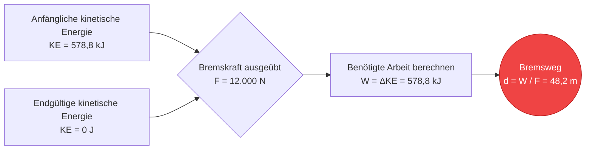
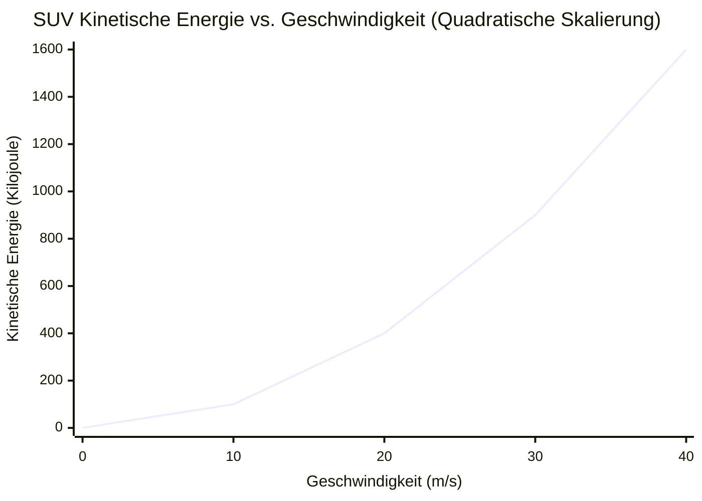
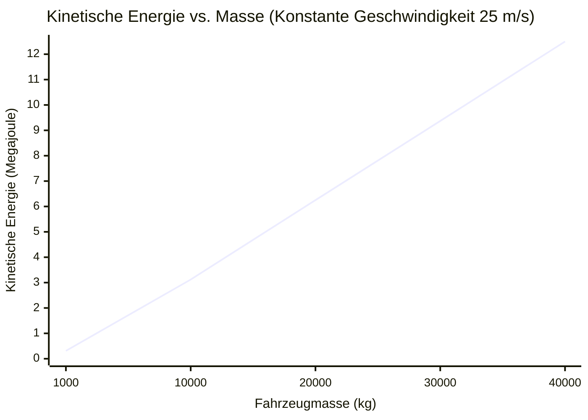
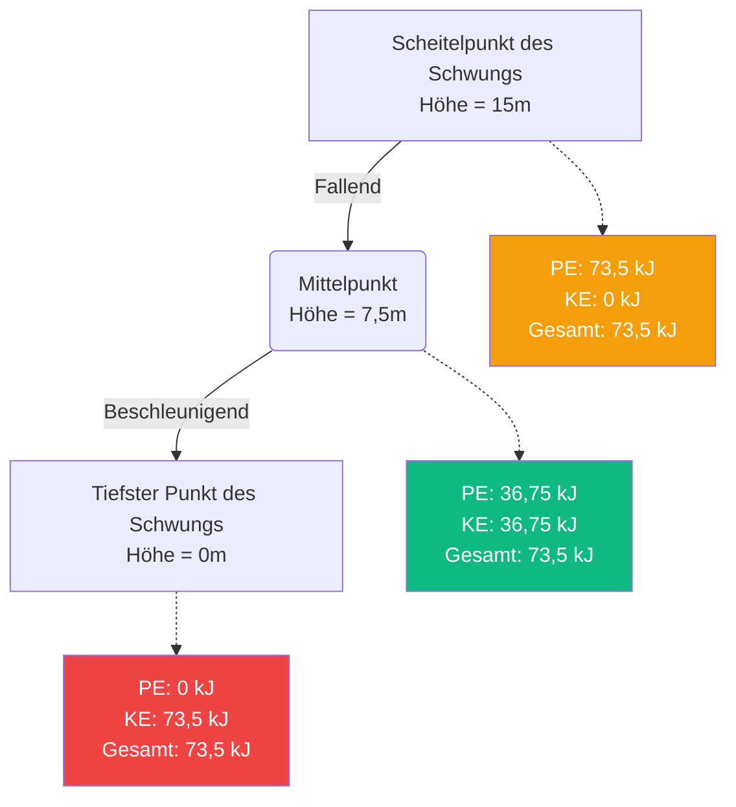
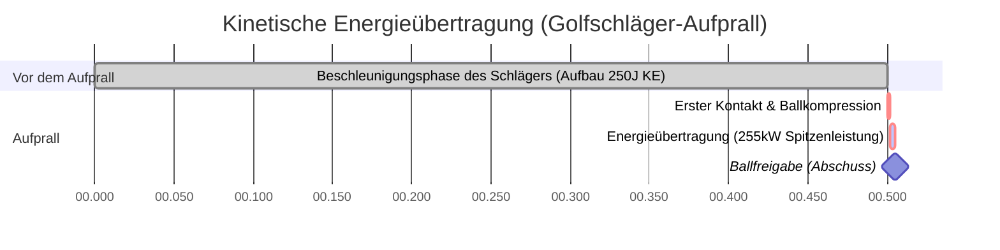

# Der ultimative Kinetische Energie Rechner: Meisterung der Physik von Bewegung und Aufprall

Willkommen beim definitiven **Kinetische Energie Rechner** und umfassenden Physik-Leitfaden. Ob Sie ein Automobilingenieur sind, der fortschrittliche Bremssysteme zur Ableitung von Aufprallenergie entwickelt, ein Planetenforscher, der Asteroidenkrater modelliert, oder ein Physikschüler, der sich auf eine Abschlussprüfung zum Arbeit-Energie-Theorem vorbereitet – dieses Werkzeug wurde für absolute Präzision entwickelt.

Kinetische Energie ist die fundamentale Energie der Bewegung. Sie ist der Grund, warum ein langsam fließender Gletscher über Jahrtausende hinweg riesige Täler formen kann, und sie ist der Grund, warum eine winzige Kugel Panzerungen in einem Bruchteil einer Millisekunde durchschlagen kann.

In diesem massiven, über 4.000 Wörter umfassenden Deep-Dive werden wir die Mechanik der kinetischen Energie ($KE = \frac{1}{2} m \cdot v^2$) umfassend dekonstruieren. Wir werden die mathematischen Grundlagen des Arbeit-Energie-Theorems erforschen, die entscheidenden Unterschiede zwischen linearem Impuls und quadratischer kinetischer Energie analysieren und Sie durch fünf reale Ingenieurbeispiele führen, die mit detaillierten Mermaid.js-Diagrammen visualisiert sind.

---

## 1. Die Physik der kinetischen Energie: Energie in Bewegung

In der klassischen Physik wird **Energie** einfach als die Fähigkeit definiert, Arbeit zu verrichten. Arbeit wird verrichtet, wenn eine Kraft auf ein Objekt ausgeübt wird, was dazu führt, dass es sich über eine bestimmte Strecke bewegt.

**Kinetische Energie** (vom griechischen Wort *kinesis*, was Bewegung bedeutet) ist die spezifische Art von Energie, die ein Objekt rein aufgrund seiner Bewegung besitzt. Wenn ein Objekt Masse hat und sich relativ zum Bezugssystem eines Beobachters bewegt, besitzt es kinetische Energie.

### Die Kernformel ($KE = \frac{1}{2} m \cdot v^2$)
Die translatorische kinetische Energie ($KE$) eines jeden Objekts wird aus der Hälfte seiner Masse ($m$) multipliziert mit dem Quadrat seiner Geschwindigkeit ($v$) berechnet.

$$ KE = \frac{1}{2} m \cdot v^2 $$

Wobei:
- **$KE$** = Kinetische Energie (gemessen in Joule, $J$)
- **$m$** = Masse (gemessen in Kilogramm, $kg$)
- **$v$** = Geschwindigkeit (gemessen in Metern pro Sekunde, $m/s$)

### Die quadratische Natur der Geschwindigkeit
Der kritischste Aspekt dieser Gleichung – und das Konzept, das bei Physikschülern und Autofahrern gleichermaßen für die meiste Verwirrung sorgt – ist, dass die kinetische Energie **quadratisch** in Bezug auf die Geschwindigkeit ist, nicht linear.

- Wenn Sie die Masse eines fahrenden Autos verdoppeln, verdoppeln Sie seine kinetische Energie ($2 \times 1 = 2$).
- Wenn Sie die **Geschwindigkeit** eines fahrenden Autos verdoppeln, **vervierfachen** Sie seine kinetische Energie ($2^2 = 4$).
- Wenn Sie die Geschwindigkeit verdreifachen, erhöht sich die kinetische Energie um den Faktor neun ($3^2 = 9$).

Diese exponentielle Skalierung ist der Grund, warum Hochgeschwindigkeits-Autounfälle exponentiell verheerender sind als Unfälle bei niedrigen Geschwindigkeiten, und warum Strafzettel für Geschwindigkeitsüberschreitungen so aggressiv skalieren.

### Skalare vs. vektorielle Größen
Im Gegensatz zu Kraft ($F = ma$) und Impuls ($p = mv$), die **Vektoren** sind (was bedeutet, dass sie eine bestimmte Richtung wie "Norden" oder "Oben" haben), ist die kinetische Energie eine **skalare** Größe.

Eine skalare Größe hat nur einen Betrag. Ein Auto von $1.500\text{ kg}$, das sich mit $30\text{ m/s}$ nach Osten bewegt, hat genau die gleiche kinetische Energie wie ein identisches Auto, das sich mit $30\text{ m/s}$ nach Westen bewegt. Da die Geschwindigkeit quadriert wird ($v^2$), wird die resultierende kinetische Energie darüber hinaus immer positiv sein, selbst wenn Sie eine negative Geschwindigkeit in die Gleichung eingeben. Kinetische Energie kann nicht negativ sein; ein Objekt hat sie entweder ($v > 0$) oder es hat sie nicht ($v = 0$).

---

## 2. Das Arbeit-Energie-Theorem

Um einem Objekt kinetische Energie zu verleihen, müssen Sie es beschleunigen. Um es zu beschleunigen, müssen Sie eine Kraft über eine bestimmte Distanz anwenden. Dieser Prozess wird als Verrichten von **Arbeit** ($W = F \cdot d$) bezeichnet.

Das **Arbeit-Energie-Theorem** schlägt auf elegante Weise eine Brücke zwischen den Newtonschen Bewegungsgesetzen und den Gesetzen der Thermodynamik. Es besagt:
> *Die resultierende Arbeit, die durch eine äußere resultierende Kraft an einem Objekt verrichtet wird, ist gleich der Änderung der kinetischen Energie des Objekts.*

$$ W_{net} = \Delta KE = KE_{final} - KE_{initial} $$

Wenn Sie einen stehenden Einkaufswagen mit einer Kraft von $50\text{ N}$ über eine Distanz von $10\text{ Metern}$ schieben, haben Sie $500\text{ Joule}$ Arbeit am Wagen verrichtet. Wenn man davon ausgeht, dass es keine Reibung gibt, besitzt der Wagen nun genau $500\text{ Joule}$ an kinetischer Energie.

Umgekehrt muss zum Anhalten eines sich bewegenden Objekts negative Arbeit verrichtet werden (wie die Reibung von Bremsbelägen). Die Bremsen müssen genau so viel negative Arbeit verrichten, um die anfängliche kinetische Energie des Autos zunichte zu machen.

---

## 3. Erhaltung der mechanischen Energie

Kinetische Energie ist die eine Hälfte der Gleichung für die **Mechanische Energie**. Die andere Hälfte ist die **Potenzielle Energie** ($PE$), die gespeicherte Energie basierend auf der Position eines Objekts (wie ein Felsbrocken, der am Rand einer Klippe liegt).

Der **Erhaltungssatz der mechanischen Energie** besagt, dass in einem isolierten System (unter Vernachlässigung von Reibung, Luftwiderstand und Wärmeverlust) die gesamte mechanische Energie vollkommen konstant bleibt. Die Energie wandelt sich lediglich zwischen potenziellen und kinetischen Zuständen hin und her.

$$ KE_{initial} + PE_{initial} = KE_{final} + PE_{final} $$

### Die Achterbahn-Analogie
Stellen Sie sich einen Achterbahnwagen vor, der ganz oben an einem massiven Gefälle steht.
1. **Auf dem Gipfel:** Der Wagen bewegt sich kaum. Die kinetische Energie ist fast null, aber die gravitative potenzielle Energie ($PE = mgh$) ist auf ihrem absoluten Maximum.
2. **Auf halbem Weg nach unten:** Während der Wagen fällt, verliert er an Höhe (verliert $PE$), gewinnt aber an Geschwindigkeit (gewinnt $KE$). Die Gesamtenergie bleibt genau gleich.
3. **Unten angekommen:** Der Wagen befindet sich auf Bodenniveau ($h = 0$, also $PE = 0$). Die gesamte gespeicherte potenzielle Energie wurde in maximale kinetische Energie umgewandelt, was zur maximalen Geschwindigkeit führt.

---

## 4. Umfassende Bedienungsanleitung: Maximale Nutzung des Rechners

Unser interaktiver Rechner für kinetische Energie ist so konzipiert, dass er sowohl einfache Masse-/Geschwindigkeitsberechnungen als auch komplexe umgekehrte physikalische Probleme lösen kann.

### Schritt 1: Grundlegende Berechnungen
Wählen Sie auf der Hauptoberfläche aus, was Sie berechnen möchten:
- **Lösen nach kinetischer Energie (KE):** Geben Sie die bekannte Masse und Geschwindigkeit ein.
- **Lösen nach Masse (m):** Geben Sie die bekannte kinetische Energie und Geschwindigkeit ein, um zu bestimmen, wie schwer ein Objekt sein muss.
- **Lösen nach Geschwindigkeit (v):** Geben Sie die bekannte kinetische Energie und Masse ein, um zu bestimmen, wie schnell sich ein Objekt bewegt.

### Schritt 2: Intelligente Einheitenumrechnungen
Der Rechner verfügt über eine robuste Umrechnungs-Engine.
- Geben Sie die Masse in **Gramm**, **Pfund**, **Unzen** oder **metrischen Tonnen** ein.
- Geben Sie die Geschwindigkeit in **mph**, **km/h**, **Knoten** oder **Mach** ein.
- Betrachten Sie die Energieabgabe in den Standardeinheiten **Joule (J)**, **Kilojoule (kJ)**, **Megajoule (MJ)** oder elektrischen Äquivalenten wie **Wattstunden (Wh)** und **Kilowattstunden (kWh)**.

### Schritt 3: Interpretation des logarithmischen Energiebogens
Energie skaliert drastisch. Ein fallengelassener Apfel besitzt etwa $1\text{ J}$ kinetische Energie. Ein Verkehrsflugzeug im Flug besitzt über $5.000.000.000\text{ J}$.
Das radiale **Bogen-Energie-Messgerät** kategorisiert Ihr Ergebnis logarithmisch:
- **Mikro-Skala (Grün):** Basebälle, Sprinter, fallende Objekte.
- **Makro-Skala (Blau):** Autos auf der Autobahn, Industriemaschinen, Züge.
- **Mega-Skala (Rot):** Düsenflugzeuge, orbitale Raketen, Meteoriteneinschläge.

---

## 5. Fünf konzeptionelle Ingenieurbeispiele mit 2D-Visualisierungen

Um wirklich zu verstehen, wie sich die kinetische Energie auf die physische Welt auswirkt, lassen Sie uns fünf detaillierte Ingenieurszenarien untersuchen und Mermaid.js verwenden, um die Physik zu visualisieren.

### Beispiel 1: Die Bremskrise auf der Autobahn (Arbeit-Energie-Theorem)

**Das Szenario:**
Eine $1.500\text{ kg}$ schwere Limousine fährt mit $100\text{ km/h}$ ($27,78\text{ m/s}$) auf der Autobahn. Ein Reh springt auf die Straße, und der Fahrer tritt voll auf die Bremse. Das Bremssystem des Autos und die Reifenreibung können eine maximale Bremskraft von $12.000\text{ N}$ aufbringen. Was ist die absolute Mindeststrecke, die das Auto zum Anhalten benötigt?

**Die Mathematik:**
Berechnen Sie zuerst die anfängliche kinetische Energie des Autos:
$$ KE = 0.5 \cdot m \cdot v^2 = 0.5 \cdot 1.500 \cdot (27,78)^2 $$
$$ KE = 750 \cdot 771,73 = 578.797\text{ Joule (578,8 kJ)} $$

Um das Auto anzuhalten, müssen die Bremsen $578.797\text{ J}$ Arbeit verrichten. Mit der Arbeitsgleichung ($W = F \cdot d$):
$$ d = \frac{W}{F} = \frac{578.797}{12.000} = 48,23\text{ Meter} $$

Das Auto benötigt knapp über 48 Meter, um rutschend zum Stehen zu kommen.

**2D-Visualisierung:**
Der folgende Logikbaum veranschaulicht das Arbeit-Energie-Theorem in Aktion.

---

### Beispiel 2: Kinetische Energie vs. Geschwindigkeit (Die quadratische Kurve)

**Das Szenario:**
Es entsteht eine Debatte über Geschwindigkeitsbegrenzungen. Ein Autofahrer argumentiert, dass das Fahren mit $80\text{ mph}$ anstelle von $40\text{ mph}$ nur "doppelt so gefährlich" sei, da er nur doppelt so schnell fahre. Mit einem standardmäßigen $2.000\text{ kg}$ schweren SUV müssen wir die zerstörerische kinetische Energie bei verschiedenen Geschwindigkeiten berechnen, um ihm das Gegenteil zu beweisen.

**Die Mathematik:**
- Bei $20\text{ m/s}$ (~45 mph): $KE = 0.5 \cdot 2.000 \cdot (20)^2 = 400.000\text{ J (400 kJ)}$
- Bei $30\text{ m/s}$ (~67 mph): $KE = 0.5 \cdot 2.000 \cdot (30)^2 = 900.000\text{ J (900 kJ)}$
- Bei $40\text{ m/s}$ (~90 mph): $KE = 0.5 \cdot 2.000 \cdot (40)^2 = 1.600.000\text{ J (1,6 MJ)}$

**2D-Visualisierung:**
Dieses Diagramm veranschaulicht auf dramatische Weise die erschreckende Realität der Variablen $v^2$. Die Verdopplung der Geschwindigkeit von $20\text{ m/s}$ auf $40\text{ m/s}$ verdoppelte die Aufprallenergie nicht; sie vervierfachte sie von $400\text{ kJ}$ auf $1.600\text{ kJ}$.

---

### Beispiel 3: Kinetische Energie vs. Masse (Lineare Skalierung)

**Das Szenario:**
Vergleichen wir nun zwei verschiedene Fahrzeuge, die sich mit exakt derselben Geschwindigkeit von $25\text{ m/s}$ (55 mph) auf einer Landstraße bewegen. Fahrzeug A ist ein leichter $1.000\text{ kg}$ schwerer Sportwagen. Fahrzeug B ist ein massiver $35.000\text{ kg}$ schwerer, beladener Sattelschlepper. Wie viel kinetische Energie besitzen sie?

**Die Mathematik:**
- Sportwagen: $KE = 0.5 \cdot 1.000 \cdot (25)^2 = 312.500\text{ J (312,5 kJ)}$
- Sattelschlepper: $KE = 0.5 \cdot 35.000 \cdot (25)^2 = 10.937.500\text{ J (10,94 MJ)}$

Da der Lastwagen 35-mal schwerer ist, besitzt er genau 35-mal mehr kinetische Energie.

**2D-Visualisierung:**
Im Gegensatz zur Geschwindigkeit skaliert die Masse linear. Dieses Diagramm zeigt die geradlinige Beziehung zwischen Masse und Energie, wenn die Geschwindigkeit konstant ist.

---

### Beispiel 4: Erhaltung der mechanischen Energie (Das Pendel)

**Das Szenario:**
Eine massive $500\text{ kg}$ schwere Abrissbirne wird per Kran auf eine Höhe von $15\text{ Metern}$ über ihrem tiefsten Ruhepunkt gehoben. Der Kran lässt die Birne los. Was ist die absolute Maximalgeschwindigkeit der Abrissbirne genau am tiefsten Punkt ihres Schwungs?

**Die Mathematik:**
Am höchsten Punkt des Schwungs ist die Geschwindigkeit = 0, was bedeutet $KE = 0$. Die gesamte Energie ist als gravitative potenzielle Energie ($PE = m \cdot g \cdot h$) gespeichert.
$$ PE_{top} = 500 \cdot 9,81 \cdot 15 = 73.575\text{ Joule} $$

Aufgrund des Erhaltungssatzes der mechanischen Energie wurden am tiefsten Punkt des Schwungs ($h = 0$) die gesamten $73.575\text{ J}$ an potenzieller Energie perfekt in kinetische Energie umgewandelt.
$$ KE_{bottom} = 73.575\text{ Joule} $$

Nun berechnen wir die Geschwindigkeit rückwärts aus der $KE$-Gleichung:
$$ v = \sqrt{\frac{2 \cdot KE}{m}} $$
$$ v = \sqrt{\frac{2 \cdot 73.575}{500}} = \sqrt{\frac{147.150}{500}} = \sqrt{294,3} = 17,15\text{ m/s} $$

Die Abrissbirne trifft das Ziel mit $17,15\text{ m/s}$ (~38 mph).

**2D-Visualisierung:**
Dieses Flussdiagramm demonstriert, wie die gesamte mechanische Energie konstant bleibt, während sie reibungslos zwischen den Zuständen übertragen wird.

---

### Beispiel 5: Biomechanik des Golfschwungs (Kinetische Übertragungszeit)

**Das Szenario:**
Ein professioneller Golfer schwingt einen $0,2\text{ kg}$ schweren Schlägerkopf mit $50\text{ m/s}$ (111 mph). Der Golfer trifft einen ruhenden $0,045\text{ kg}$ schweren Golfball. Wir müssen die immense Leistungsabgabe analysieren, die während der mikroskopischen Dauer des Aufpralls erzeugt wird.

**Die Mathematik:**
Zunächst: Was ist die kinetische Energie des Schlägerkopfes unmittelbar vor dem Aufprall?
$$ KE_{club} = 0.5 \cdot 0,2 \cdot (50)^2 = 250\text{ Joule} $$

Bei einem hocheffizienten (obwohl leicht inelastischen) Stoß wird ein großer Prozentsatz dieser Energie auf den Ball übertragen. Wenn der Schlägerkopf nach dem Aufprall auf $35\text{ m/s}$ abgebremst wird:
$$ KE_{club\_after} = 0.5 \cdot 0,2 \cdot (35)^2 = 122,5\text{ Joule} $$

Die Differenz ($250 - 122,5 = 127,5\text{ Joule}$) wird übertragen. Diese massive Energieübertragung geschieht jedoch in einer Dauer von etwa $0,0005\text{ Sekunden}$ (einer halben Millisekunde).
Leistung ist definiert als die Rate der Energieübertragung ($P = \frac{Energie}{Zeit}$):
$$ Leistung = \frac{127,5\text{ J}}{0,0005\text{ s}} = 255.000\text{ Watt (255 kW)} $$

Während dieser halben Millisekunde erzeugt der Schläger mehr Spitzenleistung als der Motor eines Hochleistungssportwagens!

**2D-Visualisierung:**
Dieses Gantt-Diagramm visualisiert den mikroskopischen Zeitverlauf der Energieübertragung während des Golfschwungs.

---

## 6. Häufig gestellte Fragen (FAQ) Deep Dive

**F: Kann kinetische Energie negativ sein?**
**A:** Nein, kinetische Energie ist streng positiv. Da die Masse nicht negativ sein kann und der Geschwindigkeitsterm mathematisch quadriert wird ($v^2$), führt selbst eine negative Geschwindigkeit (Rückwärtsbewegung) zu einer positiven kinetischen Energie.

**F: Was ist der Unterschied zwischen kinetischer Energie und Impuls?**
**A:** Dies ist der häufigste Punkt der Verwirrung in der Physik. Beide hängen von Masse und Geschwindigkeit ab. Der **Impuls** ($p = m \cdot v$) ist ein *Vektor* und skaliert *linear* mit der Geschwindigkeit. Er bestimmt, wie schwer ein Objekt aufzuhalten ist. Die **kinetische Energie** ($KE = 0.5 \cdot m \cdot v^2$) ist ein *Skalar* und skaliert *quadratisch* mit der Geschwindigkeit. Sie bestimmt, wie viel zerstörerische Arbeit ein Objekt verrichten wird, wenn es ein Ziel trifft.

**F: Hängt die kinetische Energie von Ihrem Bezugssystem ab?**
**A:** Ja, absolut. Wenn Sie in einem Hochgeschwindigkeitszug sitzen, der sich mit $300\text{ km/h}$ bewegt, ist Ihre Geschwindigkeit relativ zum Zug gleich null, also ist auch Ihre kinetische Energie relativ zum Zug gleich null. Relativ zu einer Person, die draußen auf dem Boden steht, bewegen Sie sich jedoch mit $300\text{ km/h}$ und besitzen gewaltige Mengen an kinetischer Energie.

**F: Was ist thermische Energie im Verhältnis zur kinetischen Energie?**
**A:** Thermische Energie (Wärme) ist eigentlich nur mikroskopische kinetische Energie. Wenn Sie die Temperatur einer Tasse Wasser messen, messen Sie die durchschnittliche translatorische kinetische Energie der einzelnen Wassermoleküle, die in der Tasse vibrieren und umherhüpfen.

**F: Was passiert mit der kinetischen Energie bei einem Autounfall?**
**A:** Gemäß dem ersten Hauptsatz der Thermodynamik kann Energie weder erschaffen noch zerstört werden. Bei einem Autounfall verschwindet die massive kinetische Energie des Fahrzeugs nicht; sie wird schnell in andere Energieformen umgewandelt. Sie fließt in die mechanische Arbeit des Biegens von Stahl (Verformung), thermische Energie (das Metall wird tatsächlich extrem heiß) und akustische Energie (der laute Knall des Aufpralls).

---

## 7. Fazit und Ingenieurs-Herausforderung

Die Prinzipien der kinetischen Energie diktieren die Regeln der Bewegung in unserem Universum. Durch das Verständnis der quadratischen Beziehung zwischen Geschwindigkeit und Energie können Ingenieure sicherere Autos bauen, Astrophysiker die Größe von Meteorkratern vorhersagen und Techniker für erneuerbare Energien die Effizienz von Windkraftanlagen maximieren.

Um diese Konzepte wirklich zu meistern, nutzen Sie unseren Kinetische Energie Rechner, um die folgenden konzeptionellen physikalischen Herausforderungen zu lösen:
1. **Die Railgun:** Eine experimentelle militärische Railgun feuert ein $10\text{ kg}$ schweres Wolframprojektil mit Mach 7 ($2.400\text{ m/s}$) ab. Berechnen Sie die kinetische Energie in Megajoule. Ist dies mehr oder weniger Energie als ein $2.000\text{ kg}$ schwerer Lastwagen, der mit $100\text{ km/h}$ fährt?
2. **Die Asteroidenbedrohung:** Ein Asteroid mit einer Masse von $1.000.000\text{ kg}$ rast mit $15.000\text{ m/s}$ auf die Erde zu. Um ihn abzulenken, wollen Wissenschaftler ihn mit einem kinetischen Impaktor treffen. Wenn sie nur einen $500\text{ kg}$ schweren Satelliten bauen können, wie schnell muss der Satellit den Asteroiden treffen, um $1,0\times10^{11}\text{ Joule}$ an kinetischer Gegenenergie zu liefern?
3. **Die Achterbahn:** Eine $1.200\text{ kg}$ schwere Achterbahn überquert einen $50\text{ Meter}$ hohen Hügel mit einer Kriechgeschwindigkeit von $2\text{ m/s}$. Berechnen Sie unter Verwendung des Erhaltungssatzes der mechanischen Energie ihre genaue maximale Geschwindigkeit, wenn sie den Boden des Gefälles ($h = 0$) erreicht.

Experimentieren Sie mit dem Simulator, analysieren Sie die quadratischen Graphen und verlassen Sie sich auf diesen Rechner, um die massiven Energien zu beleuchten, die die physische Welt um Sie herum beherrschen.
