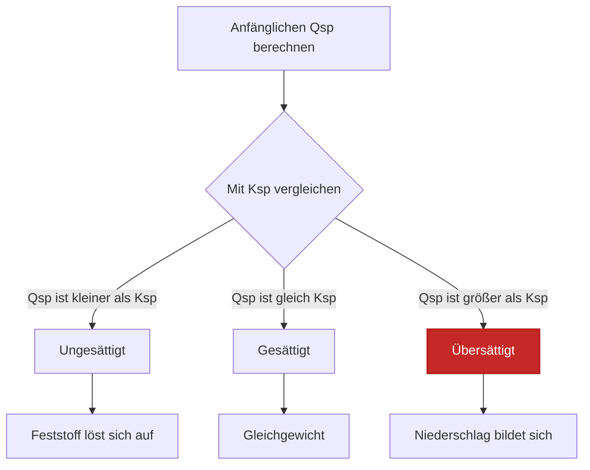

# Labor- & Analytische Chemie-Leitfaden für Ksp & Löslichkeitsgleichgewicht

In der analytischen, Umwelt- und pharmazeutischen Chemie misst das **Löslichkeitsprodukt** ($K_{sp}$) die Gleichgewichtslage einer schwerlöslichen Ionenverbindung in Wasser:

$$\text{M}_m\text{X}_n(s) \rightleftharpoons m\text{M}^{n+}(aq) + n\text{X}^{m-}(aq) \quad \implies \quad K_{sp} = [\text{M}^{n+}]^m [\text{X}^{m-}]^n$$

$$\text{Molare Löslichkeit } s \implies \begin{cases} \text{1:1 Salz (AgCl): } & K_{sp} = s^2 \implies s = \sqrt{K_{sp}} \\ \text{1:2 / 2:1 Salz (CaF}_2, \text{Ag}_2\text{CrO}_4): & K_{sp} = (s)(2s)^2 = 4s^3 \implies s = \sqrt[3]{\frac{K_{sp}}{4}} \\ \text{1:3 Salz (Al(OH)}_3): & K_{sp} = (s)(3s)^3 = 27s^4 \implies s = \sqrt[4]{\frac{K_{sp}}{27}} \end{cases}$$

$$Q_{sp} = [\text{M}^{n+}]_{\text{init}}^m [\text{X}^{m-}]_{\text{init}}^n \quad \begin{cases} Q_{sp} < K_{sp} & \implies \text{Ungesättigt (Kein Niederschlag)} \\ Q_{sp} = K_{sp} & \implies \text{Gesättigt (Gleichgewicht)} \\ Q_{sp} > K_{sp} & \implies \text{Übersättigt (Fällt aus)} \end{cases}$$

$$\text{Massenlöslichkeit } (\text{g/L}) = s \, (\text{mol/L}) \times M \, (\text{g/mol})$$

---

## 1. Referenzmatrix für gängige schwerlösliche Salze

| Verbindung | Formel | Stöchiometrie | $K_{sp}$ ($25^\circ\text{C}$) | Molare Löslichkeit $s$ ($\text{M}$) | Massenlöslichkeit ($\text{g/L}$) |
| :--- | :--- | :--- | :--- | :--- | :--- |
| **Silberchlorid** | $\text{AgCl}$ | **1:1** | **$1.77 \cdot 10^{-10}$** | **$1.33 \cdot 10^{-5}$** | **$0.00191$** |
| **Bariumsulfat** | $\text{BaSO}_4$ | **1:1** | **$1.08 \cdot 10^{-10}$** | **$1.04 \cdot 10^{-5}$** | **$0.00243$** |
| **Calciumfluorid** | $\text{CaF}_2$ | **1:2** | **$3.45 \cdot 10^{-11}$** | **$2.05 \cdot 10^{-4}$** | **$0.0160$** |
| **Blei(II)-iodid** | $\text{PbI}_2$ | **1:2** | **$9.8 \cdot 10^{-9}$** | **$1.35 \cdot 10^{-3}$** | **$0.622$** |
| **Silberchromat** | $\text{Ag}_2\text{CrO}_4$ | **2:1** | **$1.12 \cdot 10^{-12}$** | **$6.54 \cdot 10^{-5}$** | **$0.0217$** |
| **Aluminiumhydroxid**| $\text{Al(OH)}_3$ | **1:3** | **$1.3 \cdot 10^{-33}$** | **$2.63 \cdot 10^{-9}$** | **$2.05 \cdot 10^{-7}$** |

---

## 2. Standardprotokolle zur $K_{sp}$-Berechnung

```
1. Lösl. aus Ksp (1:1): s = sqrt(Ksp)
2. Lösl. aus Ksp (1:2 / 2:1): s = (Ksp / 4)^(1/3)
3. Lösl. aus Ksp (1:3): s = (Ksp / 27)^(1/4)
4. Massenlöslichkeit: Massenlösl. (g/L) = s (mol/L) * Molmasse (g/mol)
5. Qsp-Vergleich: Vergleiche Qsp mit Ksp (Qsp > Ksp -> Niederschlag)
```

---

## 3. Bildungs- & Laborsicherheitshinweis
*Dieser Ksp-Rechner bietet theoretische Gleichgewichtsberechnungen für Bildungs-, Laborforschungs- und AP-Chemie-Anwendungen. Bei konzentrierten Lösungen oder Ionenlösungen mit hohem Hintergrundelektrolyten sollten Aktivitätskoeffizienten mithilfe der Debye-Hückel- oder Pitzer-Gleichungen berücksichtigt werden.*

## 4. Der vollständige Leitfaden zum Löslichkeitsprodukt ($K_{sp}$)

Willkommen beim definitiven Leitfaden zum **Löslichkeitsprodukt ($K_{sp}$)**. Ein häufiges Missverständnis in der Einführungschemie ist, dass ionische Verbindungen entweder "löslich" oder "unlöslich" sind. In Wirklichkeit lösen sich praktisch alle ionischen Verbindungen bis zu einem *gewissen* Grad in Wasser auf. Selbst ein schwerer, scheinbar undurchdringlicher Feststoff wie steinharter Marmor ($\text{CaCO}_3$) löst sich leicht auf und setzt mikroskopische Mengen an $\text{Ca}^{2+}$- und $\text{CO}_3^{2-}$-Ionen frei, bis ein dynamisches Gleichgewicht erreicht ist.

In diesem ausführlichen, über 4000 Wörter umfassenden technischen Handbuch werden wir die Mathematik des heterogenen Löslichkeitsgleichgewichts vollständig entschlüsseln. Wir definieren die stöchiometrische Beziehung zwischen $K_{sp}$ und der molaren Löslichkeit ($s$), erklären, warum man nicht einfach einen $K_{sp}$-Wert betrachten kann, um zu wissen, welches Salz löslicher ist, und tauchen tief in den Effekt des gleichionigen Zusatzes ein. Schließlich werden wir fünf rigorose, schrittweise mathematische Ableitungen durchführen, die 1:1-, 1:2- und 1:3-Salze, die Umwandlung der Massenlöslichkeit und die Vorhersage von Niederschlägen unter Verwendung des Reaktionsquotienten ($Q_{sp}$) abdecken.

### 4.1 Was ist $K_{sp}$ (Löslichkeitsprodukt)?

Wenn sich eine feste ionische Verbindung in Wasser löst, dissoziiert sie in ihre konstituierenden wässrigen Kationen und Anionen. Sobald die Lösung gesättigt ist, wird ein Zustand des dynamischen Gleichgewichts erreicht: Die Geschwindigkeit, mit der sich der Feststoff auflöst, entspricht exakt der Geschwindigkeit, mit der sich die gelösten Ionen rekombinieren und als Feststoff ausfallen.

Für ein generisches schwerlösliches Salz:
$$ \text{M}_m\text{X}_n(s) \rightleftharpoons m\text{M}^{n+}(aq) + n\text{X}^{m-}(aq) $$

Der Gleichgewichtsausdruck für diese Auflösung ist das **Löslichkeitsprodukt ($K_{sp}$)**:
$$ K_{sp} = [\text{M}^{n+}]^m [\text{X}^{m-}]^n $$

**KRITISCHE REGEL:** Beachten Sie, dass der feste Reaktant ($\text{M}_m\text{X}_n(s)$) vollständig aus dem Nenner ausgeschlossen ist. Dies liegt daran, dass reine Feststoffe eine konstante thermodynamische Aktivität von 1 haben. Ihre Masse beeinflusst nicht die Konzentration der gelösten Ionen im Gleichgewicht.

### 4.2 Molare Löslichkeit ($s$) vs $K_{sp}$

$K_{sp}$ ist eine einheitenlose Konstante, die bei einer bestimmten Temperatur gilt. Aber was Chemiker normalerweise wissen wollen, ist die **molare Löslichkeit ($s$)**: die maximale Anzahl an Molen des Feststoffs, die sich in einem Liter Wasser auflösen.

Die Beziehung zwischen $s$ und $K_{sp}$ hängt vollständig von der Stöchiometrie des Salzes ab:
*   **1:1 Salze (z. B. AgCl):** $s$ Mol lösen sich auf und ergeben $s$ Mol $\text{Ag}^+$ und $s$ Mol $\text{Cl}^-$.
    $K_{sp} = (s)(s) = s^2 \implies s = \sqrt{K_{sp}}$
*   **1:2 oder 2:1 Salze (z. B. $\text{CaF}_2$):** $s$ Mol lösen sich auf und ergeben $s$ Mol $\text{Ca}^{2+}$ und $2s$ Mol $\text{F}^-$.
    $K_{sp} = (s)(2s)^2 = 4s^3 \implies s = \sqrt[3]{\frac{K_{sp}}{4}}$
*   **1:3 oder 3:1 Salze (z. B. $\text{Al(OH)}_3$):** $s$ Mol lösen sich auf und ergeben $s$ Mol $\text{Al}^{3+}$ und $3s$ Mol $\text{OH}^-$.
    $K_{sp} = (s)(3s)^3 = 27s^4 \implies s = \sqrt[4]{\frac{K_{sp}}{27}}$

**Warum man $K_{sp}$-Werte nicht direkt vergleichen kann:** Wenn Sie wissen möchten, welches Salz löslicher ist, können Sie $K_{sp}$ nur direkt vergleichen, wenn die Salze dieselbe Stöchiometrie aufweisen. Ein 1:2-Salz kann einen kleineren $K_{sp}$ haben als ein 1:1-Salz, aber aufgrund der Kubikwurzel-Mathematik tatsächlich eine *größere* molare Löslichkeit $s$ aufweisen. Berechnen Sie immer $s$, um die wahre Löslichkeit zu bestimmen!

### 4.3 Vorhersage von Fällung: Der Reaktionsquotient ($Q_{sp}$)

Wenn man zwei klare Lösungen miteinander mischt, bildet sich dann ein fester Niederschlag? Wir sagen dies voraus, indem wir den **Reaktionsquotienten ($Q_{sp}$)** berechnen. $Q_{sp}$ verwendet exakt dieselbe Formel wie $K_{sp}$, wir setzen jedoch die *anfänglichen* Konzentrationen der gemischten Ionen ein, bevor eine Reaktion stattgefunden hat.

Durch den Vergleich von $Q_{sp}$ mit $K_{sp}$:
*   **$Q_{sp} < K_{sp}$ (Ungesättigt):** Die Lösung kann mehr Ionen aufnehmen. Es bildet sich kein Niederschlag. Jeglicher vorhandener Feststoff löst sich weiter auf.
*   **$Q_{sp} = K_{sp}$ (Gesättigt):** Die Lösung befindet sich perfekt im Gleichgewicht.
*   **$Q_{sp} > K_{sp}$ (Übersättigt):** Die Ionenkonzentration ist zu hoch. Das System verschiebt sich rückwärts und ein fester Niederschlag **WIRD SICH BILDEN**, bis $Q_{sp}$ sinkt und gleich $K_{sp}$ ist.

### 4.4 Der Effekt des gleichionigen Zusatzes (Le Chatelier in Aktion)

Der Effekt des gleichionigen Zusatzes besagt, dass die Zugabe eines Ions, das bereits am Gleichgewicht beteiligt ist, die Löslichkeit des Feststoffs drastisch unterdrückt.

Wenn Sie eine gesättigte Lösung von $\text{AgCl}$ und Sie geben hochlösliches $\text{NaCl}$ hinzu, stört der massive Zustrom von $\text{Cl}^-$-Ionen das Gleichgewicht heftig. Nach dem Prinzip von Le Chatelier verschiebt sich das System nach links, um das überschüssige $\text{Cl}^-$ zu verbrauchen, was dazu führt, dass riesige Mengen an $\text{AgCl}(s)$ aus der Lösung ausfallen. Die Löslichkeit eines Salzes ist in einer Lösung, die ein gemeinsames Ion enthält, immer viel geringer als in reinem Wasser.

---

## 5. Gebrauchsanweisung: Den Ksp-Rechner meistern

Unser Ksp-Rechner ist ein komplettes analytisches Toolkit für die Löslichkeit.

### 5.1 Modus: Löslichkeit aus $K_{sp}$ berechnen

1.  **Modus wählen:** Wählen Sie "Molare Löslichkeit aus Ksp".
2.  **Salz wählen:** Wählen Sie aus den Voreinstellungen (wie $\text{CaF}_2$) oder geben Sie eine benutzerdefinierte Stöchiometrie ein (wie 1:2).
3.  **Eingabe:** Geben Sie den $K_{sp}$-Wert ein.
4.  **Ausgabe ablesen:** Das Tool führt sofort die algebraische Wurzelberechnung aus ($s = \sqrt[3]{K_{sp}/4}$) und gibt die molare Löslichkeit $s$, die Gleichgewichtsionenkonzentrationen aus und konvertiert sie in die Massenlöslichkeit (g/L).

### 5.2 Modus: Qsp Fällungsvorhersage

1.  **Modus wählen:** Wählen Sie "Qsp Fällungsvorhersage".
2.  **Eingabe:** Geben Sie den Ziel-$K_{sp}$, die Stöchiometrie und die Anfangskonzentration des Kations und des Anions ein.
3.  **Ausführen:** Das Tool berechnet $Q_{sp}$, vergleicht es mit $K_{sp}$ und gibt an, ob sich ein fester Niederschlag bildet.

### 5.3 Modus: Simulator für den gleichionigen Zusatz

1.  **Modus wählen:** Wählen Sie "Effekt des gleichionigen Zusatzes".
2.  **Eingabe:** Geben Sie den $K_{sp}$ und die Konzentration des hinzugefügten gemeinsamen Ions ein (z. B. $0.10\text{ M}$ hinzugefügtes $\text{Cl}^-$).
3.  **Ausführen:** Das Tool richtet den algebraischen Ausdruck der modifizierten ICE-Tabelle ein, ignoriert den vernachlässigbaren '+s'-Term über die Klein-x-Näherung und berechnet die drastisch reduzierte molare Löslichkeit.

---

## 6. Fünf praxisnahe Beispiele aus der analytischen Chemie

Lassen Sie uns diese Theorie in absoluter mathematischer Realität verankern, indem wir fünf klassische, rigorose Löslichkeitsszenarien lösen.

### Beispiel 1: Das 1:1 Salz (Silberchlorid)

**Szenario:** 
Silberchlorid ($\text{AgCl}$) ist ein klassisches schwerlösliches Salz, das in der Fotografie verwendet wird. Sein $K_{sp}$ bei $25^\circ\text{C}$ beträgt $1.77 \times 10^{-10}$. Berechnen Sie seine molare Löslichkeit in reinem Wasser und finden Sie die Konzentration der $\text{Ag}^+$-Ionen.

**Mathematische Ableitung:**

1.  **Gleichgewichtsgleichung:**
    $\text{AgCl}(s) \rightleftharpoons \text{Ag}^+(aq) + \text{Cl}^-(aq)$
2.  **$K_{sp}$-Ausdruck definieren:**
    $K_{sp} = [\text{Ag}^+][\text{Cl}^-]$
3.  **Molare Löslichkeit ($s$) definieren:**
    Sei $s$ die Menge an $\text{AgCl}$, die sich auflöst.
    $[\text{Ag}^+] = s$
    $[\text{Cl}^-] = s$
4.  **Einsetzen und Lösen:**
    $1.77 \times 10^{-10} = (s)(s) = s^2$
    $s = \sqrt{1.77 \times 10^{-10}}$
    $s = 1.33 \times 10^{-5}\text{ M}$
5.  **Ionenkonzentrationen berechnen:**
    $[\text{Ag}^+] = 1.33 \times 10^{-5}\text{ M}$

**Fazit:** Nur $1.33 \times 10^{-5}$ Mol $\text{AgCl}$ lösen sich pro Liter reinem Wasser auf.

### Beispiel 2: Das 1:2 Salz (Calciumfluorid)

**Szenario:**
Calciumfluorid ($\text{CaF}_2$) bildet das Mineral Fluorit. Sein $K_{sp}$ beträgt $3.45 \times 10^{-11}$. Berechnen Sie seine molare Löslichkeit und die Endkonzentration der Fluoridionen.

**Mathematische Ableitung:**

1.  **Gleichgewichtsgleichung:**
    $\text{CaF}_2(s) \rightleftharpoons \text{Ca}^{2+}(aq) + 2\text{F}^-(aq)$
2.  **$K_{sp}$-Ausdruck definieren:**
    $K_{sp} = [\text{Ca}^{2+}][\text{F}^-]^2$
3.  **Molare Löslichkeit ($s$) definieren:**
    Für jedes 1 Mol $\text{CaF}_2$, das sich auflöst, entstehen 1 Mol $\text{Ca}^{2+}$ und **2 Mol** $\text{F}^-$.
    $[\text{Ca}^{2+}] = s$
    $[\text{F}^-] = 2s$
4.  **Einsetzen und Lösen:**
    $3.45 \times 10^{-11} = (s)(2s)^2$
    $3.45 \times 10^{-11} = 4s^3$
    $s^3 = 8.625 \times 10^{-12}$
    $s = \sqrt[3]{8.625 \times 10^{-12}}$
    $s = 2.05 \times 10^{-4}\text{ M}$
5.  **Ionenkonzentrationen berechnen:**
    $[\text{Ca}^{2+}] = 2.05 \times 10^{-4}\text{ M}$
    $[\text{F}^-] = 2(2.05 \times 10^{-4}) = 4.10 \times 10^{-4}\text{ M}$

**Fazit:** Die molare Löslichkeit beträgt $2.05 \times 10^{-4}\text{ M}$ und die Fluoridkonzentration ist genau doppelt so hoch.

### Beispiel 3: Umwandlung in Massenlöslichkeit (g/L)

**Szenario:**
Unter Verwendung der Ergebnisse aus Beispiel 2, was ist die Löslichkeit von $\text{CaF}_2$ in Gramm pro Liter? Die Molmasse von $\text{CaF}_2$ beträgt $78.07\text{ g/mol}$.

**Mathematische Ableitung:**

1.  **Molare Löslichkeit ($s$) abrufen:**
    $s = 2.05 \times 10^{-4}\text{ mol/L}$
2.  **Mit der Molmasse multiplizieren:**
    $\text{Massenlöslichkeit} = \left(2.05 \times 10^{-4} \frac{\text{mol}}{\text{L}}\right) \times \left(78.07 \frac{\text{g}}{\text{mol}}\right)$
    $\text{Massenlöslichkeit} = 0.0160\text{ g/L}$
3.  **In Milligramm pro Liter (mg/L) umwandeln:**
    $0.0160\text{ g/L} \times 1000\text{ mg/g} = 16.0\text{ mg/L}$

**Fazit:** Sie können exakt 16 Milligramm Calciumfluorid in einem Liter reinem Wasser auflösen.

### Beispiel 4: Vorhersage von Fällung mit $Q_{sp}$

**Szenario:**
Sie mischen $50.0\text{ mL}$ von $0.0010\text{ M BaCl}_2$ mit $50.0\text{ mL}$ von $0.00010\text{ M Na}_2\text{SO}_4$. Der $K_{sp}$ für Bariumsulfat ($\text{BaSO}_4$) beträgt $1.08 \times 10^{-10}$. Wird sich ein weißer Niederschlag von $\text{BaSO}_4$ bilden?

**Mathematische Ableitung:**

1.  **Neue verdünnte Konzentrationen berechnen:**
    Da Sie das Gesamtvolumen verdoppelt haben (von 50 mL auf 100 mL), halbieren sich die Konzentrationen der Ionen sofort nach dem Mischen.
    $[\text{Ba}^{2+}]_{\text{init}} = \frac{0.0010}{2} = 0.00050\text{ M}$
    $[\text{SO}_4^{2-}]_{\text{init}} = \frac{0.00010}{2} = 0.000050\text{ M}$
2.  **$Q_{sp}$ berechnen:**
    $Q_{sp} = [\text{Ba}^{2+}]_{\text{init}} [\text{SO}_4^{2-}]_{\text{init}}$
    $Q_{sp} = (0.00050)(0.000050) = 2.5 \times 10^{-8}$
3.  **$Q_{sp}$ mit $K_{sp}$ vergleichen:**
    $Q_{sp} (2.5 \times 10^{-8}) > K_{sp} (1.08 \times 10^{-10})$

**Fazit:** Da $Q_{sp}$ deutlich größer als $K_{sp}$ ist, ist die Lösung übersättigt. Ein fester weißer Niederschlag von Bariumsulfat **WIRD SICH BILDEN**.

**Visualisierung: Die Matrix zur Fällungsvorhersage**


*Dieses Flussdiagramm veranschaulicht die universelle Logik zur Bestimmung, ob zwei gemischte klare Lösungen spontan einen unlöslichen Feststoff bilden.*

### Beispiel 5: Der Effekt des gleichionigen Zusatzes (Zerquetschen der Löslichkeit)

**Szenario:**
Erinnern Sie sich an Beispiel 1: Die Löslichkeit von $\text{AgCl}$ in reinem Wasser beträgt $1.33 \times 10^{-5}\text{ M}$. Berechnen Sie nun die molare Löslichkeit von $\text{AgCl}$ in einer Lösung, die bereits $0.10\text{ M NaCl}$ enthält. 
($K_{sp} = 1.77 \times 10^{-10}$)

**Mathematische Ableitung:**

1.  **Das gemeinsame Ion identifizieren:**
    $\text{NaCl}$ löst sich vollständig auf und füllt die Lösung mit $0.10\text{ M}$ an $\text{Cl}^-$-Ionen.
2.  **ICE-Tabelle erstellen:**
    *   **I:** $[\text{Ag}^+] = 0$, $[\text{Cl}^-] = 0.10$
    *   **C:** $+s$, $+s$
    *   **E:** $s$, $(0.10 + s)$
3.  **$K_{sp}$-Gleichung aufstellen:**
    $K_{sp} = [\text{Ag}^+][\text{Cl}^-]$
    $1.77 \times 10^{-10} = (s)(0.10 + s)$
4.  **Klein-x-Näherung anwenden:**
    Da der $K_{sp}$ unglaublich klein ist ($10^{-10}$), wird die Menge an Feststoff, die sich auflöst ($s$), im Vergleich zu den massiven $0.10\text{ M}$, die bereits vorhanden sind, winzig sein. Daher nehmen wir an, dass $(0.10 + s) \approx 0.10$.
5.  **Vereinfachte Gleichung lösen:**
    $1.77 \times 10^{-10} = (s)(0.10)$
    $s = \frac{1.77 \times 10^{-10}}{0.10}$
    $s = 1.77 \times 10^{-9}\text{ M}$

**Fazit:** In reinem Wasser betrug die Löslichkeit $13.300 \times 10^{-9}\text{ M}$. In Gegenwart des gemeinsamen Chloridions fiel sie auf $1.77 \times 10^{-9}\text{ M}$. Der Effekt des gleichionigen Zusatzes verringerte die Löslichkeit des Silberchlorids um einen Faktor von fast 10.000!

**Visualisierung: Dynamik des Effekts des gleichionigen Zusatzes**

```mermaid
gantt
    title Der Effekt des gleichionigen Zusatzes auf die AgCl-Löslichkeit
    dateFormat  HH:mm:ss
    axisFormat  %H:%M
    section Basislinie
    Löslichkeit in reinem Wasser :00:00:00, 00:10:00
    section Gemeinsames Ion hinzugefügt
    NaCl in Becherglas gekippt :crit, 00:10:00, 00:12:00
    section Le Chatelier Verschiebung
    Massive Fällungsverschiebung nach links :active, 00:12:00, 00:20:00
    Löslichkeit um das 10.000-fache reduziert :00:20:00, 00:30:00
```


*Diese Zeitleiste veranschaulicht, wie der plötzliche Zustrom eines gemeinsamen Ions eine heftige Le-Chatelier-Verschiebung rückwärts erzwingt, was zu einer massiven Ausfällung führt und die molare Löslichkeit des Feststoffs dauerhaft verkrüppelt.*

---

## 7. Deep Dive FAQ und erweiterte Fehlerbehebung

**F: Wenn ich die Menge des am Boden des Becherglases liegenden Feststoffs erhöhe, steigt dann die Konzentration der Ionen im Wasser?**
**A:** Absolut nicht. Der Feststoff ist nicht Teil des $K_{sp}$-Ausdrucks. Ob Sie 1 Gramm oder 1 Kilogramm ungelösten Feststoff am Boden des Becherglases haben, die Konzentration der gelösten Ionen im Wasser darüber bleibt perfekt auf den Sättigungspunkt festgelegt, der durch den $K_{sp}$ vorgegeben ist.

**F: Gibt es Einschränkungen bei $K_{sp}$-Berechnungen?**
**A:** Ja. Einfache $K_{sp}$-Berechnungen gehen von einem idealen Verhalten aus. In Lösungen mit extrem hohen Konzentrationen anderer, nicht gemeinsamer Ionen (hohe "Ionenstärke") ordnen sich die Wassermoleküle um diese Fremdionen herum an, was es dem schwerlöslichen Feststoff *erleichtert*, sich aufzulösen. Dies wird als "Fremdioneneffekt" oder "Salzeffekt" bezeichnet und *erhöht* tatsächlich die Löslichkeit, was zur genauen Modellierung erweiterte Debye-Hückel-Aktivitätsberechnungen erfordert.

**F: Kann $Q_{sp}$ jemals exakt null sein?**
**A:** Ja, wenn Sie einen reinen Feststoff in 100% reines destilliertes Wasser geben, bevor sich ein einziges Atom auflöst, ist die anfängliche Konzentration der Ionen exakt null. $Q_{sp} = (0)(0) = 0$. Da $0 < K_{sp}$, beginnt sich der Feststoff sofort aufzulösen, um das Gleichgewicht zu erreichen.

Die Beherrschung der mathematischen Nuancen von stöchiometrischen Exponenten, der Umwandlung der Massenlöslichkeit und der brutalen Auswirkung des Effekts des gleichionigen Zusatzes gibt Ihnen die totale Kontrolle über die analytische Fällungschemie. Wann immer Sie mit einem heterogenen Ionengleichgewicht konfrontiert sind, verlassen Sie sich auf diesen Ksp-Rechner, um sofortige, mathematisch perfekte Lösungen zu erhalten.
