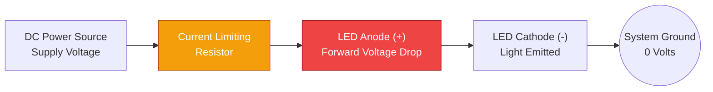
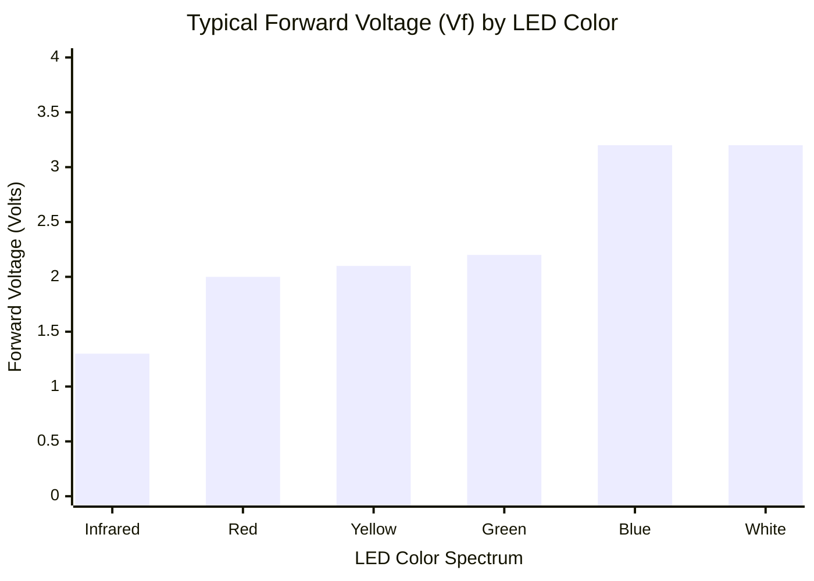
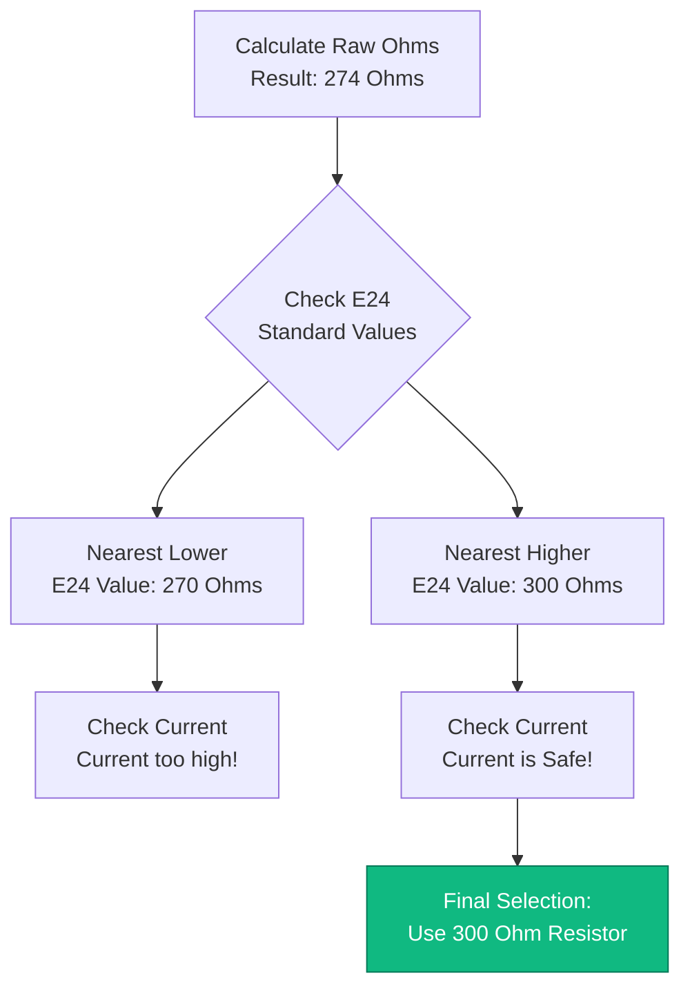
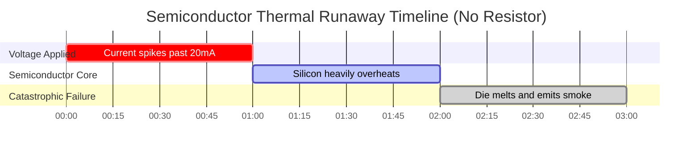

# Der definitive LED-Vorwiderstandsrechner: Ohmsches Gesetz, E24-Standards und Verlustleistung

Willkommen beim ultimativen **LED-Vorwiderstandsrechner** und umfassenden Halbleiterschaltungs-Leitfaden. Egal, ob Sie ein Elektronik-Hobbyist sind, der ein 5$\text{V}$ Arduino-Anzeigenarray prototypisiert, ein Kfz-Techniker, der versucht, 12$\text{V}$ Armaturenbrett-LEDs sauber nachzurüsten, ohne CanBus-Fehler auszulösen, oder ein Ingenieurstudent, der $R = (V_s - V_f) / I$ physikalisch herleitet – die Beherrschung der Mathematik von Vorwiderständen ist absolut zwingend erforderlich.

Eine LED (Leuchtdiode) ist keine Glühbirne. Sie ist ein hochempfindlicher Halbleiter. Wenn Sie eine LED ohne einen Strombegrenzungswiderstand direkt an eine Stromquelle anschließen, bricht ihr Innenwiderstand sofort zusammen, wodurch sie unendlich viel Strom zieht, sich heftig überhitzt und in einer Wolke aus beißendem blauem Rauch explodiert.

In dieser ausführlichen, über 4.000 Wörter umfassenden SEO-Meisterklasse werden wir die grundlegende Gleichung $R = \frac{V_s - V_f}{I}$ dekonstruieren, die Gefahren paralleler LED-Arrays mathematisch aufzeigen, die höchst verwirrenden 4-Ring- und 5-Ring-Widerstandsfarbcodes entschlüsseln und die Joulesche Erwärmung ($P = I^2 R$) aggressiv analysieren, um sicherzustellen, dass Sie niemals versehentlich einen 1/4$\text{W}$-Widerstand schmelzen. Um diese kritischen elektrotechnischen Konzepte zu festigen, haben wir fünf sorgfältig detaillierte, parser-sichere interaktive Mermaid.js-Diagramme integriert.

---

## 1. Warum explodieren LEDs? (Die Physik der Durchlassspannung)

Um zu verstehen, warum ein Widerstand zwingend erforderlich ist, müssen Sie die Halbleiterphysik der **Durchlassspannung ($V_f$)** verstehen.

Im Gegensatz zu einem herkömmlichen Kupferdraht oder einem Wolframfaden gehorcht eine LED dem Ohmschen Gesetz nicht auf lineare Weise. Eine LED ist eine Diode – ein Einwegventil für Elektrizität. Wenn eine Spannung angelegt wird, blockiert die LED jeglichen Strom perfekt, bis die Spannung einen kritischen Halbleiterschwellenwert überschreitet, der als **Durchlassspannung ($V_f$)** bekannt ist.

Für eine Standard-Rot-LED beträgt $V_f$ genau 2,0$\text{V}$. 
- Wenn Sie 1,9$\text{V}$ anlegen, zieht die LED 0$\text{ Ampere}$. Sie ist völlig dunkel.
- Wenn Sie 2,0$\text{V}$ anlegen, schaltet sich die LED ein und zieht ihre angegebenen 20$\text{ mA}$.
- Wenn Sie 2,1$\text{V}$ anlegen, bricht der Innenwiderstand vollständig zusammen, die LED zieht 200$\text{ mA}$, und der Halbleiterchip schmilzt physikalisch.

Ein Widerstand wirkt wie ein Stoßdämpfer. Er verbrennt mathematisch die überschüssige Spannung ($V_s - V_f$) und begrenzt den durch die Schaltung fließenden Maximalstrom streng, wodurch die LED sicher auf 20$\text{ mA}$ verriegelt bleibt.

---

## 2. Die grundlegende LED-Widerstandsgleichung

Die Berechnung des perfekten Vorwiderstands erfordert nur einfache Algebra. Sie müssen ermitteln, wie viel überschüssige Spannung vom Widerstand absorbiert werden muss, und diese durch Ihren Zielstrom dividieren.

**Die Grundformel:**
$$R = \frac{V_s - V_f}{I}$$

Wobei:
- $V_s$ = **Versorgungsspannung** (Die Spannung Ihrer Batterie oder Stromversorgung, z.B. 5$\text{V}$ oder 12$\text{V}$).
- $V_f$ = **Durchlassspannung** (Die von der LED selbst verbrauchte Spannung, z.B. 2,0$\text{V}$ für Rot).
- $I$ = **Zielstrom** (Der gewünschte Helligkeitsstrom in Ampere, z.B. 0,020$\text{A}$ für 20$\text{mA}$).

**Berechnungsbeispiel (Arduino 5V mit Roter LED):**
1. Abzufallende Spannung: 5,0$\text{V}$ - 2,0$\text{V}$ = 3,0$\text{V}$
2. Zielstrom: 20$\text{ mA}$ = 0,020$\text{ A}$
3. Widerstand: 3,0 / 0,020 = 150 $\Omega$

Sie benötigen exakt einen 150 $\Omega$ Widerstand, um eine rote LED sicher an einem Arduino zu betreiben.

---

## 3. Das Problem mit den E24-Standardwiderständen

Mathematik liefert oft unschöne Zahlen. Wenn Sie einen erforderlichen LED-Widerstand von 137,5 $\Omega$ berechnen, werden Sie schnell eine frustrierende Realität entdecken: **Sie können keinen 137,5 $\Omega$ Widerstand kaufen.**

Elektronische Komponenten werden in standardisierten, logarithmischen Chargen hergestellt, die als **E-Reihe** bekannt sind. 
Der gebräuchlichste Standard ist die **E24-Reihe**, die die 24 Standardwerte vorschreibt, die in jedem Widerstandsjahrzehnt verfügbar sind.

Häufige E24-Basiswerte: 10, 11, 12, 13, 15, 16, 18, 20, 22, 24, 27, 30, 33, 36, 39, 43, 47, 51, 56, 62, 68, 75, 82, 91.

Wenn Ihre Berechnung zwischen zwei E24-Werten landet, **runden Sie immer auf den nächsthöheren Standardwert auf.** 
Aufrunden erhöht den Widerstand, was den Strom leicht verringert und sicherstellt, dass die LED kühler läuft und länger lebt. Wenn Sie abrunden, riskieren Sie, die LED zu übersteuern.

---

## 4. Joulesche Erwärmung und Widerstandsbrandgefahr ($P = I^2 R$)

Die Strombegrenzung ist nur die halbe Miete. Wenn ein Widerstand überschüssige Spannung absorbiert, lässt er die Energie nicht auf magische Weise verschwinden – er wandelt diese elektrische Energie heftig in thermische Wärme um. Dies wird als **Joulesche Erwärmung** bezeichnet.

Wenn Ihr Widerstand zu heiß wird, verdampft seine Kohleschicht und unterbricht den Stromkreis.

**Die Formel für die Verlustleistung:**
$$P = V_R \times I \quad \text{oder} \quad P = I^2 \cdot R$$

**Beispiel: 12V Autobatterie mit einer einzelnen Roten LED (2V, 20mA).**
- Am Widerstand abgefallene Spannung ($V_R$): 12$\text{V}$ - 2$\text{V}$ = 10$\text{V}$.
- Strom ($I$): 0,020$\text{ A}$.
- Leistung ($P$): 10 $\times$ 0,020 = 0,200$\text{ Watt}$ (200$\text{ mW}$).

Ein winziger Standard-Hobby-Widerstand ist für **1/4$\text{ Watt}$ (250$\text{ mW}$)** ausgelegt. 
Da 200$\text{ mW}$ extrem nah an der Grenze von 250$\text{ mW}$ liegen, wird dieser Widerstand bei Berührung kochend heiß sein. In automobilen Umgebungen wird die Umgebungswärme diesen Widerstand leicht über seinen thermischen Ausfallpunkt hinaustreiben.

*Ingenieurregel:* **Verdoppeln Sie immer die berechnete Leistung in Watt.** Wenn Sie 200$\text{ mW}$ berechnen, müssen Sie für eine sichere thermische Marge einen 1/2$\text{ Watt}$ (500$\text{ mW}$) Widerstand verwenden.

---

## 5. Serien- vs. Parallele LED-Arrays

Bei der Verkabelung mehrerer LEDs haben Sie zwei Möglichkeiten: Reihen- oder Parallelschaltung. **Eine dieser Entscheidungen ist ein massiver technischer Fehler.**

### Die Gefahr paralleler LEDs
Anfänger schalten oft 5 LEDs parallel und versuchen, einen einzigen, gemeinsamen Widerstand zu verwenden. Das ist katastrophal. Aufgrund mikroskopischer Fertigungsfehler hat unweigerlich eine LED einen etwas niedrigeren $V_f$ als die anderen. Diese einzige LED wird gierig den gesamten Strom "an sich reißen", überhitzen und sterben. Sobald sie stirbt, wird der gesamte Strom auf die nächste schwächste LED abgeladen, was zu einer kaskadierenden Kettenreaktionsexplosion führt, die als **Thermisches Durchgehen** bekannt ist.
*Verwenden Sie niemals einen gemeinsamen Widerstand für parallele LEDs. Geben Sie jeder LED ihren eigenen, dedizierten Widerstand.*

### Die Effizienz in Reihe geschalteter LEDs
Die Verkabelung von LEDs in einer Reihenschaltung ist sehr effizient. Der Strom (20$\text{ mA}$) fließt gleichermaßen durch alle LEDs, aber ihre Durchlassspannungen ($V_f$) addieren sich.
- Drei rote LEDs (jeweils 2,0$\text{V}$) in Reihe verbrauchen insgesamt 6,0$\text{V}$.
- An einer 12$\text{V}$-Versorgung muss der Widerstand nur 6,0$\text{V}$ abfallen lassen, was die Wärmeverschwendung massiv reduziert.
- **Formel:** $R = (V_s - (3 \times V_f)) / I$.

---

## 6. Fünf konzeptionelle Ingenieurszenarien mit 2D-Visualisierungen

Um die physikalischen Beziehungen, die LED-Schaltungen steuern, vollständig zu beherrschen, werden wir fünf verschiedene Ingenieurszenarien untersuchen, die visuell mithilfe benutzerdefinierter Mermaid.js-Diagramme aufgeschlüsselt sind.

### Beispiel 1: Die Anatomie der Standard-LED-Schaltung

**Das Szenario:**
Ein Elektronikstudent muss die zwingende Reihenfolge von Komponenten verstehen, die erforderlich sind, um eine einzelne LED sicher über eine Gleichstromquelle zum Leuchten zu bringen.

**2D-Visualisierung:**
Dieses Logik-Flussdiagramm bildet den physikalischen Weg des Stroms ab, der von der positiven Spannungsquelle durch den Schutzwiderstand in die LED-Anode und zurück zur Masse fließt.



---

### Beispiel 2: Durchlassspannung ($V_f$) nach LED-Farbe

**Das Szenario:**
Ein Robotikingenieur entwirft ein Anzeigepanel und muss die unterschiedlichen Spannungsabfälle an verschiedenen farbigen LEDs präzise berücksichtigen.

**Die Mathematik:**
Verschiedene Farben erfordern unterschiedliche Halbleitermaterialien (GaAs vs. InGaN). Rot hat eine extrem niedrige Energie (2,0$\text{V}$), während Blau/Weiß eine hohe Energie (3,2$\text{V}$) benötigt.

**2D-Visualisierung:**
Dieses Balkendiagramm ordnet die exakten Durchlassspannungen, die erforderlich sind, um standardmäßige 5mm-LEDs zu beleuchten, aggressiv basierend auf ihrem Farbspektrum ein.



---

### Beispiel 3: Verlustleistungsmargen von Widerständen

**Das Szenario:**
Ein Kfz-Techniker berechnet, dass sein 12$\text{V}$-Armaturenbrett-LED-Widerstand 0,40$\text{W}$ (400$\text{ mW}$) thermische Wärme ableiten wird. Er muss die korrekte physikalische Widerstandsgröße auswählen.

**Die Mathematik:**
Die Verwendung eines 1/4$\text{W}$ (250$\text{ mW}$) Widerstands löst sofort einen Brand aus. Die Verwendung eines 1/2$\text{W}$ (500$\text{ mW}$) Widerstands ist technisch sicher, lässt aber keinerlei thermische Marge. Ein 1$\text{W}$ (1000$\text{ mW}$) Widerstand bietet den zwingend erforderlichen 2-fachen Sicherheitsfaktor.

**2D-Visualisierung:**
Dieses Diagramm stellt die Sicherheitsgrenzen von Standard-Widerstandsgehäusen der tatsächlichen thermischen Verlustleistung der Schaltung gegenüber.

```mermaid
xychart-beta
    title "Thermal Dissipation vs Resistor Power Ratings (Watts)"
    x-axis "Resistor Package Size" [Calculated Heat, 1/4 Watt, 1/2 Watt, 1 Watt]
    y-axis "Power Handling (Watts)" 0 --> 1.2
    bar [0.40, 0.25, 0.50, 1.00]
```

---

### Beispiel 4: Der E24-Standardauswahl-Algorithmus

**Das Szenario:**
Ein Schaltungsentwickler berechnet einen erforderlichen Widerstand von 274 $\Omega$. Da dieser Widerstand in der realen Welt nicht existiert, muss er den E24-Auswahl-Algorithmus ausführen, um einen sicheren Ersatz zu finden.

**2D-Visualisierung:**
Dieses Top-Down-Flussdiagramm bildet die strenge Logik ab, die erforderlich ist, um standardmäßige E24-Widerstandswerte zu bewerten und sicherzustellen, dass die Schaltung AUFRUNDET, um die LED zu schützen.



---

### Beispiel 5: Thermisches Durchgehen (Kein Widerstand)

**Das Szenario:**
Ein Anfänger verdrahtet eine 3,2$\text{V}$ Blaue LED direkt mit einem 5,0$\text{V}$ USB-Netzteil ohne Widerstand in dem falschen Glauben, dass die LED sich einfach "nimmt, was sie braucht".

**2D-Visualisierung:**
Dieses Gantt-Diagramm skizziert brutal die mikroskopische Zeitleiste des thermischen Durchgehens und demonstriert, wie schnell ein ungeschützter Halbleiterübergang unter übermäßiger Spannung zusammenbricht und verbrennt.



---

## 7. Fazit und Ingenieursherausforderung

Die Beherrschung der Berechnung von LED-Vorwiderständen ($R = (V_s - V_f) / I$) ist der ultimative Übergangsritus für jeden Elektrotechniker oder Maker. Das Verständnis der harten Physik der Durchlassspannung, der frustrierenden Realität der Verfügbarkeit von E24-Standardkomponenten und der unsichtbaren Brandgefahr der Jouleschen Erwärmung garantiert, dass Ihre Schaltungen jahrzehntelang fehlerfrei laufen.

Wenn Sie diese mathematischen Prinzipien ignorieren, brennen Ihre LEDs sofort durch, Ihre parallelen Arrays leiden unter stromfressendem thermischem Durchgehen und Ihre unterdimensionierten Widerstände verschmoren Ihre Leiterplatten.

Um zu garantieren, dass Sie diese kritischen Konzepte gemeistert haben, starten Sie unseren interaktiven Simulator und versuchen Sie, diese letzten Herausforderungen zu lösen:
1. **Das 12$\text{V}$ Automotive Array:** Sie müssen drei Blaue LEDs (3,2$\text{V}$, 20$\text{mA}$) in einer Reihenschaltung an einer 14,4$\text{V}$-Lichtmaschinenversorgung betreiben. Berechnen Sie den exakt erforderlichen Widerstand und finden Sie den nächstgelegenen E24-Standardwert.
2. **Die Leistungspanik:** Sie lassen 9,0$\text{V}$ an einem Widerstand bei 50$\text{mA}$ abfallen. Berechnen Sie die exakte Joulesche Erwärmungsleistung in Watt. Können Sie sicher einen 1/2$\text{W}$-Widerstand verwenden?
3. **Der Farbcode:** Sie finden einen Widerstand mit den Ringen: Gelb, Violett, Braun, Gold. Wie hoch ist sein exakter Widerstand und seine Toleranz?

Verlassen Sie sich auf diesen Rechner, um Ihre Steckplatinen zu überprüfen, komplexe Reihenschaltungen zu berechnen und Ihre Halbleiter immer mathematisch vor thermischer Zerstörung zu verteidigen.
