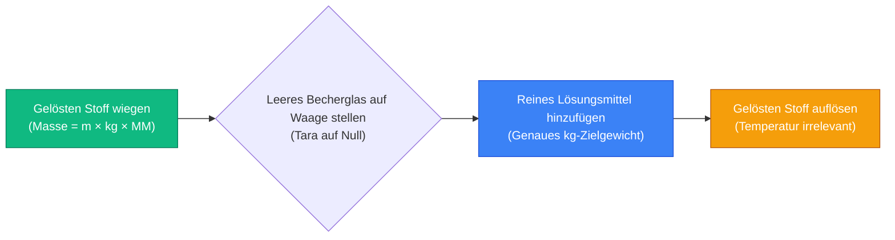
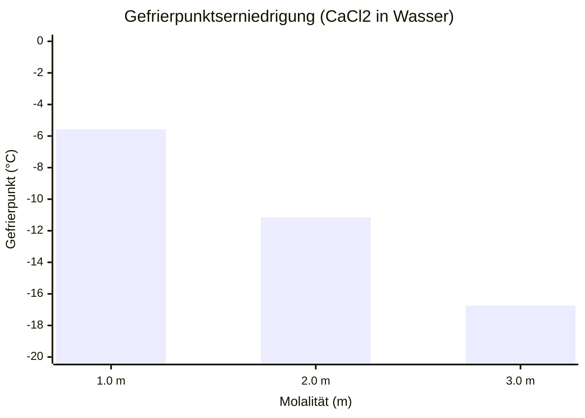
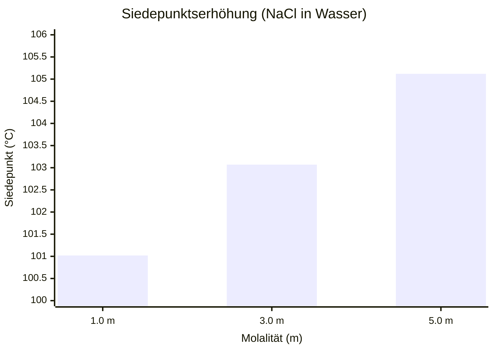
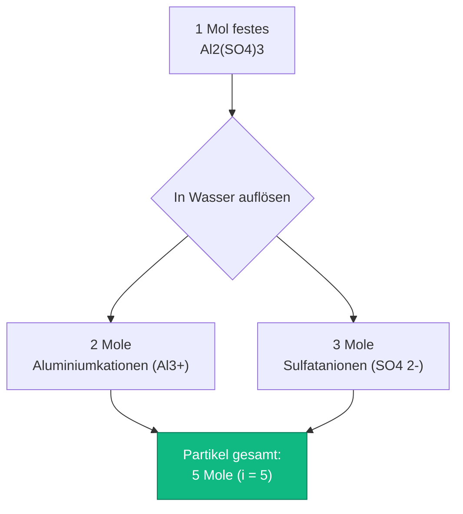
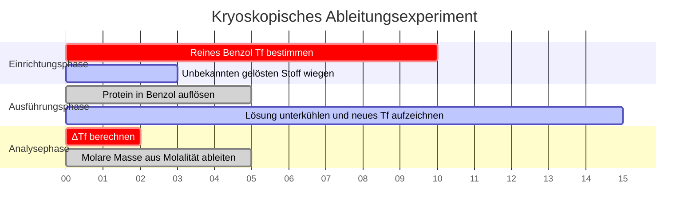

# Der ultimative Molalitätsrechner: Kolligative Eigenschaften und Thermodynamik

Willkommen beim ultimativen **Molalitätsrechner** und umfassenden Leitfaden zur physikalischen Chemie. Egal, ob Sie ein AP-Chemiestudent sind, der die Gefrierpunktserniedrigung analysiert, ein industrieller Chemieingenieur, der Frostschutzlösungen für Kraftfahrzeuge entwickelt, oder ein Kryobiologieforscher, der sich mit der Thermodynamik von Lösungsmitteln unter Null beschäftigt, die Beherrschung der Mathematik der Molalität ist eine absolute Notwendigkeit.

Während die Molarität ($M$) die allgemeine Lösungschemie dominiert, hat sie einen fatalen Fehler: Sie ist vollständig abhängig vom Volumen, das sich bei Temperaturschwankungen ausdehnt und zusammenzieht. Bei der Analyse von Siede- und Gefrierpunkten sind volumenbasierte Konzentrationen mathematisch nutzlos. Sie müssen sich stattdessen auf die **Molalität ($m$)** verlassen – das strikte, temperaturinvariante Verhältnis von Molen des gelösten Stoffs zur reinen Lösungsmittelmasse.

In dieser ausführlichen, über 4.000 Wörter umfassenden SEO-Meisterklasse werden wir die grundlegende Mathematik der Molalität vollständig dekonstruieren, die entscheidenden Unterschiede zwischen Molarität und Molalität aufzeigen, die thermodynamischen Gesetze der kolligativen Eigenschaften ($\Delta T_f$ und $\Delta T_b$) mathematisch beweisen und die physikalischen Mechanismen hinter dem Van't-Hoff-Faktor ($i$) entschlüsseln. Um ein absolutes Verständnis zu gewährleisten, haben wir fünf akribisch detaillierte, parser-sichere interaktive Mermaid.js-Diagramme beigefügt.

---

## 1. Die Thermodynamik der Molalität (m = n / kg)

Das absolut wichtigste Konzept in der physikalischen Chemie ist das Verständnis der strikten mathematischen Definition der **Molalität ($m$)**. 

Die Molalität ist eine technische Kennzahl, die die Konzentration einer chemischen Lösung quantifiziert, strikt ausgedrückt als die Anzahl der **Mole des gelösten Stoffs**, die pro **Kilogramm reines LÖSUNGSMITTEL** gelöst sind.
- Eine $1,0\text{ m}$ (ein molale) Lösung von Natriumchlorid ($\text{NaCl}$) enthält genau $1,0$ Mol $\text{NaCl}$-Moleküle, die in genau $1,0\text{ kg}$ reinem Wasser dispergiert sind.
- Im Gegensatz zur Molarität wird im Nenner NICHT das Gesamtvolumen der Lösung verwendet.

**Die Kerngleichung:**
$$\text{Molalität (m)} = \frac{\text{Mole des gelösten Stoffs (n)}}{\text{Lösungsmittelmasse (kg)}}$$

### Warum die Molalität temperaturunabhängig ist
Die physikalische Masse ($kg$) ist eine invariante Eigenschaft der Materie. Ein Kilogramm Wasser bei $4^\circ\text{C}$ enthält genau die gleiche Anzahl von Molekülen wie ein Kilogramm Wasser bei $95^\circ\text{C}$. Ein Liter Wasser bei $95^\circ\text{C}$ nimmt jedoch aufgrund der thermischen Ausdehnung deutlich mehr physischen Raum (Volumen) ein.

Da die Molarität ($M = n/V$) vom Volumen abhängt, verringert das Erhitzen einer Lösung ihre Molarität. Da die Molalität ($m = n/kg$) rein auf der Masse basiert, bleibt sie mathematisch perfekt und über alle thermodynamischen Zustände hinweg konstant, was sie zur einzigen gültigen Metrik für die Untersuchung von Siede- und Gefrierpunkten macht.

**Die Vorbereitungsformel für die Masse des gelösten Stoffs:**
Um eine physikalische Lösung in einem Becherglas herzustellen, müssen Sie die Molgleichung mit der Molalitätsgleichung kombinieren:
$$\text{Erforderliche Masse des gelösten Stoffs (g)} = \text{Zielmolalität (m)} \times \text{Lösungsmittelmasse (kg)} \times \text{Molare Masse (g/mol)}$$

**Beispielberechnung:**
Sie müssen eine $0,50\text{ m}$ Lösung von Calciumchlorid ($\text{CaCl}_2$, $\text{MM} = 110,98\text{ g/mol}$) unter Verwendung von $2,0\text{ kg}$ reinem Wasser herstellen.
$\text{Erforderliche Masse} = 0,50\text{ m} \times 2,0\text{ kg} \times 110,98\text{ g/mol} = \mathbf{110,98\text{ Gramm}}$.
Sie wiegen $110,98\text{ g}$ $\text{CaCl}_2$ ab und lösen es direkt in $2000\text{ g}$ Wasser.

---

## 2. Kolligative Eigenschaften: Gefrierpunktserniedrigung ($\Delta T_f$)

Kolligative Eigenschaften sind eine faszinierende Unterkategorie der physikalischen Chemie. Es handelt sich um Eigenschaften, die **ausschließlich von der Gesamtzahl der gelösten Partikel** in einer Lösung abhängen, wobei die chemische Identität oder Größe dieser Partikel völlig außer Acht gelassen wird.

Wenn Sie einen gelösten Stoff in einem reinen Lösungsmittel auflösen, stören die gelösten Partikel physikalisch die Fähigkeit der Lösungsmittelmoleküle, sich in einem festen Kristallgitter anzuordnen. Dies bedeutet, dass die Temperatur deutlich unter den normalen Gefrierpunkt fallen muss, um das Gefrieren der Lösung zu erzwingen. Dies ist der Grund, warum Kommunen bei winterlichen Schneestürmen Salz auf vereiste Straßen streuen.

**Die Gefrierpunktsgleichung:**
$$\Delta T_f = i \times K_f \times m$$

Wobei:
- $\Delta T_f$ = Der Temperaturabfall unter den normalen Gefrierpunkt.
- $i$ = Der Van't-Hoff-Faktor (Anzahl der dissoziierten Partikel).
- $K_f$ = Die kryoskopische Konstante des Lösungsmittels (Für Wasser ist $K_f = 1,86^\circ\text{C/m}$).
- $m$ = Die Molalität der Lösung.

---

## 3. Kolligative Eigenschaften: Siedepunktserhöhung ($\Delta T_b$)

Umgekehrt blockieren beim Kochen einer Lösung die gelösten Partikel physikalisch das Entweichen der Lösungsmittelmoleküle an der Flüssigkeitsoberfläche in die Gasphase, wodurch der Dampfdruck gesenkt wird (Raoultsches Gesetz). Um dies zu überwinden und ein Sieden zu erreichen, müssen Sie deutlich mehr thermische Energie (höhere Temperatur) aufbringen.

**Die Siedepunktsgleichung:**
$$\Delta T_b = i \times K_b \times m$$

Wobei:
- $\Delta T_b$ = Der Temperaturanstieg über den normalen Siedepunkt.
- $K_b$ = Die ebullioskopische Konstante des Lösungsmittels (Für Wasser ist $K_b = 0,512^\circ\text{C/m}$).

---

## 4. Entschlüsselung des Van't-Hoff-Faktors ($i$)

Der Van't-Hoff-Faktor ist der mathematische Multiplikator, der darstellt, wie eine chemische Verbindung auseinanderbricht, wenn sie einem Lösungsmittel ausgesetzt wird. Da kolligative Eigenschaften sich nur um die *Anzahl* der Partikel kümmern, hat $1,0\text{ Mol}$ gelöstes Salz eine radikal andere thermodynamische Auswirkung als $1,0\text{ Mol}$ gelöster Zucker.

**Nichtelektrolyte (Zucker, organische Stoffe):**
Verbindungen wie Glukose ($\text{C}_6\text{H}_{12}\text{O}_6$) oder Ethanol zerfallen in Wasser nicht. Ein Mol festem Glukose ergibt ein Mol gelöstem Glukose.
- **Glukose $i = 1$**

**Elektrolyte (Salze, Säuren):**
Ionische Verbindungen zerfallen in ihre konstituierenden Ionen.
- $\text{NaCl} \rightarrow \text{Na}^+ + \text{Cl}^-$ (Ergibt 2 Partikel). **$i = 2$**
- $\text{CaCl}_2 \rightarrow \text{Ca}^{2+} + 2\text{Cl}^-$ (Ergibt 3 Partikel). **$i = 3$**
- $\text{Al}_2(\text{SO}_4)_3 \rightarrow 2\text{Al}^{3+} + 3\text{SO}_4^{2-}$ (Ergibt 5 Partikel). **$i = 5$**

Das bedeutet, dass eine $1,0\text{ m}$ Lösung von $\text{Al}_2(\text{SO}_4)_3$ den Gefrierpunkt von Wasser **fünfmal effektiver** senkt als eine $1,0\text{ m}$ Zuckerlösung!

---

## 5. Fünf konzeptionelle Engineering-Szenarien mit 2D-Visualisierungen

Um die physikalischen Beziehungen, die die kolligative Thermodynamik bestimmen, vollständig zu beherrschen, werden wir fünf verschiedene Laborszenarien untersuchen, die mithilfe benutzerdefinierter Mermaid.js-Diagramme visuell aufgeschlüsselt sind.

### Beispiel 1: Die molale Präparationspipeline

**Das Szenario:**
Ein Labortechniker muss physikalisch eine Lösung mit spezifischer Molalität herstellen. Beachten Sie, wie Messkolben hier völlig irrelevant sind, da die Molalität vollständig von der Masse abhängt.

**2D-Visualisierung:**
Dieses Logikflussdiagramm bildet die strikte chronologische Abfolge ab, die erforderlich ist, um eine molale Lösung korrekt unter Verwendung nur einer analytischen Massenwaage herzustellen.

---

### Beispiel 2: Die Gefrierpunktserniedrigungskurve

**Das Szenario:**
Ein Stadtingenieur bewertet Streusalze, um eine Vereisung bei $-15^\circ\text{C}$ zu verhindern. Er modelliert, wie die Erhöhung der Molalität von $\text{CaCl}_2$ ($i=3$) den Gefrierpunkt von Wasser linear nach unten treibt.

**Die Mathematik:**
$\Delta T_f = 3 \times 1,86 \times m = 5,58 \times m$. Für jeden Anstieg um $1,0\text{ m}$ sinkt der Gefrierpunkt um $5,58^\circ\text{C}$.

**2D-Visualisierung:**
Dieses Diagramm zeigt die direkte lineare Korrelation zwischen der molalen Konzentration von Calciumchlorid und dem resultierenden Gefrierpunkt unter Null auf.

---

### Beispiel 3: Der Effekt der Siedepunktserhöhung

**Das Szenario:**
Ein Koch gibt große Mengen Salz ($\text{NaCl}$, $i=2$) in Nudelwasser, um das Wasser heißer kochen zu lassen und die Nudeln schneller zu garen.

**Die Mathematik:**
$\Delta T_b = 2 \times 0,512 \times m = 1,024 \times m$. Selbst bei extrem hohen Konzentrationen ist der Effekt der Siedepunktserhöhung in Wasser physikalisch sehr gering.

**2D-Visualisierung:**
Dieses Diagramm beweist grafisch, dass Sie absurde Mengen Salz benötigen würden, um den Siedepunkt von Wasser um auch nur ein paar Grad zu erhöhen.

---

### Beispiel 4: Die Architektur der Van't-Hoff-Dissoziation

**Das Szenario:**
Ein Chemiestudent im ersten Semester hat Schwierigkeiten zu verstehen, warum $1,0\text{ m}$ Aluminiumsulfat eine so radikale thermodynamische Auswirkung im Vergleich zu Zucker hat.

**2D-Visualisierung:**
Dieses Top-Down-Flussdiagramm bildet die ionische Dissoziationskaskade ab und beweist, wie eine einzelne kristalline Einheit in fünf unterschiedliche thermodynamische Partikel zerfällt.

---

### Beispiel 5: Kryoskopische Laborzeitachse

**Das Szenario:**
Ein Kryobiologieforscher führt ein Präzisionsexperiment durch, um die unbekannte molare Masse eines neu synthetisierten Proteins abzuleiten, indem er die Gefrierpunktserniedrigung in Benzol beobachtet.

**2D-Visualisierung:**
Dieses Gantt-Diagramm visualisiert die chronologische Abfolge eines physikalischen Chemieexperiments, von der Lösungsmittelkalibrierung bis zur abschließenden thermodynamischen mathematischen Ableitung.

---

## 7. Fazit und Thermodynamik-Herausforderung

Die Beherrschung der Molalität ist das grundlegende Fundament der gesamten thermodynamischen und kolligativen Chemie. Das Verständnis des Unterschieds zwischen volumenabhängiger Molarität und massenabhängiger Molalität, die Berücksichtigung des physikalischen Zerbrechens von Elektrolyten über den Van't-Hoff-Faktor und die mathematische Modellierung thermischer Schwankungen garantieren, dass Ihre Laborexperimente präzise, reproduzierbare Ergebnisse liefern.

Wenn Sie diese mathematischen Prinzipien ignorieren, schlagen Ihre Präzisionskalibrierungen fehl, wenn die Labortemperatur schwankt, Ihre Automotoren bekommen im Winter Risse in gefrorenen Blöcken, und Ihre biologischen Zellkulturen sterben an osmotischem Schock.

Um zu garantieren, dass Sie diese kritischen Konzepte gemeistert haben, starten Sie unseren interaktiven Simulator und versuchen Sie, diese letzten physikalisch-chemischen Herausforderungen zu lösen:
1. **Die Massenherausforderung:** Sie müssen eine $0,75\text{ m}$ Lösung von Kaliumnitrat ($\text{KNO}_3$, $\text{MM} = 101,1\text{ g/mol}$) unter Verwendung von genau $500\text{ g}$ Wasser herstellen. Genau wie viele Gramm $\text{KNO}_3$ müssen Sie auf der analytischen Waage abwiegen?
2. **Die Winterherausforderung:** Sie schütten $2000\text{ g}$ $\text{MgCl}_2$ ($i=3$, $\text{MM} = 95,21\text{ g/mol}$) in $10,0\text{ kg}$ Wasser. Wie hoch ist der neue, genaue Gefrierpunkt der Mischung? (Wasser $K_f = 1,86$).
3. **Die Molmassenherausforderung:** Sie lösen $50,0\text{ g}$ eines unbekannten Nichtelektrolyten ($i=1$) in $1,0\text{ kg}$ Wasser auf. Der Siedepunkt steigt um $0,256^\circ\text{C}$. Was ist die genaue molare Masse des unbekannten gelösten Stoffs? (Wasser $K_b = 0,512$).

Verlassen Sie sich auf diesen Rechner, um Ihre Hausaufgaben zur Thermodynamik zu überprüfen, Ihre Laborprotokolle für Gefrierpunkte im Voraus zu berechnen und die Mathematik der physikalischen Chemie dauerhaft zu meistern.

