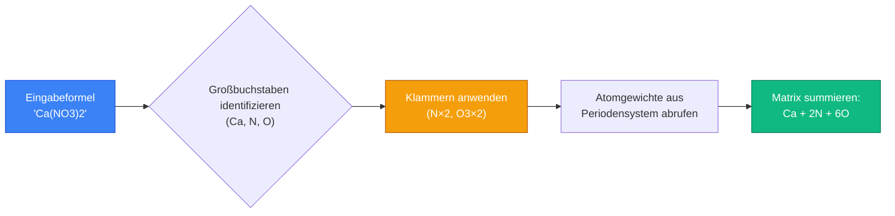
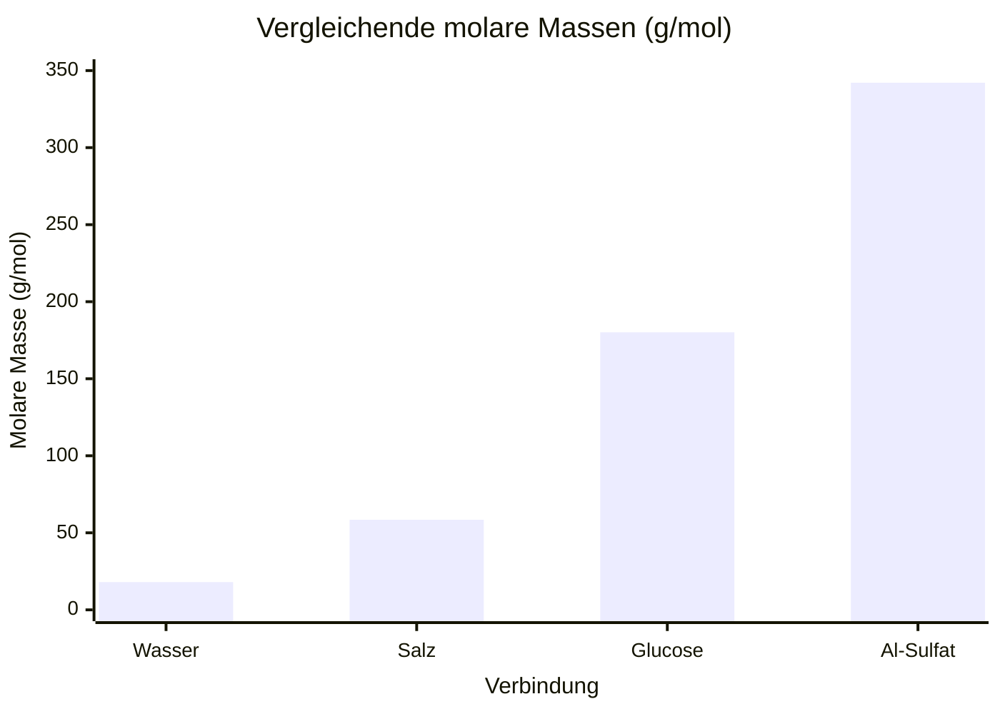
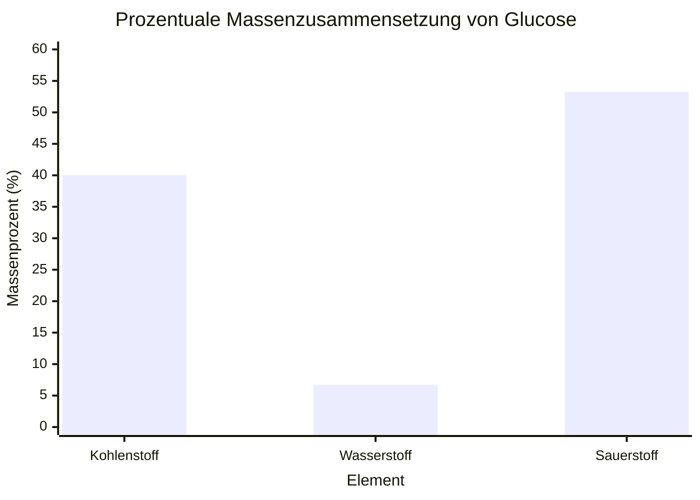
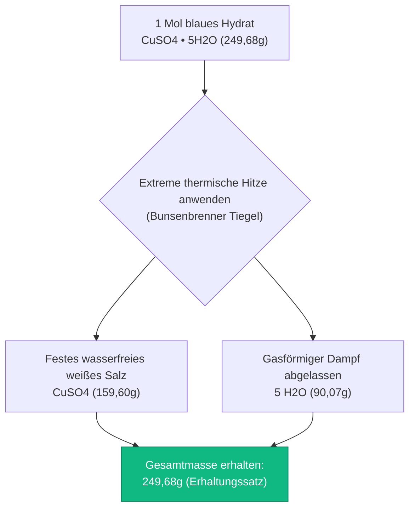
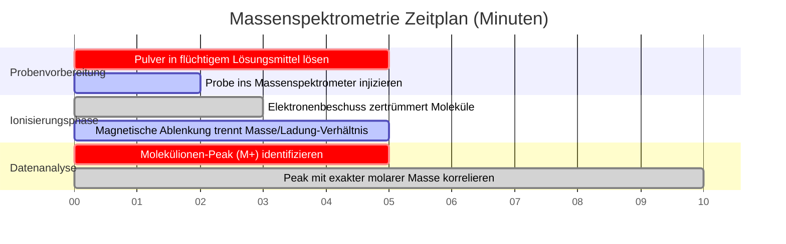

# Der ultimative Rechner für molare Masse: Formeln, prozentuale Zusammensetzung und Hydrate

Willkommen zum ultimativen **Rechner für molare Masse** und umfassenden Leitfaden für chemische Formeln. Egal, ob Sie ein Chemiestudent an der High School sind, der lernt, seine erste Stöchiometrie-Gleichung auszugleichen, ein analytischer Chemiker, der ein Massenspektrometer für die Proteinanalyse konfiguriert, oder ein Materialwissenschaftler, der den genauen Hydratationsprozentsatz von industriellem Zement berechnet, die Beherrschung der Mathematik der molaren Masse ist die unverzichtbare Grundlage der quantitativen Chemie.

Chemische Formeln wie $\text{C}_6\text{H}_{12}\text{O}_6$ (Glucose) oder $\text{CuSO}_4\cdot 5\text{H}_2\text{O}$ (Kupfersulfat-Pentahydrat) könnten für einen Anfänger wie eine verwirrende alphanumerische Buchstabensuppe aussehen. Es handelt sich jedoch um stark strukturierte mathematische Baupläne. Indem wir diese Formeln dekonstruieren und die Atomzahlen mit Standardatomgewichten aus dem Periodensystem multiplizieren, können wir die mikroskopische Welt der atomaren Teilchen mit der makroskopischen Welt der Laborgramm verbinden.

In dieser ausführlichen, über 4.000 Wörter umfassenden SEO-Meisterklasse werden wir die mathematischen Algorithmen zur Berechnung der molaren Masse vollständig zerlegen, die entscheidenden Unterschiede zwischen molekularen und empirischen Formeln untersuchen, die prozentuale Zusammensetzung komplexer organischer Verbindungen mathematisch beweisen und die Thermodynamik von Kristallhydraten entschlüsseln. Um ein absolutes Verständnis zu gewährleisten, haben wir fünf akribisch detaillierte, parser-sichere interaktive Mermaid.js-Diagramme beigefügt.

---

## 1. Die Mathematik der molaren Masse ($\text{g/mol}$)

Die **molare Masse ($M$)** einer chemischen Substanz ist exakt definiert als die physikalische Masse (gemessen in Gramm) von genau $1,0\text{ Mol}$ ($6,022 \times 10^{23}$ Teilchen) dieser Substanz. 
Durch die Verwendung der Standardatomgewichte aus dem Periodensystem (die auf den Kohlenstoff-12-Isotopenstandard skaliert sind) können wir die exakte molare Masse jeder theoretischen Verbindung im Universum ableiten.

**Der grundlegende Summierungsalgorithmus:**
$$M = \sum (\text{Atomzahl des Elements} \times \text{Standardatomgewicht})$$

### Die molare Masse von Wasser ($\text{H}_2\text{O}$)
Um die molare Masse von Wasser zu berechnen, parsen wir die Formel $\text{H}_2\text{O}$:
- Die tiefgestellte "2" bedeutet, dass es zwei Wasserstoffatome ($\text{H}$) gibt.
- Das Fehlen einer tiefgestellten Zahl nach Sauerstoff ($\text{O}$) bedeutet mathematisch "1".
- Schlagen Sie Wasserstoff im Periodensystem nach: $1,008\text{ g/mol}$.
- Schlagen Sie Sauerstoff im Periodensystem nach: $15,999\text{ g/mol}$.

**Die Berechnung:**
- Wasserstoff: $2 \times 1,008 = 2,016\text{ g/mol}$
- Sauerstoff: $1 \times 15,999 = 15,999\text{ g/mol}$
- **Gesamte molare Masse ($\text{H}_2\text{O}$): $18,015\text{ g/mol}$**

Wenn Sie genau $18,015\text{ Gramm}$ reines flüssiges Wasser auf einer analytischen Waage abwiegen, besitzen Sie genau $1,0\text{ Mol}$ Wassermoleküle.

---

## 2. Erweitertes Formel-Parsing: Klammern und eckige Klammern

Chemische Formeln für mehratomige Ionen verwenden oft Klammern. Ein Index unmittelbar außerhalb einer Klammer multipliziert mathematisch jedes einzelne Atom, das *innerhalb* der Klammer enthalten ist.

### Die molare Masse von Aluminiumsulfat [$\text{Al}_2(\text{SO}_4)_3$]
Dies ist eine klassische chemische Verbindung, die bei Chemiestudenten immense Frustration auslöst. Lassen Sie uns den mathematischen Bauplan dekonstruieren:
1. **$\text{Al}_2$:** $2\text{ Aluminiumatome}$.
2. **$(\text{SO}_4)_3$:** Die "3" außerhalb multipliziert das $\text{S}$ mit 3 und das $\text{O}_4$ mit 3 ($4 \times 3 = 12$). Wir haben also $3\text{ Schwefelatome}$ und $12\text{ Sauerstoffatome}$.

**Die Berechnung:**
- Aluminium: $2 \times 26,982 = 53,964\text{ g/mol}$
- Schwefel: $3 \times 32,06 = 96,180\text{ g/mol}$
- Sauerstoff: $12 \times 15,999 = 191,988\text{ g/mol}$
- **Gesamte molare Masse ($\text{Al}_2(\text{SO}_4)_3$): $342,132\text{ g/mol}$**

---

## 3. Hydrate und Kristallwasser ($\cdot x\text{H}_2\text{O}$)

Viele ionische Salze absorbieren auf natürliche Weise Wassermoleküle aus der umgebenden Luftfeuchtigkeit in der Atmosphäre und schließen diese Wassermoleküle fest in ihr 3D-Kristallgitter ein. Diese werden als **Hydrate** bezeichnet. Das Wasser ist KEIN physikalisch nasses, flüssiges Wasser; es ist chemisch gebundenes, festes Strukturwasser.

Die chemische Formel für ein Hydrat verwendet einen zentrierten Punkt "$\cdot$", gefolgt von einer ganzen Zahl $x$, die die Anzahl der gebundenen Wassermoleküle pro Formeleinheit des Salzes darstellt. Bei der Berechnung der molaren Masse müssen Sie die Masse des Wassers zur Masse des wasserfreien Salzes ADDIEREN.

### Kupfer(II)-sulfat-Pentahydrat ($\text{CuSO}_4\cdot 5\text{H}_2\text{O}$)
- Das Präfix "Penta" bedeutet, dass genau $5\text{ Wassermoleküle}$ eingeschlossen sind.
- Berechnen Sie zuerst das wasserfreie Salz $\text{CuSO}_4$:
  - $\text{Cu}$ ($63,546$) + $\text{S}$ ($32,06$) + $4\times \text{O}$ ($63,996$) = $159,602\text{ g/mol}$.
- Zweitens, berechnen Sie die $5\text{ Wassermoleküle}$:
  - $5 \times \text{H}_2\text{O}$ ($18,015$) = $90,075\text{ g/mol}$.
- **Gesamte hydratisierte molare Masse: $159,602 + 90,075 = 249,677\text{ g/mol}$.**

Wenn Sie ein Hydrat in einem Tiegel über einem Bunsenbrenner erhitzen, zerstört die thermische Energie die Bindungen, die das Kristallwasser halten. Das Wasser kocht als Dampf ab und das blaue kristalline Hydrat zerfällt in eine weiße, pulverförmige wasserfreie Masse.

---

## 4. Prozentuale Zusammensetzung nach Masse

Sobald Sie die gesamte molare Masse einer Verbindung berechnet haben, ist die Bestimmung der **prozentualen Massenzusammensetzung** eine einfache Angelegenheit der Division. Dies ist in der industriellen Gewinnung und Metallurgie äußerst wichtig (z. B. um zu bestimmen, wie viel Prozent eines Eisenerzes tatsächlich aus reinem Eisen bestehen).

**Die Gleichung:**
$$\text{\% Element} = \left( \frac{\text{Gesamtmasse des Elements in 1 Mol}}{\text{Gesamte molare Masse der Verbindung}} \right) \times 100\%$$

**Beispiel: Prozentuale Zusammensetzung von Glucose ($\text{C}_6\text{H}_{12}\text{O}_6$)**
- **Gesamte molare Masse:** $180,156\text{ g/mol}$
- **% Kohlenstoff ($C$):** $(72,066 / 180,156) \times 100\% = \mathbf{40,00\%}$
- **% Wasserstoff ($H$):** $(12,096 / 180,156) \times 100\% = \mathbf{6,71\%}$
- **% Sauerstoff ($O$):** $(95,994 / 180,156) \times 100\% = \mathbf{53,28\%}$

Da sich die Prozentsätze zu $100\%$ summieren müssen, wissen wir, dass die Mathematik einwandfrei ist: $40,00 + 6,71 + 53,28 = 99,99\%$ (wobei $0,01\%$ durch Standardrundung verloren gehen).

---

## 5. Fünf konzeptionelle Engineering-Szenarien mit 2D-Visualisierungen

Um die Algorithmen, die das Formel-Parsing, die Elementsummierung und die Massenzusammensetzung steuern, vollständig zu beherrschen, werden wir fünf verschiedene Szenarien der analytischen Chemie untersuchen, die visuell mithilfe benutzerdefinierter Mermaid.js-Diagramme aufgeschlüsselt werden.

### Beispiel 1: Der algorithmische Formel-Parser

**Das Szenario:**
Ein Informatikstudent versucht zu verstehen, wie unser interner Rechner-Algorithmus einen komplexen String wie `Ca(NO3)2` in eine mathematische Matrix parst.

**2D-Visualisierung:**
Dieses Logik-Flussdiagramm bildet den streng schrittweisen Tokenisierungsprozess ab, der atomare Symbole extrahiert, Multiplikatoren anwendet und die Endgewichte summiert.

---

### Beispiel 2: Vergleichende Dichte der molaren Masse

**Das Szenario:**
Ein Labortechniker vergleicht visuell die relative "Schwere" (molare Massen) von vier völlig unterschiedlichen chemischen Substanzen.

**2D-Visualisierung:**
Dieses Diagramm beweist grafisch, wie schnell die molare Masse ansteigt, wenn schwere Übergangsmetalle (wie Kupfer) oder komplexe mehratomige Ionen (wie Sulfat) in eine chemische Formel eingeführt werden.

---

### Beispiel 3: Prozentuale Massenzusammensetzung (Glucose)

**Das Szenario:**
Ein Ernährungsberater bewertet die genaue Massenaufschlüsselung von Makronährstoffzuckern. Er visualisiert die prozentuale Zusammensetzung von Glucose ($\text{C}_6\text{H}_{12}\text{O}_6$).

**2D-Visualisierung:**
Dieses Diagramm stellt den genauen Massenbeitrag jedes Bestandteils dar. Beachten Sie, wie Wasserstoff trotz $12\text{ Atomen}$ (der höchsten Anzahl) den geringsten Massenanteil liefert, da sein Atomgewicht nur $1,008$ beträgt.

---

### Beispiel 4: Architektur der thermischen Hydratzersetzung

**Das Szenario:**
Ein Student der analytischen Chemie führt ein klassisches Laborexperiment durch: Das Erhitzen von blauem Kupfer(II)-sulfat-Pentahydrat, um das Kristallwasser auszutreiben.

**2D-Visualisierung:**
Dieses Top-Down-Flussdiagramm bildet die thermodynamische Zerstörung des Hydratgitters ab und beweist, dass sich die chemische Masse in eine feste wasserfreie Phase und eine gasförmige Wasserdampfphase aufspaltet.

---

### Beispiel 5: Zeitplan des Massenspektrometrielabors

**Das Szenario:**
Ein forensischer analytischer Chemiker nutzt ein Massenspektrometer, um die exakte molare Masse eines unbekannten kristallinen Pulvers experimentell zu verifizieren, das an einem Tatort gefunden wurde.

**2D-Visualisierung:**
Dieses Gantt-Diagramm visualisiert die chronologische Reihenfolge eines analytischen Massenspektrometrie-Laufs, von der Probenionisierung bis zur rechnerischen Ableitung der molaren Masse.

---

## 6. Schlussfolgerung und Stöchiometrie-Herausforderung

Die Beherrschung der Berechnung der molaren Masse ist der unvermeidliche Eintrittspreis für das Studium der Chemie. Zu verstehen, wie man chemische Formeln algorithmisch parst, Klammern als mathematische Multiplikatoren anwendet, die elementare prozentuale Zusammensetzung berechnet und die thermische Hydratzersetzung entschlüsselt, garantiert, dass Ihre Laborausbeuten genau sind.

Wenn Sie diese algorithmischen Regeln ignorieren, werden Sie Reagenzmassen falsch berechnen, Lösungen versehentlich mit falschen Konzentrationen vergiften und es versäumen, zwischen Kohlenmonoxid ($\text{CO}$) und dem Element Kobalt ($\text{Co}$) zu unterscheiden.

Um zu garantieren, dass Sie diese kritischen Konzepte beherrscht haben, starten Sie unseren interaktiven Simulator und versuchen Sie, diese finalen Herausforderungen der analytischen Chemie zu lösen:
1. **Die Klammer-Herausforderung:** Berechnen Sie die exakte molare Masse von Ammoniumphosphat [$(\text{NH}_4)_3\text{PO}_4$]. Denken Sie daran, den inneren Stickstoff und Wasserstoff mit der äußeren tiefgestellten $3$ zu multiplizieren.
2. **Die Hydrat-Herausforderung:** Sie haben eine $100,0\text{g}$ Probe von Magnesiumsulfat-Heptahydrat ($\text{MgSO}_4\cdot 7\text{H}_2\text{O}$). Sie erhitzen sie, bis das gesamte Wasser abkocht. Wie groß ist die genaue Masse des weißen wasserfreien Pulvers, das im Tiegel verbleibt?
3. **Die Zusammensetzungs-Herausforderung:** Welche Verbindung enthält einen höheren Prozentsatz an reinem Stickstoff nach Masse: Ammoniak ($\text{NH}_3$) oder Ammoniumnitrat ($\text{NH}_4\text{NO}_3$)? Sie müssen beide berechnen, um es herauszufinden!

Verlassen Sie sich auf diesen Rechner, um Ihre Formel-Parsing-Algorithmen zu überprüfen, präzise IUPAC-Atomgewichte sofort nachzuschlagen und die Mathematik der analytischen Stöchiometrie dauerhaft zu beherrschen.
