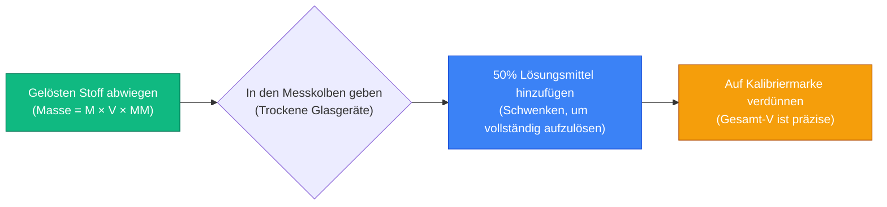
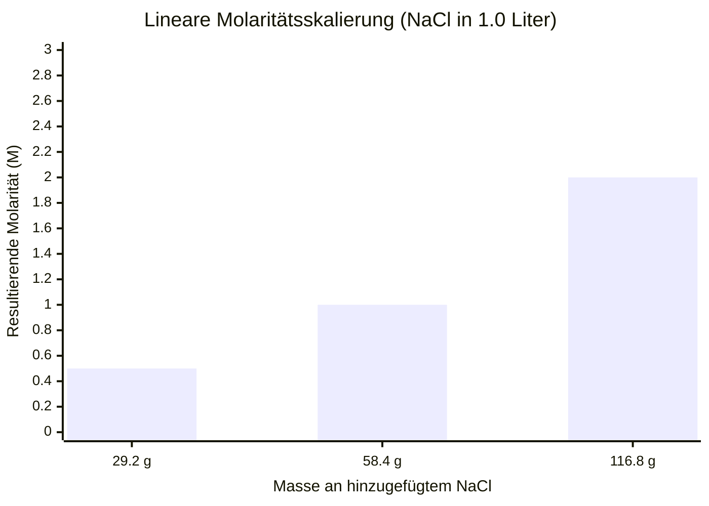
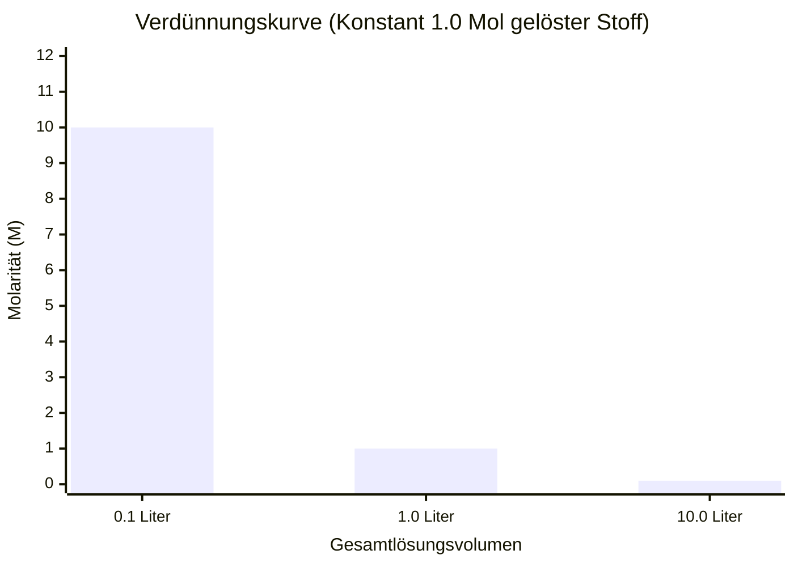
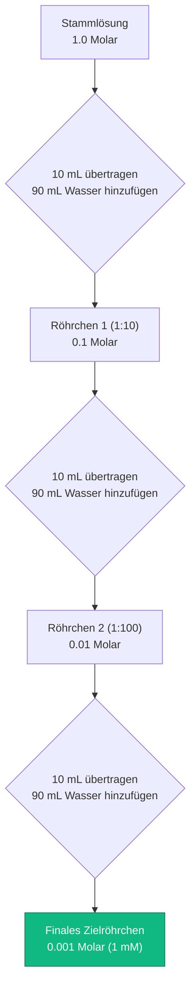
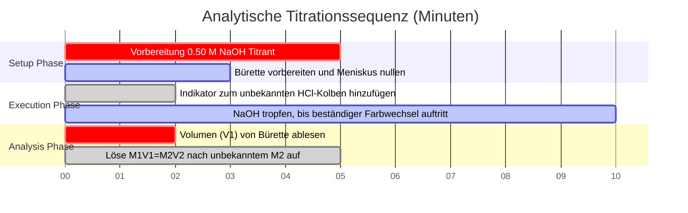

# Der definitive Molaritätsrechner: Mol, Masse und Verdünnungsstöchiometrie

Willkommen beim ultimativen **Molaritätsrechner** und umfassenden Leitfaden zur Entwicklung chemischer Lösungen. Egal, ob Sie ein AP-Chemiestudent sind, der mit Stöchiometrie-Hausaufgaben zu kämpfen hat, ein Medizinstudent in der Pharmakologie, der IV-Tropfkonzentrationen berechnet, oder ein Industriechemiker, der einen 10.000-Liter-Ansatz Schwefelsäure hochskaliert – die Beherrschung der Mathematik der Molarität ist absolut unverhandelbar.

Chemie ist die Wissenschaft der Reaktionen, und die überwiegende Mehrheit der chemischen Reaktionen findet in flüssigen Lösungen statt. Wenn Sie die erforderliche Masse Ihres gelösten Stoffes falsch berechnen, wird Ihr Experiment fehlschlagen. Wenn Sie die grundlegende Verdünnungsgleichung $M_1 V_1 = M_2 V_2$ missverstehen, könnten Sie im klinischen Umfeld versehentlich eine tödliche Überdosis eines Medikaments verabreichen. Wenn Sie den physikalischen Unterschied zwischen Molarität (temperaturabhängig) und Molalität (temperaturunabhängig) nicht verstehen, sind Ihre analytischen Präzisionskalibrierungen von vornherein fehlerhaft.

In dieser ausführlichen SEO-Meisterklasse mit über 4.000 Wörtern werden wir die grundlegende Mathematik der Lösungskonzentration vollständig dekonstruieren, die verborgenen Komplexitäten der Messkolbenvorbereitung aufdecken, die Massenerhaltung der Verdünnung mathematisch beweisen und die genauen stöchiometrischen Formeln entschlüsseln, die zur Herstellung komplexer chemischer Gemische von Grund auf erforderlich sind. Um ein absolutes Verständnis zu gewährleisten, haben wir fünf akribisch detaillierte, Parser-sichere interaktive Mermaid.js-Diagramme beigefügt.

---

## 1. Die fundamentale Physik der Molarität (M = n / V)

Das absolut wichtigste Konzept in der Lösungschemie ist das Verständnis der strengen mathematischen Definition der **Molarität ($M$)**. 

Die Molarität ist eine technische Metrik, die die Konzentration einer chemischen Lösung quantifiziert und streng als die Anzahl der **Mole des gelösten Stoffes** ausgedrückt wird, die pro **Liter der Gesamtlösung** gelöst sind.
- Eine $1,0\text{ M}$ (ein molare) Lösung von Natriumchlorid ($\text{NaCl}$) enthält genau $1,0$ Mol $\text{NaCl}$-Moleküle, die in $1,0$ Liter des gesamten physikalischen Volumens dispergiert sind.
- Es bedeutet NICHT, dass $1,0$ Mol des gelösten Stoffes zu $1,0$ Liter reinem Wasser hinzugefügt wird (das ist ein häufiger, katastrophaler Fehler, den wir später besprechen werden).

**Die Kerngleichung:**
$$\text{Molarität (M)} = \frac{\text{Mole des gelösten Stoffes (n)}}{\text{Lösungsvolumen (Liter)}}$$

### Das Konzept des Mols ($n$)
Bevor Sie die Molarität berechnen können, müssen Sie verstehen, was ein "Mol" ist. Man kann einzelne Atome nicht mit einer Pinzette zählen; sie sind zu klein. Stattdessen verwenden Chemiker die **Avogadro-Konstante** ($6,022 \times 10^{23}$). 
Ein Mol JEDER Substanz enthält genau $6,022 \times 10^{23}$ Teilchen.
Da Atome jedoch unterschiedliche physikalische Gewichte haben, wiegt ein Mol Kohlenstoff $12,011$ Gramm, während ein Mol Blei massive $207,2$ Gramm wiegt. Dies wird als **Molmasse ($\text{MM}$)** bezeichnet.

**Die Mol-Gleichung:**
$$\text{Mole des gelösten Stoffes (n)} = \frac{\text{Physikalische Masse (Gramm)}}{\text{Molmasse (g/mol)}}$$

### Masse aus Molarität berechnen
In der realen Welt messen Laborwaagen die Masse in Gramm, nicht in Mol. Um eine physikalische Lösung in einem Becherglas herzustellen, müssen Sie die beiden obigen Gleichungen zur universellen Lösungsvorbereitungsformel kombinieren:

**Die Formel zur Lösungsvorbereitung:**
$$\text{Erforderliche Masse (Gramm)} = \text{Zielmolarität (M)} \times \text{Volumen (L)} \times \text{Molmasse (g/mol)}$$

**Beispielrechnung:**
Sie müssen $500\text{ mL}$ ($0,500\text{ L}$) einer $0,200\text{ M}$ Glukoselösung ($\text{C}_6\text{H}_{12}\text{O}_6$) herstellen. Die Molmasse von Glukose beträgt $180,156\text{ g/mol}$.
$\text{Erforderliche Masse} = 0,200\text{ M} \times 0,500\text{ L} \times 180,156\text{ g/mol} = \mathbf{18,015\text{ Gramm}}$.
Sie wiegen $18,015\text{ g}$ Glukosepulver ab.

---

## 2. Die Einschränkung des Messkolbens (Ein kritischer Fehler)

Der mit Abstand häufigste Fehler von Chemiestudenten im ersten Semester besteht darin, den gelösten Stoff zum Endvolumen des Lösungsmittels hinzuzufügen.

Wenn Sie $18,015\text{ g}$ Glukose nehmen und in genau $500\text{ mL}$ reines Wasser schütten, ist Ihr endgültiges Lösungsvolumen **größer als** $500\text{ mL}$, da die physikalische Masse der festen Glukose physischen Raum einnimmt und das Wasser verdrängt. Ihre resultierende Molarität wird fälschlicherweise zu niedrig sein.

**Das korrekte volumetrische Protokoll:**
1. Wiegen Sie die $18,015\text{ g}$ Glukose ab.
2. Geben Sie diese in einen trockenen $500\text{ mL}$ **Messkolben**.
3. Fügen Sie nur $300\text{ mL}$ Wasser hinzu, um den Feststoff vollständig aufzulösen.
4. Sobald er vollständig gelöst ist, fügen Sie langsam Tropfen für Tropfen Wasser hinzu, bis der Boden des flüssigen Meniskus genau die $500\text{ mL}$-Kalibrierungslinie am Kolbenhals berührt.

Dieses Protokoll garantiert, dass das **gesamte Endvolumen** der Mischung (gelöster Stoff + Lösungsmittel) exakt $500\text{ mL}$ beträgt, was eine mathematisch perfekte Konzentration von $0,200\text{ M}$ gewährleistet.

---

## 3. Die Verdünnungsgleichung ($M_1V_1 = M_2V_2$)

In professionellen Labors stellen Wissenschaftler schwache Lösungen nicht von Grund auf neu her. Stattdessen bereiten sie riesige Bottiche mit hochkonzentrierten **Stammlösungen** (z. B. $10,0\text{ M}$ Salzsäure) vor. Wenn sie für ein Experiment eine schwächere Konzentration (z. B. $1,0\text{ M}$) benötigen, entnehmen sie ein kleines Volumen der Stammlösung und verdünnen es mit reinem Wasser.

Wenn Sie eine Lösung verdünnen, indem Sie Wasser hinzufügen, **steigt das Gesamtvolumen**, die **Molarität sinkt**, aber die **Gesamtzahl der gelösten Teilchen (Mol) bleibt völlig unverändert**.

Da $\text{Mol} = \text{Molarität} \times \text{Volumen}$ und die Mole vor und nach der Verdünnung konstant bleiben, leiten wir das universelle Verdünnungsgesetz ab:

**Die Verdünnungsformel:**
$$M_1 \times V_1 = M_2 \times V_2$$

Wobei:
- $M_1$ = Anfangskonzentration der Stammlösung
- $V_1$ = Anfängliches Volumen, das aus der Stammlösung entnommen wurde (Die Unbekannte, nach der wir normalerweise auflösen)
- $M_2$ = Endgültige Zielkonzentration der verdünnten Lösung
- $V_2$ = Endgültiges Zielvolumen der verdünnten Lösung

**Beispielrechnung:**
Sie benötigen $2,0\text{ Liter}$ ($V_2$) einer $0,50\text{ M}$ ($M_2$) $\text{HCl}$ für ein Experiment. Sie haben einen Kanister mit $12,0\text{ M}$ ($M_1$) Stamm-$\text{HCl}$. Wie viel Stammlösung entnehmen Sie?
$$12,0\text{ M} \times V_1 = 0,50\text{ M} \times 2,0\text{ L}$$
$$V_1 = \frac{0,50 \times 2,0}{12,0} = \mathbf{0,0833\text{ Liter (83,3 mL)}}$$

**Berechnung des hinzugefügten Wassers:**
Sie entnehmen $83,3\text{ mL}$ der hochgefährlichen $12,0\text{ M}$ Säure. Wie viel reines Wasser müssen Sie hinzufügen, um das endgültige Volumen von $2,0\text{ Litern}$ ($2000\text{ mL}$) zu erreichen?
$$\text{Hinzugefügtes Wasser} = V_2 - V_1 = 2000\text{ mL} - 83,3\text{ mL} = \mathbf{1916,7\text{ mL}}$$

---

## 4. Fünf konzeptionelle Engineering-Szenarien mit 2D-Visualisierungen

Um die physikalischen Zusammenhänge von chemischen Lösungen vollständig zu meistern, werden wir fünf verschiedene Laborszenarien untersuchen, die mithilfe von benutzerdefinierten Mermaid.js-Diagrammen visuell aufgeschlüsselt sind.

### Beispiel 1: Die Pipeline zur Lösungsvorbereitung

**Das Szenario:**
Ein Labortechniker muss eine Lösung mit einer bestimmten Molarität physikalisch aus einem trockenen chemischen Pulver herstellen.

**2D-Visualisierung:**
Dieses Logik-Flussdiagramm bildet die strikte chronologische Abfolge ab, die für die korrekte Verwendung eines Messkolbens erforderlich ist, und verhindert so den zuvor diskutierten Volumenverdrängungsfehler.

---

### Beispiel 2: Masse vs. Molarität Skalierung

**Das Szenario:**
Ein Student bereitet $1,0\text{ Liter}$ $\text{NaCl}$-Lösung vor und möchte verstehen, wie die Molarität linear ansteigt, wenn er dem Becherglas mehr physikalische Masse an Salz hinzufügt.

**Die Mathematik:**
Da die Molmasse ($\text{MM}$) und das Volumen ($V$) konstant gehalten werden, ist die Molarität ($M$) direkt proportional zur Masse.

**2D-Visualisierung:**
Dieses Diagramm stellt die direkte lineare Korrelation zwischen den Grammzahlen an $\text{NaCl}$, die zu $1,0\text{ L}$ Wasser hinzugefügt wurden, und der resultierenden Lösungsmolarität dar.

---

### Beispiel 3: Die Verdünnungsvolumenkurve

**Das Szenario:**
Ein Chemiker nimmt $0,1\text{ Liter}$ einer $10,0\text{ M}$ Stammlösung und beginnt, Wasser hinzuzufügen. Er möchte verfolgen, wie die molare Konzentration exponentiell abfällt, wenn das Gesamtvolumen zunimmt.

**Die Mathematik:**
Da die Mole des gelösten Stoffes auf genau $1,0\text{ Mol}$ ($10,0\text{ M} \times 0,1\text{ L}$) festgelegt sind, fällt die Molarität ($M = 1,0 / V$) als inverse Funktion des Gesamtvolumens ab.

**2D-Visualisierung:**
Dieses Diagramm beweist grafisch die inverse Beziehung, die das Verdünnungsgesetz $M_1 V_1 = M_2 V_2$ bestimmt.

---

### Beispiel 4: Die Architektur der seriellen Verdünnung

**Das Szenario:**
Ein Mikrobiologe benötigt eine extrem verdünnte $0,001\text{ M}$ ($1\text{ mM}$) Lösung für eine Bakterienkultur, ausgehend von einer $1,0\text{ M}$ Stammlösung. Das direkte Pipettieren der benötigten Mikroliter in einen riesigen Wasserbehälter ist zu ungenau. Er muss eine serielle Verdünnung durchführen.

**2D-Visualisierung:**
Dieses Top-Down-Flussdiagramm bildet eine schrittweise 1:10 serielle Verdünnungskaskade ab und demonstriert, wie das Übertragen von $10\text{ mL}$ Lösung in $90\text{ mL}$ Wasser die Konzentration bei jedem Schritt sukzessive durch 10 teilt.

---

### Beispiel 5: Zeitplan für die Säure-Base-Titration

**Das Szenario:**
Ein analytischer Chemiker verwendet eine Bürette mit bekannter $0,50\text{ M}$ $\text{NaOH}$, um einen Kolben mit unbekannter $\text{HCl}$-Molarität zu neutralisieren. Er verfolgt die Abfolge der Laborereignisse, die zur Durchführung der Analyse erforderlich sind.

**2D-Visualisierung:**
Dieses Gantt-Diagramm visualisiert die chronologische Abfolge eines chemischen Titrationsexperiments, von der Reagenzvorbereitung bis zur stöchiometrischen mathematischen Ableitung.

---

## 5. Fazit und Chemie-Herausforderung

Die Beherrschung von Molaritätsberechnungen ist das grundlegende Fundament der gesamten quantitativen Chemie. Das Verständnis des Unterschieds zwischen der Masse des gelösten Stoffes und den chemischen Molen, die Beachtung der physikalischen Gesetze der Volumenverdrängung in Messkolben und die mathematische Modellierung von Verdünnungspipelines garantieren, dass Ihre Laborexperimente präzise und reproduzierbare Ergebnisse liefern.

Wenn Sie diese mathematischen Prinzipien ignorieren, werden sich Ihre seriellen Verdünnungen zu katastrophalen Fehlern summieren, Ihre biologischen Zellkulturen werden an osmotischem Schock aufgrund hypertoner Konzentrationen sterben, und Ihre industriellen Scale-up-Reaktionen werden kontaminierte Nebenprodukte erzeugen.

Um sicherzustellen, dass Sie diese kritischen Konzepte gemeistert haben, starten Sie unseren interaktiven Simulator und versuchen Sie, diese finalen stöchiometrischen Herausforderungen zu lösen:
1. **Die Massen-Herausforderung:** Sie müssen $250\text{ mL}$ einer $0,050\text{ M}$ Lösung von Kupfer(II)-sulfat-Pentahydrat ($\text{CuSO}_4\cdot 5\text{H}_2\text{O}$, $\text{MM} = 249,68\text{ g/mol}$) herstellen. Genau wie viele Milligramm müssen Sie auf der Analysenwaage abwiegen?
2. **Die Verdünnungs-Herausforderung:** Sie haben versehentlich $150\text{ mL}$ reines Wasser in ein Becherglas mit $50\text{ mL}$ $2,0\text{ M}$ Stammlösung gegossen. Wie hoch ist die genaue Endmolarität Ihrer ruinierten Mischung?
3. **Die Mol-Herausforderung:** Ein IV-Tropfbeutel enthält $1000\text{ mL}$ $0,154\text{ M}$ $\text{NaCl}$ (normale Kochsalzlösung). Genau wie viele Gesamtmole an $\text{Na}^+$-Ionen erhält der Patient über die Dauer der Infusion?

Verlassen Sie sich auf diesen Rechner, um Ihre Hausaufgaben zu überprüfen, Ihre Laborprotokolle im Voraus zu berechnen und die Mathematik der chemischen Lösungen dauerhaft zu meistern.
