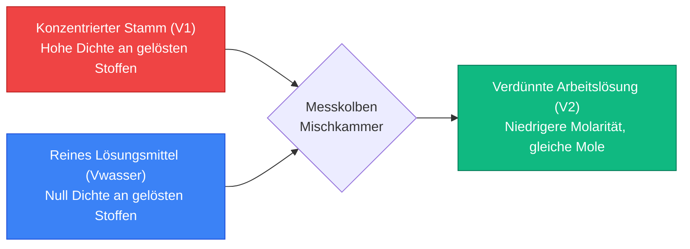
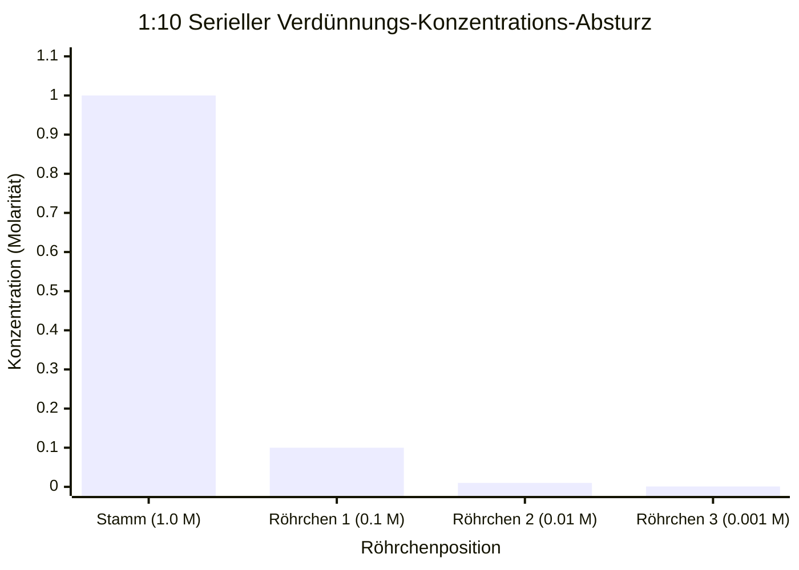
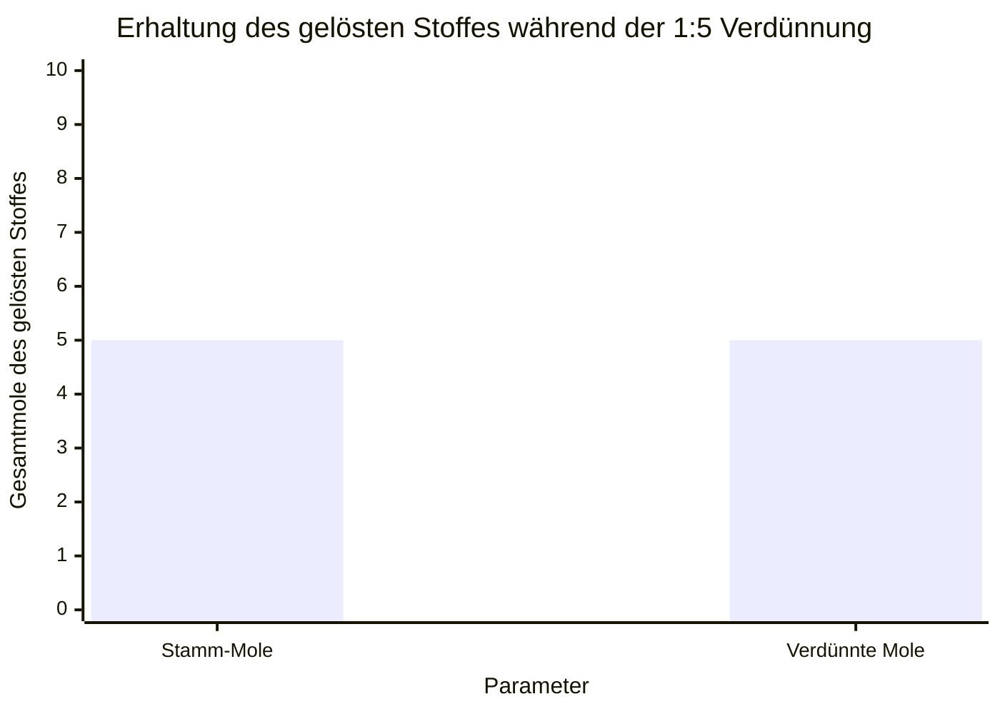
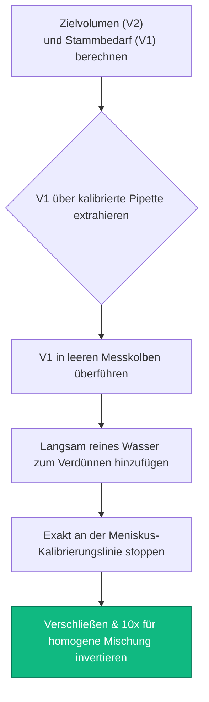
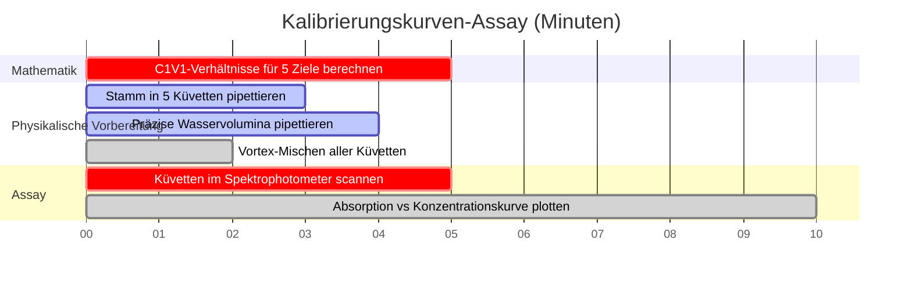

# Der Definitive Molaritäts-Verdünnungs-Rechner: $C_1 V_1 = C_2 V_2$ und Lösungsvorbereitung

Willkommen beim ultimativen **Molaritäts-Verdünnungs-Rechner** und umfassenden Leitfaden zur Laborlösungsvorbereitung. Egal, ob Sie ein Highschool-Chemiestudent sind, der die grundlegende $C_1 V_1 = C_2 V_2$-Gleichung lernt, ein Biochemiker, der komplexe Pufferlösungen für die Proteinextraktion vorbereitet, oder ein Mikrobiologe, der präzise serielle Verdünnungen durchführt, um bakterielle koloniebildende Einheiten zu berechnen – die Beherrschung der Lösungsverdünnung ist die unvermeidliche mechanische Grundlage der experimentellen Wissenschaft.

Der Kauf von vorgemischten chemischen Lösungen in exakten Konzentrationen ist unerschwinglich teuer und enorm ineffizient. Stattdessen kaufen moderne Labore hochkonzentrierte **Stammlösungen**. Durch Pipettieren präziser Mikrovolumina dieser dichten Bestände und deren Verdünnung mit reinem Lösungsmittel (typischerweise deionisiertem Wasser) können Chemiker sofort endlose Volumina maßgeschneiderter Arbeitslösungen auf Abruf herstellen.

In dieser ausführlichen 4.000+ Wörter SEO-Meisterklasse werden wir die Thermodynamik der Stofferhaltung vollständig dekonstruieren, den $C_1 V_1 = C_2 V_2$-Verdünnungsalgorithmus mathematisch beweisen, die exponentielle Zerfallsmechanik von seriellen Verdünnungen entschlüsseln und die häufigsten Laborfehler aufdecken, die die Lösungsgenauigkeit zerstören. Um ein absolutes Verständnis zu gewährleisten, haben wir fünf akribisch detaillierte, parser-sichere interaktive Mermaid.js-Diagramme eingefügt.

---

## 1. Die Kernphysik der Verdünnung: Erhaltung des gelösten Stoffes

Bevor Sie mathematische Gleichungen auswendig lernen, müssen Sie die grundlegende Physik eines Verdünnungsereignisses begreifen. 

Wenn Sie eine konzentrierte Stammlösung verdünnen, fügen Sie *nur* reines Lösungsmittel (Wasser) hinzu. Reines Lösungsmittel enthält absolut null gelöste Partikel. Daher bleibt die Gesamtzahl der gelösten Moleküle, die in Ihrem Becherglas schwimmen, streng, mathematisch konstant.

**Die Goldene Regel der Verdünnung:**
$$(\text{Gesamtmole des gelösten Stoffes vorher}) = (\text{Gesamtmole des gelösten Stoffes nachher})$$

Da die Molarität ($M$) als Mole pro Liter ($\text{mol}/V$) definiert ist, können wir die Definition umstellen, um zu beweisen, dass $\text{Mole} = M \times V$. 
Wenn sich Mole während der Verdünnung nie ändern, dann:
$$M_{\text{initial}} \times V_{\text{initial}} = M_{\text{final}} \times V_{\text{final}}$$

Dies ergibt die weltberühmte Verdünnungsgleichung, die jedem Chemiestudenten auf der Erde allgemein gelehrt wird:
$$C_1 V_1 = C_2 V_2$$

*(Hinweis: $C$ steht für Konzentration und $V$ steht für Volumen. $M_1 V_1 = M_2 V_2$ ist genau dieselbe Gleichung, die die Konzentration spezifisch auf Molarität beschränkt).*

---

## 2. Die Lösung der $C_1 V_1 = C_2 V_2$ Matrix

Die Verdünnungsgleichung enthält vier Variablen. Wenn ein Laborprotokoll beliebige drei Variablen liefert, können Sie die vierte mit einfacher Algebra mühelos berechnen.

### Szenario A: Finden des benötigten Stammvolumens ($V_1$)
Ein Laborprotokoll verlangt, dass Sie $500\text{ mL}$ einer $0.5\text{ M}$ Salzsäure ($\text{HCl}$)-Arbeitslösung vorbereiten. Ihr Chemikalienlagerschrank enthält eine hochkonzentrierte $12.0\text{ M}$ $\text{HCl}$ Stammlösung. Wie viel Stammlösung müssen Sie pipettieren?

**Gegeben:**
- $C_1 = 12.0\text{ M}$ (Stamm)
- $C_2 = 0.5\text{ M}$ (Ziel)
- $V_2 = 500\text{ mL}$ (Ziel)

**Berechnung:**
$$V_1 = \frac{C_2 \times V_2}{C_1} = \frac{0.5 \times 500}{12.0} = \mathbf{20.83\text{ mL}}$$

Sie müssen vorsichtig $20.83\text{ mL}$ der gefährlichen $12.0\text{ M}$ Stammlösung entnehmen.

### Szenario B: Berechnung des hinzugefügten Lösungsmittelvolumens ($V_{\text{wasser}}$)
In Szenario A haben Sie $20.83\text{ mL}$ der Stammlösung pipettiert. Ihr Endzielvolumen beträgt $500\text{ mL}$. Wie viel reines deionisiertes Wasser müssen Sie hinzufügen?
$$V_{\text{wasser}} = V_2 - V_1 = 500\text{ mL} - 20.83\text{ mL} = \mathbf{479.17\text{ mL Wasser}}$$

---

## 3. Die Macht der Seriellen Verdünnungen

Wenn ein Wissenschaftler eine Konzentration benötigt, die exponentiell kleiner ist als die der Stammlösung (z. B. Verdünnung eines $1.0\text{ M}$ Stamms auf $0.000001\text{ M}$), ist die Durchführung eines einzelnen Verdünnungsschritts physikalisch unmöglich. Das benötigte Stammvolumen ($V_1$) wäre weitaus kleiner als ein mikroskopisches Tröpfchen und würde die Präzisionsgrenzen moderner Laborpipetten überschreiten.

Die Lösung ist eine **Serielle Verdünnung**: eine Sequenz identischer schrittweiser Verdünnungen, die einen schnellen exponentiellen Konzentrationsabfall auslösen.

### Die 1:10 Serielle Verdünnungssequenz
Eine 1:10 Verdünnung bedeutet, dass $1\text{ Teil Stamm}$ mit $9\text{ Teilen Lösungsmittel}$ gemischt wird, wodurch $10\text{ Teile Gesamtvolumen}$ entstehen. Dies teilt die Konzentration perfekt durch $10$ (ein Verdünnungsfaktor von 10).

1. **Röhrchen 1 ($10^{-1}$):** Mischen von $1\text{ mL}$ Stamm ($1.0\text{ M}$) + $9\text{ mL}$ Wasser $\rightarrow$ Neue Konzentration = $0.100\text{ M}$.
2. **Röhrchen 2 ($10^{-2}$):** Mischen von $1\text{ mL}$ aus Röhrchen 1 + $9\text{ mL}$ Wasser $\rightarrow$ Neue Konzentration = $0.010\text{ M}$.
3. **Röhrchen 3 ($10^{-3}$):** Mischen von $1\text{ mL}$ aus Röhrchen 2 + $9\text{ mL}$ Wasser $\rightarrow$ Neue Konzentration = $0.001\text{ M}$.

Durch das sequentielle Übertragen der zuvor verdünnten Lösung können Wissenschaftler extreme nanomolare Konzentrationen mit massiver statistischer Genauigkeit erreichen.

---

## 4. Labor-Best-Practices und tödliche Sicherheitsfallen

Das Ausführen von Verdünnungen auf Papier ist sauber und fehlerfrei; das Ausführen von Verdünnungen in einem physischen Labor bringt Chaos, menschliches Versagen und extreme Sicherheitsrisiken mit sich.

**1. Die exotherme Säurefalle (Immer Säure in Wasser geben):**
Wenn konzentrierte Schwefelsäure ($\text{H}_2\text{SO}_4$) mit Wasser verdünnt wird, setzt die Hydratationsthermodynamik gewaltsam Wärme frei. Wenn Sie Wasser *in* ein Becherglas mit konzentrierter Säure gießen, kocht das Wasser sofort und explodiert als kochende Säure in Ihr Gesicht. Sie müssen *immer* Säure langsam *in* ein großes Wasservolumen gießen, um die thermische Energie sicher abzuleiten.

**2. Der Meniskus-Ablesefehler:**
Bei der Vorbereitung einer Lösung in einem Messkolben krümmt sich die Flüssigkeitsoberfläche nach unten und bildet eine "U"-Form, die als Meniskus bezeichnet wird. Sie müssen Ihr Auge perfekt horizontal zur Glaskalibrierungslinie ausrichten, um sicherzustellen, dass der absolute *Boden* des Meniskus die Linie berührt. Das Betrachten aus einem hohen oder niedrigen Winkel verursacht einen Parallaxenfehler und ruiniert Ihr Endvolumen ($V_2$).

**3. Das volumetrische Kontraktions-Paradoxon:**
Wenn Sie $50\text{ mL}$ Wasser und $50\text{ mL}$ reines Ethanol mischen, ist das Endvolumen NICHT $100\text{ mL}$; es sind ungefähr $96\text{ mL}$. Verschiedene Moleküle packen sich unterschiedlich zusammen (wie das Gießen von Sand in einen Eimer voller Golfbälle). Daher dürfen Sie das Lösungsmittelvolumen niemals separat abmessen. Übertragen Sie immer zuerst Ihr Stammvolumen ($V_1$) in einen Messkolben, und füllen Sie dann den Kolben einfach *bis* zur Gesamtvolumenlinie ($V_2$) auf.

---

## 5. Fünf konzeptionelle Engineering-Szenarien mit 2D-Visualisierungen

Um die mechanischen Algorithmen, die die Konzentrationsreduzierung, die Stofferhaltung und die sequenziellen seriellen Assays steuern, vollständig zu beherrschen, werden wir fünf verschiedene analytisch-chemische Szenarien visuell mit maßgeschneiderten Mermaid.js-Diagrammen aufschlüsseln.

### Beispiel 1: Die Architektur des Verdünnungsmechanismus

**Das Szenario:**
Ein Biologiestudent im ersten Semester versucht, den mechanischen Massenfluss eines einstufigen Stammverdünnungsprotokolls abzubilden.

**2D-Visualisierung:**
Dieses Flussdiagramm bildet visuell ab, wie konzentrierte Stammlösung und reines Lösungsmittel in einem Messkolben kollidieren, um eine stabile, homogene, verdünnte Arbeitslösung zu erzeugen.

---

### Beispiel 2: Konzentrationsabfall bei serieller Verdünnung

**Das Szenario:**
Ein Mikrobiologe führt eine 3-stufige 1:10 serielle Verdünnung durch, um die Tödlichkeit einer antibiotischen Verbindung zu verringern, bevor er sie an lebenden Bakterienzellen testet.

**2D-Visualisierung:**
Dieses Diagramm verfolgt grafisch den massiven exponentiellen Absturz der molaren Konzentration, während das Verdünnungsprotokoll das Rack der Reagenzgläser hinunterläuft.

---

### Beispiel 3: Der Beweis der Erhaltung des gelösten Stoffes

**Das Szenario:**
Eine Chemielehrerin versucht ihren Schülern zu beweisen, dass die Zugabe von Gallonen Wasser zu einer Salzlösung nicht auf magische Weise Salzmoleküle erzeugt oder zerstört.

**2D-Visualisierung:**
Dieses Vergleichsdiagramm beweist visuell, dass zwar Konzentration ($M$) und Volumen ($V$) während der Verdünnung stark schwanken, die Gesamtmasse der gelösten Partikel jedoch mathematisch festgelegt ist.

---

### Beispiel 4: Protokoll zur Vorbereitung eines Messkolbens

**Das Szenario:**
Ein Labortechniker bildet die strikte Standardarbeitsanweisung (SOP) ab, die erforderlich ist, um eine analytische Standardlösung für industrielle Lebensmitteltests rechtlich zu zertifizieren.

**2D-Visualisierung:**
Dieses Top-Down-Flussdiagramm fungiert als striktes chemisches Rezept und erzwingt die absolute Reihenfolge der erforderlichen Maßnahmen, um Volumenkontraktionsfehler und thermische Gefahren zu vermeiden.

---

### Beispiel 5: Zeitplan für Spektrophotometrie-Assays

**Das Szenario:**
Ein analytischer Chemiker muss einen perfekt gestaffelten Gradienten von verdünnten Farbstofflösungen vorbereiten, um den Absorptionslaser eines Spektrophotometers zu kalibrieren.

**2D-Visualisierung:**
Dieses Gantt-Diagramm visualisiert die chronologische Reihenfolge eines mehrstufigen Kalibrierungs-Assays, von der Mathematik und der physikalischen Verdünnung bis zur endgültigen Laserkalibrierung.

---

## 6. Schlussfolgerung und Stöchiometrie-Herausforderung

Die Beherrschung des $C_1 V_1 = C_2 V_2$ Verdünnungsalgorithmus ist die nicht verhandelbare Zugangsvoraussetzung für das Betreten jedes biologischen, chemischen oder medizinischen Labors auf der Erde. Das Verständnis der mathematischen Starrheit der Erhaltung von gelösten Stoffen, der Notwendigkeit volumetrischer Glaswaren zur Vermeidung von Volumenkontraktion und der exponentiellen Kraft serieller Verdünnungen garantiert, dass Ihre Arbeitslösungen genau wie beabsichtigt funktionieren.

Wenn Sie diese Algorithmen nicht beherrschen, werden Ihre Puffer kultivierte Zellen sofort töten, Ihre Massenspektrometer werden den Geist aufgeben und Ihre experimentellen Daten werden durch menschliches Versagen völlig verfälscht.

Um sicherzustellen, dass Sie diese kritischen Konzepte gemeistert haben, starten Sie unseren interaktiven Simulator und versuchen Sie, diese letzten analytisch-chemischen Herausforderungen zu lösen:
1. **Die Säure-Herausforderung:** Sie benötigen $250\text{ mL}$ von $2.5\text{ M}$ $\text{H}_2\text{SO}_4$. Ihr Stamm ist $18.0\text{ M}$. Genau wie viele mL Stamm müssen Sie vorsichtig pipettieren? 
2. **Die Verdampfungs-Herausforderung (Rückwärtsverdünnung):** Sie haben $500\text{ mL}$ einer $1.0\text{ M}$ Salzlösung. Sie kochen das Becherglas, bis genau $200\text{ mL}$ Wasser verdampfen. Was ist die neu konzentrierte Molarität der verbleibenden Lösung? (Hinweis: Verwenden Sie $C_1 V_1 = C_2 V_2$, aber Ihr $V_2$ ist $500 - 200 = 300\text{ mL}$).
3. **Die Serielle Herausforderung:** Sie führen eine 1:5 Verdünnung durch. Dann nehmen Sie dieses Röhrchen und führen eine 1:10 Verdünnung durch. Dann nehmen Sie *dieses* Röhrchen und führen eine 1:2 Verdünnung durch. Was ist der gesamte kumulative Verdünnungsfaktor?

Verlassen Sie sich auf diesen Rechner, um Ihre Laborprotokolle zu überprüfen, Ihre Partikelerhaltung visuell zu verifizieren und die Thermodynamik der Lösungsverdünnung dauerhaft zu meistern.
