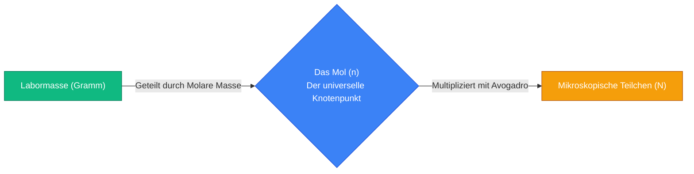
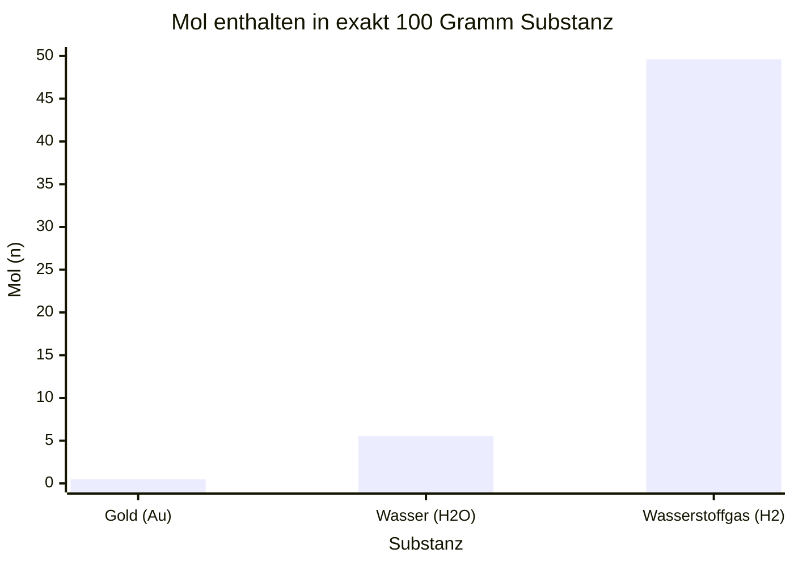
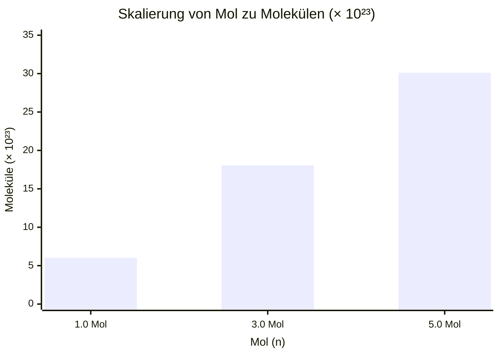
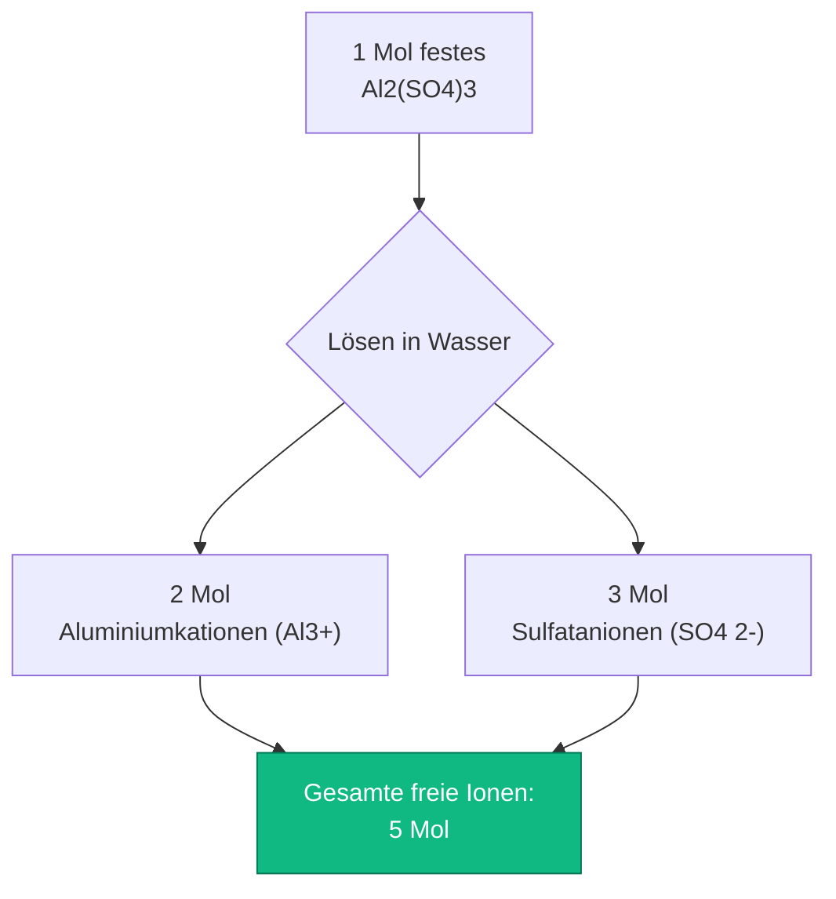
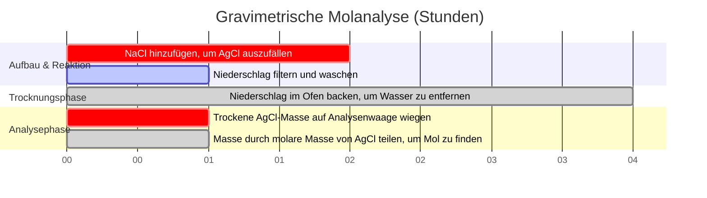

# Der definitive Mol-Rechner: Masse, molare Masse und Avogadro-Zahl

Willkommen zum ultimativen **Mol-Rechner** und umfassenden Leitfaden zur chemischen Stöchiometrie. Egal, ob Sie ein Schüler sind, der seine allererste chemische Gleichung ausgleicht, ein analytischer Chemiker, der die theoretische Ausbeute für eine organische Synthese berechnet, oder ein Pharmatechniker, der Wirkstoffe in Milligramm dosiert – die Beherrschung des Konzepts des chemischen Mols ist die absolute Grundlage aller quantitativen Wissenschaften.

Chemie ist die Lehre davon, wie Atome interagieren. Das grundlegende Problem ist, dass Atome unvorstellbar klein sind; ein einzelner Tropfen Wasser enthält mehr $\text{H}_2\text{O}$-Moleküle, als es Sterne im beobachtbaren Universum gibt. Da Laborwaagen makroskopische **Masse (Gramm)** messen, chemische Gleichungen jedoch mikroskopische **Molekülzahlen** vorschreiben, brauchten Wissenschaftler eine mathematische Brücke, um die beiden Welten zu verbinden. Diese Brücke ist das **Mol**.

In dieser ausführlichen 4.000+ Wörter umfassenden SEO-Meisterklasse werden wir das Konzept der Avogadro-Zahl vollständig dekonstruieren, die Umrechnung zwischen physikalischer Masse und mikroskopischen Teilchen mathematisch beweisen, den kritischen Unterschied zwischen Molekülen und Formeleinheiten aufzeigen und entschlüsseln, wie komplexe ionische Salze in unabhängige Ionen zersplittern. Um ein absolutes Verständnis zu gewährleisten, haben wir fünf akribisch detaillierte, parser-sichere interaktive Mermaid.js-Diagramme integriert.

---

## 1. Die Physik des Mols ($n$) und die Avogadro-Zahl ($N_A$)

Das absolut wichtigste Konzept in der gesamten Chemie ist das Verständnis, dass das "Mol" einfach eine Zähleinheit ist. 
- Ein "Dutzend" bedeutet genau 12 von etwas. 
- Ein "Gros" bedeutet genau 144 von etwas.
- Ein **"Mol" ($n$)** bedeutet genau **$6,02214076 \times 10^{23}$** von etwas.

Diese astronomisch gewaltige Zahl ist als **Avogadro-Konstante ($N_A$)** bekannt.
Hätten Sie ein Mol Murmeln, würden diese die gesamte Erdoberfläche bis zu einer Tiefe von mehreren Meilen bedecken. Da Atome jedoch so klein sind, ist ein Mol flüssiges Wasser nur $18,015\text{ mL}$ (etwa ein einzelner Esslöffel).

**Die Teilchengleichung:**
$$\text{Anzahl der Teilchen (N)} = \text{Mol (n)} \times \text{Avogadro-Zahl (}N_A\text{)}$$

### Was ist ein "Teilchen"?
Der Begriff "Teilchen" ist ein generischer Platzhalter. Sie müssen je nach chemischem Stoff die richtige Terminologie verwenden:
- **Atome:** Für reine Elemente (z. B. $1,0\text{ Mol}$ Gold = $6,022 \times 10^{23}\text{ Goldatome}$).
- **Moleküle:** Für kovalent gebundene Verbindungen (z. B. $1,0\text{ Mol}$ $\text{H}_2\text{O}$ = $6,022 \times 10^{23}\text{ Wassermoleküle}$).
- **Formeleinheiten:** Für ionische kristalline Gitter (z. B. $1,0\text{ Mol}$ $\text{NaCl}$ = $6,022 \times 10^{23}\text{ NaCl-Formeleinheiten}$).
- **Ionen:** Für gelöste geladene Teilchen (z. B. $1,0\text{ Mol}$ $\text{Na}^+$ = $6,022 \times 10^{23}\text{ Natriumionen}$).

---

## 2. Molare Masse: Die Brücke zwischen Masse und Mol

Um die Lücke zwischen dem Zählen mikroskopischer Teilchen und dem Wiegen makroskopischer Pulver im Labor zu schließen, verwenden wir die **molare Masse ($\text{MM}$)**.
Die molare Masse eines beliebigen chemischen Stoffes ist genau definiert als die physikalische Masse (in Gramm) von exakt $1,0\text{ Mol}$ dieses Stoffes.

Beim Blick auf das Periodensystem sehen wir, dass das Atomgewicht von Kohlenstoff $12,011$ beträgt. Das bedeutet, dass genau $1,0\text{ Mol}$ Kohlenstoffatome genau $12,011\text{ Gramm}$ wiegen.

**Berechnung der molaren Masse von Verbindungen:**
Um die molare Masse eines komplexen Moleküls wie Glukose ($\text{C}_6\text{H}_{12}\text{O}_6$) zu finden, summieren wir die Atomgewichte aller konstituierenden Atome:
- Kohlenstoff ($6 \times 12,011$) = $72,066\text{ g/mol}$
- Wasserstoff ($12 \times 1,008$) = $12,096\text{ g/mol}$
- Sauerstoff ($6 \times 15,999$) = $95,994\text{ g/mol}$
- **Gesamte molare Masse** = $180,156\text{ g/mol}$

**Die Masse-zu-Mol-Gleichung:**
$$\text{Mol (n)} = \frac{\text{Physikalische Masse (Gramm)}}{\text{Molare Masse (g/mol)}}$$

Wenn Sie $90,078\text{ Gramm}$ Glukosepulver auf einer Laborwaage abwiegen, besitzen Sie genau $0,50\text{ Mol}$ Glukose.

---

## 3. Erweiterte Stöchiometrie: Atom- und Ionenzählung

Das Konzept des Mols wird deutlich komplexer, wenn man erkennt, dass ein einzelnes chemisches Molekül aus mehreren Unterteilchen besteht.

### Kovalente Atomzählung
Betrachten wir genau $1,0\text{ Mol}$ Wasser ($\text{H}_2\text{O}$).
- Sie haben $1,0\text{ Mol}$ $\text{H}_2\text{O}$-**Moleküle** ($6,022 \times 10^{23}\text{ Moleküle}$).
- Da jedes Molekül genau $2$ Wasserstoffatome enthält, besitzen Sie $2,0\text{ Mol}$ Wasserstoff**atome** ($1,204 \times 10^{24}\text{ H-Atome}$).
- Da jedes Molekül genau $1$ Sauerstoffatom enthält, besitzen Sie $1,0\text{ Mol}$ Sauerstoff**atome** ($6,022 \times 10^{23}\text{ O-Atome}$).
- Insgesamt enthält Ihr einzelnes Mol Wassermoleküle **$3,0\text{ Mol}$ gesamte Atome**.

### Ionische Dissoziationszählung
Wenn sich ionische Salze in Wasser lösen, zersplittern sie physikalisch in unabhängige frei schwebende Ionen. Dies ist entscheidend für Elektrochemie und kolligative Eigenschaften.
Betrachten wir $1,0\text{ Mol}$ Calciumchlorid ($\text{CaCl}_2$).
- $\text{CaCl}_2$ dissoziiert physikalisch in ein $\text{Ca}^{2+}$-Ion und zwei $\text{Cl}^-$-Ionen.
- $\text{CaCl}_2 \rightarrow \text{Ca}^{2+} + 2\text{Cl}^-$
- Daher erzeugt $1,0\text{ Mol}$ festes $\text{CaCl}_2$-Pulver **$3,0\text{ Mol}$ gelöste Ionen**.

---

## 4. Fünf konzeptionelle Ingenieur-Szenarien mit 2D-Visualisierungen

Um die physikalischen Beziehungen zwischen Mol, Masse und Teilchen vollständig zu beherrschen, werden wir fünf verschiedene Laborszenarien untersuchen, die visuell mit benutzerdefinierten Mermaid.js-Diagrammen aufgeschlüsselt sind.

### Beispiel 1: Die universelle Mol-Umrechnungs-Pipeline

**Das Szenario:**
Ein Chemiestudent muss einen $50,0\text{ Gramm}$ schweren Block aus festem Eisen in eine genaue Anzahl einzelner Eisenatome umrechnen.

**2D-Visualisierung:**
Dieses Logik-Flussdiagramm bildet den strikten zweiteiligen Umrechnungspfad ab. Sie können nicht direkt von der Masse zu den Teilchen springen; Sie müssen immer über den zentralen "Mol"-Knotenpunkt umrechnen.

---

### Beispiel 2: Masse vs. Mol (Varianz der Stoffdichte)

**Das Szenario:**
Ein Forscher hat genau $100,0\text{ Gramm}$ von drei verschiedenen Stoffen: Wasserstoffgas ($\text{H}_2$), flüssiges Wasser ($\text{H}_2\text{O}$) und festes Gold ($\text{Au}$). Da sich ihre molaren Massen radikal unterscheiden, variiert die Anzahl der Mol (und damit der Teilchen) in dieser Masse von $100\text{g}$ enorm.

**Die Mathematik:**
- $\text{H}_2$: $100\text{g} / 2,016\text{ g/mol} = 49,6\text{ Mol}$.
- $\text{H}_2\text{O}$: $100\text{g} / 18,015\text{ g/mol} = 5,55\text{ Mol}$.
- $\text{Au}$: $100\text{g} / 196,97\text{ g/mol} = 0,50\text{ Mol}$.

**2D-Visualisierung:**
Dieses Diagramm beweist grafisch, dass gleiche physikalische Massen NICHT gleiche Teilchenzahlen bedeuten. Schwere Atome wie Gold liefern sehr wenige Teilchen pro Gramm.

---

### Beispiel 3: Der Avogadro-Multiplikationseffekt

**Das Szenario:**
Ein Gymnasiallehrer möchte visuell demonstrieren, wie schnell die Anzahl der Teilchen ansteigt, wenn man die Anzahl der Mol von $1,0$ auf $5,0$ erhöht.

**Die Mathematik:**
Die Beziehung ist streng linear, aber die Steigung ist unvorstellbar steile $6,022 \times 10^{23}$.

**2D-Visualisierung:**
Dieses Diagramm stellt die direkte Korrelation zwischen Mol und gesamten Molekülen (skaliert mit $10^{23}$) dar.

---

### Beispiel 4: Die ionische Zersplitterungsarchitektur (Dissoziation)

**Das Szenario:**
Ein Elektrochemiker löst genau $1,0\text{ Mol}$ festes Aluminiumsulfat ($\text{Al}_2(\text{SO}_4)_3$) in Wasser und muss die genaue molare Anzahl der resultierenden Kationen und Anionen ermitteln.

**2D-Visualisierung:**
Dieses Top-Down-Flussdiagramm bildet die ionische Dissoziationskaskade ab und beweist, wie ein einzelnes makroskopisches Mol Salz in fünf unabhängige thermodynamische Mol von Ionen zersplittert.

---

### Beispiel 5: Gravimetrische Analyse Zeitachse

**Das Szenario:**
Ein analytischer Chemiker fällt Silberchlorid ($\text{AgCl}$) aus einer Lösung aus, um die ursprüngliche Masse von Silber in einer kontaminierten Wasserprobe zu bestimmen.

**2D-Visualisierung:**
Dieses Gantt-Diagramm visualisiert die chronologische Reihenfolge eines gravimetrischen Analyse-Experiments und schlägt die Brücke von der Filtration der physikalischen Masse zu stöchiometrischen Molberechnungen.

---

## 5. Fazit und Stöchiometrie-Herausforderung

Die Beherrschung des Mols ist die unumgängliche Grundlage aller physikalischen Wissenschaften. Das Verständnis für den strikten Unterschied zwischen Masse und Teilchenzahl, das Respektieren der immensen Größenordnung der Avogadro-Zahl und die mathematische Modellierung der ionischen Dissoziation werden garantieren, dass Ihre Laborausbeuten genau sind und Ihre chemischen Gleichungen perfekt ausgeglichen sind.

Wenn Sie diese mathematischen Prinzipien ignorieren, werden Sie Gramm mit Mol verwechseln, chemische Ausbeuten falsch vorhersagen und jede Stöchiometrie-Prüfung nicht bestehen, die Sie jemals ablegen.

Um zu garantieren, dass Sie diese kritischen Konzepte beherrschen, starten Sie unseren interaktiven Simulator und versuchen Sie, diese finalen Mol-Herausforderungen zu lösen:
1. **Die Massen-Herausforderung:** Sie benötigen genau $0,350\text{ Mol}$ Kupfer(II)-sulfat-Pentahydrat ($\text{CuSO}_4\cdot 5\text{H}_2\text{O}$, $\text{MM} = 249,68\text{ g/mol}$). Genau wie viel Gramm müssen Sie auf der Analysenwaage abwiegen?
2. **Die Teilchen-Herausforderung:** Sie trinken ein Glas mit $250,0\text{ Gramm}$ reinem Wasser. Genau wie viele einzelne $\text{H}_2\text{O}$-Moleküle haben Sie gerade konsumiert?
3. **Die Ionen-Herausforderung:** Sie lösen $100,0\text{ Gramm}$ $\text{CaCl}_2$ in einem Schwimmbecken auf. Genau wie viele gesamte Mol an frei schwebenden Ionen haben Sie dem Wasser gerade hinzugefügt?

Verlassen Sie sich auf diesen Rechner, um Ihre Hausaufgaben zu überprüfen, schnell komplexe molare Massen abzuleiten und die Mathematik der chemischen Stöchiometrie dauerhaft zu beherrschen.
