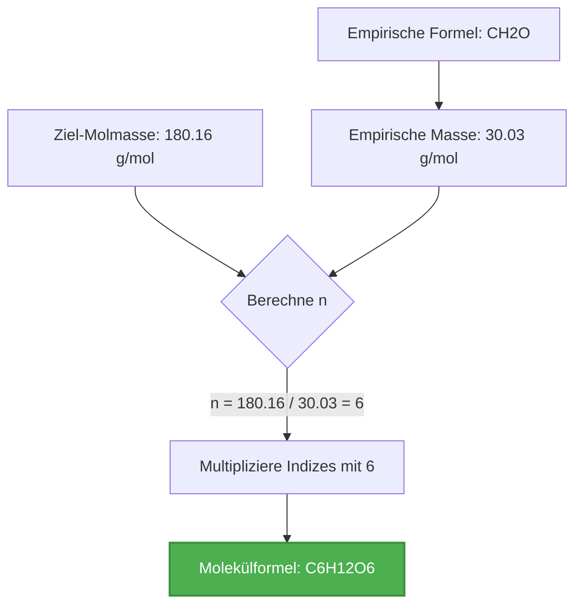

# Leitfaden für Molekülformeln & Multiplikatormathematik in Labor & analytischer Chemie

In der analytischen Chemie und Massenspektrometrie erfordert die Bestimmung der **Molekülformel** einer Verbindung die Verknüpfung ihrer **empirischen Formel** mit ihrer experimentellen **molekularen Molmasse**:

$$\text{Molekülformel} = (\text{Empirische Formel})_n \quad \text{wobei} \quad n = \frac{\text{Molekulare Molmasse}}{\text{Empirische Formelmasse}}$$

---

## 1. Umrechnungsmatrix Empirisch zu Molekular

| Verbindungsname | Empirische Formel | Empirische Masse ($M_{\text{emp}}$) | Molare Masse ($M$) | Multiplikator ($n$) | Molekülformel |
| :--- | :--- | :--- | :--- | :--- | :--- |
| **Formaldehyd** | $\text{CH}_2\text{O}$ | $30.026\text{ g/mol}$ | $30.026\text{ g/mol}$ | $n = 1$ | $\text{CH}_2\text{O}$ |
| **Essigsäure** | $\text{CH}_2\text{O}$ | $30.026\text{ g/mol}$ | $60.052\text{ g/mol}$ | $n = 2$ | $\text{C}_2\text{H}_4\text{O}_2$ |
| **Glukose** | $\text{CH}_2\text{O}$ | $30.026\text{ g/mol}$ | $180.156\text{ g/mol}$ | $n = 6$ | $\text{C}_6\text{H}_{12}\text{O}_6$ |
| **Benzol** | $\text{CH}$ | $13.019\text{ g/mol}$ | $78.114\text{ g/mol}$ | $n = 6$ | $\text{C}_6\text{H}_6$ |
| **Distickstofftetroxid** | $\text{NO}_2$ | $46.005\text{ g/mol}$ | $92.011\text{ g/mol}$ | $n = 2$ | $\text{N}_2\text{O}_4$ |

---

## 2. Standardprotokoll zur Berechnung der Molekülformel

```
   Schritt 1: Bestimmen Sie die empirische Formel der Verbindung.
   Schritt 2: Berechnen Sie die empirische Formelmasse (Summe der Atommassen der empirischen Indizes).
   Schritt 3: Erhalten Sie die experimentelle molekulare Molmasse (z.B. aus der Massenspektrometrie).
   Schritt 4: Berechnen Sie den ganzzahligen Multiplikator n = molekulare Molmasse / empirische Masse.
   Schritt 5: Multiplizieren Sie jeden empirischen Index mit n, um die endgültige Molekülformel zu erhalten.
   Schritt 6: Überprüfen Sie, ob die berechnete molekulare Molmasse mit der Ziel-Molmasse übereinstimmt.
```

---

## 3. Bildungs- & Laborsicherheits-Haftungsausschluss
*Dieser Molekülformel-Rechner liefert vorläufige Formelableitungen für Bildungszwecke, AP-Chemie und Forschungsplanung. Experimentelle Molmassendaten sollten mittels hochauflösender Massenspektrometrie (HRMS) oder Gaschromatographie-Massenspektrometrie (GC-MS) bestätigt werden.*

## 4. Der umfassende Leitfaden zu Molekülformeln

Willkommen beim definitiven Leitfaden zum Verständnis, zur Berechnung und zur Anwendung von Molekülformeln in der Chemie. Egal, ob Sie ein Gymnasiast sind, der zum ersten Mal mit Stöchiometrie zu tun hat, ein AP-Chemie-Schüler, der sich auf Prüfungen vorbereitet, oder ein Labortechniker, der Massenspektrometriedaten analysiert, diese umfassende Ressource wurde entwickelt, um die faszinierende Welt der chemischen Formeln zu beleuchten. 

Im Kern ist die Chemie das Studium der Materie und ihrer Umwandlungen. Um diese Umwandlungen zu verstehen, müssen wir eine genaue Sprache haben, um die Zusammensetzung der Materie zu beschreiben. Diese Sprache wird in chemischen Formeln geschrieben. Während empirische Formeln uns das einfachste Verhältnis von Elementen in einer Verbindung geben, erzählen sie nicht die ganze Geschichte. Die **Molekülformel** ist die wahre Identität eines Moleküls und offenbart die genaue Anzahl aller vorhandenen Atomarten.

In diesem ausführlichen Leitfaden werden wir die tiefe Mechanik von Molekülformeln untersuchen, wie sie sich zu ihren empirischen Gegenstücken verhalten und den mathematischen Multiplikator ($n$), der die Lücke zwischen ihnen schließt. Wir werden uns auch mit realen Anwendungen, der schrittweisen Nutzung unseres Molekülformel-Rechners und fünf detaillierten Beispielen mit mathematischen Ableitungen und 2D-Visualisierungen befassen.

### 4.1 Was ist eine Molekülformel?

Eine Molekülformel ist eine chemische Formel, die die genaue Anzahl der Atome jedes Elements in einem einzelnen Molekül einer Substanz angibt. Sie ist der chemische "Bauplan" eines Moleküls. Zum Beispiel ist die Molekülformel für Wasser $\text{H}_2\text{O}$, was bedeutet, dass jedes Molekül genau aus zwei Wasserstoffatomen und einem Sauerstoffatom besteht. Die Molekülformel für Glukose ist $\text{C}_6\text{H}_{12}\text{O}_6$, was uns sagt, dass ein einzelnes Zuckermolekül 6 Kohlenstoffatome, 12 Wasserstoffatome und 6 Sauerstoffatome enthält.

Im Gegensatz dazu liefert eine **empirische Formel** nur das einfachste ganzzahlige Verhältnis von Atomen. Für Glukose ergibt die Division der Indizes durch ihren größten gemeinsamen Teiler (6) die empirische Formel $\text{CH}_2\text{O}$. Beachten Sie, wie sich mehrere Verbindungen genau dieselbe empirische Formel teilen können. Formaldehyd ($\text{CH}_2\text{O}$), Essigsäure ($\text{C}_2\text{H}_4\text{O}_2$) und Glukose teilen sich alle die empirische Formel $\text{CH}_2\text{O}$. Die Molekülformel unterscheidet das giftige Konservierungsmittel (Formaldehyd) vom sauren Bestandteil von Essig (Essigsäure) und der wesentlichen Energiequelle für die Zellatmung (Glukose).

### 4.2 Die Rolle der molaren Masse

Wenn die empirische Formel das Verhältnis und die Molekülformel die genaue Anzahl angibt, wie gelangen wir dann von der einen zur anderen? Das fehlende Glied ist die **molare Masse** (oder das Molekulargewicht). 

Wenn ein Chemiker eine neue Verbindung synthetisiert, könnte er eine Elementaranalyse verwenden, um die Massenprozentsätze jedes Elements zu ermitteln, was sich leicht in eine empirische Formel umwandeln lässt. Um jedoch die wahre Molekülformel zu finden, muss er die molare Masse der Verbindung mit Techniken wie der Massenspektrometrie oder der Gefrierpunktserniedrigung bestimmen. 

Indem wir die theoretische Masse der empirischen Formel (die empirische Masse) mit der tatsächlichen molaren Masse der Verbindung vergleichen, können wir bestimmen, wie viele empirische "Einheiten" in ein reales Molekül passen.

### 4.3 Die mathematische Beziehung

Die Beziehung zwischen der empirischen und der Molekülformel ist elegant einfach. Die Molekülformel ist immer ein ganzzahliges Vielfaches der empirischen Formel. Wir bezeichnen diesen ganzzahligen Multiplikator als $n$.

$$ \text{Molekülformel} = (\text{Empirische Formel}) \times n $$

Um diesen Multiplikator zu finden, verwenden wir das Verhältnis der molaren Massen:

$$ n = \frac{\text{Tatsächliche molare Masse der Verbindung}}{\text{Empirische Formelmasse}} $$

Da man in einem Standardmolekül keinen Bruchteil eines Atoms haben kann, muss $n$ eine ganze Zahl sein (1, 2, 3 usw.). In realen experimentellen Daten könnten leichte Messfehler einen Wert wie 5,98 oder 6,03 ergeben, den wir getrost auf 6 runden. Wenn die Berechnung jedoch einen Wert wie 4,5 ergibt, ist dies ein starkes Indiz dafür, dass entweder die empirische Formel falsch berechnet wurde oder die Molmassendaten fehlerhaft sind.

Weitere Informationen zu den grundlegenden Prinzipien der Chemie finden Sie im [IUPAC Gold Book](https://goldbook.iupac.org/) oder in den [Chemie-Ressourcen der NASA](https://www.nasa.gov/).

---

## 5. Nutzungsleitfaden: Den Molekülformel-Rechner meistern

Unser Molekülformel-Rechner ist als intuitives und dennoch äußerst leistungsfähiges Werkzeug für Studenten und Profis gleichermaßen konzipiert. Befolgen Sie diesen Schritt-für-Schritt-Leitfaden, um sein volles Potenzial auszuschöpfen.

### 5.1 Auswahl des Berechnungsmodus

Der Rechner verfügt über mehrere Modi, um den unterschiedlichen Arten gerecht zu werden, wie chemische Daten in Problemen und Labors präsentiert werden. 

1. **Empirische Formel + Molare Masse:** Der häufigste Modus. Sie geben die empirische Formel und die experimentell ermittelte molare Masse ein. Der Rechner findet den Multiplikator $n$ und gibt die Molekülformel aus.
2. **Modus für relative Masse (Mr):** Ähnlich wie oben, verwendet jedoch die relative Molekülmasse, die dimensionslos ist, aber numerisch der molaren Masse entspricht.
3. **Prozentuale Zusammensetzung:** Ermöglicht die direkte Eingabe der Elementmassenprozentsätze, wodurch die Notwendigkeit umgangen wird, die empirische Formel selbst zu berechnen.
4. **Formelmassen-Analysator:** Ein Hilfsmodus, der schnell die genaue molare Masse jeder eingegebenen komplexen Molekülformel berechnet.
5. **Indexreduktion:** Ein Tool, das eine große Molekülformel aufnimmt und sie mithilfe der Mathematik des größten gemeinsamen Teilers (ggT) automatisch auf ihre empirische Form reduziert.

### 5.2 Eingabe chemischer Formeln

Bei der Eingabe chemischer Formeln ist unser Parser so konzipiert, dass er sehr fehlerverzeihend und intelligent ist, aber die Einhaltung der chemischen Standardnotation gewährleistet die besten Ergebnisse.

*   **Großschreibung:** Schreiben Sie den ersten Buchstaben eines Elementsymbols immer groß. Verwenden Sie Kleinbuchstaben für den zweiten Buchstaben (z.B. verwenden Sie `Na` für Natrium, nicht `NA` oder `na`).
*   **Indizes:** Geben Sie Zahlen direkt nach dem Elementsymbol ohne Leerzeichen ein (z.B. `H2O`, `C6H12O6`). Der Rechner formatiert sie in der Ausgabeanzeige automatisch als Indizes.
*   **Klammern:** Sie können Klammern für mehratomige Ionen oder wiederholte Gruppen verwenden (z.B. `Ca(OH)2` oder `(NH4)2SO4`). Der Parser weiß, wie er den äußeren Index auf die inneren Elemente verteilen muss.

### 5.3 Analyse der Ergebnisausgabe

Sobald Sie die Berechnung durchführen, zeigt das "Interaktive Cockpit" eine Fülle von Informationen an:

*   **Empirische Formelmasse:** Die genaue Masse der empirischen Einheit, berechnet unter Verwendung hochpräziser Atomgewichte.
*   **Ziel-Molmasse:** Eine Wiederholung Ihrer Eingabe zur Überprüfung.
*   **Der Multiplikator ($n$):** Der Kern der Berechnung. Die Schnittstelle zeigt die genaue Division (z.B. 180,16 / 30,03 = 6,00) an und bestätigt, dass es sich um eine ganze Zahl handelt. Wenn $n$ nicht nahe an einer ganzen Zahl liegt, erscheint eine Warnung.
*   **Endgültige Molekülformel:** Das Ergebnis, wunderschön formatiert. Standardmäßig werden kohlenstoffhaltige Verbindungen nach dem **Organischen Hill-System** geordnet (Kohlenstoff zuerst, Wasserstoff als Zweites, dann alphabetisch).

### 5.4 Verwendung der Visualisierungen

Der Rechner enthält ein Recharts-Donut-Diagramm, das den Massenbeitrag jedes Elements im endgültigen Molekül visuell aufschlüsselt. Dies ist äußerst nützlich, um Probleme mit der prozentualen Zusammensetzung visuell zu überprüfen. Sie können mit der Maus über die Segmente fahren, um genaue Datenpunkte zu sehen.

---

## 6. Fünf praxisnahe Konzeptbeispiele

Um Molekülformeln wirklich zu beherrschen, muss man sehen, wie die Mathematik auf reale Szenarien angewendet wird. Im Folgenden finden Sie fünf sehr detaillierte Beispiele, die von einführender Stöchiometrie bis zu fortgeschrittener biochemischer Analyse reichen.

### Beispiel 1: Der Baustein des Lebens (Glukose)

**Szenario:** 
Ein Biochemiker isoliert eine reine kristalline Substanz aus Pflanzensaft. Die Elementaranalyse zeigt, dass sie zu 40,00 % aus Kohlenstoff, 6,71 % aus Wasserstoff und 53,29 % aus Sauerstoff (Massenanteile) besteht. Dies ergibt eine empirische Formel von $\text{CH}_2\text{O}$. Die anschließende Massenspektrometrie bestimmt die molare Masse der Verbindung auf ungefähr $180.16\text{ g/mol}$. Wie lautet die Molekülformel?

**Mathematische Ableitung:**

1.  **Identifizieren Sie die empirische Formel:** $\text{CH}_2\text{O}$
2.  **Berechnen Sie die empirische Masse ($M_{\text{emp}}$):**
    *   C: $1 \times 12.011\text{ g/mol} = 12.011$
    *   H: $2 \times 1.008\text{ g/mol} = 2.016$
    *   O: $1 \times 15.999\text{ g/mol} = 15.999$
    *   $M_{\text{emp}} = 12.011 + 2.016 + 15.999 = 30.026\text{ g/mol}$
3.  **Bestimmen Sie den Multiplikator ($n$):**
    $$ n = \frac{\text{Molare Masse}}{M_{\text{emp}}} = \frac{180.16}{30.026} \approx 6 $$
4.  **Berechnen Sie die Molekülformel:**
    $$ (\text{CH}_2\text{O}) \times 6 = \text{C}_6\text{H}_{12}\text{O}_6 $$

**Visualisierung: Berechnungsflussdiagramm**



*Dieses Flussdiagramm veranschaulicht die unkomplizierte lineare Abfolge von empirischen Daten bis hin zum endgültigen molekularen Bauplan von Glukose, der primären Energiequelle für zelluläres Leben.*

### Beispiel 2: Der Raketentreibstoff (Hydrazin)

**Szenario:**
Luft- und Raumfahrtingenieure der NASA testen eine hochreaktive Stickstoff-Wasserstoff-Verbindung, die als Monotreibstoff in Satellitentriebwerken verwendet wird. Die empirische Formel wird mit $\text{NH}_2$ bestimmt. Experimentelle Daten zeigen, dass der Dampf eine Dichte aufweist, die einer molaren Masse von $32.05\text{ g/mol}$ entspricht. Finden Sie die Molekülformel.

**Mathematische Ableitung:**

1.  **Identifizieren Sie die empirische Formel:** $\text{NH}_2$
2.  **Berechnen Sie die empirische Masse ($M_{\text{emp}}$):**
    *   N: $1 \times 14.007 = 14.007$
    *   H: $2 \times 1.008 = 2.016$
    *   $M_{\text{emp}} = 14.007 + 2.016 = 16.023\text{ g/mol}$
3.  **Bestimmen Sie den Multiplikator ($n$):**
    $$ n = \frac{32.05}{16.023} = 1.999 \approx 2 $$
4.  **Berechnen Sie die Molekülformel:**
    $$ (\text{NH}_2) \times 2 = \text{N}_2\text{H}_4 $$

**Visualisierung: Massenvergleichstabelle**

| Komponente | Formel | Masse (g/mol) | Stickstoff % | Wasserstoff % |
| :--- | :--- | :--- | :--- | :--- |
| **Empirische Basis** | $\text{NH}_2$ | 16.023 | 87.4% | 12.6% |
| **Tatsächliches Molekül** | $\text{N}_2\text{H}_4$ | 32.046 | 87.4% | 12.6% |

*Beachten Sie, wie der Massenprozentsatz der Elemente zwischen der empirischen Formel und der Molekülformel absolut identisch bleibt, obwohl sich die Gesamtmasse verdoppelt.*

### Beispiel 3: Das Schmerzmittel (Ibuprofen)

**Szenario:**
Ein Pharmalabor synthetisiert eine Charge Ibuprofen. Die empirische Formel wird mit $\text{C}_{13}\text{H}_{18}\text{O}_2$ bestimmt. Das Massenspektrometer des Labors misst den Molekülionenpeak bei $m/z = 206.29$, was auf eine molare Masse von $206.29\text{ g/mol}$ hinweist. Wie lautet die wahre Molekülformel von Ibuprofen?

**Mathematische Ableitung:**

1.  **Identifizieren Sie die empirische Formel:** $\text{C}_{13}\text{H}_{18}\text{O}_2$
2.  **Berechnen Sie die empirische Masse ($M_{\text{emp}}$):**
    *   C: $13 \times 12.011 = 156.143$
    *   H: $18 \times 1.008 = 18.144$
    *   O: $2 \times 15.999 = 31.998$
    *   $M_{\text{emp}} = 156.143 + 18.144 + 31.998 = 206.285\text{ g/mol}$
3.  **Bestimmen Sie den Multiplikator ($n$):**
    $$ n = \frac{206.29}{206.285} \approx 1 $$
4.  **Berechnen Sie die Molekülformel:**
    $$ (\text{C}_{13}\text{H}_{18}\text{O}_2) \times 1 = \text{C}_{13}\text{H}_{18}\text{O}_2 $$

**Visualisierung: Die "n = 1"-Szenario-Zeitachse**

```mermaid
gantt
    title Labor-Workflow: Identifizierung von Ibuprofen
    dateFormat  HH:mm:ss
    axisFormat  %H:%M
    section Synthese
    Chargenvorbereitung       :active, 00:00:00, 00:02:00
    section Analyse
    Elementaranalyse (Empirisch) :crit, active, 00:02:00, 00:04:00
    Massenspektrometrie (Molare Masse) :active, 00:04:00, 00:06:00
    section Abschluss
    Berechnung des Multiplikators (n=1) :done, 00:06:00, 00:07:00
    Formel als identisch bestätigt :milestone, 00:07:00, 00:07:00
```



*Dieses Gantt-Diagramm stellt einen typischen Labor-Zeitplan dar. Weil $n = 1$ ist, sind die empirische Formel und die Molekülformel identisch. Dies ist bei vielen komplexen organischen Pharmazeutika üblich, bei denen die Struktur nicht symmetrisch geteilt werden kann.*

### Beispiel 4: Der aromatische Kohlenwasserstoff (Benzol)

**Szenario:**
Ein organischer Chemiker untersucht eine leicht entzündliche, süßlich riechende Flüssigkeit. Die empirische Formel ist einfach $\text{CH}$, was auf ein 1:1-Verhältnis von Kohlenstoff zu Wasserstoff hinweist. Die molare Masse wird durch Gefrierpunktserniedrigung auf $78.11\text{ g/mol}$ bestimmt. 

**Mathematische Ableitung:**

1.  **Identifizieren Sie die empirische Formel:** $\text{CH}$
2.  **Berechnen Sie die empirische Masse ($M_{\text{emp}}$):**
    *   $12.011 + 1.008 = 13.019\text{ g/mol}$
3.  **Bestimmen Sie den Multiplikator ($n$):**
    $$ n = \frac{78.11}{13.019} \approx 6 $$
4.  **Berechnen Sie die Molekülformel:**
    $$ (\text{CH}) \times 6 = \text{C}_6\text{H}_6 $$

**Visualisierung: Indexskalierungsprozess**


*Die Ringstruktur von Benzol erfordert 6 Kohlenstoffatome. Die empirische Formel $\text{CH}$ gibt keinen Hinweis auf diese Ringgeometrie, was verdeutlicht, warum die Bestimmung der wahren Molekülformel ($\text{C}_6\text{H}_6$) ein entscheidender Schritt in der organischen Chemie ist.*

### Beispiel 5: Der mysteriöse Polymer-Vorläufer (Ethylen vs. Buten)

**Szenario:**
Eine petrochemische Anlage raffiniert einen Gasstrom. Die Analyse zeigt eine empirische Formel von $\text{CH}_2$. Je nach Druck und Temperatur der Destillationskolonne könnte das Gas jedoch Ethylen ($28.05\text{ g/mol}$) oder Buten ($56.11\text{ g/mol}$) sein. Die aktuelle Probe hat eine molare Masse von $56.11\text{ g/mol}$.

**Mathematische Ableitung:**

1.  **Identifizieren Sie die empirische Formel:** $\text{CH}_2$
2.  **Berechnen Sie die empirische Masse ($M_{\text{emp}}$):**
    *   $12.011 + (2 \times 1.008) = 14.027\text{ g/mol}$
3.  **Bestimmen Sie den Multiplikator ($n$):**
    $$ n = \frac{56.11}{14.027} \approx 4 $$
4.  **Berechnen Sie die Molekülformel:**
    $$ (\text{CH}_2) \times 4 = \text{C}_4\text{H}_8 \text{ (Buten)} $$

*Wäre die molare Masse $28.05\text{ g/mol}$ gewesen, wäre $n$ gleich 2 gewesen, was Ethylen ($\text{C}_2\text{H}_4$) ergeben hätte. Dies zeigt, wie Berechnungen von Molekülformeln in der Industrie verwendet werden, um zwischen verschiedenen Chemikalien zu unterscheiden, die dieselben grundlegenden Verhältnisse aufweisen.*

---

## 7. Deep Dive FAQ und erweiterte Fehlerbehebung

Wenn Sie den Molekülformel-Rechner für komplexere AP-Chemie- oder universitäre Probleme verwenden, können Sie auf Grenzfälle stoßen. Dieser FAQ-Bereich befasst sich mit den Nuancen der Molekülmathematik.

**F: Was passiert, wenn mein berechnetes $n$ eine Zahl wie 4,5 ist?**
**A:** Bei Standardproblemen zur Molekülformel muss $n$ eine ganze Zahl sein. Wenn Sie $n = 4,5$ berechnen, haben Sie wahrscheinlich einen Fehler bei der Bestimmung der empirischen Formel gemacht. Wenn Sie beispielsweise fälschlicherweise eine empirische Formel von $\text{CH}_3$ (Masse $\approx 15$) für eine Verbindung mit einer molaren Masse von $\approx 58$ berechnet haben, ist $58 / 15 = 3,86$. Dies bedeutet, dass $\text{CH}_3$ falsch war (die wahre empirische Formel war wahrscheinlich $\text{C}_2\text{H}_5$, Masse $\approx 29$, was $n=2$ für $\text{C}_4\text{H}_{10}$ ergibt). 

**F: Verwendet der Rechner exakte Isotopenmassen?**
**A:** Der Rechner verwendet die standardmäßigen, nach natürlicher Häufigkeit gewichteten durchschnittlichen Atommassen (z. B. Kohlenstoff = 12,011), die von der IUPAC genehmigt wurden. Für die chemische Standardsynthese und Hausaufgaben ist dies sehr genau. Wenn Sie eine hochauflösende Massenspektrometrie (HRMS) durchführen und sich spezifische Isotope (wie Kohlenstoff-13) ansehen, müssen Sie die exakte Isotopenmasse manuell berücksichtigen.

**F: Kann eine Verbindung eine empirische Formel mit einem Multiplikator von $n = 100$ haben?**
**A:** Absolut! In der Polymerchemie können Moleküle massiv sein. Beispielsweise ist Polyethylen im Wesentlichen eine Kette von $\text{CH}_2$-Einheiten. Ein einzelner Polyethylenstrang könnte eine empirische Formel von $\text{CH}_2$ und eine molare Masse von $140.000\text{ g/mol}$ haben, was zu einem Multiplikator von $n = 10.000$ führt.

**F: Warum ordnet der Rechner meine Ausgabe in das Hill-System um?**
**A:** Das Hill-System ist der international anerkannte Standard für das Schreiben chemischer Formeln. Es verhindert Verwirrung, indem es sicherstellt, dass Formeln in der gesamten Literatur einheitlich geschrieben werden. Kohlenstoff wird zuerst aufgeführt, Wasserstoff als zweites, und alle anderen Elemente folgen in alphabetischer Reihenfolge. Anstatt beispielsweise $\text{ClCH}_3$ zu schreiben, standardisiert das Hill-System dies zu $\text{CH}_3\text{Cl}$. Unser Rechner wendet diesen Standard automatisch an, um sicherzustellen, dass Ihre Antworten professionell formatiert sind.

**F: In welcher Beziehung steht dies zum Mol-Konzept?**
**A:** Die bei diesen Berechnungen verwendete molare Masse ist direkt mit der Avogadro-Zahl ($6,022 \times 10^{23}$) verknüpft. Die empirische Masse ist die Masse eines Mols empirischer Einheiten, und die molekulare Masse ist die Masse eines Mols tatsächlicher Moleküle. Der Multiplikator $n$ gibt an, wie viele Mol empirischer Einheiten sich in einem Mol der realen Substanz befinden. Weitere Informationen zu Molen finden Sie in unserem [Mol-Rechner](/mole-calculator).

Durch die Beherrschung des Übergangs von empirischen zu Molekülformeln erlangen Sie die Fähigkeit, unbekannte Substanzen zu identifizieren, komplexe stöchiometrische Gleichungen auszugleichen und die physikalische Geometrie der molekularen Welt zu verstehen. Nutzen Sie diesen Rechner sowohl als Überprüfungswerkzeug als auch als Bildungsleitfaden, um Ihre chemischen Analysen zu optimieren!
