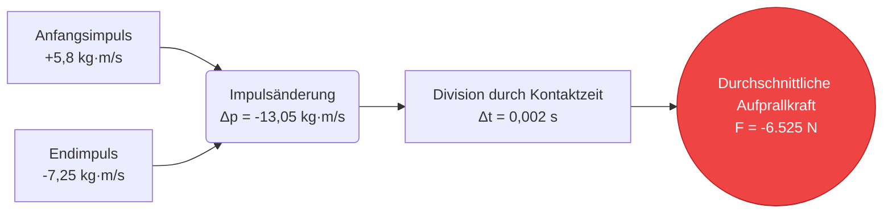
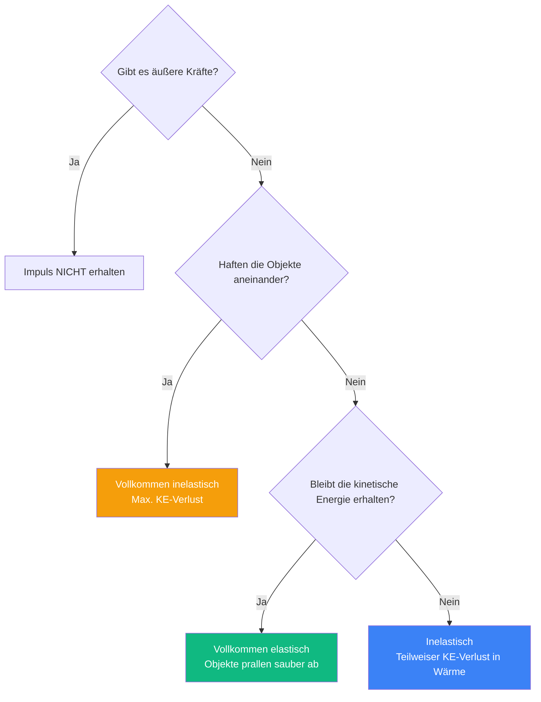
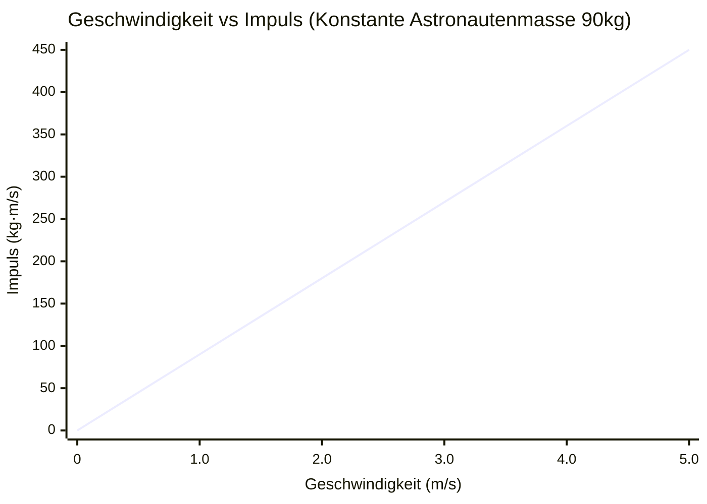
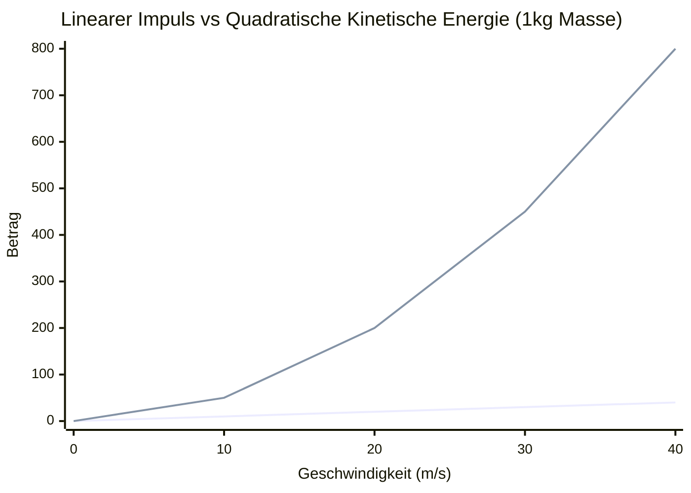

# Der ultimative Impuls-Rechner: Lineare Bewegung, Kollisionen und Kraftstoß meistern

Willkommen beim definitiven **Impuls-Rechner** und vollständigen Physik-Kollisionsratgeber. Egal, ob Sie ein Automobilingenieur sind, der Knautschzonen von Crashtests analysiert, ein Astrophysiker, der orbitale Rendezvous plant, oder ein Universitätsstudent, der sich auf eine anspruchsvolle Zwischenprüfung über Erhaltungssätze in der Physik vorbereitet, dieses Tool wurde für absolute mechanische Präzision entwickelt.

Der Impuls ist die physikalische Verkörperung von "Unaufhaltsamkeit". Er erklärt, warum ein langsam fahrender Güterzug durch eine Ziegelmauer krachen kann, warum eine winzige Kugel massiven Stahl durchschlagen kann und wie Raketen im Vakuum des Weltraums manövrieren.

In diesem massiven, über 4.000 Wörter umfassenden Deep-Dive werden wir die Mechanik des linearen Impulses ($p = m \cdot v$) umfassend zerlegen. Wir werden die mathematischen Grundlagen des Kraftstoß-Impuls-Theorems untersuchen, den Unterschied zwischen elastischen und vollkommen inelastischen Kollisionen analysieren und Sie durch fünf praxisnahe Ingenieurbeispiele führen, visualisiert mit detaillierten Mermaid.js-Diagrammen.

---

## 1. Die Physik des Impulses: Die Bewegungsgröße (Quantity of Motion)

Um den Impuls zu verstehen, müssen wir uns auf die lateinische Wurzel des Wortes beziehen, *movimentum*, was "Bewegung" bedeutet. Sir Isaac Newton bezeichnete den Impuls ursprünglich einfach als die "Bewegungsgröße" ("Quantity of Motion").

Der Impuls ist eine **vektorielle Größe**, was bedeutet, dass er sowohl einen Betrag (wie groß der Wert ist) als auch eine Richtung (wohin sich das Objekt bewegt) hat.

### Die Grundformel ($p = m \cdot v$)
Der lineare Impuls ($p$) eines beliebigen Objekts ist das mathematische Produkt aus seiner Masse ($m$) und seiner Geschwindigkeit ($v$).

$$ p = m \cdot v $$

Wobei:
- **$p$** = Linearer Impuls (gemessen in Kilogramm-Meter pro Sekunde, $\text{kg} \cdot \text{m/s}$)
- **$m$** = Masse (gemessen in Kilogramm, $kg$)
- **$v$** = Geschwindigkeit (gemessen in Metern pro Sekunde, $m/s$)

### Warum beide Variablen wichtig sind
Da der Impuls ein Multiplikationsprodukt ist, können Sie durch zwei sehr unterschiedliche Extreme einen massiven Impuls erreichen:
1. **Hohe Masse, niedrige Geschwindigkeit:** Ein 300.000-Tonnen-Supertanker, der mit $1\text{ m/s}$ in den Hafen kriecht, besitzt einen astronomischen Impuls von $300.000.000\text{ kg} \cdot \text{m/s}$. Dies ist der Grund, warum es kilometerweit dauert, um Schiffe sicher zum Stehen zu bringen.
2. **Niedrige Masse, hohe Geschwindigkeit:** Ein 0,05 kg schweres Geschoss, das mit $1.000\text{ m/s}$ aus einem Gewehr abgefeuert wird, besitzt einen Impuls von $50\text{ kg} \cdot \text{m/s}$. Obwohl er zahlenmäßig kleiner als das Schiff ist, konzentriert er sich auf eine winzige Fläche, was ihn stark durchdringend macht.

### Die wahre Form des Zweiten Newtonschen Gesetzes
Den meisten Schülern wird beigebracht, dass das Zweite Newtonsche Gesetz $F = m \cdot a$ lautet. Newton schrieb sein Gesetz jedoch ursprünglich in Bezug auf den Impuls. Das wahre Gesetz besagt: *"Die auf ein Objekt einwirkende resultierende äußere Kraft ist gleich der zeitlichen Änderungsrate seines Impulses."*

$$ F_{net} = \frac{\Delta p}{\Delta t} $$

---

## 2. Kraftstoß (Impulse): Impulsänderung über die Zeit

Da die Kraft gleich der Änderung des Impulses geteilt durch die Zeit ist, können wir die Algebra umstellen, um zu verstehen, wie wir den Impuls eines Objekts *ändern* können.

Indem wir beide Seiten mit der Zeit ($\Delta t$) multiplizieren, erhalten wir das **Kraftstoß-Impuls-Theorem**:

$$ F_{net} \cdot \Delta t = \Delta p $$

Dieses Produkt aus Kraft und Zeit ($F \cdot \Delta t$) wird als **Kraftstoß ($J$)** bezeichnet und in Newton-Sekunden ($N \cdot s$) gemessen. Das Theorem besagt, dass man eine Kraft über eine bestimmte Zeitdauer ausüben muss, um den Impuls eines Objekts zu verändern.

### Die Physik der Automobilsicherheit
Das Kraftstoß-Impuls-Theorem ist die gesamte Grundlage der Fahrzeug-Crashsicherheit.

Stellen Sie sich ein Auto vor, das bei Autobahngeschwindigkeit gegen eine Betonwand kracht. Die Änderung des Impulses ($\Delta p$) ist völlig festgelegt: Das Auto bewegte sich schnell und nun muss es anhalten. Sie können $\Delta p$ nicht ändern. Sie *können* jedoch die auf den Fahrer ausgeübte Kraft ($F$) ändern, indem Sie die Zeit ($\Delta t$) manipulieren.

Ohne Knautschzonen stoppt das Auto augenblicklich an der Betonwand (z. B. in $0,01\text{ Sekunden}$). Um die Gleichung zu erfüllen, muss die Kraft astronomisch hoch sein, was den Fahrer wahrscheinlich töten würde. Durch die Konstruktion der Motorhaube des Autos, sodass diese sich wie ein Akkordeon zusammenfaltet, verlängert sich die Aufpralldauer auf $0,20\text{ Sekunden}$. Durch eine Erhöhung von $\Delta t$ um den Faktor 20 sinkt die tödliche Spitzenkraft um den Faktor 20.

---

## 3. Der Impulserhaltungssatz

In jedem geschlossenen System – was bedeutet, dass keine äußeren Kräfte wie Reibung oder Schwerkraft störend eingreifen – bleibt der Gesamtimpuls aller interagierenden Objekte völlig konstant.

$$ \sum p_{initial} = \sum p_{final} $$

Wenn zwei Objekte kollidieren, wird der von Objekt A verlorene Impuls exakt von Objekt B aufgenommen. Diese grundlegende Regel bestimmt alle Kollisionen in der Physik.

### Elastische vs. Inelastische Kollisionen
Während der Impuls bei einer geschlossenen Kollision *immer* erhalten bleibt, verhält sich die kinetische Energie ($KE = \frac{1}{2}mv^2$) je nach den Materialeigenschaften der kollidierenden Objekte unterschiedlich.

1. **Vollkommen elastische Kollisionen:** Objekte prallen perfekt wie starre Billardkugeln voneinander ab. Sowohl der Impuls *als auch* die kinetische Energie bleiben zu 100 % erhalten.
2. **Inelastische Kollisionen:** Objekte prallen voneinander ab, aber ein Teil der kinetischen Energie geht als Wärme, Schall und dauerhafte Verformung verloren (wie bei zwei Autos, die sich seitlich streifen). Der Impuls bleibt erhalten, aber die kinetische Energie nimmt ab.
3. **Vollkommen inelastische Kollisionen:** Die Objekte kollidieren und bleiben dauerhaft aneinander haften (wie eine Kugel, die sich in einen Holzblock einbettet). Sie bewegen sich als eine einzige kombinierte Masse fort. Der Impuls bleibt erhalten, aber die maximal mögliche kinetische Energie geht verloren.

---

## 4. Umfassende Bedienungsanleitung: Das Potenzial des Rechners maximieren

Unser interaktiver Impuls-Rechner verfügt über einen erweiterten 1D-Kollisionssimulator. Hier erfahren Sie, wie Sie effizient durch die Tools navigieren.

### Schritt 1: Grundlegende Impulsberechnungen
Wählen Sie im Hauptfeld Ihre Zielvariable:
- **Nach Impuls auflösen (p):** Geben Sie Masse und Geschwindigkeit ein, um die Bewegungsgröße zu ermitteln.
- **Nach Masse auflösen (m):** Geben Sie bekannten Impuls und Geschwindigkeit ein.
- **Nach Geschwindigkeit auflösen (v):** Geben Sie Impuls und Masse ein.

### Schritt 2: Den 1D-Kollisionssimulator nutzen
Wechseln Sie in den erweiterten Modus, um den Kollisions-Explorer freizuschalten:
- Legen Sie die anfängliche Masse und Geschwindigkeiten für **Körper A** und **Körper B** fest.
- Wählen Sie Ihren Kollisionstyp: **Elastisch** (abprallen) oder **Vollkommen Inelastisch** (aneinanderhaften).
- Die Engine wird eine Erhaltungsmatrix durchlaufen und die Endgeschwindigkeiten, den Gesamtimpuls des Systems und den Prozentsatz der kinetischen Energie ausgeben, die an Wärme und Verformung verloren ging.

### Schritt 3: Impuls vs. kinetische Energie interpretieren
Verwenden Sie den Umschalter, um die vergleichende Aufschlüsselung zwischen Impuls und kinetischer Energie anzuzeigen. Dies ist entscheidend für das Verständnis der Ballistik. Wenn die Geschwindigkeit zunimmt, skaliert der Impuls linear, aber die kinetische Energie skaliert quadratisch ($v^2$). Das bedeutet, dass eine Verdoppelung der Geschwindigkeit den Impuls verdoppelt, aber die zerstörerische kinetische Energie *vervierfacht*.

---

## 5. Fünf konzeptionelle Ingenieurbeispiele mit 2D-Visualisierungen

Lassen Sie uns fünf detaillierte Beispiele für die Impulsmechanik untersuchen, bei denen Mermaid.js verwendet wird, um die zugrunde liegende Physik zu visualisieren.

### Beispiel 1: Das Kraftstoß-Impuls-Theorem (Sportbiomechanik)

**Das Szenario:**
Ein Baseball-Pitcher wirft einen $0,145\text{ kg}$ schweren Baseball horizontal mit $40\text{ m/s}$ (+x-Richtung). Der Schlagmann schwingt und schlägt ihn mit $50\text{ m/s}$ (-x-Richtung) direkt zurück. Der Schläger hat nur $0,002\text{ Sekunden}$ lang physischen Kontakt mit dem Ball. Wie hoch war die durchschnittliche Aufprallkraft auf den Schläger?

**Die Mathematik:**
Berechnen Sie zunächst die Änderung des Impulses ($\Delta p = m \cdot v_f - m \cdot v_i$).
*Achten Sie genau auf die Vorzeichen der Vektorrichtungen!* Der Ball kam mit $+40\text{ m/s}$ an und flog mit $-50\text{ m/s}$ weg.
$$ \Delta p = 0,145 \times (-50) - 0,145 \times (40) $$
$$ \Delta p = -7,25 - 5,8 = -13,05\text{ kg} \cdot \text{m/s} $$

Verwenden Sie nun das Kraftstoß-Impuls-Theorem ($F = \Delta p / \Delta t$):
$$ F = \frac{-13,05}{0,002} = -6.525\text{ Newton} $$

Der Schläger traf den Ball mit einer Spitzenkraft von über 6,5 Kilonewton!

**2D-Visualisierung:**
Der folgende Logikbaum bildet den Fluss der Kraftstoß-Impuls-Berechnung ab.

---

### Beispiel 2: Vollkommen inelastische Kollision (Das ballistische Pendel)

**Das Szenario:**
Ein Forensiker feuert eine $0,02\text{ kg}$ schwere Gewehrkugel mit einer unbekannten hohen Geschwindigkeit in einen an Seilen hängenden $5,0\text{ kg}$ schweren Holzblock. Die Kugel bettet sich vollständig in den Block ein. Hochgeschwindigkeitskameras zeigen, dass der kombinierte Block und die Kugel unmittelbar nach dem Treffer mit genau $4,0\text{ m/s}$ nach hinten schwingen. Wie schnell war die Kugel vor dem Aufprall unterwegs?

**Die Mathematik:**
Dies ist eine vollkommen inelastische Kollision ($m_1v_1 + m_2v_2 = (m_1 + m_2)v_f$).
- $m_{Kugel}$ = $0,02\text{ kg}$
- $v_{Kugel}$ = Unbekannt
- $m_{Block}$ = $5,0\text{ kg}$
- $v_{Block}$ = $0\text{ m/s}$ (ruhend)
- $v_{Ende}$ = $4,0\text{ m/s}$

Stellen Sie die Erhaltungsgleichung auf:
$$ (0,02 \cdot v_{Kugel}) + (5,0 \cdot 0) = (5,0 + 0,02) \cdot 4,0 $$
$$ 0,02 \cdot v_{Kugel} = 5,02 \cdot 4,0 $$
$$ 0,02 \cdot v_{Kugel} = 20,08 $$
$$ v_{Kugel} = \frac{20,08}{0,02} = 1.004\text{ m/s} $$

Die Kugel war vor dem Aufprall mit über Mach 2,9 ($1.004\text{ m/s}$) unterwegs.

**2D-Visualisierung:**
Dieser Entscheidungsbaum verdeutlicht die grundlegenden Unterschiede zwischen den Kollisionsarten.

---

### Beispiel 3: Weltraumspaziergang-Unfall (Impulserhaltung)

**Das Szenario:**
Ein $100\text{ kg}$ schwerer Astronaut (inklusive Anzug) löst sich während eines Weltraumspaziergangs von der Internationalen Raumstation. Er treibt völlig bewegungslos im Verhältnis zur Station, gestrandet in 15 Metern Entfernung. In einem verzweifelten Versuch, zurückzugelangen, hakt der Astronaut seinen schweren $10\text{ kg}$-Werkzeuggürtel ab und wirft ihn mit einer wütenden Geschwindigkeit von $15\text{ m/s}$ von der Station weg. Wie schnell treibt der Astronaut zurück zur Luftschleuse?

**Die Mathematik:**
Da der Astronaut und der Werkzeuggürtel anfangs bewegungslos waren, ist der anfängliche Gesamtimpuls des Systems gleich null. Aufgrund von Erhaltungssätzen muss der Endgesamtimpuls ebenfalls gleich null sein.
$$ p_{Anfang} = 0 $$
$$ p_{Ende} = (m_{Guertel} \cdot v_{Guertel}) + (m_{Astro} \cdot v_{Astro}) = 0 $$

Setzen Sie die bekannten Werte ein (denken Sie daran, dass der Gürtel von der Station weg geworfen wird, also weisen wir ihm eine positive Geschwindigkeit zu, was bedeutet, dass die Station in der negativen Richtung liegt):
$$ (10 \cdot 15) + (90 \cdot v_{Astro}) = 0 $$
*(Hinweis: Die Masse des Astronauten beträgt jetzt 90 kg, weil er den 10 kg schweren Gürtel losgelassen hat).*
$$ 150 + 90 \cdot v_{Astro} = 0 $$
$$ 90 \cdot v_{Astro} = -150 $$
$$ v_{Astro} = -1,67\text{ m/s} $$

Der Astronaut prallt erfolgreich mit $1,67\text{ m/s}$ in Richtung der Station zurück.

**2D-Visualisierung:**
Die folgende Grafik demonstriert die streng lineare Beziehung zwischen der Geschwindigkeit eines Objekts und seinem Impuls (unter der Annahme einer konstanten Masse).

---

### Beispiel 4: Linearer Impuls vs. Kinetische Energie

**Das Szenario:**
Eine Debatte entsteht hinsichtlich der Durchschlagskraft zweier unterschiedlicher Projektile. Projektil A ist eine langsame, schwere Bowlingkugel ($7\text{ kg}$, die sich mit $10\text{ m/s}$ bewegt). Projektil B ist eine Hochgeschwindigkeits-Gewehrkugel ($0,05\text{ kg}$, die sich mit $1.000\text{ m/s}$ bewegt). Welches hat mehr Impuls, um ein Ziel umzuwerfen, und welches hat mehr kinetische Energie, um es zu zerstören?

**Die Mathematik:**
**Projektil A (Bowlingkugel):**
$$ p_A = 7 \times 10 = 70\text{ kg}\cdot\text{m/s} $$
$$ KE_A = 0,5 \times 7 \times (10^2) = 350\text{ Joule} $$

**Projektil B (Gewehrkugel):**
$$ p_B = 0,05 \times 1.000 = 50\text{ kg}\cdot\text{m/s} $$
$$ KE_B = 0,5 \times 0,05 \times (1.000^2) = 25.000\text{ Joule} $$

Trotz der Tatsache, dass sie 140-mal leichter ist, besitzt die Kugel 71-mal mehr zerstörerische kinetische Energie, da Energie quadratisch mit der Geschwindigkeit ($v^2$) skaliert. Jedoch hat die schwere Bowlingkugel tatsächlich mehr reinen Stopp-Impuls, um ein Ziel nach hinten zu schieben.

**2D-Visualisierung:**
Dieses Diagramm veranschaulicht dramatisch den Unterschied zwischen linearer Skalierung (Impuls) und quadratischer Skalierung (kinetische Energie) mit zunehmender Geschwindigkeit.

*(Blaue Linie = Impuls $p = mv$, Rote Linie = Kinetische Energie $KE = 0,5mv^2$)*

---

### Beispiel 5: Knautschzonen und Aufpralldauer

**Das Szenario:**
Kehren wir zum Problem der Crashsicherheitstechnik zurück. Ein $2.000\text{ kg}$ schwerer SUV prallt mit $30\text{ m/s}$ gegen eine Betonwand. Bei einem steifen Oldtimer ohne Knautschzone stoppt der Aufprall das Fahrzeug in $0,05\text{ Sekunden}$. Bei einem modernen Auto mit einem Titankern-Wabenrahmen dauert der Aufprall $0,25\text{ Sekunden}$. Vergleichen Sie die auf die Fahrgastzelle ausgeübte Kraft.

**Die Mathematik:**
Die Änderung des Impulses ($\Delta p$) ist bei beiden Autos identisch:
$$ \Delta p = m(v_f - v_i) = 2.000 \times (0 - 30) = -60.000\text{ kg}\cdot\text{m/s} $$

**Oldtimer-Kraft:**
$$ F = \frac{\Delta p}{\Delta t} = \frac{-60.000}{0,05} = -1.200.000\text{ Newton} $$

**Modernes Auto Kraft:**
$$ F = \frac{\Delta p}{\Delta t} = \frac{-60.000}{0,25} = -240.000\text{ Newton} $$

Durch die Verlängerung der Aufprallzeit um nur 0,2 Sekunden eliminierte die moderne Knautschzone fast eine Million Newton an Quetschungskraft.

**2D-Visualisierung:**
Dieses Gantt-Diagramm visualisiert den genauen Zeitrahmenunterschied, der während eines Aufpralls Leben rettet.

```mermaid
gantt
    title Aufpralldauer (Verteilung der Kraftstoßkraft)
    dateFormat  s
    axisFormat %S
    section Oldtimer-Karosserie (Steif)
    Aufprall-Spitzenkraft (1,2 MN) :crit, 0, 0.05s
    section Moderne Karosserie (Knautsch)
    Knautschzonen-Kollaps (0,24 MN) :active, 0, 0.25s
```

---

## 6. Häufig gestellte Fragen (FAQ) Deep Dive

**F: Kann der Impuls negativ sein?**
**A:** Ja, absolut. Da der Impuls eine vektorielle Größe ist, zeigt ein negatives Vorzeichen einfach eine Richtung an. Wenn einem nach Osten fahrenden Auto ein positiver Impuls von $+10.000\text{ kg}\cdot\text{m/s}$ zugewiesen wird, hat ein genau gleich schnell nach Westen fahrendes Auto einen Impuls von $-10.000\text{ kg}\cdot\text{m/s}$.

**F: Beeinflusst die Schwerkraft den Impuls?**
**A:** Ja, die Schwerkraft ist eine äußere Kraft. Wenn Sie einen Ball fallen lassen, übt die Schwerkraft im Laufe der Zeit eine kontinuierliche nach unten gerichtete Kraft aus ($F \cdot \Delta t$), was zu einem kontinuierlichen nach unten gerichteten Kraftstoß führt, wodurch sich der Impuls des Balls erhöht, bis er auf den Boden trifft.

**F: Was ist der Unterschied zwischen der Schwerpunktsgeschwindigkeit und der individuellen Objektgeschwindigkeit bei einer Kollision?**
**A:** Der Schwerpunkt eines geschlossenen Systems bewegt sich vor, während und nach einer Kollision mit einer völlig konstanten Geschwindigkeit. Selbst wenn zwei Billardkugeln heftig voneinander abprallen und ihre individuellen Geschwindigkeiten ändern, bewegt sich der mathematische Mittelpunkt zwischen ihnen weiterhin so vorwärts, als wäre nichts passiert.

**F: Wie treiben sich Düsentriebwerke und Raketen an, ohne sich gegen irgendetwas abzustoßen?**
**A:** Sie verlassen sich vollständig auf den Impulserhaltungssatz. Eine Rakete verbrennt Treibstoff, um Hochdruckgas zu erzeugen. Dann stößt sie dieses Gas mit extremen Geschwindigkeiten aus der hinteren Düse aus. Das Gas nimmt enorme Mengen an negativem Impuls mit sich. Um den Gesamtimpuls des Systems bei null im Gleichgewicht zu halten, muss die schwere Raketenhülle eine exakt gleiche Menge an positivem Vorwärtsimpuls gewinnen.

**F: Was ist Drehimpuls?**
**A:** Dieser Rechner konzentriert sich auf den *linearen* Impuls (Bewegung in geraden Linien). Der Drehimpuls ($L$) ist das exakte rotierende Äquivalent. Anstelle der Masse verwenden Sie das "Trägheitsmoment" ($I$) und anstelle der linearen Geschwindigkeit die "Winkelgeschwindigkeit" ($\omega$). Der Drehimpuls bleibt in einem rotierenden System erhalten (wie eine Eiskunstläuferin, die ihre Arme anzieht, um sich schneller zu drehen).

---

## 7. Fazit und Ingenieur-Herausforderung

Die Prinzipien des linearen Impulses und des Kraftstoßes beherrschen die Makromechanik unseres Universums. Von der mikroskopischen Streuung subatomarer Teilchen bis hin zur makroökonomischen Gestaltung von Autobahnleitplanken ist das Verständnis der Wechselwirkung von Masse und Geschwindigkeit von entscheidender Bedeutung.

Um diese Konzepte wirklich zu beherrschen, nutzen Sie unseren Impuls-Rechner, um die folgenden konzeptionellen technischen Herausforderungen zu lösen:
1. **Die Railgun:** Eine Marine-Railgun (Schienenkanone) nutzt Elektromagnetismus, um ein $10\text{ kg}$ schweres Wolframprojektil mit $2.500\text{ m/s}$ abzufeuern. Wenn das Schiff, das die Kanone abfeuert, eine Masse von $10.000.000\text{ kg}$ hat, wie hoch ist die Rückwärts-Rückstoßgeschwindigkeit des gesamten Schiffes?
2. **Der Asteroideneinschlag:** Ein $50.000\text{ kg}$ schwerer Meteor, der sich mit $20.000\text{ m/s}$ bewegt, kracht in einen stationären $200.000\text{ kg}$ schweren, toten Satelliten und bettet sich perfekt in diesen ein. Wie hoch ist die endgültige Driftgeschwindigkeit des resultierenden geschmolzenen Metallklumpens?
3. **Das Brems-Triebwerk:** Eine $5.000\text{ kg}$ schwere Mondlandefähre fällt mit $200\text{ m/s}$ in Richtung Mond. Wenn ihre Triebwerke $40.000\text{ N}$ Aufwärtsschub erzeugen können, wie viele Sekunden lang müssen die Triebwerke genau feuern, um die Geschwindigkeit der Landefähre auf null zu reduzieren?

Experimentieren Sie mit dem Simulator, analysieren Sie die kinetischen Energiematrizen und verlassen Sie sich auf diesen Rechner, um die verborgenen mathematischen Kollisionen zu beleuchten, die die physische Welt um Sie herum bestimmen.
