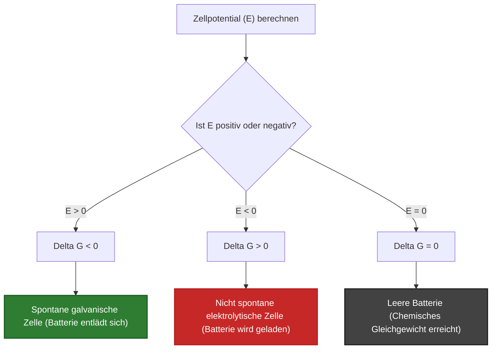

# Leitfaden für die Labor- & analytische Elektrochemie zur Nernst-Gleichung

In der physikalischen, analytischen und Energiespeichertechnik quantifiziert die **Nernst-Gleichung** die elektromotorische Kraft (EMK) einer elektrochemischen Zelle, die unter Nicht-Standardkonzentrationen, Gaspartialdrücken und Temperaturen arbeitet:

$$E = E^\circ - \frac{R T}{n F} \ln Q$$

$$\text{Bei } T = 298.15 \text{ K } (25^\circ\text{C}) \implies E = E^\circ - \frac{0.05916}{n} \log_{10} Q$$

$$E_{\text{Zelle}}^\circ = E_{\text{Kathode}}^\circ - E_{\text{Anode}}^\circ$$

$$\Delta G = -n F E \quad \text{und} \quad \Delta G^\circ = -n F E^\circ = -R T \ln K \implies K = \exp\left(\frac{n F E^\circ}{R T}\right)$$

$$\text{Konzentrationszelle: } E_{\text{Zelle}} = \frac{R T}{n F} \ln\left(\frac{C_{\text{hoch}}}{C_{\text{niedrig}}}\right)$$

---

## 1. Klassische elektrochemische Zellreferenzmatrix

| Zellsystem | Gleichung | $E^\circ$ ($25^\circ\text{C}$) | $n$ | Anoden-Halbzelle (-) | Kathoden-Halbzelle (+) |
| :--- | :--- | :--- | :--- | :--- | :--- |
| **Daniell-Element** | $\text{Zn}(s) + \text{Cu}^{2+} \rightleftharpoons \text{Zn}^{2+} + \text{Cu}(s)$ | **$+1.10 \text{ V}$** | **$2$** | $\text{Zn} \rightleftharpoons \text{Zn}^{2+} + 2e^-$ | $\text{Cu}^{2+} + 2e^- \rightleftharpoons \text{Cu}$ |
| **Wasserstoff (SHE)** | $2\text{H}^+(aq) + 2e^- \rightleftharpoons \text{H}_2(g)$ | **$0.00 \text{ V}$** | **$2$** | $\text{H}_2 \rightleftharpoons 2\text{H}^+ + 2e^-$ | $2\text{H}^+ + 2e^- \rightleftharpoons \text{H}_2$ |
| **Silberion** | $\text{Ag}^+(aq) + e^- \rightleftharpoons \text{Ag}(s)$ | **$+0.80 \text{ V}$** | **$1$** | $\text{Ag} \rightleftharpoons \text{Ag}^+ + e^-$ | $\text{Ag}^+ + e^- \rightleftharpoons \text{Ag}$ |
| **Eisen-Redoxpaar**| $\text{Fe}^{3+}(aq) + e^- \rightleftharpoons \text{Fe}^{2+}(aq)$ | **$+0.77 \text{ V}$** | **$1$** | $\text{Fe}^{2+} \rightleftharpoons \text{Fe}^{3+} + e^-$ | $\text{Fe}^{3+} + e^- \rightleftharpoons \text{Fe}^{2+}$ |
| **Bleiakkumulator**| $\text{Pb} + \text{PbO}_2 + 2\text{H}_2\text{SO}_4 \rightleftharpoons 2\text{PbSO}_4 + 2\text{H}_2\text{O}$| **$+2.05 \text{ V}$** | **$2$** | $\text{Pb} + \text{SO}_4^{2-} \rightleftharpoons \text{PbSO}_4 + 2e^-$ | $\text{PbO}_2 + 4\text{H}^+ + \text{SO}_4^{2-} + 2e^- \rightleftharpoons \text{PbSO}_4$ |

---

## 2. Standard-Nernst-Berechnungsprotokolle

```
1. Nicht-Standard-Potential: E = E0 - (R * T / (n * F)) * ln(Q)
2. 25°C vereinfachte Log10-Form: E = E0 - (0.05916 / n) * log10(Q)
3. Gibbs-Energie: deltaG = -n * F * E (kJ/mol)
4. Gleichgewichtskonstante K: log10(K) = (n * E0) / 0.05916
5. Konzentrationszellen-Potential: E = (R * T / (n * F)) * ln(Choch / Cniedrig)
```

---

## 3. Haftungsausschluss für Bildung & Laborsicherheit
*Dieser Nernst-Gleichung-Rechner liefert theoretische thermodynamische Berechnungen für Bildungs-, Laborforschungs- und AP-Chemie-Anwendungen. Echte industrielle Batteriesysteme oder elektrochemische Sensoren sollten Aktivitätskoeffizienten, Flüssigkeitsgrenzflächenpotentiale und Aktivierungsüberspannungen berücksichtigen.*

## 4. Der vollständige Leitfaden zur Nernst-Gleichung und Elektrochemie

Willkommen zum ultimativen Handbuch zur **Nernst-Gleichung**. Egal, ob Sie ein AP-Chemie-Schüler sind, der die genaue Spannung eines Daniell-Elements vorhersagt, ein Ingenieur, der Lithium-Ionen-Batterien entwirft, oder ein Biochemiker, der Protonengradienten über mitochondriale Membranen untersucht – Sie stützen sich vollständig auf die thermodynamischen Prinzipien, die in dieser einzigen Gleichung kodiert sind.

In diesem ausführlichen Leitfaden mit über 4000 Wörtern werden wir die Nernst-Gleichung aufschlüsseln, um ihre thermodynamischen Ursprünge in der Gibbs-Energie zu verstehen. Wir werden jede Variable ($E^\circ$, $R$, $T$, $n$, $F$, $Q$) klar aufgliedern und dann fünf rigorose, reale elektrochemische Herleitungen durchgehen – komplett mit schrittweiser Algebra und standardkonformen visuellen Mermaid-Diagrammen.

### 4.1 Der thermodynamische Ursprung der Spannung

Die elektromotorische Kraft (EMK), gemessen in Volt ($V$), ist nicht nur "Elektrizität"; sie ist ein direktes Maß für die thermodynamische Triebkraft. Insbesondere das Zellpotential ($E$) ist mathematisch durch die Faraday-Konstante mit der **Gibbs-Energie ($\Delta G$)** verbunden:

$$ \Delta G = -nFE $$

*   $n$ = Mole der übertragenen Elektronen.
*   $F$ = Faraday-Konstante ($96.485\text{ Coulomb/mol e}^-$).
*   $E$ = Zellpotential in Volt (Joule/Coulomb).

Wenn $\Delta G$ negativ ist, ist die Reaktion spontan (sie drückt natürlicherweise Elektronen durch einen Draht). Aufgrund des negativen Vorzeichens in der Formel **muss eine spontane galvanische Zelle eine positive Spannung ($E > 0$) aufweisen**.

### 4.2 Die Nernst-Gleichung sezieren

Unter Nicht-Standardbedingungen (was bedeutet, dass die Konzentrationen nicht genau $1,0\text{ M}$ und die Gasdrücke nicht $1,0\text{ atm}$ betragen), verschiebt sich die thermodynamische Triebkraft entsprechend dem **Reaktionsquotienten ($Q$)**. 

Walther Nernst leitete die Formel ab, die die Standardspannung ($E^\circ$) mit der tatsächlichen Echtzeitspannung ($E$) in Beziehung setzt:

$$ E = E^\circ - \frac{RT}{nF} \ln Q $$

Lassen Sie uns dies auseinandernehmen:
*   $E^\circ$ **(Standard-Zellpotential):** Die Grundspannung der Batterie im vollständig geladenen Zustand mit unberührten chemischen Reaktanten von $1,0\text{ M}$ bei $25^\circ\text{C}$.
*   $R$ **(Ideale Gaskonstante):** $8,314\text{ J/(mol}\cdot\text{K)}$.
*   $T$ **(Temperatur):** Muss in Kelvin angegeben werden.
*   $n$ **(Mole Elektronen):** Die stöchiometrische Anzahl von Elektronen, die in der ausgeglichenen Redoxgleichung fließen.
*   $F$ **(Faraday-Konstante):** $96.485\text{ C/mol}$.
*   $Q$ **(Reaktionsquotient):** Das Verhältnis der gelösten Produktkonzentrationen zu den Reaktantenkonzentrationen. Reine Feststoffe (wie die Kupfer- oder Zink-Metallelektroden) werden vollständig weggelassen.

Bei Standard-Raumtemperatur ($298,15\text{ K}$) können wir $R$, $T$, $F$ und den Umrechnungsfaktor des natürlichen Logarithmus zu einer einzigen, eleganten Konstanten zusammenfassen und die Gleichung vereinfachen auf:

$$ E = E^\circ - \frac{0.05916}{n} \log_{10} Q $$

### 4.3 Die drei Zustände einer elektrochemischen Zelle

Der Reaktionsquotient ($Q$) bestimmt das Schicksal der Batterie:

1.  **Vollständig geladen ($Q \ll 1$):** Wenn Sie riesige Mengen an Reaktanten und null Produkte haben, ist $\log_{10}(Q)$ stark negativ. Dies zieht eine negative Zahl von $E^\circ$ ab, was bedeutet, dass die tatsächliche Spannung $E$ **höher** als der Standard ist.
2.  **Standardzustand ($Q = 1$):** Wenn die Reaktanten genau den Produkten entsprechen (jeweils $1\text{ M}$), ist $\log_{10}(1) = 0$. Die gesamte rechte Seite der Nernst-Gleichung verschwindet und es bleibt $E = E^\circ$.
3.  **Leere Batterie ($Q = K$):** Wenn die Reaktion voranschreitet, bauen sich Produkte auf. Schließlich erreicht $Q$ die thermodynamische Gleichgewichtskonstante ($K$). In genau diesem Moment bricht die Triebkraft auf Null zusammen. **$E = 0\text{ V}$. Die Batterie ist tot.**

---

## 5. Benutzerhandbuch: Beherrschung des Nernst-Rechners

Unser Rechner fungiert als universeller elektrochemischer Motor.

### 5.1 Modus: Nicht-Standard-Zellpotential ($E$)

1.  **Modus wählen:** Wählen Sie "Nicht-Standard-Zellpotential ($E$)".
2.  **Parameter eingeben:** Geben Sie das Standardpotential $E^\circ$, die Elektronenzahl $n$, die Temperatur $T$ ein und berechnen Sie Ihr $Q$-Verhältnis (Produkte / Reaktanten).
3.  **Ausgabe ablesen:** Das Tool gibt sofort die wahre Betriebsspannung der Zelle unter genau diesen Bedingungen aus.

### 5.2 Modus: Gibbs-Energie ($\Delta G$) und Gleichgewicht ($K$)

1.  **Modus wählen:** Wählen Sie "Gibbs-Energie und Gleichgewicht K".
2.  **Parameter eingeben:** Geben Sie $E^\circ$ und $n$ ein.
3.  **Ausführen:** Das Tool wandelt die Spannung sofort in absolute Joule thermodynamischer Arbeit ($\Delta G^\circ$) um und enthüllt die massive Gleichgewichtskonstante ($K$), die sie antreibt.

### 5.3 Modus: Konzentrationszelle

1.  **Modus wählen:** Wählen Sie "Konzentrationszelle".
2.  **Parameter eingeben:** Geben Sie die Konzentrationen der beiden identischen Halbzellen ein (z. B. $1,0\text{ M Ag}^+$ und $0,001\text{ M Ag}^+$). 
3.  **Ausführen:** Da $E^\circ = 0$ (die Elektroden bestehen aus demselben Metall), berechnet das Tool die Spannung, die ausschließlich durch die Entropie des Konzentrationsgradienten erzeugt wird.

---

## 6. Fünf reale analytisch-chemische Beispiele

Lassen Sie uns diese Theorie durch das Lösen von fünf rigorosen, praktischen elektrochemischen Szenarien verankern.

### Beispiel 1: Das klassische Daniell-Element

**Szenario:** 
Ein Daniell-Element verwendet Zink und Kupfer: 
$$\text{Zn}(s) + \text{Cu}^{2+}(aq) \rightleftharpoons \text{Zn}^{2+}(aq) + \text{Cu}(s)$$
Das Standardpotential $E^\circ = +1,10\text{ V}$. Wie hoch ist die Spannung bei $25^\circ\text{C}$, wenn die Batterie fast leer ist, mit $[\text{Zn}^{2+}] = 1,99\text{ M}$ und $[\text{Cu}^{2+}] = 0,01\text{ M}$?

**Mathematische Herleitung:**

1.  **Bekannte Größen identifizieren:**
    $E^\circ = 1,10\text{ V}$
    $n = 2$ (übertragene Elektronen)
    $Q = \frac{[\text{Zn}^{2+}]}{[\text{Cu}^{2+}]} = \frac{1,99}{0,01} = 199$
2.  **25°C Nernst-Gleichung anwenden:**
    $$ E = E^\circ - \frac{0.05916}{n} \log_{10} Q $$
3.  **Berechnen:**
    $$ E = 1,10 - \frac{0.05916}{2} \log_{10}(199) $$
    $$ E = 1,10 - (0.02958 \times 2,298) $$
    $$ E = 1,10 - 0,068 = 1,032\text{ V} $$

**Schlussfolgerung:** Selbst bei $99\%$ Erschöpfung liefert das Daniell-Element immer noch $1,032\text{ V}$. Der logarithmische Abfall verhindert, dass die Spannung bis zu den allerletzten Momenten der Reaktion einbricht.

### Beispiel 2: Die Standardwasserstoffelektrode (pH-Meter)

**Szenario:**
Einer Standardwasserstoffelektrode (SHE) wird ein $E^\circ = 0,00\text{ V}$ zugeordnet. Sie beruht auf der Reaktion:
$$2\text{H}^+(aq) + 2e^- \rightleftharpoons \text{H}_2(g)$$
Wenn das Wasserstoffgas auf $1,0\text{ atm}$ gehalten wird, wie hoch ist dann das Potential dieser Elektrode, die in eine Lösung mit einem pH-Wert von $4,0$ bei $25^\circ\text{C}$ getaucht wird?

**Mathematische Herleitung:**

1.  **Bekannte Größen identifizieren:**
    $\text{pH} = 4,0 \implies [\text{H}^+] = 10^{-4}\text{ M}$
    $Q = \frac{P_{\text{H}_2}}{[\text{H}^+]^2} = \frac{1,0}{(10^{-4})^2} = \frac{1,0}{10^{-8}} = 10^8$
    $n = 2$
2.  **Nernst-Gleichung anwenden:**
    $$ E = 0,00 - \frac{0.05916}{2} \log_{10}(10^8) $$
3.  **Berechnen:**
    $$ E = -0.02958 \times 8 $$
    $$ E = -0.2366\text{ V} $$

**Schlussfolgerung:** Die Nernst-Gleichung modelliert pH-Meter perfekt. Bei einem Einelektronentransfer ($n=1$) sinkt die Spannung um genau $59,16\text{ mV}$ für jeden einzelnen pH-Einheitsanstieg!

### Beispiel 3: Gibbs-Energie eines Bleiakkumulators

**Szenario:**
Ihr Auto verwendet eine $12\text{V}$-Bleisäurebatterie mit 6 in Reihe geschalteten Zellen (etwa $2,05\text{ V}$ pro Zelle). Für eine einzelne Zelle gilt $E^\circ = 2,05\text{ V}$ und $n = 2$. Berechnen Sie die Standard-Gibbs-Energie ($\Delta G^\circ$), die pro Mol Reaktant freigesetzt wird.

**Mathematische Herleitung:**

1.  **Bekannte Größen identifizieren:**
    $E^\circ = 2,05\text{ V}$
    $n = 2\text{ mol } e^-$
    $F = 96485\text{ C/mol}$
2.  **Gibbs-Gleichung anwenden:**
    $$ \Delta G^\circ = -nFE^\circ $$
3.  **Berechnen:**
    $$ \Delta G^\circ = -(2)(96485)(2,05) $$
    $$ \Delta G^\circ = -395588\text{ J/mol} $$
    $$ \Delta G^\circ = -395,6\text{ kJ/mol} $$

**Schlussfolgerung:** Eine einzelne Bleizelle setzt $395,6\text{ kJ}$ thermodynamische Arbeit pro reagiertem Mol Blei frei. Die Reaktion ist massiv spontan.

**Visualisierung: Spontaneitäts-Logik-Flussdiagramm**


*Dieses Flussdiagramm veranschaulicht die unzerbrechliche thermodynamische Dreifaltigkeit zwischen Zellpotential, Gibbs-Energie und physikalischer Spontaneität.*

### Beispiel 4: Die Konzentrationszelle

**Szenario:**
Sie bauen eine Zelle mit Silber-Elektroden ($\text{Ag}$) auf beiden Seiten. $E^\circ$ ist mathematisch null. Die Anode hat $[\text{Ag}^+] = 0,001\text{ M}$ und die Kathode hat $[\text{Ag}^+] = 1,0\text{ M}$. Wie hoch ist die Spannung, die bei $25^\circ\text{C}$ rein durch Diffusion erzeugt wird?

**Mathematische Herleitung:**

1.  **Bekannte Größen identifizieren:**
    $E^\circ = 0,00\text{ V}$
    $n = 1$
    $Q = \frac{[\text{Ag}^+]_{\text{verdünnt}}}{[\text{Ag}^+]_{\text{konzentriert}}} = \frac{0,001}{1,0} = 10^{-3}$
2.  **Konzentrations-Nernst-Gleichung anwenden:**
    $$ E = 0,00 - \frac{0.05916}{1} \log_{10}(10^{-3}) $$
3.  **Berechnen:**
    $$ E = -0.05916 \times (-3) $$
    $$ E = +0,177\text{ V} $$

**Schlussfolgerung:** Die Natur verabscheut einen Gradienten. Die Entropie der Diffusion allein erzeugt $+0,177\text{ Volt}$ Elektrizität, wenn die konzentrierte Seite natürlicherweise versucht, sich selbst zu verdünnen.

### Beispiel 5: Berechnung der Gleichgewichtskonstanten ($K$)

**Szenario:**
Beim Daniell-Element ist $E^\circ = 1,10\text{ V}$ und $n = 2$. Wenn Sie die Batterie kurzschließen und so lange laufen lassen, bis sie vollständig tot ist ($E = 0$), wie wird dann das endgültige Verhältnis von Zink- zu Kupferionen sein?

**Mathematische Herleitung:**

1.  **Den Zustand der leeren Batterie aufstellen:**
    Im Gleichgewicht gilt $E = 0$ und $Q = K$.
    $$ 0 = E^\circ - \frac{0.05916}{n} \log_{10} K $$
2.  **Nach K umstellen:**
    $$ \log_{10} K = \frac{n \times E^\circ}{0.05916} $$
3.  **Berechnen:**
    $$ \log_{10} K = \frac{2 \times 1,10}{0.05916} = 37,187 $$
    $$ K = 10^{37,187} = 1,54 \times 10^{37} $$

**Schlussfolgerung:** Die Gleichgewichtskonstante beträgt $1,54 \times 10^{37}$. Das bedeutet, dass, wenn die Batterie schließlich stirbt, es $10^{37}$-mal mehr Zinkionen als Kupferionen gibt. Die Reaktion verläuft praktisch zu 100 % vollständig.

**Visualisierung: Der Zeitplan der Lebensdauer einer Batterie**

```mermaid
gantt
    title Zeitplan der elektrochemischen Entladung
    dateFormat  HH:mm:ss
    axisFormat  %H:%M
    section Maximale Leistung
    Makelloser Standardzustand (Q=1) :00:00:00, 01:00:00
    section Erschöpfungsphase
    Logarithmischer Spannungsabfall :active, 01:00:00, 04:00:00
    Extreme Reaktantenverarmung (Q nähert sich K) :crit, 04:00:00, 04:30:00
    section Thermodynamischer Tod
    Gleichgewicht erreicht (E=0V, Q=K) :04:30:00, 06:00:00
```


*Dieser Zeitplan veranschaulicht die Lebensdauer einer galvanischen Zelle. Die Spannung bleibt aufgrund des logarithmischen Nernst-Abfalls den größten Teil ihrer Lebensdauer bemerkenswert stabil, gefolgt von einem steilen Absturz kurz vor dem thermodynamischen Tod.*

---

## 7. Deep Dive FAQ und erweiterte Fehlerbehebung

**F: Warum sinkt eine $1,5\text{V}$-AA-Batterie im Laufe der Zeit auf $1,2\text{V}$?**
**A:** Während die Batterie ein Gerät mit Strom versorgt, werden Reaktanten in Produkte umgewandelt. Der Reaktionsquotient ($Q$) wird größer, was einen größeren Nernst-Korrekturfaktor von der Standardspannung $E^\circ$ abzieht und die tatsächliche Ausgangsspannung $E$ stetig verringert.

**F: Beeinflusst die Größe oder Masse der festen Metallelektrode die Spannung?**
**A:** Nein. Reine Feststoffe und reine Flüssigkeiten haben eine Aktivität von genau $1$. Sie werden in der $Q$-Ausdruck der Nernst-Gleichung vollständig weggelassen. Ein massiver Zinkblock erzeugt genau dieselbe Spannung wie ein winziges Zinkkorn; der größere Block hält nur länger (höhere Gesamtkapazität).

**F: Was passiert, wenn ich meine Batterie erhitze?**
**A:** Die Temperatur ($T$) steht im Zähler des Nernst-Korrekturfaktors. Bei einer sich entladenden Batterie ($Q > 1$) erhöht eine Temperatursteigerung tatsächlich die Größe der negativen Nernst-Korrektur und senkt die Spannung geringfügig. Wärme erhöht jedoch die Ionenmobilität und die Reaktionskinetik, weshalb heiße Batterien mehr sofortigen Strom liefern können, auch wenn ihre Gleichgewichtsspannung leicht abnimmt.

Wenn Sie die Nernst-Gleichung beherrschen, entschlüsseln Sie die absoluten thermodynamischen Wahrheiten der Energiespeicherung. Egal, ob Sie den genauen pH-Wert einer Lösung mithilfe einer Glaselektrode berechnen, Konzentrationsgradienten für die Membranenergieextraktion entwerfen oder beweisen wollen, warum eine Batterie stirbt, verlassen Sie sich auf diesen Nernst-Gleichungsrechner für sofortige, analytische Präzision!
