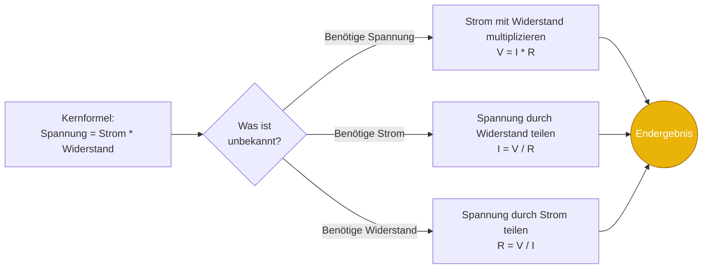
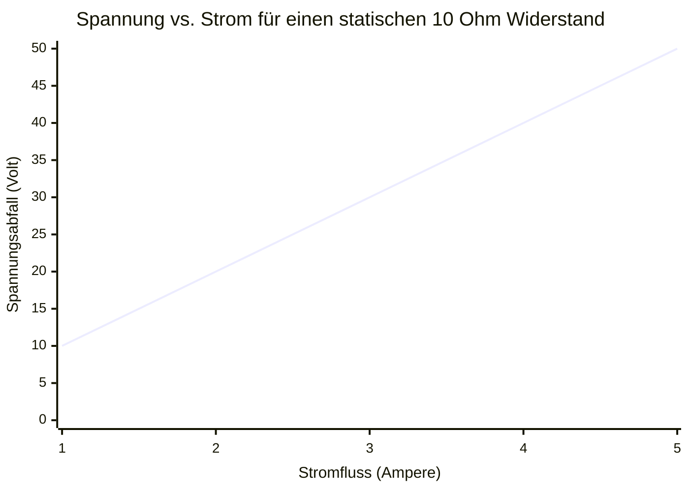
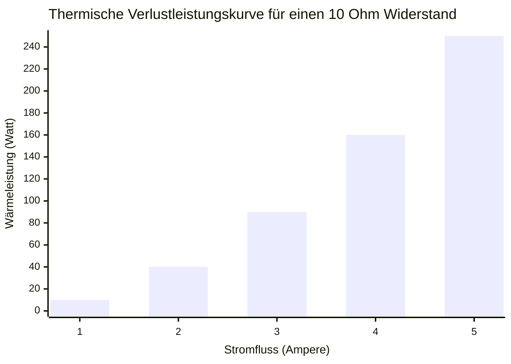
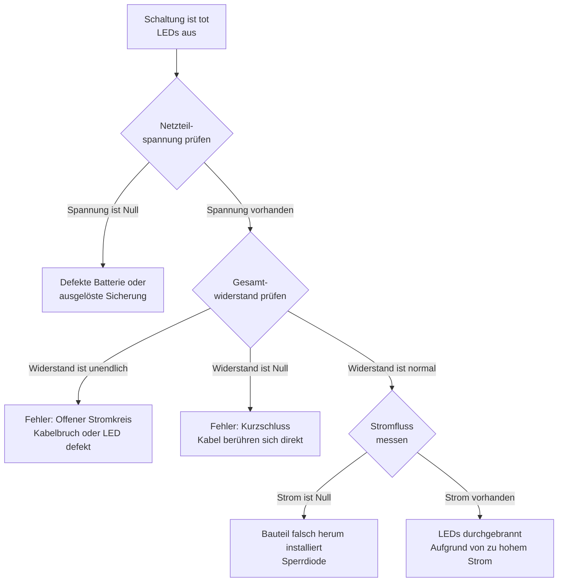

# Der ultimative Ohmsches Gesetz Rechner: Spannung, Strom, Widerstand und elektrische Leistung meistern

Willkommen beim definitiven **Ohmsches Gesetz Rechner** und umfassenden Elektrotechnik-Leitfaden. Egal, ob Sie ein Elektronik-Hobbyist sind, der einen Vorwiderstand für eine Raspberry Pi LED berechnet, ein Physikstudent, der mit Hausaufgaben zur Schaltungsanalyse kämpft, oder ein Meisterelektriker, der den Spannungsabfall über 100 Meter Kupferkabel berechnet – diese interaktive Suite bietet die genauen mathematischen Ableitungen, die Sie benötigen.

Das Ohmsche Gesetz ist das absolute Fundament der gesamten modernen Technologie. Von den mikroskopischen Nanometer-Transistoren tief in der CPU Ihres Smartphones bis hin zu den riesigen Hochspannungsübertragungsleitungen, die das Land überspannen – jedes einzelne elektrische System gehorcht perfekt den Beziehungen zwischen Spannung ($V$), Strom ($I$), Widerstand ($R$) und Leistung ($P$).

In diesem ausführlichen, SEO-optimierten Leitfaden mit über 4.000 Wörtern werden wir die fundamentalen Formeln ($V = IR$ und $P = VI$) tiefgehend analysieren. Wir werden die Physik der Jouleschen Wärme erforschen, das archaische 4-Ring-Widerstands-Farbcode-System entschlüsseln, die Kirchhoffschen Regeln mathematisch beweisen und fünf detaillierte konzeptionelle elektrische Szenarien analysieren, die durch interaktive Mermaid.js Diagramme visuell dargestellt werden.

---

## 1. Die Dreifaltigkeit dekonstruieren: Spannung, Strom und Widerstand

Um die Elektronik zu meistern, müssen Sie die Beziehung zwischen den drei Kernvariablen des Ohmschen Gesetzes intuitiv verstehen. Die häufigste und treffendste Analogie, die von Physikern verwendet wird, ist das **Wasserrohrmodell**.

### Spannung ($V$): Der Wasserdruck
**Spannung**, offiziell bekannt als *elektrische Potenzialdifferenz*, ist die Kraft, die Elektronen durch einen Stromkreis drückt.
- In unserem Wassermodell ist die Spannung der **Wasserdruck** im Rohr (oder die Höhe des Wasserturms).
- Je höher die Spannung, desto stärker werden die Elektronen gedrückt.
- **SI-Einheit:** Volt ($\text{V}$).

### Strom ($I$): Die Wasserdurchflussrate
**Strom** ist der tatsächliche physikalische Fluss elektrischer Ladung (Elektronen) an einem bestimmten Punkt in einem Stromkreis über die Zeit.
- In unserem Wassermodell ist der Strom das **Wasservolumen**, das pro Sekunde aus dem Rohr fließt (Gallonen pro Minute).
- **SI-Einheit:** Ampere ($\text{A}$). Ein Ampere entspricht einem Coulomb an Ladung ($6,242 \times 10^{18}$ Elektronen), das jede Sekunde an einem Punkt vorbeifließt.

### Widerstand ($R$): Die Rohrverengung
**Widerstand** ist der inhärente Widerstand, den ein Material dem Fluss von elektrischem Strom entgegensetzt.
- In unserem Wassermodell ist der Widerstand die **Enge des Rohrs** oder ein physisches Ventil, das den Fluss einschränkt.
- Ein dünner Draht hat einen hohen Widerstand; ein dicker Draht hat einen geringen Widerstand.
- **SI-Einheit:** Ohm ($\Omega$).

---

## 2. Das Ohmsche Gesetz definieren ($V = I \cdot R$)

1827 vom deutschen Physiker Georg Simon Ohm veröffentlicht, verbindet das Ohmsche Gesetz diese drei Variablen mathematisch miteinander. Es besagt, dass der Strom, der durch einen statischen Leiter fließt, direkt proportional zur anliegenden Spannung und umgekehrt proportional zu seinem Widerstand ist.

$$V = I \cdot R$$

Aus dieser einzigen algebraischen Gleichung können wir die anderen beiden durch einfache Umstellung ableiten:
- **Nach Strom auflösen:** $I = \frac{V}{R}$ (Wenn Sie den Widerstand erhöhen, sinkt der Strom. Wenn Sie die Spannung erhöhen, steigt der Strom).
- **Nach Widerstand auflösen:** $R = \frac{V}{I}$ (Wenn ein Gerät bei einer hohen Spannung nur sehr wenig Strom zieht, muss es einen massiven Innenwiderstand haben).

---

## 3. Die Gefahr von Leistung und Joulescher Wärme ($P = VI$)

Während das Ohmsche Gesetz ($V = IR$) diktiert, wie sich Elektronen bewegen, diktiert die **elektrische Leistungsformel** ($P = VI$) die thermodynamischen Konsequenzen dieser Bewegung.

Die elektrische **Leistung ($P$)** ist die Rate, mit der elektrische Energie in eine andere Energieform umgewandelt wird – normalerweise mechanische Arbeit (Motoren), Licht (LEDs) oder am häufigsten thermische Wärme. Die SI-Einheit für Leistung ist das **Watt ($\text{W}$)**.

$$P = V \cdot I$$

Durch algebraische Kombination des Ohmschen Gesetzes ($V = IR$) mit der Leistungsformel ($P = VI$) können wir zwei unglaublich nützliche Varianten der Leistungsgleichung ableiten:

1. **Leistung über Strom und Widerstand:** $P = I^2 \cdot R$
2. **Leistung über Spannung und Widerstand:** $P = \frac{V^2}{R}$

### Die quadratische Regel der Jouleschen Wärme
Schauen Sie sich die Gleichung $P = I^2 \cdot R$ genau an. Beachten Sie, dass der Strom ($I$) quadriert wird. Das bedeutet, wenn Sie den Strom verdoppeln, der durch eine Schaltungsleitung fließt, verdoppelt sich die als rohe Wärme abgegebene Leistung nicht nur – sie **vervierfacht** sich.
Wenn Sie den Strom verdreifachen, erhöht sich die Wärme um das Neunfache!

Genau aus diesem Grund übertragen Stromversorger Strom über weite Strecken mit extrem hohen Spannungen (wie $500.000\text{ Volt}$). Indem sie die Spannung auf astronomische Werte hochschrauben, können sie die gleiche Gesamtmenge an Leistung ($P = VI$) übertragen, während sie den Strom ($I$) extrem niedrig halten. Niedriger Strom minimiert die $I^2 R$ Wärmeverluste in den Stromleitungen vollständig.

---

## 4. Das Widerstands-Farbcode-System entschlüsseln

Beim Aufbau von physischen Schaltungen auf einem Steckbrett verwenden Sie kleine bedrahtete Widerstände. Da diese zylindrischen Bauteile zu klein sind, um Zahlen lesbar darauf zu drucken, hat die Elektronikindustrie standardisierte farbige Streifen eingeführt, um den Widerstandswert in Ohm anzugeben.

Unser Rechner verfügt über einen eingebauten Visualisierer, aber hier ist die manuelle Entschlüsselungslogik für standardmäßige **4-Ring-Widerstände**:
1. **Ring 1 (Erste Ziffer):** Die erste signifikante Stelle.
2. **Ring 2 (Zweite Ziffer):** Die zweite signifikante Stelle.
3. **Ring 3 (Multiplikator):** Die Zehnerpotenz, mit der die ersten beiden Ziffern multipliziert werden.
4. **Ring 4 (Toleranz):** Die Fertigungspräzision des Widerstands.

**Beispielrechnung:** Ein Widerstand hat Ringe in den Farben: **Rot, Violett, Orange, Gold**.
- Rot = 2
- Violett = 7
- Orange = Multiplikator von $1.000$ (oder $10^3$)
- Gold = Toleranz von $\pm 5\%$
- **Ergebnis:** $27 \times 1.000 = 27.000\ \Omega$ (oder $27\text{ k}\Omega$) mit einem Toleranzbereich von $5\%$.

---

## 5. Umfassender Bedienungsfaden: Den Rechner maximieren

Unser interaktiver Ohmsches Gesetz Rechner fungiert als robustes digitales Multimeter und Schaltungssimulator.

### Schritt 1: Wählen Sie Ihre Zielvariable
Nutzen Sie die obere Navigation, um die unbekannte Variable auszuwählen, die Sie berechnen müssen:
- **Spannung ($V$):** Berechnen Sie die Potentialdifferenz über einem bekannten Widerstand.
- **Strom ($I$):** Bestimmen Sie, wie viele Ampere Ihre Schaltung vom Netzteil ziehen wird.
- **Widerstand ($R$):** Berechnen Sie den benötigten Widerstand, um den Strom sicher zu begrenzen (z. B. für eine LED).
- **Leistung ($P$):** Berechnen Sie die thermische Verlustleistung, um sicherzustellen, dass Ihr Widerstand kein Feuer fängt.

### Schritt 2: Nutzen Sie reale Schaltungsvoreinstellungen
Überspringen Sie die manuelle Dateneingabe, indem Sie aus unseren 8 integrierten Voreinstellungen wählen. Müssen Sie den maximalen sicheren Strom für einen Standard-USB-Anschluss berechnen? Wählen Sie **USB 5V**, und der Rechner füllt sofort $V = 5,0\text{V}$ aus und zeichnet dynamisch die Stromkurven auf.

### Schritt 3: Überwachen Sie die Anzeige der Wärmeableitung
Immer wenn Sie die Leistung ($P$) berechnen, beobachten Sie die interaktive thermodynamische Anzeige.
Standard-Steckbrett-Widerstände sind nur für **$0,25\text{ Watt}$** ($250\text{ mW}$) ausgelegt. Wenn Ihre berechnete Leistung $0,25\text{W}$ überschreitet, wird die Anzeige rot und warnt Sie, dass das physische Bauteil durchbrennen und ausfallen wird. Sie müssen entweder die Spannung verringern, den Widerstand erhöhen oder einen physisch größeren Widerstand kaufen, der für eine höhere Wattzahl ausgelegt ist (z. B. einen $1\text{W}$ oder $5\text{W}$ Keramikwiderstand).

---

## 6. Fünf konzeptionelle Ingenieurszenarien mit 2D-Visualisierungen

Um die mathematischen Zusammenhänge der Gleichstromkreistheorie vollständig zu beherrschen, werden wir fünf verschiedene physikalische Szenarien untersuchen, die visuell anhand benutzerdefinierter Mermaid.js-Diagramme aufgeschlüsselt werden. *(Alle Diagramme wurden strikt für die Mermaid 11.16 Parser-Sicherheit optimiert).*

### Beispiel 1: Die Logik der Formel des Ohmschen Gesetzes (Nach Variablen auflösen)

**Das Szenario:**
Ein Elektrotechnikstudent im ersten Semester muss die algebraischen Permutationen des Ohmschen Gesetzes ($V = IR$) schnell visualisieren, um mehrere Prüfungsfragen zu lösen.

**2D Visualisierung:**
Dieses Logikflussdiagramm veranschaulicht die klassische Variablenisolationstechnik für Spannung, Strom und Widerstand.

---

### Beispiel 2: Lineare Spannung vs. Strom (Fester Widerstand)

**Das Szenario:**
Sie haben einen festen, statischen $10\ \Omega$ Keramikwiderstand auf Ihrem Schreibtisch. Sie schließen ihn an ein regelbares Labornetzteil an. Wenn Sie den Stromregler langsam aufdrehen (von $1\text{A}$ auf $5\text{A}$), wie genau reagiert die Spannung über dem Widerstand?

**Die Mathematik:**
Da $R = 10$, gilt $V = I \cdot 10$. Die Beziehung ist vollkommen linear.
- Bei $1\text{A}$: $V = 1 \cdot 10 = 10\text{V}$
- Bei $5\text{A}$: $V = 5 \cdot 10 = 50\text{V}$

**2D Visualisierung:**
Dieses Diagramm zeigt die perfekt gerade, lineare Linie, die für rein ohmsche Lasten charakteristisch ist.

---

### Beispiel 3: Die quadratische Verlustleistungskurve (Joulesche Wärme)

**Das Szenario:**
Unter Verwendung genau desselben $10\ \Omega$ Widerstands und Netzteils aus Beispiel 2 möchten wir nun die gesamte erzeugte Wärme (Leistung) verfolgen, während wir den Stromregler von $1\text{A}$ auf $5\text{A}$ aufdrehen.

**Die Mathematik:**
Wir verwenden die Formel für die Joulesche Wärme $P = I^2 \cdot R$. Beachten Sie, dass der Strom quadriert wird!
- Bei $1\text{A}$: $P = (1 \cdot 1) \cdot 10 = 10\text{W}$
- Bei $2\text{A}$: $P = (2 \cdot 2) \cdot 10 = 40\text{W}$
- Bei $5\text{A}$: $P = (5 \cdot 5) \cdot 10 = 250\text{W}$

**2D Visualisierung:**
Dieses Balkendiagramm zeigt drastisch, wie die Wärmeerzeugung exponentiell mit zunehmendem Strom außer Kontrolle gerät, was beweist, warum Kurzschlüsse Drähte sofort schmelzen lassen.

---

### Beispiel 4: Diagnostisches Flussdiagramm für einen toten Stromkreis

**Das Szenario:**
Ein Elektroniktechniker sucht nach Fehlern in einer benutzerdefinierten LED-Matrix, die sich nicht einschalten lässt. Er benötigt ein systematisches, logisches Vorgehen basierend auf dem Ohmschen Gesetz, um die Fehlerquelle zu identifizieren.

**2D Visualisierung:**
Dieses Flussdiagramm skizziert die Standardvorgehensweise zur Verwendung eines Multimeters, um die Integrität von Spannung, Widerstand und Strom zu überprüfen.

---

### Beispiel 5: Gantt-Diagramm für die Laborkalibrierung

**Das Szenario:**
Ein Physiklabor an der Universität verlangt von den Studenten, das Ohmsche Gesetz experimentell mithilfe von hochpräzisen Digitalmultimetern, regelbaren Netzteilen und Widerstandsdekaden zu überprüfen.

**2D Visualisierung:**
Dieses Gantt-Diagramm skizziert die streng reglementierten chronologischen Schritte, die erforderlich sind, um die physische Hardwarekalibrierung sicher durchzuführen, ohne die empfindlichen internen Sicherungen der Multimeter durchbrennen zu lassen.

```mermaid
gantt
    title Hardware-Kalibrierungssequenz für das Ohmsche Gesetz Experiment
    dateFormat  HH:mm:ss
    axisFormat  %H:%M:%S
    
    section Hardware-Setup
    Überprüfen, ob Netzteil AUS ist :done, 00:00:00, 5s
    Widerstand an Klemmen anschließen :active, 00:00:05, 10s
    
    section Multimeter-Vorbereitung
    Voltmeter parallel konfigurieren :active, 00:00:15, 15s
    Amperemeter in Reihe konfigurieren :crit, 00:00:30, 20s
    
    section Datenerfassung
    Netzteil einschalten :done, 00:00:50, 5s
    Spannung durchlaufen & Stromdaten loggen :active, 00:00:55, 30s
    Widerstand berechnen (Spannung geteilt durch Strom) :milestone, 00:01:25, 5s
```

---

## 7. Häufig gestellte Fragen (FAQ) Deep Dive

**F: Gilt das Ohmsche Gesetz für LEDs und Dioden?**
**A:** Nein, nicht direkt. Das Ohmsche Gesetz gilt nur perfekt für "ohmsche" Bauteile (wie Widerstände und Standardkabel), bei denen der Widerstand konstant bleibt. LEDs sind nichtlineare Halbleiterdioden; ihr Widerstand sinkt drastisch, wenn die Spannung steigt. Sie müssen das Ohmsche Gesetz auf den *Vorwiderstand* in Reihe mit der LED anwenden, um den Strom zu regeln ($R = (V_{versorgung} - V_{led}) / I_{led}$).

**F: Was genau ist ein Kurzschluss?**
**A:** Ein Kurzschluss tritt auf, wenn ein Weg mit geringem Widerstand die vorgesehene elektrische Last umgeht. Weil $I = V/R$, schießt der Strom ($I$) mathematisch gegen unendlich, wenn der Widerstand ($R$) nahe null abfällt. Dieser massive Stromanstieg verursacht heftige $I^2 R$ Joulesche Wärme in den Drähten, was die Isolierung schmilzt und Batteriebrände verursacht.

**F: Warum haben Voltmeter einen wahnsinnig hohen Widerstand?**
**A:** Um die Spannung genau zu messen, muss ein Voltmeter parallel zum Bauteil geschaltet werden. Wenn das Voltmeter einen niedrigen Widerstand hätte, würde der Strom den "Weg des geringsten Widerstands" durch das Messgerät nehmen, anstatt durch das Bauteil, was den Stromkreis, den Sie messen wollen, grundlegend verändern würde. Ein hoher Widerstand stellt sicher, dass das Messgerät fast keinen Strom zieht.

**F: Warum haben Amperemeter fast null Widerstand?**
**A:** Ein Amperemeter muss vollständig in Reihe mit dem Stromkreis geschaltet werden, damit $100\%$ des Stroms durch es fließen. Wenn das Amperemeter einen hohen Widerstand hätte, würde es wie ein Flaschenhals wirken, den Strom einschränken und genau die Messung künstlich verringern, die es vornehmen soll.

**F: Was ist der elektrische Leitwert?**
**A:** Der Leitwert ($G$) ist einfach der mathematische Kehrwert des Widerstands ($G = 1 / R$). Er misst, wie leicht Strom fließt, und nicht, wie stark er behindert wird. Die SI-Einheit für den Leitwert ist Siemens ($\text{S}$).

---

## 8. Fazit und Ingenieurs-Herausforderung

Das Ohmsche Gesetz ist das unausweichliche Regelwerk des Stromnetzes des Universums. Jedes Mal, wenn Sie einen Laptop anschließen, eine Taschenlampe einschalten oder ein Elektrofahrzeug laden, gehorchen Millionen von Elektronen blind $V = IR$ und geben Wärme ab über $P = I^2 R$.

Um sicherzustellen, dass Sie diese Konzepte beherrschen, starten Sie unseren interaktiven DC-Simulator und versuchen Sie, die folgenden Herausforderungen zu lösen:
1. **Die geschmolzene LED:** Sie schließen eine rote LED ($2\text{V}$ Durchlassspannung, $20\text{mA}$ optimaler Strom) direkt und ohne Widerstand an eine $9\text{V}$ Batterie an. Sie explodiert sofort. Verwenden Sie das Ohmsche Gesetz, um den genauen Widerstand ($\Omega$) des Schutzwiderstands zu berechnen, den Sie *hätten verwenden sollen*.
2. **Die Heizung:** Eine elektrische Raumheizung ist an eine Standard-US-$120\text{V}$-Steckdose angeschlossen und zieht massive $12,5\text{ Ampere}$ Dauerstrom. Berechnen Sie die gesamte thermische Leistung ($P$) in Watt, die sie in den Raum abgibt.
3. **Der Spannungsabfall im Verlängerungskabel:** Sie legen ein billiges Kupfer-Verlängerungskabel von $100\text{ Fuß}$ in Ihren Garten. Das gesamte Kabel hat einen Widerstand von $2\ \Omega$. Wenn Ihr Elektrowerkzeug $10\text{A}$ Strom zieht, berechnen Sie den genauen Spannungsabfall ($V$), der rein durch den Widerstand des Kabels verloren geht, bevor der Strom das Werkzeug überhaupt erreicht.

Verlassen Sie sich auf diesen Rechner, respektieren Sie die Physik der Jouleschen Wärme und vergessen Sie niemals: Spannung drückt, Widerstand begrenzt und Strom tötet.

