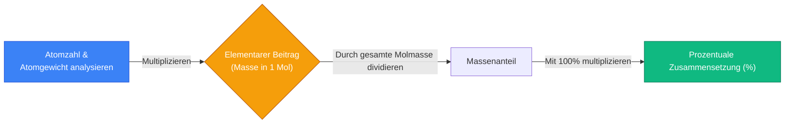
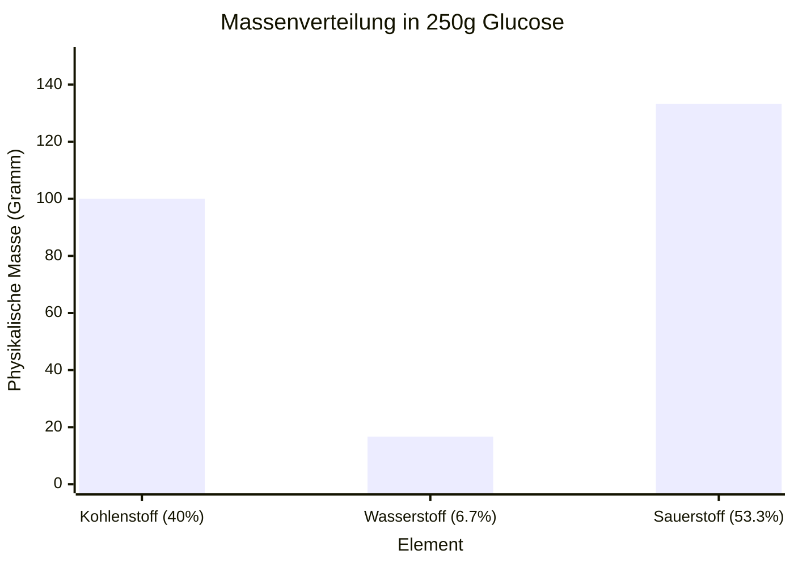
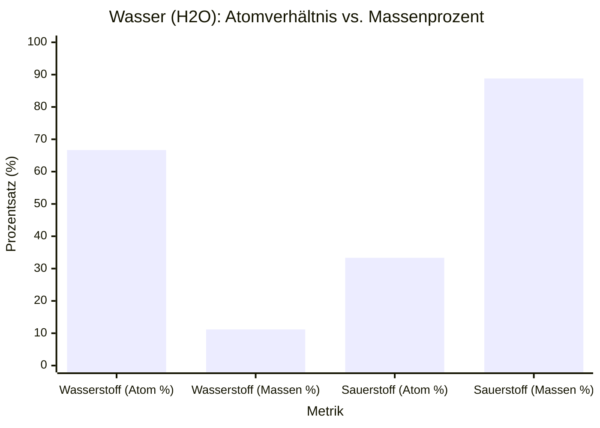
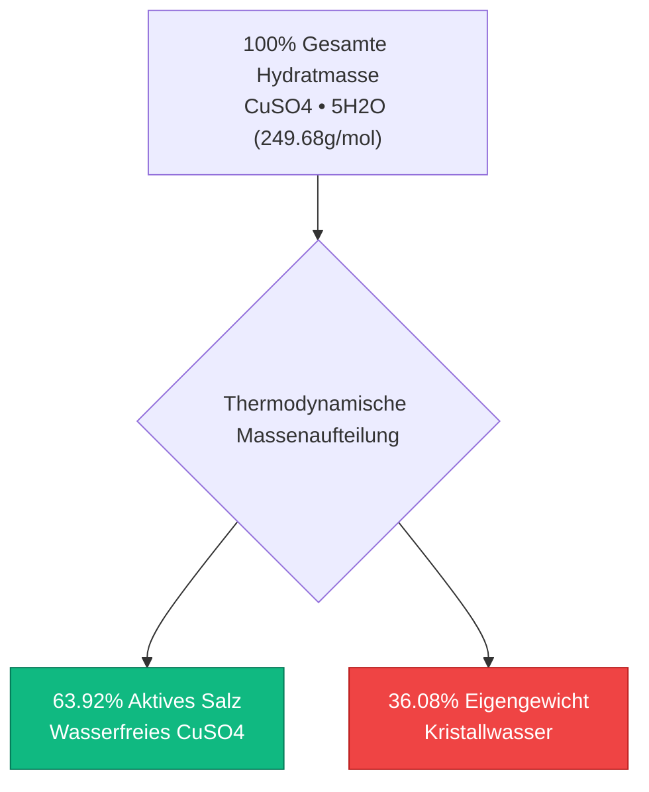
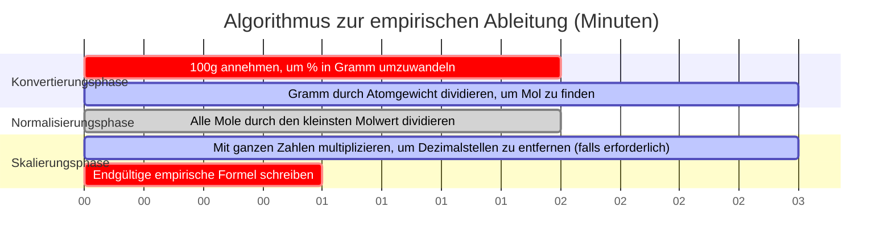

# Der definitive Rechner für die prozentuale Zusammensetzung: Massenanteile und empirische Analyse

Willkommen beim ultimativen **Rechner für die prozentuale Zusammensetzung** und umfassenden Leitfaden für die analytische Chemie. Egal, ob Sie ein Chemiestudent an einem Gymnasium sind, der seine erste empirische Formel entschlüsselt, ein analytischer Chemiker, der Daten aus der elementaren Verbrennungsanalyse verarbeitet, oder ein Pharmaingenieur, der physiologische Medikamentenlösungen entwickelt – die Beherrschung der Mathematik der prozentualen Massenzusammensetzung ist eine absolute Notwendigkeit.

Chemische Formeln diktieren das genaue ganzzahlige Verhältnis von Atomen in einer Verbindung, aber sie repräsentieren NICHT das physikalische Massenverhältnis. Da verschiedene Elemente grundlegend unterschiedliche Atomgewichte besitzen, könnte ein Element, das die Mehrheit der *Atome* in einem Molekül ausmacht, nur den kleinsten Bruchteil seiner *physikalischen Masse* beitragen.

In dieser ausführlichen, über 4000 Wörter umfassenden SEO-Meisterklasse werden wir die mathematischen Algorithmen hinter der prozentualen Zusammensetzung vollständig dekonstruieren, die kritischen Unterschiede zwischen Atomprozent und Massenprozent aufzeigen, das Hydratwasser kristalliner Salze mathematisch abbilden und den schrittweisen Prozess zur Ableitung empirischer Formeln entschlüsseln. Um ein absolutes Verständnis zu gewährleisten, haben wir fünf akribisch detaillierte, parser-sichere interaktive Mermaid.js-Diagramme beigefügt.

---

## 1. Die Mathematik der prozentualen Massenzusammensetzung

Die **prozentuale Massenzusammensetzung** definiert den exakten Prozentsatz der gesamten Molmasse einer chemischen Verbindung, der von jedem Bestandteil-Element beigetragen wird.

Das Gesetz der konstanten Proportionen besagt, dass eine reine chemische Verbindung *immer* das genau gleiche Massenverhältnis ihrer Bestandteil-Elemente enthält, unabhängig davon, ob Sie $1.0\text{ Gramm}$ oder $10.000\text{ Kilogramm}$ der Substanz haben.

**Die Gleichung für die prozentuale Zusammensetzung:**
$$\% \text{Element}_i = \left( \frac{\text{Anzahl der Atome}_i \times \text{Atomgewicht}_i}{\text{Gesamte Molmasse der Verbindung}} \right) \times 100\%$$

### Berechnung der prozentualen Zusammensetzung von Wasser ($\text{H}_2\text{O}$)
Um den Massenprozentsatz von Wasser zu berechnen, müssen wir zunächst seine Molmasse analysieren:
- **Wasserstoff ($\text{H}$):** $2 \text{ Atome} \times 1.008\text{ g/mol} = 2.016\text{ g/mol}$
- **Sauerstoff ($\text{O}$):** $1 \text{ Atom} \times 15.999\text{ g/mol} = 15.999\text{ g/mol}$
- **Gesamte Molmasse ($\text{H}_2\text{O}$): $18.015\text{ g/mol}$**

**Nun wenden wir die Prozentgleichung an:**
- **% Wasserstoff:** $(2.016 / 18.015) \times 100\% = \mathbf{11.19\%}$
- **% Sauerstoff:** $(15.999 / 18.015) \times 100\% = \mathbf{88.81\%}$

Da Prozentsätze in der Summe $100\%$ ergeben müssen, können wir unsere Arbeit mathematisch überprüfen: $11.19\% + 88.81\% = 100.00\%$.

---

## 2. Der kritische Unterschied: Atomprozent vs. Massenprozent

Die häufigste Falle für Chemiestudenten besteht darin, **Atomprozent** mit **Massenprozent** zu verwechseln. Das sind völlig unterschiedliche Konzepte.

Betrachten wir Wasser ($\text{H}_2\text{O}$).
- **Atomprozent:** Wasser hat insgesamt 3 Atome ($2\text{ H}$, $1\text{ O}$). Wasserstoff macht $2/3$ der Atome aus, was ihn zu **$66.7\%$** des Moleküls nach Atomzahl macht.
- **Massenprozent:** Wie oben bewiesen, macht Wasserstoff nur **$11.19\%$** der physikalischen Masse aus.

Warum diese massive Diskrepanz? Weil ein Sauerstoffatom ($15.999\text{ g/mol}$) fast $16\text{-mal schwerer}$ ist als ein Wasserstoffatom ($1.008\text{ g/mol}$). Obwohl Wasserstoff Sauerstoff im Verhältnis $2\text{ zu }1$ übertrifft, dominiert Sauerstoff die physikalische Masse der Verbindung vollständig.

---

## 3. Hydrate und Kristallwasser ($\cdot x\text{H}_2\text{O}$)

Viele ionische Salze absorbieren auf natürliche Weise Wassermoleküle aus der umgebenden Luftfeuchtigkeit und schließen diese Wassermoleküle fest in ihr 3D-Kristallgitter ein. Diese werden als **Hydrate** bezeichnet.

Bei der Berechnung der prozentualen Zusammensetzung eines Hydrats ist es wichtig zu bestimmen, welcher Prozentsatz der gesamten Kristallmasse tatsächlich nur eingeschlossenes Wasser ist.

### Kupfer(II)-sulfat-Pentahydrat ($\text{CuSO}_4\cdot 5\text{H}_2\text{O}$)
- **Wasserfreies Salz ($\text{CuSO}_4$):** $159.602\text{ g/mol}$.
- **Eingeschlossenes Wasser ($5\text{H}_2\text{O}$):** $5 \times 18.015 = 90.075\text{ g/mol}$.
- **Gesamte hydratisierte Molmasse:** $159.602 + 90.075 = \mathbf{249.677\text{ g/mol}}$.

**Prozentsatz an Wasser:**
$$\% \text{Wasser} = \left( \frac{90.075}{249.677} \right) \times 100\% = \mathbf{36.08\%}$$

Wenn Sie $100\text{ lbs}$ $\text{CuSO}_4\cdot 5\text{H}_2\text{O}$ bei einem Chemikalienlieferanten kaufen, bestehen $36.08\text{ lbs}$ dessen, was Sie gekauft haben, buchstäblich nur aus eingeschlossenem Wasser!

---

## 4. Die Brücke zur empirischen Formel

Die prozentuale Zusammensetzung ist die grundlegende analytische Brücke, die erforderlich ist, um eine **empirische Formel** (das einfachste ganzzahlige Verhältnis von Atomen in einer Verbindung) abzuleiten.
Wenn ein analytischer Chemiker eine unbekannte organische Verbindung durch einen Verbrennungsanalysator schickt, gibt die Maschine die prozentuale Massenzusammensetzung aus. Der Chemiker muss dann einen strengen mathematischen Algorithmus ausführen, um diese Prozentsätze wieder in eine chemische Formel umzuwandeln.

**Der Algorithmus zur empirischen Ableitung:**
1. **$100\text{g}$ Probe annehmen:** Behandeln Sie jeden Prozentsatz als physikalische Masse in Gramm (z. B. $40.0\% \text{ Kohlenstoff} = 40.0\text{ Gramm Kohlenstoff}$).
2. **Masse in Mol umwandeln:** Teilen Sie die Masse jedes Elements durch sein spezifisches Atomgewicht aus dem Periodensystem.
3. **Pseudo-Formel ableiten:** Sie haben jetzt eine Formel mit Dezimalstellen (z. B. $\text{C}_{3.33}\text{H}_{6.66}\text{O}_{3.33}$).
4. **Auf ganze Zahlen normalisieren:** Teilen Sie alle Molwerte durch den absolut kleinsten Molwert im Set.
5. **Auf ganze Zahlen skalieren:** Wenn die Normalisierung zu Brüchen führt (wie $.5$ oder $.33$), multiplizieren Sie alle Zahlen mit einer ganzen Zahl ($2$ oder $3$), um perfekt ganze tiefergestellte Zahlen zu erhalten.

---

## 5. Fünf konzeptionelle Engineering-Szenarien mit 2D-Visualisierungen

Um die Algorithmen zur prozentualen Zusammensetzung, Massenverteilung und empirischen Ableitung vollständig zu beherrschen, werden wir fünf verschiedene Szenarien der analytischen Chemie untersuchen, die mithilfe benutzerdefinierter Mermaid.js-Diagramme visuell aufgeschlüsselt werden.

### Beispiel 1: Der Berechnungsalgorithmus für die prozentuale Zusammensetzung

**Das Szenario:**
Ein Informatikstudent versucht, den mathematischen Logikpfad abzubilden, der erforderlich ist, um die prozentuale Zusammensetzung rechnerisch abzuleiten.

**2D-Visualisierung:**
Dieses Logikflussdiagramm bildet den strikten zweigliedrigen Konvertierungspfad ab, der Atomgewichte mit endgültigen Massenprozentsätzen verbindet.

---

### Beispiel 2: Verteilung der Probenmasse (Glucose)

**Das Szenario:**
Ein Ernährungsberater muss bestimmen, wie viele physikalische Gramm Kohlenstoff genau in einem $250.0\text{ Gramm}$ schweren Block aus reiner Glucose ($\text{C}_6\text{H}_{12}\text{O}_6$) enthalten sind.
Da Glucose in Bezug auf die Masse zu genau $40.00\%$ aus Kohlenstoff besteht, multiplizieren wir $250\text{g} \times 0.400 = 100.0\text{g}$.

**2D-Visualisierung:**
Dieses Diagramm beweist grafisch, wie eine makroskopische Gesamtprobenmasse auf der Grundlage ihrer berechneten Massenprozentsätze physikalisch auf ihre Bestandteil-Elemente verteilt wird.

---

### Beispiel 3: Das Paradoxon von Atomprozent vs. Massenprozent

**Das Szenario:**
Ein Chemiestudent im ersten Semester hat Mühe zu verstehen, wie Wasserstoff, der $66.7\%$ der Atome in Wasser ausmacht, nur $11.19\%$ der Masse beitragen kann.

**2D-Visualisierung:**
Dieses direkte Vergleichsdiagramm macht die massive Diskrepanz zwischen Atomzählmetriken und physikalischen Massenmetriken aufgrund extremer Unterschiede im Atomgewicht visuell deutlich.

---

### Beispiel 4: Massenaufschlüsselung des Hydratgitters

**Das Szenario:**
Ein Chemikalienlieferant berechnet die finanzielle Verschwendung beim landesweiten Transport "nasser" chemischer Hydrate, da er Frachtkosten für eingeschlossenes Wasser bezahlt.

**2D-Visualisierung:**
Dieses Top-down-Flussdiagramm bildet die genaue prozentuale Aufschlüsselung von Kupfer(II)-sulfat-Pentahydrat ab und beweist, dass über ein Drittel des Kristallgewichts wirtschaftlich nutzloses Wasser ist.

---

### Beispiel 5: Zeitplan für die Ableitung empirischer Formeln

**Das Szenario:**
Ein analytischer Chemiker extrahiert Massenprozentsätze aus einem Verbrennungsanalysator und führt den strengen mathematischen Algorithmus aus, um die empirische Formel der unbekannten Verbindung abzuleiten.

**2D-Visualisierung:**
Dieses Gantt-Diagramm visualisiert die chronologische Abfolge mathematischer Transformationen, die erforderlich sind, um Prozentsätze wieder in ganzzahlige chemische Indizes umzuwandeln.

---

## 6. Schlussfolgerung und Stöchiometrie-Herausforderung

Die Beherrschung der prozentualen Zusammensetzung ist die unausweichliche Grundlage der gesamten analytischen Chemie. Das Verständnis des strengen Unterschieds zwischen Atomverhältnissen und Massenanteilen, die Berücksichtigung des massiven Dichteeinflusses von eingeschlossenem Hydratwasser und die mathematische Umkehrung von Prozentsätzen in empirische Formeln garantieren, dass Ihre Laboranalyseergebnisse vollkommen präzise sind.

Wenn Sie diese mathematischen Prinzipien ignorieren, werden Sie Reagenzdosierungen drastisch falsch berechnen, ineffiziente chemische Hydrate versenden und bei jeder Massenspektrometrie-Analyse durchfallen, die Sie jemals durchführen.

Um zu garantieren, dass Sie diese kritischen Konzepte beherrschen, starten Sie unseren interaktiven Simulator und versuchen Sie, diese letzten analytischen Chemie-Herausforderungen zu lösen:
1. **Die Düngemittel-Herausforderung:** Welcher landwirtschaftliche Dünger enthält einen höheren Massenprozentsatz an reinem Stickstoff: Ammoniak ($\text{NH}_3$) oder Ammoniumnitrat ($\text{NH}_4\text{NO}_3$)? Sie müssen beides berechnen, um es herauszufinden!
2. **Die Hydrat-Herausforderung:** Sie haben eine $500.0\text{g}$ schwere Probe Magnesiumsulfat-Heptahydrat ($\text{MgSO}_4\cdot 7\text{H}_2\text{O}$). Genau wie viele physikalische Gramm Wasser sind in diesem festen Block eingeschlossen?
3. **Die Empirische Herausforderung:** Ein Verbrennungsanalysator meldet, dass ein unbekanntes Gas zu genau $74.87\%$ aus Kohlenstoff und zu $25.13\%$ aus Wasserstoff in Bezug auf die Masse besteht. Führen Sie den Algorithmus zur empirischen Ableitung aus, um die chemische Formel dieses Gases zu bestimmen. (Hinweis: Es treibt Ihren Herd an).

Verlassen Sie sich auf diesen Rechner, um Ihre analytischen Verbrennungsergebnisse zu überprüfen, die Verteilung der elementaren Nutzlast schnell zu bestimmen und die Mathematik der physikalischen Stöchiometrie dauerhaft zu beherrschen.

