# Labor- & Analytische Chemie-Leitfaden zu pH & Säure-Base-Gleichgewicht

In der analytischen und physikalischen Chemie misst der **pH-Wert** die Wasserstoffionenaktivität in wässrigen Lösungen:

$$\text{pH} = -\log_{10}[\text{H}^+] \quad \iff \quad [\text{H}^+] = 10^{-\text{pH}}$$

$$\text{pH} + \text{pOH} = \text{p}K_w \quad \text{wobei } K_w = [\text{H}^+][\text{OH}^-]$$

---

## 1. Temperaturabhängiger $K_w$ & Neutrale pH-Referenzmatrix

| Temperatur (°C) | Autoionisation von Wasser ($K_w$) | $\text{p}K_w$ | Neutraler pH ($\frac{1}{2}\text{p}K_w$) | Physiologische / Kontextbezogene Anmerkung |
| :--- | :--- | :--- | :--- | :--- |
| **$0^\circ\text{C}$** | $1.14 \times 10^{-15}$ | $14.94$ | **$7.47$** | Gefrierpunkt von Wasser |
| **$25^\circ\text{C}$** | $1.00 \times 10^{-14}$ | $14.00$ | **$7.00$** | Standard-Laborreferenz |
| **$37^\circ\text{C}$** | $2.40 \times 10^{-14}$ | $13.62$ | **$6.81$** | Normale menschliche Körpertemperatur |
| **$60^\circ\text{C}$** | $9.60 \times 10^{-14}$ | $13.02$ | **$6.51$** | Erhitztes Prozesswasser |

---

## 2. Standard-Säure-Base-Berechnungsprotokolle

```
1. Starke Säure (einprotonig): [H+] = C_Säure  ===>  pH = -log10[C_Säure]
2. Starke Base (monohydroxid): [OH-] = C_Base  ===>  pOH = -log10[C_Base]  ===>  pH = pKw - pOH
3. Schwache Säure (HA <==> H+ + A-): Löse x^2 + Ka*x - Ka*C = 0  ===>  pH = -log10(x)
4. Pufferlösung: pH = pKa + log10([Konjugierte Base] / [Schwache Säure])
```

---

## 3. Bildungs- & Laborsicherheitshinweis
*Dieser pH-Rechner bietet theoretische Säure-Base-Gleichgewichtsberechnungen für Bildungszwecke, Laborforschung und AP-Chemie-Anwendungen. Bei konzentrierten, nicht-idealen Lösungen und präzisen analytischen Puffern sollten Ionenstärke und Aktivitätskoeffizienten mithilfe kalibrierter pH-Meter berücksichtigt werden.*

## 4. Der umfassende Leitfaden zu pH und Säure-Base-Chemie

Willkommen beim ultimativen Leitfaden zum Verständnis, zur Berechnung und zur Manipulation des pH-Werts in chemischen Lösungen. Ob Sie ein Schüler sind, der zum ersten Mal etwas über Logarithmen lernt, ein AP-Chemie-Schüler, der sich auf anspruchsvolle Gleichgewichtsprobleme vorbereitet, oder ein Biochemiker, der menschliche Blutpuffersysteme modelliert: Die Beherrschung des pH-Werts ist für das Navigieren in der molekularen Welt unerlässlich.

Im Kern ist der pH-Wert ein Maß dafür, wie sauer oder basisch eine wässrige (wasserbasierte) Lösung ist. Er bestimmt direkt, wie sich Moleküle verhalten, wie sich Enzyme falten und wie industrielle Reaktionen ablaufen. Eine leichte Verschiebung des pH-Werts im menschlichen Blutkreislauf kann tödlich sein, während eine Verschiebung des pH-Werts im Boden darüber entscheiden kann, ob eine ganze Ernte gedeiht oder verdorrt.

In diesem ausführlichen Leitfaden werden wir die tiefgreifende Mechanik der Säure-Base-Chemie erforschen, die logarithmische Mathematik hinter der pH-Skala entpacken, die oft missverstandene Temperaturabhängigkeit der Neutralität erklären und fünf sehr detaillierte, reale Beispiele mit mathematischen Ableitungen und visuellen 2D-Diagrammen durchgehen.

### 4.1 Was genau ist der pH-Wert?

Der Begriff "pH" steht für "potenzial des Wasserstoffs" (oder "Macht des Wasserstoffs"). Es handelt sich um eine logarithmische Skala zur Angabe der Säure oder Basizität einer wässrigen Lösung. Mathematisch gesehen ist der pH-Wert der negative dekadische Logarithmus der molaren Konzentration von Wasserstoffionen ($\text{H}^+$) in einer Lösung.

Da ein bloßes Wasserstoffion (ein einzelnes Proton) in Wasser nicht isoliert existiert, lagert es sich an ein Wassermolekül an, um ein Hydroniumion ($\text{H}_3\text{O}^+$) zu bilden. Zur Vereinfachung bei Berechnungen werden $\text{H}^+$ und $\text{H}_3\text{O}^+$ synonym verwendet.

$$ \text{pH} = -\log_{10}[\text{H}^+] $$

Da die Skala logarithmisch ist, bedeutet eine Änderung um **eine pH-Einheit** eine **zehnfache Änderung** der Wasserstoffionenkonzentration. Eine Lösung mit einem pH-Wert von 3 ist zehnmal saurer als eine Lösung mit einem pH-Wert von 4 und hundertmal saurer als eine Lösung mit einem pH-Wert von 5.

### 4.2 Das Zusammenspiel von pH und pOH

Genauso wie der pH-Wert die Konzentration von Wasserstoffionen misst, misst der **pOH-Wert** die Konzentration von Hydroxidionen ($\text{OH}^-$). 

$$ \text{pOH} = -\log_{10}[\text{OH}^-] $$

In reinem Wasser autoionisieren Wassermoleküle und zerfallen spontan in Wasserstoff- und Hydroxidionen:
$\text{H}_2\text{O} \rightleftharpoons \text{H}^+ + \text{OH}^-$

Die Gleichgewichtskonstante für diese Reaktion wird als Autoionisationskonstante von Wasser, $K_w$, bezeichnet. Bei Standard-Raumtemperatur (25°C) beträgt $K_w$ exakt $1,0 \times 10^{-14}$. 

Dies schafft eine starre mathematische Beziehung zwischen pH und pOH. Bei 25°C gilt:
$$ \text{pH} + \text{pOH} = 14,00 $$

Wenn Sie den pH-Wert kennen, kennen Sie sofort den pOH-Wert und kennen somit die Konzentration beider kritischer Ionen in der Lösung.

### 4.3 Der Temperatur-Mythos: Ist ein neutraler pH-Wert immer 7,00?

Ein weit verbreitetes Missverständnis, das im Einführungsunterricht in Chemie gelehrt wird, ist, dass ein neutraler pH-Wert starr auf 7,00 festgelegt ist. **Dies ist grundlegend falsch.** 

Neutralität bedeutet lediglich, dass die Konzentration von Wasserstoffionen gleich der Konzentration von Hydroxidionen ist ($[\text{H}^+] = [\text{OH}^-]$). Da die Autoionisation von Wasser ein endothermer Prozess ist, treibt eine Erhöhung der Temperatur die Reaktion voran, erzeugt *mehr* Ionen und erhöht somit $K_w$.

*   Bei **0°C** (Gefrierpunkt) sinkt $K_w$ auf $1,14 \times 10^{-15}$. Der neutrale pH-Wert beträgt **7,47**.
*   Bei **25°C** (Raumtemperatur) beträgt $K_w$ $1,0 \times 10^{-14}$. Der neutrale pH-Wert beträgt **7,00**.
*   Bei **37°C** (Körpertemperatur) steigt $K_w$ auf $2,4 \times 10^{-14}$. Der neutrale pH-Wert beträgt **6,81**.

Unser Rechner enthält eine ausgeklügelte temperaturabhängige $K_w$-Engine, die die Skala basierend auf Ihrer eingegebenen Temperatur dynamisch anpasst und so absolute physiologische und thermodynamische Genauigkeit gewährleistet.

---

## 5. Bedienungsanleitung: Den pH-Rechner beherrschen

Unser pH-Rechner ist mit einem "interaktiven Cockpit" ausgestattet, das sowohl sofortige Umrechnungen als auch tiefgreifende algorithmische Löser für komplexe Gleichgewichte bietet.

### 5.1 Direkte logarithmische Umrechnungen

Wenn Sie lediglich zwischen $[\text{H}^+]$, $[\text{OH}^-]$, pH und pOH umrechnen müssen:
1.  **Modus auswählen:** Wählen Sie "pH aus [H+]" oder die entsprechende Umrechnung.
2.  **Wert eingeben:** Sie können die Dezimalnotation (`0.001`) oder die wissenschaftliche Notation (`1e-3`) verwenden.
3.  **Ausgabe ablesen:** Der Rechner füllt sofort alle vier Ecken des Säure-Base-Quadrats (pH, pOH, $[\text{H}^+]$, $[\text{OH}^-]$) aus und klassifiziert die Lösung auf dem 0-14-Spektrum.

### 5.2 Gleichgewicht schwacher Säuren und Basen

Im Gegensatz zu starken Säuren, die zu 100% dissoziieren, dissoziieren schwache Säuren (wie Essigsäure, Essig) nur teilweise. Um ihren pH-Wert zu finden, müssen Sie eine quadratische Gleichung basierend auf der Säuredissoziationskonstante ($K_a$) lösen.
1.  **Modus auswählen:** Wählen Sie "Gleichgewichts-Löser für schwache Säuren".
2.  **Parameter eingeben:** Geben Sie die Anfangskonzentration der Säure ($C$) und ihren $K_a$- (oder $\text{p}K_a$-) Wert ein.
3.  **Ausführen:** Das Tool löst intern die quadratische Gleichung $x^2 + K_a x - K_a C = 0$, um exakt $[\text{H}^+]$ zu finden.

### 5.3 Pufferlösungen und Henderson-Hasselbalch

Puffer widerstehen Änderungen des pH-Werts und sind in der Biologie von entscheidender Bedeutung. 
1.  **Modus auswählen:** Wählen Sie "Henderson-Hasselbalch-Rechner".
2.  **Parameter eingeben:** Geben Sie den $\text{p}K_a$-Wert der schwachen Säure, die Konzentration der konjugierten Base und die Konzentration der schwachen Säure ein.
3.  **Ausführen:** Das Tool wendet die Formel $\text{pH} = \text{p}K_a + \log([\text{Base}]/[\text{Säure}])$ an, um den gepufferten pH-Wert zu ermitteln.

---

## 6. Fünf praxisnahe Konzeptbeispiele

Um die Säure-Base-Chemie wirklich zu beherrschen, müssen Sie sehen, wie diese Prinzipien auf unterschiedliche Szenarien angewendet werden. Nachfolgend finden Sie fünf detaillierte Beispiele, die von Verdünnungen starker Säuren bis hin zu komplexen biochemischen Puffern reichen.

### Beispiel 1: Die starke Säure (Magensäure)

**Szenario:** 
Magensäure im menschlichen Magen enthält konzentrierte Salzsäure ($\text{HCl}$), eine starke Säure, die vollständig dissoziiert, um die Nahrung zu verdauen. Wenn eine Laborprobe künstlicher Magensäure eine $\text{HCl}$-Konzentration von $0,0316\text{ M}$ aufweist, wie hoch ist ihr pH-Wert bei 25°C?

**Mathematische Ableitung:**

1.  **Starke Säure identifizieren:** $\text{HCl}$ dissoziiert vollständig, also $[\text{H}^+] = [\text{HCl}] = 0,0316\text{ M}$.
2.  **pH-Wert berechnen:**
    $$ \text{pH} = -\log_{10}(0,0316) $$
    $$ \text{pH} = 1,50 $$
3.  **pOH und $[\text{OH}^-]$ berechnen:**
    $$ \text{pOH} = 14,00 - 1,50 = 12,50 $$
    $$ [\text{OH}^-] = 10^{-12,50} = 3,16 \times 10^{-13}\text{ M} $$

**Visualisierung: Konzentrationsfluss**


*Da es sich um eine starke Säure handelt, ist die Berechnung ein direkter, linearer mathematischer Schritt. Das tiefe Rot zeigt den hohen Säuregrad an.*

### Beispiel 2: Die schwache Säure (Essig / Essigsäure)

**Szenario:**
Essigsäure ($\text{CH}_3\text{COOH}$) ist der Hauptbestandteil von Essig. Es ist eine schwache Säure mit einem $K_a$-Wert von $1,8 \times 10^{-5}$. Wenn Sie eine $0,10\text{ M}$ Lösung von Essigsäure haben, wie hoch ist der pH-Wert?

**Mathematische Ableitung:**

1.  **ICE-Tabelle (Anfang, Änderung, Gleichgewicht) aufstellen:**
    *   Anfang: $[\text{HA}] = 0,10$, $[\text{H}^+] = 0$, $[\text{A}^-] = 0$
    *   Änderung: $-x$, $+x$, $+x$
    *   Gleichgewicht: $0,10 - x$, $x$, $x$
2.  **Quadratische Gleichung aufstellen:**
    $$ K_a = \frac{x^2}{0,10 - x} = 1,8 \times 10^{-5} $$
    $$ x^2 + (1,8 \times 10^{-5})x - 1,8 \times 10^{-6} = 0 $$
3.  **Nach $x$ ($[\text{H}^+]$) auflösen:**
    Mit der quadratischen Lösungsformel ergibt sich $x \approx 0,00133\text{ M}$.
4.  **pH-Wert berechnen:**
    $$ \text{pH} = -\log_{10}(0,00133) = 2,88 $$

**Visualisierung: Näherung vs. exakte quadratische Lösung**

| Methode | $[\text{H}^+]$ (M) | Berechneter pH | % Fehler |
| :--- | :--- | :--- | :--- |
| **Quadratische Lösungsformel (Exakt)** | $0,001333$ | $2,875$ | $0,00\%$ |
| **Näherung ($0,10 - x \approx 0,10$)** | $0,001341$ | $2,872$ | $0,10\%$ |

*Während die Näherungsmethode oft in der Schule gelehrt wird, verwendet unser Rechner IMMER den exakten quadratischen Löser, um massive Fehler beim Umgang mit stärker verdünnten Lösungen zu vermeiden.*

### Beispiel 3: Der Blutpuffer (Henderson-Hasselbalch)

**Szenario:**
Menschliches Blut wird durch das Kohlensäure-Bicarbonat-System stark gepuffert, um einen strengen pH-Wert aufrechtzuerhalten. Der $\text{p}K_a$-Wert von Kohlensäure ($\text{H}_2\text{CO}_3$) bei Körpertemperatur beträgt 6,10. Bei einem gesunden Patienten beträgt die Konzentration von Bicarbonat ($\text{HCO}_3^-$) $24\text{ mM}$ und die von Kohlensäure $1,2\text{ mM}$. Überprüfen Sie den Blut-pH-Wert.

**Mathematische Ableitung:**

1.  **Formel identifizieren:** Henderson-Hasselbalch-Gleichung.
    $$ \text{pH} = \text{p}K_a + \log_{10}\left(\frac{[\text{Base}]}{[\text{Säure}]}\right) $$
2.  **Werte eingeben:**
    $$ \text{pH} = 6,10 + \log_{10}\left(\frac{24}{1,2}\right) $$
3.  **Berechnen:**
    $$ \text{pH} = 6,10 + \log_{10}(20) $$
    $$ \text{pH} = 6,10 + 1,30 = 7,40 $$

*Das Ergebnis ist genau 7,40, der lehrbuchmäßige ideale pH-Wert für menschliches arterielles Blut.*

### Beispiel 4: Temperaturverschiebung von reinem Wasser

**Szenario:**
Ein Ingenieur überwacht das Kühlwasser in einem Kernreaktor. Das reine, deionisierte Wasser wird bei $60^\circ\text{C}$ betrieben. Das pH-Meter zeigt 6,51 an. Der Ingenieur gerät in Panik und denkt, dass das Wasser aufgrund eines chemischen Lecks gefährlich sauer geworden ist. Ist das Wasser sauer?

**Mathematische Ableitung:**

1.  **$K_w$ bei 60°C identifizieren:** Laut thermodynamischen Tabellen beträgt $K_w$ bei $60^\circ\text{C}$ $9,60 \times 10^{-14}$.
2.  **$[\text{H}^+]$ für reines, neutrales Wasser berechnen:**
    $$ [\text{H}^+] = \sqrt{K_w} = \sqrt{9,60 \times 10^{-14}} = 3,098 \times 10^{-7}\text{ M} $$
3.  **Neutralen pH-Wert berechnen:**
    $$ \text{pH} = -\log_{10}(3,098 \times 10^{-7}) = 6,51 $$

**Fazit:** Das Wasser ist **perfekt neutral**. Der pH-Wert ist einfach niedriger, weil die erhöhte Temperatur die Autoionisation vorangetrieben hat und somit gleiche Mengen SOWOHL von $[\text{H}^+]$ ALS AUCH von $[\text{OH}^-]$ erzeugt hat. Der Ingenieur muss nicht in Panik geraten.

### Beispiel 5: Säureverdünnung (Zeitachse der Reihenverdünnung)

**Szenario:**
Ein Labortechniker nimmt $10\text{ mL}$ einer starken Säure mit einem pH-Wert von 3,00 und verdünnt sie mit reinem Wasser auf ein Endvolumen von $1000\text{ mL}$ (eine 1:100-Verdünnung). Wie hoch ist der neue pH-Wert?

**Mathematische Ableitung:**

1.  **Anfängliches $[\text{H}^+]$ finden:**
    $$ [\text{H}^+]_{\text{Anfang}} = 10^{-3,00} = 0,001\text{ M} $$
2.  **Verdünnung berechnen ($M_1V_1 = M_2V_2$):**
    $$ (0,001\text{ M})(10\text{ mL}) = (M_2)(1000\text{ mL}) $$
    $$ M_2 = 0,00001\text{ M} = 10^{-5}\text{ M} $$
3.  **Neuen pH-Wert berechnen:**
    $$ \text{pH} = -\log_{10}(10^{-5}) = 5,00 $$

**Visualisierung: Zeitachse der Reihenverdünnung im Labor**

```mermaid
gantt
    title Laborzeitachse: Reihenverdünnungsprozess
    dateFormat  HH:mm:ss
    axisFormat  %H:%M
    section Vorbereitung
    Messe 10mL (pH 3.00) :active, 00:00:00, 00:05:00
    Transfer in Messkolben :active, 00:05:00, 00:07:00
    section Verdünnung
    Füge 990mL deionisiertes Wasser hinzu :crit, 00:07:00, 00:15:00
    Homogenisierung / Mischen :active, 00:15:00, 00:20:00
    section Analyse
    Messe neuen pH-Wert (5.00) :milestone, 00:20:00, 00:20:00
```



*Dieses Gantt-Diagramm skizziert die physischen Laborschritte, die mit der mathematischen Berechnung einer Reihenverdünnung einhergehen.*

---

## 7. Deep-Dive-FAQ und erweiterte Fehlerbehebung

**F: Kann der pH-Wert negativ sein?**
**A:** Ja! Es ist ein mathematischer Mythos, dass die pH-Skala absolut bei 0 und 14 endet. Wenn Sie eine hochkonzentrierte starke Säure wie eine $10\text{ M}$ $\text{HCl}$-Lösung haben, beträgt der pH-Wert $-\log(10) = -1,0$. Umgekehrt hat eine $10\text{ M}$ $\text{NaOH}$-Lösung einen pH-Wert von $15,0$.

**F: Warum fragt der Rechner nach der Temperatur?**
**A:** Weil die Autoionisationskonstante von Wasser ($K_w$) stark temperaturabhängig ist. Wenn Sie den pH-Wert einer Base aus ihrer $[\text{OH}^-]$-Konzentration berechnen, erfordert die Formel $\text{pH} = \text{p}K_w - \text{pOH}$ den exakten $\text{p}K_w$-Wert bei dieser spezifischen Temperatur, um analytisch genau zu sein. 

**F: Was ist der Unterschied zwischen $K_a$ und $\text{p}K_a$?**
**A:** $K_a$ ist die Säuredissoziationskonstante, die oft eine sehr kleine Zahl ist (wie $1,8 \times 10^{-5}$). $\text{p}K_a$ ist der negative dekadische Logarithmus von $K_a$ (in diesem Fall 4,74). Es ist viel einfacher, über $\text{p}K_a$-Werte zu sprechen. Denken Sie daran: Je kleiner der $\text{p}K_a$-Wert, desto stärker die Säure!

**F: Wird die unendliche Verdünnung einer Säure diese irgendwann basisch machen?**
**A:** Nein. Wenn Sie eine Säure unendlich mit reinem, neutralem Wasser verdünnen, nähert sich der pH-Wert asymptotisch 7,00, wird diesen jedoch niemals in den basischen Bereich (z. B. pH 8) überschreiten. Bei extrem hohen Verdünnungen (z. B. $10^{-8}\text{ M HCl}$) trägt die Autoionisation des Wassers selbst mehr $[\text{H}^+]$ bei als die Säure, was zur Lösung eine komplexe systematische Gleichgewichtsberechnung erfordert.

**F: Wie verhält sich dies zu Puffern und Titrationen?**
**A:** Die grundlegenden Gleichungen, die dem pH-Wert zugrunde liegen, werden verwendet, um Titrationskurven zu erstellen. Wenn Sie einer schwachen Säure langsam eine starke Base hinzufügen, erzeugen Sie einen Pufferbereich, der bis zum Erreichen des Äquivalenzpunktes von der Henderson-Hasselbalch-Gleichung bestimmt wird. Das Verständnis dieser grundlegenden pH-Umrechnungen ist der erste Schritt zur Beherrschung der Titrationsanalyse.

Indem Sie das mathematische Zusammenspiel zwischen Wasserstoffionen, Hydroxidionen und logarithmischen Skalen beherrschen, erlangen Sie eine tiefgreifende Kontrolle über die chemische Umgebung. Stellen Sie sicher, dass Sie diesen pH-Rechner sowohl als präzises analytisches Werkzeug als auch als pädagogische Absicherung zur Überprüfung Ihrer Laborberechnungen verwenden!
