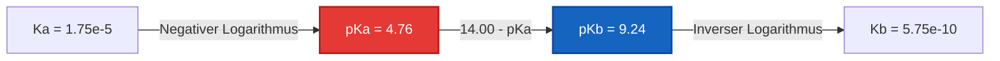

# Labor- & Analytische Chemie-Leitfaden für pKa & Säurestärke-Analyse

In der physikalischen organischen und quantitativen analytischen Chemie quantifiziert **$\text{p}K_a$** die thermodynamische Tendenz einer Säure, in wässrigen Medien zu dissoziieren:

$$\text{p}K_a = -\log_{10}(K_a) \quad \iff \quad K_a = 10^{-\text{p}K_a}$$

$$\text{p}K_a + \text{p}K_b = \text{p}K_w \quad \text{wobei } K_w = K_a \cdot K_b = 1.00 \times 10^{-14} \text{ bei } 25^\circ\text{C}$$

---

## 1. Klassifizierungs- & Referenzmatrix der Säurestärke

| Säurename | Formel | $K_a$ ($25^\circ\text{C}$) | $\text{p}K_a$ ($25^\circ\text{C}$) | Konjugierte Base ($\text{A}^-$) | Stärkeklassifizierung |
| :--- | :--- | :--- | :--- | :--- | :--- |
| **Salzsäure** | $\text{HCl}$ | $\sim 1 \times 10^7$ | **$-7.0$** | $\text{Cl}^-$ | Starke Säure |
| **Salpetersäure** | $\text{HNO}_3$ | $\sim 2.4 \times 10^1$ | **$-1.4$** | $\text{NO}_3^-$ | Starke Säure |
| **Phosphorsäure ($\text{p}K_{a1}$)** | $\text{H}_3\text{PO}_4$ | $7.1 \times 10^{-3}$ | **$2.15$** | $\text{H}_2\text{PO}_4^-$ | Mäßig starke Säure |
| **Essigsäure** | $\text{CH}_3\text{COOH}$ | $1.75 \times 10^{-5}$ | **$4.76$** | $\text{CH}_3\text{COO}^-$ | Schwache Säure |
| **Kohlensäure ($\text{p}K_{a1}$)** | $\text{H}_2\text{CO}_3$ | $4.5 \times 10^{-7}$ | **$6.35$** | $\text{HCO}_3^-$ | Schwache Säure |
| **Blausäure** | $\text{HCN}$ | $6.2 \times 10^{-10}$ | **$9.21$** | $\text{CN}^-$ | Sehr schwache Säure |

---

## 2. Standard-Säuredissoziations-Berechnungsprotokolle

```
1. pKa aus Ka: pKa = -log10(Ka)
2. Ka aus pKa: Ka = 10^(-pKa)
3. Konjugierte Base pKb: pKb = pKw - pKa  ===>  Kb = 10^(-pKb)
4. Gleichgewicht schwacher Säuren: Löse x^2 + Ka*x - Ka*C = 0  ===>  [H+] = x, pH = -log10(x)
5. Henderson-Hasselbalch: pH = pKa + log10([Konjugierte Base A-] / [Schwache Säure HA])
```

---

## 3. Bildungs- & Laborsicherheits-Haftungsausschluss
*Dieser pKa-Rechner bietet theoretische Säuredissoziations-Berechnungen für Bildung, Laborforschung und AP-Chemie-Anwendungen. Nicht-ideale Lösungen bei hohen Ionenstärken sollten Aktivitätskoeffizienten unter Verwendung von Debye-Hückel- oder Pitzer-Gleichungen berücksichtigen.*

## 4. Der umfassende Leitfaden zu pKa und Säurestärke

Willkommen beim ultimativen Leitfaden zum Verstehen, Berechnen und Anwenden von $\text{p}K_a$ in chemischen Systemen. Während der pH-Wert die Azidität einer *Lösung* zu einem bestimmten Moment misst, misst $\text{p}K_a$ die intrinsische Stärke der *Säure selbst*. Ob Sie ein Gymnasiast sind, der über konjugierte Basen lernt, ein analytischer Chemiker, der den Halbäquivalenzpunkt bei einer Titration bestimmt, oder ein Biochemiker, der den Protonierungszustand von Aminosäuren in einem Protein modelliert, die Beherrschung von $\text{p}K_a$ ist unerlässlich.

Im Kern bestimmt $\text{p}K_a$, ob ein Molekül an seinem Proton (Wasserstoffion) festhält oder es an die umgebende Umgebung abgibt. Er steuert die Aufnahme von Pharmazeutika im menschlichen Magen, die Pufferkapazität von Ozeanwasser und die Geschwindigkeit der säurekatalysierten industriellen Synthese.

In diesem ausführlichen Leitfaden werden wir die Thermodynamik der Säuredissoziation erforschen, die logarithmische Mathematik, die $K_a$ auf $\text{p}K_a$ abbildet, entschlüsseln, das komplexe Verhalten mehrprotoniger Säuren (wie Phosphorsäure) detaillieren und durch fünf sehr detaillierte Beispiele aus der realen Welt gehen, komplett mit mathematischen Ableitungen und streng formatierten visuellen Diagrammen.

### 4.1 Was genau ist pKa?

Wenn sich eine Säure (HA) in Wasser löst, erreicht sie einen Gleichgewichtszustand, in dem ein Bruchteil der Säuremoleküle ein Proton an das Wasser abgibt und Hydroniumionen ($\text{H}_3\text{O}^+$) und konjugierte Basen-Ionen ($\text{A}^-$) bildet:
$\text{HA} + \text{H}_2\text{O} \rightleftharpoons \text{H}_3\text{O}^+ + \text{A}^-$

Die Gleichgewichtskonstante für diese spezifische Dissoziation wird als Säuredissoziationskonstante, $K_a$, bezeichnet:
$$ K_a = \frac{[\text{H}^+][\text{A}^-]}{[\text{HA}]} $$

Da $K_a$-Werte für schwache Säuren extrem kleine Zahlen (z.B. $1.8 \times 10^{-5}$ für Essigsäure) mit großen negativen Exponenten sind, verwenden Chemiker eine logarithmische Skala, um sie leichter handhabbar zu machen. Dies ist **$\text{p}K_a$**:
$$ \text{p}K_a = -\log_{10}(K_a) $$

**Die goldene Regel des pKa:** Je kleiner (oder negativer) der $\text{p}K_a$-Wert, desto **stärker** die Säure. 
- Ein $\text{p}K_a$ von -7 (Salzsäure) bedeutet, dass sie ein massiver, aggressiver Protonenspender ist. 
- Ein $\text{p}K_a$ von 4.76 (Essigsäure) bedeutet, dass sie ein schwacher Protonenspender ist. 
- Ein $\text{p}K_a$ von 15.7 (Wasser, das als Säure fungiert) bedeutet, dass es ein unglaublich schlechter Protonenspender ist.

Da die Skala logarithmisch ist, ist eine Säure mit einem $\text{p}K_a$ von 3 **zehnmal stärker** als eine Säure mit einem $\text{p}K_a$ von 4 und hundertmal stärker als eine Säure mit einem $\text{p}K_a$ von 5.

### 4.2 Die konjugierte Wippe: pKa und pKb

Jede Säure (HA) hat eine konjugierte Base ($\text{A}^-$). Wenn die Säure stark ist (sie möchte wirklich ein Proton abgeben), muss ihre konjugierte Base schwach sein (sie möchte wirklich KEIN Proton zurücknehmen). Diese Beziehung wird mathematisch durch die Autoprotolysekonstante des Wassers ($K_w$) festgelegt.

$$ K_a \times K_b = K_w $$
$$ \text{p}K_a + \text{p}K_b = 14.00 \quad (\text{bei } 25^\circ\text{C}) $$

Wenn Sie den $\text{p}K_a$ einer Säure kennen, kennen Sie sofort den $\text{p}K_b$ ihrer konjugierten Base. Wenn beispielsweise Essigsäure einen $\text{p}K_a$ von 4.76 hat, hat das Acetation ($\text{CH}_3\text{COO}^-$) einen $\text{p}K_b$ von 9.24.

### 4.3 Mehrprotonige Säuren: Mehrere Persönlichkeiten

Einige Säuren besitzen mehr als ein abgebbares Proton. Diese werden als **mehrprotonige Säuren** bezeichnet. Die bekanntesten Beispiele sind Schwefelsäure ($\text{H}_2\text{SO}_4$) und Phosphorsäure ($\text{H}_3\text{PO}_4$). 

Mehrprotonige Säuren dissoziieren in diskreten Schritten, und jeder Schritt hat seinen eigenen $K_a$- und $\text{p}K_a$-Wert. 
Für $\text{H}_3\text{PO}_4$:
1.  **$\text{p}K_{a1} = 2.15$**: $\text{H}_3\text{PO}_4 \rightleftharpoons \text{H}_2\text{PO}_4^- + \text{H}^+$
2.  **$\text{p}K_{a2} = 7.20$**: $\text{H}_2\text{PO}_4^- \rightleftharpoons \text{HPO}_4^{2-} + \text{H}^+$
3.  **$\text{p}K_{a3} = 12.35$**: $\text{HPO}_4^{2-} \rightleftharpoons \text{PO}_4^{3-} + \text{H}^+$

Beachten Sie, dass jedes aufeinanderfolgende Proton schwerer zu entfernen ist als das letzte. Dies liegt daran, dass das Entfernen eines positiv geladenen Protons aus einem zunehmend negativ geladenen Molekül deutlich mehr thermodynamische Energie erfordert. Daher ist **$\text{p}K_{a1} < \text{p}K_{a2} < \text{p}K_{a3}$** immer wahr.

---

## 5. Nutzungsleitfaden: Den pKa-Rechner meistern

Unser pKa-Rechner ist ein professionelles Analysewerkzeug, das für schnelle Umrechnungen und komplexes mehrprotoniges Gleichgewichts-Mapping entwickelt wurde.

### 5.1 Direkte Logarithmische Umrechnungen

Wenn Sie einfach $K_a$, $\text{p}K_a$, $K_b$ und $\text{p}K_b$ umrechnen müssen:
1.  **Wählen Sie den Modus:** Wählen Sie "pKa aus Ka" oder "Ka aus pKa".
2.  **Geben Sie den Wert ein:** Sie können die Dezimalnotation (`0.000018`) oder die wissenschaftliche Notation (`1.8e-5`) verwenden.
3.  **Lesen Sie die Ausgabe ab:** Der Rechner vervollständigt sofort das Säure-Basen-Profil, liefert die Parameter der konjugierten Base ($\text{p}K_b$) und klassifiziert die Säurestärke.

### 5.2 Titration und Halbäquivalenz

Der $\text{p}K_a$ wird während einer Titration einer schwachen Säure mit einer starken Base magisch enthüllt.
1.  **Modus wählen:** Wählen Sie "pKa aus gemessenem pH & Konzentration".
2.  **Parameter eingeben:** Geben Sie den pH-Wert der Lösung am **Halbäquivalenzpunkt** ein (der exakte Moment, an dem Sie genau die Hälfte der schwachen Säure neutralisiert haben).
3.  **Ausführen:** Das Werkzeug nutzt die Henderson-Hasselbalch-Gleichung. Da $[\text{A}^-] = [\text{HA}]$ an diesem exakten Punkt ist, ist $\log(1) = 0$, und daher gilt **$\text{pH} = \text{p}K_a$**.

### 5.3 Quadratisches Gleichgewicht Schwacher Säuren

Um den genauen pH-Wert einer in Wasser gelösten schwachen Säure zu finden:
1.  **Modus wählen:** Wählen Sie "Gleichgewichtslöser für schwache Säuren".
2.  **Parameter eingeben:** Geben Sie die Anfangskonzentration ($C$) und den $\text{p}K_a$ ein.
3.  **Ausführen:** Der Rechner wandelt $\text{p}K_a$ in $K_a$ um und löst exakt die quadratische Gleichung $x^2 + K_a x - K_a C = 0$, um die wahre Hydroniumkonzentration zu finden.

---

## 6. Fünf Konzeptbeispiele aus der realen Welt

Um die Säurestärke zu meistern, müssen wir den abstrakten Logarithmus auf physikochemische Systeme anwenden. Nachfolgend finden Sie fünf detaillierte Beispiele, die einfache Umrechnungen, pharmazeutische Pufferung und mehrprotoniges Spezies-Mapping abdecken.

### Beispiel 1: Die klassische Umrechnung (Essigsäure)

**Szenario:** 
Ein Chemieproblem der High School besagt, dass die Säuredissoziationskonstante ($K_a$) von Essigsäure $1.75 \times 10^{-5}$ bei $25^\circ\text{C}$ beträgt. Berechnen Sie ihren $\text{p}K_a$ und den $\text{p}K_b$ des Acetations.

**Mathematische Ableitung:**

1.  **Berechne $\text{p}K_a$:**
    $$ \text{p}K_a = -\log_{10}(1.75 \times 10^{-5}) $$
    $$ \text{p}K_a = 4.757 \approx 4.76 $$
2.  **Berechne $\text{p}K_b$ (Annahme $25^\circ\text{C}$, wo $\text{p}K_w = 14.00$):**
    $$ \text{p}K_b = 14.00 - 4.76 = 9.24 $$
3.  **Berechne $K_b$ des Acetations:**
    $$ K_b = 10^{-9.24} = 5.75 \times 10^{-10} $$

**Visualisierung: Fluss der konjugierten Wippe**



*Dieses einfache Flussdiagramm demonstriert die starre thermodynamische Beziehung zwischen einer schwachen Säure und ihrer konjugierten Base.*

### Beispiel 2: Mehrprotoniges Fraktions-Mapping (Phosphorsäure)

**Szenario:**
Ein Agronom testet eine von Phosphaten gepufferte Bodenprobe. Phosphorsäure ($\text{H}_3\text{PO}_4$) hat drei $\text{p}K_a$-Werte: 2.15, 7.20 und 12.35. Wenn der pH-Wert des Bodens genau 7.20 beträgt, welche ist die dominante Phosphatspezies?

**Mathematische Ableitung:**

1.  **Analysieren Sie den pH im Verhältnis zu den $\text{p}K_a$-Schwellenwerten:**
    - Der pH-Wert des Bodens beträgt 7.20.
    - Dies liegt weit über $\text{p}K_{a1}$ (2.15), was bedeutet, dass das erste Proton vollständig verschwunden ist. Die Spezies ist nicht mehr $\text{H}_3\text{PO}_4$.
    - Dies liegt weit unter $\text{p}K_{a3}$ (12.35), was bedeutet, dass das dritte Proton sicher gebunden ist. Die Spezies ist nicht $\text{PO}_4^{3-}$.
2.  **Bewerten Sie den zweiten Dissoziationsschritt ($\text{p}K_{a2} = 7.20$):**
    Dies ist das Gleichgewicht zwischen $\text{H}_2\text{PO}_4^-$ und $\text{HPO}_4^{2-}$.
3.  **Wenden Sie Henderson-Hasselbalch an:**
    $$ \text{pH} = \text{p}K_{a2} + \log_{10}\left(\frac{[\text{HPO}_4^{2-}]}{[\text{H}_2\text{PO}_4^-]}\right) $$
    $$ 7.20 = 7.20 + \log_{10}\left(\frac{[\text{HPO}_4^{2-}]}{[\text{H}_2\text{PO}_4^-]}\right) $$
    $$ 0 = \log_{10}\left(\frac{[\text{HPO}_4^{2-}]}{[\text{H}_2\text{PO}_4^-]}\right) $$
    $$ 1 = \frac{[\text{HPO}_4^{2-}]}{[\text{H}_2\text{PO}_4^-]} $$

**Schlussfolgerung:** Bei exakt pH 7.20 enthält der Boden eine perfekte 50/50-Mischung aus $\text{H}_2\text{PO}_4^-$ und $\text{HPO}_4^{2-}$. Es gibt keine einzige "dominante" Spezies; sie haben genau die gleiche Konzentration.

### Beispiel 3: Pharmazeutische Absorption (Aspirin)

**Szenario:**
Aspirin (Acetylsalicylsäure) ist eine schwache Säure mit einem $\text{p}K_a$ von 3.5. Medikamente werden im Allgemeinen nur dann durch Lipid-Zellmembranen absorbiert, wenn sie ungeladen (protoniert, $\text{HA}$) sind. Wenn der menschliche Magen einen pH-Wert von 1.5 hat, welcher Prozentsatz des Aspirins liegt in der absorptionsfähigen ($\text{HA}$) Form vor?

**Mathematische Ableitung:**

1.  **Wenden Sie Henderson-Hasselbalch an:**
    $$ \text{pH} = \text{p}K_a + \log_{10}\left(\frac{[\text{A}^-]}{[\text{HA}]}\right) $$
    $$ 1.5 = 3.5 + \log_{10}\left(\frac{[\text{A}^-]}{[\text{HA}]}\right) $$
    $$ -2.0 = \log_{10}\left(\frac{[\text{A}^-]}{[\text{HA}]}\right) $$
2.  **Inverser Logarithmus:**
    $$ 10^{-2.0} = \frac{[\text{A}^-]}{[\text{HA}]} = 0.01 $$
3.  **Prozentsatz berechnen:**
    Das bedeutet, dass auf 1 Molekül $\text{A}^-$ 100 Moleküle $\text{HA}$ kommen.
    $$ \% \text{HA} = \frac{100}{101} \times 100 \approx 99.01\% $$

**Schlussfolgerung:** Da der Magen stark sauer ist (der pH-Wert liegt zwei volle Einheiten unter dem $\text{p}K_a$ des Medikaments), bleiben 99% des Aspirins ungeladen und werden schnell in den Blutkreislauf aufgenommen.

### Beispiel 4: Die Labortitration

**Szenario:**
Ein Student der analytischen Chemie führt eine Titration an einer unbekannten schwachen Säure unter Verwendung einer $0.100\text{ M NaOH}$-Standardlösung durch. Er stellt fest, dass der Äquivalenzpunkt bei exakt $40.0\text{ mL}$ zugegebener Base liegt. Er überprüft seine pH-Meter-Messwerte und stellt fest, dass bei exakt $20.0\text{ mL}$ zugegebener Base der pH-Wert 3.85 betrug. Wie lautet der $K_a$ der unbekannten Säure?

**Mathematische Ableitung:**

1.  **Identifizieren Sie den Halbäquivalenzpunkt:**
    Äquivalenzpunkt = $40.0\text{ mL}$.
    Halbäquivalenzpunkt = $20.0\text{ mL}$.
2.  **Wenden Sie die Halbäquivalenz-Regel an:**
    Am Halbäquivalenzpunkt wurde genau die Hälfte der schwachen Säure in ihre konjugierte Base umgewandelt.
    $[\text{HA}] = [\text{A}^-]$
    Daher ist $\text{pH} = \text{p}K_a$.
3.  **Bestimmen Sie $\text{p}K_a$ und $K_a$:**
    $$ \text{p}K_a = 3.85 $$
    $$ K_a = 10^{-3.85} = 1.41 \times 10^{-4} $$

**Visualisierung: Labor-Zeitplan für die Titration**

```mermaid
gantt
    title Labor-Zeitplan: Titration einer schwachen Säure
    dateFormat  HH:mm:ss
    axisFormat  %H:%M
    section Aufbau
    pH-Meter Kalibrieren :active, 00:00:00, 00:05:00
    Unbekannte Säure Abmessen :active, 00:05:00, 00:10:00
    section Titration
    Base Hinzufügen bis 20mL Halb-Äq :crit, 00:10:00, 00:20:00
    Base Hinzufügen bis 40mL Voll-Äq :crit, 00:20:00, 00:30:00
    section Analyse
    pKa aus Halb-Äq-pH Extrahieren :milestone, 00:30:00, 00:30:00
```



*Dieses Gantt-Diagramm visualisiert den strengen chronologischen Ablauf, der erforderlich ist, um eine Titrationskurve korrekt abzubilden und den pKa-Parameter zu extrahieren.*

### Beispiel 5: pH aus pKa ermitteln (Exakter quadratischer Löser)

**Szenario:**
Ein Student löst $0.050\text{ M}$ einer schwachen organischen Säure ($\text{p}K_a = 4.00$) in reinem Wasser. Was ist der genaue pH-Wert?

**Mathematische Ableitung:**

1.  **Wandle $\text{p}K_a$ in $K_a$ um:**
    $$ K_a = 10^{-4.00} = 1.0 \times 10^{-4} $$
2.  **Stelle die ICE-Tabelle & die quadratische Gleichung auf:**
    $$ K_a = \frac{x^2}{0.050 - x} = 1.0 \times 10^{-4} $$
    $$ x^2 + (1.0 \times 10^{-4})x - 5.0 \times 10^{-6} = 0 $$
3.  **Löse nach $x$ auf ($[\text{H}^+]$):**
    Unter Verwendung der Lösungsformel für quadratische Gleichungen:
    $$ x = \frac{-1.0 \times 10^{-4} + \sqrt{(1.0 \times 10^{-4})^2 - 4(1)(-5.0 \times 10^{-6})}}{2} $$
    $$ x \approx 0.002186\text{ M} $$
4.  **Berechne den pH-Wert:**
    $$ \text{pH} = -\log_{10}(0.002186) = 2.66 $$

**Visualisierung: Exakt vs. Näherung**

| Methode | $[\text{H}^+]$ (M) | Berechneter pH | % Fehler |
| :--- | :--- | :--- | :--- |
| **Quadratische Formel (Exakt)** | $0.002186$ | $2.660$ | $0.00\%$ |
| **Näherung ($0.050 - x \approx 0.050$)** | $0.002236$ | $2.650$ | $0.38\%$ |

*Während die Näherung nah herankommt, führt sie einen Fehler ein. Unser Rechner nutzt immer den exakten quadratischen Algorithmus, um fehlerfreie analytische Präzision zu gewährleisten.*

---

## 7. Deep Dive FAQ und Erweiterte Fehlerbehebung

**F: Kann ein pKa-Wert negativ sein?**
**A:** Ja, absolut. Ein negativer $\text{p}K_a$-Wert zeigt eine starke Säure an. Da $\text{p}K_a = -\log_{10}(K_a)$ ist, ergibt ein $K_a$-Wert größer als 1 (was bedeutet, dass die Säure die Dissoziation stark begünstigt) einen negativen $\text{p}K_a$-Wert. Zum Beispiel hat Salzsäure ($\text{HCl}$) einen $\text{p}K_a$ von ungefähr -7.

**F: Warum wird pKa gegenüber Ka in der organischen Chemie bevorzugt?**
**A:** Bequemlichkeit und Linearität. Die Diskussion der Säurestärke mit Zahlen wie 4.76 und 9.24 ist weitaus einfacher als der Vergleich von $1.75 \times 10^{-5}$ und $5.75 \times 10^{-10}$. Darüber hinaus bildet die Henderson-Hasselbalch-Gleichung $\text{p}K_a$ linear auf die pH-Skala ab, was es Chemikern ermöglicht, den Protonierungszustand eines Moleküls basierend auf dem Umgebungs-pH sofort vorherzusagen.

**F: Ist pKa temperaturabhängig wie pH und pOH?**
**A:** Ja. Die Säuredissoziation ist ein thermodynamischer Gleichgewichtsprozess, der durch $\Delta G^\circ = -RT \ln(K_a)$ gesteuert wird. Da die Temperatur ($T$) in der Gleichung steht, ändert eine Änderung der Temperatur die Gleichgewichtskonstante $K_a$, wodurch sich der $\text{p}K_a$ ändert. Bei vielen schwachen organischen Säuren ist diese Verschiebung jedoch über Standard-Labor-Temperaturbereiche hinweg relativ gering, verglichen mit der massiven Verschiebung, die bei der Autoprotolyse von Wasser ($K_w$) zu beobachten ist.

**F: Was ist die "2er-Regel" in der Pufferchemie?**
**A:** Eine schwache Säure puffert eine Lösung effektiv in einem Bereich von **$\text{p}K_a \pm 1$**. Zum Beispiel ist Essigsäure ($\text{p}K_a = 4.76$) ein guter Puffer zwischen pH 3.76 und 5.76. Außerhalb dieses Bereichs wird das Verhältnis von $[\text{A}^-]$ zu $[\text{HA}]$ zu extrem (größer als 10:1 oder 1:10), und der Puffer verliert schnell seine Fähigkeit, Änderungen des pH-Werts zu widerstehen.

**F: Wie geht dieser Rechner mit mehrprotonigen Säuren um?**
**A:** Unsere Engine für mehrprotonige Fraktionen berechnet die Alpha-Werte ($\alpha_0, \alpha_1, \alpha_2$ usw.), die den Bruchteil der gesamten Säure in jedem Protonierungszustand bei einem bestimmten pH-Wert darstellen. Dies ist entscheidend für die Vorhersage der Ladung komplexer Moleküle wie EDTA oder Aminosäuren in der Biochemie.

Indem Sie die mathematische Eleganz des $\text{p}K_a$ und seine logarithmische Beziehung zur Dissoziation meistern, erlangen Sie die Fähigkeit, den Ausgang von Titrationen, das Verhalten von Puffern und die Absorption von Medikamenten vorherzusagen. Verlassen Sie sich immer auf diesen pKa-Rechner, um Ihre Ableitungen zu überprüfen und analytische Genauigkeit zu garantieren!
