# Labor- & Analytische Chemie-Leitfaden zu pOH & Basengleichgewicht

In der analytischen Chemie und bei Basengleichgewichten misst **pOH** die Hydroxidionenaktivität in wässrigen Lösungen:

$$\text{pOH} = -\log_{10}[\text{OH}^-] \quad \iff \quad [\text{OH}^-] = 10^{-\text{pOH}}$$

$$\text{pH} + \text{pOH} = \text{p}K_w \quad \text{wobei } K_w = [\text{H}^+][\text{OH}^-]$$

---

## 1. Temperaturabhängige $K_w$ & Neutrale pOH Referenzmatrix

| Temperatur (°C) | Wasserautoionisation ($K_w$) | $\text{p}K_w$ | Neutraler pOH ($\frac{1}{2}\text{p}K_w$) | Physiologische / Kontextuelle Notiz |
| :--- | :--- | :--- | :--- | :--- |
| **$0^\circ\text{C}$** | $1.14 \times 10^{-15}$ | $14.94$ | **$7.47$** | Gefrierpunkt von Wasser |
| **$25^\circ\text{C}$** | $1.00 \times 10^{-14}$ | $14.00$ | **$7.00$** | Standard-Laborreferenz |
| **$37^\circ\text{C}$** | $2.40 \times 10^{-14}$ | $13.62$ | **$6.81$** | Normale menschliche Körpertemperatur |
| **$60^\circ\text{C}$** | $9.60 \times 10^{-14}$ | $13.02$ | **$6.51$** | Erhitztes Prozesswasser |

---

## 2. Standard-Berechnungsprotokolle für Basengleichgewichte

```
1. Starke Base (Monohydroxid): [OH-] = C_base  ===>  pOH = -log10[C_base]
2. Starke Base (Dihydroxid z.B. Ca(OH)2): [OH-] = 2 * C_base  ===>  pOH = -log10[2 * C_base]
3. Schwache Base (B + H2O <==> BH+ + OH-): Löse x^2 + Kb*x - Kb*C = 0  ===>  pOH = -log10(x)
4. Basenpufferlösung: pOH = pKb + log10([Konjugierte Säure BH+] / [Schwache Base B])
```

---

## 3. Bildungs- & Laborsicherheits-Haftungsausschluss
*Dieser pOH-Rechner bietet theoretische Basengleichgewichtsberechnungen für Bildungszwecke, Laborforschung und AP-Chemie-Anwendungen. Bei konzentrierten, nicht idealen Lösungen und präzisen analytischen Puffern sollten Ionenstärke und Aktivitätskoeffizienten unter Verwendung kalibrierter Laborausrüstung berücksichtigt werden.*

## 4. Der umfassende Leitfaden zu pOH und Basenchemie

Willkommen beim ultimativen Leitfaden zum Verständnis, zur Berechnung und zur Manipulation des pOH-Wertes in chemischen Lösungen. Während der pH-Wert in der Schulchemie oft im Rampenlicht steht, ist der pOH-Wert sein ebenso wichtiges Gegenstück, das das Verhalten von Basen, alkalischen Lösungen und das grundlegende Gleichgewicht von Wasser selbst bestimmt. Egal, ob Sie ein AP-Chemie-Schüler sind, der die Ionisation schwacher Basen meistert, ein Industriechemiker, der Reinigungsmittel formuliert, oder ein Biologe, der zelluläre Pufferung studiert, die Beherrschung des pOH-Wertes ist entscheidend.

Im Kern ist der pOH-Wert ein Maß für die Alkalität oder Basizität einer wässrigen (wasserbasierten) Lösung. Er quantifiziert direkt die Konzentration von Hydroxidionen ($\text{OH}^-$) und bestimmt, wie basische Moleküle interagieren, Säuren neutralisieren und Verseifungsreaktionen antreiben.

In diesem ausführlichen Leitfaden werden wir die tiefen Mechanismen der Basenchemie untersuchen, die logarithmische Mathematik entpacken, die die pOH-Skala regelt, die kritische Beziehung zwischen pH, pOH und Temperatur klären und fünf sehr detaillierte, reale Beispiele mit mathematischen Ableitungen und visuellen Diagrammen durchgehen.

### 4.1 Was genau ist pOH?

Der Begriff "pOH" steht für "Potenzial von Hydroxid". Es ist eine logarithmische Skala, die verwendet wird, um die Konzentration von Hydroxidionen ($\text{OH}^-$) in einer wässrigen Lösung anzugeben. Mathematisch gesehen ist der pOH der negative dekadische Logarithmus der molaren Konzentration der Hydroxidionen.

$$ \text{pOH} = -\log_{10}[\text{OH}^-] $$

Da die Skala logarithmisch ist, bedeutet eine Änderung um **eine pOH-Einheit** eine **zehnfache Änderung** der Hydroxidionenkonzentration. Eine Lösung mit einem pOH von 3 hat zehnmal mehr Hydroxidionen als eine Lösung mit einem pOH von 4.

Wichtig ist, dass die pOH-Skala das inverse Spiegelbild der pH-Skala ist. Ein *niedriger* pOH bedeutet eine *hohe* Konzentration an Hydroxidionen, was einer stark **basischen (alkalischen)** Lösung entspricht. Ein *hoher* pOH-Wert zeigt eine niedrige Hydroxidkonzentration an, was bedeutet, dass die Lösung sauer ist.

### 4.2 Die untrennbare Bindung: pOH, pH und $K_w$

In reinem Wasser autoionisieren Wassermoleküle auf natürliche Weise und spalten sich spontan in Wasserstoff- und Hydroxidionen:
$\text{H}_2\text{O} \rightleftharpoons \text{H}^+ + \text{OH}^-$

Die Gleichgewichtskonstante für diese wichtige Reaktion ist die Autoionisationskonstante von Wasser, $K_w$. Bei Standard-Raumtemperatur (25°C) beträgt $K_w$ genau $1.0 \times 10^{-14}$.

Da $K_w = [\text{H}^+][\text{OH}^-]$, erhalten wir durch Bilden des negativen Logarithmus auf beiden Seiten die wichtigste Gleichung in der Säure-Base-Chemie. Bei 25°C:
$$ \text{pH} + \text{pOH} = 14.00 $$

Diese starre mathematische Bindung bedeutet, dass Sie die Konzentration von Hydroxid nicht ändern können, ohne die Konzentration von Wasserstoff umgekehrt zu beeinflussen. Wenn Sie den pOH berechnen, kennen Sie augenblicklich den pH-Wert.

### 4.3 Temperaturabhängigkeit: Die 14.00-Regel brechen

Eine häufige Falle im Chemieunterricht ist die Annahme, dass $\text{pH} + \text{pOH}$ immer 14.00 entspricht. **Das gilt nur bei exakt 25°C.**

Da die Autoionisation von Wasser eine endotherme Reaktion ist (sie nimmt Wärme auf), verschiebt eine Erhöhung der Temperatur das Gleichgewicht nach rechts und erzeugt *mehr* $\text{H}^+$- und $\text{OH}^-$-Ionen. Dies erhöht $K_w$ und verringert entsprechend $\text{p}K_w$.

*   Bei **0°C** (nahe dem Gefrierpunkt) sinkt $K_w$ auf $1.14 \times 10^{-15}$. $\text{pH} + \text{pOH} = \textbf{14.94}$.
*   Bei **25°C** (Standardlabor) ist $K_w$ $1.0 \times 10^{-14}$. $\text{pH} + \text{pOH} = \textbf{14.00}$.
*   Bei **37°C** (menschlicher Körper) steigt $K_w$ auf $2.4 \times 10^{-14}$. $\text{pH} + \text{pOH} = \textbf{13.62}$.

Unser fortschrittlicher pOH-Rechner verfügt über eine dynamische temperaturabhängige $K_w$-Engine, die diese Konstanten basierend auf der von Ihnen angegebenen Temperatur automatisch korrigiert und so fehlerfreie Präzision für Nicht-Standard-Bedingungen gewährleistet.

---

## 5. Bedienungsanleitung: Den pOH-Rechner meistern

Unser pOH-Rechner ist um ein "Interaktives Cockpit" herum aufgebaut und bietet Ihnen Zugang zu einfachen logarithmischen Umrechnungen sowie zu fortschrittlichen ICE-Tabellen-Quadratiklösern für das Gleichgewicht schwacher Basen.

### 5.1 Direkte logarithmische Umrechnungen

Wenn Sie schnell zwischen $[\text{OH}^-]$, $[\text{H}^+]$, pOH und pH umrechnen müssen:
1.  **Wählen Sie den Modus:** Wählen Sie "pOH aus [OH-]" oder die entsprechende Umrechnung.
2.  **Geben Sie den Wert ein:** Geben Sie Ihren Wert mit Standard-Dezimalzahlen (`0.005`) oder in wissenschaftlicher Notation (`5e-3`) ein.
3.  **Lesen Sie die Ausgabe ab:** Der Rechner füllt sofort alle Parameter aus und klassifiziert die Lösung (Basisch, Neutral oder Sauer) auf dem logarithmischen Spektrum.

### 5.2 Gleichgewicht schwacher Basen ($K_b$-Löser)

Im Gegensatz zu starken Basen (wie $\text{NaOH}$), die zu 100% dissoziieren, reagieren schwache Basen (wie Ammoniak, $\text{NH}_3$) nur teilweise mit Wasser, um Hydroxid zu bilden. Sie müssen ein quadratisches Gleichgewicht basierend auf der Basendissoziationskonstante ($K_b$) lösen.
1.  **Modus wählen:** Wählen Sie "Gleichgewichts-Löser für schwache Basen".
2.  **Parameter eingeben:** Geben Sie die Anfangskonzentration der Base ($C$) und ihr $K_b$ (oder $\text{p}K_b$) ein.
3.  **Ausführen:** Der Rechner löst intern die exakte quadratische Gleichung $x^2 + K_b x - K_b C = 0$, um das wahre $[\text{OH}^-]$ zu finden.

### 5.3 Basenpuffer und Henderson-Hasselbalch

Basische Pufferlösungen (wie Ammoniak/Ammonium) widerstehen Änderungen des pH/pOH-Wertes, wenn kleine Mengen starker Säure oder Base hinzugefügt werden.
1.  **Modus wählen:** Wählen Sie "Basenpuffer pOH Löser".
2.  **Parameter eingeben:** Geben Sie den $\text{p}K_b$ der schwachen Base, die Konzentration der konjugierten Säure (z.B. $\text{NH}_4^+$) und der schwachen Base (z.B. $\text{NH}_3$) ein.
3.  **Ausführen:** Das Tool verwendet die Basenform der Henderson-Hasselbalch-Gleichung: $\text{pOH} = \text{p}K_b + \log([\text{Säure}]/[\text{Base}])$.

---

## 6. Fünf reale Konzeptbeispiele

Das Verständnis der abstrakten Mathematik des pOH erfordert praktische, reale Anwendung. Im Folgenden finden Sie fünf umfassende Beispiele, die starke Dihydroxidbasen, schwache Basengleichgewichte, Puffer und serielle Verdünnungen abdecken.

### Beispiel 1: Die starke Dihydroxidbase (Calciumhydroxid)

**Szenario:** 
Calciumhydroxid, $\text{Ca(OH)}_2$, auch bekannt als Löschkalk, ist eine starke Base, die in der Wasseraufbereitung verwendet wird. Wenn eine Wasseraufbereitungsanlage eine $0.015\text{ M}$ Lösung von $\text{Ca(OH)}_2$ bei 25°C herstellt, wie hoch ist der pOH und der pH-Wert?

**Mathematische Ableitung:**

1.  **Identifizieren Sie die Dihydroxid-Dissoziation:** $\text{Ca(OH)}_2$ produziert **zwei** Hydroxidionen pro Formeleinheit.
    $$ [\text{OH}^-] = 2 \times [\text{Ca(OH)}_2] $$
    $$ [\text{OH}^-] = 2 \times 0.015\text{ M} = 0.030\text{ M} $$
2.  **pOH berechnen:**
    $$ \text{pOH} = -\log_{10}(0.030) $$
    $$ \text{pOH} = 1.52 $$
3.  **pH berechnen:**
    $$ \text{pH} = 14.00 - 1.52 = 12.48 $$

**Visualisierung: Dihydroxid-Konzentrationsfluss**


*Beachten Sie, dass Calciumhydroxid, da es zwei Mol Hydroxid pro Mol Base liefert, trotz der relativ geringen Molarität eine stark alkalische Lösung (pH 12.48) ergibt.*

### Beispiel 2: Die schwache Base (Ammoniak / Fensterreiniger)

**Szenario:**
Ammoniak ($\text{NH}_3$) ist der Wirkstoff in vielen Glasreinigern. Es ist eine schwache Base mit einem $K_b$ von $1.8 \times 10^{-5}$. Wenn ein handelsüblicher Fensterreiniger eine Ammoniakkonzentration von $0.25\text{ M}$ hat, wie hoch ist sein pOH?

**Mathematische Ableitung:**

1.  **ICE-Tabelle für die Basenhydrolyse einrichten:**
    $\text{NH}_3 + \text{H}_2\text{O} \rightleftharpoons \text{NH}_4^+ + \text{OH}^-$
    *   Anfang: $[\text{NH}_3] = 0.25$, $[\text{NH}_4^+] = 0$, $[\text{OH}^-] = 0$
    *   Änderung: $-x$, $+x$, $+x$
    *   Gleichgewicht: $0.25 - x$, $x$, $x$
2.  **Quadratische Gleichung aufstellen:**
    $$ K_b = \frac{x^2}{0.25 - x} = 1.8 \times 10^{-5} $$
    $$ x^2 + (1.8 \times 10^{-5})x - 4.5 \times 10^{-6} = 0 $$
3.  **Nach $x$ ($[\text{OH}^-]$) auflösen:**
    Mit der quadratischen Lösungsformel ergibt sich $x \approx 0.00211\text{ M}$.
4.  **pOH berechnen:**
    $$ \text{pOH} = -\log_{10}(0.00211) = 2.68 $$

**Visualisierung: Quadratische Genauigkeit**

| Methode | $[\text{OH}^-]$ (M) | Berechneter pOH | % Fehler |
| :--- | :--- | :--- | :--- |
| **Quadratische Formel (Exakt)** | $0.002112$ | $2.675$ | $0.00\%$ |
| **Näherung ($0.25 - x \approx 0.25$)** | $0.002121$ | $2.673$ | $0.07\%$ |

*Unser Rechner verwendet strikt den exakten quadratischen Löser, um Fehlerfortpflanzungen zu vermeiden, die in verdünnteren Lösungen bei der Verwendung der Näherungsmethode auftreten.*

### Beispiel 3: Der basische Puffer (Ammoniak/Ammonium)

**Szenario:**
Ein analytischer Chemiker benötigt einen alkalischen Puffer, um ein Instrument zu kalibrieren. Er bereitet eine Lösung vor, die $0.10\text{ M}$ Ammoniak ($\text{NH}_3$, schwache Base) und $0.05\text{ M}$ Ammoniumchlorid ($\text{NH}_4\text{Cl}$, konjugierte Säure) enthält. Der $\text{p}K_b$ von Ammoniak ist 4.74. Finden Sie den pOH.

**Mathematische Ableitung:**

1.  **Formel identifizieren:** Basenform der Henderson-Hasselbalch-Gleichung.
    $$ \text{pOH} = \text{p}K_b + \log_{10}\left(\frac{[\text{Konjugierte Säure}]}{[\text{Schwache Base}]}\right) $$
2.  **Werte eingeben:**
    $$ \text{pOH} = 4.74 + \log_{10}\left(\frac{0.05}{0.10}\right) $$
3.  **Berechnen:**
    $$ \text{pOH} = 4.74 + \log_{10}(0.5) $$
    $$ \text{pOH} = 4.74 - 0.30 = 4.44 $$

*Die Lösung hat einen pOH von 4.44, was bedeutet, dass es sich um einen basischen Puffer handelt (pH = 9.56).*

### Beispiel 4: Neutralisationsreaktion

**Szenario:**
Ein Student verschüttet versehentlich $50\text{ mL}$ $0.20\text{ M NaOH}$ (starke Base) auf einem Labortisch. Er versucht, es zu neutralisieren, indem er $100\text{ mL}$ $0.05\text{ M HCl}$ (starke Säure) darüber gießt. Ist die resultierende Pfütze sicher (neutral)? Finden Sie den finalen pOH.

**Mathematische Ableitung:**

1.  **Anfangsmol berechnen:**
    Mol an $\text{OH}^- = (0.050\text{ L}) \times (0.20\text{ mol/L}) = 0.010\text{ Mol}$
    Mol an $\text{H}^+ = (0.100\text{ L}) \times (0.05\text{ mol/L}) = 0.005\text{ Mol}$
2.  **Neutralisation durchführen (Subtraktion):**
    $\text{OH}^-$ ist im Überschuss vorhanden. 
    Verbleibendes $\text{OH}^- = 0.010 - 0.005 = 0.005\text{ Mol}$.
3.  **Neue Konzentration berechnen:**
    Gesamtvolumen $= 50\text{ mL} + 100\text{ mL} = 150\text{ mL} = 0.150\text{ L}$
    $$ [\text{OH}^-] = \frac{0.005\text{ Mol}}{0.150\text{ L}} = 0.0333\text{ M} $$
4.  **Finalen pOH berechnen:**
    $$ \text{pOH} = -\log_{10}(0.0333) = 1.48 $$

**Fazit:** Die Pfütze ist stark basisch (pH = 12.52) und immer noch gefährlich! Der Student hat nicht genug Säure verwendet, um das Verschüttete vollständig zu neutralisieren.

### Beispiel 5: Serielle Verdünnung einer Base

**Szenario:**
Ein Labortechniker nimmt $5\text{ mL}$ einer starken Base mit einem pOH von 2.00 ($[\text{OH}^-] = 0.01\text{ M}$) und verdünnt diese mit reinem Wasser auf ein Endvolumen von $500\text{ mL}$. Wie lautet der neue pOH?

**Mathematische Ableitung:**

1.  **Anfängliches $[\text{OH}^-]$ finden:**
    $$ [\text{OH}^-]_{\text{anfangs}} = 10^{-2.00} = 0.01\text{ M} $$
2.  **Verdünnung berechnen ($M_1V_1 = M_2V_2$):**
    $$ (0.01\text{ M})(5\text{ mL}) = (M_2)(500\text{ mL}) $$
    $$ M_2 = 0.0001\text{ M} = 10^{-4}\text{ M} $$
3.  **Neuen pOH berechnen:**
    $$ \text{pOH} = -\log_{10}(10^{-4}) = 4.00 $$

**Visualisierung: Labor-Zeitplan für serielle Verdünnung**

```mermaid
gantt
    title Labor-Zeitplan: Alkalischer Verdünnungsprozess
    dateFormat  HH:mm:ss
    axisFormat  %H:%M
    section Vorbereitung
    5mL (pOH 2.00) abmessen :active, 00:00:00, 00:03:00
    In Messkolben überführen :active, 00:03:00, 00:05:00
    section Verdünnung
    495mL deionisiertes Wasser hinzufügen :crit, 00:05:00, 00:10:00
    Homogenisierung / Mischen :active, 00:10:00, 00:15:00
    section Analyse
    Neuen pOH messen (4.00) :milestone, 00:15:00, 00:15:00
```



*Das Verdünnen einer Base erhöht ihren pOH-Wert und verschiebt ihn näher an den neutralen Punkt von 7.00.*

---

## 7. Deep Dive FAQ und Erweiterte Fehlerbehebung

**F: Kann der pOH negativ sein?**
**A:** Ja! Genau wie der pH-Wert kann die pOH-Skala für extrem konzentrierte starke Basen unter 0 fallen. Eine $10\text{ M}$ Lösung von $\text{NaOH}$ hat einen pOH von $-\log(10) = -1.0$ (und einen pH von 15.0).

**F: Warum bezieht der Rechner die Temperatur bei pOH-Umrechnungen mit ein?**
**A:** Wenn Sie von pOH in pH umrechnen, verwendet der Rechner die Formel $\text{pH} = \text{p}K_w - \text{pOH}$. Da sich die Autoionisationskonstante von Wasser ($K_w$) signifikant mit der Temperatur ändert, muss der genaue Wert von $\text{p}K_w$ verwendet werden, um analytische Präzision zu gewährleisten, anstatt standardmäßig 14.00 anzunehmen.

**F: Was ist die Beziehung zwischen $K_a$ und $K_b$?**
**A:** Für jedes konjugierte Säure-Base-Paar sind ihre Dissoziationskonstanten durch die Autoionisationskonstante des Wassers verknüpft: $K_a \times K_b = K_w$. In logarithmischer Form: $\text{p}K_a + \text{p}K_b = \text{p}K_w$ (was bei 25°C 14.00 ist).

**F: Wird das Verdünnen einer Base sie jemals sauer machen?**
**A:** Nein. Wenn Sie eine Base unendlich mit reinem, neutralem Wasser verdünnen, nähert sich der pOH asymptotisch der 7.00 an, wird diese jedoch niemals in den sauren Bereich überschreiten. Bei extrem hohen Verdünnungen (z.B. $10^{-9}\text{ M NaOH}$) trägt die Autoionisation des Wassers selbst mehr Hydroxid bei als die Base, was komplexe systematische Gleichgewichtsberechnungen erfordert.

**F: Warum pOH statt pH verwenden?**
**A:** Für basische Lösungen ist die Berechnung des pOH mathematisch direkter, da die primäre im Überschuss vorhandene Spezies das Hydroxidion ($\text{OH}^-$) ist. Sie berechnen den pOH direkt aus der Hydroxidkonzentration und subtrahieren dann einfach von 14.00 (bei 25°C), um den pH-Wert zu finden.

Durch die Beherrschung des mathematischen Zusammenspiels von pOH, Hydroxidkonzentrationen und $K_b$-Gleichgewichten erlangen Sie ein tiefgreifendes, quantitatives Verständnis der alkalischen Chemie. Verlassen Sie sich immer auf diesen pOH-Rechner, um Ihre manuellen Ableitungen zu überprüfen und Ihre Laborverfahren abzusichern!
