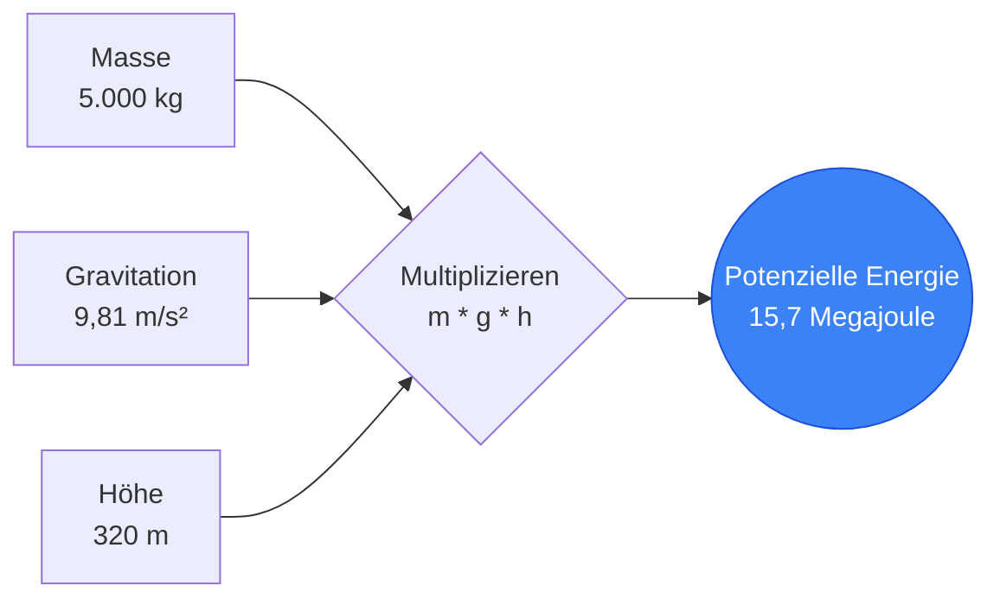
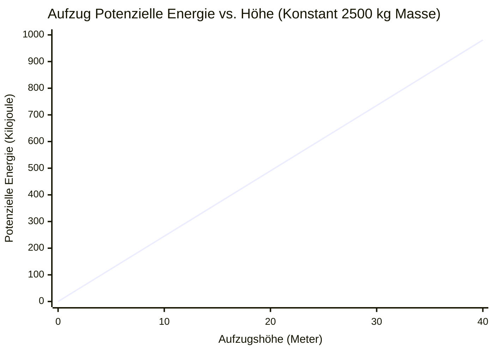
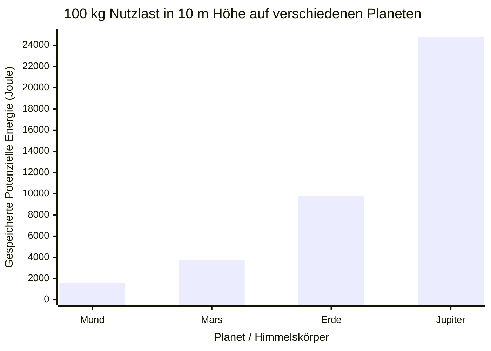
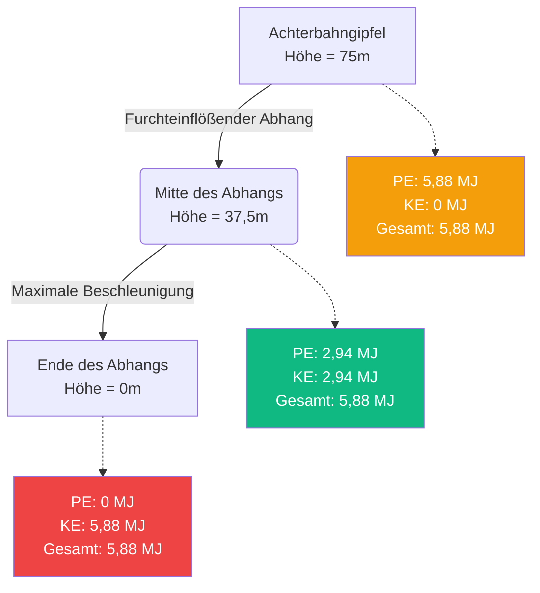

# Der ultimative Potenzielle Energie Rechner: Meistern Sie die Physik der gespeicherten Gravitationsenergie

Willkommen beim ultimativen **Potenzielle Energie Rechner** und umfassenden Physik-Leitfaden. Egal, ob Sie ein Architekt sind, der hochhaushohe Wolkenkratzer entwirft, ein Achterbahningenieur, der die furchterregende Gipfelhöhe eines neuen Fahrgeschäfts berechnet, oder ein Physikschüler, der sich auf eine anspruchsvolle Abschlussprüfung über den Energieerhaltungssatz der Mechanik vorbereitet – dieses Werkzeug bietet absolute Präzision und Klarheit.

Potenzielle Energie ist die unsichtbare, gespeicherte Energie, die unser Universum beherrscht. Sie ist der Grund, warum ein prekär liegender Felsblock ein darunter liegendes Tal bedroht, der Grund, warum Staudämme ganze Städte mit Strom versorgen können, und der Grund, warum eine gespannte Bogensehne einen Pfeil mit tödlicher Geschwindigkeit abfeuern kann.

In diesem massiven, über 4.000 Wörter umfassenden technischen Leitfaden werden wir die Mechanik der potenziellen Gravitationsenergie ($PE = m \cdot g \cdot h$) umfassend dekonstruieren. Wir werden die mathematischen Grundlagen des Gravitationsfeldes untersuchen, die Umwandlung zwischen potenziellen und kinetischen Zuständen im freien Fall analysieren und Sie durch fünf reale Ingenieurbeispiele führen, die mit detaillierten Mermaid.js-Diagrammen visualisiert werden.

---

## 1. Die Physik der potenziellen Energie: Gespeicherte Kraft

In der klassischen Mechanik ist **Energie** die Fähigkeit, Arbeit zu verrichten. Während kinetische Energie die Energie der aktiven Bewegung ist, ist **potenzielle Energie** die Energie der Position, des Zustands oder der Anordnung. 

Sie ist "potenziell", weil die Energie gespeichert ist und leise darauf wartet, freigesetzt und in aktive kinetische Arbeit umgewandelt zu werden. 

### Die grundlegende Gravitationsformel ($PE = m \cdot g \cdot h$)
Wenn wir mit Objekten in der Nähe der Oberfläche der Erde (oder eines anderen Planeten) arbeiten, befassen wir uns speziell mit **potenzieller Gravitationsenergie**. Die grundlegende Formel ist elegant einfach und stützt sich auf nur drei Variablen:

$$ PE = m \cdot g \cdot h $$

Wobei:
- **$PE$** = Potenzielle Energie (gemessen in Joule, $J$)
- **$m$** = Masse des Objekts (gemessen in Kilogramm, $kg$)
- **$g$** = Gravitationsbeschleunigung der lokalen Umgebung (gemessen in Metern pro Sekunde im Quadrat, $m/s^2$)
- **$h$** = Höhe oder Erhebung über einem gewählten Bezugspunkt (gemessen in Metern, $m$)

### Die lineare Natur der potenziellen Energie
Im Gegensatz zur kinetischen Energie, die quadratisch mit der Geschwindigkeit ($v^2$) skaliert, skaliert die potenzielle Gravitationsenergie **perfekt linear** mit all ihren drei Variablen.

- Wenn Sie die Masse eines Felsblocks, der auf einer Klippe liegt, verdoppeln, verdoppeln Sie genau seine potenzielle Energie.
- Wenn Sie eine schwere Kiste in einem Regal auf die doppelte ursprüngliche Höhe heben, verdoppeln Sie genau ihre potenzielle Energie.
- Wenn Sie eine schwere Kiste von der Erde zu einem Planeten mit der doppelten Schwerkraft (wie Jupiter) transportieren, verdoppeln Sie ihre potenzielle Energie.

### Die Bedeutung der Bezugsebene ($h=0$)
Ein entscheidendes, oft missverstandenes Konzept in der Physik ist, dass die potenzielle Energie völlig relativ ist. Der Wert von $h$ erfordert einen festgelegten Ausgangspunkt – eine **Bezugsebene**, auf der die Höhe als genau Null definiert ist.

Zum Beispiel könnte ein Buch, das auf einem Tisch liegt, $1\text{ Meter}$ über dem Boden sein, was ihm eine positive potenzielle Energie relativ zum Boden verleiht. Wenn sich der Boden jedoch im 10. Stockwerk eines Wohnhauses befindet, ist das Buch $30\text{ Meter}$ über dem Straßenniveau, was ihm eine viel größere potenzielle Energie relativ zur Straße verleiht. 

Weil die potenzielle Energie relativ ist, kann sie absolut negativ sein! Wenn Ihre Bezugsebene ($h=0$) der Boden ist und Sie einen schweren Eimer $5\text{ Meter}$ in einen Brunnen hinablassen, beträgt die Höhe $-5\text{ m}$, was zu einer mathematisch korrekten negativen potenziellen Energie führt.

---

## 2. Universelle Gravitation vs. Lokale Schwerkraft ($g$)

Die Standardgleichung $PE = mgh$ ist eigentlich eine vereinfachte Näherung, die nur in der Nähe der Oberfläche eines Planeten funktioniert. 

### Standard-Erdbeschleunigung ($g \approx 9,81\text{ m/s}^2$)
Auf der Erde ist die Anziehungskraft auf Meereshöhe unglaublich konstant. Der Physikunterricht verwendet standardmäßig $9,8\text{ m/s}^2$ oder $9,81\text{ m/s}^2$. Das bedeutet, dass die Geschwindigkeit eines im Vakuum fallengelassenen Objekts in jeder Sekunde des Falls um $9,81\text{ m/s}$ zunimmt.

Die Schwerkraft schwankt jedoch leicht aufgrund von Höhe und geologischer Dichte. Auf dem Gipfel des Mount Everest ist die Schwerkraft tatsächlich etwas schwächer als auf Meereshöhe.

### Universelle potenzielle Gravitationsenergie
Wenn Sie als Raumfahrtingenieur orbitale Satellitenmechaniken oder Raketenstarts zum Mars berechnen, versagt die $PE = mgh$-Gleichung, da $g$ nicht mehr konstant ist. Je weiter man sich von der Erde entfernt, desto schneller nimmt die Schwerkraft gemäß dem quadratischen Abstandsgesetz ab. 

In der Astrophysik verwenden wir die Formel der universellen potenziellen Gravitationsenergie:

$$ PE = - \frac{G \cdot M \cdot m}{r} $$

Wobei $G$ die Gravitationskonstante, $M$ die Masse des Planeten, $m$ die Masse des Satelliten und $r$ die Entfernung vom genauen Zentrum des Planeten ist.

---

## 3. Energieerhaltungssatz der Mechanik

Potenzielle Energie existiert selten im luftleeren Raum; sie interagiert ständig mit kinetischer Energie ($KE = 0,5mv^2$).

Der **Energieerhaltungssatz der Mechanik** schreibt vor, dass in einem isolierten System (unter Vernachlässigung von Reibung, Luftwiderstand und thermischem Wärmeverlust) die Gesamtsumme aus potenzieller und kinetischer Energie absolut konstant bleibt. Energie kann weder erzeugt noch vernichtet werden; sie ändert lediglich ihren Zustand.

$$ E_{gesamt} = PE_{anfang} + KE_{anfang} = PE_{ende} + KE_{ende} $$

### Die Freifallumwandlung
Wenn Sie eine $10\text{ kg}$ schwere Bowlingkugel aus einem $50\text{ Meter}$ hohen Gebäude fallen lassen:
1. **Im Moment des Loslassens:** Die Geschwindigkeit ist null, also ist $KE = 0$. Die Höhe ist maximal, also ist $PE$ auf ihrem absoluten Maximum.
2. **Der Fall nach unten:** Während die Kugel fällt, verliert sie an Höhe (verliert $PE$). Die Schwerkraft beschleunigt die Kugel jedoch, das heißt, sie nimmt an Geschwindigkeit zu (gewinnt $KE$). Die Gesamtenergiesumme bleibt identisch und konstant.
3. **Der Moment vor dem Aufprall:** Die Höhe ist exakt null ($PE = 0$). Die gesamte gespeicherte potenzielle Energie hat sich fehlerfrei in kinetische Energie umgewandelt, was zur maximalen Aufprallendgeschwindigkeit führt.

---

## 4. Umfassender Leitfaden: Den Rechner optimal nutzen

Unser interaktiver Potenzielle Energie Rechner wurde so konstruiert, dass er einfache einführende Physikprobleme ebenso bewältigt wie komplexe, zurückgerechnete planetenwissenschaftliche Gleichungen.

### Schritt 1: Mathematische Kernberechnungen
Wählen Sie in der Hauptoberfläche die Variable aus, die Sie isolieren und nach der Sie auflösen möchten:
- **Nach potenzieller Energie (PE) auflösen:** Geben Sie bekannte Masse, Höhe und Gravitation ein.
- **Nach Masse (m) auflösen:** Geben Sie bekannte Energie, Höhe und Gravitation ein, um zu bestimmen, wie schwer ein Objekt ist.
- **Nach Höhe (h) auflösen:** Geben Sie bekannte Energie, Masse und Gravitation ein, um die Höhe zu bestimmen.
- **Nach Gravitation (g) auflösen:** Geben Sie bekannte Energie, Masse und Höhe ein, um die Gravitationsstärke eines unbekannten Planeten zu bestimmen!

### Schritt 2: Nutzen Sie die Planeten-Voreinstellungen
Der Rechner verfügt über eine leistungsstarke Engine für Gravitations-Voreinstellungen. Anstatt manuell $9,81\text{ m/s}^2$ einzugeben, wählen Sie einfach **Erde**. 

Möchten Sie sehen, wie hoch ein Kran auf dem Mars mit der gleichen Energiemenge einen Stahlträger heben könnte? Ändern Sie die Gravitations-Voreinstellung auf **Mars** ($3,71\text{ m/s}^2$). Der Rechner wird sofort aktualisiert und zeigt, dass, weil der Mars weniger als 40 % der Schwerkraft der Erde hat, genau dieselbe Menge an Arbeitsenergie ein schweres Objekt sehr, sehr viel höher heben kann.

### Schritt 3: Den logarithmischen Energiebogen interpretieren
Die radiale **Energiebogen-Anzeige** kategorisiert Ihre Berechnung logarithmisch:
- **Mikro-Ebene (Grün):** Bücher heben, Treppensteigen, Äpfel fallen lassen.
- **Makro-Ebene (Blau):** Turmdrehkräne, die Stahlträger heben, Achterbahngipfel.
- **Mega-Ebene (Rot):** Staudämme, Wolkenkratzer, Lawinen.

---

## 5. Fünf konzeptionelle Ingenieurbeispiele mit 2D-Visualisierungen

Um das Ausmaß der potenziellen Energie vollständig zu erfassen, werden wir fünf detaillierte Konstruktions- und Physikszenarien untersuchen und Mermaid.js verwenden, um die Mathematik visuell zu dekonstruieren.

### Beispiel 1: Der Baukran (Lineare Berechnung)

**Das Szenario:**
Ein massiver Turmdrehkran in Dubai hebt ein $5.000\text{ kg}$ schweres, vorgefertigtes Gebäude-Element aus Stahl und Beton. Der Kran zieht die Last vom Boden bis in den 80. Stock hoch, der genau $320\text{ Meter}$ hoch ist. Wir müssen die immense potenzielle Gravitationsenergie berechnen, die in dem hängenden Träger gespeichert ist und die katastrophale Energie darstellt, die freigesetzt würde, falls das Krankabel reißt.

**Die Mathematik:**
Wir verwenden die lineare Kernformel:
$$ PE = m \cdot g \cdot h $$
$$ PE = 5.000\text{ kg} \cdot 9,81\text{ m/s}^2 \cdot 320\text{ Meter} $$
$$ PE = 15.696.000\text{ Joule (15,7 Megajoule)} $$

**2D-Visualisierung:**
Der folgende Logikbaum veranschaulicht die unkomplizierte lineare Natur der $PE = mgh$-Berechnung.



---

### Beispiel 2: Potenzielle Energie vs. Höhe (Lineare Skalierung)

**Das Szenario:**
Ein Aufzugsplaner berechnet Gegengewichtsenergielasten. Eine standardmäßige Aufzugskabine von $2.500\text{ kg}$ wird in einem Gebäude nach oben gezogen. Da die potenzielle Energie linear mit der Höhe skaliert, möchten wir die stetige Ansammlung von Energie visualisieren, wenn die Kabine die 10-Meter-, 20-Meter-, 30-Meter- und 40-Meter-Marke passiert.

**Die Mathematik:**
- Bei $10\text{ m}$: $PE = 2.500 \cdot 9,81 \cdot 10 = 245.250\text{ J (245 kJ)}$
- Bei $20\text{ m}$: $PE = 2.500 \cdot 9,81 \cdot 20 = 490.500\text{ J (490 kJ)}$
- Bei $30\text{ m}$: $PE = 2.500 \cdot 9,81 \cdot 30 = 735.750\text{ J (735 kJ)}$
- Bei $40\text{ m}$: $PE = 2.500 \cdot 9,81 \cdot 40 = 981.000\text{ J (981 kJ)}$

**2D-Visualisierung:**
Im Gegensatz zur furchteinflößenden exponentiellen quadratischen Kurve der kinetischen Energie bildet die potenzielle Energie eine perfekte, vorhersehbare gerade Linie. Die Verdoppelung der Höhe verdoppelt genau die gespeicherte Energie.



---

### Beispiel 3: Interplanetarer Gravitationsvergleich (Mars vs. Jupiter)

**Das Szenario:**
NASA-Astronauten sind auf dem Mars gelandet, während eine stark gepanzerte Robotersonde in die Jupiteratmosphäre hinabsteigt. Beide tragen eine $100\text{ kg}$ schwere wissenschaftliche Nutzlast, die genau $10\text{ Meter}$ vom Boden angehoben wird. Wie unterscheidet sich die gespeicherte potenzielle Energie quer durch das Sonnensystem so drastisch?

**Die Mathematik:**
- **Erde ($9,81\text{ m/s}^2$):** $PE = 100 \cdot 9,81 \cdot 10 = 9.810\text{ J}$
- **Der Mond ($1,62\text{ m/s}^2$):** $PE = 100 \cdot 1,62 \cdot 10 = 1.620\text{ J}$
- **Mars ($3,71\text{ m/s}^2$):** $PE = 100 \cdot 3,71 \cdot 10 = 3.710\text{ J}$
- **Jupiter ($24,79\text{ m/s}^2$):** $PE = 100 \cdot 24,79 \cdot 10 = 24.790\text{ J}$

**2D-Visualisierung:**
Das Balkendiagramm zeigt auf dramatische Weise, dass das Fallenlassen eines $100\text{ kg}$ schweren Steins auf dem Jupiter fast 15-mal mehr zermalmende Aufprallenergie freisetzt als das Fallenlassen genau desselben Steins auf dem Mond aus genau derselben Höhe.



---

### Beispiel 4: Die Physik der Achterbahn (Energieerhaltung)

**Das Szenario:**
Ein $8.000\text{ kg}$ schwerer, voll besetzter Achterbahnzug erreicht langsam den Gipfel eines furchteinflößenden, $75\text{ Meter}$ hohen Gefälles. Am Gipfel ist seine Geschwindigkeit praktisch null. Wir müssen die theoretisch maximal mögliche Geschwindigkeit des Zuges berechnen, wenn er ganz unten am ersten Abhang ankommt, vorausgesetzt, es gibt keine Reibung auf den Schienen.

**Die Mathematik:**
Am Gipfel ist die gesamte mechanische Energie potenzielle Energie.
$$ PE_{oben} = m \cdot g \cdot h = 8.000 \cdot 9,81 \cdot 75 = 5.886.000\text{ Joule (5,88 MJ)} $$

Gemäß dem Energieerhaltungssatz der Mechanik hat sich am unteren Ende des Abhangs ($h=0$) die gesamte potenzielle Energie von $5,88\text{ MJ}$ in kinetische Energie umgewandelt ($KE = 0,5 \cdot m \cdot v^2$).
$$ KE_{unten} = 5.886.000\text{ J} $$

Wir können die Geschwindigkeit des Zuges mathematisch zurückrechnen:
$$ v = \sqrt{\frac{2 \cdot KE}{m}} $$
$$ v = \sqrt{\frac{2 \cdot 5.886.000}{8.000}} = \sqrt{\frac{11.772.000}{8.000}} = \sqrt{1471,5} = 38,36\text{ m/s} $$

Der Achterbahnzug erreicht das Ende der Strecke mit einer berauschenden Geschwindigkeit von $38,36\text{ m/s}$ (etwa $138\text{ km/h}$).

**2D-Visualisierung:**
Dieses Flussdiagramm demonstriert, wie die mechanische Energie perfekt erhalten bleibt, während sie reibungslos zwischen den Zuständen von potenzieller (Höhe) und kinetischer (Geschwindigkeit) Energie wechselt.



---

### Beispiel 5: Energieerzeugung in einem Wasserkraftwerk (Gantt-Prozesszeitplan)

**Das Szenario:**
Wasserkraftwerke sind im Grunde massive "Potenzielle-Energie-Batterien" aus Beton. Wasser wird in einem hochgelegenen Reservoir gespeichert. Wenn Strom benötigt wird, öffnen sich die Tore, und die Schwerkraft zieht das Wasser riesige Rohre, die sogenannten Druckrohrleitungen, hinunter. 
Lassen Sie uns den Prozess der Energieumwandlung für ein riesiges Wasservolumen von $1.000.000\text{ kg}$ analysieren, das in einem Damm $150\text{ Meter}$ tief fällt.

**Die Mathematik:**
Die gespeicherte potenzielle Gravitationsenergie dieses bestimmten Wasservolumens beträgt:
$$ PE = 1.000.000 \cdot 9,81 \cdot 150 = 1.471.500.000\text{ Joule (1,47 Gigajoule)} $$

Während das Wasser die Druckrohrleitung hinunterstürzt, werden diese $1,47\text{ GJ}$ zu kinetischer Energie. Es knallt gegen die Stahlschaufeln einer massiven Turbine. Die Turbine dreht einen magnetischen Generator. Unter Annahme eines mechanisch-elektrischen Wirkungsgrades von $80\,\%$ liefert der Generator:
$$ 1,47\text{ GJ} \times 0,80 = 1,17\text{ Gigajoule reine elektrische Energie!} $$

**2D-Visualisierung:**
Dieses Gantt-Diagramm skizziert den Schritt-für-Schritt-Zeitplan der physikalischen Umwandlung und zeigt, wie aus regungslosem, gespeichertem Wasser elektrische Spannung wird, die in das städtische Stromnetz eingespeist wird.

```mermaid
gantt
    title Wasserkraft - Prozess der Umwandlung potenzieller Energie
    dateFormat s
    axisFormat %S
    section Speicherung
    Wasser ruht in hohem Reservoir (Maximale PE) :done, 0, 10s
    section Freier Fall
    Tore öffnen, Wasser fällt durch Druckrohr :crit, active, 10s, 20s
    PE wandelt sich schnell in kinetische Energie um :crit, active, 10s, 20s
    section Erzeugung
    Kinetisches Wasser trifft auf Turbinenschaufeln :milestone, 20s, 0s
    Turbine dreht Magnetgenerator :active, 20s, 30s
    Elektrizität wird ins Stromnetz eingespeist :active, 22s, 35s
```

---

## 6. Häufig gestellte Fragen (FAQ) – Deep Dive

**F: Kann potenzielle Energie negativ sein?**
**A:** Ja, absolut! Die potenzielle Energie ist strikt relativ dazu, wo Sie Ihre Höhenbezugsebene ($h=0$) festlegen. Wenn Sie den Boden als $h=0$ wählen, einen $10\text{ Meter}$ tiefen Graben ausheben und einen Felsblock hineinfallen lassen, ist die Höhe des Felsblocks $-10\text{ m}$. Daher ist seine potenzielle Energie negativ. Es bedarf positiver Arbeit (Heben), nur um seine potenzielle Energie wieder auf null zu bringen.

**F: Was ist der Unterschied zwischen kinetischer Energie und potenzieller Energie?**
**A:** Potenzielle Energie ($PE = mgh$) ist gespeicherte Energie, die auf Höhe, Position oder innerem Zustand basiert. Sie ist passiv und regungslos. Kinetische Energie ($KE = 0,5mv^2$) ist die aktive Energie der Bewegung. In physikalischen Systemen springt die Energie ständig zwischen diesen beiden Zuständen hin und her.

**F: Spielt der zurückgelegte Weg bei der Berechnung der potenziellen Energie eine Rolle?**
**A:** Nein. Die Schwerkraft ist das, was Physiker als **konservative Kraft** bezeichnen. Das bedeutet, dass die Änderung der potenziellen Energie *ausschließlich* von der anfänglichen und der endgültigen vertikalen Höhe abhängt. Ob Sie eine schwere Kiste auf einer Leiter direkt bis zu einem $10\text{ Meter}$ hohen Dach tragen oder sie eine lange, kurvenreiche, zickzackförmige $50\text{-Meter}$-Rampe auf dasselbe Dach hinaufschieben – die letztendlich gewonnene potenzielle Energie der Kiste ist mathematisch gesehen identisch.

**F: Was ist elastische potenzielle Energie?**
**A:** Während sich dieser Leitfaden stark auf die gravitative PE konzentriert, ist elastische potenzielle Energie die Energie, die durch die physische Verformung eines Objekts gespeichert wird, wie das Dehnen eines Gummibands, das Zusammendrücken einer Metallfeder oder das Spannen eines Jagdbogens. Die Formel lautet $PE_{elastisch} = 0,5 \cdot k \cdot x^2$, wobei $k$ die Steifigkeit der Feder und $x$ die zurückgelegte Strecke der Dehnung ist.

**F: Inwiefern ist ein Pendel auf potenzielle Energie angewiesen?**
**A:** Ein Standuhr-Pendel ist ein perfekter mechanischer Oszillator. An seinem höchsten Schwingungspunkt auf der linken Seite stoppt es kurzzeitig (Null Kinetik) und befindet sich am höchsten Punkt (Max Potenzial). Es fällt, tauscht Potenzial gegen Kinetik und erreicht an seinem tiefsten Punkt die maximale Geschwindigkeit. Es schwingt dann nach rechts hinauf und tauscht Kinetik wieder in Potenzial um, bis es erneut stoppt.

---

## 7. Fazit und Ingenieurs-Herausforderung

Die Mathematik der potenziellen Energie bestimmt alles, von der Fundamentierung von Wolkenkratzern bis hin zur Orbitalmechanik von Monden. Wenn Sie $PE = mgh$ beherrschen, erlangen Sie die Fähigkeit, die immense, unsichtbare, gespeicherte Kraft, die in der physischen Welt um uns herum ruht, genau zu quantifizieren.

Um diese Konzepte wirklich zu meistern, nutzen Sie unseren Potenzielle Energie Rechner, um die folgenden konzeptionellen physikalischen Herausforderungen zu lösen:
1. **Die Lawine:** Eine massive Schicht aus komprimiertem Schnee mit einem Gewicht von $50.000.000\text{ kg}$ ruht bedrohlich auf einem Berggipfel, $2.500\text{ Meter}$ über einem Skigebiet. Berechnen Sie die erschreckende potenzielle Energie in Gigajoule, die über dem Tal gespeichert ist.
2. **Der Jupiter-Hebetransport:** Ein Industriekran auf der Erde kann eine $10.000\text{ kg}$ schwere Frachtkiste unter Einsatz einer bestimmten Energiemenge auf eine Höhe von $50\text{ Metern}$ heben. Wenn Sie genau denselben Kran zum Jupiter transportieren würden ($g = 24,79\text{ m/s}^2$), was wäre die maximale Höhe, auf die er genau dieselbe Kiste unter Einsatz genau derselben Energiemenge heben könnte?
3. **Der Basejumper:** Ein $85\text{ kg}$ schwerer Basejumper tritt von einer $400\text{ Meter}$ hohen Antenne. Berechnen Sie mit Hilfe des Energieerhaltungssatzes (und unter Vernachlässigung des Luftwiderstands) die absolute maximale Endgeschwindigkeit, die er kurz vor dem Aufprall auf dem Boden erreichen würde, falls sein Fallschirm nicht öffnet.

Experimentieren Sie mit dem Simulator, analysieren Sie die linearen Höhengrafiken und verlassen Sie sich auf diesen Rechner, um die gewaltigen Kräfte zu beleuchten, die das physikalische Universum regieren.
