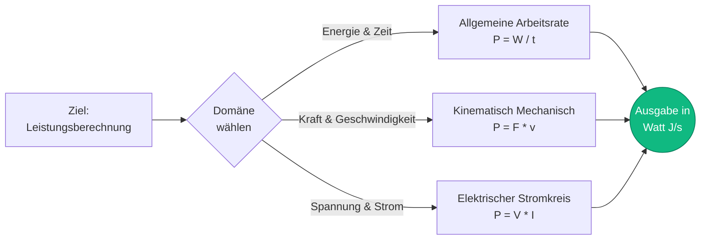
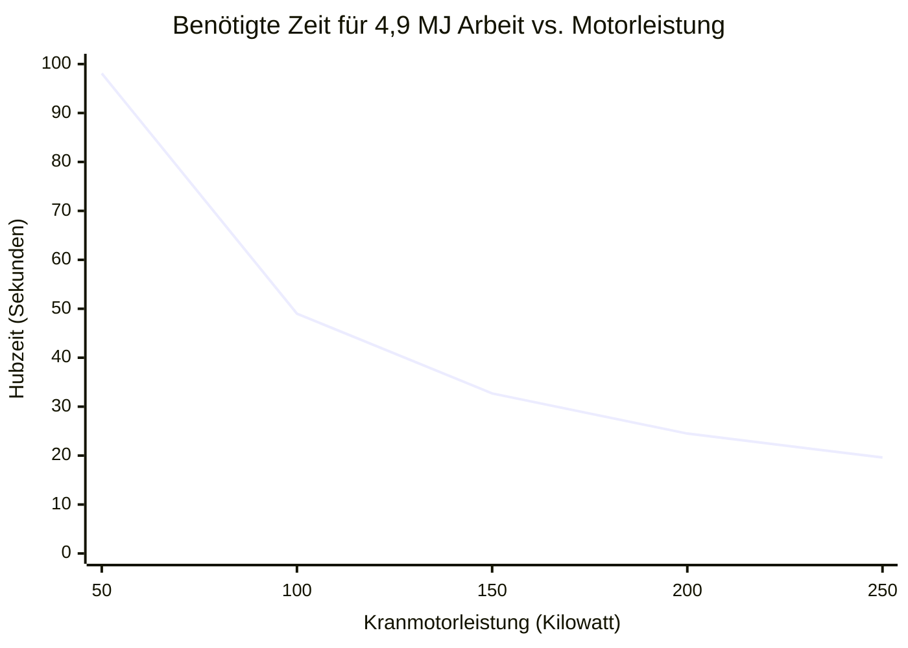
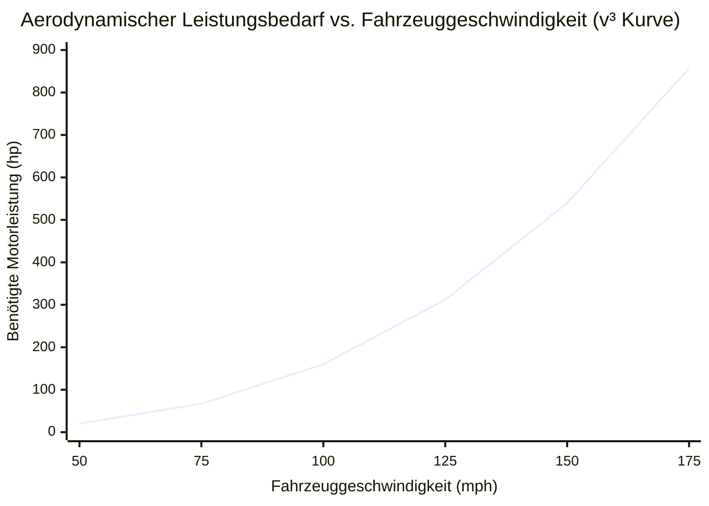
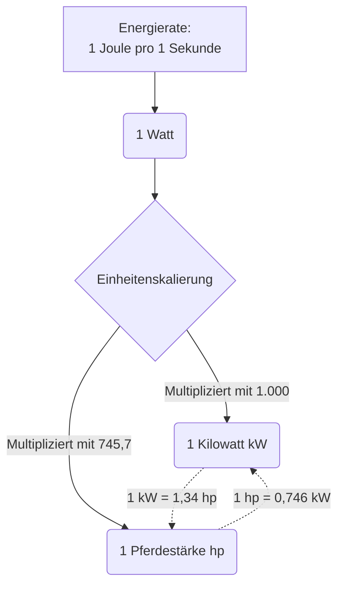

# Der Umfassende Leistungsrechner: Meistere Energieübertragung, Mechanische Watt und Elektrische Pferdestärken

Willkommen beim ultimativen **Leistungsrechner** und dem definitiven Ingenieurs-Handbuch. Egal, ob Sie ein Automobilingenieur sind, der die Bremsleistung eines neu entwickelten Motorblocks berechnen möchte, ein Elektroingenieur, der ein kommerzielles Stromnetz dimensioniert, oder ein Sportphysiologe, der die maximale Sprintleistung eines professionellen Radfahrers analysiert – dieses Tool liefert Ihnen die exakten physikalischen Umrechnungen, die Sie benötigen.

In alltäglichen Gesprächen werden die Wörter "Energie", "Arbeit" und "Leistung" oft synonym verwendet. In der Physik stehen sie jedoch für drei völlig unterschiedliche, streng definierte Konzepte. Wenn Arbeit ($W$) die bloße Menge der übertragenen Energie ist, dann ist Leistung ($P$) die *Geschwindigkeit*, mit der diese Energie geliefert wird.

In diesem ausführlichen, 4.000+ Wörter umfassenden SEO-Leitfaden werden wir die grundlegenden Formeln der Leistung ($P = W/t$ und $P = F \cdot v$) detailliert zerlegen. Wir werden die Geschichte des Watts und der Pferdestärke entpacken, die verheerenden kubischen Leistungskurven des Luftwiderstands erforschen und fünf reale Hochleistungsszenarien mit benutzerdefinierten Mermaid.js-Visualisierungen analysieren.

---

## 1. Leistung definieren: Die Geschwindigkeit der Arbeit

In der klassischen Physik ist **Leistung** (Power) definiert als die zeitliche Ableitung der Arbeit. Sie misst genau, wie schnell Energie übertragen, verbraucht oder erzeugt wird. 

$$ P = \frac{W}{t} = \frac{\Delta E}{\Delta t} $$

### Die Treppen-Analogie
Um den Unterschied zwischen Arbeit und Leistung intuitiv zu verstehen, stellen Sie sich einen $100\text{ kg}$ schweren Mann vor, der am Fuß einer $10\text{ Meter}$ hohen Treppe steht.
- Wenn er innerhalb von $60\text{ Sekunden}$ langsam die Treppe hinaufgeht, muss er gegen die Schwerkraft ankämpfen, um seine Masse anzuheben. Er verrichtet exakt $9.810\text{ Joule}$ mechanische Arbeit ($W = mgh$).
- Wenn er in nur $5\text{ Sekunden}$ gewaltsam dieselbe Treppe hinaufsprintet, hebt er die exakt selbe Masse auf die exakt selbe Höhe. Er hat die *exakt selbe* Arbeit von $9.810\text{ Joule}$ verrichtet.

Die erzeugte **Leistung** war jedoch grundlegend verschieden:
- **Leistung beim Gehen:** $P = 9.810\text{ J} / 60\text{ s} = \mathbf{163,5\text{ Watt}}$
- **Leistung beim Sprinten:** $P = 9.810\text{ J} / 5\text{ s} = \mathbf{1.962,0\text{ Watt}}$

Der Sprinter war zwölfmal leistungsfähiger und erschöpfte dabei sein anaerobes Herz-Kreislauf-System vollständig.

### Das Watt: Die SI-Einheit der Leistung
Die Leistung wird in **Watt** ($\text{W}$) gemessen, benannt zu Ehren von James Watt, dem schottischen Ingenieur, der die Dampfmaschine radikal verbesserte.
$$ 1\text{ Watt} = 1\text{ Joule pro Sekunde} $$
Wenn eine Glühbirne für $60\text{W}$ ausgelegt ist, verbraucht sie in jeder einzelnen Sekunde, in die sie eingeschaltet bleibt, physikalisch $60\text{ Joule}$ an elektrischer Energie.

---

## 2. Die drei Domänen der Leistungsgleichungen

Da Leistung einfach die Rate der Energieübertragung ist, kann sie je nach Anwendungsbereich – allgemeine Mechanik, Kinematik oder Elektrotechnik – mit verschiedenen Formeln berechnet werden.

### 1. Allgemeine Arbeitsrate ($P = W / t$)
Die universellste Formel. Teilen Sie die gesamte verrichtete Arbeit (oder die verbrauchte Gesamtenergie) durch die verstrichene Gesamtzeit.

### 2. Mechanische kinematische Leistung ($P = F \cdot v$)
Wenn sich ein Objekt mit einer konstanten Geschwindigkeit ($v$) bewegt, während es von einer konstanten Kraft ($F$) geschoben wird, können Sie die erforderliche Leistung sofort berechnen, ohne die Gesamtzeit oder die Gesamtdistanz kennen zu müssen.
Da $W = F \cdot d$ und $v = d / t$, ergibt das Einsetzen Folgendes:
$$ P = F \cdot v $$
*(Dies ist die exakte Formel, die verwendet wird, um die Leistung eines Automotors zu berechnen, der gegen den Luftwiderstand drückt).*

### 3. Elektrische Leistung ($P = V \cdot I$)
In einem Gleichstromkreis (DC) ist die elektrische Leistung das Produkt aus Spannung (elektrischer Druck) und Stromstärke (Elektronenfluss).
$$ P = V \cdot I $$
Unter Verwendung des Ohmschen Gesetzes ($V = I \cdot R$) kann dies auch als $P = I^2 \cdot R$ oder $P = V^2 / R$ umgeschrieben werden, was für die Berechnung der Wärmeabfuhr in einem Widerstand unerlässlich ist.

---

## 3. Die Geschichte und Umrechnung der Pferdestärke (hp)

Als James Watt im späten 18. Jahrhundert seine hocheffiziente Dampfmaschine erfand, stand er vor einem massiven Marketingproblem. Seine potenziellen Kunden waren Bergleute und Mühlenbetreiber, die derzeit Zugpferde zum Antrieb ihrer Pumpen einsetzten. Sie verstanden nichts von "Dampfdruck"; sie wollten wissen, wie viele Pferde sie feuern könnten, wenn sie seine Maschine kauften.

Watt untersuchte die durchschnittliche Arbeitsleistung eines Zugpferdes, das ein Mühlenrad drehte, und standardisierte die Einheit der **Pferdestärke (hp)**.
Er definierte $1\text{ hp}$ als die Leistung, die erforderlich ist, um $33.000\text{ Pfund}$ innerhalb von exakt $1\text{ Minute}$ um $1\text{ Fuß}$ anzuheben.

### Moderne metrische Umrechnungen
- **Mechanische Pferdestärke (Imperial hp):** $1\text{ hp} = 745,7\text{ Watt}$
- **Metrische Pferdestärke (PS / Pferdestärke):** $1\text{ PS} = 735,5\text{ Watt}$

Ein moderner $200\text{ PS}$ Automotor ist technisch in der Lage, gleichzeitig die kontinuierliche mechanische Arbeit von 200 massiven Zugpferden aus dem 18. Jahrhundert zu verrichten.

---

## 4. Umfassender Benutzerleitfaden: Maximierung des Rechners

Unser interaktiver Leistungsrechner fungiert als universelle Brücke über alle Ingenieursbereiche hinweg. 

### Schritt 1: Wählen Sie Ihr Berechnungsziel
Nutzen Sie die obere Navigation, um Ihre bekannten Variablen auszuwählen:
- **Arbeitsrate ($P = W/t$):** Ideal für allgemeine Energieverbrauchsprobleme.
- **Mechanisch ($P = F \cdot v$):** Ideal für Automobil-, Luft- und Raumfahrt- und kinematische Fahrzeugprobleme.
- **Elektrisch ($P = V \cdot I$):** Ideal für das Design von Leiterplatten und das Energieaudit von Haushaltsgeräten.

### Schritt 2: Nutzen Sie die Umrechnungstabelle für Pferdestärken
Verlassen Sie sich nicht länger auf Kopfrechnen. Geben Sie Ihre Wattzahl ein und sehen Sie sofort die exakte Umrechnung in Kilowatt, Megawatt, imperiale mechanische Pferdestärken, metrische PS und BTU/h (wichtig für HLK-Techniker).

### Schritt 3: Interpretieren Sie das logarithmische Leistungsmessgerät
Unsere radiale Leistungsskala stellt Ihr Ergebnis sofort in den Kontext realer Referenzwerte:
- **Mikro-Leistung:** $0\text{W}$ bis $1.000\text{W}$ (Menschen, Glühbirnen, Mixer).
- **Makro-Leistung:** $1\text{kW}$ bis $1.000\text{kW}$ (Autos, Lastwagen, Kleinflugzeuge).
- **Mega-Leistung:** $1\text{MW}$ bis $1\text{GW}$+ (Lokomotiven, Kernkraftwerke, Saturn V Raketen).

---

## 5. Fünf konzeptionelle Ingenieursszenarien mit 2D-Visualisierungen

Um die Dynamik der Leistungserzeugung vollständig zu erfassen, werden wir fünf detaillierte physikalische Szenarien untersuchen und Mermaid.js nutzen, um die Mathematik und Leistungskurven visuell zu zerlegen.

### Beispiel 1: Die drei Domänen der Leistung (Ablauf der Gleichungslogik)

**Das Szenario:**
Ein Ingenieurstudent muss seine bekannten Variablen schnell durch die richtige Leistungsformel leiten, abhängig von seiner Prüfungsfrage (Thermodynamisch, Kinematisch oder Elektrisch).

**2D-Visualisierung:**
Dieses Flussdiagramm schlüsselt die drei massiven Säulen der Leistungsberechnung visuell auf. 

---

### Beispiel 2: Kran-Hubleistung vs. Zeit

**Das Szenario:**
Ein massiver Baukran auf einer Wolkenkratzer-Baustelle muss einen $5.000\text{ kg}$ schweren Stahlträger auf eine Höhe von $100\text{ Metern}$ heben. Der elektrische Windenmotor des Krans ist für exakt $100\text{ Kilowatt}$ ($100.000\text{ W}$) Dauerleistung ausgelegt. Wie schnell kann der Kran den Träger anheben?

**Die Mathematik:**
Berechnen Sie zunächst die Gesamtarbeit, die zur Überwindung der Schwerkraft erforderlich ist:
$$ W = m \cdot g \cdot h = 5.000 \cdot 9,81 \cdot 100 = 4.905.000\text{ Joule} $$

Verwenden Sie als nächstes die Leistungsformel, um nach der Zeit aufzulösen:
$$ P = W / t $$
$$ 100.000 = 4.905.000 / t $$
$$ t = 49,05\text{ Sekunden} $$

**2D-Visualisierung:**
Wenn sie den Kran auf einen $200\text{ kW}$ Motor aufrüsten, benötigt er nur die Hälfte der Zeit. Wenn sie ihn auf einen $50\text{ kW}$ Motor herabstufen, dauert es doppelt so lange. Dieses Diagramm zeigt die umgekehrte Beziehung zwischen verfügbarer Leistung und erforderlicher Zeit für eine feste Arbeitsmenge.

---

### Beispiel 3: Der aerodynamische V-Hoch-3-Nachteil (Leistung vs. Geschwindigkeit)

**Das Szenario:**
Warum ist es so unglaublich schwer für ein Auto, $200\text{ mph}$ zu fahren, selbst wenn es leicht $100\text{ mph}$ erreichen kann? Das liegt an der furchteinflößenden Physik des aerodynamischen Widerstands. Die Widerstandskraft nimmt mit dem Quadrat der Geschwindigkeit zu ($F \propto v^2$). Da die mechanische Leistung das Produkt aus Kraft und Geschwindigkeit ist ($P = F \cdot v$), skaliert die benötigte Leistung, um ein Auto durch die Luft zu schieben, mit der **dritten Potenz der Geschwindigkeit** ($P \propto v^3$)!

**Die Mathematik:**
Wenn eine Standardlimousine $20\text{ hp}$ benötigt, um mit $50\text{ mph}$ über die Autobahn zu cruisen...
Um die Geschwindigkeit auf $100\text{ mph}$ zu verdoppeln, wird die $2^3$ ($8\times$)-fache Leistung benötigt! Sie erfordert $160\text{ hp}$.
Um die Geschwindigkeit auf $150\text{ mph}$ zu verdreifachen, wird die $3^3$ ($27\times$)-fache Leistung benötigt! Sie erfordert $540\text{ hp}$.

**2D-Visualisierung:**
Dieses Diagramm visualisiert die verheerende $v^3$-Kurve. Das ist der Grund, warum ein Bugatti Veyron mit $1.000\text{ hp}$ nur unwesentlich schneller fährt als eine Corvette mit $500\text{ hp}$.

---

### Beispiel 4: Die Physik der Pferdestärken-Umrechnung

**Das Szenario:**
Ein amerikanischer Mechaniker und ein europäischer Elektroingenieur diskutieren über die Spezifikationen eines neuen Elektromotors. Der Mechaniker spricht von mechanischer Bremsleistung ($hp$) und der Elektroingenieur von Kilowatt ($kW$). Lassen Sie uns visuell aufschlüsseln, wie diese beiden Einheiten mathematisch an den grundlegenden Joule pro Sekunde gebunden sind.

**2D-Visualisierung:**
Dieses Flussdiagramm veranschaulicht, wie beide Einheiten auf exakt denselben physikalischen Ursprung zurückzuführen sind.

---

### Beispiel 5: Leistungsabgabe eines Profi-Radfahrers (Sprint vs. Ausdauer Gantt)

**Das Szenario:**
Lassen Sie uns die biologische Leistungsabgabe eines professionellen Tour-de-France-Radfahrers analysieren. Die menschliche Physiologie verfügt über zwei verschiedene Energiesysteme: Anaerob (massive, kurzfristige Leistung ohne Sauerstoff) und Aerob (anhaltende, langfristige Leistung unter Verwendung von Sauerstoff). 

Ein Profi-Radfahrer kann während eines finalen Zielsprints schwindelerregende $1.500\text{ Watt}$ ($2\text{ PS}$) erzeugen. Er kann diese Leistung jedoch nur etwa $15\text{ Sekunden}$ aufrechterhalten, bevor seine Muskeln mit Milchsäure überflutet werden. Bei einem mehrstündigen Berganstieg muss er auf seine aerobe Schwelle von etwa $400\text{ Watt}$ zurückfallen.

**2D-Visualisierung:**
Dieses Gantt-Diagramm visualisiert den Zeitstrahl einer Rennankunft und stellt die lange Ausdauerphase dem gewaltigen, aber unglaublich kurzen, anaeroben Sprint gegenüber.

```mermaid
gantt
    title Leistungsabgabe Profi-Radfahrer im finalen Kilometer
    dateFormat  HH:mm:ss
    axisFormat  %M:%S
    section Aerob (Anhaltend)
    Peloton Cruising (300 Watt) :active, 00:00:00, 00:00:45
    Leadout Train Push (600 Watt) :crit, done, 00:00:45, 00:01:00
    section Anaerob (Sprint)
    Max. Zielsprint (1.500 Watt!) :milestone, 00:01:00, 00:01:15
    Erschöpfung nach dem Rennen (50 Watt) :active, 00:01:15, 00:01:40
```

---

## 6. Häufig gestellte Fragen (FAQ) Deep Dive

**F: Was ist eine Kilowattstunde (kWh) auf meiner Stromrechnung?**
**A:** Dies ist für Schüler oft sehr verwirrend. Ein Kilowatt ($\text{kW}$) ist eine Einheit der *Leistung*. Aber eine Kilowattstunde ($\text{kWh}$) ist eine Einheit der *Energie*! Sie entspricht exakt $1.000\text{ Watt}$ Leistung, die kontinuierlich für $1\text{ Stunde}$ ($3.600\text{ Sekunden}$) fließt. 
$1.000\text{ W} \times 3.600\text{ s} = 3.600.000\text{ Joule}$. Ihr Stromversorger stellt Ihnen die Gesamtenergie (Joule) in Rechnung, nicht die Leistung (Watt)!

**F: Ist Drehmoment dasselbe wie Pferdestärke?**
**A:** Nein. Drehmoment ist eine Rotationskraft (ein Drehen). Pferdestärke ist, wie *schnell* Sie dieses Drehen anwenden können. 
Die automobile Formel lautet: $\text{Pferdestärke (hp)} = (\text{Drehmoment} \times \text{U/min}) / 5252$.
Ein Traktor hat ein massives Drehmoment, aber eine niedrige Drehzahl, daher hat er wenig PS. Ein Formel-1-Auto hat ein geringes Drehmoment, dreht aber mit $15.000\text{ U/min}$ und erzeugt so massive Pferdestärken!

**F: Was ist RMS-Leistung im Vergleich zur Spitzenleistung bei Audio-Lautsprechern?**
**A:** Spitzenleistung ist ein Marketing-Trick, der einen Mikrosekunden-Energieausbruch darstellt, den ein Lautsprecher verkraften kann, bevor er durchbrennt. RMS (Root Mean Square) ist die wahre, kontinuierliche, anhaltende Ausgangsleistung, die ein Verstärker sicher liefern kann. Kaufen Sie Geräte immer basierend auf der RMS-Wattzahl.

**F: Warum fühlen sich Elektroautos (EVs) so unglaublich stark an?**
**A:** Verbrennungsmotoren müssen darauf warten, dass die Drehzahlen steigen, um ihre maximale Leistung zu erreichen. Ein Elektromotor kann fast sofort aus dem Stand ($0\text{ U/min}$) $100\%$ seiner maximalen Leistung abgeben, was für eine brachiale, sofortige Beschleunigung sorgt.

**F: Was erzeugt die meiste Leistung auf der Erde?**
**A:** Künstlich: Die Saturn V Rakete erzeugte beim Start etwa $60\text{ Gigawatt}$ ($60.000\text{ MW}$) Leistung.
Natürlich: Ein massiver Hurrikan kann eine Wärmeenergie freisetzen, die dem $200\text{-fachen}$ der weltweiten elektrischen Erzeugungskapazität entspricht!

---

## 7. Fazit und Ingenieurs-Herausforderung

Leistung ist die Geschwindigkeitsbegrenzung der menschlichen Ingenieurskunst. Egal, wie viel Energie Sie in einem Tank oder einer Batterie gespeichert haben, die Nennleistung Ihres Motors oder Ihres Stromkreises bestimmt, wie schnell Sie sie tatsächlich nutzen können.

Um diese Konzepte wirklich zu meistern, nutzen Sie unseren Leistungsrechner, um die folgenden konzeptionellen physikalischen Herausforderungen zu lösen:
1. **Der Gewichtheber:** Ein olympischer Gewichtheber reißt eine $150\text{ kg}$ Langhantel in exakt $0,8\text{ Sekunden}$ vom Boden auf eine Höhe von $2\text{ Metern}$. Wie hoch war seine maximale mechanische Leistungsabgabe in PS während dieses Hebevorgangs von weniger als einer Sekunde?
2. **Der Heizlüfter:** Sie stecken einen Heizlüfter in eine Standardsteckdose mit $120\text{ Volt}$. Er zieht $12,5\text{ Ampere}$ Strom. Wie viele Kilowatt an thermischer Heizleistung erzeugt er?
3. **Der Raketenwiderstand:** Eine Rakete fliegt mit $500\text{ m/s}$ gerade nach oben durch die Atmosphäre. Der Luftwiderstand erzeugt eine nach unten gerichtete Widerstandskraft von $100.000\text{ Newton}$. Wie viele Megawatt an Motorleistung werden allein dafür verschwendet, den Wind zu durchbrechen?

Experimentieren Sie mit dem Simulator, analysieren Sie die furchteinflößenden aerodynamischen $v^3$-Leistungskurven und verlassen Sie sich auf diesen Rechner, um den massiven Energiefluss, der das Universum bestimmt, zu beleuchten.
